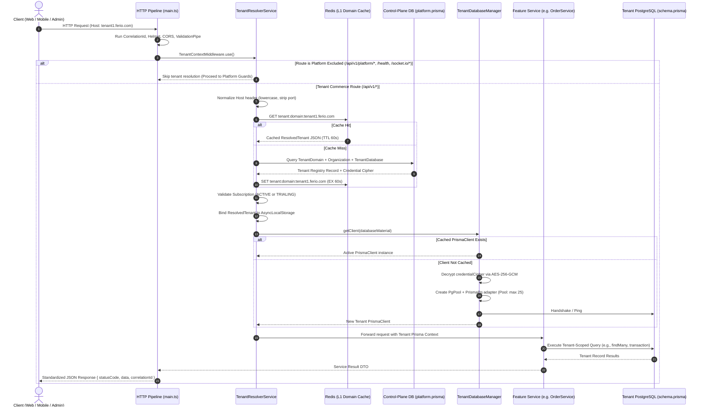
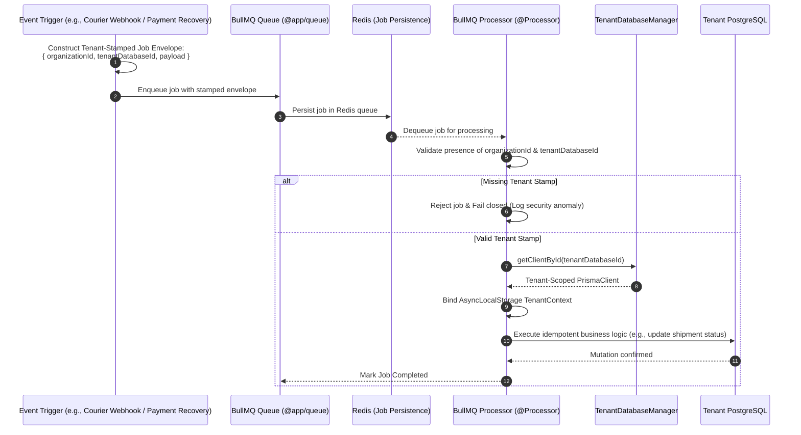

# Ferio Commerce SaaS — Backend Modular Architecture

This document provides a comprehensive, backend-oriented architectural specification and high-level module diagram for the **Ferio Commerce SaaS** platform. It reflects the implementation within [`ferio-nest-prisma`](file:///home/chillpc/MohammadSheakh/projects/26/e-commerce/e-com-nextjs/ferio-nest-prisma), adhering to the bounded feature context specifications of the [Product Requirements Document (PRD v2.1 §3.5 & §36A)](file:///home/chillpc/MohammadSheakh/projects/26/e-commerce/e-com-nextjs/_doc/multi-tenant/Ferio-Commerce-SaaS-PRD-v2.1.md) and the [Multi-Tenant Implementation Checklist](file:///home/chillpc/MohammadSheakh/projects/26/e-commerce/e-com-nextjs/_doc/multi-tenant/implementation-checklist-and-schedule-multitenant.md).

---

## 1. High-Level Backend Module Architecture Diagram

The diagram below illustrates the end-to-end backend topology: from HTTP ingress and tenant context resolution, through the control plane and 35+ tenant-scoped feature modules, to the asynchronous BullMQ worker fleet, Socket.IO gateway, shared libraries, and isolated database planes.

```mermaid
flowchart TB
    %% ─────────────────────────────────────────────────────────────────────────
    %% 1. Ingress & Global Middleware Pipeline
    %% ─────────────────────────────────────────────────────────────────────────
    subgraph INGRESS ["1. HTTP Ingress & Global Middleware Pipeline"]
        direction TB
        REQ["Incoming Client Request<br/>(Customer Web / Admin Web / Platform Web)"]
        CORR["Correlation ID Middleware<br/>(AsyncLocalStorage • X-Correlation-ID)"]
        HELMET["Security & Compression<br/>(Helmet Security Headers • Gzip Compression)"]
        CORS["CORS Policy<br/>(Customer Web / Admin Web / Platform Allowed Origins)"]
        VAL_PIPE["Global ValidationPipe<br/>(whitelist: true • forbidNonWhitelisted: true • transform)"]
        RESP_TRANS["Global Interceptors & Filters<br/>(TransformResponseInterceptor • LoggingInterceptor • HttpExceptionFilter)"]
        ROUTER{"Route Classifier<br/>Global Prefix: /api/v1/*"}

        REQ --> CORR
        CORR --> HELMET
        HELMET --> CORS
        CORS --> VAL_PIPE
        VAL_PIPE --> RESP_TRANS
        RESP_TRANS --> ROUTER
    end

    %% ─────────────────────────────────────────────────────────────────────────
    %% 2. Tenant Context & Security Gate
    %% ─────────────────────────────────────────────────────────────────────────
    subgraph TENANT_GATE ["2. Tenant Context & Isolation Gate (tenancy/)"]
        direction TB
        EXCLUDE_CHECK{"Is Excluded Route?<br/>/platform/* • /tenancy/* • /health • /socket.io/*"}
        TENANT_RESOLVER["TenantResolverService / Middleware<br/>1. Host header normalization (e.g. fashionhub.ferio.com)<br/>2. L1 Redis cache lookup (TTL 60s)<br/>3. L2 Control-Plane lookup (PlatformPrismaService)<br/>4. Subscription status check (ACTIVE / TRIALING)<br/>5. Fail-closed: No fallback to default DB"]
        TENANT_CONTEXT["AsyncLocalStorage Context<br/>{ organizationId, tenantDatabaseId, domainId, hostname, subscriptionStatus }"]
        TENANT_DB_MGR["TenantDatabaseManager<br/>• Bounded PrismaClient Pool (maxClients: 25)<br/>• Decrypts credentialCipher via SecretBox (AES-256-GCM)<br/>• Per-DB Circuit Breaker (3 failures / 30s cooldown)<br/>• LRU idle eviction (TTL: 300s)"]

        ROUTER -->|Commerce & Tenant Routes| EXCLUDE_CHECK
        EXCLUDE_CHECK -->|No| TENANT_RESOLVER
        TENANT_RESOLVER --> TENANT_CONTEXT
        TENANT_CONTEXT --> TENANT_DB_MGR
    end

    %% ─────────────────────────────────────────────────────────────────────────
    %% 3. Control Plane Subsystem
    %% ─────────────────────────────────────────────────────────────────────────
    subgraph PLATFORM_PLANE ["3. Platform Plane (Control Plane — src/platform)"]
        direction TB
        PLAT_GUARDS["Platform Auth & Roles Guard<br/>(PlatformAuthGuard • PlatformUser / PlatformRole)"]

        subgraph PLAT_CTRLS ["Platform Controllers"]
            direction TB
            CTRL_PLAT["PlatformController<br/>(/api/v1/platform/organizations)"]
            CTRL_DOM["PlatformDomainsController<br/>(/api/v1/platform/domains)"]
            CTRL_BILL["PlatformBillingController<br/>(/api/v1/platform/billing)"]
            CTRL_MIGR["PlatformMigrationsController<br/>(/api/v1/platform/migrations)"]
            CTRL_FLAGS["PlatformFeatureFlagsController<br/>(/api/v1/platform/feature-flags)"]
            CTRL_SUPP["PlatformSupportAccessController<br/>(/api/v1/platform/support-access)"]
            CTRL_BKUP["BackupEvidenceController<br/>(/api/v1/platform/backup-evidence)"]
        end

        subgraph PLAT_SVCS ["Platform Core Services"]
            direction TB
            SVC_ORGS["OrganizationsService & ProvisioningService<br/>(Org Lifecycle: DRAFT ➔ PROVISIONING ➔ ACTIVE)"]
            SVC_DOM["DomainsService & DomainReadinessService<br/>(DNS CNAME / TXT Verification • Primary Domain)"]
            SVC_PLANS["PlansService & SubscriptionsService<br/>(Plan Tiering • Entitlements Evaluation • Usage Overrides)"]
            SVC_MIGR_ORCH["MigrationOrchestratorService<br/>(Canary Fleet Migrations • Batch Execution • Pauses)"]
            SVC_SAAS_BILL["PlatformBillingService<br/>(SaaS Invoicing • Payment Attempts • Ledger)"]
            SVC_PROVIS["LocalPostgresProvisioner / DBProvisioner<br/>(CREATE DATABASE • Migration Bootstrapper • Seed)"]
            SVC_SUPP["SupportAccessService & PlatformAuditService<br/>(Time-Bounded Operator Impersonation & Audit)"]
            SVC_HEALTH["PlatformOperationsHealthService<br/>(DB Fleet Health • Migration Drift • Queue Depth)"]
        end

        ROUTER -->|/api/v1/platform/*| PLAT_GUARDS
        EXCLUDE_CHECK -->|Yes| PLAT_GUARDS
        PLAT_GUARDS --> PLAT_CTRLS
        CTRL_PLAT --> SVC_ORGS
        CTRL_DOM --> SVC_DOM
        CTRL_BILL --> SVC_PLANS
        CTRL_BILL --> SVC_SAAS_BILL
        CTRL_MIGR --> SVC_MIGR_ORCH
        CTRL_FLAGS --> SVC_HEALTH
        CTRL_SUPP --> SVC_SUPP
        CTRL_BKUP --> SVC_HEALTH
        SVC_ORGS --> SVC_PROVIS
    end

    %% ─────────────────────────────────────────────────────────────────────────
    %% 4. Tenant Plane Feature Modules (Modular Monolith)
    %% ─────────────────────────────────────────────────────────────────────────
    subgraph TENANT_PLANE ["4. Tenant Plane (Bounded Feature Modules — src/features)"]
        direction TB

        subgraph CTX_IDENTITY ["Identity & Access Context"]
            MOD_AUTH["AuthModule<br/>(AuthController • TokenService • OtpService)"]
            MOD_USER["UserModule<br/>(UserController • UserService • Profile)"]
            MOD_STAFF["StaffAccessModule<br/>(StaffAccessController • StaffInvitationService)"]
            MOD_CUST_ACC["CustomerAccountModule & CustomersModule<br/>(CustomerProfile • AddressBook • Linking)"]
        end

        subgraph CTX_CATALOG ["Catalog, Inventory & Merchandising Context"]
            MOD_CATALOG["CatalogModule<br/>(CatalogController • AdminCatalogController • CatalogService)"]
            MOD_CONTENT["ProductContentModule<br/>(Specifications • Features • ReviewBanners • YoutubeReviews)"]
            MOD_LOCATIONS["StoreLocationsModule<br/>(StoreLocationsController • StoreLocationsService)"]
        end

        subgraph CTX_CART_CHECKOUT ["Cart, Pricing & Checkout Context"]
            MOD_CART["CartModule<br/>(CartController • CartService • SavedCarts • PriceRevalidation)"]
            MOD_CHECKOUT["CheckoutModule<br/>(CheckoutController • CheckoutService • DeliveryZonePricing • COD Policy)"]
        end

        subgraph CTX_ORDER_FULFILL ["Order, Shipping & Delivery Context"]
            MOD_ORDER["OrderModule<br/>(OrderController • AdminOrderController • IdempotencyKey • ConfirmationStockReservation)"]
            MOD_SHIPPING["ShippingModule<br/>(ShippingController • AdminShippingController • CourierAdapters)"]
            MOD_DELIVERY["DeliveryPersonnelModule<br/>(DeliveryPersonnelController • LocationHistory • RiderPortal)"]
        end

        subgraph CTX_FINANCE ["Payments, Settlement & Financial Context"]
            MOD_PAYMENTS["CommercePaymentsModule<br/>(CommercePaymentsController • PaymentGatewayRegistry • CallbackOrchestration)"]
            MOD_SETTLE["SettlementsModule<br/>(SettlementsController • CourierSettlementParser • PostingService)"]
            MOD_REFUNDS["RefundsModule<br/>(RefundsController • RefundsService • LedgerAudit)"]
            MOD_WALLET["WalletModule<br/>(WalletController • CustomerWalletLedger • ImmutableTransactions)"]
        end

        subgraph CTX_CARE_REALTIME ["Customer Care, Engagement & Communication Context"]
            MOD_CHAT["ChattingModule<br/>(ChattingController • ChattingService • ConversationMemberships)"]
            MOD_NOTIF["CustomerNotificationsModule<br/>(CustomerNotificationsController • Inbox • Preferences)"]
            MOD_MESSAGING["TransactionalMessagingModule<br/>(TransactionalMessagingController • TemplateEngine • SMS/Email)"]
            MOD_PROD_REQ["ProductRequestModule<br/>(ProductRequestController • ProductRequestService)"]
            MOD_SERVICE["ServiceBookingModule & WarrantyModule<br/>(ServiceBookingController • WarrantyClaimService)"]
        end

        subgraph CTX_OPS_GOV ["Operations, Analytics & Governance Context"]
            MOD_ANALYTICS["StorefrontAnalyticsModule<br/>(StorefrontAnalyticsController • PrivacySafeHashing • Redaction)"]
            MOD_RECON["ReconciliationModule<br/>(ReconciliationController • ReconciliationScanService)"]
            MOD_REPORTS["ReportsModule<br/>(ReportsController • KeysetPagination • CSVStreamingExport • MaskedPII)"]
            MOD_AUDIT["AuditModule<br/>(AuditLogService • ImmutableAuditTrail)"]
            MOD_OPS_HEALTH["OperationsHealthModule<br/>(OperationsHealthController • DependencyProbes)"]
            MOD_STORAGE["StorageModule<br/>(StorageController • CloudflareR2Strategy • MalwareScanner)"]
        end

        TENANT_DB_MGR --> CTX_IDENTITY
        TENANT_DB_MGR --> CTX_CATALOG
        TENANT_DB_MGR --> CTX_CART_CHECKOUT
        TENANT_DB_MGR --> CTX_ORDER_FULFILL
        TENANT_DB_MGR --> CTX_FINANCE
        TENANT_DB_MGR --> CTX_CARE_REALTIME
        TENANT_DB_MGR --> CTX_OPS_GOV
    end

    %% ─────────────────────────────────────────────────────────────────────────
    %% 5. Realtime Socket.IO Subsystem
    %% ─────────────────────────────────────────────────────────────────────────
    subgraph REALTIME ["5. Realtime Gateway Subsystem (Port: 6734)"]
        direction TB
        SOCK_REST["REST Ticket Issuance<br/>(POST /api/v1/auth/socket-ticket)"]
        SOCK_GATEWAY["SocketGateway (NestJS WebSocketGateway)<br/>• Handshake Ticket Validation (Redis 60s nonce)<br/>• Tenant-Scoped Room Isolation:<br/>  - tenant:{orgId}:room<br/>  - tenant:{orgId}:user:{userId}<br/>  - tenant:{orgId}:order:{orderId}"]
        SOCK_REDIS["Redis Pub/Sub Adapter<br/>(Horizontal Gateway Cluster Sync)"]

        MOD_AUTH --> SOCK_REST
        SOCK_REST -.->|Issues 60s single-use ticket| SOCK_GATEWAY
        SOCK_GATEWAY <--> SOCK_REDIS
        MOD_CHAT -->|Emit message event| SOCK_GATEWAY
        MOD_ORDER -->|Emit status update| SOCK_GATEWAY
    end

    %% ─────────────────────────────────────────────────────────────────────────
    %% 6. Asynchronous Processing & Queue Fleet (BullMQ)
    %% ─────────────────────────────────────────────────────────────────────────
    subgraph QUEUE_FLEET ["6. Asynchronous Queue & Background Worker Fleet (BullMQ)"]
        direction TB

        subgraph QUEUES ["BullMQ Named Queues (@app/queue)"]
            Q_MIGR["tenantMigrationQueue-ferio"]
            Q_COURIER_CB["courierCallbackQueue-ferio"]
            Q_COURIER_POLL["courierPollQueue-ferio"]
            Q_NOTIFY["notify-participants-queue-suplify"]
            Q_RECON["reconciliationQueue-ferio"]
            Q_RETENTION["retentionQueue-ferio"]
            Q_TRANS_MSG["transactionalMessageQueue-ferio"]
            Q_PAY_REC["paymentRecoveryQueue-ferio"]
        end

        subgraph PROCESSORS ["Tenant-Stamped BullMQ Processors"]
            P_MIGR["MigrationOrchestratorProcessor<br/>(@Processor TENANT_MIGRATION)"]
            P_COURIER_CB["ShippingWebhookProcessor<br/>(@Processor COURIER_CALLBACK)"]
            P_COURIER_POLL["ShippingPollingProcessor<br/>(@Processor COURIER_POLL)"]
            P_NOTIFY["ChatNotificationProcessor<br/>(@Processor NOTIFY_PARTICIPANTS)"]
            P_RECON["ReconciliationProcessor<br/>(@Processor RECONCILIATION)"]
            P_RETENTION["RetentionProcessor<br/>(@Processor RETENTION)"]
            P_TRANS_MSG["TransactionalMessageProcessor<br/>(@Processor TRANSACTIONAL_MESSAGE)"]
            P_PAY_REC["PaymentRecoveryProcessor<br/>(@Processor PAYMENT_RECOVERY)"]
        end

        Q_MIGR --> P_MIGR
        Q_COURIER_CB --> P_COURIER_CB
        Q_COURIER_POLL --> P_COURIER_POLL
        Q_NOTIFY --> P_NOTIFY
        Q_RECON --> P_RECON
        Q_RETENTION --> P_RETENTION
        Q_TRANS_MSG --> P_TRANS_MSG
        Q_PAY_REC --> P_PAY_REC

        SVC_MIGR_ORCH -->|Enqueue job| Q_MIGR
        MOD_SHIPPING -->|Enqueue callback/poll| Q_COURIER_CB
        MOD_SHIPPING -->|Enqueue poll| Q_COURIER_POLL
        MOD_CHAT -->|Enqueue push/notification| Q_NOTIFY
        MOD_RECON -->|Enqueue audit run| Q_RECON
        TENANT_GATE -->|Enqueue data sweep| Q_RETENTION
        MOD_MESSAGING -->|Enqueue SMS/Email| Q_TRANS_MSG
        MOD_PAYMENTS -->|Enqueue recovery job| Q_PAY_REC
    end

    %% ─────────────────────────────────────────────────────────────────────────
    %% 7. Shared Libraries & Core Layer
    %% ─────────────────────────────────────────────────────────────────────────
    subgraph SHARED_LIBS ["7. Shared Workspace Libraries & Core (libs/* & src/core)"]
        direction LR
        LIB_COMMON["@app/common<br/>• CorrelationId (AsyncLocalStorage)<br/>• StructuredLogger & TenantMetrics<br/>• TransformResponseInterceptor<br/>• HttpExceptionFilter • SecretBox"]
        LIB_DB["@app/database<br/>• PrismaModule<br/>• PrismaService<br/>• Dynamic Connection Pool"]
        LIB_REDIS["@app/redis<br/>• RedisModule & RedisService<br/>• Distributed Lock (Redlock)<br/>• Sliding-Window Rate Limiter<br/>• Domain & Ticket Caching"]
        LIB_QUEUE["@app/queue<br/>• BullMQModule<br/>• Queue Factory<br/>• Stamped Job Envelope"]
        LIB_NOTIF["@app/notification<br/>• Notification Dispatch<br/>• Channel Abstraction"]
    end

    %% ─────────────────────────────────────────────────────────────────────────
    %% 8. Data Persistence & External Integrations
    %% ─────────────────────────────────────────────────────────────────────────
    subgraph EXTERNAL_BOUNDARY ["8. Data Persistence & External Provider Boundaries"]
        direction TB

        subgraph DATABASES ["Persistence Tier (PostgreSQL & Redis)"]
            DB_CONTROL[("Control-Plane PostgreSQL<br/>(platform.prisma)<br/>• Organizations, Domains<br/>• Plans, Subscriptions<br/>• TenantDatabase Registry<br/>• Migration Runs, SaaS Billing")]
            DB_TENANTS[("Tenant PostgreSQL Fleet<br/>(schema.prisma — Database-per-Tenant)<br/>• Catalog, Inventory, Customers<br/>• Carts, Orders, Payments<br/>• Shipments, Chat, Wallet, Audit")]
            STORAGE_REDIS[("Redis 7 (Standalone / Cluster)<br/>• Tenant Domain Cache (60s)<br/>• Session & OTP Tokens<br/>• BullMQ Queues & Job State<br/>• Rate Limit Sorted Sets")]
        end

        subgraph EXT_PROVIDERS ["External SaaS & Provider Gateways"]
            EXT_PAY["Payment Gateways<br/>• SSLCommerz<br/>• AamarPay<br/>• bKash / Nagad Direct"]
            EXT_COURIER["Courier Delivery Gateways<br/>• Pathao Courier API<br/>• Steadfast Courier API<br/>• RedX • Paperfly • eCourier • Carrybee"]
            EXT_MSG["Transactional Messaging<br/>• SMS Gateway Providers<br/>• SMTP / Amazon SES"]
            EXT_STORAGE["Object Storage<br/>• Cloudflare R2 / AWS S3<br/>• Presigned Upload URLs"]
        end
    end

    %% ─────────────────────────────────────────────────────────────────────────
    %% Connections from Feature Modules to Persistence & External Providers
    %% ─────────────────────────────────────────────────────────────────────────
    PLAT_SVCS -->|PlatformPrismaService| DB_CONTROL
    TENANT_DB_MGR -->|Resolves isolated PrismaClient| DB_TENANTS
    PROCESSORS -->|Stamps tenant envelope & connects| DB_TENANTS
    INGRESS --> LIB_COMMON
    INGRESS --> LIB_REDIS
    TENANT_GATE --> LIB_REDIS
    QUEUE_FLEET --> STORAGE_REDIS
    QUEUE_FLEET --> LIB_QUEUE

    MOD_PAYMENTS -->|Payment Initiation & Verification| EXT_PAY
    MOD_SHIPPING -->|Shipment Creation & Status Tracking| EXT_COURIER
    MOD_MESSAGING -->|SMS & Email Delivery| EXT_MSG
    MOD_STORAGE -->|Presigned Uploads & File Ops| EXT_STORAGE
    MOD_ANALYTICS -->|Durable pseudonymized events| DB_TENANTS

    %% ─────────────────────────────────────────────────────────────────────────
    %% Styling Classes (Harmonious Palette)
    %% ─────────────────────────────────────────────────────────────────────────
    classDef ingressStyle fill:#f0f7ff,stroke:#2b6cb0,stroke-width:1.5px,color:#1a365d;
    classDef gateStyle fill:#fef3c7,stroke:#d97706,stroke-width:2px,color:#78350f;
    classDef platformStyle fill:#ecfdf5,stroke:#059669,stroke-width:1.5px,color:#064e3b;
    classDef tenantStyle fill:#ffffff,stroke:#3b82f6,stroke-width:1.5px,color:#1e3a8a;
    classDef workerStyle fill:#faf5ff,stroke:#7c3aed,stroke-width:1.5px,color:#4c1d95;
    classDef dbStyle fill:#fffbeb,stroke:#b45309,stroke-width:2px,color:#78350f;
    classDef extStyle fill:#fdf2f8,stroke:#db2777,stroke-width:1.5px,color:#831843;
    classDef libStyle fill:#f8fafc,stroke:#475569,stroke-width:1.5px,color:#0f172a;

    class INGRESS,REQ,CORR,HELMET,CORS,VAL_PIPE,RESP_TRANS,ROUTER ingressStyle;
    class TENANT_GATE,TENANT_RESOLVER,TENANT_CONTEXT,TENANT_DB_MGR,EXCLUDE_CHECK gateStyle;
    class PLATFORM_PLANE,PLAT_GUARDS,CTRL_PLAT,CTRL_DOM,CTRL_BILL,CTRL_MIGR,CTRL_FLAGS,CTRL_SUPP,CTRL_BKUP,SVC_ORGS,SVC_DOM,SVC_PLANS,SVC_MIGR_ORCH,SVC_SAAS_BILL,SVC_PROVIS,SVC_SUPP,SVC_HEALTH platformStyle;
    class TENANT_PLANE,CTX_IDENTITY,CTX_CATALOG,CTX_CART_CHECKOUT,CTX_ORDER_FULFILL,CTX_FINANCE,CTX_CARE_REALTIME,CTX_OPS_GOV tenantStyle;
    class QUEUE_FLEET,QUEUES,PROCESSORS,REALTIME,SOCK_REST,SOCK_GATEWAY,SOCK_REDIS workerStyle;
    class DB_CONTROL,DB_TENANTS,STORAGE_REDIS dbStyle;
    class EXT_PAY,EXT_COURIER,EXT_MSG,EXT_STORAGE extStyle;
    class SHARED_LIBS,LIB_COMMON,LIB_DB,LIB_REDIS,LIB_QUEUE,LIB_NOTIF libStyle;
```

---

## 2. Request Lifecycle & Ingress Resolution Flow

Every inbound HTTP request undergoes strict isolation and routing before any business logic executes. This sequence enforces the **Mandatory Isolation Invariant**:



---

## 3. Asynchronous Worker & Tenant-Stamped Job Lifecycle

Background asynchronous jobs (courier webhooks, payment recovery, chat notifications, reconciliation sweeps) follow an immutable tenant-stamped pattern to guarantee that jobs never cross database boundaries.



---

## 4. Complete Backend Module Inventory & Responsibility Matrix

The table below outlines all NestJS modules in [`ferio-nest-prisma/src`](file:///home/chillpc/MohammadSheakh/projects/26/e-commerce/e-com-nextjs/ferio-nest-prisma/src), detailing their controllers, application services, associated BullMQ queues, and data plane tier:

| Module Directory | Primary Controllers | Core Application Services | Associated BullMQ Queues / Processors | Target Data Plane |
| :--- | :--- | :--- | :--- | :--- |
| **`platform`** | `PlatformController`, `PlatformDomainsController`, `PlatformBillingController`, `PlatformMigrationsController`, `PlatformFeatureFlagsController`, `PlatformSupportAccessController`, `BackupEvidenceController` | `OrganizationsService`, `DomainsService`, `PlansService`, `SubscriptionsService`, `PlatformBillingService`, `MigrationOrchestratorService`, `ProvisioningService`, `SupportAccessService` | `tenantMigrationQueue-ferio`<br/>(`MigrationOrchestratorProcessor`) | **Control Plane** (`platform.prisma`) |
| **`tenancy`** | Exposes middleware & internal services | `TenantResolverService`, `TenantDatabaseManager`, `TenantSchemaBootstrapper`, `UsageReconciliationService`, `RetentionSweepService` | `retentionQueue-ferio`<br/>(`RetentionProcessor`) | **Infrastructure Bridge** |
| **`features/authentication`** | `AuthController` | `AuthService`, `TokenService`, `OtpService`, `PasswordService` | None (Direct Redis rate-limiting) | **Tenant Plane** |
| **`features/user-management`** | `UserController` | `UserService`, `UserProfileService` | None | **Tenant Plane** |
| **`features/staff-access`** | `StaffAccessController` | `StaffAccessService`, `StaffInvitationService` | None | **Tenant Plane** |
| **`features/customers`** | `CustomersController` | `CustomersService`, `CustomerLinkingService` | None | **Tenant Plane** |
| **`features/customer-account`** | `CustomerAccountController` | `CustomerAccountService`, `AddressBookService` | None | **Tenant Plane** |
| **`features/catalog`** | `CatalogController`, `AdminCatalogController` | `CatalogService`, `CategoryService`, `ProductVariantService`, `InventoryService` | None | **Tenant Plane** |
| **`features/product-content`** | `ProductContentController` | `ProductSpecificationService`, `ProductReviewBannerService`, `ProductYoutubeReviewService` | None | **Tenant Plane** |
| **`features/store-locations`** | `StoreLocationsController` | `StoreLocationsService` | None | **Tenant Plane** |
| **`features/cart`** | `CartController` | `CartService`, `SavedCartService`, `CartValidationService` | None | **Tenant Plane** |
| **`features/checkout`** | `CheckoutController`, `AdminDeliveryZoneController` | `CheckoutService`, `DeliveryZoneService`, `CodVerificationPolicyService` | None | **Tenant Plane** |
| **`features/order`** | `OrderController`, `AdminOrderController` | `OrderService`, `OrderFulfillmentService`, `OrderReservationService` | Emits Socket.IO order update events | **Tenant Plane** |
| **`features/shipping`** | `ShippingController`, `AdminShippingController`, `ShippingWebhookController` | `ShippingService`, `CourierAdapterRegistry` (`PathaoAdapter`, `SteadfastAdapter`, `RedxAdapter`, `PaperflyAdapter`, `EcourierAdapter`, `CarrybeeAdapter`) | `courierCallbackQueue-ferio`<br/>`courierPollQueue-ferio` | **Tenant Plane** |
| **`features/delivery-personnel`**| `DeliveryPersonnelController` | `DeliveryPersonnelService`, `LocationTrackingService` | None | **Tenant Plane** |
| **`features/commerce-payments`** | `CommercePaymentsController`, `AdminPaymentLedgerController` | `CommercePaymentsService`, `PaymentGatewayRegistry` (`SslcommerzGateway`, `AamarpayGateway`) | `paymentRecoveryQueue-ferio`<br/>(`PaymentRecoveryProcessor`) | **Tenant Plane** |
| **`features/settlements`** | `SettlementsController` | `SettlementsService`, `CourierSettlementParser`, `SettlementPostingService` | None | **Tenant Plane** |
| **`features/refunds`** | `RefundsController` | `RefundsService`, `RefundLedgerService` | None | **Tenant Plane** |
| **`features/rto`** | `RtoController` | `RtoService`, `RtoDispositionService` | None | **Tenant Plane** |
| **`features/wallet`** | `WalletController` | `WalletService`, `WalletLedgerService` | None | **Tenant Plane** |
| **`features/socket-gateway`** | `SocketTicketController` | `SocketGateway`, `TicketVerificationService`, `RoomManagerService` | Realtime WebSocket on Port 6734 | **Tenant Plane** |
| **`features/chatting`** | `ChattingController` | `ChattingService`, `ConversationService` | `notify-participants-queue-suplify`<br/>(`ChatNotificationProcessor`) | **Tenant Plane** |
| **`features/customer-notifications`**| `CustomerNotificationsController` | `CustomerNotificationsService`, `NotificationPreferencesService` | None | **Tenant Plane** |
| **`features/transactional-messaging`**| `TransactionalMessagingController`| `TransactionalMessagingService`, `MessageAdapterRegistry` | `transactionalMessageQueue-ferio`<br/>(`TransactionalMessageProcessor`) | **Tenant Plane** |
| **`features/product-request`** | `ProductRequestController` | `ProductRequestService` | None | **Tenant Plane** |
| **`features/service-booking`** | `ServiceBookingController` | `ServiceBookingService` | None | **Tenant Plane** |
| **`features/warranty`** | `WarrantyController` | `WarrantyService`, `WarrantyClaimService` | None | **Tenant Plane** |
| **`features/storefront-analytics`**| `StorefrontAnalyticsController`| `StorefrontAnalyticsService` (Privacy-safe HMAC visitor hashing) | None | **Tenant Plane** |
| **`features/reconciliation`** | `ReconciliationController` | `ReconciliationService`, `ReconciliationScanner` | `reconciliationQueue-ferio`<br/>(`ReconciliationProcessor`) | **Tenant Plane** |
| **`features/reports`** | `AdminReportsController` | `ReportsService`, `CsvExportStreamService` (Masked PII, Keyset cursor) | None | **Tenant Plane** |
| **`features/audit`** | Read-only service layer | `AuditLogService` | Append-only audit records across modules | **Tenant Plane** |
| **`features/settings`** | `SettingsController` | `SettingsService`, `FeatureFlagSettingsService` | None | **Tenant Plane** |
| **`features/operations-health`** | `OperationsHealthController` | `OperationsHealthService` (DB, Redis, BullMQ probes) | None | **Hybrid Health** |
| **`features/storage`** | `StorageController` | `StorageService`, `R2StorageStrategy`, `MalwareScanner` | Presigned URL upload lifecycle | **Tenant Plane** |
| **`features/purchase-activity`**| `PurchaseActivityController` | `PurchaseActivityService` (Public aggregated activity) | None | **Tenant Plane** |
| **`features/attachments`** | `AttachmentsController` | `AttachmentsService` | None | **Tenant Plane** |

---

## 5. Architectural Invariants & Failure Modes

### 5.1 The Mandatory Isolation Invariant
For every tenant-scoped operation (HTTP request, async worker job, websocket packet):
```text
ResolvedTenant(request / job / event)
    == TenantOfDatabaseConnection
    == TenantOfAuthorizationScope
    == TenantOfCache / Job / Storage Namespace
```
- **Fail-Closed Contract:** Any mismatch between the routing host, the authenticated user's organization membership, or the active database connection results in an immediate `403 Forbidden` / `TenantResolutionException` with zero fallback to other tenant databases or legacy databases.
- **Client Keying Invariant:** Tenant Prisma clients are keyed strictly by the control plane's immutable `TenantDatabase.id`, never by client-supplied database credentials or connection strings.
- **Connection Cap & Eviction:** The `TenantDatabaseManager` enforces a hard ceiling (`TENANT_DB_MAX_CLIENTS = 25` by default) with an LRU sweeper evicting pools idle for more than 300 seconds.
- **Circuit Breaker:** If a tenant database incurs 3 consecutive connection failures, the breaker opens for 30 seconds, immediately short-circuiting downstream calls to protect the overall API server from socket exhaustion.

### 5.2 Control Plane vs. Tenant Plane Isolation
- **Dual Prisma Schemas:** The control plane uses `prisma/platform.prisma` targeting the central Control PostgreSQL, while tenant business data resides in individual tenant databases governed by `prisma/schema.prisma`.
- **Zero Cross-Querying:** The application code never executes relational joins between control-plane tables (`Organization`, `Plan`, `TenantDatabase`) and tenant commerce tables (`Order`, `Product`, `Customer`).
- **Billing Separation:**
  ```text
  TENANT OWNER  ──> Pays Ferio  ──> SaaS Subscription (SaasInvoice, SaasPaymentAttempt in Control DB)
  CUSTOMER      ──> Pays Tenant ──> Commerce Order (Order, PaymentAttempt in Tenant DB)
  ```

---

## 6. Shared Workspace Libraries (`libs/`)

1. **`@app/database` (`libs/database`)**: Houses the shared `PrismaModule` and database connection utilities, allowing dynamic pool instantiation with pg adapter hooks.
2. **`@app/redis` (`libs/redis`)**: Provides Redis client lifecycle management, atomic operations, distributed locking primitives (Redlock), and sliding-window rate-limiting.
3. **`@app/queue` (`libs/queue`)**: Centralizes BullMQ queue configurations, queue token constants (`QUEUE_NAMES`), and ensures standardized error handling across async workers.
4. **`@app/common` (`libs/common`)**: Houses cross-cutting concerns:
   - `AsyncLocalStorage` correlation ID management (`runWithCorrelationId`)
   - `TransformResponseInterceptor` for uniform API responses (`{ success: true, data: ... }`)
   - `HttpExceptionFilter` for sanitized error responses
   - `SecretBox` (`encryptSecret`, `decryptSecret`) utilizing authenticated AES-256-GCM encryption for database credentials and courier API keys
5. **`@app/notification` (`libs/notification`)**: Shared abstractions for multi-channel message dispatch.
