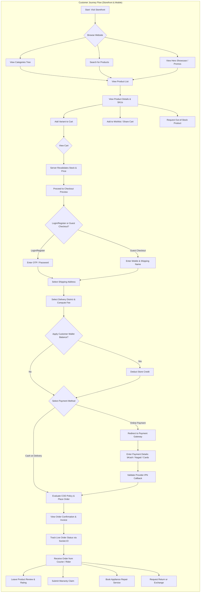

# Ferio Commerce — Customer Storefront Backend Architecture

This document provides a **backend-oriented architectural specification and module diagram** specifically focused on the **Customer-Facing Storefront** surface of the Ferio Commerce SaaS platform. It details how the NestJS backend handles customer requests, guest sessions, catalog discovery, cart revalidation, server-priced checkout, idempotent order creation, payment gateways, realtime notifications, and customer self-service.

---

## 1. Customer Storefront Backend Module Architecture Diagram

```mermaid
flowchart TB
    %% ─────────────────────────────────────────────────────────────────────────
    %% 1. Ingress & Client Surface
    %% ─────────────────────────────────────────────────────────────────────────
    subgraph CLIENT_LAYER ["1. Customer Clients & Ingress Surface"]
        direction TB
        WEB_STORE["Tenant Storefront Web<br/>(Next.js SSR / BFF on fashionhub.ferio.com)"]
        MOB_APP["Customer Mobile App<br/>(Expo / React Native App)"]
        
        CORR_ID["Correlation Middleware<br/>(runWithCorrelationId • X-Correlation-ID)"]
        SEC_HEADERS["Security & Limits<br/>(Helmet • CORS for Storefront Origin • Gzip)"]
        VAL_PIPE["Validation Pipe<br/>(whitelist: true • transform DTOs)"]

        WEB_STORE --> CORR_ID
        MOB_APP --> CORR_ID
        CORR_ID --> SEC_HEADERS
        SEC_HEADERS --> VAL_PIPE
    end

    %% ─────────────────────────────────────────────────────────────────────────
    %% 2. Host Resolution & Tenant Context Gate
    %% ─────────────────────────────────────────────────────────────────────────
    subgraph RESOLUTION_GATE ["2. Storefront Tenant Resolution Gate (src/tenancy)"]
        direction TB
        RESOLVER["TenantResolverService / Middleware<br/>• Normalizes Host header (e.g., fashionhub.ferio.com)<br/>• L1 Redis Domain Cache (TTL 60s)<br/>• L2 Platform Registry Lookup (TenantDomain + Organization)<br/>• Evaluates Subscription Status (ACTIVE / TRIALING)<br/>• Fail-Closed: 404/403 if tenant invalid"]
        STORE_CONTEXT["AsyncLocalStorage Tenant Context<br/>{ organizationId, tenantDatabaseId, domainId, hostname }"]
        TENANT_POOL["TenantDatabaseManager<br/>• Acquires cached PrismaClient (maxClients: 25)<br/>• Decrypts tenant credentials via AES-256-GCM<br/>• Circuit breaker protected (3 failures / 30s)"]

        VAL_PIPE --> RESOLVER
        RESOLVER --> STORE_CONTEXT
        STORE_CONTEXT --> TENANT_POOL
    end

    %% ─────────────────────────────────────────────────────────────────────────
    %% 3. Customer Identity & Session Management
    %% ─────────────────────────────────────────────────────────────────────────
    subgraph CUST_IDENTITY ["3. Customer Identity & Session Layer"]
        direction TB
        GUEST_SESSION["Guest Session Handler<br/>• Opaque guest cart token stored as SHA-256 hash<br/>• Kept in HTTP-only Customer Web cookie"]
        CUST_AUTH["Customer Auth & OTP Controller<br/>• POST /api/v1/auth/customer/send-otp<br/>• POST /api/v1/auth/customer/verify-otp<br/>• POST /api/v1/auth/customer/login<br/>• POST /api/v1/auth/customer/refresh-token"]
        ACCOUNT_LINK["Account Linking Service<br/>• Links guest cart & order history to registered customer<br/>• Order-proof account linking without data loss"]
        CUST_PROFILE["Customer Profile & Address Book<br/>• GET/PATCH /api/v1/customers/me<br/>• GET/POST/PATCH /api/v1/customers/me/addresses"]

        TENANT_POOL --> GUEST_SESSION
        TENANT_POOL --> CUST_AUTH
        CUST_AUTH --> ACCOUNT_LINK
        ACCOUNT_LINK --> CUST_PROFILE
    end

    %% ─────────────────────────────────────────────────────────────────────────
    %% 4. Catalog Discovery & Merchandising Modules
    %% ─────────────────────────────────────────────────────────────────────────
    subgraph CUST_CATALOG ["4. Catalog & Merchandising Context (src/features/catalog)"]
        direction TB
        CTRL_CATALOG["CatalogController<br/>• GET /api/v1/catalog/categories (Hierarchy tree)<br/>• GET /api/v1/catalog/products (Paginated & Filtered)<br/>• GET /api/v1/catalog/products/:slug (Product details)"]
        CTRL_CONTENT["ProductContentController<br/>• GET /api/v1/catalog/products/:id/specifications<br/>• GET /api/v1/catalog/products/:id/features<br/>• GET /api/v1/catalog/products/:id/reviews<br/>• GET /api/v1/catalog/products/:id/youtube-banners"]
        CTRL_LOCATIONS["StoreLocationsController<br/>• GET /api/v1/store-locations (In-store pickup desks)"]
        
        SVC_CATALOG["CatalogService<br/>• Applies PUBLISHED status filter<br/>• Formats integer minor units (e.g. 145000 = ৳1,450.00)<br/>• Checks variant stock availability in real time"]

        CTRL_CATALOG --> SVC_CATALOG
        CTRL_CONTENT --> SVC_CATALOG
    end

    %% ─────────────────────────────────────────────────────────────────────────
    %% 5. Cart, Pricing & Checkout Preview Modules
    %% ─────────────────────────────────────────────────────────────────────────
    subgraph CUST_CHECKOUT ["5. Cart & Checkout Context (src/features/cart & checkout)"]
        direction TB
        CTRL_CART["CartController<br/>• GET /api/v1/cart (Fetch cart lines & summary)<br/>• POST /api/v1/cart/items (Add SKU with quantity)<br/>• PATCH /api/v1/cart/items/:variantId (Update qty)<br/>• DELETE /api/v1/cart/items/:variantId (Remove item)<br/>• POST /api/v1/cart/validate (Server revalidation)"]
        
        SVC_CART_VAL["CartRevalidationService<br/>• Rechecks SKU publication, active pricing & stock<br/>• Recomputes integer line subtotals without locking stock<br/>• Rejects disabled variants & zero-stock items"]
        
        CTRL_CHECKOUT["CheckoutController<br/>• GET /api/v1/checkout/delivery-options<br/>• POST /api/v1/checkout/preview (Draft creation)"]
        
        SVC_CHECKOUT["CheckoutService & DeliveryZoneService<br/>• Validates Bangladesh mobile (+8801...)<br/>• Computes district-based shipping fee & free-delivery threshold<br/>• Evaluates COD Eligibility (CodVerificationPolicy)<br/>• Persists 24-Hour CheckoutDraft"]

        CTRL_CART --> SVC_CART_VAL
        CTRL_CHECKOUT --> SVC_CHECKOUT
        SVC_CART_VAL --> SVC_CHECKOUT
    end

    %% ─────────────────────────────────────────────────────────────────────────
    %% 6. Order Placement, Payment & Stock Reservation
    %% ─────────────────────────────────────────────────────────────────────────
    subgraph CUST_ORDER ["6. Order Placement & Payment Flow (src/features/order & payments)"]
        direction TB
        CTRL_ORDER["OrderController<br/>• POST /api/v1/checkout/orders<br/>  (Mandatory Idempotency-Key header)"]
        
        SVC_ORDER["OrderService (Serializable Transaction)<br/>1. Verifies Idempotency-Key to prevent double billing<br/>2. Takes immutable customer address & item snapshots<br/>3. Computes final payable amount in integer cents<br/>4. Creates Order with PENDING status<br/>5. For Prepaid: Creates PaymentAttempt with provider redirect<br/>6. For COD: Awaits staff verification or auto-confirms"]
        
        CTRL_PAYMENTS["CommercePaymentsController<br/>• POST /api/v1/payments/initiate<br/>• POST /api/v1/payments/callback/:gateway (SSLCommerz / AamarPay)<br/>• GET /api/v1/payments/status/:orderId"]

        GATEWAY_REG["PaymentGatewayRegistry<br/>• SSLCommerz Gateway (Hosted Session & IPN)<br/>• AamarPay Gateway (Direct checkout & callback)<br/>• bKash / Nagad Direct Adapters"]

        CTRL_ORDER --> SVC_ORDER
        SVC_ORDER --> CTRL_PAYMENTS
        CTRL_PAYMENTS --> GATEWAY_REG
    end

    %% ─────────────────────────────────────────────────────────────────────────
    %% 7. Customer Care, Realtime & Self-Service
    %% ─────────────────────────────────────────────────────────────────────────
    subgraph CUST_CARE ["7. Customer Care, Engagement & Services"]
        direction TB
        SOCK_GATEWAY["SocketGateway (Port: 6734)<br/>• Ticket handshake handshake via POST /api/v1/auth/socket-ticket<br/>• Tenant room: tenant:{orgId}:user:{userId}<br/>• Order room: tenant:{orgId}:order:{orderId}"]
        
        CTRL_CHAT["ChattingController<br/>• POST /api/v1/chatting/conversations (Customer support chat)<br/>• POST /api/v1/chatting/messages"]
        
        CTRL_NOTIF["CustomerNotificationsController<br/>• GET /api/v1/customer-notifications/inbox<br/>• PATCH /api/v1/customer-notifications/:id/read"]

        CTRL_SERVICES["ServiceBooking & Warranty Claims<br/>• POST /api/v1/service-booking (Appliance repair request)<br/>• POST /api/v1/warranty/claims (Warranty submission)<br/>• POST /api/v1/product-requests (Out-of-stock sourcing)"]

        CTRL_WALLET["WalletController<br/>• GET /api/v1/wallet/me (Balance & transactions)<br/>• POST /api/v1/wallet/redeem (Checkout deduction)"]

        CTRL_ANALYTICS["StorefrontAnalyticsController<br/>• POST /api/v1/storefront-analytics/events<br/>• Privacy-safe HMAC visitor hashing (ANALYTICS_HASH_SECRET)<br/>• Strips PII, search terms, user agents & query strings"]
    end

    %% ─────────────────────────────────────────────────────────────────────────
    %% 8. Tenant Data Plane
    %% ─────────────────────────────────────────────────────────────────────────
    subgraph DATA_PLANE ["8. Tenant PostgreSQL Database Plane (schema.prisma)"]
        direction LR
        DB_CATALOG[("Category, Brand, Product,<br/>ProductVariant, InventoryStock")]
        DB_CART[("Cart, CartItem,<br/>SavedCart, CheckoutDraft")]
        DB_ORDER[("Order, OrderAddress,<br/>OrderItem, OrderStatusHistory")]
        DB_PAYMENT[("PaymentAttempt,<br/>CustomerWallet, WalletTransaction")]
        DB_CARE[("Conversation, Message,<br/>Notification, WarrantyClaim")]
        DB_ANALYTICS[("StorefrontAnalyticsEvent<br/>(Pseudonymized & Redacted)")]
    end

    %% Wiring
    TENANT_POOL --> CUST_CATALOG
    TENANT_POOL --> CUST_CHECKOUT
    TENANT_POOL --> CUST_ORDER
    TENANT_POOL --> CUST_CARE

    SVC_CATALOG --> DB_CATALOG
    SVC_CART_VAL --> DB_CART
    SVC_CHECKOUT --> DB_CART
    SVC_ORDER --> DB_ORDER
    GATEWAY_REG --> DB_PAYMENT
    CTRL_WALLET --> DB_PAYMENT
    CTRL_CHAT --> DB_CARE
    CTRL_SERVICES --> DB_CARE
    CTRL_ANALYTICS --> DB_ANALYTICS
    CTRL_CHAT --> SOCK_GATEWAY

    %% Classes
    classDef clientStyle fill:#e0f2fe,stroke:#0284c7,stroke-width:1.5px,color:#0369a1;
    classDef gateStyle fill:#fef3c7,stroke:#d97706,stroke-width:2px,color:#78350f;
    classDef domainStyle fill:#ffffff,stroke:#3b82f6,stroke-width:1.5px,color:#1e3a8a;
    classDef realtimeStyle fill:#faf5ff,stroke:#9333ea,stroke-width:1.5px,color:#581c87;
    classDef dbStyle fill:#fffbeb,stroke:#b45309,stroke-width:2px,color:#78350f;

    class CLIENT_LAYER,WEB_STORE,MOB_APP,CORR_ID,SEC_HEADERS,VAL_PIPE clientStyle;
    class RESOLUTION_GATE,RESOLVER,STORE_CONTEXT,TENANT_POOL gateStyle;
    class CUST_IDENTITY,CUST_CATALOG,CUST_CHECKOUT,CUST_ORDER,SVC_CATALOG,SVC_CART_VAL,SVC_CHECKOUT,SVC_ORDER,GATEWAY_REG domainStyle;
    class CUST_CARE,SOCK_GATEWAY,CTRL_CHAT,CTRL_NOTIF,CTRL_SERVICES,CTRL_WALLET,CTRL_ANALYTICS realtimeStyle;
    class DATA_PLANE,DB_CATALOG,DB_CART,DB_ORDER,DB_PAYMENT,DB_CARE,DB_ANALYTICS dbStyle;
```

---

## 2. Customer Storefront End-to-End User Flow Diagram

---

## 3. Customer Storefront Endpoints & Services Inventory

The table below catalogs all customer-facing endpoints and their internal backend execution flow:

| Module | Route & Method | Auth / Context Guard | Underlying Service | Key Database Models Accessed |
| :--- | :--- | :--- | :--- | :--- |
| **Catalog** | `GET /api/v1/catalog/categories` | Public / Tenant Resolved | `CatalogService.getCategories` | `Category` (tree query, active only) |
| **Catalog** | `GET /api/v1/catalog/products` | Public / Tenant Resolved | `CatalogService.getProducts` | `Product`, `ProductVariant`, `InventoryStock` |
| **Catalog** | `GET /api/v1/catalog/products/:slug` | Public / Tenant Resolved | `CatalogService.getProductBySlug` | `Product`, `ProductVariant`, `ProductMedia` |
| **Content** | `GET /api/v1/catalog/products/:id/reviews` | Public / Tenant Resolved | `ProductContentService.getReviews` | `ProductReviewBanner`, `ProductYoutubeReview` |
| **Locations** | `GET /api/v1/store-locations` | Public / Tenant Resolved | `StoreLocationsService.getActiveLocations` | `StoreLocation` (active pickup desks) |
| **Cart** | `GET /api/v1/cart` | Guest Cookie / Bearer Token | `CartService.getCart` | `Cart`, `CartItem`, `ProductVariant` |
| **Cart** | `POST /api/v1/cart/items` | Guest Cookie / Bearer Token | `CartService.addItem` | `CartItem`, `ProductVariant` (stock checked) |
| **Cart** | `POST /api/v1/cart/validate` | Guest Cookie / Bearer Token | `CartValidationService.validateCart` | `ProductVariant`, `InventoryStock` |
| **Checkout** | `GET /api/v1/checkout/delivery-options` | Public / Tenant Resolved | `CheckoutService.getDeliveryOptions` | `DeliveryZone`, `DeliveryZoneDistrict` |
| **Checkout** | `POST /api/v1/checkout/preview` | Guest Cookie / Bearer Token | `CheckoutService.createPreview` | `CheckoutDraft` (persists 24h quote) |
| **Order** | `POST /api/v1/checkout/orders` | Idempotency-Key Required | `OrderService.placeOrder` | `Order`, `OrderAddress`, `OrderItem`, `Customer` |
| **Payments** | `POST /api/v1/payments/initiate` | Customer / Tenant Resolved | `CommercePaymentsService.initiatePayment` | `PaymentAttempt`, `Order` |
| **Payments** | `POST /api/v1/payments/callback/:gateway` | Public Webhook (HMAC verified) | `CommercePaymentsService.handleCallback` | `PaymentAttempt`, `Order`, `OrderStatusHistory` |
| **Wallet** | `GET /api/v1/wallet/me` | Customer JWT Required | `WalletService.getBalance` | `CustomerWallet`, `WalletTransaction` |
| **Support Chat**| `POST /api/v1/chatting/messages` | Customer JWT / Socket Ticket | `ChattingService.sendMessage` | `Conversation`, `Message`, `MessageReadStatus` |
| **Analytics** | `POST /api/v1/storefront-analytics/events` | Public / Tenant Resolved | `StorefrontAnalyticsService.logEvent` | `StorefrontAnalyticsEvent` (HMAC hashed) |

---

## 3. Customer Storefront Invariants & Guarantees

1. **Server-Priced Checkout Invariant:**
   The frontend never submits prices, discounts, or delivery fees. The backend recalculates every line item subtotal, applies verified delivery zone fees, checks stock availability, and writes an immutable snapshot to `CheckoutDraft` and `Order`.
2. **Idempotency Protection:**
   Order creation requires a unique `Idempotency-Key` header. If a customer double-clicks or experiences a mobile network drop, the backend returns the existing order result rather than creating duplicate orders or reserving duplicate stock.
3. **Guest Session Safety:**
   Guest cart tokens are random 256-bit cryptographically secure strings stored as SHA-256 hashes. Cleartext tokens never touch persistent storage, eliminating token forgery risks.
4. **Privacy-Safe Analytics:**
   Storefront events (`product_view`, `add_to_cart`, `search`) strip IP addresses, user agent strings, and query strings. Search queries are scanned and redacted for telephone numbers or email addresses before storage, and visitors are pseudonymized using HMAC with a tenant-isolated secret.
