# Ferio Commerce — End-to-End Operational Flows & Journeys

This document provides complete, high-level **operational flow diagrams** using the `graph TD` format for all primary user personas and operational surfaces of the Ferio Commerce SaaS platform:
1. **Customer Journey Flow** (Storefront Web & Mobile)
2. **Owner / Merchant & Staff Operations Flow** (Tenant Admin & Warehouse)
3. **Delivery Personnel / Rider Flow** (First-Party Delivery Workforce)
4. **SaaS Fleet & Platform Operator Control Flow** (Control Plane Operations)

---

## 1. Unified Multi-Persona Operational Flow Diagram

```mermaid
graph TD
    %% ─────────────────────────────────────────────────────────────────────────
    %% 1. Customer Flow
    %% ─────────────────────────────────────────────────────────────────────────
    subgraph Customer_Flow ["1. Customer Journey Flow (Storefront & Mobile)"]
        direction TB
        C_START(["Customer Enters Storefront<br/>(Subdomain or Custom Domain)"]) --> C_BROWSE{"Browse Website / App"}
        
        C_BROWSE --> C_CATS["View Categories Hierarchy"]
        C_BROWSE --> C_SEARCH["Search Products & Apply Filters<br/>(PII redacted • Privacy-safe analytics)"]
        C_BROWSE --> C_HERO["View Hero Showcase & Deals"]
        
        C_CATS --> C_LIST["View Product List (Integer Minor Prices)"]
        C_SEARCH --> C_LIST
        C_HERO --> C_LIST
        
        C_LIST --> C_DETAILS["View Product Details & SKUs<br/>(Real-time stock check • Reviews • Specifications)"]
        
        C_DETAILS --> C_CART_ACT["Add SKU Variant to Cart"]
        C_DETAILS --> C_WISH["Add to Wishlist / Share Cart"]
        C_DETAILS --> C_OUT_STOCK["Submit Product Request (If Out of Stock)"]
        
        C_CART_ACT --> C_CART_VIEW{"View Cart"}
        C_CART_VIEW --> C_REVAL["Server Revalidates Availability & Prices<br/>(No stock locking at cart stage)"]
        C_REVAL --> C_CHECKOUT["Proceed to Checkout<br/>(Creates 24-hr CheckoutDraft quote)"]
        
        C_CHECKOUT --> C_AUTH_CHECK{"Login / Register or Guest?"}
        C_AUTH_CHECK -->|Login / Register| C_LOGIN["Customer OTP / Password Login<br/>(Order-proof account linking)"]
        C_AUTH_CHECK -->|Guest Checkout| C_GUEST["Enter Mobile Number & Name<br/>(Opaque guest cookie session)"]
        
        C_LOGIN --> C_ADDR["Select / Enter Delivery Address"]
        C_GUEST --> C_ADDR
        
        C_ADDR --> C_ZONE["Compute Delivery Fee by District<br/>(Configured DeliveryZone pricing)"]
        C_ZONE --> C_WALLET_USE{"Apply Wallet Store Credit?"}
        C_WALLET_USE -->|Yes| C_DEDUCT_WALLET["Deduct Customer Wallet Balance"]
        C_WALLET_USE -->|No| C_PAY_METHOD
        C_DEDUCT_WALLET --> C_PAY_METHOD{"Select Payment Method"}
        
        C_PAY_METHOD -->|Cash on Delivery| C_COD_CHECK["Evaluate COD Verification Policy"]
        C_PAY_METHOD -->|Online Payment| C_ONLINE_INIT["Initiate Payment Session<br/>(SSLCommerz / AamarPay)"]
        
        C_ONLINE_INIT --> C_GATEWAY["Customer Enters Payment Details<br/>(bKash / Nagad / Cards)"]
        C_GATEWAY --> C_IPN_CB["Provider Webhook IPN Callback<br/>(Validated HMAC signature)"]
        C_IPN_CB --> C_PLACE_ORDER
        
        C_COD_CHECK --> C_PLACE_ORDER["Place Order<br/>(Requires Idempotency-Key header)"]
        
        C_PLACE_ORDER --> C_CONFIRM["View Order Confirmation & Invoice<br/>(Immutable snapshots created)"]
        C_CONFIRM --> C_LIVE_TRACK["Track Order Status<br/>(Socket.IO live updates)"]
        
        C_LIVE_TRACK --> C_RECEIVE["Receive Order from Courier / Rider"]
        
        C_RECEIVE --> C_POST_PURCHASE{"Customer Post-Purchase Action"}
        C_POST_PURCHASE -->|Review| C_LEAVE_REVIEW["Leave Product Review & Rating"]
        C_POST_PURCHASE -->|Warranty| C_CLAIM_WARRANTY["Submit Warranty Claim"]
        C_POST_PURCHASE -->|Service| C_BOOK_SERVICE["Book Appliance Repair Service"]
        C_POST_PURCHASE -->|Return| C_REQ_RETURN["Request Return / Exchange"]
    end

    %% ─────────────────────────────────────────────────────────────────────────
    %% 2. Owner / Merchant & Staff Operations Flow
    %% ─────────────────────────────────────────────────────────────────────────
    subgraph Owner_Staff_Flow ["2. Owner / Admin & Staff Operations Flow (Tenant Admin)"]
        direction TB
        M_LOGIN(["Staff / Owner Login<br/>(fashionhub.ferio.com/admin)"]) --> M_DASH{"Tenant Admin Dashboard"}
        
        M_DASH --> M_CATALOG["Manage Catalog & Merchandising"]
        M_DASH --> M_INVENTORY["Manage Inventory & Stock Movements"]
        M_DASH --> M_ORDERS["Manage Order Operations"]
        M_DASH --> M_SHIPPING["Manage Courier & Dispatch"]
        M_DASH --> M_SETTLEMENT["Manage Financial Settlements"]
        M_DASH --> M_STAFF_MGMT["Manage Staff & RBAC Permissions"]
        M_DASH --> M_REPORTS["View Reports & Export CSV"]
        
        %% Catalog & Stock
        M_CATALOG --> M_PROD_CRUD["Add / Edit Product, Media & Variants"]
        M_INVENTORY --> M_STOCK_ADJ["Adjust Stock Levels<br/>(Immutable InventoryMovement log)"]
        
        %% Order Operations
        M_ORDERS --> M_ORDER_DETAIL["View Order Details & Address Snapshot"]
        M_ORDER_DETAIL --> M_COD_VERIFY{"COD Order Verification"}
        M_COD_VERIFY -->|Unverified Phone| M_CALL_CUST["Call Customer & Confirm Intent"]
        M_CALL_CUST --> M_CONFIRM_ACTION["Confirm Order<br/>(Serializable Tx: Reserves Physical Stock)"]
        M_COD_VERIFY -->|Verified / Prepaid| M_CONFIRM_ACTION
        
        M_CONFIRM_ACTION --> M_PACKING["Pick & Pack Items in Warehouse"]
        
        %% Shipping & Dispatch
        M_PACKING --> M_DISPATCH_CHOICE{"Fulfillment Channel?"}
        M_DISPATCH_CHOICE -->|Third-Party Courier| M_COURIER_ASSIGN["Select Courier Provider<br/>(Pathao / Steadfast / RedX / Paperfly)"]
        M_DISPATCH_CHOICE -->|In-House Fleet| M_RIDER_ASSIGN["Assign In-House Delivery Rider"]
        
        M_COURIER_ASSIGN --> M_PRINT_AWB["Generate Consignment & Print AWB"]
        M_RIDER_ASSIGN --> M_NOTIFY_RIDER["Push Assignment to Rider Portal"]
        
        %% Settlements & Reconciliation
        M_SHIPPING --> M_SETTLE_IMPORT["Import Courier Remittance Statement<br/>(CSV / Excel upload)"]
        M_SETTLE_IMPORT --> M_SETTLE_PARSE["Match Remittance against COD Receivables<br/>(Deduct courier fee • Mark Settled)"]
        M_SETTLE_PARSE --> M_RECON_SCAN["Daily Automated Reconciliation Scan<br/>(Alerts on cash/stock discrepancies)"]
        
        %% Returns
        M_ORDERS --> M_RETURN_INSPECT["Inspect Returned Parcel (RTO / Customer Return)"]
        M_RETURN_INSPECT --> M_RESTORE_STOCK["Restore Undamaged Stock to Inventory"]
        M_RESTORE_STOCK --> M_ISSUE_REFUND["Issue Customer Refund (Wallet / bKash)"]
        
        %% Reports & Staff
        M_REPORTS --> M_EXPORT_CSV["Export Filtered Orders CSV<br/>(Keyset streaming • PII auto-masked)"]
        M_STAFF_MGMT --> M_INVITE_STAFF["Invite Staff Member & Assign Roles<br/>(Checked against Plan limits)"]
    end

    %% ─────────────────────────────────────────────────────────────────────────
    %% 3. Delivery Personnel / Rider Flow
    %% ─────────────────────────────────────────────────────────────────────────
    subgraph Delivery_Man_Flow ["3. Delivery Personnel / Rider Flow (First-Party Fleet)"]
        direction TB
        R_LOGIN(["Rider Login to Web Portal / App"]) --> R_ASSIGNED["View Assigned Delivery Runs"]
        R_ASSIGNED --> R_PICKUP["Pickup Packages from Warehouse"]
        R_PICKUP --> R_OUT["Update Status to 'OUT_FOR_DELIVERY'<br/>(Streams GPS coordinates)"]
        
        R_OUT --> R_ARRIVE["Arrive at Customer Delivery Address"]
        R_ARRIVE --> R_OUTCOME{"Delivery Outcome?"}
        
        R_OUTCOME -->|Successful Delivery| R_DELIVERED["Collect COD Cash / Verify OTP"]
        R_DELIVERED --> R_STATUS_DEL["Update Status to 'DELIVERED'<br/>(Emits realtime event to customer & merchant)"]
        
        R_OUTCOME -->|Customer Absent / Rejected| R_FAILED["Record Failure Reason Code"]
        R_FAILED --> R_STATUS_RTO["Update Status to 'RTO_INITIATED'<br/>(Return parcel to merchant warehouse)"]
        
        R_STATUS_DEL --> R_HUB_SETTLE["Handover Collected Cash to Dispatcher"]
        R_STATUS_RTO --> R_HUB_SETTLE
    end

    %% ─────────────────────────────────────────────────────────────────────────
    %% 4. SaaS Fleet & Platform Operator Control Flow
    %% ─────────────────────────────────────────────────────────────────────────
    subgraph Platform_Operator_Flow ["4. SaaS Fleet & Platform Operator Control Flow (Control Plane)"]
        direction TB
        P_LOGIN(["Platform Operator Login<br/>(platform.ferio.com • MFA Required)"]) --> P_DASH{"Control Plane Dashboard"}
        
        P_DASH --> P_PROVIS["Tenant Provisioning Engine"]
        P_DASH --> P_DOMAINS["Domain Routing & Verification"]
        P_DASH --> P_FLEET_MIGR["Fleet Database Migration Orchestrator"]
        P_DASH --> P_BILLING_OPS["SaaS Subscription & Billing Engine"]
        P_DASH --> P_SUPPORT_OPS["Time-Bounded Support Access"]
        P_DASH --> P_HEALTH_MON["Fleet Infrastructure Health Probes"]
        
        %% Provisioning
        P_PROVIS --> P_NEW_TENANT["Input Tenant Organization Details"]
        P_NEW_TENANT --> P_CREATE_DB["Execute CREATE DATABASE 'tenant_{uuid}'"]
        P_CREATE_DB --> P_ENCRYPT_CRED["Encrypt DB Credentials with AES-256-GCM"]
        P_ENCRYPT_CRED --> P_BOOTSTRAP["Apply Schema Migrations & Default Seed"]
        P_BOOTSTRAP --> P_PRIME_CACHE["Prime Resolver & Activate Subdomain"]
        
        %% Domains
        P_DOMAINS --> P_VERIFY_DNS["Validate DNS CNAME / TXT Challenge"]
        P_VERIFY_DNS --> P_SET_PRIMARY["Set Custom Domain as Primary<br/>(Invalidates Redis domain cache)"]
        
        %% Migrations
        P_FLEET_MIGR --> P_CANARY["Dispatch Canary Migration to 1 Test Tenant"]
        P_CANARY --> P_CANARY_CHECK{"Canary Succeeded?"}
        P_CANARY_CHECK -->|No| P_HALT["Halt & Isolate Failure<br/>(Zero fleet impact)"]
        P_CANARY_CHECK -->|Yes| P_BATCH["Run Batch Fleet Migration (10 tenants/batch)<br/>(BullMQ tenantMigrationQueue)"]
        
        %% Billing & Support
        P_BILLING_OPS --> P_METERING["Track Usage Counters (Orders/mo, staff seats)"]
        P_METERING --> P_INVOICE["Generate SaaS Renewal Invoices"]
        
        P_SUPPORT_OPS --> P_GRANT_ACCESS["Issue Scoped Impersonation Token<br/>(Max 2 hours • Audit logged with reason)"]
        
        %% Closure & Retention
        P_DASH --> P_CLOSURE["Tenant Cancellation / Closure"]
        P_CLOSURE --> P_RETENTION["Soft-Suspension ➔ 30-Day Retention Countdown"]
        P_RETENTION --> P_WIPE["Cryptographic Wipe of Tenant Database"]
    end

    %% Cross-Flow Connections
    C_PLACE_ORDER -.->|Triggers order alert| M_ORDERS
    M_NOTIFY_RIDER -.->|Assigns order to rider| R_ASSIGNED
    R_STATUS_DEL -.->|Marks order fulfilled| M_ORDERS
    P_PRIME_CACHE -.->|Enables routing for| C_START
    P_PRIME_CACHE -.->|Enables dashboard for| M_LOGIN

    %% Styling
    classDef custStyle fill:#eff6ff,stroke:#1d4ed8,stroke-width:1.5px,color:#1e3a8a;
    classDef staffStyle fill:#f0fdf4,stroke:#15803d,stroke-width:1.5px,color:#14532d;
    classDef riderStyle fill:#fff7ed,stroke:#c2410c,stroke-width:1.5px,color:#7c2d12;
    classDef platStyle fill:#faf5ff,stroke:#7e22ce,stroke-width:1.5px,color:#581c87;

    class Customer_Flow,C_START,C_BROWSE,C_CATS,C_SEARCH,C_HERO,C_LIST,C_DETAILS,C_CART_ACT,C_WISH,C_OUT_STOCK,C_CART_VIEW,C_REVAL,C_CHECKOUT,C_AUTH_CHECK,C_LOGIN,C_GUEST,C_ADDR,C_ZONE,C_WALLET_USE,C_DEDUCT_WALLET,C_PAY_METHOD,C_COD_CHECK,C_ONLINE_INIT,C_GATEWAY,C_IPN_CB,C_PLACE_ORDER,C_CONFIRM,C_LIVE_TRACK,C_RECEIVE,C_POST_PURCHASE,C_LEAVE_REVIEW,C_CLAIM_WARRANTY,C_BOOK_SERVICE,C_REQ_RETURN custStyle;

    class Owner_Staff_Flow,M_LOGIN,M_DASH,M_CATALOG,M_INVENTORY,M_ORDERS,M_SHIPPING,M_SETTLEMENT,M_STAFF_MGMT,M_REPORTS,M_PROD_CRUD,M_STOCK_ADJ,M_ORDER_DETAIL,M_COD_VERIFY,M_CALL_CUST,M_CONFIRM_ACTION,M_PACKING,M_DISPATCH_CHOICE,M_COURIER_ASSIGN,M_RIDER_ASSIGN,M_PRINT_AWB,M_NOTIFY_RIDER,M_SETTLE_IMPORT,M_SETTLE_PARSE,M_RECON_SCAN,M_RETURN_INSPECT,M_RESTORE_STOCK,M_ISSUE_REFUND,M_EXPORT_CSV,M_INVITE_STAFF staffStyle;

    class Delivery_Man_Flow,R_LOGIN,R_ASSIGNED,R_PICKUP,R_OUT,R_ARRIVE,R_OUTCOME,R_DELIVERED,R_STATUS_DEL,R_FAILED,R_STATUS_RTO,R_HUB_SETTLE riderStyle;

    class Platform_Operator_Flow,P_LOGIN,P_DASH,P_PROVIS,P_DOMAINS,P_FLEET_MIGR,P_BILLING_OPS,P_SUPPORT_OPS,P_HEALTH_MON,P_NEW_TENANT,P_CREATE_DB,P_ENCRYPT_CRED,P_BOOTSTRAP,P_PRIME_CACHE,P_VERIFY_DNS,P_SET_PRIMARY,P_CANARY,P_CANARY_CHECK,P_HALT,P_BATCH,P_METERING,P_INVOICE,P_GRANT_ACCESS,P_CLOSURE,P_RETENTION,P_WIPE platStyle;
```

---

## 2. In-Depth Operational Step Breakdown

### 2.1 Customer Journey (Storefront Web & Mobile)
1. **Discovery & Browsing:** Customer visits `https://{tenant-subdomain}.ferio.com`. Next.js SSR forwards the host to the NestJS backend, where `TenantResolverService` loads the tenant context. Category trees and product lists are fetched with minor-unit integer pricing (`145000` = `৳1,450.00`).
2. **Realtime Availability:** Product details query the active `InventoryStock` of the default warehouse. Products out of stock show a "Request Product" button, which registers a record in `ProductRequest`.
3. **Cart & Dynamic Revalidation:** Adding an item stores an entry in the guest cart (backed by an opaque SHA-256 hashed token cookie) or user cart. When the user opens the cart, `CartValidationService` re-checks SKU prices and stock without locking physical inventory.
4. **Checkout Preview:** `POST /api/v1/checkout/preview` validates the Bangladesh phone number, applies the district-specific `DeliveryZone` fee, and persists an immutable 24-hour `CheckoutDraft`.
5. **Idempotent Order Creation:** `POST /api/v1/checkout/orders` requires the `Idempotency-Key` header. If the network drops or the user double-clicks, the server guarantees exactly one order record is created.
6. **Payment & Confirmation:**
   - **Cash on Delivery (COD):** Created in `PENDING` status. If the merchant requires phone verification, stock is not yet reserved.
   - **Online Payment:** Redirects to SSLCommerz / AamarPay. Upon verified IPN webhook callback, the order advances to `PAID`.
7. **Post-Purchase Lifecycle:** Once marked `DELIVERED`, the customer can post a review, register appliances for warranty claims (`WarrantyModule`), or book maintenance appointments (`ServiceBookingModule`).

---

### 2.2 Merchant & Staff Operations (Tenant Admin)
1. **Role-Based Login:** Merchant staff logs in at `/admin`. The backend validates the JWT and runs `StaffActiveGuard` + `PermissionsGuard`.
2. **Order Verification:** Operators inspect COD orders. Orders flagged as unverified require staff to call the customer.
3. **Serializable Confirmation Transaction:** When staff clicks **Confirm**, `OrderVerificationService` executes a serializable database transaction:
   - Locks the inventory row (`SELECT ... FOR UPDATE`);
   - Verifies available stock >= ordered quantity;
   - Increments reserved stock and creates an `InventoryMovement` entry;
   - Transitions order status to `CONFIRMED`.
4. **Fulfillment & Dispatch:**
   - **Third-Party Courier:** Staff clicks "Dispatch" -> `CourierAdapterRegistry` calls the Pathao/Steadfast API with merchant credentials decrypted via `SecretBox`. An Airway Bill (AWB) is generated.
   - **In-House Rider:** Order is routed to `DeliveryPersonnelModule`, dispatching the assignment to the rider's queue.
5. **Courier Settlement Reconciliation:** Courier remits collected COD cash minus shipping fees. Staff uploads the courier's Excel/CSV statement -> `CourierSettlementService` parses each row, checks for duplicate invoices, verifies COD amounts against internal records, and updates order payment status to `SETTLED`.
6. **PII-Safe Reporting:** Orders exports are generated via a streaming keyset cursor (capped at 5,000 rows). Customer names and mobile numbers are automatically masked unless the staff member possesses the elevated `customers.read` permission.

---

### 2.3 Delivery Personnel / Rider Workflow (First-Party Fleet)
1. **Assignment Intake:** Riders log into the dedicated Rider Web Portal. Active consignments for their route appear in real time.
2. **Pickup & Transit:** Rider confirms physical parcel pickup from the warehouse hub, transitioning the consignment status to `OUT_FOR_DELIVERY`. Periodic location coordinates stream to `DeliveryLocationHistory`.
3. **Delivery Completion:**
   - On delivery, the rider collects COD cash, takes a customer signature / OTP, and marks the status as `DELIVERED`.
   - If the customer rejects the parcel or is unreachable, the rider selects a standardized failure reason code (e.g., `CUSTOMER_REJECTED`, `UNREACHABLE_3_ATTEMPTS`), transitioning the consignment to `RTO_INITIATED`.
4. **Hub Settlement:** At the end of the shift, the rider returns to the warehouse hub and hands over all collected COD cash and returned packages to the dispatcher.

---

### 2.4 SaaS Fleet & Operator Control (Control Plane)
1. **Zero Tenant Bleed:** Operator endpoints (`/api/v1/platform/*`) bypass tenant resolution and operate strictly on the central Control PostgreSQL database (`platform.prisma`).
2. **Automated 9-Step Provisioning:** Creating an organization triggers `ProvisioningService`, which provisions an isolated PostgreSQL database, encrypts credentials with AES-256-GCM, applies schema migrations, seeds default admin roles, registers subdomains, and invalidates the Redis resolver cache.
3. **Canary Fleet Migrations:** When a new schema migration is deployed:
   - `MigrationOrchestratorService` runs the migration on a designated canary tenant first.
   - If health probes pass without error, batch jobs roll out across the fleet (10 databases per batch) via `tenantMigrationQueue-ferio`.
4. **Time-Bounded Support Impersonation:** Operators cannot view or modify tenant databases without an explicit `SupportAccessGrant`. Grants require a logged justification, last a maximum of 2 hours, and record every action in `PlatformAuditLog`.
5. **Retention & Cryptographic Erasure:** When an account closes, the tenant database is marked suspended for 30 days under retention policy before scheduled background workers execute cryptographic erasure.
