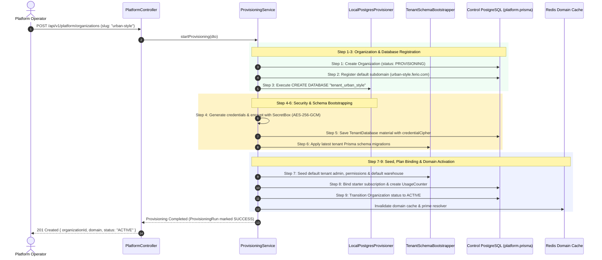

# Ferio Commerce — Platform Admin Backend Architecture

This document provides a **backend-oriented architectural specification and module diagram** specifically focused on the **Ferio Platform Admin (Control Plane & SaaS Fleet Operations)** surface. It details how the NestJS backend handles platform operator authentication, tenant provisioning workflows, fleet-wide database migrations, custom domain verification, subscription plans and entitlement enforcement, time-bounded support access, and disaster recovery evidence.

---

## 1. Platform Admin Backend Module Architecture Diagram

```mermaid
flowchart TB
    %% ─────────────────────────────────────────────────────────────────────────
    %% 1. Ingress & Operator Surface
    %% ─────────────────────────────────────────────────────────────────────────
    subgraph PLAT_INGRESS ["1. Platform Admin Ingress & Pipeline"]
        direction TB
        PLAT_WEB["Ferio Platform Admin Web<br/>(Next.js App on platform.ferio.com)"]
        
        CORR_ID["Correlation Middleware<br/>(AsyncLocalStorage • X-Correlation-ID)"]
        SEC_HEADERS["Security & Rate Limits<br/>(Helmet • Strict Platform CORS • Operator Rate Limiter)"]
        VAL_PIPE["Global ValidationPipe<br/>(whitelist: true • forbidNonWhitelisted: true • transform)"]

        PLAT_WEB --> CORR_ID
        CORR_ID --> SEC_HEADERS
        SEC_HEADERS --> VAL_PIPE
    end

    %% ─────────────────────────────────────────────────────────────────────────
    %% 2. Control Plane Route Exclusion & Authentication Gate
    %% ─────────────────────────────────────────────────────────────────────────
    subgraph PLAT_GATE ["2. Control Plane Exclusion & Security Gate"]
        direction TB
        EXCLUDE_RULE["TenantContextMiddleware Exclusion Matcher<br/>• Matches /api/v1/platform/* & platform/*<br/>• Bypasses TenantResolverService (No host-based tenant resolution)"]
        
        PLAT_AUTH["PlatformAuthGuard & PlatformRolesGuard<br/>• Verifies JWT access token in Platform realm<br/>• Validates PlatformUser & PlatformRole (SUPER_ADMIN • SUPPORT • BILLING)<br/>• Enforces multi-factor authentication (MFA)"]

        VAL_PIPE --> EXCLUDE_RULE
        EXCLUDE_RULE --> PLAT_AUTH
    end

    %% ─────────────────────────────────────────────────────────────────────────
    %% 3. Control Plane Core Modules & Services (src/platform)
    %% ─────────────────────────────────────────────────────────────────────────
    subgraph PLAT_CORE ["3. Platform Plane Controllers & Services (src/platform)"]
        direction TB

        subgraph PROVIS_SUB ["Tenant Organization & Provisioning Engine"]
            CTRL_ORGS["PlatformController<br/>• POST /api/v1/platform/organizations<br/>• GET /api/v1/platform/organizations (Fleet search)<br/>• PATCH /api/v1/platform/organizations/:id/status"]
            SVC_ORGS["OrganizationsService & ProvisioningService<br/>• Manages Organization lifecycle (DRAFT ➔ PROVISIONING ➔ ACTIVE)<br/>• Orchestrates 9-step automated provisioning run"]
            SVC_PROVIS["LocalPostgresProvisioner / DBProvisioner<br/>• Executes CREATE DATABASE 'tenant_{uuid}'<br/>• Encrypts credentials via SecretBox (AES-256-GCM)<br/>• Bootstraps schema & runs initial seed migrations"]
            CTRL_ORGS --> SVC_ORGS
            SVC_ORGS --> SVC_PROVIS
        end

        subgraph DOMAIN_SUB ["Domain Management & Routing Verification"]
            CTRL_DOMAINS["PlatformDomainsController<br/>• POST /api/v1/platform/domains (Add custom domain)<br/>• POST /api/v1/platform/domains/:id/verify<br/>• PATCH /api/v1/platform/domains/:id/primary"]
            SVC_DOMAINS["DomainsService & DomainReadinessService<br/>• Automated DNS CNAME & TXT challenge verification<br/>• Evicts resolver cache in Redis via domainCacheInvalidator<br/>• Enforces single primary domain invariant per organization"]
            CTRL_DOMAINS --> SVC_DOMAINS
        end

        subgraph BILLING_SUB ["Plans, Subscriptions & Entitlements Engine"]
            CTRL_BILLING["PlatformBillingController<br/>• GET/POST /api/v1/platform/billing/plans<br/>• POST /api/v1/platform/billing/subscriptions<br/>• GET /api/v1/platform/billing/usage/:orgId"]
            SVC_PLANS["PlansService & SubscriptionsService<br/>• Tier management (Starter, Growth, Enterprise)<br/>• Evaluates plan entitlements (Orders/mo, staff seats, storage MB)<br/>• Custom entitlement overrides per tenant"]
            SVC_SAAS_BILL["PlatformBillingService<br/>• SaaS billing cycle invoicing (SaasInvoice)<br/>• SaaS payment attempt tracking & renewal webhooks"]
            CTRL_BILLING --> SVC_PLANS
            CTRL_BILLING --> SVC_SAAS_BILL
        end

        subgraph MIGRATION_SUB ["Fleet Migration Orchestration"]
            CTRL_MIGR["PlatformMigrationsController<br/>• POST /api/v1/platform/migrations/run (Start fleet migration)<br/>• POST /api/v1/platform/migrations/:id/pause<br/>• POST /api/v1/platform/migrations/:id/resume"]
            SVC_MIGR["MigrationOrchestratorService<br/>• Canary rollout: tests migration on 1 canary tenant first<br/>• Batch execution: rolls out across active fleet in batches of 10<br/>• Automated rollback / isolation on failure"]
            CTRL_MIGR --> SVC_MIGR
        end

        subgraph SUPPORT_HEALTH_SUB ["Support Access, Health & Governance"]
            CTRL_SUPPORT["PlatformSupportAccessController<br/>• POST /api/v1/platform/support-access/grant<br/>• Issues time-bounded impersonation tokens (max 2 hours)<br/>• Mandatory justification code & audit trail"]
            CTRL_HEALTH["PlatformOperationsHealthService & BackupController<br/>• Monitored DB pool health, Redis latency, BullMQ backlog<br/>• BackupEvidence verification & disaster recovery drill logs"]
            SVC_CLOSURE["TenantClosureService<br/>• Suspension ➔ Retention countdown (30 days) ➔ Cryptographic wipe"]
        end
    end

    %% ─────────────────────────────────────────────────────────────────────────
    %% 4. Control Plane Asynchronous Queues (BullMQ)
    %% ─────────────────────────────────────────────────────────────────────────
    subgraph PLAT_QUEUES ["4. Control Plane BullMQ Background Fleet"]
        direction TB
        Q_MIGRATION["tenantMigrationQueue-ferio<br/>(Asynchronous tenant migration runner)"]
        Q_RETENTION["retentionQueue-ferio<br/>(Scheduled retention sweep & closure countdowns)"]

        P_MIGRATION["MigrationOrchestratorProcessor"]
        P_RETENTION["RetentionProcessor"]

        Q_MIGRATION --> P_MIGRATION
        Q_RETENTION --> P_RETENTION

        SVC_MIGR -->|Enqueues fleet jobs| Q_MIGRATION
        SVC_CLOSURE -->|Schedules retention wipe| Q_RETENTION
    end

    %% ─────────────────────────────────────────────────────────────────────────
    %% 5. Control Plane Database (platform.prisma)
    %% ─────────────────────────────────────────────────────────────────────────
    subgraph CONTROL_DB ["5. Central Control-Plane PostgreSQL (platform.prisma)"]
        direction LR
        DB_PLAT_AUTH[("PlatformUser, PlatformRole,<br/>PlatformAuditLog")]
        DB_ORGS[("Organization, OrganizationLifecycleEvent,<br/>TenantDomain, TenantDatabase")]
        DB_PROVIS[("ProvisioningRun, ProvisioningStep,<br/>BackupEvidence")]
        DB_PLANS[("Plan, PlanEntitlement, Subscription,<br/>SubscriptionEntitlementOverride, UsageCounter")]
        DB_SAAS_BILL[("SaasInvoice, SaasPaymentAttempt")]
        DB_MIGR[("TenantMigrationRun,<br/>TenantMigrationResult")]
        DB_SUPPORT[("SupportAccessGrant,<br/>PlatformFeatureFlag")]
    end

    %% Wiring
    PLAT_AUTH --> PROVIS_SUB
    PLAT_AUTH --> DOMAIN_SUB
    PLAT_AUTH --> BILLING_SUB
    PLAT_AUTH --> MIGRATION_SUB
    PLAT_AUTH --> SUPPORT_HEALTH_SUB

    SVC_ORGS --> DB_ORGS
    SVC_PROVIS --> DB_PROVIS
    SVC_DOMAINS --> DB_ORGS
    SVC_PLANS --> DB_PLANS
    SVC_SAAS_BILL --> DB_SAAS_BILL
    SVC_MIGR --> DB_MIGR
    CTRL_SUPPORT --> DB_SUPPORT
    CTRL_HEALTH --> DB_PROVIS
    PLAT_AUTH --> DB_PLAT_AUTH

    %% Styling
    classDef ingressStyle fill:#f8fafc,stroke:#475569,stroke-width:1.5px,color:#0f172a;
    classDef gateStyle fill:#fee2e2,stroke:#dc2626,stroke-width:2px,color:#991b1b;
    classDef coreStyle fill:#ffffff,stroke:#059669,stroke-width:1.5px,color:#065f46;
    classDef queueStyle fill:#faf5ff,stroke:#7c3aed,stroke-width:1.5px,color:#4c1d95;
    classDef dbStyle fill:#fffbeb,stroke:#b45309,stroke-width:2px,color:#78350f;

    class PLAT_INGRESS,PLAT_WEB,CORR_ID,SEC_HEADERS,VAL_PIPE ingressStyle;
    class PLAT_GATE,EXCLUDE_RULE,PLAT_AUTH gateStyle;
    class PLAT_CORE,PROVIS_SUB,DOMAIN_SUB,BILLING_SUB,MIGRATION_SUB,SUPPORT_HEALTH_SUB coreStyle;
    class PLAT_QUEUES,Q_MIGRATION,Q_RETENTION,P_MIGRATION,P_RETENTION queueStyle;
    class CONTROL_DB,DB_PLAT_AUTH,DB_ORGS,DB_PROVIS,DB_PLANS,DB_SAAS_BILL,DB_MIGR,DB_SUPPORT dbStyle;
```



---

## 2. SaaS Fleet & Operator Control Flow Diagram

```mermaid
graph TD
    subgraph Platform_Operator_Flow ["SaaS Fleet & Platform Operator Control Flow"]
        direction TB
        PA[Operator Login: platform.ferio.com] --> PB{Control Plane Dashboard}
        
        PB --> PC[Tenant Provisioning Engine]
        PB --> PD[Custom Domain Verification]
        PB --> PE[Fleet Migration Orchestration]
        PB --> PF[SaaS Plans & Entitlements]
        PB --> PG[Time-Bounded Support Access]
        PB --> PH[Infrastructure Health Probes]
        
        PC --> PC1[Input Organization Details & Subdomain]
        PC1 --> PC2[CREATE DATABASE 'tenant_{uuid}']
        PC2 --> PC3[Encrypt Credentials with AES-256-GCM]
        PC3 --> PC4[Apply Migrations & Seed Default Admin]
        PC4 --> PC5[Activate Subdomain & Prime Redis Cache]
        
        PD --> PD1[Validate DNS CNAME & TXT Challenge]
        PD1 --> PD2[Set Domain Primary & Invalidate Resolver Cache]
        
        PE --> PE1[Deploy Canary Migration to 1 Test Tenant]
        PE1 --> PE2{Canary Healthy?}
        PE2 -->|No| PE3[Halt & Isolate Failure: Zero Fleet Drift]
        PE2 -->|Yes| PE4[Dispatch Batch Migrations: 10 Tenants / Batch]
        
        PF --> PF1[Manage Plan Tiers: Starter, Growth, Enterprise]
        PF1 --> PF2[Enforce Usage Counters: Orders, Staff Seats, Storage]
        PF2 --> PF3[Generate Monthly SaaS Renewal Invoices]
        
        PG --> PG1[Issue Time-Bounded Impersonation Token: Max 2h]
        PG1 --> PG2[Log Mandatory Reason & Append to PlatformAuditLog]
        
        PB --> PJ[Tenant Cancellation & Closure]
        PJ --> PJ1[Soft-Suspension ➔ 30-Day Retention Countdown]
        PJ1 --> PJ2[Execute Cryptographic Erasure of Tenant Database]
    end
```

---

## 3. Nine-Step Automated Tenant Provisioning Flow

When a platform operator creates a new tenant organization via `POST /api/v1/platform/organizations`, the `ProvisioningService` coordinates nine atomic steps:



---

## 3. Platform Admin Endpoints & Operational Contracts

| Operational Context | Endpoint & Method | Role Required | Underlying Service & Action |
| :--- | :--- | :--- | :--- |
| **Organizations** | `POST /api/v1/platform/organizations` | `SUPER_ADMIN` | `ProvisioningService`: runs 9-step tenant provisioning pipeline. |
| **Organizations** | `PATCH /api/v1/platform/organizations/:id/status` | `SUPER_ADMIN` | Transitions status (`ACTIVE`, `SUSPENDED`, `ARCHIVED`, `CLOSED`). |
| **Domains** | `POST /api/v1/platform/domains/:id/verify` | `OPERATOR` | `DomainsService`: DNS CNAME/TXT challenge lookup; evicts Redis resolver cache. |
| **Domains** | `PATCH /api/v1/platform/domains/:id/primary` | `OPERATOR` | Designates primary domain; unsets previous primary domain in single transaction. |
| **Billing & Plans** | `POST /api/v1/platform/billing/plans` | `BILLING_ADMIN` | `PlansService`: creates new SaaS subscription tier with quota limits. |
| **Billing & Plans** | `POST /api/v1/platform/billing/subscriptions` | `BILLING_ADMIN` | `SubscriptionsService`: assigns or upgrades tenant plan tier. |
| **Migrations** | `POST /api/v1/platform/migrations/run` | `SUPER_ADMIN` | `MigrationOrchestratorService`: starts canary rollout ➔ batch fleet migration. |
| **Migrations** | `POST /api/v1/platform/migrations/:id/pause` | `SUPER_ADMIN` | Pauses migration worker; halts dispatching new tenant migration jobs. |
| **Support Access** | `POST /api/v1/platform/support-access/grant` | `SUPER_ADMIN` | `SupportAccessService`: issues max 2-hour scoped support token with mandatory reason. |
| **Fleet Health** | `GET /api/v1/platform/health/fleet` | `OPERATOR` | `PlatformOperationsHealthService`: aggregates DB pool, Redis latency, and queue lag. |
| **Tenant Closure** | `POST /api/v1/platform/organizations/:id/close` | `SUPER_ADMIN` | `TenantClosureService`: soft-suspends organization, initiates 30-day retention clock. |

---

## 4. Platform Control Plane Invariants

1. **Zero Tenant Database Bleed:**
   The control plane interacts with tenant databases exclusively during provisioning and schema migrations. At all other times, platform operations read and write strictly to the central Control PostgreSQL database (`platform.prisma`).
2. **Canary Fleet Migrations:**
   Schema migrations are never applied to all tenant databases simultaneously. The `MigrationOrchestratorService` executes the migration against a dedicated canary tenant first, runs automated smoke checks, and only then proceeds with batch execution (default 10 tenants per batch).
3. **Time-Bounded Support Impersonation:**
   Platform operators cannot access tenant data without an explicit `SupportAccessGrant`. Every grant requires an authorization reason, is capped at a maximum lifetime of 2 hours, and is permanently recorded in `PlatformAuditLog`.
4. **Cryptographic Tenant Isolation:**
   Tenant database credentials stored in the `TenantDatabase` table are never stored in plaintext. They are encrypted using an envelope encryption key (`PLATFORM_SECRET_KEY`) with authenticated AES-256-GCM cipher tags (`SecretBox`).
