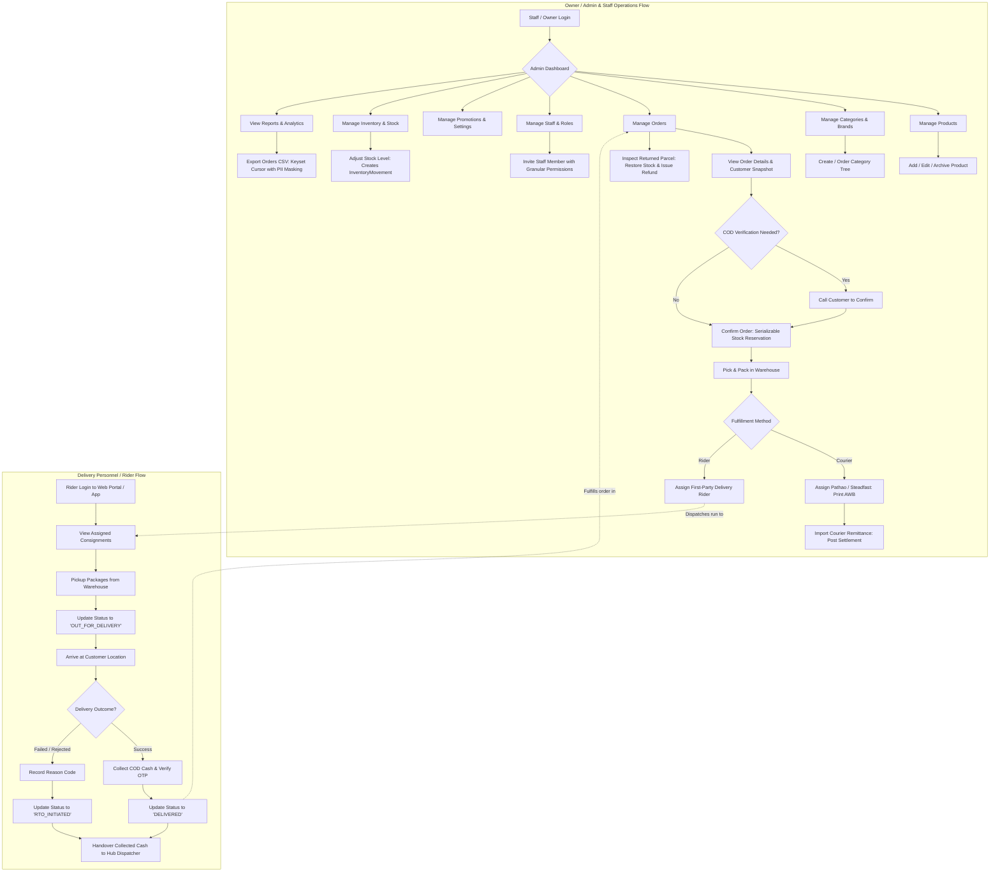

# Ferio Commerce — Tenant Admin Backend Architecture

This document provides a **backend-oriented architectural specification and module diagram** specifically focused on the **Tenant Admin (Merchant Operations Dashboard)** surface of the Ferio Commerce SaaS platform. It details how the NestJS backend handles merchant authentication, server-side RBAC and permission enforcement, catalog management, inventory movements, order confirmation with serializable stock reservation, courier dispatch, settlement reconciliation, staff delegation, and safe PII-masked reporting.

---

## 1. Tenant Admin Backend Module Architecture Diagram

```mermaid
flowchart TB
    %% ─────────────────────────────────────────────────────────────────────────
    %% 1. Ingress & Admin Client Surface
    %% ─────────────────────────────────────────────────────────────────────────
    subgraph ADMIN_INGRESS ["1. Tenant Admin Ingress & Pipeline"]
        direction TB
        ADMIN_WEB["Tenant Admin Dashboard<br/>(Next.js Dashboard on fashionhub.ferio.com/admin)"]
        
        CORR_ID["Correlation Middleware<br/>(AsyncLocalStorage • X-Correlation-ID)"]
        SEC_HEADERS["Security & Rate Limits<br/>(Helmet • Admin CORS Policy • SlidingWindowRateLimiter)"]
        VAL_PIPE["Global ValidationPipe<br/>(whitelist: true • forbidNonWhitelisted: true)"]

        ADMIN_WEB --> CORR_ID
        CORR_ID --> SEC_HEADERS
        SEC_HEADERS --> VAL_PIPE
    end

    %% ─────────────────────────────────────────────────────────────────────────
    %% 2. Tenant Resolution & Staff Authorization Chain
    %% ─────────────────────────────────────────────────────────────────────────
    subgraph ADMIN_AUTH_CHAIN ["2. Tenant Resolution & RBAC Authorization Chain"]
        direction TB
        TENANT_RESOLVER["TenantResolverService<br/>• Normalizes Host header<br/>• L1 Redis Domain Cache (60s)<br/>• L2 Platform Registry Lookup<br/>• Subscription Entitlement Check"]
        
        TENANT_DB_MGR["TenantDatabaseManager<br/>• Bounded PrismaClient Pool (maxClients: 25)<br/>• Decrypts tenant credentials (AES-256-GCM)<br/>• Circuit Breaker (3 failures / 30s cooldown)"]
        
        AUTH_GUARDS["Server-Side Authorization Chain<br/>1. TenantAuthGuard (Verifies JWT access token)<br/>2. StaffActiveGuard (Checks staff active status & non-revocation)<br/>3. RolesGuard (OWNER • ADMIN • WAREHOUSE • SUPPORT • FINANCE)<br/>4. PermissionsGuard (Granular: catalog.write, orders.confirm, etc.)"]

        VAL_PIPE --> TENANT_RESOLVER
        TENANT_RESOLVER --> TENANT_DB_MGR
        TENANT_DB_MGR --> AUTH_GUARDS
    end

    %% ─────────────────────────────────────────────────────────────────────────
    %% 3. Merchant Core Operations Contexts
    %% ─────────────────────────────────────────────────────────────────────────
    subgraph MERCHANT_MODULES ["3. Merchant Operations Feature Modules (src/features)"]
        direction TB

        subgraph MOD_CATALOG_OPS ["Catalog, SKU & Inventory Operations"]
            CTRL_ADMIN_CATALOG["AdminCatalogController<br/>• GET/POST /api/v1/admin/catalog/products<br/>• PATCH /api/v1/admin/catalog/products/:id/status<br/>• GET/PATCH /api/v1/admin/catalog/inventory/:variantId<br/>• GET /api/v1/admin/catalog/inventory/:variantId/movements"]
            SVC_CATALOG_ADMIN["AdminCatalogService & InventoryService<br/>• Enforces integer minor pricing units (BDT cents)<br/>• Immutable InventoryMovement logging for all adjustments<br/>• SKU uniqueness and warehouse allocation"]
            CTRL_ADMIN_CATALOG --> SVC_CATALOG_ADMIN
        end

        subgraph MOD_ORDER_OPS ["Order Verification & Stock Reservation"]
            CTRL_ADMIN_ORDERS["AdminOrderController<br/>• GET /api/v1/admin/orders (Paginated, filtered)<br/>• GET /api/v1/admin/orders/:id (Detail & audit snapshot)<br/>• POST /api/v1/admin/orders/:id/confirm (Stock reservation)<br/>• POST /api/v1/admin/orders/:id/cancel (Reason-coded release)"]
            SVC_ORDER_ADMIN["OrderVerificationService (Serializable Tx)<br/>• COD Verification: phone contact check & note<br/>• Confirmation: reserves physical inventory in atomic tx<br/>• Cancellation: releases active reservations with reason"]
            CTRL_ADMIN_ORDERS --> SVC_ORDER_ADMIN
        end

        subgraph MOD_SHIPPING_OPS ["Courier Dispatch & Fleet Management"]
            CTRL_ADMIN_SHIPPING["AdminShippingController<br/>• GET/PATCH /api/v1/admin/shipping/providers/:code<br/>• POST /api/v1/admin/shipping/orders/:orderId (Dispatch)<br/>• GET /api/v1/admin/shipping/shipments (Airway bills)"]
            SVC_SHIPPING_REG["CourierAdapterRegistry<br/>• PathaoAdapter (Store, city, zone, area IDs)<br/>• SteadfastAdapter (Order address, delivery type)<br/>• RedX, Paperfly, eCourier, Carrybee Adapters"]
            CTRL_DELIVERY["DeliveryPersonnelController<br/>• Rider assignment, location tracking, delivery updates"]
            CTRL_ADMIN_SHIPPING --> SVC_SHIPPING_REG
        end

        subgraph MOD_FINANCE_OPS ["Settlement, Refunds & Financial Ledger"]
            CTRL_SETTLEMENTS["SettlementsController<br/>• POST /api/v1/admin/settlements/import (CSV/Excel)<br/>• POST /api/v1/admin/settlements/post (Ledger posting)"]
            SVC_SETTLEMENTS["CourierSettlementService<br/>• Template preflight & duplicate transaction check<br/>• Matches courier remittance against order COD values<br/>• Deducts delivery fees and writes immutable ledger entry"]
            CTRL_REFUNDS["RefundsController & RtoController<br/>• Quality inspection, RTO stock restoration, refund audit"]
            CTRL_SETTLEMENTS --> SVC_SETTLEMENTS
        end

        subgraph MOD_STAFF_GOV ["Staff Delegation, Governance & Security"]
            CTRL_STAFF["StaffAccessController<br/>• POST /api/v1/admin/staff/invite (Time-bounded token)<br/>• PATCH /api/v1/admin/staff/:id/role (Role assignment)<br/>• DELETE /api/v1/admin/staff/:id (Revoke & terminate sessions)"]
            CTRL_REPORTS["AdminReportsController<br/>• GET /api/v1/admin/reports/overview (Financial metrics)<br/>• GET /api/v1/admin/reports/orders-export (Streaming CSV)"]
            SVC_REPORTS["ReportsService<br/>• Keyset cursor pagination (caps export at 5,000 rows)<br/>• PII Masking: suppresses phone/name unless customers.read<br/>• Formula-injection defense on all CSV fields"]
            CTRL_AUDIT["AuditLogService<br/>• Append-only tamper-proof audit trail for every mutation"]
            CTRL_STAFF --> CTRL_AUDIT
            CTRL_REPORTS --> SVC_REPORTS
        end

        subgraph MOD_SETTINGS_STORAGE ["Settings, Rollouts & Media Storage"]
            CTRL_SETTINGS["SettingsController<br/>• Staged feature flags (e.g., enable prepaid checkout)<br/>• Store profile, VAT/tax rates, delivery zone rules"]
            CTRL_STORAGE["StorageController<br/>• Cloudflare R2 presigned upload URL issuance<br/>• Malware signature scanner and media mime validation"]
        end
    end

    %% ─────────────────────────────────────────────────────────────────────────
    %% 4. Asynchronous Queue Fleet (BullMQ)
    %% ─────────────────────────────────────────────────────────────────────────
    subgraph ADMIN_QUEUES ["4. Tenant-Stamped BullMQ Asynchronous Fleet"]
        direction TB
        Q_COURIER_CB["courierCallbackQueue-ferio<br/>(Processes external courier webhooks)"]
        Q_COURIER_POLL["courierPollQueue-ferio<br/>(Fallback periodic polling for shipment statuses)"]
        Q_RECON["reconciliationQueue-ferio<br/>(Daily automated mismatch scan between orders & courier)"]

        P_COURIER_CB["ShippingWebhookProcessor"]
        P_COURIER_POLL["ShippingPollingProcessor"]
        P_RECON["ReconciliationProcessor"]

        Q_COURIER_CB --> P_COURIER_CB
        Q_COURIER_POLL --> P_COURIER_POLL
        Q_RECON --> P_RECON

        SVC_SHIPPING_REG -->|Enqueue webhook/poll| Q_COURIER_CB
        SVC_SETTLEMENTS -->|Trigger discrepancy scan| Q_RECON
    end

    %% ─────────────────────────────────────────────────────────────────────────
    %% 5. Tenant Database Plane (schema.prisma)
    %% ─────────────────────────────────────────────────────────────────────────
    subgraph TENANT_DB ["5. Tenant PostgreSQL Database Plane (schema.prisma)"]
        direction LR
        DB_STAFF[("StaffAccessToken, User,<br/>UserProfile, UserRoleData")]
        DB_CATALOG[("Product, ProductVariant,<br/>InventoryStock, InventoryMovement")]
        DB_ORDERS[("Order, OrderItem, OrderAddress,<br/>FulfillmentHistory, FulfillmentException")]
        DB_SHIPPING[("Shipment, ShipmentEvent,<br/>ShipmentProvider, ShipmentWebhookLog")]
        DB_FINANCE[("Settlement, SettlementItem,<br/>Refund, RtoRecord, AuditLog")]
    end

    %% Wiring
    AUTH_GUARDS --> MOD_CATALOG_OPS
    AUTH_GUARDS --> MOD_ORDER_OPS
    AUTH_GUARDS --> MOD_SHIPPING_OPS
    AUTH_GUARDS --> MOD_FINANCE_OPS
    AUTH_GUARDS --> MOD_STAFF_GOV
    AUTH_GUARDS --> MOD_SETTINGS_STORAGE

    SVC_CATALOG_ADMIN --> DB_CATALOG
    SVC_ORDER_ADMIN --> DB_ORDERS
    SVC_SHIPPING_REG --> DB_SHIPPING
    SVC_SETTLEMENTS --> DB_FINANCE
    CTRL_STAFF --> DB_STAFF
    CTRL_AUDIT --> DB_FINANCE
    P_COURIER_CB --> DB_SHIPPING
    P_RECON --> DB_FINANCE

    %% Styling
    classDef ingressStyle fill:#f0fdf4,stroke:#16a34a,stroke-width:1.5px,color:#14532d;
    classDef gateStyle fill:#fef3c7,stroke:#d97706,stroke-width:2px,color:#78350f;
    classDef opsStyle fill:#ffffff,stroke:#2563eb,stroke-width:1.5px,color:#1e40af;
    classDef queueStyle fill:#faf5ff,stroke:#7c3aed,stroke-width:1.5px,color:#4c1d95;
    classDef dbStyle fill:#fffbeb,stroke:#b45309,stroke-width:2px,color:#78350f;

    class ADMIN_INGRESS,ADMIN_WEB,CORR_ID,SEC_HEADERS,VAL_PIPE ingressStyle;
    class ADMIN_AUTH_CHAIN,TENANT_RESOLVER,TENANT_DB_MGR,AUTH_GUARDS gateStyle;
    class MERCHANT_MODULES,MOD_CATALOG_OPS,MOD_ORDER_OPS,MOD_SHIPPING_OPS,MOD_FINANCE_OPS,MOD_STAFF_GOV,MOD_SETTINGS_STORAGE opsStyle;
    class ADMIN_QUEUES,Q_COURIER_CB,Q_COURIER_POLL,Q_RECON,P_COURIER_CB,P_COURIER_POLL,P_RECON queueStyle;
    class TENANT_DB,DB_STAFF,DB_CATALOG,DB_ORDERS,DB_SHIPPING,DB_FINANCE dbStyle;
```

---

## 2. Merchant Operations & Delivery Fleet Operational Flow Diagram

---

## 3. Tenant Admin Endpoints & Permission Matrix

The table below outlines the core tenant operations endpoints, their required RBAC permissions, and underlying transactional contracts:

| Feature Area | Endpoint & Method | Permission Required | Transactional Contract / Invariants |
| :--- | :--- | :--- | :--- |
| **Catalog** | `POST /api/v1/admin/catalog/products` | `catalog.write` | Validates category hierarchy, validates minor integer price, creates default variant. |
| **Inventory** | `PATCH /api/v1/admin/catalog/inventory/:variantId` | `inventory.manage` | Atomic update to `InventoryStock` + writes immutable `InventoryMovement` entry. |
| **Orders** | `GET /api/v1/admin/orders` | `orders.read` | Paginated keyset search, date/status filtering, masked customer phone if missing `customers.read`. |
| **Orders** | `POST /api/v1/admin/orders/:id/confirm` | `orders.confirm` | **Serializable Transaction:** checks stock availability, transitions status to CONFIRMED, reserves physical inventory. |
| **Orders** | `POST /api/v1/admin/orders/:id/cancel` | `orders.cancel` | **Serializable Transaction:** requires reason code, releases stock reservations, writes audit trail. |
| **Shipping** | `POST /api/v1/admin/shipping/orders/:orderId` | `shipping.manage` | Encrypts courier credentials via SecretBox, validates recipient city/zone IDs, creates `Shipment`. |
| **Settlement** | `POST /api/v1/admin/settlements/import` | `settlements.manage` | Template preflight check, validates against duplicate courier invoice numbers, parses fees and remittance. |
| **Settlement** | `POST /api/v1/admin/settlements/post` | `settlements.manage` | Matches order COD receivables, records fee deductions, marks orders as SETTLED. |
| **Reports** | `GET /api/v1/admin/reports/orders-export` | `reports.read` | Max 5,000 rows, keyset cursor streaming, formula sanitization (`=`, `+`, `-`, `@`), PII redaction. |
| **Staff** | `POST /api/v1/admin/staff/invite` | `staff.manage` | Issues 48-hour cryptographically secure invitation token; checks plan staff seat quotas. |
| **Staff** | `DELETE /api/v1/admin/staff/:id` | `staff.manage` | Cannot delete account owner; revokes all active refresh tokens in Redis immediately. |
| **Settings** | `PATCH /api/v1/admin/settings/flags` | `settings.manage` | Controls staged feature rollouts (prepaid checkout, service bookings, analytics pause). |

---

## 3. Tenant Admin Operational Safety Rules

1. **Explicit Confirmation Reservation:**
   Unverified COD orders do not reserve warehouse inventory. Physical stock is only locked when an administrator explicitly invokes `/api/v1/admin/orders/:id/confirm`. This prevents stock hoarding and fake-order inventory starvation.
2. **Strict Keyset Report Streaming & PII Protection:**
   Order CSV exports use streaming cursor queries to prevent memory spikes. Actors without the elevated `customers.read` permission have customer names, phone numbers, and street addresses automatically redacted (`"M*** S***"`, `"+88017*****12"`).
3. **No Unauthenticated Manual Payment Mutations:**
   The admin API does not provide a backdoor endpoint to change payment status arbitrarily. Order payment states can only advance through verified provider callbacks, courier settlement postings, or audited refund outcomes.
4. **Immediate Staff Revocation:**
   When a staff member is suspended or removed, their `StaffAccessToken` is deleted from PostgreSQL and their active JWT session IDs are pushed to Redis revocation sets (`SETEX revoked:token:{jti} 86400`), immediately blocking ongoing API calls.
