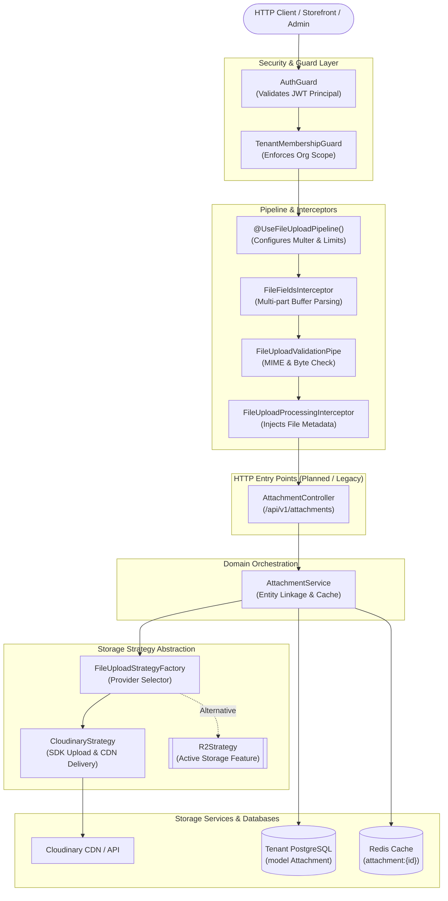
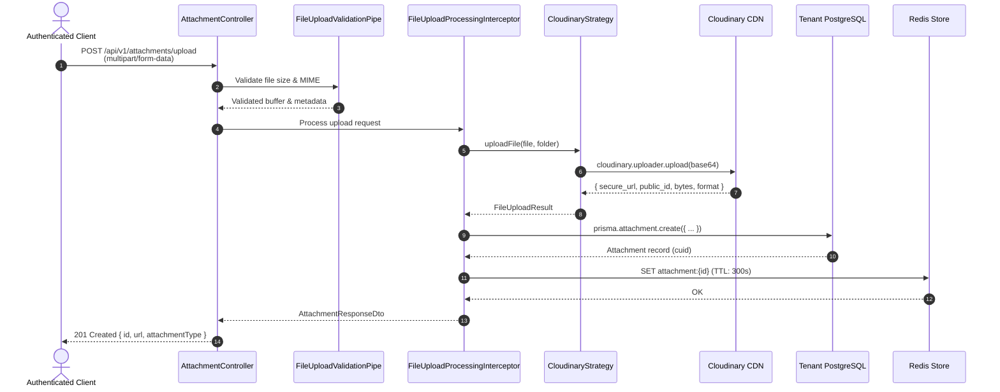
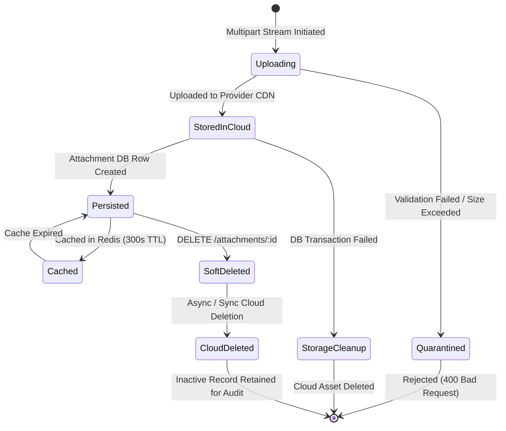

# Attachments Feature

## Purpose
Provides asset normalization, media type classification, cloud storage strategy abstraction (Cloudinary), and metadata persistence for polymorphic domain entities (messages, withdrawal receipts, and evidence records).

---

## Component Architecture



### Component Source Map

| Component | Layer / Role | Relative Source Path |
| :--- | :--- | :--- |
| `CloudinaryStrategy` | Storage Strategy | [`./strategies/cloudinary.strategy.ts`](./strategies/cloudinary.strategy.ts) |
| `UseFileUploadPipeline` | Decorator | [`../../../libs/common/src/decorators/use-file-upload-pipeline.decorator.ts`](../../../libs/common/src/decorators/use-file-upload-pipeline.decorator.ts) |
| `FileUploadProcessingInterceptor` | Interceptor | [`../../../libs/common/src/interceptors/file-upload-processing.interceptor.ts`](../../../libs/common/src/interceptors/file-upload-processing.interceptor.ts) |
| `FileUploadValidationPipe` | Validation Pipe | [`../../../libs/common/src/pipes/file-upload-validation.pipe.ts`](../../../libs/common/src/pipes/file-upload-validation.pipe.ts) |
| `Attachment` Model | Prisma Schema | [`../../../prisma/schema/shared/attachment.prisma`](../../../prisma/schema/shared/attachment.prisma) |
| `R2Strategy` (Active Alternative) | Storage Strategy | [`../storage/strategies/r2.strategy.ts`](../storage/strategies/r2.strategy.ts) |
| `StorageController` (Active Admin API) | HTTP Controller | [`../storage/storage.controller.ts`](../storage/storage.controller.ts) |
| `Message` Model (Chat Relation) | Prisma Schema | [`../../../prisma/schema/chatting.module/message.prisma`](../../../prisma/schema/chatting.module/message.prisma) |
| `WithdrawalRequest` Model (Wallet Relation)| Prisma Schema | [`../../../prisma/schema/wallet.module/withdrawalRequest.prisma`](../../../prisma/schema/wallet.module/withdrawalRequest.prisma) |

---

## Current Status & Architectural Context

> [!WARNING]
> **Dormant / Migration State**: The `attachments` module is currently **dormant code pending PostgreSQL/Prisma re-architecture**. 
> - The original Mongoose-based `AttachmentController` and `AttachmentService` were removed during the Mongoose removal refactor (`docs/nest-architecture/remove-mongoose.md`).
> - `src/features/attachments` is **not registered in `AppModule`** and contains only `CloudinaryStrategy`.
> - Active multi-tenant asset storage in Ferio is currently handled by `src/features/storage/` via Cloudflare R2 presigned URLs.
> - The database schema for attachments has already been migrated to PostgreSQL via Prisma (`model Attachment` in `prisma/schema/shared/attachment.prisma`).

---

## Responsibilities
- **Media Ingestion & Transformation**: Parsing multipart uploads, converting buffers, applying cloud transformations (auto quality, webp/auto format), and returning CDN delivery URLs.
- **MIME & Type Classification**: Categorizing raw files into coarse enum buckets (`image`, `video`, `document`, `unknown`).
- **Polymorphic Metadata Persistence**: Tracking asset URLs, public IDs, file sizes, and MIME types mapped to specific application entities (`attachedToType`, `attachedToId`).
- **Entity Linking**: Associating proof files with withdrawal requests (`withdrawalRequestId`) and conversation messages (`messageId`).
- **Storage Deletion & Invalidation**: Removing assets from cloud providers (via public ID) and invalidating cached attachment lookups in Redis.

## Does Not Own
- **Tenant-Scoped Object Storage Administration**: Does not own presigned PUT/GET generation, bucket life-cycle rules, or CORS management (strictly owned by `src/features/storage`).
- **Malware & Antivirus Quarantine**: Does not own buffer virus scanning or payload inspection (owned by `src/features/storage/malware-scanner.ts`).
- **Chat Message Business Logic**: Does not own message creation, socket event emission, or read receipts (owned by `src/features/chatting`).
- **Wallet Payout Verification**: Does not decide whether a withdrawal receipt validates payout completion (owned by `src/features/wallet`).
- **Identity & Authentication**: Does not verify bearer tokens or user roles (handled by `libs/common` guards).

---

## Dependencies
- **Core / Platform**:
  - `PlatformPrismaService` / `TenantDbService` for tenant-scoped database queries.
  - `@app/common` for standard exceptions, error normalizers, and logging.
  - `@app/redis` for Redis-backed caching of attachment lookups.
- **Internal Modules**:
  - `src/features/storage`: Active brother module providing tenant-namespaced object storage (`r2.strategy.ts`).
  - `src/features/chatting`: References `Attachment[]` on `Message`.
  - `src/features/wallet`: References `Attachment[]` on `WithdrawalRequest`.
- **External Libraries / APIs**:
  - `cloudinary` (v2 SDK) for direct cloud uploads and asset management.
  - `multer` for multipart HTTP body parsing.

---

## Database Ownership

### Writes / Mutates
- **`Attachment`** (`prisma/schema/shared/attachment.prisma`):
  - `id`: CUID identifier.
  - `attachment`: Public URL of the uploaded asset.
  - `attachmentType`: Categorized enum (`document`, `image`, `video`, `unknown`).
  - `publicId`: Cloud provider asset identifier (e.g. Cloudinary public ID).
  - `originalName`, `size`, `mimeType`: Original file metadata.
  - `attachedToType`, `attachedToId`: Polymorphic parent reference (e.g. `order`, `task`, `product`).
  - `withdrawalRequestId`: Foreign key relation to `WithdrawalRequest`.
  - `messageId`: Foreign key relation to `Message`.
  - `isDeleted`: Soft-deletion flag.

### Reads / References
- **`Message`**: Read during chat attachment queries.
- **`WithdrawalRequest`**: Read during payout receipt verification.

---

## Important Invariants
1. **Tenant Isolation**: An attachment uploaded in Tenant A must never be accessible, queried, updated, or deleted by Tenant B. All Prisma queries must run against the ambient `TenantDbService`.
2. **Deterministic Cloud Namespacing**: Cloud asset keys/public IDs must be prefixed with the tenant identifier (`tenants/{organizationId}/attachments/...`). A tenant must never have write or delete permissions outside its own directory.
3. **Entity Ownership Enforcement**: An attachment cannot be attached to a `messageId`, `withdrawalRequestId`, or polymorphic `attachedToId` unless the calling principal owns or has administrative rights over that target entity within the same tenant.
4. **MIME Header Distrust**: Client-provided `file.mimetype` strings must never be trusted as authoritative. Magic byte verification must determine true MIME signatures.
5. **No Dangling Storage Garbage**: If a database transaction recording an attachment fails, the uploaded file in cloud storage must be deleted immediately (or marked for orphan cleanup).

---

## Public API & Entry Points (Specification & Historical Surface)

### HTTP Endpoints
- `POST /api/v1/attachments/upload` - Multipart file upload (`AuthGuard`, `TenantMembershipGuard`).
- `GET /api/v1/attachments/by-entity` - List active attachments for an entity (`attachedToType`, `attachedToId`).
- `GET /api/v1/attachments/:id` - Fetch single attachment details with Redis caching.
- `DELETE /api/v1/attachments/:id` - Soft-delete DB record and trigger provider deletion.

### Exported Services
- `CloudinaryStrategy.uploadFile(file, folder)` - Uploads buffer to Cloudinary CDN with auto-format optimization.
- `CloudinaryStrategy.deleteFile(publicIdOrUrl)` - Deletes asset from Cloudinary by public ID or parsed URL.

---

## Important Flows

### 1. Attachment Upload & Persistence Flow


### 2. Attachment Lifecycle State Machine


---

## Brutal Honest Vulnerabilities & Architectural Debt

### 1. Hardcoded Foreign Namespace & Zero Tenant Isolation (Critical Multi-Tenant Risk)
- **Vulnerability**: In [`CloudinaryStrategy.uploadFile()`](./strategies/cloudinary.strategy.ts#L64):
  ```ts
  void cloudinary.uploader.upload(
    base64File,
    {
      folder: `task-mgmt/${folder}`, // ⚠️ Hardcoded legacy namespace!
      resource_type: 'auto',
      ...
    }
  );
  ```
- **Brutal Reality**: The folder is hardcoded to `task-mgmt/${folder}`, a copy-paste artifact from an entirely different legacy project. There is **zero tenant scoping (`organizationId`)**.
- **Threat Vector**: Assets from every single tenant on this SaaS platform are dumped into a single shared Cloudinary bucket with identical folder prefixes. If Tenant A uploads `invoice.pdf` and Tenant B uploads `invoice.pdf`, naming collisions or asset cross-exposure can occur.
- **Remediation**: Force tenant namespacing using the server-resolved context:
  ```ts
  const orgId = getTenantContext().organizationId;
  const targetFolder = `tenants/${orgId}/attachments/${sanitizeStoragePath(folder)}`;
  ```

### 2. V8 Heap Exhaustion via Base64 Buffer Inflation (High DoS Risk)
- **Vulnerability**: In [`CloudinaryStrategy.uploadFile()`](./strategies/cloudinary.strategy.ts#L57):
  ```ts
  const base64File = `data:${file.mimetype};base64,${file.buffer.toString('base64')}`;
  ```
- **Brutal Reality**: Multer buffers the entire uploaded file into Node.js heap memory, and `toString('base64')` creates a duplicate string representation that is **33% larger** than the raw binary buffer.
- **Threat Vector**: If multiple users concurrently upload 10MB to 50MB files (e.g. high-resolution product imagery or videos), the Node.js event loop blocks on massive string allocations, GC pauses spike, and the container crashes with an Out-of-Memory (OOM) error.
- **Remediation**:
  1. Use streaming uploads with `cloudinary.uploader.upload_stream()`, piping the incoming stream directly to Cloudinary without buffering in memory.
  2. Or adopt the architecture of `src/features/storage`: generate presigned upload URLs (Cloudflare R2 or S3) and let clients upload directly to the object store, bypassing the NestJS API server entirely.

### 3. Arbitrary Cross-Tenant Asset Deletion via Unsanitized Public ID
- **Vulnerability**: In [`CloudinaryStrategy.deleteFile()`](./strategies/cloudinary.strategy.ts#L104-L115):
  ```ts
  let publicId = publicIdOrUrl;
  if (publicIdOrUrl.includes('cloudinary.com')) {
    const match = publicIdOrUrl.match(/\/upload\/v\d+\/(.+)$/);
    if (match) {
      publicId = match[1].replace(/\.[^/.]+$/, '');
    }
  }
  await cloudinary.uploader.destroy(publicId);
  ```
- **Brutal Reality**: `deleteFile` accepts any arbitrary URL or public ID and deletes it directly from Cloudinary without checking:
  1. Whether the calling user is authenticated.
  2. Whether the asset belongs to the caller's tenant.
  3. Whether the asset is linked to an active business record (e.g., an order or dispute).
- **Threat Vector**: An authenticated user in Tenant A can supply the Cloudinary URL or public ID of an image owned by Tenant B. The backend will parse the public ID and destroy Tenant B's asset in Cloudinary.
- **Remediation**: Validate that the `publicId` starts with `tenants/${tenantContext.organizationId}/` before executing `cloudinary.uploader.destroy()`.

### 4. Gutted Runtime Layer & Dead Code in Repository
- **Vulnerability**: The folder `src/features/attachments` contains no controller, no service, no module definition, and an empty `dto/` directory.
- **Brutal Reality**: `CloudinaryStrategy` is an orphaned class that is never injected anywhere in the active backend (`AppModule`). Meanwhile, `libs/common/src/interceptors/file-upload-processing.interceptor.ts` still contains mock/pass-through code referencing this orphaned pipeline.
- **Threat Vector**: Architectural confusion. Developers or automated agents looking for file upload patterns may attempt to resurrect this broken Cloudinary strategy instead of using the approved, hardened Cloudflare R2 presigned upload pipeline in `src/features/storage`.
- **Remediation**: Either:
  1. Fully migrate `attachments` to a Prisma-backed service using `TenantDbService` and `R2Strategy`.
  2. Or retire `src/features/attachments` entirely, consolidating all file handling into `src/features/storage`.

### 5. Client-Side MIME Spoofing & Stored XSS / Malware Delivery
- **Vulnerability**: Validation checks rely on `file.mimetype` supplied in the HTTP `multipart/form-data` header.
- **Brutal Reality**: The `mimetype` header is completely under the client's control. A malicious actor can upload an HTML file containing JavaScript or a PHP/shell script while declaring `Content-Type: image/jpeg`.
- **Threat Vector**: If served with standard headers or viewed directly on the Cloudinary CDN domain, the browser executes the stored XSS script or downloads malware, attacking other users and administrators.
- **Remediation**: Inspect magic numbers (file signature bytes) via `file-type` or pass all uploads through the repository's `MalwareScanner` pipeline (`src/features/storage/malware-scanner.ts`).

### 6. Polymorphic Anti-Pattern & Orphaned Foreign Keys in Database
- **Vulnerability**: In `prisma/schema/shared/attachment.prisma`:
  ```prisma
  attachedToType String?
  attachedToId   String?
  ```
- **Brutal Reality**: `attachedToId` has no relational foreign key constraint in PostgreSQL. If the parent entity (e.g. a Task, Order, or Product) is deleted, the `Attachment` row remains orphaned in the database indefinitely.
- **Threat Vector**: Unchecked database bloat, dead references, and orphaned storage files accumulating perpetual billing costs on the storage provider.
- **Remediation**: Implement scheduled retention sweeps (similar to `RetentionProcessor` in tenancy) to clean up orphaned attachments whose parent entities no longer exist.
