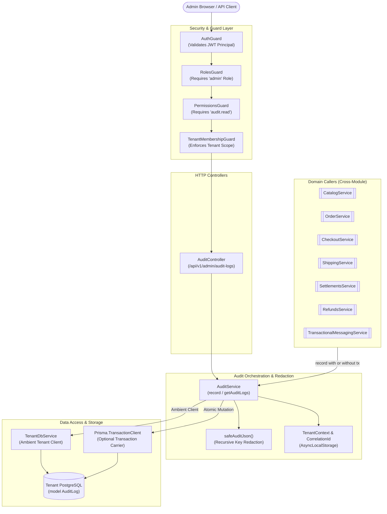
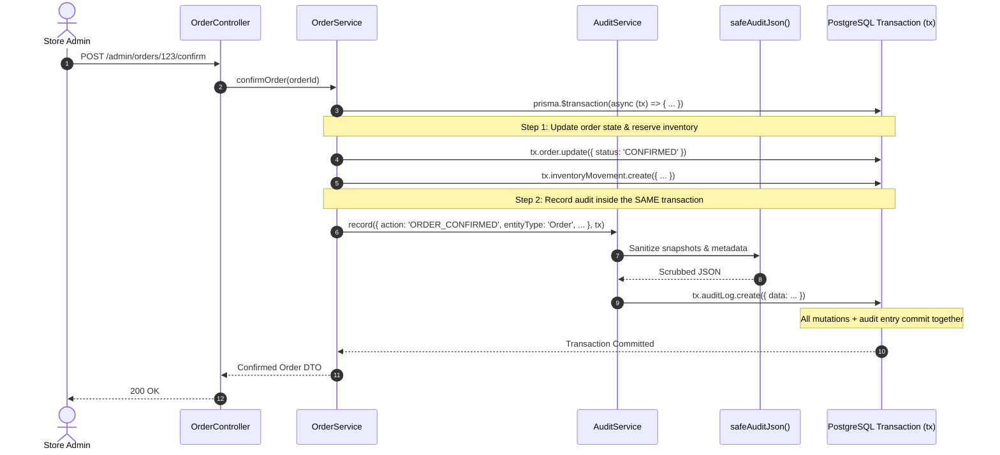
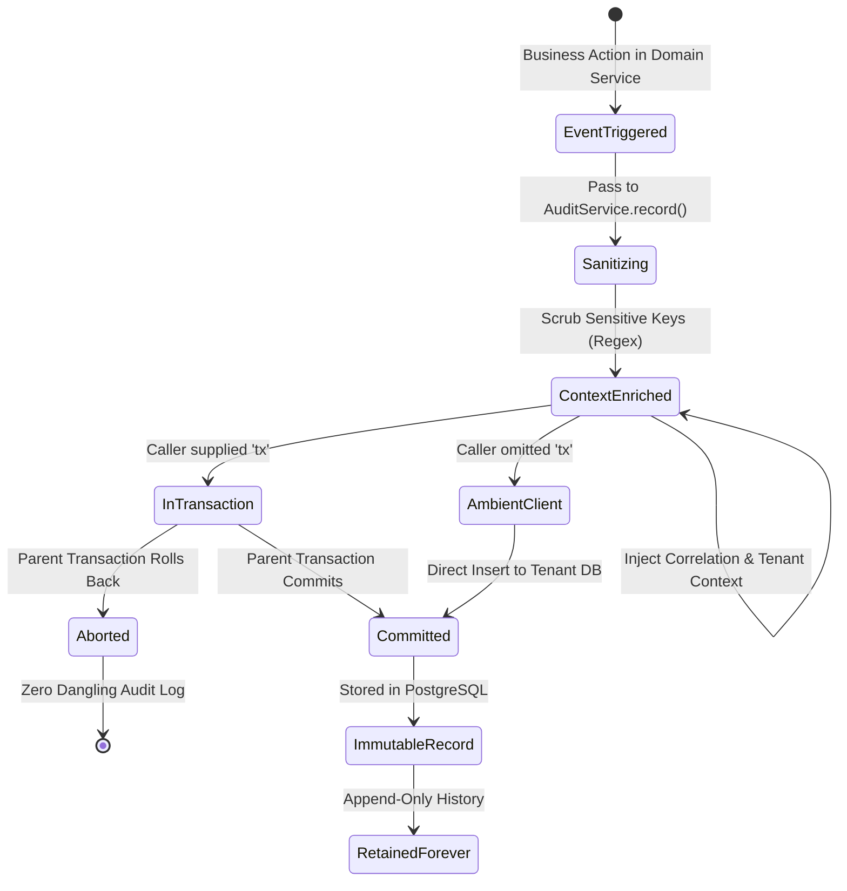

# Audit Feature

## Purpose
Provides append-only, tenant-isolated audit logging for all critical business mutations, capturing state snapshots, actor principals, execution sources, and correlation metadata with automatic sensitive data redaction.

---

## Component Architecture



### Component Source Map

| Component | Layer / Role | Relative Source Path |
| :--- | :--- | :--- |
| `AuditController` | HTTP Controller | [`./controllers/audit.controller.ts`](./controllers/audit.controller.ts) |
| `AuditService` | Orchestration & Query Service | [`./services/audit.service.ts`](./services/audit.service.ts) |
| `AuditLogQueryDto` | Request DTO Validation | [`./dto/audit.dto.ts`](./dto/audit.dto.ts) |
| `safeAuditJson` | Sanitization & Redaction Util | [`./utils/audit.util.ts`](./utils/audit.util.ts) |
| `AuditLog` Model | Prisma Schema Definition | [`../../../prisma/schema/audit.module/audit.prisma`](../../../prisma/schema/audit.module/audit.prisma) |
| `PlatformAuditService` | Control-Plane Separation Counterpart | [`../../platform/services/platform-audit.service.ts`](../../platform/services/platform-audit.service.ts) |
| `TenantDbService` | Injected Tenant Database Resolver | [`../../tenancy/services/tenant-db.service.ts`](../../tenancy/services/tenant-db.service.ts) |
| `PermissionsGuard` | Role & Permission Guard | [`../../../libs/common/src/guards/permissions.guard.ts`](../../../libs/common/src/guards/permissions.guard.ts) |

---

## Responsibilities
- **Append-Only Event Recording**: Persisting immutable records of domain mutations, configuration shifts, status updates, and administrative actions.
- **Transaction-Bound Atomicity**: Allowing caller services to pass an active `Prisma.TransactionClient` so that audit logging succeeds or rolls back atomically with the business mutation.
- **Sensitive Key Redaction**: Recursively scrubbing secret-like keys (`password`, `token`, `secret`, `api_key`, `authorization`, `cookie`, `credential`) before serializing JSON payloads.
- **Execution Context Capture**: Automatically capturing `correlationId`, `organizationId`, `tenantDatabaseId`, `domainId`, and `hostname` from server-side `AsyncLocalStorage`.
- **Administrative Querying & Filtering**: Exposing paginated, filtered views of audit logs filtered by `action`, `entityType`, `entityId`, `actorId`, and `source` (`ADMIN_API`, `SYSTEM`, `JOB`, `PROVIDER`).

## Does Not Own
- **Platform / SaaS Control-Plane Audit**: Does not log SaaS subscription, tenant provisioning, domain routing, or superadmin events (strictly owned by `PlatformAuditService` in `src/platform/`).
- **Runtime Application Logging**: Does not log low-level HTTP latency, debug traces, or server health metrics (owned by `StructuredLogger` and `LoggingInterceptor`).
- **Realtime Security Intrusion Detection**: Does not alert or block active attacks; it provides post-facto forensic proof.
- **Entity Authorization Decisions**: Does not determine if a user has permission to perform a business mutation; it only records what took place after authorization succeeded.

---

## Dependencies
- **Core / Platform**:
  - `TenantDbService` (`@app/tenancy`): Resolves the ambient tenant database.
  - `PrismaService` (`@app/database`): Fallback database client for non-tenancy development runs.
  - `AsyncLocalStorage` (`tenant-context.ts`, `correlation.ts`): Sources trusted server-side request context.
- **Internal Modules**:
  - Exported to and consumed by virtually all commerce feature modules: `CatalogModule`, `OrderModule`, `CheckoutModule`, `ShippingModule`, `SettlementsModule`, `RefundsModule`, `ReturnsModule`, `TransactionalMessagingModule`, `SettingsModule`, `StaffAccessModule`, and `CommercePaymentsModule`.
- **External Libraries / APIs**:
  - `@prisma/client`: Database models, enums (`AuditSource`), and transaction clients.
  - `class-validator` / `class-transformer`: Input validation for pagination and search queries.

---

## Database Ownership

### Writes / Mutates
- **`AuditLog`** (`prisma/schema/audit.module/audit.prisma`):
  - `id`: CUID unique log identifier.
  - `action`: String identifying the business mutation (e.g. `ORDER_CONFIRMED`, `CATEGORY_UPDATED`, `SETTINGS_PATCHED`).
  - `entityType`: Domain entity classifier (e.g. `Order`, `Product`, `DeliveryZone`).
  - `entityId`: Primary key of the affected domain entity.
  - `actorId`: User ID of the initiator (`null` if system or webhook).
  - `actorRole`: Role of the initiator (e.g. `admin`, `system`).
  - `source`: Enum (`ADMIN_API`, `SYSTEM`, `JOB`, `PROVIDER`).
  - `previousValue`: Sanitized JSON snapshot prior to mutation.
  - `newValue`: Sanitized JSON snapshot after mutation.
  - `metadata`: Sanitized JSON object containing execution context (`correlationId`, `tenantDatabaseId`, etc.).
  - `createdAt`: Timestamp defaults to `now()`.

### Reads / References
- No foreign key joins. `AuditLog` is intentionally standalone and decoupled from entity lifecycles so that deleting or archiving an entity does not delete its historical audit records.

---

## Important Invariants
1. **Append-Only Immutability**: Audit logs must never be updated (`UPDATE`) or deleted (`DELETE`) via application services. There are no `update` or `delete` methods in `AuditService`.
2. **Strict Tenant Database Confinement**: Tenant audit logs exist only inside that tenant's dedicated PostgreSQL database. One tenant cannot read, write, or join another tenant's audit logs.
3. **Transaction Colocation**: When recording an audit entry within a multi-table business mutation (e.g. order confirmation, payment capture), callers MUST pass their `tx` client so that the audit entry commits or rolls back with the mutation.
4. **Guaranteed Secret Scrubbing**: No password, bearer token, secret key, or credential cipher may be written to `previousValue`, `newValue`, or `metadata`.
5. **No Negative Offset / Unbounded Queries**: Queries must cap `limit` at 100 rows and clamp `page` to $\ge 1$.

---

## Public API & Entry Points

### HTTP Endpoints
- `GET /api/v1/admin/audit-logs`
  - **Guards**: `AuthGuard`, `RolesGuard('admin')`, `PermissionsGuard('audit.read')`, `TenantMembershipGuard`
  - **Query Parameters**: `page`, `limit`, `action`, `entityType`, `entityId`, `actorId`, `source`
  - **Response**: Paginated envelope with audit log items and pagination metadata.

### Exported Services
- `AuditService.record(input: RecordAuditInput, client?: AuditClient)`:
  - Invoked by business services across the application to write an audit entry.
  - Accepts an optional `Prisma.TransactionClient` to participate in caller-managed database transactions.
- `AuditService.getAuditLogs(query: AuditLogQueryDto)`:
  - Executes paginated filtering over tenant audit logs.

---

## Important Flows

### 1. Atomic Domain Mutation with Audit Log


### 2. Audit Record Lifecycle State Machine


---

## Brutal Honest Vulnerabilities & Architectural Debt

### 1. Denial of Service via Leading-Wildcard Substring Filtering (`ILIKE '%...%'`)
- **Vulnerability**: In [`AuditService.getAuditLogs()`](./services/audit.service.ts#L64-L80):
  ```ts
  action: query.action ? { contains: query.action.normalize('NFKC').trim(), mode: 'insensitive' } : undefined,
  entityId: query.entityId ? { contains: query.entityId.normalize('NFKC').trim(), mode: 'insensitive' } : undefined,
  ```
- **Brutal Reality**: Prisma translates `contains` with `mode: 'insensitive'` to PostgreSQL `ILIKE '%query%'`. B-tree indexes (like `@@index([action, createdAt])` and `@@index([entityType, entityId, createdAt])`) **cannot accelerate leading-wildcard searches**.
- **Threat Vector**: On a mature tenant database with $10^6+$ audit logs, an authenticated admin (or compromised API token with `audit.read`) can fire rapid concurrent requests with `?action=update&entityId=ord`. Each request forces a **full sequential table scan** across all heap blocks, pegging PostgreSQL CPU to 100% and starving critical checkout and order transactions of database connection pool slots.
- **Remediation**:
  1. Change `action` and `entityId` to exact-match (`equals`) or prefix-match (`startsWith`).
  2. If arbitrary substring search is an explicit business requirement, add a PostgreSQL Trigram GIN index:
     ```sql
     CREATE EXTENSION IF NOT EXISTS pg_trgm;
     CREATE INDEX audit_log_action_trgm_idx ON "AuditLog" USING gin (action gin_trgm_ops);
     ```

### 2. Slow Count & Offset Pagination Degradation on Large Tables
- **Vulnerability**: In [`AuditService.getAuditLogs()`](./services/audit.service.ts#L85-L93):
  ```ts
  const [items, total] = await Promise.all([
    db.auditLog.findMany({ where, skip: (query.page - 1) * query.limit, take: query.limit, orderBy: { createdAt: 'desc' } }),
    db.auditLog.count({ where }),
  ]);
  ```
- **Brutal Reality**: 
  - `count({ where })` performs an $O(N)$ row scan across all matching index tuples or table pages. In PostgreSQL, `COUNT(*)` cannot read cached metadata and must evaluate row visibility.
  - `skip: (page - 1) * limit` is classic offset pagination. Browsing to page 2,000 (`skip: 60000`) forces PostgreSQL to read, sort, and discard 60,000 rows for every request.
- **Threat Vector**: Admin dashboard UI timeouts and database buffer cache thrashing when operators browse older audit history.
- **Remediation**: Replace offset pagination with **cursor-based keyset pagination** using `(createdAt, id)` as the cursor compound, and omit the exact total count on deep pages.

### 3. Incomplete PII Redaction in `safeAuditJson`
- **Vulnerability**: In [`audit.util.ts`](./utils/audit.util.ts#L4-L5):
  ```ts
  const sensitiveKey =
    /(password|secret|token|authorization|cookie|credential|signature|api[-_]?key)/i;
  ```
- **Brutal Reality**: The regex only checks for authentication secrets. It completely ignores:
  - Bank Account Numbers, IBAN, and Routing Numbers (`accountNumber`, `iban`, `routingNumber`).
  - National Identity / Passport Numbers (`nid`, `nationalId`, `passportNumber`).
  - Credit/Debit Card PANs or CVVs (`cardNumber`, `cvv`, `pan`).
  - Customer personal phone numbers and delivery street addresses.
- **Threat Vector**: When admin users update customer profiles, refund destinations, or payment settings, the unredacted `previousValue` and `newValue` snapshots persist full customer banking details or national identity numbers into `AuditLog.previousValue/newValue`. Anyone with `audit.read` permission can dump sensitive customer PII.
- **Remediation**: Expand `sensitiveKey` to include PII and financial patterns, or enforce explicit DTO projection rather than serializing raw entities into audit logs.

### 4. Unbounded Growth Without Partitioning or Archival Retention
- **Vulnerability**: `AuditLog` has no automated table retention, time-based cleanup, or database partitioning strategy.
- **Brutal Reality**: In high-velocity e-commerce operations with inventory adjustments, price updates, order state transitions, and messaging events, `AuditLog` grows monotonically and will quickly become the single largest table in the PostgreSQL database.
- **Threat Vector**: Ballooning disk usage, extremely slow `VACUUM` maintenance, bloated database dumps (`pg_dump`), and sluggish tenant database migrations.
- **Remediation**: Implement PostgreSQL monthly range partitioning on `createdAt`:
  ```sql
  CREATE TABLE "AuditLog" ( ... ) PARTITION BY RANGE ("createdAt");
  ```
  And schedule a worker in `TenancyModule` to detach and archive partitions older than 12 months to compressed cold storage (S3/R2).

### 5. Lack of Cryptographic Tamper-Evidence (Zero Hash Chaining)
- **Vulnerability**: Rows in `AuditLog` are ordinary PostgreSQL tuples without cryptographic hashes or signature linking.
- **Brutal Reality**: If a malicious actor, rogue administrator, or attacker with SQL injection/database access gains direct write access to PostgreSQL, they can run `UPDATE "AuditLog" SET ...` or `DELETE FROM "AuditLog" WHERE ...` to erase all traces of malicious actions.
- **Threat Vector**: Fails stringent compliance audits (e.g. PCI-DSS, SOC 2 Type II) that require immutable, verifiable tamper-evidence.
- **Remediation**: Implement a hash chain where each row stores `sha256(previous_row_hash + current_row_data)`, or periodically export sealed audit blocks to an AWS S3 bucket with Object Lock (WORM - Write Once, Read Many).
