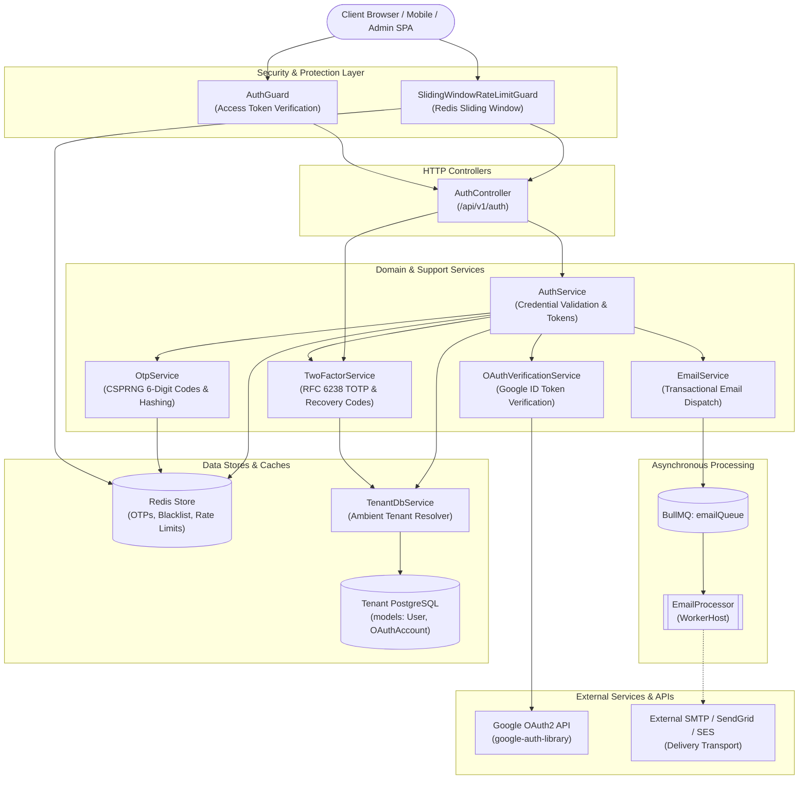
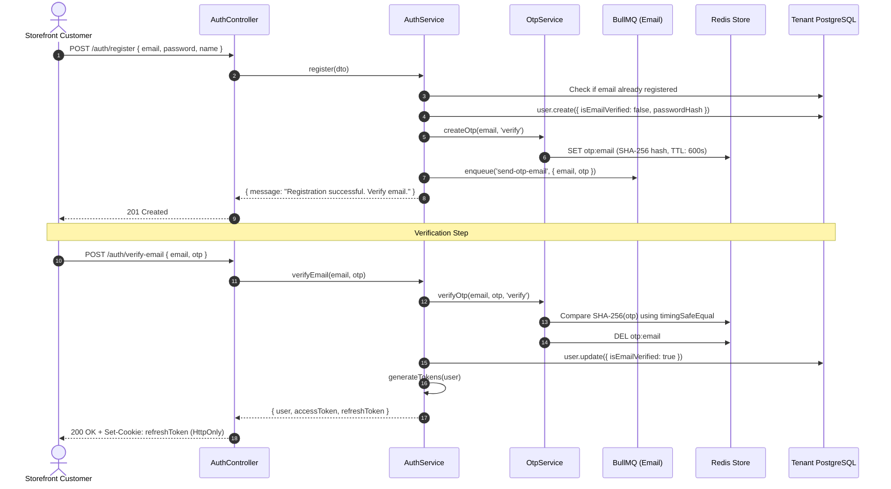
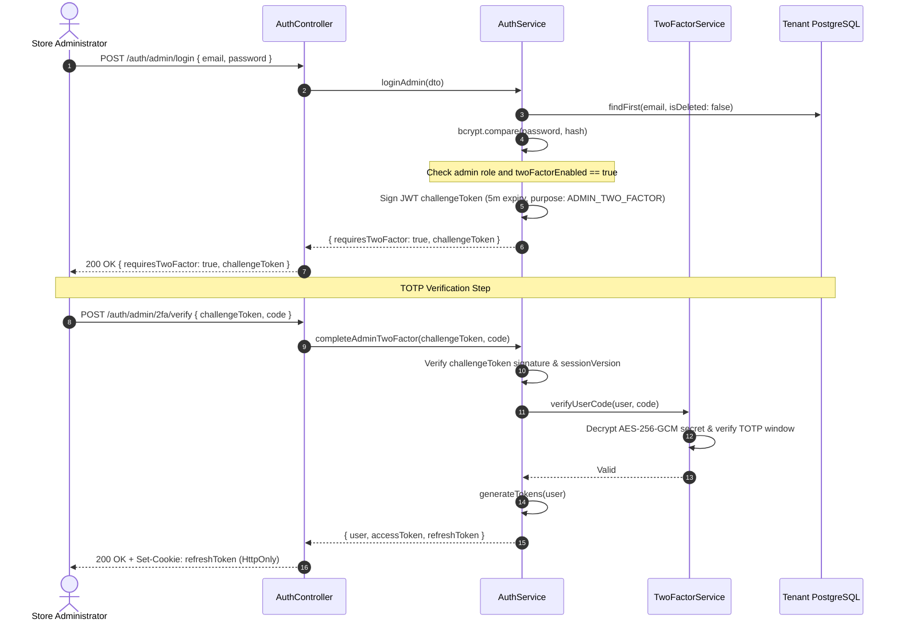
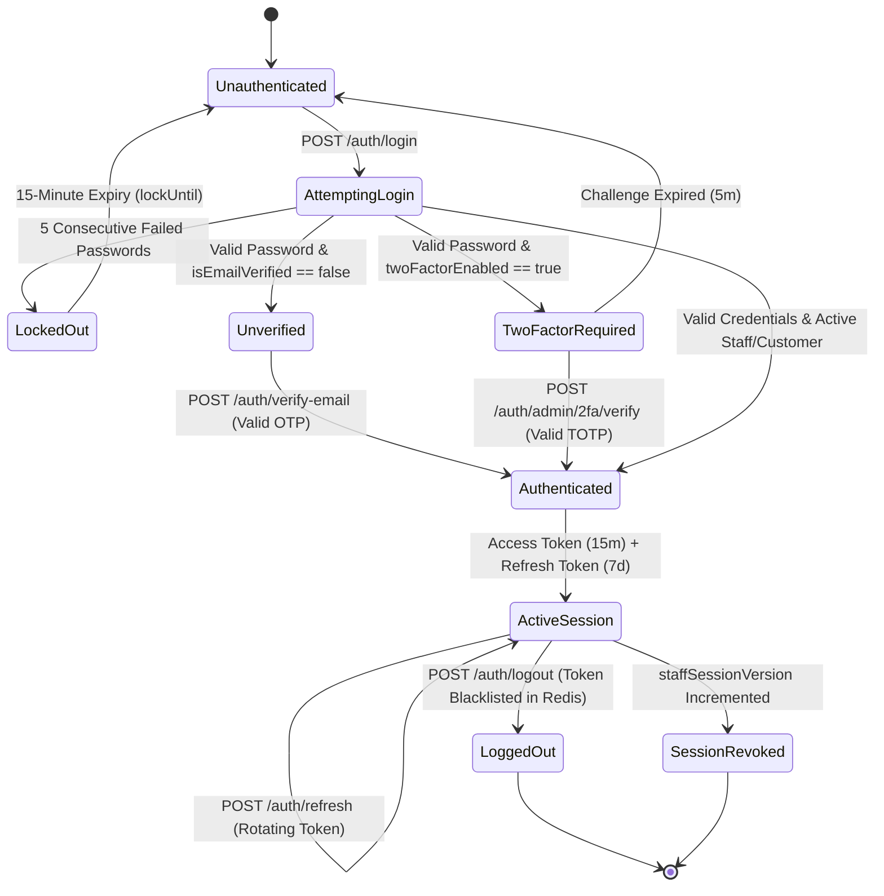

# Authentication Feature

## Purpose
Owns tenant-scoped user identity, customer credential registration and verification, dedicated staff/admin authentication, Google OAuth verification, RFC 6238 TOTP two-factor enrollment, rotating JWT sessions, and Redis-backed OTP and token revocation.

---

## Component Architecture



### Component Source Map

| Component | Layer / Role | Relative Source Path |
| :--- | :--- | :--- |
| `AuthController` | HTTP Controller | [`./auth/auth.controller.ts`](./auth/auth.controller.ts) |
| `AuthService` | Identity Orchestration | [`./auth/auth.service.ts`](./auth/auth.service.ts) |
| `TwoFactorService` | 2FA & TOTP Engine | [`./two-factor/two-factor.service.ts`](./two-factor/two-factor.service.ts) |
| `OtpService` | OTP Lifecycle & Redis | [`./otp/otp.service.ts`](./otp/otp.service.ts) |
| `OAuthVerificationService` | Google Identity Verification | [`./oauth/oauth-verification.service.ts`](./oauth/oauth-verification.service.ts) |
| `EmailService` | Queue Producer & Stubs | [`./email/email.service.ts`](./email/email.service.ts) |
| `EmailProcessor` | BullMQ Worker | [`../../../libs/queue/src/processors/email.processor.ts`](../../../libs/queue/src/processors/email.processor.ts) |
| `User` Model | Prisma Schema Definition | [`../../../prisma/schema/user/user.prisma`](../../../prisma/schema/user/user.prisma) |
| `OAuthAccount` Model | Prisma Schema Definition | [`../../../prisma/schema/user/oauthAccount.prisma`](../../../prisma/schema/user/oauthAccount.prisma) |
| `SlidingWindowRateLimitGuard` | Brute-Force Rate Limiter | [`../../../libs/common/src/guards/sliding-window-rate-limit.guard.ts`](../../../libs/common/src/guards/sliding-window-rate-limit.guard.ts) |
| `AuthGuard` | Access Token Guard | [`../../../libs/common/src/guards/auth.guard.ts`](../../../libs/common/src/guards/auth.guard.ts) |

---

## Responsibilities
- **Customer Credential Lifecycle**: Email/password registration, password hashing (bcrypt with 12 salt rounds), email verification via OTP, account lockout after 5 consecutive failed attempts, and password reset workflows.
- **Dedicated Admin Authentication**: Separate `POST /auth/admin/login` flow requiring `admin` or active `staff` roles; produces short-lived challenge tokens for accounts with two-factor authentication enabled.
- **RFC 6238 TOTP Two-Factor Authentication**: Generates base32 secrets, constructs `otpauth://` URIs, encrypts pending/confirmed secrets with AES-256-GCM, verifies 6-digit TOTP codes, and manages single-use recovery code hashes.
- **Third-Party Identity (OAuth2)**: Validates Google ID tokens via `google-auth-library`, verifies email verification claims, links `OAuthAccount` records, and creates or maps tenant commerce `Customer` links.
- **Token Lifecycle & Rotation**: Issues short-lived access tokens (15m) and rotating refresh tokens (7d) transmitted in `HttpOnly`, `SameSite: strict` secure cookies.
- **Revocation & Session Blacklisting**: Hashes refresh tokens (SHA-256) and stores revocation entries in Redis with TTLs matching token lifespan.
- **Session Versioning**: Increments `staffSessionVersion` upon staff permission adjustments or 2FA modifications, instantly invalidating outstanding refresh tokens.

## Does Not Own
- **Platform / Superadmin Authentication**: Does not authenticate control-plane administrators (`PlatformUser`), which is strictly owned by `PlatformAuthModule` connecting to `PlatformPrismaService`.
- **Customer Commerce Profiles & Addresses**: Does not manage shipping addresses, profile metadata, or billing preferences (owned by `CustomerAccountModule` and `UserModule`).
- **Staff Permission Governance**: Does not grant roles, define permission constants, or dispatch staff invitations (owned by `StaffAccessModule`).
- **Direct Mail Transport Configuration**: Does not own live SMTP connections, DKIM, or SPF headers (delegated to worker queue and mail provider).

---

## Dependencies
- **Core / Platform**:
  - `TenantDbService` (`@app/tenancy`): Resolves the ambient tenant database.
  - `RedisService` (`@app/redis`): Backs sliding-window rate limiters, token revocation blacklists, and OTP storage.
  - `JwtService` (`@nestjs/jwt`): Cryptographic signing and verification of access, refresh, and 2FA challenge tokens.
  - `AsyncLocalStorage` (`tenant-context.ts`): Supplies ambient `organizationId` for token binding.
- **Internal Modules**:
  - `TenancyModule`: Injected to resolve per-tenant Prisma clients.
  - `BullMQModule` (`@app/queue`): Hosts the `email` worker queue.
- **External Libraries / APIs**:
  - `bcrypt`: Password hashing and verification.
  - `google-auth-library`: Verifying Google OAuth2 ID tokens.
  - `bullmq`: Asynchronous queueing of email notifications.

---

## Database Ownership

### Writes / Mutates
- **`User`** (`prisma/schema/user/user.prisma`):
  - Creates customer accounts (`email`, `password`, `phoneNumber`, `isEmailVerified: false`).
  - Updates verification status on `verifyEmail()`.
  - Updates `failedLoginAttempts` and `lockUntil` (15-minute lockout on 5 failed attempts).
  - Updates `twoFactorEnabled`, `twoFactorSecretEncrypted`, `twoFactorPendingEncrypted`, `twoFactorRecoveryCodeHashes`, and increments `staffSessionVersion`.
  - Links `customerId` automatically on OAuth login if an existing customer record matches the verified email.
- **`OAuthAccount`** (`prisma/schema/user/oauthAccount.prisma`):
  - Upserts provider linkage on `oauthLogin()`.
  - Updates `lastUsedAt`, `isVerified`, and `isDeleted: false`.

### Reads / References
- **`Customer`**: Read by email during OAuth login to populate `user.customerId`.

---

## Important Invariants
1. **Tenant Isolation**: Every user record is scoped to its tenant's database. A customer or staff member in Organization A cannot authenticate or access Organization B.
2. **Platform vs. Tenant Separation**: Platform administrators (`PlatformUser`) must NEVER be authenticated via tenant `AuthController`.
3. **No Direct Admin Tokens via Customer Login**: `POST /auth/login` validates credentials against the customer audience. Admin users signing in through the storefront login do not receive elevated staff tokens.
4. **Mandatory 2FA Challenge Flow for Protected Staff**: When `twoFactorEnabled` is true, admin login returns `{ requiresTwoFactor: true, challengeToken }`. A complete access token is never issued until `verifyAdminTwoFactor` validates the challenge and TOTP code.
5. **Anti-Enumeration Contract**: `register()`, `forgotPassword()`, and `resendVerification()` return identical generic messages whether the account exists or not, preventing attackers from probing for registered emails.
6. **Fail-Closed Token Refresh**: If Redis is offline during a token refresh request, the backend throws `503 Service Unavailable` rather than risking accepting a revoked refresh token.
7. **Tenant Context Binding on Tokens**: JWT access and refresh tokens embed the server-side `organizationId`. If a client presents a token issued for Tenant A against Tenant B's domain, the request is rejected with `401 Unauthorized`.

---

## Public API & Entry Points

### HTTP Endpoints
- `POST /api/v1/auth/register` - Registers new customer (`SlidingWindowRateLimitGuard: strict`).
- `POST /api/v1/auth/verify-email` - Verifies customer email with OTP and establishes session.
- `POST /api/v1/auth/resend-verification` - Dispatches new email verification OTP.
- `POST /api/v1/auth/login` - Storefront customer login (`SlidingWindowRateLimitGuard: auth`).
- `POST /api/v1/auth/admin/login` - Staff/Admin login with optional 2FA challenge response.
- `POST /api/v1/auth/admin/2fa/verify` - Completes admin login using challenge token + 6-digit TOTP code.
- `GET /api/v1/auth/admin/2fa` - Checks 2FA status for authenticated staff (`AuthGuard`).
- `POST /api/v1/auth/admin/2fa/setup` - Generates TOTP secret and QR code URI (`AuthGuard`).
- `POST /api/v1/auth/admin/2fa/confirm` - Confirms 2FA setup with TOTP code and returns recovery codes (`AuthGuard`).
- `POST /api/v1/auth/admin/2fa/disable` - Disables 2FA using password + code (`AuthGuard`).
- `POST /api/v1/auth/oauth` - Authenticates customer via Google ID token.
- `POST /api/v1/auth/refresh` - Rotates access/refresh tokens using HTTP-only cookie.
- `POST /api/v1/auth/logout` - Blacklists refresh token in Redis and clears cookies.
- `POST /api/v1/auth/forgot-password` - Sends password reset OTP.
- `POST /api/v1/auth/verify-otp` - Verifies password reset OTP without resetting password.
- `POST /api/v1/auth/reset-password` - Sets new password with OTP.
- `GET /api/v1/auth/session` - Returns authenticated principal metadata (`AuthGuard`).

---

## Important Flows

### 1. Customer Registration & Email Verification


### 2. Staff Admin Login with Two-Factor Challenge


### 3. Authentication & Account Lockout State Machine


---

## Brutal Honest Vulnerabilities & Architectural Debt

### 1. Simulated Email Delivery in Production & Legacy String Residue (Critical Operational Gap)
- **Vulnerability**: In [`EmailService.sendOtpEmailNow()`](./email/email.service.ts#L55-L74) and [`EmailService.sendWelcomeEmailNow()`](./email/email.service.ts#L90-L101):
  ```ts
  sendOtpEmailNow(email: string, otp: string, type: 'verify' | 'reset'): Promise<void> {
    this.logger.log('authentication_email_delivery_simulated', { template: 'OTP', purpose: type });
    void email;
    void otp;
    return Promise.resolve();
  }
  ```
  And in [`EmailService.sendWelcomeEmailNow()`](./email/email.service.ts#L100):
  ```ts
  // subject: 'Welcome to Task Management!',
  ```
- **Brutal Reality**: Real email transport (e.g. SMTP, AWS SES, SendGrid, Postmark) is **completely unimplemented**. The service discards the generated OTP and logs a simulated event. In production, customers will never receive their registration verification codes or password reset emails.
- **Development Leak Risk**: In `AuthService.register()`, the OTP is leaked in the HTTP response if `NODE_ENV === 'development'`:
  ```ts
  ...(process.env.NODE_ENV === 'development' && { otp }),
  ```
  If staging environments mistakenly run without `NODE_ENV=production`, OTPs are exposed to frontend API inspectors.
- **Remediation**: Implement a real `EmailDeliveryService` adapter connecting to SendGrid or SES inside `EmailProcessor`, and purge legacy `"Task Management"` template references.

### 2. 15-Minute Revocation Blindspot on Access Tokens (Stateless JWT Gap)
- **Vulnerability**: In [`AuthService.logout()`](./auth/auth.service.ts#L523-L526):
  ```ts
  async logout(refreshToken: string) {
    await this.blacklistToken(refreshToken);
    return { message: 'Logout successful' };
  }
  ```
- **Brutal Reality**: Only the **refresh token** is added to the Redis blacklist. The **access token** is not blacklisted. `AuthGuard` in `libs/common/src/guards/auth.guard.ts` only validates the cryptographic signature and expiration timestamp of the bearer token; it does **not** check Redis.
- **Threat Vector**: If a user logs out, or an employee's staff access is revoked, an attacker who obtained the bearer access token can continue issuing authenticated API requests for up to 15 minutes (`JWT_ACCESS_EXPIRY`) without being blocked.
- **Remediation**:
  1. Add an optional Redis revocation check on access token JTI in `AuthGuard` for high-security endpoints.
  2. Or enforce real-time user status checks for staff actions by validating `staffSessionVersion` against the database or a fast Redis cache.

### 3. Password Verification Timing Attack (User Enumeration via Latency)
- **Vulnerability**: In [`AuthService.validateCredentials()`](./auth/auth.service.ts#L228-L254):
  ```ts
  const user = await db.user.findFirst({ where: { ... } });
  if (!user || !user.password) {
    throw new UnauthorizedException('Invalid credentials');
  }
  const isValid = await bcrypt.compare(loginDto.password, user.password);
  ```
- **Brutal Reality**: When an email is NOT in the database, the method throws immediately in ~2ms. When the email DOES exist, `bcrypt.compare()` executes with 12 rounds of bcrypt, taking ~150–250ms of CPU time.
- **Threat Vector**: Even though the error message is a generic `"Invalid credentials"`, an attacker can measure the network response latency distribution to reliably enumerate whether an email or phone number is registered on the store.
- **Remediation**: Run a dummy bcrypt comparison against a pre-computed hash when `user` is not found, ensuring uniform ~200ms latency regardless of account existence:
  ```ts
  const DUMMY_HASH = '$2b$12$e80...dummyhash...';
  const hashToCompare = user?.password ?? DUMMY_HASH;
  const isValid = await bcrypt.compare(loginDto.password, hashToCompare);
  if (!user || !isValid) throw new UnauthorizedException('Invalid credentials');
  ```

### 4. TOTP Replay Within Valid 90-Second Window
- **Vulnerability**: In [`TwoFactorService.verifyTotp()`](./two-factor/two-factor.service.ts#L170-L195):
  ```ts
  for (let window = -1; window <= 1; window++) {
    if (this.generateTotp(secret, counter + window) === code) {
      return true;
    }
  }
  ```
- **Brutal Reality**: The verification loop allows a window of $\pm 1$ step (up to 90 seconds of validity), but it **does not track or store used codes**.
- **Threat Vector**: A network interceptor, malicious proxy, or eavesdropper who sniffs a valid 6-digit TOTP code can replay that code within the remaining 30–60 seconds of the window to gain unauthorized access.
- **Remediation**: Store verified TOTP codes in Redis with a 90-second TTL:
  ```ts
  const usedKey = `totp:used:${user.id}:${code}`;
  const alreadyUsed = await redis.set(usedKey, '1', 'EX', 90, 'NX');
  if (!alreadyUsed) throw new UnauthorizedException('Code already used');
  ```

### 5. Pre-Registered Account Takeover via Unverified OAuth Linking
- **Vulnerability**: In [`AuthService.oauthLogin()`](./auth/auth.service.ts#L707-L740):
  ```ts
  const emailUser = await transaction.user.findUnique({ where: { email: normalizedEmail } });
  ...
  const accountUser = emailUser
    ? await transaction.user.update({
        where: { id: emailUser.id },
        data: { isEmailVerified: true, profileImageUrl: ... },
      })
    : await transaction.user.create(...);
  await transaction.oAuthAccount.upsert(...);
  ```
- **Brutal Reality**: If an attacker registers a target's email (`target@gmail.com`) with a password before the real owner does, the account sits with `isEmailVerified: false`. When the real owner clicks "Sign in with Google", the system links the Google OAuth account to the existing `emailUser` and marks `isEmailVerified: true`.
- **Threat Vector**: The attacker still knows the original local password they set! Now that the account is marked `isEmailVerified: true`, the attacker can log in via `POST /auth/login` using their password and access the victim's newly created account.
- **Remediation**: When linking Google OAuth to an existing unverified local password account, reset the existing password to null or require re-verification of the local credential before linking.

### 6. Dual Conflicting Rate-Limiting Mechanisms
- **Vulnerability**: `AuthModule` imports `ThrottlerModule.forRoot([{ ttl: 900000, limit: 5 }])`, while `AuthController` endpoints are decorated with `@UseGuards(SlidingWindowRateLimitGuard)` and `@RateLimit(GLOBAL_RATE_LIMITS.auth)`.
- **Brutal Reality**: `ThrottlerModule` uses in-memory process state (not shared across horizontal containers), while `SlidingWindowRateLimitGuard` uses Redis. Having two competing rate-limiting paradigms creates confusing configuration drift, where local memory throttlers could fire before distributed Redis limits.
- **Remediation**: Remove `ThrottlerModule` and rely exclusively on the distributed `SlidingWindowRateLimitGuard` backed by Redis.
