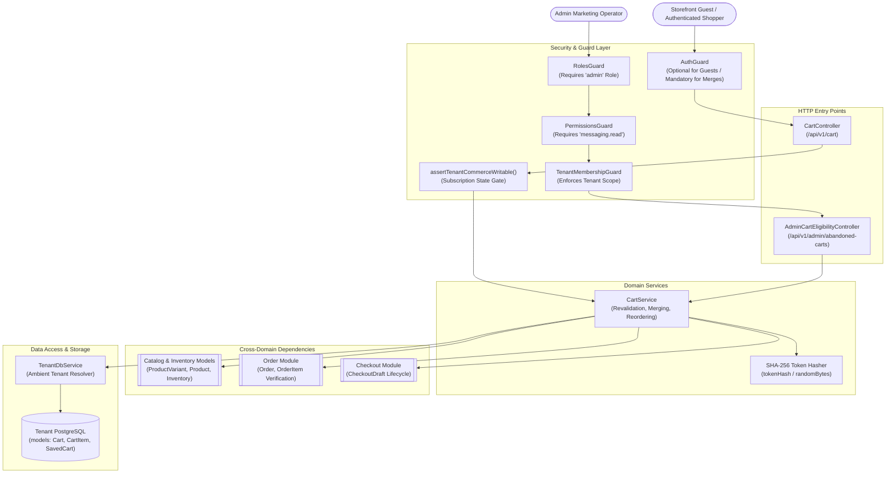
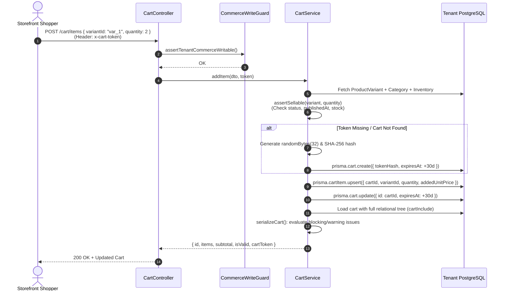
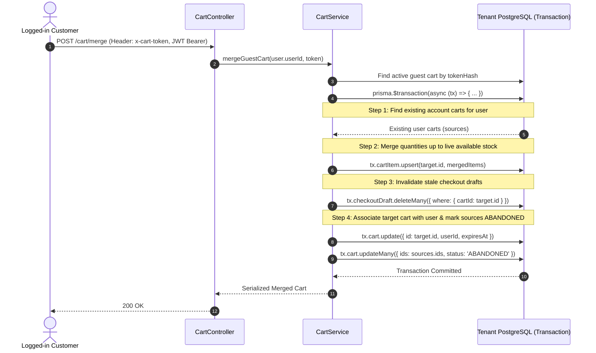
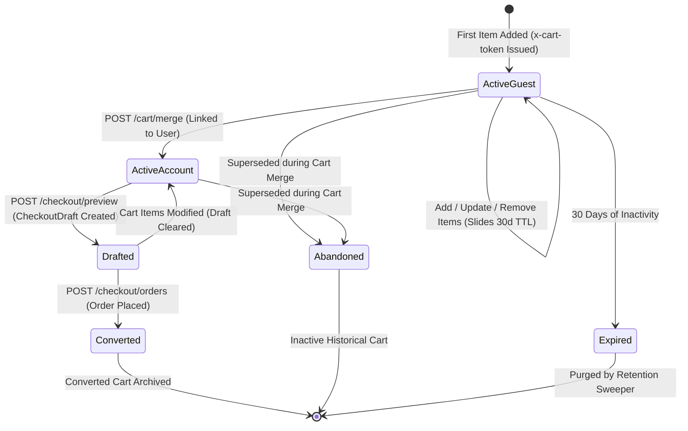

# Cart Feature

## Purpose
Manages persistent guest and authenticated shopping carts, live inventory and publication revalidation, non-reserving stock estimation, guest-to-account merging, named saved carts with shareable links, and past-order reordering.

---

## Component Architecture



### Component Source Map

| Component | Layer / Role | Relative Source Path |
| :--- | :--- | :--- |
| `CartController` | HTTP Controller (Public / Customer) | [`./cart.controller.ts`](./cart.controller.ts) |
| `AdminCartEligibilityController` | HTTP Controller (Admin Abandonment) | [`./cart.controller.ts`](./cart.controller.ts) |
| `CartService` | Domain Orchestration & Serialization | [`./cart.service.ts`](./cart.service.ts) |
| `AddCartItemDto` / `UpdateCartItemDto` | Request Validation DTOs | [`./cart.dto.ts`](./cart.dto.ts) |
| `Cart` & `CartItem` Models | Prisma Schema Definition | [`../../../prisma/schema/cart.module/cart.prisma`](../../../prisma/schema/cart.module/cart.prisma) |
| `SavedCart` & `SavedCartItem` Models | Prisma Schema Definition | [`../../../prisma/schema/cart.module/cart.prisma`](../../../prisma/schema/cart.module/cart.prisma) |
| `CheckoutDraft` Relation | Cross-Module Invalidation Target | [`../../../prisma/schema/checkout.module/checkoutDraft.prisma`](../../../prisma/schema/checkout.module/checkoutDraft.prisma) |
| `ProductVariant` & `Inventory` Models | Stock & Catalog Dependency | [`../../../prisma/schema/catalog.module`](../../../prisma/schema/catalog.module) |

---

## Responsibilities
- **Persistent Guest Carts**: Allocates 32-byte cryptographically secure tokens (`x-cart-token`), hashes them via SHA-256 for database storage, and retains active carts with 30-day sliding expirations.
- **Dynamic Server-Side Revalidation**: Checks real-time catalog publication (`product.status === 'ACTIVE'`, `product.publishedAt <= now`), category visibility, variant status, and available stock (`onHand - reserved - damaged`) on every read and mutation.
- **Price Drift Warnings**: Detects price changes since an item was added, populating non-blocking `PRICE_CHANGED` issue warnings while calculating authoritative line totals from current variant prices.
- **In-Place Variant Switching**: Supports switching to a sibling variant belonging to the exact same product, merging quantities if the target variant already exists in the cart.
- **Guest-to-Authenticated Cart Merging**: Merges unauthenticated guest items into the user's primary account cart, clamps quantities to live stock, deletes stale `CheckoutDraft` records, and marks source carts as `ABANDONED`.
- **Saved & Shared Carts**: Allows shoppers to save named carts, generates shareable hexadecimal tokens (`shareToken`), allows public read/import of shared carts, and enables copying shared carts to registered accounts.
- **Customer Order Reordering**: Imports items from a previously placed order into the active cart, verifying customer profile ownership (`order.customerId === viewer.customerId`).
- **Abandoned Cart Recovery Eligibility**: Identifies inactive, marketing-consented carts for administrative notification workflows.

## Does Not Own
- **Authoritative Checkout Pricing & Calculations**: Does not apply coupon codes, delivery zone fees, or COD policies (strictly owned by `CheckoutService` in `src/features/checkout`).
- **Inventory Reservation**: Never reserves or decrements stock. Stock is only reserved during order confirmation inside a serializable transaction (owned by `OrderService`).
- **Order Placement & Payment Processing**: Does not create order records or initiate payment attempts (owned by `OrderModule` and `CommercePaymentsModule`).
- **Customer Address Management**: Does not store recipient shipping or billing addresses (owned by `CustomerAccountModule`).

---

## Dependencies
- **Core / Platform**:
  - `TenantDbService` (`@app/tenancy`): Resolves the active tenant PostgreSQL database.
  - `assertTenantCommerceWritable`: Write gate ensuring the tenant's store is not suspended or read-only.
- **Internal Modules**:
  - `CatalogModule`: Referenced for variants, product statuses, categories, media, and multi-warehouse inventory.
  - `OrderModule`: Referenced during past-order reordering.
  - `CheckoutModule`: Cleans up existing `CheckoutDraft` records whenever cart composition shifts.
- **External Libraries / APIs**:
  - `crypto`: Node.js native `createHash('sha256')` and `randomBytes(32)` for secure token generation and hashing.
  - `class-validator` / `class-transformer`: Input validation on quantities and variant IDs.

---

## Database Ownership

### Writes / Mutates
- **`Cart`** (`prisma/schema/cart.module/cart.prisma`):
  - Creates new guest carts with `tokenHash` and 30-day `expiresAt`.
  - Updates `expiresAt` on every item mutation.
  - Sets `userId` on cart merging.
  - Updates `status` to `ABANDONED` for source carts absorbed during account merging.
- **`CartItem`** (`prisma/schema/cart.module/cart.prisma`):
  - Upserts line items (`@@unique([cartId, variantId])`), updating `quantity` and `addedUnitPrice`.
  - Deletes items on `removeItem` or during variant replacement.
- **`SavedCart` & `SavedCartItem`** (`prisma/schema/cart.module/cart.prisma`):
  - Creates saved carts with unique `shareToken`.
  - Deletes saved carts on `deleteSavedCart()`.
- **`CheckoutDraft`** (`prisma/schema/checkout.module/checkoutDraft.prisma`):
  - Deletes existing draft (`cart.checkoutDraft`) whenever cart items are merged, ensuring stale totals are never used for checkout.

### Reads / References
- **`ProductVariant`**, **`Product`**, **`Category`**, **`Inventory`**: Read on every cart access to compute live availability and prices.
- **`Order`**, **`OrderItem`**: Read during `reorderFromOrder()`.
- **`User`**: Read to verify customer identity during reorder and abandoned cart checks.

---

## Important Invariants
1. **Zero Inventory Reservation**: Adding an item to a cart reserves zero inventory. Available stock is calculated dynamically as $\max(0, \text{onHand} - \text{reserved} - \text{damaged})$. Items can go out of stock while sitting in an active cart.
2. **Opaque Token Hashing**: Raw cart tokens are never written to disk or database tables. Only `SHA-256(rawToken)` is stored in `Cart.tokenHash`.
3. **Tenant Database Confinement**: All cart operations run strictly against the caller's resolved tenant database. A cart token cannot resolve across tenant boundaries.
4. **Authoritative Line Pricing**: Stored `addedUnitPrice` is strictly an informational historical snapshot. Authoritative line item totals are calculated as $\text{currentUnitPrice} \times \text{quantity}$ on every read.
5. **Customer Reorder Ownership**: An order reorder request MUST prove that `order.customerId` matches the calling user's account `customerId`. Unauthenticated callers or cross-account callers are rejected with `404 Not Found`.
6. **Same-Product Variant Switch Boundary**: In `updateItem`, a line item can only transition to a `replacementVariantId` belonging to the exact same `productId`.
7. **Commerce Writable Check**: Every mutation (`addItem`, `updateItem`, `removeItem`) begins with `assertTenantCommerceWritable()`.

---

## Public API & Entry Points

### HTTP Endpoints
- `GET /api/v1/cart` - Fetches and revalidates active cart using `x-cart-token` header.
- `POST /api/v1/cart/items` - Adds item (`variantId`, `quantity`) to cart; returns updated cart and `cartToken`.
- `PATCH /api/v1/cart/items/:variantId` - Updates item quantity or switches variant.
- `DELETE /api/v1/cart/items/:variantId` - Removes item from cart.
- `POST /api/v1/cart/validate` - Explicitly revalidates cart lines without mutating state.
- `POST /api/v1/cart/merge` - Merges guest cart into authenticated customer account (`AuthGuard`).
- `POST /api/v1/cart/save` - Saves active cart as a named saved cart (`SaveCartDto`).
- `GET /api/v1/cart/saved` - Lists authenticated user's saved carts (`AuthGuard`).
- `GET /api/v1/cart/saved/share/:shareToken` - Publicly inspects a shared cart by token.
- `POST /api/v1/cart/saved/share/:shareToken/import` - Imports available shared cart items into active cart.
- `POST /api/v1/cart/saved/share/:shareToken/save-to-account` - Copies shared cart to user's saved carts (`AuthGuard`).
- `DELETE /api/v1/cart/saved/:id` - Deletes user's saved cart (`AuthGuard`).
- `POST /api/v1/cart/reorder/:orderId` - Imports past order items into active cart (`AuthGuard`, `ReorderDto`).
- `GET /api/v1/admin/abandoned-carts/eligible` - Lists marketing-eligible abandoned carts (`Admin`, `messaging.read`).

### Exported Services
- `CartService.getCart(token)` - Retrieves and serializes active cart.
- `CartService.addItem(dto, token)` - Adds item and handles token issuance.
- `CartService.mergeGuestCart(userId, token)` - Merges guest cart into user cart.
- `CartService.validateCart(token)` - Performs dry-run validation of cart lines.

---

## Important Flows

### 1. Item Addition & Live Cart Revalidation


### 2. Guest-to-Authenticated Cart Merging


### 3. Cart Lifecycle State Machine


---

## Brutal Honest Vulnerabilities & Architectural Debt

### 1. Unbounded Cart Item Growth & Memory Exhaustion (DoS Vulnerability)
- **Vulnerability**: In [`CartService.addItem()`](./cart.service.ts#L481-L521):
  ```ts
  await transaction.cartItem.upsert({ ... });
  ```
- **Brutal Reality**: There is **no maximum limit** on the number of distinct items a cart can hold. A script can easily add 5,000 distinct product variants to a single cart token.
- **Threat Vector**: When `serializeCart()` or `loadCart()` is executed, Prisma loads the cart using `cartInclude`:
  ```ts
  include: {
    items: {
      include: {
        variant: {
          include: {
            inventory: true,
            product: {
              include: {
                category: true,
                media: true,
                variants: { include: { inventory: true } }, // ⚠️ Massive nested tree!
              },
            },
          },
        },
      },
    },
  }
  ```
  Loading 5,000 items alongside all sibling variants, inventories, and media assets generates a **50MB+ in-memory JavaScript object graph**. Fetching or validating this cart blocks Node.js event-loop threads and crashes the server with an Out-of-Memory (OOM) error.
- **Remediation**: Enforce a strict maximum item limit (e.g. `MAX_CART_ITEMS = 50`) in `addItem()`, throwing `409 Conflict` when exceeded.

### 2. Relational Over-Fetching in `cartInclude`
- **Vulnerability**: For *every single cart item*, `cartInclude` pulls `product.variants` and their inventories so that `serializeCart()` can construct an `availableVariants` array for frontend dropdowns:
  ```ts
  const availableVariants = (product.variants ?? []).map((variant) => ({ ... }));
  ```
- **Brutal Reality**: If a customer has 20 items in their cart and each product has 20 variants, PostgreSQL returns and joins over 400 variant rows and 400 inventory rows on every single `GET /cart` request.
- **Threat Vector**: Extreme database CPU overhead, large payload transmission between PostgreSQL and NestJS, and slow cart page load times.
- **Remediation**: Omit sibling variants (`product.variants`) from the default cart serializer. Fetch variant options on-demand via a dedicated catalog endpoint (`GET /catalog/products/:id/variants`) only when the customer opens a "change variant" modal.

### 3. Public Unauthenticated Cart Saving Spam (`POST /cart/save`)
- **Vulnerability**: In [`CartController.saveCart()`](./cart.controller.ts#L87-L97):
  ```ts
  @Post('save')
  @UseGuards(AuthGuard)
  @Public() // ⚠️ Bypasses authentication!
  saveCart(@Body() dto: SaveCartDto, @Headers('x-cart-token') token?: string, @User() user?: UserPayload)
  ```
- **Brutal Reality**: Because of `@Public()`, anyone with a guest cart token can call `saveCart`. Every call generates a new `SavedCart` with a 16-byte `shareToken` and duplicates all items into `SavedCartItem`.
- **Threat Vector**: An unauthenticated attacker can call `/cart/save` in a tight loop, generating millions of orphaned `savedCart` and `savedCartItem` records with `userId: null`, filling up the tenant database disk.
- **Remediation**: Remove `@Public()`, requiring customers to be logged in to save carts, or add a strict Redis rate limiter (`RateLimitGuard: strict`) on guest cart saving.

### 4. Race Condition on First Item Addition (Split Cart Tokens)
- **Vulnerability**: In [`CartService.addItem()`](./cart.service.ts#L482-L501):
  ```ts
  const existingCart = await this.findActiveCart(token);
  // ...
  await db.$transaction(async (transaction) => {
    if (!cartId) {
      effectiveToken = randomBytes(32).toString('base64url');
      const cart = await transaction.cart.create({ ... });
      cartId = cart.id;
    }
  });
  ```
- **Brutal Reality**: If an unauthenticated user without an `x-cart-token` clicks "Add to Cart" twice concurrently (e.g. rapid double-click or multiple browser tabs), both requests see `token === undefined` and `existingCart === null`. Both transactions execute concurrently, creating **two distinct carts** with different tokens.
- **Threat Vector**: The browser client receives and stores only the token from the second response; the item from the first request is orphaned in a phantom cart.
- **Remediation**: Implement a dedicated `POST /cart` endpoint to initialize tokens, or issue the token via an HTTP-only cookie during the first page response.

### 5. Sequential Database Round-Trips in Shared Cart Import & Reorder
- **Vulnerability**: In [`importSharedCart()`](./cart.service.ts#L790-L812) and [`reorderFromOrder()`](./cart.service.ts#L931-L961):
  ```ts
  for (const item of targetItems) {
    const result = await this.addItem({ variantId: item.variantId, quantity: item.quantity }, effectiveToken);
    effectiveToken = result.cartToken ?? effectiveToken;
  }
  ```
- **Brutal Reality**: The service loops sequentially over each item, invoking `addItem()` one by one. Each item executes its own separate transaction, variant availability query, inventory check, and full cart reload!
- **Threat Vector**: Importing a shared cart or reordering an order with 15–20 items takes **15–20 sequential database round trips**, resulting in 2–4 seconds of HTTP latency and high connection pool holding times.
- **Remediation**: Introduce a batch `addItems(items: AddCartItemDto[], token?: string)` method that validates all items in a single query and inserts them in one atomic transaction.
