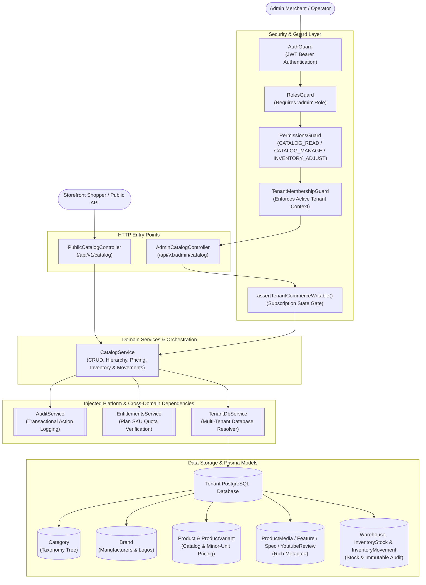
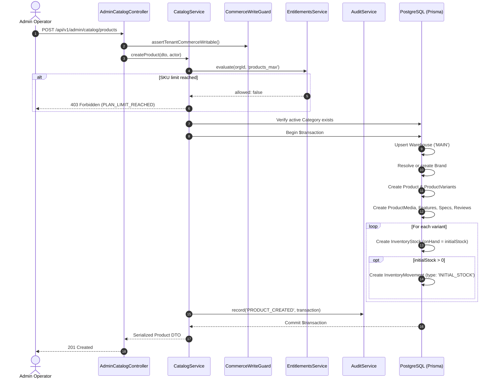
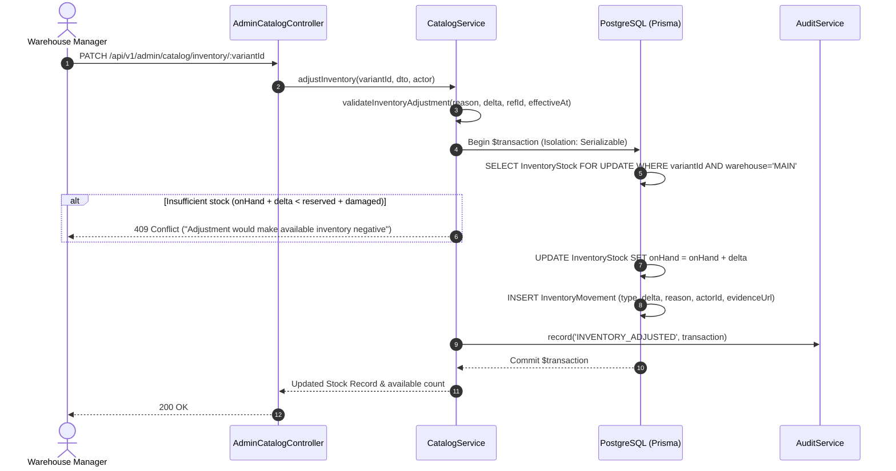
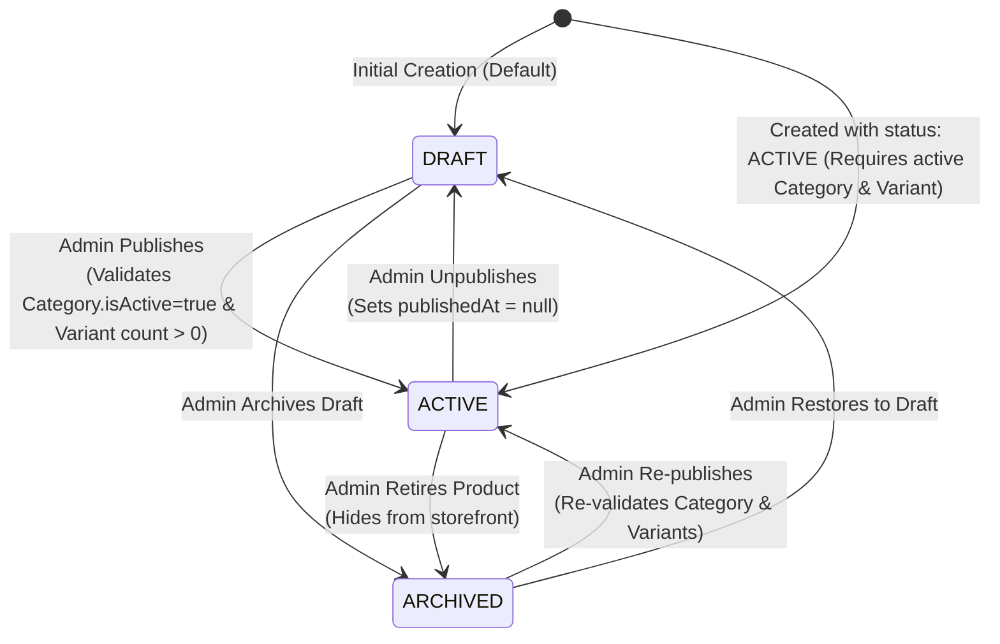

# Catalog Feature

## Purpose
Manages the master e-commerce product catalog, category taxonomy trees, brand directory, multi-variant pricing, rich media, moderated customer video reviews, structured specifications, feature highlights, and warehouse inventory stock levels with an append-only audit trail of movements.

---

## Component Architecture



### Component Source Map

| Component | Layer / Role | Relative Source Path |
| :--- | :--- | :--- |
| `PublicCatalogController` | HTTP Controller (Public Storefront) | [`./catalog.controller.ts`](./catalog.controller.ts) |
| `AdminCatalogController` | HTTP Controller (Admin Management) | [`./catalog.controller.ts`](./catalog.controller.ts) |
| `CatalogService` | Domain Orchestration & Inventory Engine | [`./catalog.service.ts`](./catalog.service.ts) |
| `CreateProductDto` / `UpdateProductDto` | Product Request Validation DTOs | [`./dto/catalog.dto.ts`](./dto/catalog.dto.ts) |
| `CreateCategoryDto` / `UpdateCategoryDto` | Category Request Validation DTOs | [`./dto/catalog.dto.ts`](./dto/catalog.dto.ts) |
| `CreateBrandDto` / `UpdateBrandDto` | Brand Request Validation DTOs | [`./dto/catalog.dto.ts`](./dto/catalog.dto.ts) |
| `AdjustInventoryDto` / `InventoryQueryDto` | Inventory Request & Filter DTOs | [`./dto/catalog.dto.ts`](./dto/catalog.dto.ts) |
| `AuditService` | Synchronous Audit Recording | [`../audit/services/audit.service.ts`](../audit/services/audit.service.ts) |
| `EntitlementsService` | SKU Limit Quota Enforcement | [`../../platform/services/entitlements.service.ts`](../../platform/services/entitlements.service.ts) |
| `TenantDbService` | Dynamic Tenant Database Resolver | [`../../tenancy/services/tenant-db.service.ts`](../../tenancy/services/tenant-db.service.ts) |
| `Catalog Prisma Schema` | Catalog Domain Models | [`../../../prisma/schema/catalog.module/catalog.prisma`](../../../prisma/schema/catalog.module/catalog.prisma) |
| `Inventory Prisma Schema` | Warehouse & Stock Tracking Models | [`../../../prisma/schema/inventory.module/inventory.prisma`](../../../prisma/schema/inventory.module/inventory.prisma) |

---

## Responsibilities

- **Taxonomy Tree Management**: Maintains hierarchical product categories with sort ordering, slug auto-generation from names, parent-child relations, and cycle prevention.
- **Brand Registry**: Manages manufacturer and brand identities, logos, descriptions, and relational mappings to products.
- **Multi-Variant Product Catalog**: Manages master products and variants with strict SKU uniqueness, minor currency unit integer pricing, compare-at promotional prices, weights, and arbitrary JSON variant attributes.
- **Rich Content & Technical Specifications**: Handles structured product feature lists, key-value specification groups, and ordered media items (images and video embeds).
- **Moderated Video Reviews**: Manages embedded YouTube customer/influencer reviews with video ID extraction and moderator approval tracking.
- **Second-Hand Product Disclosures**: Enforces Bangladesh commerce compliance disclosures for pre-owned goods (`conditionGrade`: `LIKE_NEW` | `GOOD` | `FAIR` and minimum 10-character `conditionNote`).
- **Warehouse Stock & Movement Ledger**: Tracks multi-status inventory (`onHand`, `reserved`, `damaged`, `incoming`) per warehouse/variant, creating immutable append-only `InventoryMovement` records on every manual stock adjustment or initial stock allocation.
- **Quota & Plan Entitlement Verification**: Evaluates tenant plan limitations (`products_max`) prior to allowing product creation.
- **Multi-Tenant Read/Write Isolation**: Resolves database transactions against tenant-specific database connections (`TenantDbService`) with fallback to single-tenant legacy DBs.

---

## Does Not Own

- **Shopping Cart Management**: Does not manage customer cart items, cart token hashing, or guest-to-user cart merges (owned by `CartModule` in `src/features/cart`).
- **Checkout Pricing & Promotions**: Does not calculate coupon discounts, shipping rates, or taxes (owned by `CheckoutModule` in `src/features/checkout`).
- **Stock Reservation During Orders**: Does not reserve stock during active checkouts or release expired holds (managed by `OrderModule` / `InventoryReservation`).
- **Direct File Blob Storage**: Does not directly process image uploads or generate cloud presigned URLs (owned by `AttachmentsModule` in `src/features/attachments`).
- **Storefront Branding & General Settings**: Does not store site logos, banner images, or operating policies (owned by `CommerceSettingsService` in `src/features/settings`).

---

## Dependencies

- **Platform & Security**:
  - `PrismaService` (`@app/database`): PostgreSQL persistence.
  - `TenantDbService` (`@app/tenancy`): Resolves the active tenant database client.
  - `assertTenantCommerceWritable`: Prevents catalog modifications on suspended or delinquent tenant stores.
  - `EntitlementsService`: Evaluates max product tier limits (`products_max`).
  - `AuditService` (`AuditModule`): Records immutable audit logs for all category, brand, product, and inventory mutations.
- **Common & Authentication**:
  - `AuthGuard`, `RolesGuard`, `PermissionsGuard`, `TenantMembershipGuard` (`@app/common`).
- **External Libraries**:
  - `class-validator`, `class-transformer`: Input sanitization and DTO constraints.

---

## Database Ownership

### Writes / Mutates
- **`Category`**: Creates categories, updates details/parent references, deletes empty categories.
- **`Brand`**: Creates and updates brands, deletes unreferenced brands.
- **`Product`**: Creates draft/published products, updates descriptions, condition disclosures, and publication timestamps (`publishedAt`).
- **`ProductVariant`**: Creates variants with unique SKUs, updates pricing and attributes.
- **`ProductMedia`**: Overwrites product media arrays (`deleteMany` followed by `createMany`).
- **`ProductFeature`**: Overwrites product feature callouts (`deleteMany` followed by `createMany`).
- **`ProductSpecification`**: Overwrites key-value specification groups (`deleteMany` followed by `createMany`).
- **`ProductYoutubeReview`**: Creates and overwrites moderated YouTube review entries.
- **`Warehouse`**: Upserts the default warehouse (`code: 'MAIN'`) on demand.
- **`InventoryStock`**: Creates stock records for variants; updates `onHand` and `lowStockThreshold`.
- **`InventoryMovement`**: Creates append-only movement logs (`INITIAL_STOCK`, `CORRECTION`, `RECEIVE`, `RETURN`, `DAMAGE`, `MANUAL_ADJUSTMENT`).
- **`AuditLog`**: Synchronously records mutation entries within database transactions.

### Reads / References
- **`User`**: References actor IDs for audit logging and YouTube review submission/moderation.
- **`Order`** / **`CartItem`**: Checked indirectly via relational deletion restrictions on variants.

---

## Important Invariants

1. **Minor Currency Units (Poisha)**: All variant prices (`price`, `compareAtPrice`, `unitCost`) must be positive integers representing minor units (BDT Poisha: `150000` = ৳1,500.00). Floating-point prices are forbidden.
2. **Promotional Price Sanity**: If `compareAtPrice` is provided, it must be strictly greater than `price`. Inverse discounts are rejected immediately.
3. **Second-Hand Transparency Mandate**: Products marked as `condition: 'SECOND_HAND'` MUST specify a valid `conditionGrade` (`LIKE_NEW`, `GOOD`, `FAIR`) and a descriptive `conditionNote` of $\ge 10$ characters.
4. **Non-Negative Available Stock**: Manual inventory adjustments cannot reduce `onHand` below `reserved + damaged`. Attempting an adjustment that creates negative available stock triggers a `409 ConflictException`.
5. **Serializable Inventory Isolation**: All inventory stock adjustments execute under `Prisma.TransactionIsolationLevel.Serializable` to eliminate lost updates and concurrent stock drift.
6. **No Phantom Category Cycles**: A category cannot be its own parent (`parentId !== id`), and a category cannot assign a child as its parent (`parent.parentId !== id`).
7. **Category Deletion & Deactivation Safety**: A category cannot be deactivated if it contains published active products (`status: 'ACTIVE'`). A category cannot be deleted if it contains child categories or attached products.
8. **Brand Deletion Protection**: A brand cannot be deleted while products remain assigned to it.
9. **Publication Prerequisite**: A product can only be published (`status: 'ACTIVE'`) if its assigned category is active and it has at least one active variant.
10. **Immutable Movement Audit**: Every stock delta must be accompanied by an append-only `InventoryMovement` recording quantity delta, movement type, reason, and actor ID.
11. **Tenant Quota Boundary**: Product creation must not exceed the tenant's subscribed SKU ceiling evaluated by `EntitlementsService.evaluate(orgId, 'products_max')`.
12. **Storefront Publication Filter**: Storefront queries (`publicOnly = true`) must strictly return active categories, active brands, and products where `status === 'ACTIVE'`, `publishedAt <= now()`, and `variants.some(isActive === true)`.

---

## Public API & Entry Points

### Storefront Endpoints (Public)
| Method | Path | Description | Guards |
| :--- | :--- | :--- | :--- |
| `GET` | `/api/v1/catalog/categories` | List active categories tree with product counts | None |
| `GET` | `/api/v1/catalog/brands` | List active brands with optional category filtering | None |
| `GET` | `/api/v1/catalog/products` | Paginated product search, filtering, and price sorting | None |
| `GET` | `/api/v1/catalog/products/:slug` | Retrieve single active product by Latin slug with variants | None |

### Admin Endpoints (Protected)
| Method | Path | Description | Required Permissions |
| :--- | :--- | :--- | :--- |
| `GET` | `/api/v1/admin/catalog/categories` | List all categories including inactive | `CATALOG_READ` |
| `POST` | `/api/v1/admin/catalog/categories` | Create new category with auto-slug | `CATALOG_MANAGE` |
| `PATCH` | `/api/v1/admin/catalog/categories/:id` | Update category details or hierarchy | `CATALOG_MANAGE` |
| `DELETE`| `/api/v1/admin/catalog/categories/:id` | Delete empty category | `CATALOG_MANAGE` |
| `GET` | `/api/v1/admin/catalog/brands` | List all brands with product counts | `CATALOG_READ` |
| `POST` | `/api/v1/admin/catalog/brands` | Create new brand | `CATALOG_MANAGE` |
| `PATCH` | `/api/v1/admin/catalog/brands/:id` | Update brand details or logo | `CATALOG_MANAGE` |
| `DELETE`| `/api/v1/admin/catalog/brands/:id` | Delete brand without products | `CATALOG_MANAGE` |
| `GET` | `/api/v1/admin/catalog/products` | Search all products by status/keyword | `CATALOG_READ` |
| `GET` | `/api/v1/admin/catalog/products/:id` | Get admin product details with inventory breakdown | `CATALOG_READ` |
| `POST` | `/api/v1/admin/catalog/products` | Create product with variants, media, and initial stock | `CATALOG_MANAGE` |
| `PATCH` | `/api/v1/admin/catalog/products/:id` | Update product, variants, and metadata sub-tables | `CATALOG_MANAGE` |
| `PATCH` | `/api/v1/admin/catalog/products/:id/status` | Change product status (`DRAFT`, `ACTIVE`, `ARCHIVED`)| `CATALOG_MANAGE` |
| `GET` | `/api/v1/admin/catalog/inventory` | List warehouse inventory, low stock, and discrepancy alerts | `CATALOG_READ` |
| `GET` | `/api/v1/admin/catalog/inventory/:variantId/movements` | List immutable audit movements for variant | `CATALOG_READ` |
| `PATCH` | `/api/v1/admin/catalog/inventory/:variantId` | Adjust inventory stock with serializable transaction | `INVENTORY_ADJUST` |

---

## Important Flows

### 1. Product Creation & Initial Stock Allocation



### 2. Serializable Inventory Stock Adjustment



### 3. Product Status State Machine



---

## Brutal Honest Vulnerabilities & Architectural Debt

### 1. In-Memory Pagination & Bounded Scans for Price Sorting (Performance Bottleneck)
- **Vulnerability**: In `CatalogService.getProducts()`, when sorting by price (`price-asc`, `price-desc`) or filtering by `inStock === 'true'`, the service cannot push sorting down to PostgreSQL because price resides on `ProductVariant` and stock resides across `InventoryStock` records. To mitigate complete database exhaustion, the service loads up to `APPLICATION_PAGINATION_WINDOW = 2000` full products (including relations: category, brand, media, reviews, features, specs, and variants) into NestJS memory before sorting in JavaScript and slicing the requested page.
- **Impact**: Under moderate catalog sizes (>2,000 products), products beyond the 2,000 window are silently invisible to shoppers when sorting by price. For catalogs approaching 2,000 items, each search request consumes massive Node.js heap allocations, inducing event loop lag and GC pauses.
- **Remediation**: Denormalize `minPrice`, `maxPrice`, and `totalAvailableStock` onto the master `Product` model, updated via transactional triggers or variant mutation hooks, allowing native database `ORDER BY` and indexed offset/cursor pagination.

### 2. Unindexed Free-Text Substring Searches (Full-Table Scans)
- **Vulnerability**: `buildProductWhere()` executes unanchored substring matching via `{ contains: search, mode: 'insensitive' }` across `product.name`, `product.brand`, `category.name`, and `variants.some.sku`.
- **Impact**: In PostgreSQL, `ILIKE '%term%'` cannot utilize B-Tree indexes. Every public storefront search executes a full-table sequential scan across `Product`, `Category`, and `ProductVariant`. Concurrent shoppers searching popular keywords can easily saturate database CPU and exhaust connection pool limits.
- **Remediation**: Create PostgreSQL Trigram (`pg_trgm`) GIN indexes on `name` and `sku`, or introduce a dedicated full-text search index (`tsvector` / MeiliSearch / Elasticsearch).

### 3. Single-Warehouse Hardcoding ('MAIN')
- **Vulnerability**: `CatalogService.createProduct()`, `updateProduct()`, `getInventory()`, and `adjustInventory()` hardcode `where: { code: 'MAIN' }` when resolving warehouses.
- **Impact**: Although the database schema supports multi-warehouse inventory (`Warehouse` table with `id`, `code`, `isStore`, geographic coordinates), the catalog engine completely ignores warehouse parameters in requests. Multi-branch retailers or stores with separate physical and regional warehouses cannot partition stock.
- **Remediation**: Accept optional `warehouseId` or `warehouseCode` in inventory queries and adjustments, defaulting to the tenant's primary warehouse if unspecified.

### 4. Destructive Sub-Collection Replacement Pattern
- **Vulnerability**: During `updateProduct()`, the service executes `deleteMany` followed by `createMany` for `ProductMedia`, `ProductFeature`, `ProductSpecification`, and `ProductYoutubeReview`.
- **Impact**: All existing database primary keys (`id`) on sub-entities are permanently destroyed and reissued on every product update. Any external systems, analytics events, CDN cache tags, or permalinks referencing media or review IDs become stale broken references. Furthermore, it generates unnecessary dead tuples in PostgreSQL.
- **Remediation**: Implement delta diffing (upserting existing items by ID, deleting only omitted IDs, creating new ones).

### 5. Weak Category Cycle Detection (Max Depth 2)
- **Vulnerability**: In `updateCategory()`, cyclic parent assignment is verified with:
  ```typescript
  if (parent.parentId === id) {
    throw new BadRequestException('Category hierarchy cannot contain a cycle');
  }
  ```
- **Impact**: This only detects immediate 2-node cycles ($A \to B \to A$). A 3-node cycle ($A \to B \to C \to A$) completely bypasses validation, creating an infinite recursive loop in frontend taxonomy tree renderers or sitemap crawlers.
- **Remediation**: Implement recursive ancestor traversal using a CTE (`WITH RECURSIVE`) or a loop checking visited IDs up to the root parent before saving.

### 6. Time-of-Check to Time-of-Use (TOCTOU) Race on Category Deactivation
- **Vulnerability**: In `updateCategory()`, checking if products exist in a category prior to deactivation:
  ```typescript
  const publishedProducts = await db.product.count({
    where: { categoryId: id, status: 'ACTIVE' },
  });
  ```
  This query runs *outside* the `$transaction` block that applies the update.
- **Impact**: A concurrent admin can publish a product in category $X$ immediately after `count()` returns 0 but milliseconds before `transaction.category.update({ isActive: false })` commits. This violates Invariant #7 and leaves published storefront products in an inactive category.
- **Remediation**: Move the product count check inside the atomic `db.$transaction` block.

### 7. Insecure YouTube ID Extraction Regex
- **Vulnerability**: `extractYoutubeVideoId` uses `/^[A-Za-z0-9_-]{6,20}$/` on URL path/query parameters without making an oEmbed verification call or checking if the video actually exists.
- **Impact**: An admin can input arbitrary garbage or link to private/removed/malicious videos, causing broken player embeds and layout degradation on product detail pages.
- **Remediation**: Query the YouTube oEmbed API (`https://www.youtube.com/oembed?url=...&format=json`) to guarantee video existence and active status.
