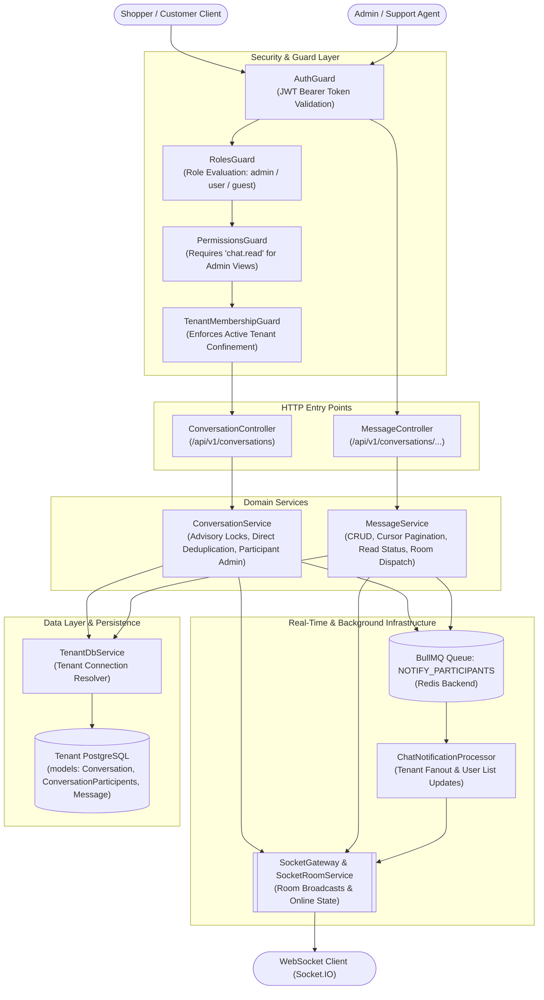
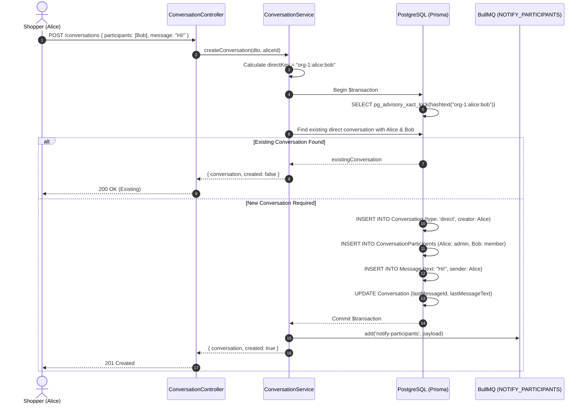
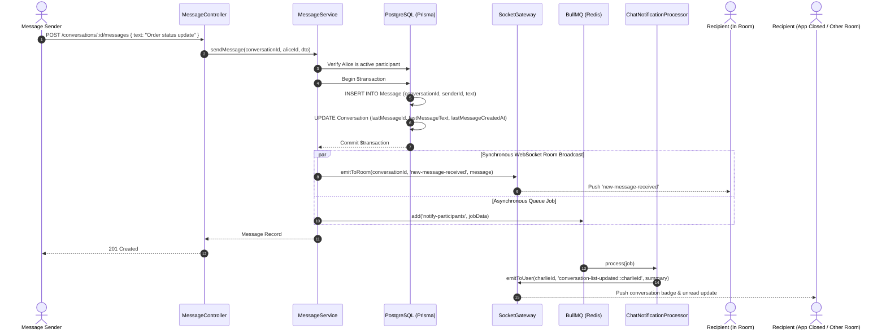
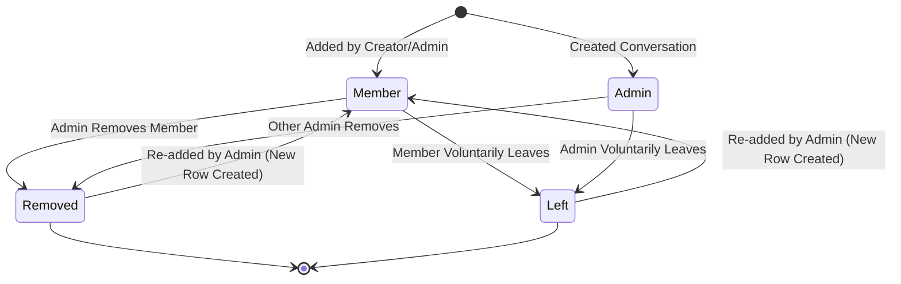

# Chatting Feature

## Purpose
Provides real-time peer-to-peer and group messaging between shoppers, support staff, and administrative agents, coordinating PostgreSQL persistence, advisory-locked conversation deduplication, WebSocket room broadcasts, and asynchronous BullMQ participant fanout.

---

## Component Architecture



### Component Source Map

| Component | Layer / Role | Relative Source Path |
| :--- | :--- | :--- |
| `ConversationController` | HTTP Controller (Conversations & Participants) | [`./conversation/conversation.controller.ts`](./conversation/conversation.controller.ts) |
| `MessageController` | HTTP Controller (Messages, Edits & Cursors) | [`./message/message.controller.ts`](./message/message.controller.ts) |
| `ConversationService` | Domain Orchestration (Conversations & Advisory Locks) | [`./conversation/conversation.service.ts`](./conversation/conversation.service.ts) |
| `MessageService` | Domain Orchestration (Messaging & Read Tracking) | [`./message/message.service.ts`](./message/message.service.ts) |
| `ChatNotificationProcessor` | BullMQ Worker (Tenant Participant Fanout) | [`./processors/chat-notification.processor.ts`](./processors/chat-notification.processor.ts) |
| `Conversation DTOs` | Request Payloads & Validation Constraints | [`./conversation/dto/create-conversation.dto.ts`](./conversation/dto/create-conversation.dto.ts) |
| `Message DTOs` | Message Request & Cursor Query DTOs | [`./message/dto/message.dto.ts`](./message/dto/message.dto.ts) |
| `SocketGateway` | Real-time WebSocket Protocol Layer | [`../socket-gateway/gateway/socket.gateway.ts`](../socket-gateway/gateway/socket.gateway.ts) |
| `SocketRoomService` | Socket Room & Subscription Management | [`../socket-gateway/services/socket-room.service.ts`](../socket-gateway/services/socket-room.service.ts) |
| `Conversation Schema` | Conversation Root Table | [`../../../prisma/schema/chatting.module/conversation.prisma`](../../../prisma/schema/chatting.module/conversation.prisma) |
| `ConversationParticipents Schema` | Membership & Last-Read Tracking | [`../../../prisma/schema/chatting.module/conversationParticipents.prisma`](../../../prisma/schema/chatting.module/conversationParticipents.prisma) |
| `Message Schema` | Message Content & Soft Deletes | [`../../../prisma/schema/chatting.module/message.prisma`](../../../prisma/schema/chatting.module/message.prisma) |
| `MessageReadStatus Schema` | Read Receipts Sub-Table (Legacy/Unused) | [`../../../prisma/schema/chatting.module/messageReadStatus.prisma`](../../../prisma/schema/chatting.module/messageReadStatus.prisma) |

---

## Responsibilities

- **Direct & Group Conversations**: Creates direct 1-to-1 conversations and multi-user group conversations with custom names and profile icons.
- **PostgreSQL Advisory Lock Deduplication**: Uses `pg_advisory_xact_lock(hashtext(directKey))` during direct conversation creation to eliminate race conditions and duplicate conversation records across concurrent API instances.
- **Participant Access & Role Enforcement**: Enforces conversation-level permissions where only participants with role `admin` can add members or remove other members, while any participant can voluntarily exit.
- **Message Dispatch & Snapshot Updating**: Saves messages in database transactions while atomically updating the conversation's `lastMessageId`, `lastMessageText`, and `lastMessageCreatedAt` denormalized cache fields.
- **Cursor & Offset Pagination**: Supports both traditional offset-based pagination (`page`, `limit`) and cursor-based pagination (`before`, `after`) for infinite scroll chat feeds.
- **Real-Time WebSocket Emission**: Pushes `new-message-received`, `message-updated`, `message-deleted`, and `participant-removed` socket events immediately to active conversation rooms.
- **Asynchronous Background Fanout**: Dispatches background jobs to BullMQ (`notify-participants`) so worker processes can broadcast `conversation-list-updated` events to offline or out-of-room participants without blocking the HTTP request thread.
- **Unread Tracking**: Updates `lastMessageReadAt`, `lastMessageReadId`, and clears unread flags when messages are fetched or explicitly acknowledged.

---

## Does Not Own

- **WebSocket Transport & Connection State**: Does not manage Socket.IO server instances, client authentication handshakes, or raw socket connection pools (owned by `SocketGateway` in `src/features/socket-gateway`).
- **File & Media Storage**: Does not upload image attachments or generate S3 presigned URLs (owned by `AttachmentsModule` in `src/features/attachments`).
- **External SMS / Push Notifications**: Does not deliver external mobile push notifications or SMS alerts for missed chat messages (owned by `TransactionalMessagingModule`).
- **Customer CRM / Order Context**: Does not manage order history, refunds, or customer support ticket lifecycles (owned by `OrderModule` and `CustomerAccountModule`).

---

## Dependencies

- **Platform & Database**:
  - `PrismaService` (`@app/database`): PostgreSQL persistence.
  - `TenantDbService` (`@app/tenancy`): Resolves tenant-specific database connections.
  - `TenantFanoutService`: Executes tenant-scoped emissions in background BullMQ workers.
- **Queues & Caching**:
  - `BullModule` / BullMQ (`@app/queue`): Manages the `NOTIFY_PARTICIPANTS` queue.
  - `RedisModule` (`@app/redis`): Backing broker for BullMQ and socket adapters.
- **Real-Time Communication**:
  - `SocketGateway`: Emits room and user-targeted WebSocket events.
- **Security & Validation**:
  - `AuthGuard`, `RolesGuard`, `PermissionsGuard`, `TenantMembershipGuard` (`@app/common`).
  - `class-validator`, `class-transformer`: Input validation and query parameter coercion.

---

## Database Ownership

### Writes / Mutates
- **`Conversation`**:
  - Creates new conversations with `type` (`direct` | `group`), `creatorId`, `groupName`, and `groupProfilePicture`.
  - Atomically updates `lastMessageId`, `lastMessageText`, and `lastMessageCreatedAt` on message dispatch.
- **`ConversationParticipents`**:
  - Creates participant membership records with assigned roles (`admin` for creator, `member` for invitees).
  - Soft-deletes participant memberships (`isDeleted = true`) when users leave or are removed.
  - Updates `lastMessageReadAt`, `lastMessageReadId`, and sets `isThisConversationUnseen = 0` / `unreadCount = 0` on read.
- **`Message`**:
  - Creates message records with `text`, `senderId`, and `conversationId`.
  - Soft-deletes messages (`isDeleted = true`) on message deletion.
  - Updates `text` and timestamps on message editing.

### Reads / References
- **`User`**: Queries participant profile metadata (`name`, `profileImageUrl`, `role`) for sender headers and member lists.
- **`Attachment`**: Relational attachment links associated with messages.
- **`MessageReadStatus`**: Defined in Prisma schema, but currently unwritten by the active runtime services.

---

## Important Invariants

1. **Direct Conversation Deduplication**: A 1-to-1 conversation between User A and User B within the same organization must be strictly unique. Concurrent requests must not create duplicate conversations.
2. **Organization-Namespaced Advisory Locks**: Direct conversation advisory lock keys MUST be prefixed by the organization ID (`${organizationId}:${sortedParticipantIds}`) to prevent lock collisions across distinct tenants sharing a database cluster.
3. **Admin-Only Participant Additions**: Only participants holding the `admin` role in a conversation can add new members. Non-admin addition attempts must be rejected with `403 ForbiddenException`.
4. **Self-Removal vs. Member Removal**: Any participant can remove themselves from a conversation (leave). However, removing another user requires conversation `admin` privileges.
5. **Sender Edit/Delete Ownership**: A user can only update or delete messages where `message.senderId === authenticatedUserId`. Modifying another user's message is rejected with `404 Not Found` / permission denial.
6. **Soft Deletions**: Conversations, participant memberships, and messages are never hard-deleted from PostgreSQL; they are flagged with `isDeleted: true` to preserve chat history integrity.
7. **Participant Read Access Barrier**: A user cannot read messages in a conversation unless they are an active, non-deleted participant in `ConversationParticipents` (or an administrator possessing the `admin` role).

---

## Public API & Entry Points

### Conversation Endpoints (`/api/v1/conversations`)
| Method | Path | Description | Access / Guards |
| :--- | :--- | :--- | :--- |
| `POST` | `/api/v1/conversations` | Create new direct or group conversation | Authenticated Users |
| `GET` | `/api/v1/conversations/my` | Paginated list of user's active conversations | Authenticated Users |
| `GET` | `/api/v1/conversations/all` | Admin overview of all tenant conversations | `admin` role + `chat.read` |
| `GET` | `/api/v1/conversations/participants` | Get members of a specific conversation | Participants Only |
| `POST` | `/api/v1/conversations/participants/add` | Add participants to conversation | Conversation Admin |
| `POST` | `/api/v1/conversations/participants/remove`| Remove participant or leave conversation | Conversation Admin / Self |
| `POST` | `/api/v1/conversations/:id/read` | Mark all messages in conversation as read | Participants Only |

### Message Endpoints (`/api/v1/conversations/...`)
| Method | Path | Description | Access / Guards |
| :--- | :--- | :--- | :--- |
| `GET` | `/api/v1/conversations/:conversationId/messages` | Paginated messages (offset-based) | Conversation Participants |
| `GET` | `/api/v1/conversations/:conversationId/messages/cursor` | Cursor-based message history (`before`/`after`)| Conversation Participants |
| `POST` | `/api/v1/conversations/:conversationId/messages` | Send new message to conversation | Conversation Participants |
| `PUT` | `/api/v1/conversations/messages/:messageId` | Edit message content | Message Sender Only |
| `DELETE`| `/api/v1/conversations/messages/:messageId` | Soft delete message | Message Sender Only |
| `GET` | `/api/v1/conversations/messages/:messageId/unread-count`| Query unread message count | Conversation Participants |

### Background Tasks & Queues
- **Queue**: `NOTIFY_PARTICIPANTS` (`notify-participants`)
- **Processor**: `ChatNotificationProcessor`
- **Payload**: `{ conversationId, messageId, messageText, senderId, senderProfile, participantIds, organizationId }`
- **Action**: Emits `conversation-list-updated::<participantId>` events to all recipients via `SocketGateway`.

---

## Important Flows

### 1. Direct Conversation Creation with Advisory Locking



### 2. Real-Time Message Dispatch & Async Fanout



### 3. Participant Membership Lifecycle



---

## Brutal Honest Vulnerabilities & Architectural Debt

### 1. Dropped Message Attachments (Silent Data Loss)
- **Vulnerability**: In `MessageController.sendMessage()`, `SendMessageDto` defines `attachments?: string[]` (array of attachment IDs). However, `MessageService.sendMessage()` ignores `dto.attachments` entirely during insertion:
  ```typescript
  const created = await tx.message.create({
    data: { text, senderId, conversationId }, // <--- attachments omitted
    include: { sender: { select: { ... } }, attachments: true },
  });
  ```
- **Impact**: Clients uploading file attachments believe their attachments are linked to the message. The server silently drops the attachment IDs and creates a text-only message with empty `attachments: []`.
- **Remediation**: Connect existing attachment records during creation via Prisma's `attachments: { connect: dto.attachments.map(id => ({ id })) }`.

### 2. Misrouted Controller Prefix for Message Endpoints (404 Trap)
- **Vulnerability**: `MessageController` is annotated with `@Controller('conversations')`, and its update/delete methods are annotated with `@Put('messages/:messageId')` and `@Delete('messages/:messageId')`.
- **Impact**: The actual mounted HTTP routes are `/api/v1/conversations/messages/:messageId`, rather than `/api/v1/messages/:messageId`. Client integrations calling REST standard `/messages/:messageId` fail with `404 Not Found`. Furthermore, the unread count endpoint `@Get('messages/:messageId/unread-count')` demands an arbitrary dummy `:messageId` route parameter that is completely unused by the service.
- **Remediation**: Split message operations into a distinct `@Controller('messages')` or normalize REST paths to `/api/v1/conversations/:conversationId/messages/:messageId`.

### 3. N+1 Unread Query Storm in Conversation List
- **Vulnerability**: In `ConversationService.getConversationsByUserId()`, after fetching conversations, the service iterates over every conversation in a `Promise.all` mapping:
  ```typescript
  const results = await Promise.all(
    participants.map(async (p) => {
      const unreadCount = await db.message.count({
        where: {
          conversationId: p.conversationId,
          senderId: { not: userId },
          createdAt: { gt: p.lastMessageReadAt || new Date(0) },
          isDeleted: false,
        },
      });
      ...
  ```
- **Impact**: Fetching 50 conversations triggers 51 individual database round-trips (1 query for conversations + 50 independent `COUNT(*)` queries). High-concurrency chat listing will cause connection pool starvation.
- **Remediation**: Group unread counts into a single aggregated SQL query (`SELECT conversationId, COUNT(*) FROM "Message" ... GROUP BY conversationId`) or maintain an incremental `unreadCount` column on `ConversationParticipents`.

### 4. Direct-to-Group Type Inconsistency
- **Vulnerability**: When participants are added via `addParticipantsToConversation()`, the service appends rows to `ConversationParticipents` but never updates `Conversation.type`:
  ```typescript
  // Conversation.type remains 'direct' even when participants.length > 2
  ```
- **Impact**: Direct conversations can organically grow to 10+ participants while retaining `type: 'direct'`. This confuses UI rendering logic, breaks group name display, and corrupts subsequent direct conversation deduplication queries.
- **Remediation**: When participant count exceeds 2, atomically update `Conversation.type = 'group'` and require a `groupName`.

### 5. In-Memory Slicing & Boundary Skew on Offset Pagination
- **Vulnerability**: `MessageService.getMessagesByConversation()` fetches descending messages, applies `messages.reverse()` in-place, and returns them to the caller.
- **Impact**: During active conversations, incoming messages skew offset boundaries (`skip = (page - 1) * limit`). When a user scrolls up to load page 2, recently arrived messages shift existing messages into page 2, resulting in duplicate or skipped messages in the UI feed.
- **Remediation**: Deprecate offset pagination in favor of strict cursor pagination (`before` / `after` message IDs).

### 6. Duplicate Participant Rows on Re-Add
- **Vulnerability**: Removing a participant sets `isDeleted: true` on `ConversationParticipents`. When re-adding that user, `addParticipantsToConversation` queries `findFirst({ where: { userId, conversationId, isDeleted: false } })`. Finding none, it executes `create()` instead of restoring the existing record.
- **Impact**: Multiple historical membership rows accumulate for the same `(userId, conversationId)` tuple, skewing participant counts, unread calculations, and room notification dispatches.
- **Remediation**: Add a unique compound index `@@unique([conversationId, userId])` and update `isDeleted: false` on re-addition.

### 7. Dead Schema Model: MessageReadStatus
- **Vulnerability**: Prisma schema defines `MessageReadStatus` (`model MessageReadStatus`), with foreign keys to `Conversation`, `Message`, and `User`. However, neither `MessageService` nor `ConversationService` reads or writes to this table.
- **Impact**: Generates dead database schema weight, unused indexes, and developer confusion regarding how read receipts are tracked (the codebase uses `ConversationParticipents.lastMessageReadAt`).
- **Remediation**: Either implement granular per-message read receipts via `MessageReadStatus` or formally drop the unused table from the Prisma schema.
