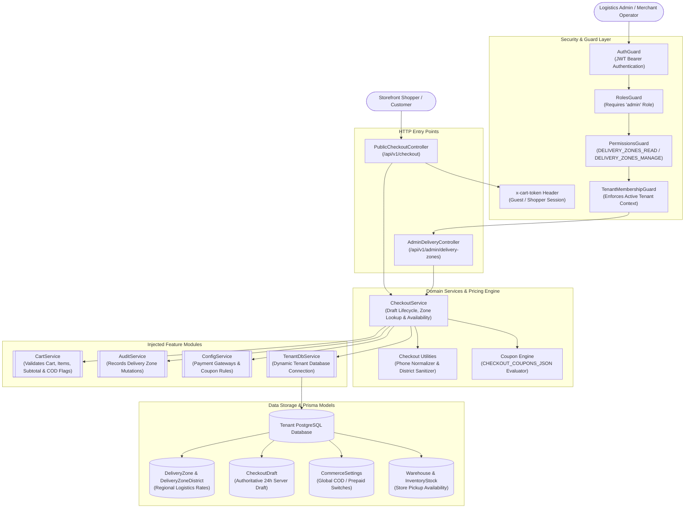
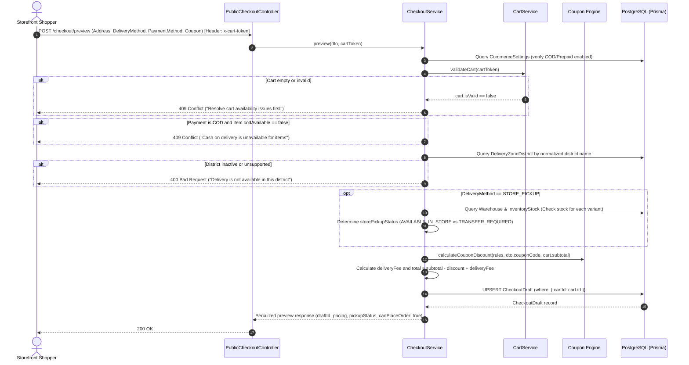
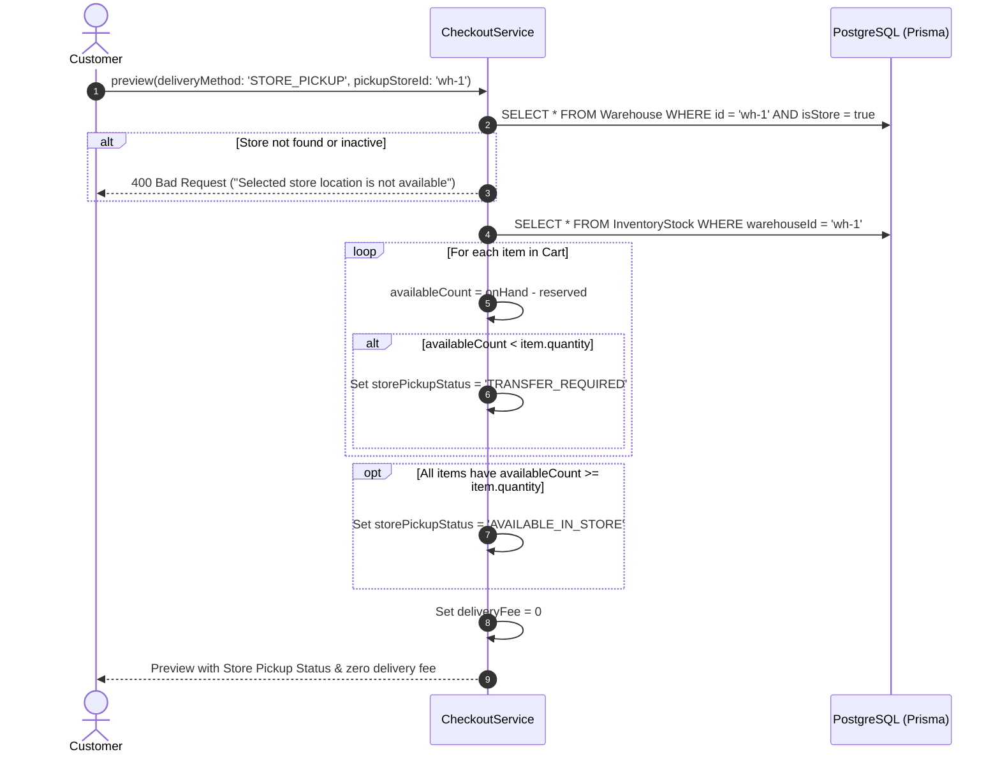
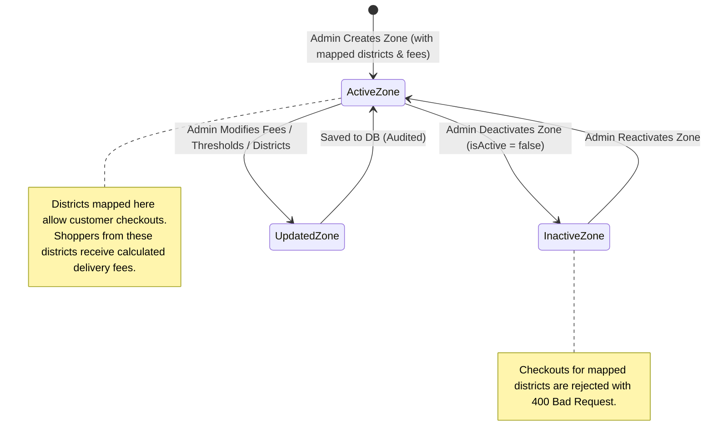

# Checkout Feature

## Purpose
Enforces server-authoritative checkout validation, Bangladesh regional delivery logistics and zone fees, promotional coupon discounts, store pickup availability, payment method eligibility (COD, Prepaid via SSLCommerz/aamarPay, Wallet, Pay-at-Store), and generates persistent 24-hour `CheckoutDraft` records bound to active shopping carts.

---

## Component Architecture



### Component Source Map

| Component | Layer / Role | Relative Source Path |
| :--- | :--- | :--- |
| `PublicCheckoutController` | HTTP Controller (Public Checkout API) | [`./checkout.controller.ts`](./checkout.controller.ts) |
| `AdminDeliveryController` | HTTP Controller (Delivery Zone Admin) | [`./checkout.controller.ts`](./checkout.controller.ts) |
| `CheckoutService` | Pricing Engine & Draft Orchestration | [`./checkout.service.ts`](./checkout.service.ts) |
| `CheckoutPreviewDto` | Checkout Request DTO & Validations | [`./dto/checkout.dto.ts`](./dto/checkout.dto.ts) |
| `CreateDeliveryZoneDto` / `UpdateDeliveryZoneDto` | Delivery Zone Management DTOs | [`./dto/checkout.dto.ts`](./dto/checkout.dto.ts) |
| `calculateDeliveryFee` / `normalizeBangladeshPhone` | Pricing & Phone Formatting Utilities | [`./utils/checkout.util.ts`](./utils/checkout.util.ts) |
| `calculateCouponDiscount` | Coupon Validation & Discount Math | [`./utils/coupon.util.ts`](./utils/coupon.util.ts) |
| `CartService` | Cart Validation & Subtotal Provider | [`../cart/cart.service.ts`](../cart/cart.service.ts) |
| `AuditService` | Transactional Audit Logger | [`../audit/services/audit.service.ts`](../audit/services/audit.service.ts) |
| `Checkout Prisma Schema` | Delivery Zones & Draft Models | [`../../../prisma/schema/checkout.module/checkout.prisma`](../../../prisma/schema/checkout.module/checkout.prisma) |

---

## Responsibilities

- **Authoritative Server-Side Pricing**: Calculates all checkout financials (`subtotal`, `discountTotal`, `deliveryFee`, `paymentCharge`, `total`) server-side in minor currency units (integer poisha). Client-submitted prices or totals are strictly disregarded.
- **Regional Delivery Zone Management**: Manages delivery zones and mapped Bangladesh districts, enforcing delivery fees and free-shipping thresholds (`freeDeliveryThreshold`).
- **Promotional Coupon Evaluation**: Parses and validates coupon codes (`FIXED` amount or `PERCENT` with optional `minimumSubtotal`, `maximumDiscount`, and date validity windows).
- **Store Pickup Logistics (`STORE_PICKUP`)**: Validates physical store locations, checks physical store inventory stock across all cart variants, and tags status as `AVAILABLE_IN_STORE` or `TRANSFER_REQUIRED`.
- **Payment Method Eligibility**: Validates global merchant enablement flags (`CommerceSettings.codEnabled`, `CommerceSettings.prepaidEnabled`), evaluates credential configurations for online payment providers (SSLCommerz, aamarPay), and enforces item-level COD restrictions.
- **E.164 Bangladesh Mobile Normalization**: Normalizes local contact numbers (`017XXXXXXXX`, `+88017...`) into standard E.164 format (`+8801XXXXXXXXX`) and validates operator prefix validity (`013`–`019`).
- **24-Hour Checkout Draft Upsert**: Persists authoritative `CheckoutDraft` records keyed uniquely to active carts (`cartId`), preventing cart tampering prior to order submission.

---

## Does Not Own

- **Shopping Cart State**: Does not manage line items, variant replacements, or cart token assignment (owned by `CartModule` in `src/features/cart`).
- **Order Placement & Stock Locking**: Does not transition drafts into official orders, decrement inventory, or create order records (owned by `OrderModule` in `src/features/order`).
- **Payment Gateway Redirection & Webhooks**: Does not initiate bank sessions, render payment iframes, or process IPN callback transactions (owned by `CommercePaymentsModule` in `src/features/commerce-payments`).
- **Customer Address Book**: Does not store reusable saved address profiles for authenticated users (owned by `CustomerAccountModule`).

---

## Dependencies

- **Platform & Tenancy**:
  - `PrismaService` (`@app/database`): PostgreSQL persistence.
  - `TenantDbService` (`@app/tenancy`): Resolves the active tenant database client.
  - `ConfigService` (`@nestjs/config`): Reads gateway credentials and `CHECKOUT_COUPONS_JSON`.
  - `AuditService` (`AuditModule`): Records audit logs for delivery zone creation and updates.
- **Internal Modules**:
  - `CartService` (`CartModule`): Invokes `validateCart(cartToken)` to ensure cart validity, variant publication, and non-empty lines.
- **Security & Guards**:
  - `AuthGuard`, `RolesGuard`, `PermissionsGuard`, `TenantMembershipGuard` (`@app/common`).
- **External Libraries**:
  - `class-validator`, `class-transformer`: Input validation on addresses, delivery methods, and district names.

---

## Database Ownership

### Writes / Mutates
- **`CheckoutDraft`**: Upserts checkout draft rows (`@@unique([cartId])`), populating normalized customer contact details, delivery address, pricing breakdown, and a 24-hour expiration timestamp.
- **`DeliveryZone`**: Creates and updates delivery zones, setting fees, thresholds, and active status.
- **`DeliveryZoneDistrict`**: Replaces or inserts district mappings (`normalizedName` unique constraint).
- **`CommerceSettings`**: Upserts the default store settings row (`id: 'default'`) if absent during payment option queries.
- **`AuditLog`**: Logs `DELIVERY_ZONE_CREATED` and `DELIVERY_ZONE_UPDATED` events within database transactions.

### Reads / References
- **`Cart` & `CartItem`**: Validated via `CartService` to read authoritative variant pricing and live availability.
- **`Warehouse` & `InventoryStock`**: Queried during `STORE_PICKUP` evaluation to verify store existence (`isStore: true`) and local stock counts.

---

## Important Invariants

1. **Zero Client Price Trust**: No monetary values submitted in `CheckoutPreviewDto` are accepted. Every amount (`subtotal`, `discountTotal`, `deliveryFee`, `total`) is calculated deterministically on the server.
2. **Minor Currency Units (Poisha)**: All monetary fields are integer amounts in minor units (BDT Poisha: `8000` = ৳80.00). Floating-point currencies are strictly prohibited.
3. **Cart Validity Enforcement**: A checkout preview CANNOT be generated if the cart is empty or invalid (`cart.isValid === false`). Stale or unavailable items must be resolved first.
4. **Item-Level COD Block**: If any item in the cart has `codAvailable === false`, selecting `paymentMethod: 'COD'` is rejected with a `409 ConflictException`.
5. **Global Payment Switch Compliance**: Payment methods must obey `CommerceSettings` (`codEnabled`, `prepaidEnabled`). Selecting a disabled payment method triggers a `409 ConflictException`.
6. **Prepaid Provider Configuration Barrier**: Selecting `paymentMethod: 'PREPAID'` requires a configured provider (`SSLCOMMERZ` or `AAMARPAY`) with valid API credentials.
7. **Strict District Normalization & Unique Zone Assignment**: Districts are normalized via NFKC Unicode normalization, stripped of whitespace, and lowercased (`normalizeDistrict`). A district can belong to at most ONE delivery zone (`DeliveryZoneDistrict.normalizedName` is unique).
8. **Free Delivery Subtotal Threshold**: When `freeDeliveryThreshold !== null` and `cart.subtotal >= freeDeliveryThreshold`, delivery fee is calculated as 0; otherwise, the zone's standard `deliveryFee` is charged.
9. **Store Pickup Exemption**: When `deliveryMethod === 'STORE_PICKUP'`, the delivery fee is always 0.
10. **24-Hour Draft Validity Window**: Every generated draft is stamped with `expiresAt = now() + 24 hours`. Order placement fails if a draft has expired.
11. **One Draft Per Cart**: Because `CheckoutDraft.cartId` is unique, generating a new preview replaces any previous draft for that cart, preventing stale totals.

---

## Public API & Entry Points

### Storefront Checkout Endpoints (`/api/v1/checkout`)
| Method | Path | Description | Access / Guards |
| :--- | :--- | :--- | :--- |
| `GET` | `/api/v1/checkout/delivery-options` | List all active delivery zones and districts | Public |
| `GET` | `/api/v1/checkout/payment-options` | List active payment methods & provider status | Public |
| `POST` | `/api/v1/checkout/preview` | Calculate prices, validate logistics & save draft | Public (`x-cart-token`) |

### Admin Delivery Zone Endpoints (`/api/v1/admin/delivery-zones`)
| Method | Path | Description | Required Permissions |
| :--- | :--- | :--- | :--- |
| `GET` | `/api/v1/admin/delivery-zones` | List all delivery zones with districts | `DELIVERY_ZONES_READ` |
| `POST` | `/api/v1/admin/delivery-zones` | Create delivery zone and map districts | `DELIVERY_ZONES_MANAGE` |
| `PATCH` | `/api/v1/admin/delivery-zones/:id` | Update zone fees, thresholds, or districts | `DELIVERY_ZONES_MANAGE` |

---

## Important Flows

### 1. Checkout Preview & Server Pricing Execution



### 2. Store Pickup Availability Evaluation



### 3. Delivery Zone Lifecycle & District Assignment



---

## Brutal Honest Vulnerabilities & Architectural Debt

### 1. Static Coupons in Environment Variables (`CHECKOUT_COUPONS_JSON`)
- **Vulnerability**: Coupons are loaded from the environment variable `CHECKOUT_COUPONS_JSON` rather than a PostgreSQL table.
- **Impact**: 
  - Creating, editing, or revoking a coupon requires an environment variable update and application restart.
  - Per-user redemption counts cannot be enforced (a single user can abuse a one-time coupon indefinitely).
  - No database transaction tracks coupon redemption velocity or ties discounts to marketing campaigns.
- **Remediation**: Migrate coupon management to a dedicated `Coupon` database table with user usage logs and relational category/product exclusions.

### 2. Free Shipping Leakage on Post-Discount Subtotal
- **Vulnerability**: In `calculateDeliveryFee(subtotal, deliveryFee, freeDeliveryThreshold)`:
  ```typescript
  return freeDeliveryThreshold !== null && subtotal >= freeDeliveryThreshold
    ? 0
    : deliveryFee;
  ```
  The evaluation uses `cart.subtotal` (gross value before coupon discounts) rather than net payment value (`subtotal - discountTotal`).
- **Impact**: A customer with a ৳5,000 cart eligible for free delivery at ৳5,000 can apply a ৳4,000 coupon, pay only ৳1,000, and still receive free shipping. The merchant loses delivery revenue on heavily discounted low-margin orders.
- **Remediation**: Calculate free shipping eligibility against net subtotal (`cart.subtotal - discountTotal`).

### 3. Hardcoded Platform Credentials for Multi-Tenant Gateways
- **Vulnerability**: `prepaidProviderConfigured` checks process-wide environment variables:
  ```typescript
  this.config.get('SSLCOMMERZ_STORE_ID')
  this.config.get('AAMARPAY_STORE_ID')
  ```
- **Impact**: In a multi-tenant SaaS deployment, all tenant stores are forced to share the platform operator's master merchant accounts. Individual tenants cannot connect their own merchant IDs without code modifications.
- **Remediation**: Store encrypted payment credentials in tenant-scoped configuration or query merchant configurations from a tenancy vault.

### 4. Zero Store Inventory Locking During Store Pickup
- **Vulnerability**: When checking store pickup feasibility, `preview()` inspects `InventoryStock` without placing an inventory reservation hold.
- **Impact**: Between the customer seeing `AVAILABLE_IN_STORE` on the checkout screen and actually placing the order seconds/minutes later, another shopper or in-store walk-in customer can purchase the unit. The order will be created under the assumption of immediate availability when a warehouse stock transfer is actually required.
- **Remediation**: Re-verify and atomically reserve store stock during order creation in `OrderService`, falling back to `TRANSFER_REQUIRED` if stock was depleted during draft preview.

### 5. Hardcoded Payment Charge (`paymentCharge = 0`)
- **Vulnerability**: Line 356 hardcodes:
  ```typescript
  const paymentCharge = 0;
  ```
- **Impact**: The checkout engine has no capability to pass payment gateway processing surcharges (e.g. 2.5% credit card fees) or COD handling fees to the shopper, limiting monetization and margin protection.
- **Remediation**: Derive `paymentCharge` dynamically based on selected `paymentMethod` and `paymentProvider` settings in `CommerceSettings`.

### 6. Destructive Cascade on Delivery Zone District Updates
- **Vulnerability**: In `updateDeliveryZone()`:
  ```typescript
  if (dto.districts) {
    await transaction.deliveryZoneDistrict.deleteMany({
      where: { zoneId: id },
    });
  }
  ```
- **Impact**: Updating districts deletes all existing `DeliveryZoneDistrict` rows and creates fresh IDs. Any external caching, analytics, or foreign relations referencing district IDs are invalidated.
- **Remediation**: Implement delta synchronization (preserve existing district rows by name, remove omitted districts, and add new ones).

### 7. Uncollected Expired Checkout Drafts
- **Vulnerability**: `CheckoutDraft` defines `expiresAt` (24 hours from creation), but there is no automated database cleanup job or scheduled cron worker to purge expired drafts.
- **Impact**: Orphaned drafts from abandoned checkouts accumulate indefinitely in the database, bloating table size and index trees over time.
- **Remediation**: Introduce a nightly BullMQ maintenance job or PostgreSQL pg_cron cleanup executing `DELETE FROM "CheckoutDraft" WHERE "expiresAt" < NOW() AND "order" IS NULL`.
