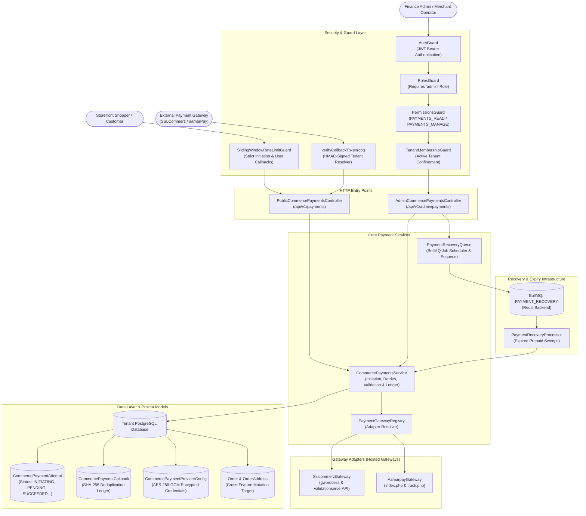
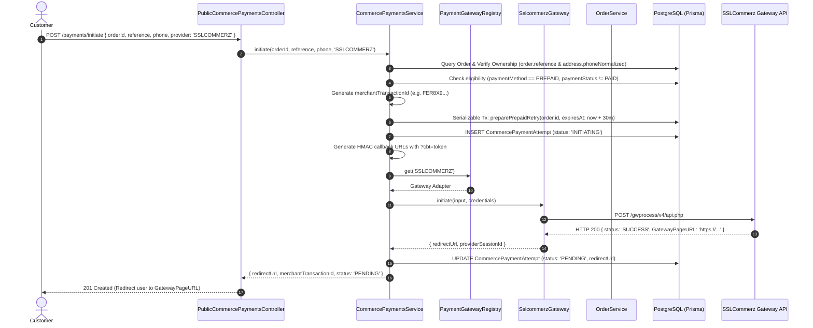
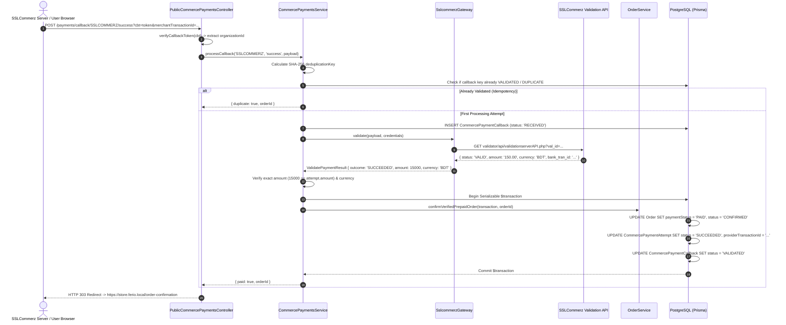
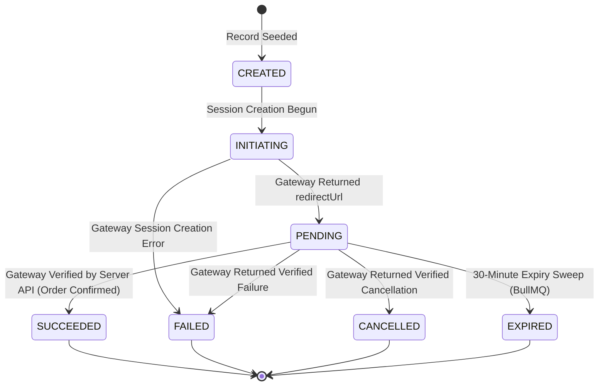

# Commerce Payments Feature

## Purpose
Manages the online prepaid payment lifecycle across hosted Bangladeshi payment gateways (SSLCommerz and aamarPay), coordinating cryptographic callback validation, tenant-isolated encrypted merchant credentials, rate-limited initiation, order state confirmation, and BullMQ-driven automated expiry recovery sweeps.

---

## Component Architecture



### Component Source Map

| Component | Layer / Role | Relative Source Path |
| :--- | :--- | :--- |
| `PublicCommercePaymentsController` | Public HTTP Controller (Initiate, Retry, Callbacks) | [`./controllers/commerce-payments.controller.ts`](./controllers/commerce-payments.controller.ts) |
| `AdminCommercePaymentsController` | Admin HTTP Controller (Ledger, Credential Vault, Sweeps) | [`./controllers/commerce-payments.controller.ts`](./controllers/commerce-payments.controller.ts) |
| `CommercePaymentsService` | Core Payment Domain Orchestration | [`./services/commerce-payments.service.ts`](./services/commerce-payments.service.ts) |
| `PaymentGatewayRegistry` | Gateway Adapter Registry & Discovery | [`./gateways/payment-gateway.registry.ts`](./gateways/payment-gateway.registry.ts) |
| `SslcommerzGateway` | SSLCommerz API Adapter | [`./gateways/sslcommerz.gateway.ts`](./gateways/sslcommerz.gateway.ts) |
| `AamarpayGateway` | aamarPay API Adapter | [`./gateways/aamarpay.gateway.ts`](./gateways/aamarpay.gateway.ts) |
| `PaymentRecoveryQueue` | BullMQ Scheduler & Job Producer | [`./queues/payment-recovery.queue.ts`](./queues/payment-recovery.queue.ts) |
| `PaymentRecoveryProcessor` | BullMQ Expiry Worker | [`./processors/payment-recovery.processor.ts`](./processors/payment-recovery.processor.ts) |
| `payment-credentials.util` | AES-256-GCM Encryption / Decryption | [`./utils/payment-credentials.util.ts`](./utils/payment-credentials.util.ts) |
| `Payment Transaction Schema` | Payment Attempt & Callback Models | [`../../../prisma/schema/payment.module/paymentTransaction.prisma`](../../../prisma/schema/payment.module/paymentTransaction.prisma) |

---

## Responsibilities

- **Hosted Payment Initiation**: Generates unique merchant transaction IDs (`FER<base36><hex>`), prepares order expiry windows, and negotiates hosted payment sessions with external gateways (SSLCommerz and aamarPay).
- **Ownership Verification on Initiation**: Protects guest and authenticated orders against session hijacking by strictly validating `orderReference` and `phoneNormalized` before initiating or retrying payment.
- **Server-to-Server Payment Verification**: Validates transaction outcomes by making authoritative backend HTTP requests to provider verification APIs (`validator/api/validationserverAPI.php` for SSLCommerz, `track.php` for aamarPay). Browser query parameters are never trusted.
- **Callback Idempotency & Deduplication**: Computes SHA-256 hash digests (`provider:eventType:payload`) to deduplicate incoming IPNs and browser redirect callbacks, preventing duplicate order confirmations.
- **Multi-Tenant Encrypted Credential Vault**: Secures provider merchant IDs and API keys using AES-256-GCM encrypted ciphers in `CommercePaymentProviderConfig`, ensuring credential rotation auditing and zero plaintext leakage.
- **HMAC Callback Tenant Binding**: Embeds signed `cbt` tokens into gateway callback URLs, ensuring that background IPNs are routed strictly to the correct tenant database.
- **Prepaid Order Expiry & Stock Recovery**: Schedules background sweeps via BullMQ to identify abandoned payment attempts exceeding the 30-minute validity window, releasing reserved stock and updating order statuses to `EXPIRED`.

---

## Does Not Own

- **Order Creation & Initial Stock Reservations**: Does not create order drafts or place initial inventory holds (owned by `OrderModule` in `src/features/order`).
- **Checkout Pricing & Fee Derivation**: Does not calculate shipping fees, delivery zones, or coupon discounts (owned by `CheckoutModule` in `src/features/checkout`).
- **Refund Initiation & Disbursement Accounting**: Does not calculate merchant refund balances or execute bank reversals (owned by `RefundsModule` and `ReconciliationModule`).
- **Customer Notification Dispatch**: Does not deliver SMS confirmations or order receipts (owned by `TransactionalMessagingModule` / `CustomerNotificationsModule`).

---

## Dependencies

- **Platform & Security**:
  - `PrismaService` (`@app/database`): PostgreSQL persistence.
  - `TenantDbService` & `TenantCallbackRunner` (`@app/tenancy`): Resolves tenant-specific database connections and verifies HMAC callback tokens.
  - `ConfigService` (`@nestjs/config`): Reads platform encryption keys (`PLATFORM_DB_CREDENTIAL_KEY`, `PLATFORM_CALLBACK_SECRET`).
  - `AuditService` (`AuditModule`): Records audit logs for credential rotations and payment state transitions.
  - `PlanGateService`: Verifies subscription entitlements (`online_payments`) before allowing provider enablement.
- **Queues & Caching**:
  - `BullModule` / BullMQ (`@app/queue`): Hosts `PAYMENT_RECOVERY` queue.
- **Internal Modules**:
  - `OrderService` (`OrderModule`): Calls `confirmVerifiedPrepaidOrder`, `preparePrepaidRetry`, and `expirePrepaidOrder`.
- **External Gateways**:
  - SSLCommerz Hosted Payment & Validation APIs.
  - aamarPay Payment & Tracking APIs.

---

## Database Ownership

### Writes / Mutates
- **`CommercePaymentAttempt`**:
  - Creates attempts with `INITIATING` status, 30-minute `expiresAt`, amount, and currency.
  - Updates attempts to `PENDING` with `redirectUrl` and `providerSessionId`.
  - Atomically transitions status to `SUCCEEDED`, `FAILED`, `CANCELLED`, or `EXPIRED` with provider transaction IDs and raw validation payloads.
- **`CommercePaymentCallback`**:
  - Inserts received callback logs with unique SHA-256 `deduplicationKey`.
  - Updates callback status to `VALIDATED`, `REJECTED`, or `DUPLICATE`.
- **`CommercePaymentProviderConfig`**:
  - Upserts provider configurations storing `credentialCipher`, `enabled` status, and `credentialsRotatedAt`.
  - Deletes configurations upon revocation.
- **`Order`** (Cross-Domain Mutation via `OrderService`):
  - Transitions `paymentStatus` to `PAID` and `status` to `CONFIRMED` upon successful verification.
  - Updates `paymentStatus` to `FAILED` or cancels unpaid orders upon attempt expiration.
- **`AuditLog`**:
  - Synchronously records `PAYMENT_PROVIDER_STATE_APPLIED`, `PAYMENT_PROVIDER_CONFIG_UPDATED`, and `PAYMENT_ATTEMPT_EXPIRED`.

### Reads / References
- **`Order` & `OrderAddress`**: Verifies recipient phone numbers, order references, total amounts, and currencies.
- **`CheckoutDraft`**: Validates that the payment provider matches the draft configuration.

---

## Important Invariants

1. **Authoritative Server Validation**: No payment attempt is marked `SUCCEEDED` based solely on client/browser redirects. Authoritative server-to-server gateway validation is mandatory.
2. **Exact Currency and Amount Matching**: Validated amounts must match the attempt amount *exactly* in minor currency units (poisha). In addition, currencies must match (`BDT`) and the gateway risk level must not indicate high risk (`riskLevel !== '1'`).
3. **Double Confirmation Protection**: Once an attempt is marked `SUCCEEDED`, subsequent callbacks for the same transaction are recorded as `DUPLICATE` and will never execute duplicate order confirmation logic.
4. **Ownership Proof Barrier**: Public `/initiate` and `/retry` endpoints require BOTH `orderReference` and the recipient's normalized phone number (`normalizeBangladeshPhone(phone)`). Mismatches fail with `404 Not Found` to prevent order probing or payment spam.
5. **No Blind Trust on Browser Fails/Cancels**: Browser reports of `fail` or `cancel` without server verification are tagged as `UNVERIFIED_REPORT` and rejected from mutating order statuses. Real cancellations and expirations are handled via gateway IPNs or the background expiry sweep.
6. **Strict 30-Minute Expiry Window**: All prepaid attempts have an authoritative 30-minute lifetime (`expiresAt`). If unpaid, the background recovery sweep cancels the attempt and releases reserved inventory.
7. **AES-256-GCM Credential Encryption**: Gateway credentials are never stored in plaintext. They are encrypted using `PLATFORM_DB_CREDENTIAL_KEY` with an authentication tag and unique initialization vector.
8. **HMAC-Sealed Tenant Callback URLs**: Callback URLs handed to payment gateways embed an HMAC-signed token (`?cbt=...`) containing the tenant's `organizationId`. Forged callbacks fail HMAC validation immediately.

---

## Public API & Entry Points

### Storefront & Gateway Endpoints (`/api/v1/payments`)
| Method | Path | Description | Access / Rate Limits |
| :--- | :--- | :--- | :--- |
| `GET` | `/api/v1/payments/providers` | List available online payment providers | Public |
| `POST` | `/api/v1/payments/initiate` | Initiate payment session for an order | Rate-limited (Strict) |
| `POST` | `/api/v1/payments/retry` | Re-initiate payment for an unpaid order | Rate-limited (Strict) |
| `ALL` | `/api/v1/payments/callback/:provider/:eventType`| Gateway redirect / IPN receiver | Rate-limited (User) + HMAC |

### Admin Endpoints (`/api/v1/admin/payments`)
| Method | Path | Description | Required Permissions |
| :--- | :--- | :--- | :--- |
| `GET` | `/api/v1/admin/payments/attempts` | Paginated search of payment ledger attempts | `PAYMENTS_READ` |
| `GET` | `/api/v1/admin/payments/attempts/:id` | Detailed attempt audit trail & refunds | `PAYMENTS_READ` |
| `GET` | `/api/v1/admin/payments/providers` | Provider configuration & readiness status | `PAYMENTS_READ` |
| `PUT` | `/api/v1/admin/payments/providers/:provider`| Update & encrypt gateway credentials | `PAYMENTS_MANAGE` |
| `DELETE`| `/api/v1/admin/payments/providers/:provider`| Revoke provider credentials | `PAYMENTS_MANAGE` |
| `GET` | `/api/v1/admin/payments/recovery/queue-health`| BullMQ recovery queue health & metrics | `PAYMENTS_READ` |
| `POST` | `/api/v1/admin/payments/recovery/sweep` | Manually trigger expired attempt sweep | `PAYMENTS_MANAGE` |

---

## Important Flows

### 1. Payment Initiation & Hosted Gateway Session Creation



### 2. Dual IPN / Browser Callback Validation & Confirmation



### 3. Payment Attempt State Machine



---

## Brutal Honest Vulnerabilities & Architectural Debt

### 1. Concurrency Race Between IPN and Browser Callback (Double Validation Overhead)
- **Vulnerability**: Upon successful payment, SSLCommerz dispatches an instant server-to-server IPN *simultaneously* with the shopper's browser redirect. Because the query parameters and payload keys differ between the IPN and the browser callback, they produce two distinct SHA-256 deduplication keys in `processCallback()`.
- **Impact**: Both requests pass deduplication and invoke `adapter.validate()` concurrently against SSLCommerz's validation endpoint. While the database transaction uses `Serializable` isolation and correctly prevents duplicate order confirmations, the second validation request often receives a `"Transaction Already Validated"` or HTTP conflict response from the gateway, producing spurious error logs and transient callback failure entries in `CommercePaymentCallback`.
- **Remediation**: Acquire a PostgreSQL advisory lock on `hashtext(merchantTransactionId)` or a Redis distributed mutex before invoking `adapter.validate()`.

### 2. Predictable Order Reference Enumeration Risk
- **Vulnerability**: The ownership proof for payment initiation requires knowing `orderReference` and `phone`. If a merchant uses sequential or low-entropy references (e.g. `FER-1001`, `FER-1002`), an attacker who knows a target customer's phone number can enumerate references to initiate unwanted payment sessions or discover pending orders.
- **Impact**: While customer addresses and payment details are not exposed in plaintext, attackers can flood payment gateway sessions, tying up pending payment attempts and triggering unwanted rate limits.
- **Remediation**: Use high-entropy cryptographically random order references (e.g. `FER-` followed by 8–10 alphanumeric characters) or enforce authenticated session ownership for registered users.

### 3. Hardcoded Default Currency ('BDT')
- **Vulnerability**: In `prisma/schema/payment.module/paymentTransaction.prisma`, `CommercePaymentAttempt` sets `@default("BDT")` for currency, and `processCallback` strictly checks:
  ```typescript
  validation.currency?.toUpperCase() !== attempt.currency.toUpperCase()
  ```
- **Impact**: Multi-currency stores or overseas payments processed in `USD` or `EUR` via international cards will be rejected during validation if the gateway converts or validates the charge in an alternative currency code.
- **Remediation**: Derive expected transaction currencies dynamically from the store's `CommerceSettings.currency` and allow currency conversion mappings in gateway adapters.

### 4. Outbound Gateway Latency Spikes During Active Database Locks
- **Vulnerability**: In `CommercePaymentsService.initiate()`, the service executes:
  ```typescript
  await db.$transaction((tx) => this.orders.preparePrepaidRetry(tx, order.id, expiresAt));
  const attempt = await db.commercePaymentAttempt.create({ ... });
  const result = await adapter.initiate({ ... }); // Outbound network call
  ```
- **Impact**: While `preparePrepaidRetry` commits before `adapter.initiate` is called, the overall endpoint execution blocks on external network I/O with SSLCommerz / aamarPay servers (which frequently experience 3–8 second latency spikes in Bangladesh). Under peak traffic, slow gateway responses tie up NestJS request workers and exhaust upstream reverse proxy connections.
- **Remediation**: Configure aggressive HTTP client timeouts (e.g. 5,000ms max) with circuit breaking on outbound gateway requests.

### 5. Lack of Automated Refund Reversal on Post-Payment Cancellation
- **Vulnerability**: If an order is canceled immediately after payment confirms (e.g. out-of-stock reconciliation or fraud intervention), there is no automated reverse-refund integration call back to SSLCommerz's refund API (`validator/api/merchantTransIDvalidationAPI.php`).
- **Impact**: Merchants must log into the SSLCommerz merchant portal manually to issue bank refunds, or run separate offline reconciliation processes.
- **Remediation**: Integrate automated refund API webhooks in `RefundsModule` connecting directly to `PaymentGateway.refund()`.
