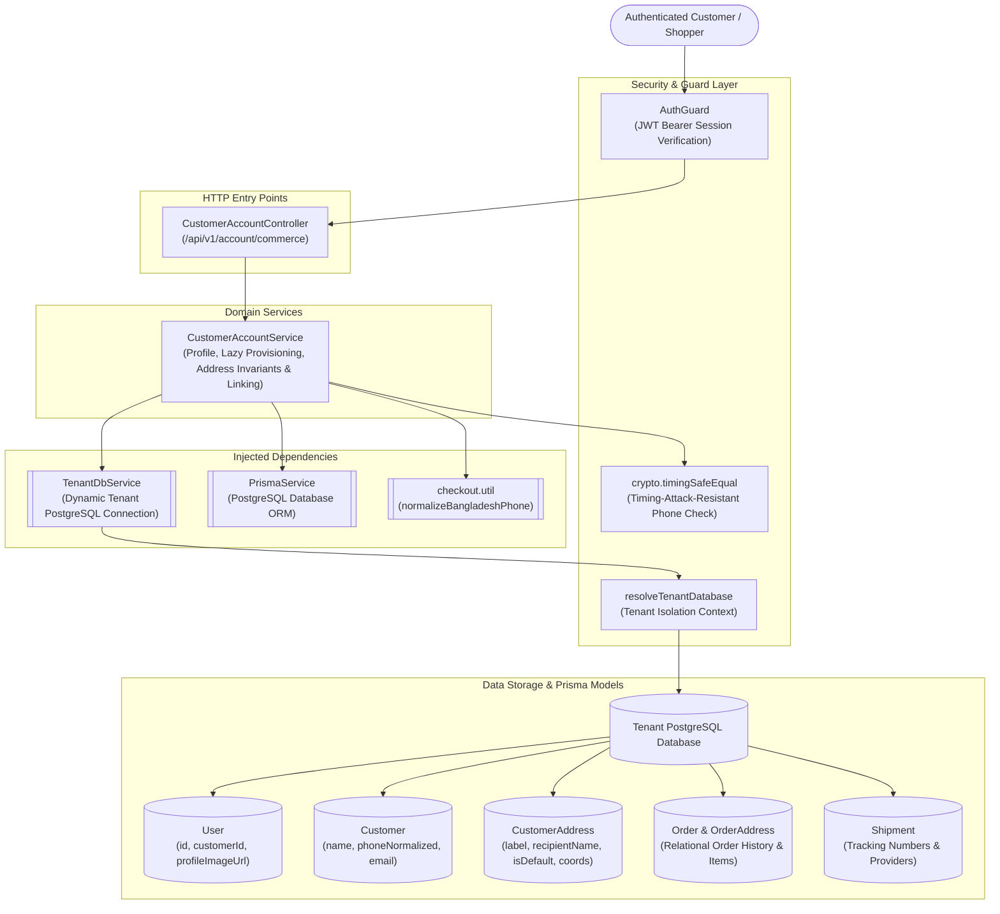
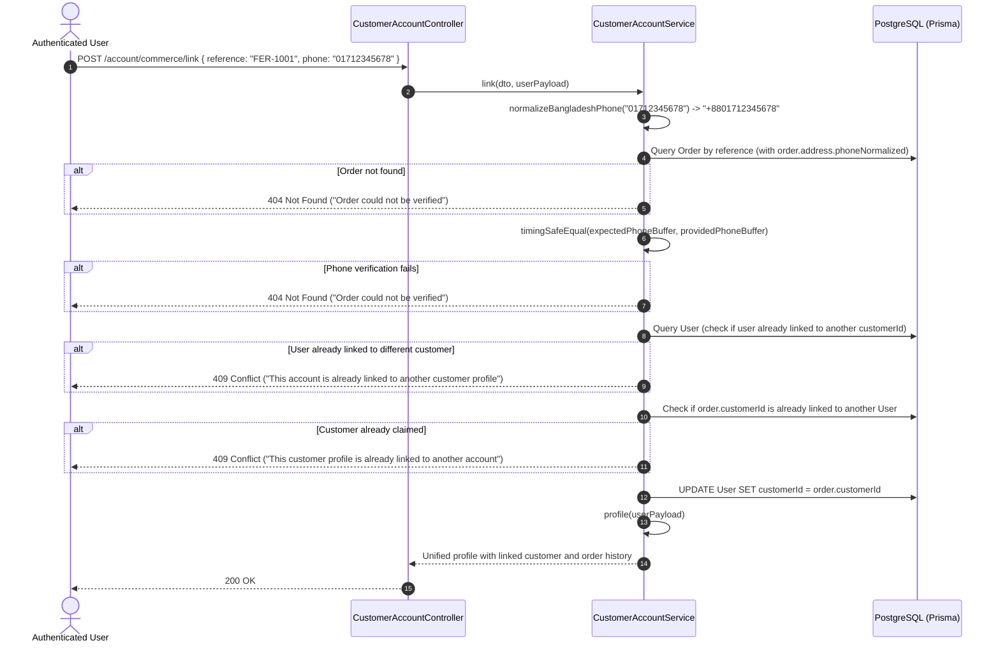
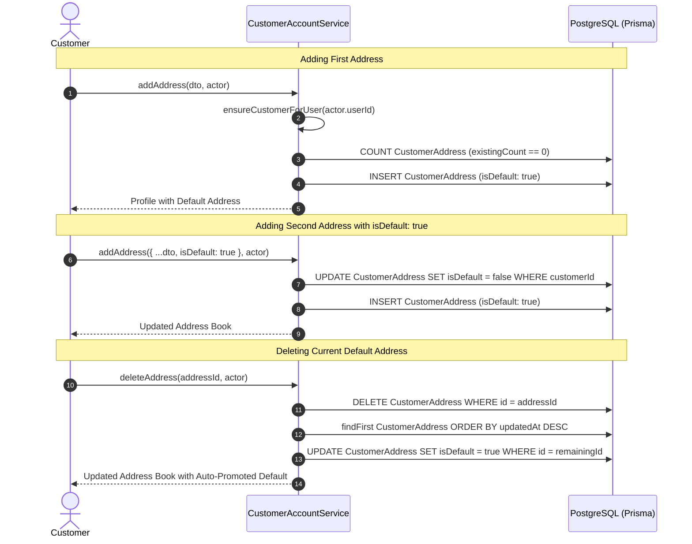
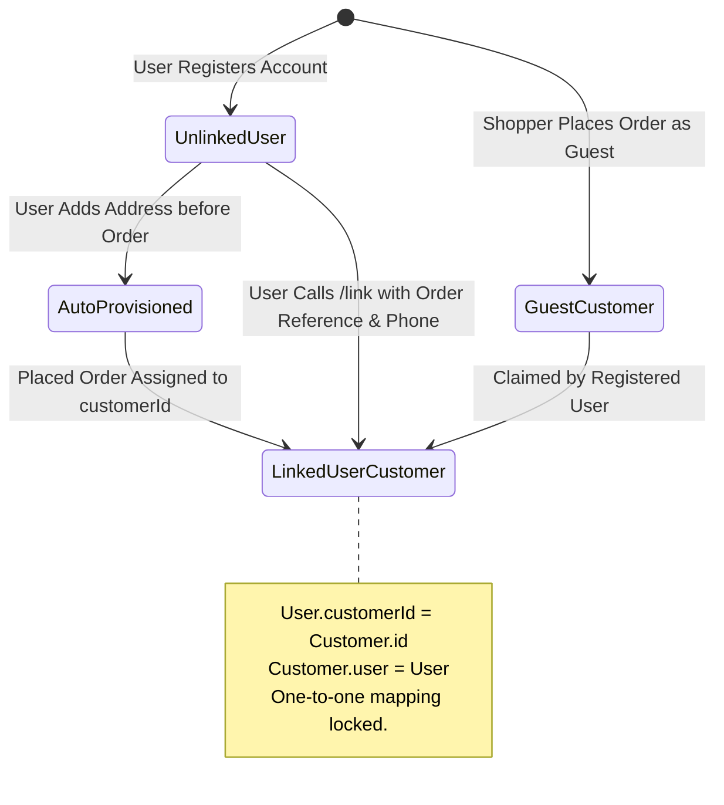

# Customer Account Feature

## Purpose
Manages customer commerce profiles, authenticated identity linking between platform users (`User`) and guest customer entities (`Customer`), automated address book management with default selection guarantees, and unified commerce profile aggregation (orders, shipments, and addresses).

---

## Component Architecture



### Component Source Map

| Component | Layer / Role | Relative Source Path |
| :--- | :--- | :--- |
| `CustomerAccountController` | HTTP Controller (REST Endpoints) | [`./customer-account.controller.ts`](./customer-account.controller.ts) |
| `CustomerAccountService` | Domain Orchestration & Linking Logic | [`./customer-account.service.ts`](./customer-account.service.ts) |
| `LinkCustomerAccountDto` | Account Linking Validation DTO | [`./customer-account.dto.ts`](./customer-account.dto.ts) |
| `CreateCustomerAddressDto` / `UpdateCustomerAddressDto` | Address Book Validation DTOs | [`./customer-account.dto.ts`](./customer-account.dto.ts) |
| `UpdateCustomerProfileDto` | Profile Update Validation DTO | [`./customer-account.dto.ts`](./customer-account.dto.ts) |
| `normalizeBangladeshPhone` | Shared E.164 Normalization Utility | [`../checkout/utils/checkout.util.ts`](../checkout/utils/checkout.util.ts) |
| `Customer Prisma Schema` | Customer & Address Entities | [`../../../prisma/schema/customer.module/customer.prisma`](../../../prisma/schema/customer.module/customer.prisma) |
| `User Prisma Schema` | Platform User Identity Entity | [`../../../prisma/schema/user.module/user.prisma`](../../../prisma/schema/user.module/user.prisma) |

---

## Responsibilities

- **Unified Commerce Profile Aggregation**: Provides a consolidated endpoint (`GET /api/v1/account/commerce`) returning authentication details, customer master profile, address book ordered by default status, and the 50 most recent orders with fulfillment, shipment, and payment states.
- **Timing-Safe Order Account Linking**: Allows newly registered users to link historical guest orders and customer records to their account by validating order reference and delivery phone number using `crypto.timingSafeEqual`.
- **Bidirectional Profile Synchronization**: Updates to user profile attributes (`name`, `phoneNumber`, `profileImageUrl`) automatically synchronize to the underlying `Customer` model.
- **Lazy Customer Auto-Provisioning (`ensureCustomerForUser`)**: Automatically links an existing customer record (matched by verified email or phone) or provisions a new `Customer` record when an authenticated user adds a delivery address.
- **Address Book Management**: Enforces single-default address guarantees, handles automatic default promotion upon deletion, and records geolocation coordinates (`latitude`, `longitude`) alongside street addresses.

---

## Does Not Own

- **Customer Authentication & Password Hashing**: Does not issue JWT tokens, manage login flows, or hash passwords (owned by `AuthModule` in `src/features/authentication`).
- **Order Placement & Modification**: Does not cancel, modify, or checkout orders (owned by `CheckoutModule` and `OrderModule`).
- **Payment Processing**: Does not capture transactions or initiate payment retries (owned by `CommercePaymentsModule`).
- **Staff / Admin CRM Views**: Does not provide administrative customer directory or customer segmentation views (owned by `CustomersModule` in `src/features/customers`).

---

## Dependencies

- **Platform & Security**:
  - `PrismaService` (`@app/database`): PostgreSQL persistence.
  - `TenantDbService` (`@app/tenancy`): Multi-tenant database connection resolver.
  - `crypto.timingSafeEqual`: Prevents timing-attack side-channels during phone verification.
  - `AuthGuard` (`@app/common`): Bearer token authentication guard.
- **Internal Modules**:
  - `normalizeBangladeshPhone` (`CheckoutModule`): Enforces Bangladesh E.164 format (`+8801XXXXXXXXX`).
- **External Libraries**:
  - `class-validator`, `class-transformer`: DTO validation for coordinates, phone numbers, and addresses.

---

## Database Ownership

### Writes / Mutates
- **`User`**:
  - Sets `customerId` during account linking (`link`) or lazy auto-provisioning (`ensureCustomerForUser`).
  - Updates `name`, `phoneNumber`, and `profileImageUrl` during profile edits.
- **`Customer`**:
  - Inserts new customer records during lazy provisioning.
  - Synchronizes `name`, `phoneOriginal`, `phoneNormalized`, and `email` on profile updates.
- **`CustomerAddress`**:
  - Creates new address rows (`customerId`, `recipientName`, `phoneNormalized`, `district`, `area`, `detailedAddress`, `latitude`, `longitude`, `isDefault`).
  - Modifies existing address details.
  - Toggles `isDefault` across sibling addresses to ensure exactly one default address.
  - Deletes addresses and promotes the next most recently updated address to default.

### Reads / References
- **`Order`**, **`OrderAddress`**, **`OrderItem`**: Read to verify order reference/phone on account linking and included in `profile()` order history.
- **`Shipment`**: Read to extract tracking numbers and courier providers for customer orders.

---

## Important Invariants

1. **Timing-Safe Order Phone Verification**: When claiming an order via `link()`, the provided phone number is compared against `order.address.phoneNormalized` using `crypto.timingSafeEqual`. Failed checks throw a generic `404 Not Found ('Order could not be verified')` to prevent leaking whether the order reference or phone was invalid.
2. **Mutual Exclusivity of Linking**:
   - An authenticated `User` cannot link to a different `Customer` if already linked (`user.customerId !== order.customerId`).
   - A `Customer` entity cannot be linked to more than one `User` account (`@@unique` semantics checked in application logic).
3. **Single Default Address Rule**:
   - Only ONE address per customer can have `isDefault: true`.
   - Marking an address as default automatically updates all other customer addresses to `isDefault: false`.
   - The first address created for a customer automatically becomes `isDefault: true`.
   - Deleting the current default address automatically promotes the next most recently updated address to `isDefault: true`.
4. **Tenant Database Isolation**: All account lookups, order checks, and customer updates strictly operate against the caller's resolved tenant database. User IDs and customer profiles cannot cross tenant boundaries.
5. **E.164 Phone Normalization**: Address and profile phone numbers are validated against Bangladesh mobile operators (`013`–`019`) and stored in normalized `+8801XXXXXXXXX` format.

---

## Public API & Entry Points

### Customer Commerce Account Endpoints (`/api/v1/account/commerce`)
| Method | Path | Description | Access / Guards |
| :--- | :--- | :--- | :--- |
| `GET` | `/api/v1/account/commerce` | Get unified profile, addresses, and order history | `AuthGuard` |
| `PUT` | `/api/v1/account/commerce/profile` | Update profile details (synced to Customer) | `AuthGuard` |
| `POST` | `/api/v1/account/commerce/link` | Link account to guest customer profile via order | `AuthGuard` |
| `POST` | `/api/v1/account/commerce/addresses` | Add a new address to the address book | `AuthGuard` |
| `PUT` | `/api/v1/account/commerce/addresses/:id` | Update an existing address | `AuthGuard` |
| `DELETE`| `/api/v1/account/commerce/addresses/:id` | Delete address (auto-promotes remaining default) | `AuthGuard` |

---

## Important Flows

### 1. Timing-Safe Order & Customer Profile Linking



### 2. Address Lifecycle & Default Promotion



### 3. Customer Linking State Machine



---

## Brutal Honest Vulnerabilities & Architectural Debt

### 1. Hardcoded 50-Order Truncation Without Pagination
- **Vulnerability**: In `CustomerAccountService.profile()`, the customer order history query hardcodes:
  ```typescript
  orders: {
    orderBy: { createdAt: 'desc' },
    take: 50,
    ...
  }
  ```
  The endpoint provides an indicator `orderHistoryTruncated: count > 50`, but exposes no pagination parameters (`page`, `cursor`, `limit`).
- **Impact**: Loyal or high-volume customers with more than 50 orders can never view or re-order items from orders placed beyond the 50-order cutoff from their account dashboard.
- **Remediation**: Expose a dedicated paginated endpoint `GET /api/v1/account/commerce/orders` supporting cursor or page-based slicing.

### 2. Cross-Customer Profile Hijack Risk on Dummy Fallback Phone
- **Vulnerability**: In `ensureCustomerForUser()`, if an authenticated user does not have a `phoneNumber` on their `User` record:
  ```typescript
  const phone = user.phoneNumber || '01700000000';
  let phoneNormalized = phone;
  // ...
  const existing = await db.customer.findFirst({
    where: {
      OR: [
        ...(user.email ? [{ email: user.email }] : []),
        { phoneNormalized }, // <--- Matches '01700000000'!
      ],
    },
    orderBy: { createdAt: 'asc' },
    select: { id: true },
  });
  ```
- **Impact**: If multiple users register without phone numbers, the first user creates a `Customer` profile with dummy phone `'01700000000'`. Subsequent users without phone numbers and with missing/divergent emails will match this dummy phone customer profile and link to it, merging distinct accounts into the same customer identity!
- **Remediation**: Never query `{ phoneNormalized }` using fallback dummy numbers. Only include `{ phoneNormalized }` in the lookup if `user.phoneNumber` is genuinely present and non-empty.

### 3. Non-Transactional Address Default Promotion (Race Condition)
- **Vulnerability**: In `addAddress()`, `updateAddress()`, and `deleteAddress()`, clearing previous defaults (`updateMany`) and assigning the new default (`create` or `update`) execute as separate sequential queries without a database transaction (`$transaction`).
- **Impact**: If a customer modifies their address book concurrently across two browser tabs or mobile sessions, interleaving operations can result in multiple default addresses or no default address at all.
- **Remediation**: Wrap all address default transitions and deletions inside `db.$transaction()`.

### 4. Zero Audit Logging for Account Linking and Address Modifications
- **Vulnerability**: Unlike `catalog`, `checkout`, and `commerce-payments`, `CustomerAccountService` does not inject `AuditService` and performs no audit logging on `link()`, `updateProfile()`, or `addAddress()`.
- **Impact**: If an account is maliciously linked to a victim's order history or if a shipping address is hijacked prior to fulfillment, there is zero audit log evidence in PostgreSQL to determine when or by what actor the mutation occurred.
- **Remediation**: Inject `AuditService` and record `CUSTOMER_ACCOUNT_LINKED`, `PROFILE_UPDATED`, and `ADDRESS_MUTATED` events.

### 5. Floating-Point Precision Risk on Geolocation Coordinates
- **Vulnerability**: `CustomerAddress` stores `latitude` and `longitude` as standard `Float?` primitives in PostgreSQL, converted via `Number(dto.latitude)` without decimal precision rounding.
- **Impact**: Coordinates can suffer floating-point inaccuracies, and unindexed coordinate pairs cannot be queried efficiently for delivery radius or regional dispatch calculations.
- **Remediation**: Round coordinates to 6 decimal places (approx. 10cm accuracy) or store spatial coordinates using PostGIS geometry types.
