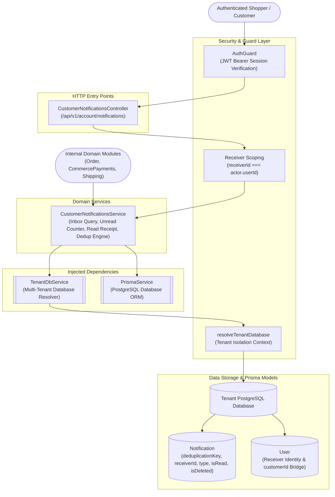
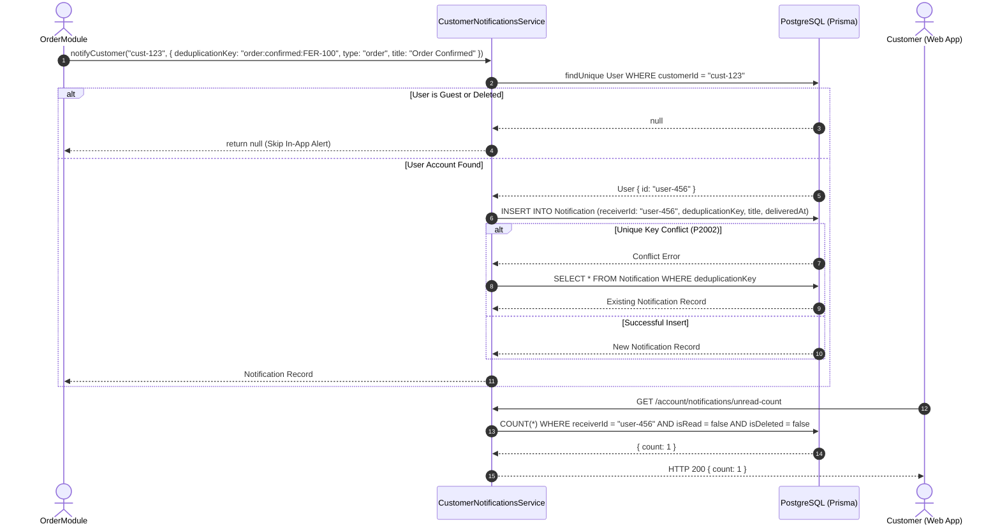
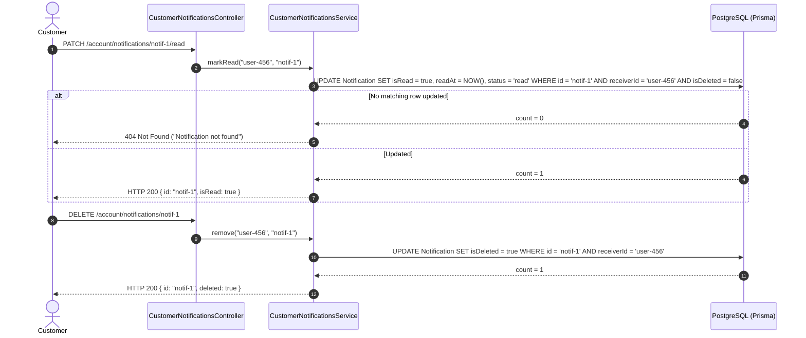

# Customer Notifications Feature

## Purpose
Provides an in-app notification inbox and alert delivery mechanism for authenticated shoppers, managing deduplicated transactional alerts (order lifecycle milestones, payment verifications, shipment updates), unread badge counts, read tracking, and user-scoped soft deletions within tenant database boundaries.

---

## Component Architecture

### Component Source Map

| Component | Layer / Role | Relative Source Path |
| :--- | :--- | :--- |
| `CustomerNotificationsController` | HTTP Controller (Shopper Notification API) | [`./customer-notifications.controller.ts`](./customer-notifications.controller.ts) |
| `CustomerNotificationsService` | Domain Orchestration & Inbox Engine | [`./customer-notifications.service.ts`](./customer-notifications.service.ts) |
| `Notification Schema` | Notification Entity Definition | [`../../../prisma/schema/notification.module/notification.prisma`](../../../prisma/schema/notification.module/notification.prisma) |
| `User Schema` | Receiver Entity & Bridge | [`../../../prisma/schema/user.module/user.prisma`](../../../prisma/schema/user.module/user.prisma) |

---

## Responsibilities

- **In-App Notification Feed**: Delivers paginated, chronologically ordered notification lists (`GET /api/v1/account/notifications`) with filtering for unread messages (`unreadOnly=true`).
- **Unread Badge Counter**: Computes lightweight unread notification counts (`GET /api/v1/account/notifications/unread-count`) for UI top-navigation badges.
- **Transactional Alert Ingestion**: Exposes programmatic `create()` and `notifyCustomer()` methods for adjacent modules (`Order`, `Payments`, `Shipping`) to deliver customer-facing alerts.
- **Idempotent Ingestion via Deduplication Keys**: Enforces unique `deduplicationKey` strings, automatically catching database conflict errors (`P2002`) and returning the existing record to prevent duplicate notification delivery.
- **Customer-to-User Bridging (`notifyCustomer`)**: Resolves customer profiles (`customerId`) to their registered platform user (`User.id`), safely ignoring guest customers who lack registered accounts without throwing errors.
- **Read Receipt & Soft Deletion Lifecycle**: Manages single notification read transitions (`PATCH /:id/read`), bulk read acknowledgments (`POST /read-all`), and soft-deletion (`DELETE /:id`).

---

## Does Not Own

- **External Outbound Messaging (SMS/WhatsApp/Email)**: Does not send mobile text messages, WhatsApp alerts, or marketing emails (owned by `TransactionalMessagingModule` in `src/features/transactional-messaging`).
- **Real-Time WebSocket Transport**: Does not maintain persistent Socket.IO connections or emit push events to mobile devices (owned by `SocketGateway`).
- **Administrative System Broadcasts**: Does not manage system-wide broadcast campaigns or role-targeted administrative blasts (owned by admin notification management).
- **Commerce Profile Management**: Does not manage user names, phones, or addresses (owned by `CustomerAccountModule`).

---

## Dependencies

- **Platform & Security**:
  - `PrismaService` (`@app/database`): PostgreSQL persistence.
  - `TenantDbService` (`@app/tenancy`): Resolves tenant-specific database clients.
  - `AuthGuard` (`@app/common`): Bearer token authentication guard.

---

## Database Ownership

### Writes / Mutates
- **`Notification`**:
  - Creates alerts (`receiverId`, `deduplicationKey`, `type`, `priority: 'normal'`, `status: 'delivered'`, `title`, `message`, `entityType`, `entityId`, `deliveredAt`).
  - Updates `isRead: true`, `readAt: now()`, and `status: 'read'` when acknowledged.
  - Updates `isDeleted: true` when removed by the user.

### Reads / References
- **`User`**: Looked up via `customerId` in `notifyCustomer()` to determine if an order customer has a linked user account.

---

## Important Invariants

1. **Strict Recipient Isolation**: Every read, count, update, and delete operation unconditionally constrains `where: { receiverId: userId, isDeleted: false }`. A customer can never view, mutate, or delete another user's notifications.
2. **Deduplication Idempotency**: Notifications created with an identical `deduplicationKey` will not create duplicate rows. Prisma `P2002` unique constraint violations return the previously created record cleanly.
3. **Soft-Delete Only**: User-deleted notifications are never physically dropped from the database; they are updated with `isDeleted: true`.
4. **Silent Guest Skip**: When an event triggers `notifyCustomer(customerId)` for a guest checkout (where `User.customerId` is null or the user is deleted), the service returns `null` quietly rather than failing the upstream commerce action.
5. **Tenant Isolation**: Notification operations execute strictly against the caller's resolved tenant database. Notifications cannot cross organizational or tenant boundaries.

---

## Public API & Entry Points

### Customer Notification Endpoints (`/api/v1/account/notifications`)
| Method | Path | Description | Access / Guards |
| :--- | :--- | :--- | :--- |
| `GET` | `/api/v1/account/notifications` | Paginated notification inbox (optional `unreadOnly=true`)| `AuthGuard` |
| `GET` | `/api/v1/account/notifications/unread-count` | Real-time badge counter of unread notifications | `AuthGuard` |
| `PATCH` | `/api/v1/account/notifications/:id/read` | Mark a specific notification as read | `AuthGuard` |
| `POST` | `/api/v1/account/notifications/read-all` | Mark all unread notifications as read | `AuthGuard` |
| `DELETE`| `/api/v1/account/notifications/:id` | Soft delete a notification from inbox | `AuthGuard` |

### Exported Programmatic Services
- `CustomerNotificationsService.create(input: CreateCustomerNotificationInput)`
- `CustomerNotificationsService.notifyCustomer(customerId: string, input)`

---

## Important Flows

### 1. Transactional Event Ingestion with Deduplication

### 2. Inbox Reading & Soft Deletion

---

## Brutal Honest Vulnerabilities & Architectural Debt

### 1. Lack of Real-Time WebSocket Push (Polling Dependency)
- **Vulnerability**: `CustomerNotificationsService.create()` writes directly to PostgreSQL but does not emit a WebSocket event (`SocketGateway`) or push to a message broker.
- **Impact**: When an order status updates or a payment confirms, the customer's browser badge count does not update in real-time. Shoppers must manually refresh the page or client applications must implement aggressive polling loops against `/account/notifications/unread-count`.
- **Remediation**: Inject `SocketGateway` and emit an `inbox:new-notification` event directly to `receiverId` upon insertion.

### 2. Polling Amplification & Missing Rate Limits
- **Vulnerability**: Endpoints `GET /account/notifications` and `GET /account/notifications/unread-count` are not protected by rate limiters (unlike payment and authentication endpoints).
- **Impact**: Polling intervals (e.g. every 3 seconds per tab) from thousands of concurrent shoppers generate high `COUNT(*)` database load across tenant partitions.
- **Remediation**: Apply `@UseGuards(SlidingWindowRateLimitGuard)` with a sensible quota (e.g. 60 requests/minute) or replace polling with WebSocket push.

### 3. Missing Notification Expiration & Table Bloat
- **Vulnerability**: Notifications accumulate indefinitely in PostgreSQL. Neither read notifications nor soft-deleted notifications (`isDeleted: true`) are pruned.
- **Impact**: Over years of store operations, the `Notification` table will grow to millions of rows, increasing index sizes (`@@index([receiverId, isRead, isDeleted, createdAt])`) and slowing down customer dashboard queries.
- **Remediation**: Implement a scheduled cleanup cron job to hard-delete soft-deleted notifications after 30 days and archive read notifications older than 90 days.

### 4. No Grouping or Digest Aggregation
- **Vulnerability**: Every business milestone generates an independent notification row.
- **Impact**: Rapid order state changes (e.g., `CONFIRMED` $\to$ `PACKED` $\to$ `IN_TRANSIT`) fill the customer's inbox with multiple repetitive alerts for the same order, creating notification fatigue.
- **Remediation**: Implement notification rollups or update existing notifications in-place for active order lifecycles.
