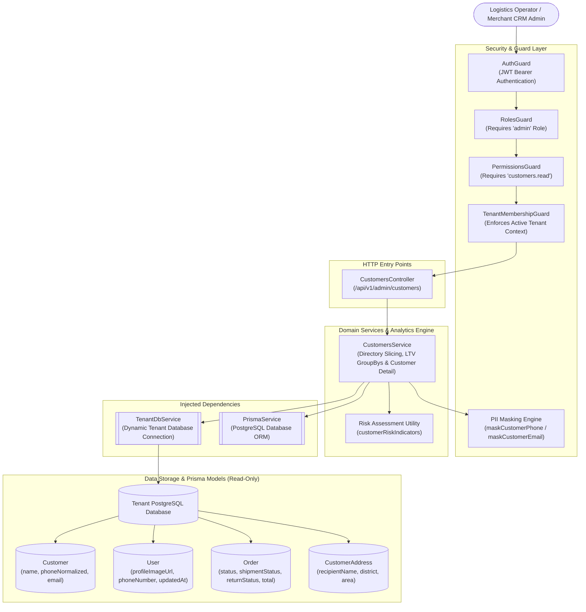
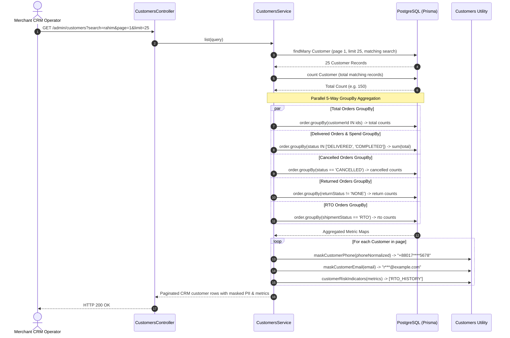
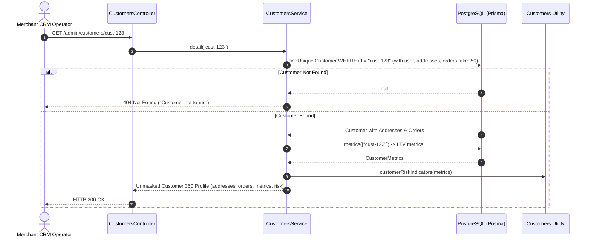

# Customers Feature

## Purpose
Provides merchant CRM intelligence and administrative customer analytics, aggregating lifetime value (LTV) metrics (delivered spend, order volumes, cancellation rates, RTO history, and return frequencies), evaluating behavioral risk indicators, privacy-masking customer contact details in directory views, and detailing comprehensive customer delivery histories across tenant boundaries.

---

## Component Architecture



### Component Source Map

| Component | Layer / Role | Relative Source Path |
| :--- | :--- | :--- |
| `CustomersController` | HTTP Controller (Admin CRM Endpoints) | [`./customers.controller.ts`](./customers.controller.ts) |
| `CustomersService` | Domain Analytics & LTV Aggregation Engine | [`./customers.service.ts`](./customers.service.ts) |
| `CustomerQueryDto` | Directory Query & Filter Validation DTO | [`./customers.dto.ts`](./customers.dto.ts) |
| `customerRiskIndicators` | Algorithmic Risk Assessment Utility | [`./utils/customers.util.ts`](./utils/customers.util.ts) |
| `maskCustomerPhone` / `maskCustomerEmail` | PII Privacy Masking Utilities | [`./utils/customers.util.ts`](./utils/customers.util.ts) |
| `Customer Prisma Schema` | Customer Master Entity | [`../../../prisma/schema/customer.module/customer.prisma`](../../../prisma/schema/customer.module/customer.prisma) |
| `Order Prisma Schema` | Historical Orders Data Source | [`../../../prisma/schema/order.module/order.prisma`](../../../prisma/schema/order.module/order.prisma) |

---

## Responsibilities

- **Merchant CRM Customer Directory**: Delivers paginated, searchable, and filtered views of customer profiles with activity slicing (`LAST_7_DAYS`, `LAST_30_DAYS`, or monthly `YYYY-MM`).
- **PII Privacy Masking on List Views**: Automatically masks contact details in list responses (`+88017****5678` and `r***@example.com`), preventing bulk PII scraping or inadvertent data exposure by dashboard operators.
- **5-Way Lifetime Value (LTV) Aggregation**: Executes parallel SQL aggregations to calculate total orders, delivered order volume, delivered revenue spend (`deliveredSpend`), cancelled order counts, return counts, and Return-to-Origin (RTO) frequencies.
- **Behavioral Risk Assessment**: Derives explainable, deterministic risk badges:
  - `RTO_HISTORY`: Customer has orders returned to origin by courier.
  - `HIGH_CANCELLATION_RATE`: Customer has $\ge 3$ orders and a cancellation rate of $\ge 50\%$.
  - `REPEAT_RETURN_HISTORY`: Customer has $\ge 2$ processed product return cases.
- **Detailed Customer 360 View**: Exposes full unmasked contact details, attached saved addresses, recent order history (up to 50 orders) with marketing attribution (`source`, `medium`, `campaign`), line item counts, and delivery breakdown.
- **Unlinked Account Heuristic Resolution**: Enriches guest customer profiles with matching registered `User` profile pictures and online activity timestamps when registered accounts share the customer's email address.

---

## Does Not Own

- **Customer Profile Mutations & Address Edits**: Does not add or update customer addresses or modify account passwords (owned by `CustomerAccountModule` in `src/features/customer-account` and `AuthModule`).
- **Order Cancellation & Processing**: Does not cancel orders or update shipment statuses (owned by `OrderModule` in `src/features/order`).
- **Marketing Campaign Dispatch**: Does not deliver SMS/WhatsApp marketing broadcasts to filtered customer lists (owned by `TransactionalMessagingModule`).
- **Refund Issuance**: Does not disburse funds or approve return requests (owned by `RefundsModule` and `ReturnsModule`).

---

## Dependencies

- **Platform & Security**:
  - `PrismaService` (`@app/database`): PostgreSQL persistence.
  - `TenantDbService` (`@app/tenancy`): Resolves tenant-specific database clients.
  - `AuthGuard`, `RolesGuard`, `PermissionsGuard`, `TenantMembershipGuard` (`@app/common`).
- **Cross-Domain Data Sources**:
  - `Customer`, `User`, `Order`, `CustomerAddress`: Aggregated read-only models.

---

## Database Ownership

### Writes / Mutates
- **Zero Database Mutations**: The `customers` module is a strictly **read-only analytical bounded context**. It executes zero `create`, `update`, `upsert`, or `delete` queries against PostgreSQL.

### Reads / References
- **`Customer`**: Primary directory lookups and search filtering on `name`, `phoneNormalized`, `phoneOriginal`, and `email`.
- **`User`**: Joins on `customerId` and email to extract avatar URLs, telephone numbers, and last activity timestamps.
- **`Order`**: Aggregated via `db.order.groupBy` across `customerId` to compute revenue and fulfillment volumes.
- **`CustomerAddress`**: Listed in customer detail views with default address indicators.

---

## Important Invariants

1. **PII Masking Guarantee in Directory**: List responses (`GET /admin/customers`) MUST ALWAYS mask customer phone numbers and email addresses. Full contact information is only revealed on single-customer detail queries (`GET /admin/customers/:id`).
2. **Read-Only Analytic Boundary**: Under no circumstances should service methods in this module mutate database state. State changes to customer records belong to `CustomerAccountService`.
3. **Tenant Analytical Isolation**: All metric calculations (`deliveredSpend`, `rtoOrderCount`, etc.) are computed exclusively against the caller's resolved tenant database. Metrics never leak across distinct merchant stores.
4. **Explainable Risk Derivation**: Risk badges are strictly computed from verified order fulfillment records (`status = 'CANCELLED'`, `shipmentStatus = 'RTO'`, `returnStatus != 'NONE'`). Subjective scoring or unexplainable heuristics are forbidden.

---

## Public API & Entry Points

### Admin Customer CRM Endpoints (`/api/v1/admin/customers`)
| Method | Path | Description | Required Permissions |
| :--- | :--- | :--- | :--- |
| `GET` | `/api/v1/admin/customers` | Paginated customer list with masked PII & LTV metrics | `CUSTOMERS_READ` |
| `GET` | `/api/v1/admin/customers/:id` | Full customer 360 profile with unmasked PII & orders | `CUSTOMERS_READ` |

---

## Important Flows

### 1. Customer Directory Query & 5-Way Parallel LTV Aggregation



### 2. Customer 360 Detail View



---

## Brutal Honest Vulnerabilities & Architectural Debt

### 1. 5-Way Parallel `groupBy` Analytical Load on Primary Database (OLTP/OLAP Contention)
- **Vulnerability**: Every single page request to `GET /admin/customers` triggers 5 distinct `db.order.groupBy` queries across all customers in the page.
- **Impact**: On high-volume production stores with hundreds of thousands of orders, running 5 sequential or parallel group-by queries on non-indexed order status combinations consumes significant database CPU and buffer pool cache. Under frequent admin browsing, this OLAP workload degrades core checkout and order placement throughput on the primary transactional database.
- **Remediation**: Maintain materialized or transactional running counters on the `Customer` table (`deliveredSpend`, `orderCount`, `rtoCount`) incremented during order state transitions, eliminating on-the-fly group-bys entirely.

### 2. Missing Administrative Action Controls (No Suspension or Blacklisting)
- **Vulnerability**: While the module identifies customer fraud risks (`RTO_HISTORY`, `HIGH_CANCELLATION_RATE`), `CustomersController` provides no endpoints to take action on those risks.
- **Impact**: When operators detect a repeat RTO abuser or serial order cancellation bot, they cannot block Cash-on-Delivery, freeze the account, or add internal administrative notes from the CRM dashboard. Operators must execute manual SQL queries or switch to separate user administration tools.
- **Remediation**: Introduce administrative mutation endpoints (`PATCH /admin/customers/:id`) allowing staff to toggle `isCodBlocked`, `isSuspended`, or append `adminNotes`.

### 3. Hardcoded 50-Order Ceiling on Customer Detail
- **Vulnerability**: `CustomersService.detail()` hardcodes:
  ```typescript
  orders: {
    take: 50,
    orderBy: { createdAt: 'desc' },
    ...
  }
  ```
- **Impact**: For VIP or institutional repeat buyers with more than 50 historical orders, staff cannot audit orders 51+ from the customer CRM screen.
- **Remediation**: Support pagination or provide a deep-link from the customer detail page directly to the orders module filtered by `?customerId=...`.

### 4. Sequential Full-Table Substring Searches
- **Vulnerability**: `list()` executes unanchored substring matching via `{ contains: search, mode: 'insensitive' }` across `name`, `email`, `phoneNormalized`, and `phoneOriginal`.
- **Impact**: PostgreSQL cannot utilize standard B-Tree indexes for leading-wildcard searches (`ILIKE '%search%'`). In large customer tables, every directory search forces a full-table sequential scan, exhausting query execution budgets.
- **Remediation**: Implement PostgreSQL Trigram GIN indexes (`pg_trgm`) on `name` and `email` or index phone prefixes with standard text patterns.

### 5. In-Memory Email Re-Query Overhead
- **Vulnerability**: In `list()`, for customers who have an email but lack an attached `User` relation, the service executes a secondary query:
  ```typescript
  const usersByEmail = await db.user.findMany({
    where: { email: { in: unlinkedEmails, mode: 'insensitive' } },
  });
  ```
- **Impact**: Generates an extra database round-trip per page to heuristically reconcile unlinked customer rows with user accounts, adding latency to list responses.
- **Remediation**: Ensure customer-to-user links are created deterministically during registration or checkout, eliminating heuristic reconciliation queries.
