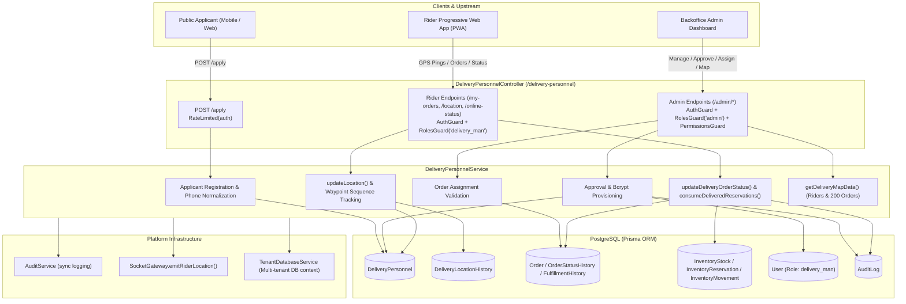
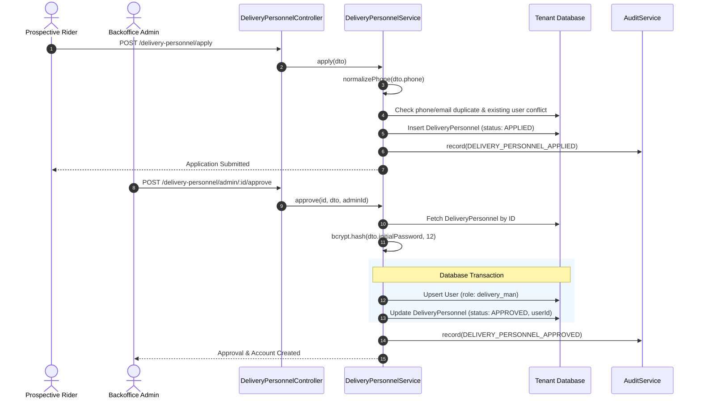
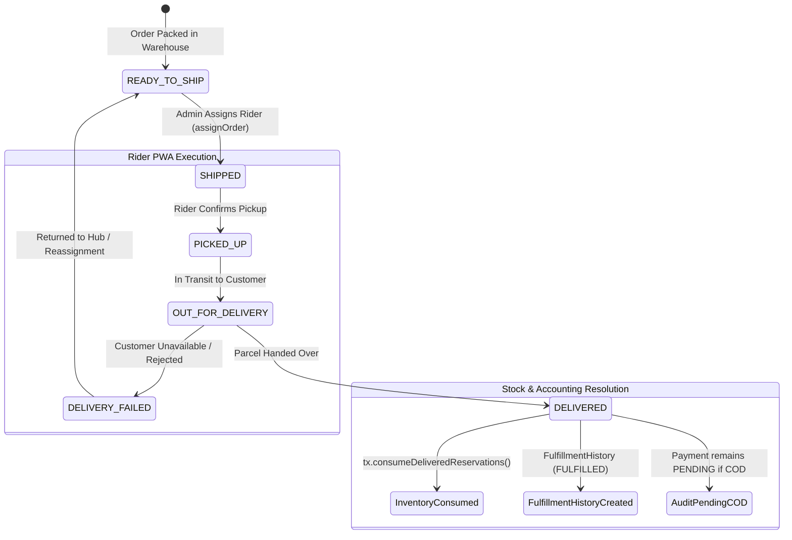
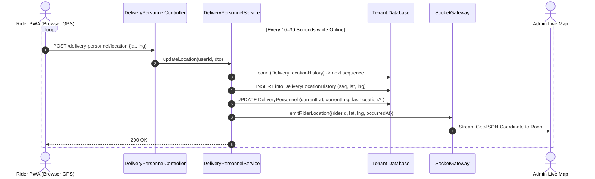

# Delivery Personnel Feature Architecture & Invariants

## Purpose
The **Delivery Personnel** module (`delivery-personnel`) manages the end-to-end lifecycle of in-house delivery riders and couriers within the e-commerce platform. It provides public onboarding applications, administrator-driven vetting and account provisioning, order dispatch assignment, real-time browser-based GPS waypoint ingestion, WebSocket location streaming, and rider-driven order delivery execution with atomic inventory reservation settlement and audit tracking.

---

## Component Architecture



---

## Component Source Map

| Component / File | Symbol / Role | Primary Responsibilities | Key Invariants Enforced |
| :--- | :--- | :--- | :--- |
| [`delivery-personnel.module.ts`](file:///home/chillpc/MohammadSheakh/projects/26/e-commerce/e-com-nextjs/ferio-nest-prisma/src/features/delivery-personnel/delivery-personnel.module.ts) | [`DeliveryPersonnelModule`](file:///home/chillpc/MohammadSheakh/projects/26/e-commerce/e-com-nextjs/ferio-nest-prisma/src/features/delivery-personnel/delivery-personnel.module.ts#L10-L16) | NestJS feature module configuration registering providers and controllers. | Imports `AuditModule` and optional `SocketModule`; exports [`DeliveryPersonnelService`](file:///home/chillpc/MohammadSheakh/projects/26/e-commerce/e-com-nextjs/ferio-nest-prisma/src/features/delivery-personnel/delivery-personnel.service.ts#L45-L929). |
| [`delivery-personnel.controller.ts`](file:///home/chillpc/MohammadSheakh/projects/26/e-commerce/e-com-nextjs/ferio-nest-prisma/src/features/delivery-personnel/delivery-personnel.controller.ts) | [`DeliveryPersonnelController`](file:///home/chillpc/MohammadSheakh/projects/26/e-commerce/e-com-nextjs/ferio-nest-prisma/src/features/delivery-personnel/delivery-personnel.controller.ts#L51-L188) | HTTP routing, request deserialization, Swagger documentation, and guard orchestration. | Enforces `SlidingWindowRateLimitGuard` on `/apply`; enforces `AuthGuard`, `RolesGuard('admin')`, and `PermissionsGuard` on `/admin/*`; enforces `AuthGuard` and `RolesGuard('delivery_man')` on rider PWA endpoints. |
| [`delivery-personnel.service.ts`](file:///home/chillpc/MohammadSheakh/projects/26/e-commerce/e-com-nextjs/ferio-nest-prisma/src/features/delivery-personnel/delivery-personnel.service.ts) | [`DeliveryPersonnelService`](file:///home/chillpc/MohammadSheakh/projects/26/e-commerce/e-com-nextjs/ferio-nest-prisma/src/features/delivery-personnel/delivery-personnel.service.ts#L45-L929) | Core business logic: applications, vetting, credentials, assignments, stock consumption, location sequences. | Implements phone normalization, serializable transactions on status transitions, stock reservation reconciliation, and cross-tenant isolation. |
| [`delivery-personnel.dto.ts`](file:///home/chillpc/MohammadSheakh/projects/26/e-commerce/e-com-nextjs/ferio-nest-prisma/src/features/delivery-personnel/delivery-personnel.dto.ts) | DTO Validation Classes | Class-validator contracts for applications, direct creation, approvals, assignments, updates, and GPS points. | Validates Bangladeshi phone numbers, coordinate bounds (`[-90, 90]`, `[-180, 180]`), minimum password length (10 chars), and status enums. |
| [`delivery.prisma`](file:///home/chillpc/MohammadSheakh/projects/26/e-commerce/e-com-nextjs/ferio-nest-prisma/prisma/schema/delivery.module/delivery.prisma) | Data Models | Prisma schema for `DeliveryPersonnel` and `DeliveryLocationHistory`. | Direct foreign key from `DeliveryLocationHistory` to `DeliveryPersonnel`; 1-to-many relation on orders. |

---

## Responsibilities

### Owns
- **Rider Applicant Ingestion**: Processing public applications via [`apply()`](file:///home/chillpc/MohammadSheakh/projects/26/e-commerce/e-com-nextjs/ferio-nest-prisma/src/features/delivery-personnel/delivery-personnel.service.ts#L79-L130), validating National Identity (NID), driving licenses, emergency contacts, and normalizing phone numbers.
- **Rider Onboarding & Provisioning**: Transitioning candidate status (`APPLIED` $\rightarrow$ `APPROVED` or `REJECTED`), creating or linking platform [`User`](file:///home/chillpc/MohammadSheakh/projects/26/e-commerce/e-com-nextjs/ferio-nest-prisma/prisma/schema/auth.module/user.prisma) records with role `delivery_man`, and generating bcrypt password hashes.
- **Direct Rider Creation**: Administrative shortcut creation via [`createDirect()`](file:///home/chillpc/MohammadSheakh/projects/26/e-commerce/e-com-nextjs/ferio-nest-prisma/src/features/delivery-personnel/delivery-personnel.service.ts#L175-L252) creating pre-approved profiles and active user credentials in a single pass.
- **Order Dispatch Assignment**: Validating and linking orders in `READY_TO_SHIP` or `SHIPPED` status to approved riders via [`assignOrder()`](file:///home/chillpc/MohammadSheakh/projects/26/e-commerce/e-com-nextjs/ferio-nest-prisma/src/features/delivery-personnel/delivery-personnel.service.ts#L416-L476).
- **Rider Duty & Location Tracking**: Managing online/offline status, recording sequential breadcrumb waypoints into `DeliveryLocationHistory`, updating current coordinates, and emitting real-time telemetry over WebSockets.
- **Rider Order Delivery Settlement**: Progressing assigned orders through transit stages (`PICKED_UP`, `OUT_FOR_DELIVERY`, `DELIVERED`, `DELIVERY_FAILED`), writing fulfillment history, consuming active inventory reservations, and recording audit trails.

### Does Not Own
- **Third-Party Courier Webhooks**: Handled exclusively by `ShippingModule` and external logistics providers (e.g., Steadfast, Pathao, RedX).
- **COD Cash Collection Handover**: While riders record order delivery, cash reconciliation remains pending until backoffice staff accept physical cash handovers into finance accounts.
- **Inventory Sourcing & Warehouse Picking**: Handled by `InventoryModule` and `FulfillmentModule`.
- **User Authentication Tokens**: Handled by `AuthenticationModule` (`/auth/login`); riders authenticate using their provisioned credentials through standard JWT guards.

---

## Dependencies

### Consumes
- **[`TenantDatabaseService`](file:///home/chillpc/MohammadSheakh/projects/26/e-commerce/e-com-nextjs/ferio-nest-prisma/src/tenancy/tenant-database.service.ts)**: Resolves the ambient multi-tenant database connection or falls back to legacy shared database context.
- **[`AuditService`](file:///home/chillpc/MohammadSheakh/projects/26/e-commerce/e-com-nextjs/ferio-nest-prisma/src/features/audit/audit.service.ts)**: Records synchronous structured audit logs for administrative approvals, rejections, order assignments, and rider delivery confirmations.
- **[`SocketGateway`](file:///home/chillpc/MohammadSheakh/projects/26/e-commerce/e-com-nextjs/ferio-nest-prisma/src/websocket/socket.gateway.ts)** (Optional): Streams live rider GPS coordinates to administrative tracking rooms.
- **`bcryptjs`**: Cryptographic one-way password hashing for rider system accounts.

### External Services
- **Browser Geolocation API**: PWA client-side telemetry provider feeding latitude/longitude coordinates to `POST /location`.
- **OpenStreetMap / Mapbox**: Consumes latitude/longitude coordinates returned by `GET /admin/map-data` for administrative dashboard rendering.

---

## Database Ownership

### Direct Writes / Mutates
| Entity | Nature of Mutation | Context / Trigger |
| :--- | :--- | :--- |
| `DeliveryPersonnel` | Insert, Update, Soft-State | Created on application or direct admin creation; status updated on approval/rejection; coordinates, `lastLocationAt`, and `isOnline` updated on GPS pings and duty toggles. |
| `DeliveryLocationHistory` | Insert, Bulk Delete | Sequential waypoint inserted on every GPS ping (`POST /location`); cleared on admin action (`DELETE /admin/:id/location-history`). |
| `User` | Insert, Update | Provisioned or updated with role `delivery_man` upon applicant approval or direct rider creation. |
| `Order` | Update | `assignedDeliveryPersonnelId` set on assignment; `shipmentStatus`, `status`, and `fulfillmentStatus` updated on rider status changes. |
| `OrderStatusHistory` | Insert | Status audit entry recorded whenever a rider updates an assigned order. |
| `FulfillmentHistory` | Insert | Record created when an assigned order transitions to `DELIVERED` (`FULFILLED`). |
| `InventoryStock` | Update | `reserved` and `onHand` quantities decremented upon rider-confirmed delivery. |
| `InventoryReservation` | Update | Active reservations transitioned to `CONSUMED` with `consumedAt` timestamp upon delivery. |
| `InventoryMovement` | Insert | Type `SALE` movement recorded for each order item delivered by the rider. |
| `AuditLog` | Insert | Logs recorded for `DELIVERY_PERSONNEL_APPLIED`, `DELIVERY_PERSONNEL_APPROVED`, `DELIVERY_PERSONNEL_REJECTED`, `DELIVERY_PERSONNEL_ORDER_ASSIGNED`, and `RIDER_DELIVERY_CONFIRMED`. |

### Reads / References
| Entity | Read Purpose |
| :--- | :--- |
| `TenantContext` | Multi-tenant schema routing and isolation. |
| `Customer` | Enriched recipient name and normalized phone retrieval for rider order views (`/my-orders`). |
| `Address` | Delivery coordinates, street, landmark, and district info for rider navigation and map rendering. |

---

## Important Invariants

### 1. Identity & Phone Normalization
- Every phone number submitted (`phoneOriginal`) is sanitized using platform standard Bangladeshi normalization (`normalizePhone`).
- Strict uniqueness is enforced on both `phoneNormalized` and `email` across `DeliveryPersonnel` records.
- **Applicant Account Hijacking Prevention**: An applicant cannot submit an email that already belongs to an existing platform user unless that user is already a rider. Furthermore, approving a rider cannot reassign a pre-existing non-rider user account (e.g., an administrator or customer) to role `delivery_man`.

### 2. Password & Credential Security
- Initial passwords supplied during direct creation or approval must be at least 10 characters long.
- Passwords are hashed with `bcryptjs` using a minimum salt factor of 12 rounds before database storage.
- Passwords are never returned in HTTP responses.

### 3. Order Assignment Constraints
- An order can only be assigned to a delivery personnel whose status is `APPROVED`.
- Orders in terminal states (`DELIVERED`, `CANCELLED`, `COMPLETED`, `RETURNED`, `RTO`) cannot be assigned to riders.
- Orders must be in fulfillment status `READY_TO_SHIP` or `SHIPPED` before dispatch handover.

### 4. Atomic Delivery Settlement & Stock Accounting
- When a rider marks an order as `DELIVERED`, the operation executes inside a `Prisma.TransactionIsolationLevel.Serializable` database transaction.
- In-house rider delivery executes the exact same inventory accounting invariants as third-party couriers:
  1. Finds all `ACTIVE` reservations for the order.
  2. Asserts `stock.reserved >= reservation.quantity` and `stock.onHand >= reservation.quantity`.
  3. Decrements both `reserved` and `onHand`.
  4. Marks reservation `CONSUMED`.
  5. Inserts an `InventoryMovement` of type `SALE`.
  6. Creates a `FulfillmentHistory` record with status `FULFILLED`.

### 5. COD Cash Handover Integrity
- Marking a COD order as `DELIVERED` sets the shipment and fulfillment status to delivered, but **intentionally leaves the payment status as `PENDING`**.
- COD cash collected by internal riders must be physically reconciled by backoffice staff before payment is marked `PAID`. An audit record with `codCashPendingStaffConfirmation: true` is explicitly emitted.

### 6. Geolocation Waypoint Sequencing
- Each location update increments the rider's `sequence` number based on the existing count of `DeliveryLocationHistory` entries.
- Location coordinates must satisfy geographic boundaries: $-90 \le \text{lat} \le 90$ and $-180 \le \text{lng} \le 180$.

---

## Public API & Entry Points

All routes are mounted under the base path `/delivery-personnel`.

| Method | Endpoint | Guards & Auth | Description / Role | Inputs / Payload | Response |
| :--- | :--- | :--- | :--- | :--- | :--- |
| `POST` | `/apply` | `SlidingWindowRateLimitGuard(auth)` | Public application submission for prospective riders. | [`ApplyDeliveryPersonnelDto`](file:///home/chillpc/MohammadSheakh/projects/26/e-commerce/e-com-nextjs/ferio-nest-prisma/src/features/delivery-personnel/delivery-personnel.dto.ts#L4-L44) | Created `DeliveryPersonnel` record (`status: APPLIED`) |
| `GET` | `/admin/applicants` | `AuthGuard`, `RolesGuard('admin')`, `PermissionsGuard(DELIVERY_PERSONNEL_READ)` | Paginated listing of applicants and riders with status filter. | Query: `page`, `limit`, `status` | Paginated riders list + meta |
| `POST` | `/admin/create-direct` | `AuthGuard`, `RolesGuard('admin')`, `PermissionsGuard(DELIVERY_PERSONNEL_MANAGE)` | Administrator creates and immediately provisions an approved rider. | [`CreateDirectDeliveryPersonnelDto`](file:///home/chillpc/MohammadSheakh/projects/26/e-commerce/e-com-nextjs/ferio-nest-prisma/src/features/delivery-personnel/delivery-personnel.dto.ts#L46-L89) | Created `DeliveryPersonnel` record (`status: APPROVED`) |
| `GET` | `/admin/map-data` | `AuthGuard`, `RolesGuard('admin')`, `PermissionsGuard(DELIVERY_PERSONNEL_READ)` | Fetches all active riders with breadcrumb history and up to 200 recent orders for live map view. | None | `{ riders: [...], activeOrders: [...] }` |
| `DELETE` | `/admin/:id/location-history` | `AuthGuard`, `RolesGuard('admin')`, `PermissionsGuard(DELIVERY_PERSONNEL_MANAGE)` | Clears historical GPS waypoints for a specific rider while preserving current coordinates. | Param: `id` | `{ message, currentLat, currentLng }` |
| `POST` | `/admin/:id/approve` | `AuthGuard`, `RolesGuard('admin')`, `PermissionsGuard(DELIVERY_PERSONNEL_MANAGE)` | Approves an applicant and provisions their rider login account. | Param: `id`, Body: [`ApproveDeliveryPersonnelDto`](file:///home/chillpc/MohammadSheakh/projects/26/e-commerce/e-com-nextjs/ferio-nest-prisma/src/features/delivery-personnel/delivery-personnel.dto.ts#L91-L98) | Approved `DeliveryPersonnel` record |
| `POST` | `/admin/:id/reject` | `AuthGuard`, `RolesGuard('admin')`, `PermissionsGuard(DELIVERY_PERSONNEL_MANAGE)` | Rejects a rider application. | Param: `id` | Rejected `DeliveryPersonnel` record |
| `POST` | `/admin/:id/assign-order` | `AuthGuard`, `RolesGuard('admin')`, `PermissionsGuard(DELIVERY_PERSONNEL_MANAGE)` | Dispatches an order to an approved rider. | Param: `id`, Body: [`AssignOrderDto`](file:///home/chillpc/MohammadSheakh/projects/26/e-commerce/e-com-nextjs/ferio-nest-prisma/src/features/delivery-personnel/delivery-personnel.dto.ts#L100-L106) | Updated `Order` record |
| `PATCH` | `/admin/:id` | `AuthGuard`, `RolesGuard('admin')`, `PermissionsGuard(DELIVERY_PERSONNEL_MANAGE)` | Updates rider operational attributes (zones, vehicle, phone). | Param: `id`, Body: [`UpdateDeliveryPersonnelDto`](file:///home/chillpc/MohammadSheakh/projects/26/e-commerce/e-com-nextjs/ferio-nest-prisma/src/features/delivery-personnel/delivery-personnel.dto.ts#L108-L141) | Updated `DeliveryPersonnel` record |
| `GET` | `/admin/:id` | `AuthGuard`, `RolesGuard('admin')`, `PermissionsGuard(DELIVERY_PERSONNEL_READ)` | Detailed view of a single rider including location history. | Param: `id` | Single `DeliveryPersonnel` with `locationHistory` |
| `GET` | `/my-orders` | `AuthGuard`, `RolesGuard('delivery_man')` | Rider retrieves their assigned deliveries with customer address and contact details. | None (Session context) | Array of assigned orders |
| `PATCH` | `/my-orders/:orderId/status` | `AuthGuard`, `RolesGuard('delivery_man')` | Rider updates delivery progress (`PICKED_UP`, `DELIVERED`, etc.). | Param: `orderId`, Body: [`UpdateDeliveryOrderStatusDto`](file:///home/chillpc/MohammadSheakh/projects/26/e-commerce/e-com-nextjs/ferio-nest-prisma/src/features/delivery-personnel/delivery-personnel.dto.ts#L143-L163) | Updated `Order` record |
| `GET` | `/me` | `AuthGuard`, `RolesGuard('delivery_man')` | Rider retrieves their personal profile and active duty state. | None (Session context) | Rider `DeliveryPersonnel` profile |
| `PATCH` | `/online-status` | `AuthGuard`, `RolesGuard('delivery_man')` | Rider toggles their active duty availability (`isOnline`). | Body: [`ToggleOnlineStatusDto`](file:///home/chillpc/MohammadSheakh/projects/26/e-commerce/e-com-nextjs/ferio-nest-prisma/src/features/delivery-personnel/delivery-personnel.dto.ts#L165-L171) | Updated `DeliveryPersonnel` record |
| `POST` | `/location` | `AuthGuard`, `RolesGuard('delivery_man')` | High-frequency telemetry ping from Rider PWA sending GPS coordinates. | Body: [`UpdateLocationDto`](file:///home/chillpc/MohammadSheakh/projects/26/e-commerce/e-com-nextjs/ferio-nest-prisma/src/features/delivery-personnel/delivery-personnel.dto.ts#L173-L186) | Updated `DeliveryPersonnel` record |

---

## Important Flows

### 1. Rider Onboarding & Account Provisioning



### 2. Rider Order Delivery Lifecycle & State Transitions



### 3. Real-Time Telemetry & Breadcrumb Waypoint Tracking



---

## Brutal Honest Vulnerabilities & Architectural Debt

### 1. High-Frequency Telemetry Ingestion & Unbounded Table Bloat
- **Issue**: Each rider device pings `POST /location` every few seconds. Every ping triggers:
  1. An aggregate `db.deliveryLocationHistory.count()` across all previous entries for that rider.
  2. An `INSERT` into `DeliveryLocationHistory`.
  3. An `UPDATE` to `DeliveryPersonnel`.
- **Consequence**: For 50 active riders pinging every 15 seconds over an 8-hour shift, this generates $50 \times 4 \times 60 \times 8 = 96,000$ database writes daily. The `count()` query exhibits $O(N)$ growth per rider, degrading ping throughput over time. Furthermore, there is no automatic time-to-live (TTL), partitioning, or purging strategy, causing permanent table bloat.
- **Remediation**:
  - Replace `count()` with a database sequence or in-memory Redis sequence counter.
  - Offload real-time GPS pings to Redis / In-Memory Geo spatial structures (`GEOADD`), persisting only downsampled breadcrumb vectors to PostgreSQL periodically.
  - Implement a daily partitioning or auto-archive cron for `DeliveryLocationHistory`.

### 2. In-Memory Map Data Dump Without Geospatial Filtering
- **Issue**: [`getDeliveryMapData()`](file:///home/chillpc/MohammadSheakh/projects/26/e-commerce/e-com-nextjs/ferio-nest-prisma/src/features/delivery-personnel/delivery-personnel.service.ts#L874-L928) executes:
  ```typescript
  db.deliveryPersonnel.findMany({
    where: { status: 'APPROVED' },
    select: { ..., locationHistory: { orderBy: { sequence: 'asc' } } }
  })
  ```
  This loads **every approved rider and their entire historical waypoint sequence** into Node.js heap memory on every map dashboard refresh.
- **Consequence**: As riders accumulate thousands of waypoints, administrative map loads will experience severe latency, balloon API payload sizes to dozens of megabytes, and trigger Node.js Out-Of-Memory (OOM) crashes.
- **Remediation**:
  - Restrict `locationHistory` retrieval to waypoints recorded within the last 12 hours (`createdAt >= NOW() - INTERVAL '12 hours'`), or only return the last $K$ coordinates using `take: 50`.
  - Add bounding-box or viewport filtering (`minLat`, `maxLat`, `minLng`, `maxLng`).

### 3. Missing PostGIS / Spatial Indexing
- **Issue**: Coordinates are stored as standard double-precision `Float` primitives (`currentLat`, `currentLng`, `latitude`, `longitude`).
- **Consequence**: The system cannot perform index-backed geospatial distance calculations (e.g., finding the closest available rider to a warehouse), polygon geofencing (operating zones), or bounding-box clustering in SQL.
- **Remediation**: Migrate spatial fields to PostGIS `GEOMETRY(Point, 4326)` columns with GiST spatial indexing.

### 4. Synchronous Bcrypt Hashing Inside Request Loop
- **Issue**: During rider approval ([`approve()`](file:///home/chillpc/MohammadSheakh/projects/26/e-commerce/e-com-nextjs/ferio-nest-prisma/src/features/delivery-personnel/delivery-personnel.service.ts#L297)) and direct creation ([`createDirect()`](file:///home/chillpc/MohammadSheakh/projects/26/e-commerce/e-com-nextjs/ferio-nest-prisma/src/features/delivery-personnel/delivery-personnel.service.ts#L210)), `bcrypt.hash(dto.initialPassword, 12)` is called with 12 rounds on the Node.js main/libuv thread pool.
- **Consequence**: Salt rounds of 12 consume ~250–350ms of CPU time per call. Bulk onboarding or concurrent administrative approvals can saturate libuv worker threads, causing latency spikes across unrelated platform HTTP requests.
- **Remediation**: Offload bulk provisioning to background job workers or reduce default salt rounds to standard 10 for interactive provisioning.

### 5. Lack of Proof-of-Delivery (POD) OTP or Signature Verification
- **Issue**: When a rider marks an order as `DELIVERED` via `PATCH /my-orders/:orderId/status`, the system immediately executes stock consumption and marks the parcel fulfilled without requiring an OTP handshake, customer signature, or barcode scan.
- **Consequence**: Rogue or mistaken riders can prematurely close deliveries or report false deliveries without customer verification.
- **Remediation**: Introduce a delivery verification OTP generated upon order dispatch and sent via SMS to the customer, requiring the rider to supply the code to complete the transition.

### 6. Potential Sequence Number Race Condition on Location Pings
- **Issue**: Sequence number calculation in [`updateLocation()`](file:///home/chillpc/MohammadSheakh/projects/26/e-commerce/e-com-nextjs/ferio-nest-prisma/src/features/delivery-personnel/delivery-personnel.service.ts#L815-L826) counts existing records and adds 1 outside a database transaction:
  ```typescript
  const count = await db.deliveryLocationHistory.count({ where: { deliveryPersonnelId: personnel.id } });
  const nextSeq = count + 1;
  await db.deliveryLocationHistory.create({ data: { sequence: nextSeq, ... } });
  ```
- **Consequence**: Concurrent or rapid out-of-order HTTP requests from flaky mobile network connections can yield duplicate `sequence` numbers for the same rider.
- **Remediation**: Add a database sequence per rider or enforce an auto-incrementing identity column on the database level.
