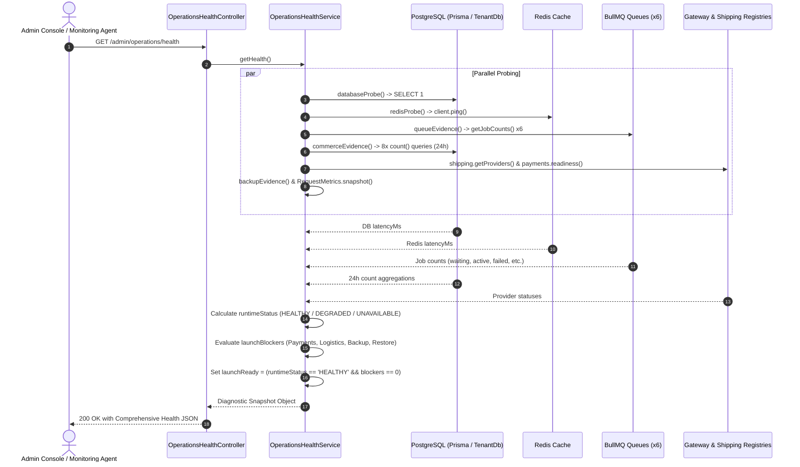
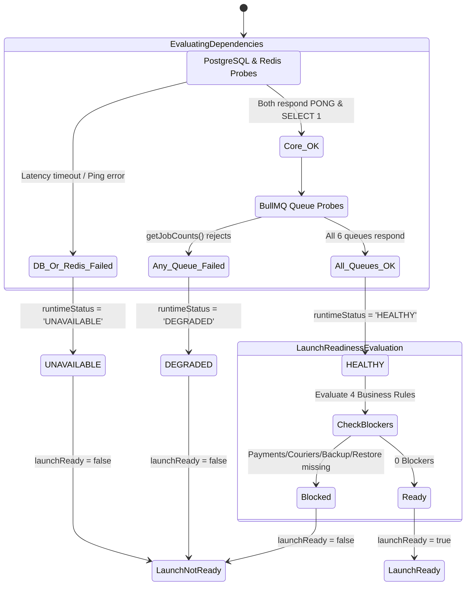

# Operations Health Feature Architecture & Invariants

## Purpose
The **Operations Health** module (`operations-health`) serves as the mission-control diagnostic engine and pre-flight validation gate for tenant e-commerce operations. It aggregates real-time health telemetry across core infrastructure (PostgreSQL database, Redis cache, BullMQ asynchronous job queues), operational commerce metrics (orders, payments, shipments, refunds, and reconciliation discrepancies over rolling 24-hour windows), payment gateway and logistics provider configurations, backup freshness, and Node.js process runtime statistics into an administrative assessment of store health and launch readiness.

---

## Component Architecture

```mermaid
flowchart TD
    subgraph Clients["Clients & Upstream"]
        AdminDashboard["Backoffice Admin UI / DevSecOps Console"]
        MonitoringPoller["Automated Health Poller / Monitoring Agent"]
    end

    subgraph Controller["OperationsHealthController (/admin/operations)"]
        HealthEP["GET /health<br/>AuthGuard + RolesGuard('admin')<br/>PermissionsGuard(RECONCILIATION_READ)<br/>TenantMembershipGuard"]
    end

    subgraph Service["OperationsHealthService"]
        Aggregator["getHealth() Diagnostic Orchestrator"]
        subgraph Probes["Diagnostic Probes & Collectors"]
            DBProbe["databaseProbe() (SELECT 1 & Latency)"]
            RedisProbe["redisProbe() (PING & Latency)"]
            QueueCollector["queueEvidence() (6 BullMQ Queues Job Counts)"]
            CommerceCollector["commerceEvidence() (24h Window Aggregations)"]
            ProviderCollector["Payment Gateway & Shipping Readiness Checks"]
            BackupCollector["backupEvidence() (Freshness & Restore Verification)"]
            ProcessCollector["Process & RequestMetrics Snapshot (p95, memory, uptime)"]
        end
        DecisionEngine["Launch Blocker Evaluation & Status Synthesizer"]
    end

    subgraph Infrastructure["Infrastructure & Services"]
        TenantDB["TenantDatabaseService / PostgreSQL"]
        RedisSvc["RedisService / Valkey / Redis"]
        BullQueues["BullMQ Queues (Email, Reconcile, Courier, Messages, Payment)"]
        PaymentReg["PaymentGatewayRegistry (SSLCommerz, bKash, etc.)"]
        ShipSvc["ShippingService (Pathao, Steadfast, RedX, etc.)"]
        Metrics["RequestMetrics & TenantMetrics (Prometheus/PromQL)"]
    end

    AdminDashboard -->|GET /admin/operations/health| HealthEP
    MonitoringPoller -->|GET /admin/operations/health| HealthEP
    HealthEP --> Aggregator

    Aggregator --> DBProbe
    Aggregator --> RedisProbe
    Aggregator --> QueueCollector
    Aggregator --> CommerceCollector
    Aggregator --> ProviderCollector
    Aggregator --> BackupCollector
    Aggregator --> ProcessCollector

    DBProbe --> TenantDB
    RedisProbe --> RedisSvc
    QueueCollector --> BullQueues
    CommerceCollector --> TenantDB
    ProviderCollector --> PaymentReg
    ProviderCollector --> ShipSvc
    BackupCollector --> Metrics
    ProcessCollector --> Metrics

    DBProbe & RedisProbe & QueueCollector & CommerceCollector & ProviderCollector & BackupCollector --> DecisionEngine
    DecisionEngine -->|Aggregated Health & Launch Readiness| HealthEP
```



---

## Component Source Map

| Component / File | Symbol / Role | Primary Responsibilities | Key Invariants Enforced |
| :--- | :--- | :--- | :--- |
| [`operations-health.module.ts`](file:///home/chillpc/MohammadSheakh/projects/26/e-commerce/e-com-nextjs/ferio-nest-prisma/src/features/operations-health/operations-health.module.ts) | [`OperationsHealthModule`](file:///home/chillpc/MohammadSheakh/projects/26/e-commerce/e-com-nextjs/ferio-nest-prisma/src/features/operations-health/operations-health.module.ts#L10-L21) | Feature module wiring controllers, dependencies, and BullMQ queues. | Injects `TenancyModule`, `PrismaModule`, `AuthModule`, `CommercePaymentsModule`, `ShippingModule`, and 6 distinct BullMQ queues. |
| [`operations-health.controller.ts`](file:///home/chillpc/MohammadSheakh/projects/26/e-commerce/e-com-nextjs/ferio-nest-prisma/src/features/operations-health/operations-health.controller.ts) | [`OperationsHealthController`](file:///home/chillpc/MohammadSheakh/projects/26/e-commerce/e-com-nextjs/ferio-nest-prisma/src/features/operations-health/operations-health.controller.ts#L14-L27) | Exposes administrative HTTP endpoint for tenant operational health checks. | Enforces strict admin gating: `AuthGuard`, `RolesGuard('admin')`, `PermissionsGuard(RECONCILIATION_READ)`, and `TenantMembershipGuard`. |
| [`operations-health.service.ts`](file:///home/chillpc/MohammadSheakh/projects/26/e-commerce/e-com-nextjs/ferio-nest-prisma/src/features/operations-health/operations-health.service.ts) | [`OperationsHealthService`](file:///home/chillpc/MohammadSheakh/projects/26/e-commerce/e-com-nextjs/ferio-nest-prisma/src/features/operations-health/operations-health.service.ts#L41-L308) | Core diagnostic engine coordinating parallel probes and synthesizing launch readiness. | Probes must fail gracefully without throwing uncaught exceptions; error details must never leak internal stack traces or database connection strings. |
| [`request-metrics.ts`](file:///home/chillpc/MohammadSheakh/projects/26/e-commerce/e-com-nextjs/ferio-nest-prisma/libs/common/src/utils/request-metrics.ts) | [`RequestMetrics`](file:///home/chillpc/MohammadSheakh/projects/26/e-commerce/e-com-nextjs/ferio-nest-prisma/libs/common/src/utils/request-metrics.ts#L20-L70) | In-memory circular buffer recording API request durations and calculating p95 latency. | Enforces maximum sample size of 1,000 requests; classifies HTTP status codes (2xx, 4xx, 5xx). |

---

## Responsibilities

### Owns
- **Infrastructure Health Probing**: Direct pinging and latency measurement for the primary PostgreSQL tenant database (`SELECT 1`) and Redis client (`client.ping()`).
- **Asynchronous Queue Monitoring**: Polling BullMQ queue depths (job counts for `waiting`, `active`, `completed`, `failed`, `delayed`) across 6 core queues:
  1. `QUEUE_NAMES.EMAIL` (Authentication & customer verification emails)
  2. `QUEUE_NAMES.RECONCILIATION` (Automated payment ledger reconciliation)
  3. `QUEUE_NAMES.COURIER_CALLBACK` (Async webhook callbacks from courier partners)
  4. `QUEUE_NAMES.COURIER_POLL` (Scheduled tracking polls for active parcels)
  5. `QUEUE_NAMES.TRANSACTIONAL_MESSAGE` (SMS and push notification dispatcher)
  6. `QUEUE_NAMES.PAYMENT_RECOVERY` (Unclaimed/hanging payment verification)
- **24-Hour Commerce Pulse Monitoring**: Rolling 24-hour aggregations of orders placed, orders delivered, paid orders, payment attempt failures, unknown payment statuses, shipments created, failed refunds, and unresolved high/critical reconciliation findings.
- **Provider Readiness Auditing**: Verifying whether at least one prepaid payment gateway and one active courier provider have valid runtime configurations.
- **Backup & Disaster Recovery Freshness Validation**: Calculating backup currency (must be $\le 25$ hours old) and restore exercise verification (must be $\le 180$ days old).
- **Launch Readiness Gate**: Synthesizing the final `launchReady: boolean` status and compiling human-readable `launchBlockers` preventing premature public store launch.

### Does Not Own
- **Platform Control-Plane Health**: System-wide tenant database allocations, central backup registries, and global support grants are owned by `PlatformOperationsHealthService` under `src/platform/services/platform-operations-health.service.ts`.
- **Liveness & Readiness K8s Probes**: Basic container health checks (`/healthz` or `/readyz`) are lightweight HTTP endpoints; this service is an authenticated, in-depth diagnostic tool for business and platform operations.
- **Repair Actions or Retries**: Does not automatically flush queues, trigger database backups, or retry failed payments; it acts strictly as an observational audit probe.

---

## Dependencies

### Consumes
- **[`PrismaService`](file:///home/chillpc/MohammadSheakh/projects/26/e-commerce/e-com-nextjs/ferio-nest-prisma/libs/database/src/prisma.service.ts)** / **[`TenantDbService`](file:///home/chillpc/MohammadSheakh/projects/26/e-commerce/e-com-nextjs/ferio-nest-prisma/src/tenancy/services/tenant-db.service.ts)**: Executes raw SQL heartbeat probes and counts rolling commerce entities.
- **[`RedisService`](file:///home/chillpc/MohammadSheakh/projects/26/e-commerce/e-com-nextjs/ferio-nest-prisma/libs/redis/src/redis.service.ts)**: Executes Redis connectivity ping tests.
- **`BullMQ` (`@nestjs/bullmq`)**: Inspects queue telemetry for background workers.
- **[`PaymentGatewayRegistry`](file:///home/chillpc/MohammadSheakh/projects/26/e-commerce/e-com-nextjs/ferio-nest-prisma/src/features/commerce-payments/gateways/payment-gateway.registry.ts)**: Retrieves configuration status of installed payment gateways.
- **[`ShippingService`](file:///home/chillpc/MohammadSheakh/projects/26/e-commerce/e-com-nextjs/ferio-nest-prisma/src/features/shipping/services/shipping.service.ts)**: Retrieves activation and API credential status for courier partners.
- **[`ConfigService`](file:///home/chillpc/MohammadSheakh/projects/26/e-commerce/e-com-nextjs/ferio-nest-prisma/node_modules/@nestjs/config)**: Inspects environment flags for backup schedules and object storage immutability.

### Emitters
- **[`TenantMetrics`](file:///home/chillpc/MohammadSheakh/projects/26/e-commerce/e-com-nextjs/ferio-nest-prisma/libs/common/src/utils/tenant-metrics.ts)**: Emits `backup_freshness_observed` counter labeled with `status` and `restoreStatus` on each health evaluation.

---

## Database Ownership

### Direct Writes / Mutates
- **None**: This feature is strictly **read-only** with respect to the application database. It never mutates records, alters tables, or creates audit logs.

### Reads / References
| Entity / Table | Read Operation | Purpose |
| :--- | :--- | :--- |
| Raw SQL | `SELECT 1` | Database connectivity heartbeat and latency measurement. |
| `Order` | `count({ createdAt >= 24h })`, `count({ status IN [DELIVERED, COMPLETED], updatedAt >= 24h })`, `count({ paymentStatus = 'PAID', updatedAt >= 24h })` | Evaluates recent order ingestion velocity, delivery throughput, and successful payment collection. |
| `CommercePaymentAttempt` | `count({ status = 'FAILED', createdAt >= 24h })`, `count({ status = 'UNKNOWN', createdAt >= 24h })` | Detects gateway disruptions, checkout drops, and hanging payment attempts. |
| `Shipment` | `count({ createdAt >= 24h })` | Evaluates fulfillment dispatch activity. |
| `CommerceRefund` | `count({ status = 'FAILED', createdAt >= 24h })` | Highlights broken refund webhooks or insufficient merchant gateway balances. |
| `ReconciliationFinding` | `count({ status IN [OPEN, ACKNOWLEDGED], severity IN [CRITICAL, HIGH] })` | Identifies active financial ledger mismatches or uncollected COD disbursements. |

---

## Important Invariants

### 1. Zero-Throw Degradation & Error Masking
- The health probe **must never throw an uncaught exception** or return HTTP 500 when external dependencies are down.
- If PostgreSQL fails, `database.available` is marked `false`, `runtimeStatus` transitions to `UNAVAILABLE`, and `detail: 'PostgreSQL probe failed'` is returned.
- If Redis fails, `redis.available` is marked `false` and queue inspections return `{ available: false, counts: null }`.
- **Sensitive Error Masking**: Internal error messages (e.g., credentials, hostnames, queue stack traces) are explicitly swallowed and replaced with generic failure markers to prevent information disclosure.

### 2. Runtime Status Transition Model
The overall `runtimeStatus` follows a strict deterministic priority:
1. **`UNAVAILABLE`**: If **either** the PostgreSQL database OR Redis cache is unreachable.
2. **`DEGRADED`**: If database and Redis are reachable, but **any** of the 6 BullMQ queues fails to return job counts.
3. **`HEALTHY`**: When database, Redis, and all 6 queues are operational.

### 3. Launch Readiness Gate & Blockers
A store is considered `launchReady: true` **if and only if** `runtimeStatus === 'HEALTHY'` **and** `launchBlockers.length === 0`.
The system dynamically appends blockers for any of the following four business criteria:
- **Prepaid Payments**: No prepaid gateway (e.g., SSLCommerz, bKash) is marked `configured: true`.
- **Courier Logistics**: No active courier provider has verified runtime credentials.
- **Backup Currency**: Database backup is disabled, unprotected, or last success was $> 25$ hours ago.
- **Disaster Recovery Proof**: No recorded restore-exercise verification within the last 180 days ($180 \times 24 \text{ hours}$).

### 4. Rolling 24-Hour Observation Window
Commerce statistics are bounded strictly by `since = new Date(Date.now() - 24 * 60 * 60 * 1000)`. If database read queries fail during count aggregation, the commerce block gracefully returns `{ available: false, windowHours: 24 }` without failing the overall probe.

---

## Public API & Entry Points

Mounted under `/admin/operations`:

| Method | Endpoint | Guards & Auth | Description | Inputs / Payload | Response Payload |
| :--- | :--- | :--- | :--- | :--- | :--- |
| `GET` | `/admin/operations/health` | `AuthGuard`, `RolesGuard('admin')`, `PermissionsGuard(RECONCILIATION_READ)`, `TenantMembershipGuard` | Gathers and returns complete system health snapshot, queue metrics, commerce pulse, and launch blockers. | None (Session context) | Comprehensive JSON diagnostic report (see schema below) |

### Sample Response Schema
```json
{
  "generatedAt": "2026-09-24T15:30:00.000Z",
  "runtimeStatus": "HEALTHY",
  "launchReady": true,
  "launchBlockers": [],
  "process": {
    "instanceId": "web-worker-7f4b8c9d-1",
    "uptimeSeconds": 86420,
    "memory": {
      "rssBytes": 142606336,
      "heapUsedBytes": 78234512
    }
  },
  "requests": {
    "observedSince": "2026-09-24T00:00:00.000Z",
    "total": 12450,
    "successful": 12100,
    "clientErrors": 340,
    "serverErrors": 10,
    "averageDurationMs": 42,
    "p95DurationMs": 115,
    "maxDurationMs": 850,
    "sampleSize": 1000
  },
  "dependencies": {
    "database": { "available": true, "latencyMs": 3 },
    "redis": { "available": true, "latencyMs": 1 },
    "pools": {
      "controlPlane": { "totalCount": 10, "idleCount": 8, "waitingCount": 0 },
      "tenant": { "activeTenants": 1, "pooledClients": 2 }
    }
  },
  "queues": [
    {
      "name": "Authentication email",
      "available": true,
      "counts": { "waiting": 0, "active": 0, "completed": 450, "failed": 1, "delayed": 0 }
    }
  ],
  "commerce": {
    "available": true,
    "windowHours": 24,
    "ordersPlaced": 182,
    "ordersDelivered": 145,
    "paidOrders": 178,
    "failedPaymentAttempts": 4,
    "unknownPaymentAttempts": 1,
    "shipmentsCreated": 160,
    "failedRefunds": 0,
    "openCriticalFindings": 0
  },
  "providers": {
    "payments": [{ "code": "SSLCOMMERZ", "name": "SSLCommerz", "configured": true }],
    "couriers": [{ "code": "PATHAO", "name": "Pathao", "active": true, "configured": true, "pollingConfigured": true }]
  },
  "backup": {
    "source": "DEPLOYMENT_ENVIRONMENT",
    "status": "CURRENT",
    "enabled": true,
    "protectedStorage": true,
    "lastSuccessAt": "2026-09-24T04:00:00.000Z",
    "restoreStatus": "VERIFIED",
    "lastRestoreVerifiedAt": "2026-08-15T10:00:00.000Z"
  }
}
```

---

## Important Flows

### 1. Health Probe & Launch Readiness Aggregation



### 2. Runtime Status & Launch Gate State Machine



---

## Brutal Honest Vulnerabilities & Architectural Debt

### 1. Connection Pool Starvation via 8 Sequential Database Counts
- **Issue**: [`commerceEvidence()`](file:///home/chillpc/MohammadSheakh/projects/26/e-commerce/e-com-nextjs/ferio-nest-prisma/src/features/operations-health/operations-health.service.ts#L205-L261) executes eight independent `db.*.count()` queries within a single `Promise.all`:
  ```typescript
  const [ordersPlaced, ordersDelivered, paidOrders, failedPaymentAttempts, unknownPaymentAttempts, shipmentsCreated, failedRefunds, openCriticalFindings] = await Promise.all([...]);
  ```
- **Consequence**: Under default Prisma connection pool settings (often 5 to 10 connections per process), firing 8 simultaneous count queries that scan indexed time ranges (`createdAt >= since`) momentarily ties up the entire connection pool for that application instance. If multiple admins open the operations dashboard simultaneously or automated synthetic monitors poll every 10 seconds, transactional requests (such as checkout and payment webhooks) experience database connection acquisition timeouts (`Timed out fetching a connection from the pool`).
- **Remediation**:
  - Consolidate the 8 count queries into a single raw SQL query using conditional aggregation:
    ```sql
    SELECT 
      COUNT(*) FILTER (WHERE created_at >= NOW() - INTERVAL '24 hours') AS orders_placed,
      COUNT(*) FILTER (WHERE payment_status = 'PAID' AND updated_at >= NOW() - INTERVAL '24 hours') AS paid_orders
    FROM "Order";
    ```
  - Cache the commerce evidence summary in Redis for 60 seconds.

### 2. Lack of Rate Limiting on Heavy Admin Diagnostic Endpoint
- **Issue**: While `/admin/operations/health` requires `PERMISSIONS.RECONCILIATION_READ`, it **does not declare a rate-limiting guard** (`SlidingWindowRateLimitGuard`).
- **Consequence**: A rogue admin script, aggressive monitoring cron, or compromised admin bearer token can spam `GET /admin/operations/health` hundreds of times per second. This turns the health check into an internal Denial-of-Service vector against PostgreSQL and Redis.
- **Remediation**: Apply a dedicated rate limiter (e.g., maximum 12 requests per minute per IP/admin) to `/admin/operations/health`.

### 3. Backup & Restore Evidence Relies on Trust in Environment Variables
- **Issue**: [`backupEvidence()`](file:///home/chillpc/MohammadSheakh/projects/26/e-commerce/e-com-nextjs/ferio-nest-prisma/src/features/operations-health/operations-health.service.ts#L263-L301) does not query S3, GCS, or PostgreSQL physical WAL archives directly. Instead, it inspects static environment variables: `DATABASE_BACKUP_LAST_SUCCESS_AT` and `DATABASE_RESTORE_LAST_VERIFIED_AT`.
- **Consequence**: If a CI/CD pipeline or deployment manifest has stale, hardcoded timestamps, the application will falsely report `status: 'CURRENT'` and `launchReady: true` even if active automated database backups have completely ceased running in production.
- **Remediation**: In multi-tenant environments, verify backup status against an immutable object storage metadata manifest or a centralized control-plane backup ledger service (`BackupEvidenceService`).

### 4. Fragmented Single-Pod View of `RequestMetrics`
- **Issue**: [`RequestMetrics`](file:///home/chillpc/MohammadSheakh/projects/26/e-commerce/e-com-nextjs/ferio-nest-prisma/libs/common/src/utils/request-metrics.ts#L20-L57) maintains an in-memory array (`durations: number[]`) capped at 1,000 samples stored in the local Node.js process heap.
- **Consequence**: In a multi-replica container deployment (e.g., 5 Kubernetes pods behind an Ingress), the health endpoint only reports the latency p95 and error rates of the *specific pod that handled that HTTP request*. An administrator refreshing the page will see fluctuating latency and error statistics jumping between pods.
- **Remediation**: In multi-instance deployments, rely on Prometheus / OpenTelemetry collectors scraping standardized metric endpoints rather than process-local in-memory buffers for production SLO evaluation.

### 5. Potential Unbounded Hanging on Provider Network Calls
- **Issue**: [`getHealth()`](file:///home/chillpc/MohammadSheakh/projects/26/e-commerce/e-com-nextjs/ferio-nest-prisma/src/features/operations-health/operations-health.service.ts#L78-L152) calls `this.shipping.getProviders()`. If this method makes external HTTP requests to courier APIs to verify token validity without strict 2-second timeout limits, a slow or down courier partner will freeze the entire health check response.
- **Remediation**: Enforce an explicit `Promise.race` timeout (e.g., 2,500ms) on external provider readiness inspections.
