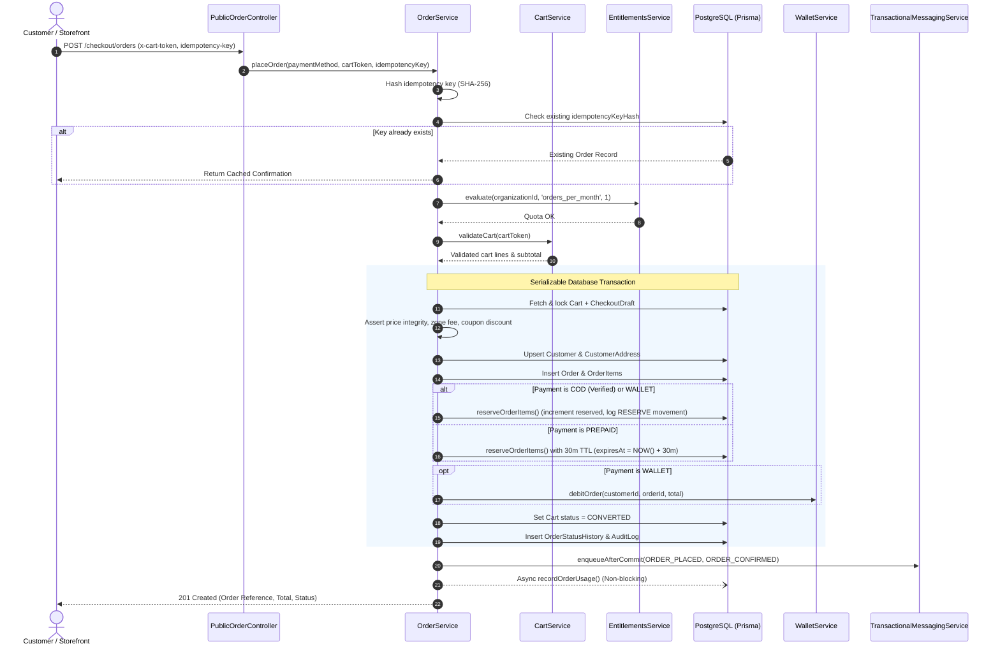
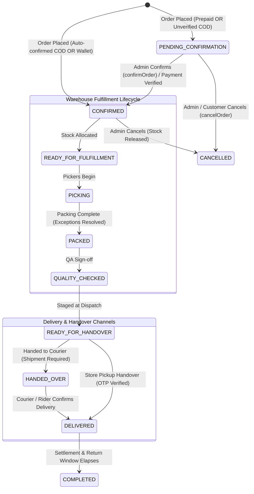
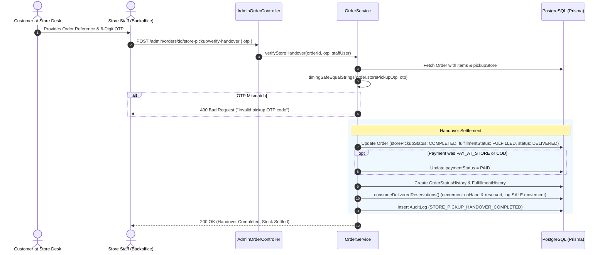

# Order Feature Architecture & Invariants

## Purpose
The **Order** module (`order`) is the central transactional engine of the commerce platform. It converts validated checkout drafts and shopping carts into authoritative orders, orchestrates inventory reservations across distributed warehouses, coordinates multi-channel fulfillment (home delivery via couriers, in-house riders, and in-store click-and-collect pickup with OTP verification), enforces Cash-on-Delivery (COD) risk policies, manages wallet settlement, and constructs operational unified audit timelines across payments, shipments, returns, and customer communications.

---

## Component Architecture

```mermaid
flowchart TD
    subgraph Clients["Clients & Gateways"]
        Storefront["Public Storefront / Checkout SPA"]
        AdminDashboard["Backoffice Admin Dashboard"]
        TrackingClient["Public Tracking Client / Customer Portal"]
    end

    subgraph Controllers["Order Controllers"]
        PublicOrderCtrl["PublicOrderController (/checkout/orders)<br/>POST / (COD/PREPAID/STORE), POST /wallet"]
        PublicTrackingCtrl["PublicOrderTrackingController (/orders)<br/>POST /track, PATCH /:id/store-pickup/schedule"]
        AdminOrderCtrl["AdminOrderController (/admin/orders)<br/>List, View, Confirm, Cancel, Fulfillment, Pickup, Exceptions, COD Policy"]
    end

    subgraph Service["OrderService Core Engine"]
        PlaceEngine["placeOrder() (Cart & Draft Verification, Entitlements)"]
        ReservationEngine["reserveOrderItems() & releaseReservations() & consumeDeliveredReservations()"]
        FulfillmentEngine["updateFulfillment() (Strict Sequential State Machine)"]
        PickupEngine["verifyStoreHandover() (6-Digit OTP & Safe String Compare)"]
        TimelineEngine["buildOrderOperationalTimeline() (Unified 7-Stream Ledger)"]
        PolicyEngine["CodVerificationPolicy (ALWAYS, ABOVE_AMOUNT, NEVER)"]
    end

    subgraph ExternalModules["Platform Subsystems & Dependencies"]
        CartMod["CartService (Cart Validation & Pricing Check)"]
        WalletMod["WalletService (debitOrder & refundCancelledOrder)"]
        AuditMod["AuditService (Synchronous Transactional Audit Logs)"]
        MsgMod["TransactionalMessagingService (enqueueAfterCommit)"]
        NotifMod["CustomerNotificationsService (notifyCustomer)"]
        EntitlementsMod["EntitlementsService & UsageService (MT-10 Plan Quotas)"]
        TenantDB["TenantDatabaseService (Multi-tenant DB Context)"]
    end

    subgraph Database["PostgreSQL (Prisma ORM)"]
        OrderTable[("Order / OrderItem / OrderAddress")]
        HistoryTables[("OrderStatusHistory / FulfillmentHistory / FulfillmentException")]
        InventoryTables[("InventoryStock / InventoryReservation / InventoryMovement")]
        PolicyTable[("CodVerificationPolicy / CommerceSettings")]
        RelatedTables[("Shipment / CommercePaymentAttempt / ReturnCase / CommerceRefund / CommerceMessage")]
    end

    Storefront -->|Checkout Token & Idempotency Key| PublicOrderCtrl
    TrackingClient -->|Reference & Phone| PublicTrackingCtrl
    AdminDashboard -->|Manage / Fulfill / Exceptions| AdminOrderCtrl

    PublicOrderCtrl --> PlaceEngine
    PublicTrackingCtrl --> TrackingClient
    PublicTrackingCtrl --> PickupEngine
    AdminOrderCtrl --> FulfillmentEngine
    AdminOrderCtrl --> PickupEngine
    AdminOrderCtrl --> TimelineEngine
    AdminOrderCtrl --> PolicyEngine

    PlaceEngine --> CartMod
    PlaceEngine --> WalletMod
    PlaceEngine --> EntitlementsMod
    PlaceEngine --> ReservationEngine

    Service --> TenantDB
    Service --> AuditMod
    Service --> MsgMod
    Service --> NotifMod

    ReservationEngine --> InventoryTables
    PlaceEngine --> OrderTable
    PlaceEngine --> HistoryTables
    PlaceEngine --> PolicyTable
    FulfillmentEngine --> OrderTable
    FulfillmentEngine --> HistoryTables
    TimelineEngine --> RelatedTables
```



---

## Component Source Map

| Component / File | Symbol / Role | Primary Responsibilities | Key Invariants Enforced |
| :--- | :--- | :--- | :--- |
| [`order.module.ts`](file:///home/chillpc/MohammadSheakh/projects/26/e-commerce/e-com-nextjs/ferio-nest-prisma/src/features/order/order.module.ts) | [`OrderModule`](file:///home/chillpc/MohammadSheakh/projects/26/e-commerce/e-com-nextjs/ferio-nest-prisma/src/features/order/order.module.ts#L17-L36) | Module definition exporting [`OrderService`](file:///home/chillpc/MohammadSheakh/projects/26/e-commerce/e-com-nextjs/ferio-nest-prisma/src/features/order/order.service.ts#L82-L1897) and registering three controllers. | Imports `TenancyModule`, `PrismaModule`, `AuthModule`, `CartModule`, `TransactionalMessagingModule`, `AuditModule`, `CustomerNotificationsModule`, and `WalletModule`. |
| [`order.controller.ts`](file:///home/chillpc/MohammadSheakh/projects/26/e-commerce/e-com-nextjs/ferio-nest-prisma/src/features/order/order.controller.ts) | [`PublicOrderController`](file:///home/chillpc/MohammadSheakh/projects/26/e-commerce/e-com-nextjs/ferio-nest-prisma/src/features/order/order.controller.ts#L44-L80) | Public checkout placement endpoints for standard and wallet payments. | Requires `x-cart-token` and `idempotency-key` headers; requires `AuthGuard` for wallet checkouts. |
| [`order.controller.ts`](file:///home/chillpc/MohammadSheakh/projects/26/e-commerce/e-com-nextjs/ferio-nest-prisma/src/features/order/order.controller.ts) | [`PublicOrderTrackingController`](file:///home/chillpc/MohammadSheakh/projects/26/e-commerce/e-com-nextjs/ferio-nest-prisma/src/features/order/order.controller.ts#L83-L111) | Public order status lookup and store pickup schedule modification. | Enforces `SlidingWindowRateLimitGuard(GLOBAL_RATE_LIMITS.user)` on public tracking and scheduling. |
| [`order.controller.ts`](file:///home/chillpc/MohammadSheakh/projects/26/e-commerce/e-com-nextjs/ferio-nest-prisma/src/features/order/order.controller.ts) | [`AdminOrderController`](file:///home/chillpc/MohammadSheakh/projects/26/e-commerce/e-com-nextjs/ferio-nest-prisma/src/features/order/order.controller.ts#L114-L225) | Administrative order management, manual confirmation, cancellation, fulfillment stage transitions, and exception resolution. | Enforces `AuthGuard`, `RolesGuard('admin')`, `TenantMembershipGuard`, and granular permissions (`ORDERS_READ`, `ORDERS_MANAGE`, `ORDER_POLICY_MANAGE`). |
| [`order.service.ts`](file:///home/chillpc/MohammadSheakh/projects/26/e-commerce/e-com-nextjs/ferio-nest-prisma/src/features/order/order.service.ts) | [`OrderService`](file:///home/chillpc/MohammadSheakh/projects/26/e-commerce/e-com-nextjs/ferio-nest-prisma/src/features/order/order.service.ts#L82-L1897) | Core domain orchestrator handling order creation, inventory reservation, state transitions, OTP verification, and history serialization. | Enforces `Serializable` transactions, SHA-256 idempotency locks, tenant entitlement caps, stock consistency decrements, and timing-safe comparisons. |
| [`order.dto.ts`](file:///home/chillpc/MohammadSheakh/projects/26/e-commerce/e-com-nextjs/ferio-nest-prisma/src/features/order/dto/order.dto.ts) | DTO Validation Contracts | Class-validator transfer objects for placing, searching, canceling, confirming, fulfilling, and tracking orders. | Enforces status enums, 6-digit OTP format, string lengths, and conditional validation (`ABOVE_AMOUNT`). |
| [`order.util.ts`](file:///home/chillpc/MohammadSheakh/projects/26/e-commerce/e-com-nextjs/ferio-nest-prisma/src/features/order/utils/order.util.ts) | Domain Helpers | Utility functions for status labels, sequence maps, and COD verification policy evaluation. | Defines strict linear progression for warehouse fulfillment stages (`fulfillmentSequence`). |
| [`order-timeline.util.ts`](file:///home/chillpc/MohammadSheakh/projects/26/e-commerce/e-com-nextjs/ferio-nest-prisma/src/features/order/utils/order-timeline.util.ts) | [`buildOrderOperationalTimeline`](file:///home/chillpc/MohammadSheakh/projects/26/e-commerce/e-com-nextjs/ferio-nest-prisma/src/features/order/utils/order-timeline.util.ts#L107-L247) | Aggregates 7 independent event streams into a single reverse-chronological operational ledger. | Normalizes order status, fulfillment, shipments, courier events, payments, returns, refunds, and messaging logs. |

---

## Responsibilities

### Owns
- **Order Placement & Cart Conversion**: Converting active cart lines and checkout drafts into persistent `Order` records, validating delivery zones, pricing totals, and coupon applications.
- **Idempotency Lock Enforcement**: SHA-256 hashing of client-supplied `idempotency-key` values (`idempotencyKeyHash`) with database unique constraints to prevent double-charging or duplicate order creation.
- **Inventory Reservation Orchestration**: Allocating warehouse stock (`inventoryReservation` + `inventoryStock.reserved` increment) upon order placement or administrative confirmation, releasing reservations on cancellation or prepaid expiration, and consuming them upon delivery or handover.
- **COD Verification Policy**: Dynamic policy enforcement (`ALWAYS`, `ABOVE_AMOUNT`, `NEVER`) determining whether cash-on-delivery orders auto-confirm or enter `PENDING_CONFIRMATION`.
- **Fulfillment Pipeline Lifecycle**: Strict sequential phase transitions: `UNFULFILLED` $\rightarrow$ `READY_FOR_FULFILLMENT` $\rightarrow$ `PICKING` $\rightarrow$ `PACKED` $\rightarrow$ `QUALITY_CHECKED` $\rightarrow$ `READY_FOR_HANDOVER` $\rightarrow$ `HANDED_OVER`.
- **Fulfillment Exceptions Management**: Capturing shortage, substitution, or condition discrepancies during picking, blocking downstream packing until explicitly resolved by warehouse staff.
- **Store Pickup (Click-and-Collect) Handover**: Managing customer pickup scheduling, in-store readiness tracking, generating 6-digit random OTP codes, and verifying them at store counters with constant-time equality checks.
- **Customer Order Tracking**: Authenticating public status queries using order reference and Bangladeshi phone number matching without exposing sensitive credentials.
- **Operational Timeline Synthesis**: Consolidating events across orders, couriers, payments, returns, refunds, and SMS into a single audit trail.

### Does Not Own
- **Payment Processing Execution**: Payment gateway redirects, webhook handling, and refund execution are owned by `CommercePaymentsModule`.
- **Third-Party Logistics (3PL) Booking**: Waybill generation, consignment booking, and tracking webhooks are owned by `ShippingModule`.
- **In-House Rider Dispatch**: Rider mobile app GPS tracking and parcel assignments are owned by `DeliveryPersonnelModule`.
- **Cart Line Storage**: Active cart persistence and line-item mutations are owned by `CartModule`.
- **Customer User Profiles**: Master user credentials and profile management are owned by `AuthenticationModule` and `UserManagementModule`.

---

## Dependencies

### Consumes
- **[`TenantDatabaseService`](file:///home/chillpc/MohammadSheakh/projects/26/e-commerce/e-com-nextjs/ferio-nest-prisma/src/tenancy/services/tenant-db.service.ts)**: Dynamic database resolution supporting multi-tenant isolation.
- **[`CartService`](file:///home/chillpc/MohammadSheakh/projects/26/e-commerce/e-com-nextjs/ferio-nest-prisma/src/features/cart/cart.service.ts)**: Validates line items, unit prices, product availability, and COD eligibility.
- **[`WalletService`](file:///home/chillpc/MohammadSheakh/projects/26/e-commerce/e-com-nextjs/ferio-nest-prisma/src/features/wallet/wallet.service.ts)**: Executes atomic debits on order placement and refunds on cancellation.
- **[`EntitlementsService`](file:///home/chillpc/MohammadSheakh/projects/26/e-commerce/e-com-nextjs/ferio-nest-prisma/src/platform/services/entitlements.service.ts)** & **[`UsageService`](file:///home/chillpc/MohammadSheakh/projects/26/e-commerce/e-com-nextjs/ferio-nest-prisma/src/platform/services/usage.service.ts)**: Validates plan quotas (`orders_per_month`) and asynchronously increments billing usage.
- **[`AuditService`](file:///home/chillpc/MohammadSheakh/projects/26/e-commerce/e-com-nextjs/ferio-nest-prisma/src/features/audit/services/audit.service.ts)**: Writes structured audit log entries for all order lifecycle mutations.
- **[`TransactionalMessagingService`](file:///home/chillpc/MohammadSheakh/projects/26/e-commerce/e-com-nextjs/ferio-nest-prisma/src/features/transactional-messaging/services/transactional-messaging.service.ts)**: Enqueues SMS / email notifications post-commit.
- **[`CustomerNotificationsService`](file:///home/chillpc/MohammadSheakh/projects/26/e-commerce/e-com-nextjs/ferio-nest-prisma/src/features/customer-notifications/customer-notifications.service.ts)**: Emits in-app inbox alerts.

---

## Database Ownership

### Direct Writes / Mutates
| Entity | Nature of Mutation | Context / Trigger |
| :--- | :--- | :--- |
| `Order` | Insert, Update | Created during checkout placement; updated on confirmation, cancellation, fulfillment stage changes, store pickup scheduling, and handover. |
| `OrderItem` | Insert | Created with snapshots of product names, SKUs, condition notes, and unit prices upon order creation. |
| `OrderAddress` | Insert | Created upon order placement capturing the delivery snapshot. |
| `OrderStatusHistory` | Insert | Inserted on status updates (`CONFIRMED`, `CANCELLED`, `DELIVERED`). |
| `FulfillmentHistory` | Insert | Inserted on fulfillment status transitions (`PICKING`, `PACKED`, `HANDED_OVER`, `FULFILLED`). |
| `FulfillmentException` | Insert, Update | Created during picking phase discrepancies; updated upon resolution. |
| `InventoryStock` | Update | Increments `reserved` during allocation; decrements `reserved` during release; decrements both `reserved` and `onHand` upon fulfillment/delivery. |
| `InventoryReservation` | Insert, Update | Created with status `ACTIVE` and optional `expiresAt`; updated to `RELEASED` or `CONSUMED`. |
| `InventoryMovement` | Insert | Movements logged: `RESERVE` (allocation), `RELEASE` (cancellation/expiry), `SALE` (handover/delivery). |
| `Customer` | Upsert, Update | Resolves or creates customer profiles; updates contact info from checkout drafts. |
| `CustomerAddress` | Insert | Inserts new default or additional customer addresses if not previously recorded. |
| `Cart` | Update | Sets status to `CONVERTED` upon successful order creation. |
| `CodVerificationPolicy` | Upsert, Update | Created or updated by admin to configure COD threshold rules. |
| `AuditLog` | Insert | Emitted on order placement, confirmation, cancellation, fulfillment changes, exceptions, and handovers. |

### Reads / References
| Entity | Read Purpose |
| :--- | :--- |
| `CommerceSettings` | Reads `orderPrefix`, `currency`, and `codEnabled` / `prepaidEnabled` flags. |
| `Shipment` & `ShipmentEvent` | Reads tracking numbers, provider metadata, and courier events for operational timelines and public tracking. |
| `CommercePaymentAttempt` & `PaymentCallback` | Reads payment attempts, amounts, currencies, and callback logs for timeline synthesis. |
| `ReturnCase` & `CommerceRefund` | Reads return and refund histories for admin timeline rendering. |
| `CommerceMessage` | Reads outbox notifications for timeline rendering. |
| `Warehouse` | Validates click-and-collect pickup store locations. |

---

## Important Invariants

### 1. Concurrency & Idempotency Guarantee
- Every order placement requires an `idempotency-key` header (16 to 200 characters).
- The key is converted to a SHA-256 hash (`idempotencyKeyHash`) and stored with a database unique index.
- If a duplicate key is submitted, the transaction catches Prisma unique constraint violations (`P2002`) or serialization errors (`P2034`) and returns the previously committed order without creating duplicate records or reserving extra stock.
- Placement, confirmation, cancellation, and fulfillment transitions execute under `Prisma.TransactionIsolationLevel.Serializable`.

### 2. Multi-Tenant Entitlement & Subscription Checks
- **Suspended Tenants**: If `tenantContext.subscriptionStatus === 'SUSPENDED'`, checkout is strictly blocked with `ForbiddenException('CHECKOUT_DISABLED_SUSPENDED')`.
- **Plan Quotas**: Orders evaluate `entitlements.evaluate(organizationId, 'orders_per_month', { requestedCount: 1 })`. If exceeded, `ForbiddenException('PLAN_LIMIT_REACHED')` is thrown.
- **Metering Resiliency**: SaaS usage metering (`usage.increment('orders_per_month', 1)`) is executed asynchronously post-commit and will never fail an order.

### 3. Stock Reservation Invariants
- **Available Stock Calculation**: Available stock for variant $V$ across warehouses is strictly defined as:
  $$\text{Available} = \sum \max(0, \text{onHand} - \text{reserved} - \text{damaged})$$
- If $\text{Available} < \text{Requested}$, order placement or confirmation fails with `ConflictException`.
- **Prepaid Orders**: Stock reservations for prepaid orders are granted a temporary TTL of 30 minutes (`expiresAt = NOW() + 30m`). If unverified within 30 minutes, reservations are released.
- **Double Decrement on Delivery**: Completing delivery (or store handover) decrements both `reserved` and `onHand` simultaneously, marking reservations `CONSUMED` and logging a `SALE` inventory movement.

### 4. Fulfillment Pipeline State Machine
Fulfillment status transitions are strictly linear and immutable:
$$\text{READY\_FOR\_FULFILLMENT} \rightarrow \text{PICKING} \rightarrow \text{PACKED} \rightarrow \text{QUALITY\_CHECKED} \rightarrow \text{READY\_FOR\_HANDOVER} \rightarrow \text{HANDED\_OVER}$$
- An order **must be in status `CONFIRMED`** before entering fulfillment.
- Moving from `PICKING` to `PACKED` is blocked if any open `FulfillmentException` exists.
- Moving to `HANDED_OVER` is blocked if no associated `Shipment` record exists.

### 5. Click-and-Collect Store Handover Security
- Store pickup orders generate a 6-digit cryptographically random numeric OTP (`storePickupOtp`) upon checkout.
- Customer scheduling endpoints return sanitized representations that **never disclose the OTP code**.
- Store desk verification uses timing-safe string comparison (`timingSafeEqual`) to prevent timing side-channel attacks during OTP entry.
- Handover atomically sets:
  - `storePickupStatus: 'COMPLETED'`
  - `fulfillmentStatus: 'FULFILLED'`
  - `status: 'DELIVERED'`
  - `paymentStatus: 'PAID'` (if payment method was `PAY_AT_STORE` or `COD`)

### 6. Public Tracking Protection
- Public tracking queries require both the order reference (e.g., `FER-260924-A1B2C3`) and the recipient's phone number.
- The normalized phone is matched using `crypto.timingSafeEqual` against the order's recorded `phoneNormalized` to prevent automated enumeration or scraping of customer orders.

---

## Public API & Entry Points

### Public Endpoints

| Method | Endpoint | Guards & Auth | Description | Inputs / Payload | Response |
| :--- | :--- | :--- | :--- | :--- | :--- |
| `POST` | `/checkout/orders` | None (Public) | Converts checkout draft into an order. | Headers: `x-cart-token`, `idempotency-key`<br/>Body: [`PlaceOrderDto`](file:///home/chillpc/MohammadSheakh/projects/26/e-commerce/e-com-nextjs/ferio-nest-prisma/src/features/order/dto/order.dto.ts#L46-L49) | Order confirmation summary |
| `POST` | `/checkout/orders/wallet` | `AuthGuard` | Converts checkout draft and debits logged-in user's wallet. | Headers: `x-cart-token`, `idempotency-key`<br/>Session: `UserPayload` | Order confirmation summary |
| `POST` | `/orders/track` | `SlidingWindowRateLimitGuard` | Tracks order status and delivery timeline using phone verification. | Body: [`TrackOrderDto`](file:///home/chillpc/MohammadSheakh/projects/26/e-commerce/e-com-nextjs/ferio-nest-prisma/src/features/order/dto/order.dto.ts#L154-L164) | Public order summary & timeline |
| `PATCH` | `/orders/:id/store-pickup/schedule` | `AuthGuard`, `SlidingWindowRateLimitGuard` | Customer schedules pickup date, slot, and special notes. | Param: `id`<br/>Body: [`ScheduleStorePickupDto`](file:///home/chillpc/MohammadSheakh/projects/26/e-commerce/e-com-nextjs/ferio-nest-prisma/src/features/order/dto/order.dto.ts#L166-L181) | Sanitized pickup schedule |

### Administrative Endpoints (`/admin/orders`)

All admin routes require `AuthGuard`, `RolesGuard('admin')`, `TenantMembershipGuard`, and specific permissions.

| Method | Endpoint | Permissions Required | Description | Inputs / Payload | Response |
| :--- | :--- | :--- | :--- | :--- | :--- |
| `GET` | `/admin/orders` | `ORDERS_READ` | Paginated search across orders, references, tracking numbers, customers. | Query: [`OrderQueryDto`](file:///home/chillpc/MohammadSheakh/projects/26/e-commerce/e-com-nextjs/ferio-nest-prisma/src/features/order/dto/order.dto.ts#L51-L89) | Paginated list + meta |
| `GET` | `/admin/orders/cod-policy` | `ORDERS_READ` | Retrieves active COD verification threshold rules. | None | `CodVerificationPolicy` |
| `PATCH` | `/admin/orders/cod-policy` | `ORDER_POLICY_MANAGE` | Updates COD policy (`ALWAYS`, `ABOVE_AMOUNT`, `NEVER`). | Body: [`UpdateCodPolicyDto`](file:///home/chillpc/MohammadSheakh/projects/26/e-commerce/e-com-nextjs/ferio-nest-prisma/src/features/order/dto/order.dto.ts#L105-L114) | Updated policy |
| `GET` | `/admin/orders/:id` | `ORDERS_READ` | Fetches comprehensive order details and unified operational timeline. | Param: `id` | Detailed order + 7-stream timeline |
| `POST` | `/admin/orders/:id/confirm` | `ORDERS_MANAGE` | Manually confirms a COD order in `PENDING_CONFIRMATION` and allocates stock. | Param: `id`<br/>Body: [`ConfirmOrderDto`](file:///home/chillpc/MohammadSheakh/projects/26/e-commerce/e-com-nextjs/ferio-nest-prisma/src/features/order/dto/order.dto.ts#L98-L103) | Updated order |
| `POST` | `/admin/orders/:id/cancel` | `ORDERS_MANAGE` | Cancels order, releases stock reservations, and initiates wallet refund if applicable. | Param: `id`<br/>Body: [`CancelOrderDto`](file:///home/chillpc/MohammadSheakh/projects/26/e-commerce/e-com-nextjs/ferio-nest-prisma/src/features/order/dto/order.dto.ts#L91-L96) | Cancelled order |
| `POST` | `/admin/orders/:id/fulfillment` | `ORDERS_MANAGE` | Advances fulfillment phase to next sequential status. | Param: `id`<br/>Body: [`UpdateFulfillmentDto`](file:///home/chillpc/MohammadSheakh/projects/26/e-commerce/e-com-nextjs/ferio-nest-prisma/src/features/order/dto/order.dto.ts#L116-L124) | Detailed order |
| `PATCH` | `/admin/orders/:id/store-pickup/status` | `ORDERS_MANAGE` | Updates store pickup inventory transit status (`READY_FOR_PICKUP`, etc.). | Param: `id`<br/>Body: [`UpdateStorePickupStatusDto`](file:///home/chillpc/MohammadSheakh/projects/26/e-commerce/e-com-nextjs/ferio-nest-prisma/src/features/order/dto/order.dto.ts#L182-L196) | Updated order |
| `POST` | `/admin/orders/:id/store-pickup/verify-handover` | `ORDERS_MANAGE` | Verifies customer 6-digit OTP code at store desk and completes handover. | Param: `id`<br/>Body: [`VerifyStoreHandoverDto`](file:///home/chillpc/MohammadSheakh/projects/26/e-commerce/e-com-nextjs/ferio-nest-prisma/src/features/order/dto/order.dto.ts#L198-L203) | Completed order |
| `POST` | `/admin/orders/:id/fulfillment-exceptions` | `ORDERS_MANAGE` | Records picking exception (shortage, damage, substitution). | Param: `id`<br/>Body: [`CreateFulfillmentExceptionDto`](file:///home/chillpc/MohammadSheakh/projects/26/e-commerce/e-com-nextjs/ferio-nest-prisma/src/features/order/dto/order.dto.ts#L126-L145) | Detailed order |
| `POST` | `/admin/orders/:id/fulfillment-exceptions/:exceptionId/resolve` | `ORDERS_MANAGE` | Resolves an open fulfillment exception. | Params: `id`, `exceptionId`<br/>Body: [`ResolveFulfillmentExceptionDto`](file:///home/chillpc/MohammadSheakh/projects/26/e-commerce/e-com-nextjs/ferio-nest-prisma/src/features/order/dto/order.dto.ts#L147-L152) | Detailed order |

---

## Important Flows

### 1. Order Placement & Stock Reservation Lifecycle



### 2. Multi-Status State Machine Transitions



### 3. Store Pickup (Click-and-Collect) Handover & OTP Verification



---

## Brutal Honest Vulnerabilities & Architectural Debt

### 1. Serializable Transaction Isolation Contention (`P2034`)
- **Issue**: [`placeOrder()`](file:///home/chillpc/MohammadSheakh/projects/26/e-commerce/e-com-nextjs/ferio-nest-prisma/src/features/order/order.service.ts#L756-L1027), [`confirmOrder()`](file:///home/chillpc/MohammadSheakh/projects/26/e-commerce/e-com-nextjs/ferio-nest-prisma/src/features/order/order.service.ts#L1269-L1338), and [`cancelOrder()`](file:///home/chillpc/MohammadSheakh/projects/26/e-commerce/e-com-nextjs/ferio-nest-prisma/src/features/order/order.service.ts#L1356-L1442) run inside transactions configured with `isolationLevel: Prisma.TransactionIsolationLevel.Serializable`.
- **Consequence**: Under concurrent checkouts targeting the same fast-moving SKU during flash sales or promotional launches, PostgreSQL serialization conflicts (`P2034`) are frequently thrown. While the service catches `P2034` to check for idempotent replays, it immediately rejects other users with `ConflictException('Stock changed; retry the order safely')` rather than executing an exponential backoff retry loop.
- **Remediation**: Implement a bounded automatic transaction retry mechanism with jitter for `P2034` errors before rejecting the request.

### 2. Static JSON Environment Coupon Parsing
- **Issue**: Line 796 invokes:
  ```typescript
  const coupon = calculateCouponDiscount(
    this.config.get<string>('CHECKOUT_COUPONS_JSON'),
    draft.couponCode ?? undefined,
    validatedCart.subtotal,
  );
  ```
- **Consequence**: Coupons are parsed from an unindexed process environment variable string (`CHECKOUT_COUPONS_JSON`) rather than tenant-scoped database models. In a multi-tenant deployment, all tenants sharing the process instance share the same hardcoded coupon definitions, and coupons cannot have individual per-customer redemption limits or dynamic database-backed expiration dates.
- **Remediation**: Migrate coupons to a first-class tenant-isolated `Coupon` and `CouponUsage` database table with relational foreign keys on orders.

### 3. In-Memory Assembly of Unified Operational Timeline
- **Issue**: [`getOrder()`](file:///home/chillpc/MohammadSheakh/projects/26/e-commerce/e-com-nextjs/ferio-nest-prisma/src/features/order/order.service.ts#L1143-L1264) queries seven separate tables (`Shipment`, `ShipmentEvent`, `CommercePaymentAttempt`, `PaymentCallback`, `ReturnCase`, `CommerceRefund`, and `CommerceMessage`) and passes them to [`buildOrderOperationalTimeline()`](file:///home/chillpc/MohammadSheakh/projects/26/e-commerce/e-com-nextjs/ferio-nest-prisma/src/features/order/utils/order-timeline.util.ts#L107-L247), which merges and sorts them in the Node.js process heap.
- **Consequence**: For long-lived dispute orders or return-heavy transactions with dozens of courier webhooks and SMS dispatch logs, heap allocations spike, response payloads exceed several megabytes, and serialization latency degrades the admin dashboard.
- **Remediation**: Introduce cursor-based pagination for the operational timeline or maintain a denormalized `OrderActivityFeed` projection updated via asynchronous domain events.

### 4. Unbounded `CustomerAddress` Ingestion
- **Issue**: [`resolveCustomer()`](file:///home/chillpc/MohammadSheakh/projects/26/e-commerce/e-com-nextjs/ferio-nest-prisma/src/features/order/order.service.ts#L352-L380) creates a new `CustomerAddress` entry whenever a case-insensitive match on `district`, `area`, and `detailedAddress` is not found.
- **Consequence**: Slight variations in spelling, punctuation, or whitespace in the customer address form spawn duplicate addresses endlessly. Repeat customers will quickly accumulate dozens of nearly identical addresses, degrading customer address picker queries.
- **Remediation**: Normalize address strings using standardized postal lookups or cap customer address book sizes to a reasonable limit (e.g., 10 addresses).

### 5. Missing Rate Limiting Guard on Public Order Placement
- **Issue**: `PublicOrderController.placeOrder` (`POST /checkout/orders`) does not declare a `SlidingWindowRateLimitGuard` or `@RateLimit` decorator, unlike the tracking controller (`PublicOrderTrackingController`).
- **Consequence**: A malicious client can flood `POST /checkout/orders` with randomized idempotency keys, triggering heavy `Serializable` database transactions and stock verification scans, causing database connection exhaustion.
- **Remediation**: Apply `SlidingWindowRateLimitGuard(GLOBAL_RATE_LIMITS.auth)` or a dedicated checkout rate limit guard to both `placeOrder` and `placeWalletOrder`.

### 6. 30-Minute Prepaid Reservation Expiry Race
- **Issue**: Prepaid orders allocate stock for 30 minutes (`expiresAt = NOW() + 30m`). If payment confirmation arrives after 31 minutes due to payment gateway webhook delays, [`confirmVerifiedPrepaidOrder()`](file:///home/chillpc/MohammadSheakh/projects/26/e-commerce/e-com-nextjs/ferio-nest-prisma/src/features/order/order.service.ts#L461-L472) rejects the confirmation if the reservation was expired or released:
  ```typescript
  if (activeReservations === 0) {
    throw new ConflictException('Prepaid stock reservation expired; payment requires manual review');
  }
  ```
- **Consequence**: The customer's card or mobile wallet is successfully debited, but the order is stranded in an unconfirmed state requiring manual customer support intervention and financial reconciliation.
- **Remediation**: Implement an automated reconciliation handler that attempts to re-reserve stock if available, or automatically schedules an instant gateway refund if stock has been claimed by another buyer.
