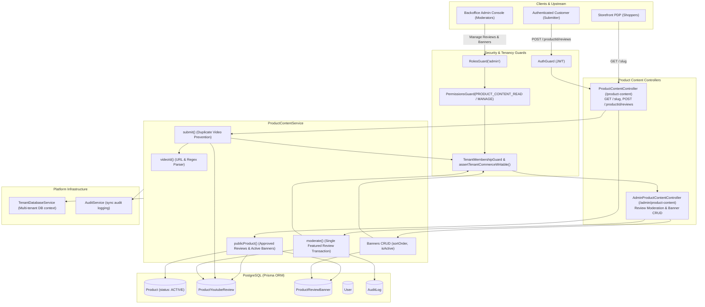
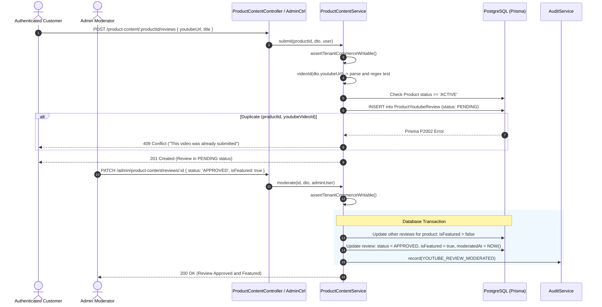
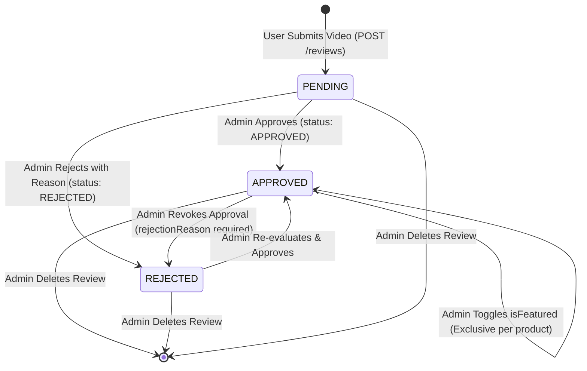

# Product Content Feature Architecture & Invariants

## Purpose
The **Product Content** module (`product-content`) manages user-generated and marketing-driven multimedia content attached to catalog products. It provides public customer submission of YouTube video reviews, administrative moderation workflows (approving, rejecting, and featuring video reviews), and merchandising banner carousels for individual product detail pages (PDP).

---

## Component Architecture



---

## Component Source Map

| Component / File | Symbol / Role | Primary Responsibilities | Key Invariants Enforced |
| :--- | :--- | :--- | :--- |
| [`product-content.module.ts`](file:///home/chillpc/MohammadSheakh/projects/26/e-commerce/e-com-nextjs/ferio-nest-prisma/src/features/product-content/product-content.module.ts) | [`ProductContentModule`](file:///home/chillpc/MohammadSheakh/projects/26/e-commerce/e-com-nextjs/ferio-nest-prisma/src/features/product-content/product-content.module.ts#L11-L16) | Module configuration wiring controllers, providers, and imports. | Imports `PrismaModule`, `AuthModule`, `AuditModule`, and `TenancyModule`. |
| [`product-content.controller.ts`](file:///home/chillpc/MohammadSheakh/projects/26/e-commerce/e-com-nextjs/ferio-nest-prisma/src/features/product-content/product-content.controller.ts) | [`ProductContentController`](file:///home/chillpc/MohammadSheakh/projects/26/e-commerce/e-com-nextjs/ferio-nest-prisma/src/features/product-content/product-content.controller.ts#L30-L48) | Public endpoints for retrieving approved product media by slug and submitting reviews. | Requires `AuthGuard` for review submission; open public access for PDP content lookup. |
| [`product-content.controller.ts`](file:///home/chillpc/MohammadSheakh/projects/26/e-commerce/e-com-nextjs/ferio-nest-prisma/src/features/product-content/product-content.controller.ts) | [`AdminProductContentController`](file:///home/chillpc/MohammadSheakh/projects/26/e-commerce/e-com-nextjs/ferio-nest-prisma/src/features/product-content/product-content.controller.ts#L50-L100) | Administrative management of review queues, moderation status, and promotional banners. | Gated by `AuthGuard`, `RolesGuard('admin')`, `PermissionsGuard`, and `TenantMembershipGuard`. Enforces `PRODUCT_CONTENT_READ` and `PRODUCT_CONTENT_MANAGE`. |
| [`product-content.service.ts`](file:///home/chillpc/MohammadSheakh/projects/26/e-commerce/e-com-nextjs/ferio-nest-prisma/src/features/product-content/product-content.service.ts) | [`ProductContentService`](file:///home/chillpc/MohammadSheakh/projects/26/e-commerce/e-com-nextjs/ferio-nest-prisma/src/features/product-content/product-content.service.ts#L24-L223) | Business logic for YouTube URL normalization, uniqueness assertions, moderation transactions, and banner ordering. | Enforces strict YouTube domain filtering, regex validation on video IDs, tenant commerce writability assertions, and single featured review exclusivity. |
| [`product-content.dto.ts`](file:///home/chillpc/MohammadSheakh/projects/26/e-commerce/e-com-nextjs/ferio-nest-prisma/src/features/product-content/product-content.dto.ts) | DTO Validation Contracts | Class-validator schemas for review submissions, moderation updates, and banner configurations. | Validates URLs with protocols, review status enums (`APPROVED`, `REJECTED`), string length constraints, and non-negative sort orders. |
| [`catalog.prisma`](file:///home/chillpc/MohammadSheakh/projects/26/e-commerce/e-com-nextjs/ferio-nest-prisma/prisma/schema/catalog.module/catalog.prisma) | Data Models | Prisma schema definitions for `ProductYoutubeReview` and `ProductReviewBanner`. | Declares composite unique constraint `@@unique([productId, youtubeVideoId])` and indexes for status filtering. |

---

## Responsibilities

### Owns
- **YouTube Video URL Ingestion & Parsing**: Extracting and validating 6-to-20 character YouTube video identifiers from `youtube.com/watch?v=...`, `youtu.be/...`, and `youtube.com/shorts/...` URLs.
- **Review Submission & Deduplication**: Recording customer review submissions while enforcing uniqueness across `(productId, youtubeVideoId)` to prevent duplicate video entries per product.
- **Review Moderation Workflow**: Administrative lifecycle transitions (`PENDING` $\rightarrow$ `APPROVED` or `REJECTED`), requiring a mandatory rejection reason when rejecting.
- **Featured Review Exclusivity**: Enforcing that at most one YouTube review is marked `isFeatured: true` per product by atomically un-featuring all other reviews for that product during moderation.
- **Product Merchandising Banners**: Full lifecycle (create, update, re-order, soft-toggle, delete) of promotional review banners attached to specific products.
- **Tenant Commerce Writability Gating**: Blocking review submissions and administrative content edits when a tenant subscription is `SUSPENDED` via `assertTenantCommerceWritable()`.

### Does Not Own
- **Video Hosting & Playback**: YouTube hosts the actual media streams; the platform only persists identifiers and embed URLs.
- **Standard Text / Star Reviews**: Traditional written customer reviews and numerical ratings are owned by standard review and catalog systems.
- **Global Storefront Banners**: Sitewide promotional hero banners and home page sliders are owned by marketing/settings modules.
- **Product Catalog Core**: Product descriptions, SKUs, inventory, and variant pricing are owned by `CatalogModule`.

---

## Dependencies

### Consumes
- **[`TenantDatabaseService`](file:///home/chillpc/MohammadSheakh/projects/26/e-commerce/e-com-nextjs/ferio-nest-prisma/src/tenancy/services/tenant-db.service.ts)**: Multi-tenant connection resolution with fallback to platform database.
- **[`AuditService`](file:///home/chillpc/MohammadSheakh/projects/26/e-commerce/e-com-nextjs/ferio-nest-prisma/src/features/audit/services/audit.service.ts)**: Records synchronous audit log entries when administrative review moderation actions occur.
- **`assertTenantCommerceWritable()`**: Throws `ForbiddenException('COMMERCE_MUTATION_DISABLED_SUSPENDED')` if tenant subscription is delinquent.

### Emitters
- **Audit Logs**: Emits `YOUTUBE_REVIEW_MODERATED` events containing old and new moderation state.

---

## Database Ownership

### Direct Writes / Mutates
| Entity | Nature of Mutation | Context / Trigger |
| :--- | :--- | :--- |
| `ProductYoutubeReview` | Insert | Created when an authenticated customer submits a YouTube review (`POST /product-content/:productId/reviews`). |
| `ProductYoutubeReview` | Update | Moderation status, rejection reasons, reviewer metadata, and `isFeatured` flag updated by admin (`PATCH /admin/product-content/reviews/:id`). |
| `ProductYoutubeReview` | Delete | Deleted permanently by admin (`DELETE /admin/product-content/reviews/:id`). |
| `ProductReviewBanner` | Insert | Created by admin for a product (`POST /admin/product-content/products/:productId/banners`). |
| `ProductReviewBanner` | Update | Updated by admin (`PATCH /admin/product-content/banners/:id`). |
| `ProductReviewBanner` | Delete | Deleted permanently by admin (`DELETE /admin/product-content/banners/:id`). |
| `AuditLog` | Insert | Inserted on review moderation (`YOUTUBE_REVIEW_MODERATED`). |

### Reads / References
| Entity | Read Purpose |
| :--- | :--- |
| `Product` | Verified to be `status: 'ACTIVE'` before accepting review submissions or serving public PDP content. |
| `User` | Foreign key references for `submittedBy` and `moderatedBy` relations on reviews. |

---

## Important Invariants

### 1. YouTube Domain & Video Identifier Whitelist
- Only URLs matching hostnames `youtube.com`, `www.youtube.com`, `m.youtube.com`, or `youtu.be` are accepted. Any other domain throws `BadRequestException('Only YouTube links are accepted')`.
- The parsed video ID must match `/^[A-Za-z0-9_-]{6,20}$/`. Malformed query parameters or unparseable URLs throw `BadRequestException('Valid YouTube video link required')`.

### 2. Product-Scoped Video Deduplication
- Database enforces `@@unique([productId, youtubeVideoId])`.
- If a customer or admin attempts to submit a video that was previously submitted for the same product (regardless of its current status: `PENDING`, `APPROVED`, or `REJECTED`), Prisma returns error `P2002`, which is caught and rethrown as `ConflictException('This video was already submitted for the product')`.

### 3. Rejection Reason Requirement
- When transitioning review status to `REJECTED`, a non-empty `rejectionReason` must be provided (either in the DTO or previously recorded on the review). Transitioning to `REJECTED` with an empty string or null reason throws `BadRequestException('Rejection reason is required')`.

### 4. Single Featured Review Exclusivity
- When a review is moderated with `isFeatured: true`, the update executes inside a database transaction:
  ```typescript
  await tx.productYoutubeReview.updateMany({
    where: { productId: review.productId, id: { not: id } },
    data: { isFeatured: false },
  });
  ```
- Furthermore, if a review's status is changed to `REJECTED`, `isFeatured` is automatically forced to `false`.

### 5. Active Product Gating
- Public submissions are rejected with `NotFoundException('Published product not found')` if the target product does not exist or has `status !== 'ACTIVE'`.
- Public PDP lookups only expose approved reviews (`status: 'APPROVED'`) and active banners (`isActive: true`).

---

## Public API & Entry Points

### Storefront Endpoints (`/product-content`)

| Method | Endpoint | Guards & Auth | Description | Inputs / Payload | Response |
| :--- | :--- | :--- | :--- | :--- | :--- |
| `GET` | `/product-content/:slug` | None (Public) | Retrieves active review banners and approved YouTube reviews for a product by slug. | Param: `slug` | `{ id, reviewBanners: [...], youtubeReviews: [...] }` |
| `POST` | `/product-content/:productId/reviews` | `AuthGuard` | Authenticated user submits a YouTube video review for a product. | Param: `productId`<br/>Body: [`SubmitYoutubeReviewDto`](file:///home/chillpc/MohammadSheakh/projects/26/e-commerce/e-com-nextjs/ferio-nest-prisma/src/features/product-content/product-content.dto.ts#L13-L17) | Created `ProductYoutubeReview` (`status: PENDING`) |

### Admin Endpoints (`/admin/product-content`)

All admin routes require `AuthGuard`, `RolesGuard('admin')`, `PermissionsGuard`, and `TenantMembershipGuard`.

| Method | Endpoint | Permissions Required | Description | Inputs / Payload | Response |
| :--- | :--- | :--- | :--- | :--- | :--- |
| `GET` | `/admin/product-content/reviews` | `PRODUCT_CONTENT_READ` | Retrieves all submitted reviews across products, including submitter and product metadata. | None | Array of `ProductYoutubeReview` with relations |
| `PATCH` | `/admin/product-content/reviews/:id` | `PRODUCT_CONTENT_MANAGE` | Moderates review status (`APPROVED`/`REJECTED`), toggles featured state, or updates metadata. | Param: `id`<br/>Body: [`ModerateYoutubeReviewDto`](file:///home/chillpc/MohammadSheakh/projects/26/e-commerce/e-com-nextjs/ferio-nest-prisma/src/features/product-content/product-content.dto.ts#L18-L26) | Updated `ProductYoutubeReview` |
| `DELETE` | `/admin/product-content/reviews/:id` | `PRODUCT_CONTENT_MANAGE` | Permanently deletes a YouTube review submission. | Param: `id` | Deleted `ProductYoutubeReview` |
| `GET` | `/admin/product-content/products/:productId/banners` | `PRODUCT_CONTENT_READ` | Lists all promotional review banners for a specific product. | Param: `productId` | Array of `ProductReviewBanner` |
| `POST` | `/admin/product-content/products/:productId/banners` | `PRODUCT_CONTENT_MANAGE` | Creates a new review banner for a product. | Param: `productId`<br/>Body: [`CreateReviewBannerDto`](file:///home/chillpc/MohammadSheakh/projects/26/e-commerce/e-com-nextjs/ferio-nest-prisma/src/features/product-content/product-content.dto.ts#L27-L32) | Created `ProductReviewBanner` |
| `PATCH` | `/admin/product-content/banners/:id` | `PRODUCT_CONTENT_MANAGE` | Updates image, alt text, sort order, or active state of a banner. | Param: `id`<br/>Body: [`UpdateReviewBannerDto`](file:///home/chillpc/MohammadSheakh/projects/26/e-commerce/e-com-nextjs/ferio-nest-prisma/src/features/product-content/product-content.dto.ts#L33) | Updated `ProductReviewBanner` |
| `DELETE` | `/admin/product-content/banners/:id` | `PRODUCT_CONTENT_MANAGE` | Permanently deletes a review banner. | Param: `id` | Deleted `ProductReviewBanner` |

---

## Important Flows

### 1. YouTube Review Submission & Moderation Lifecycle



### 2. Review State Machine



---

## Brutal Honest Vulnerabilities & Architectural Debt

### 1. Complete Absence of Unit & Integration Test Coverage
- **Issue**: There are zero test files (`*.spec.ts`) in `src/features/product-content/`.
- **Consequence**: Regression testing for URL parsing edge cases, shorts URL variants, duplicate constraint mappings, and the single-featured review isolation transaction is entirely absent. Breaking changes introduced during refactoring will go undetected by CI/CD.
- **Remediation**: Implement a dedicated test suite `src/features/product-content/tests/product-content.service.spec.ts` covering:
  - Video ID extraction across desktop, mobile, shorts, and query parameter variations.
  - Verification that non-YouTube URLs reject with HTTP 400.
  - Concurrent `isFeatured` toggling ensuring at most one review is featured.
  - Mandatory rejection reason assertions.

### 2. Lack of YouTube Data API Verification (Ghost & Deleted Video Exploitation)
- **Issue**: [`videoId()`](file:///home/chillpc/MohammadSheakh/projects/26/e-commerce/e-com-nextjs/ferio-nest-prisma/src/features/product-content/product-content.service.ts#L43-L59) strictly validates string structure via regular expressions without validating against YouTube's oEmbed or Data v3 API.
- **Consequence**: Users can submit deleted videos, private videos, age-restricted videos, or videos that have embedding disabled by the owner. When approved, storefront PDP carousels display broken video player iframes.
- **Remediation**: Integrate YouTube's lightweight oEmbed endpoint (`https://www.youtube.com/oembed?url=...&format=json`) during submission to verify video existence, public accessibility, and fetch official video titles and thumbnails.

### 3. Missing Rate Limiting on Review Submissions
- **Issue**: While `POST /product-content/:productId/reviews` requires `AuthGuard`, it **does not declare a `SlidingWindowRateLimitGuard`**.
- **Consequence**: An authenticated user (e.g., a customer account or compromised bot account) can flood the endpoint with hundreds of arbitrary YouTube URLs across various products in seconds, polluting the admin review queue.
- **Remediation**: Apply `@UseGuards(SlidingWindowRateLimitGuard)` and `@RateLimit(GLOBAL_RATE_LIMITS.user)` to `POST /:productId/reviews`.

### 4. Inconsistent Audit Logging Coverage
- **Issue**: The service records audit logs for `moderate()` (`YOUTUBE_REVIEW_MODERATED`), but **omits audit logging entirely** for:
  - `deleteReview()`
  - `createBanner()`
  - `updateBanner()`
  - `deleteBanner()`
- **Consequence**: Administrators can delete critical customer reviews or inject malicious promotional banners without leaving an audit footprint in `AuditLog`.
- **Remediation**: Wire `this.audit.record()` calls inside `deleteReview()`, `createBanner()`, `updateBanner()`, and `deleteBanner()`.

### 5. Potential Unbounded Admin Reviews Query
- **Issue**: [`adminReviews()`](file:///home/chillpc/MohammadSheakh/projects/26/e-commerce/e-com-nextjs/ferio-nest-prisma/src/features/product-content/product-content.service.ts#L120-L129) executes:
  ```typescript
  db.productYoutubeReview.findMany({
    include: { product: { select: { name: true } }, submittedBy: { select: { name: true, email: true } } },
    orderBy: { createdAt: 'desc' },
  })
  ```
  It has no pagination (`take`, `skip`), no date range bounds, and no status filtering.
- **Consequence**: As thousands of reviews accumulate across the tenant's catalog, loading `/admin/product-content/reviews` will fetch every record ever created into memory, degrading API latency and inflating response sizes.
- **Remediation**: Introduce standard pagination parameters (`page`, `limit`) and status query filters to `adminReviews()`.
