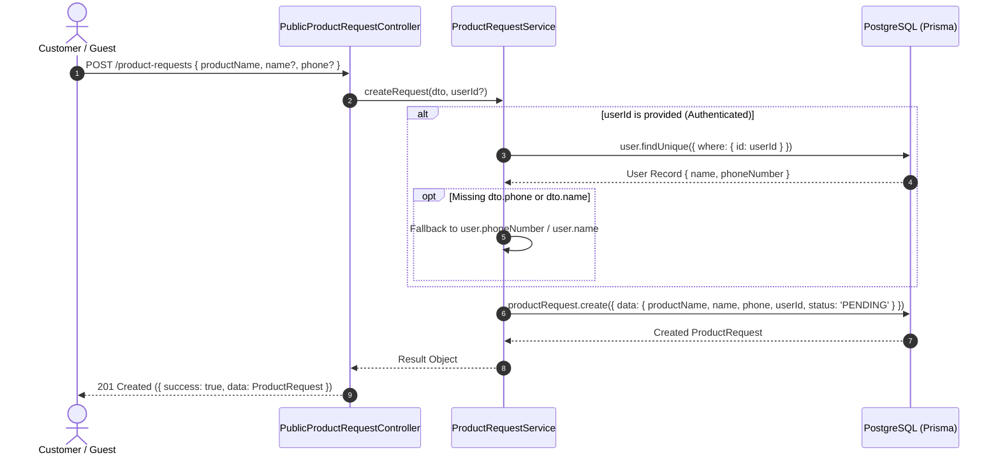
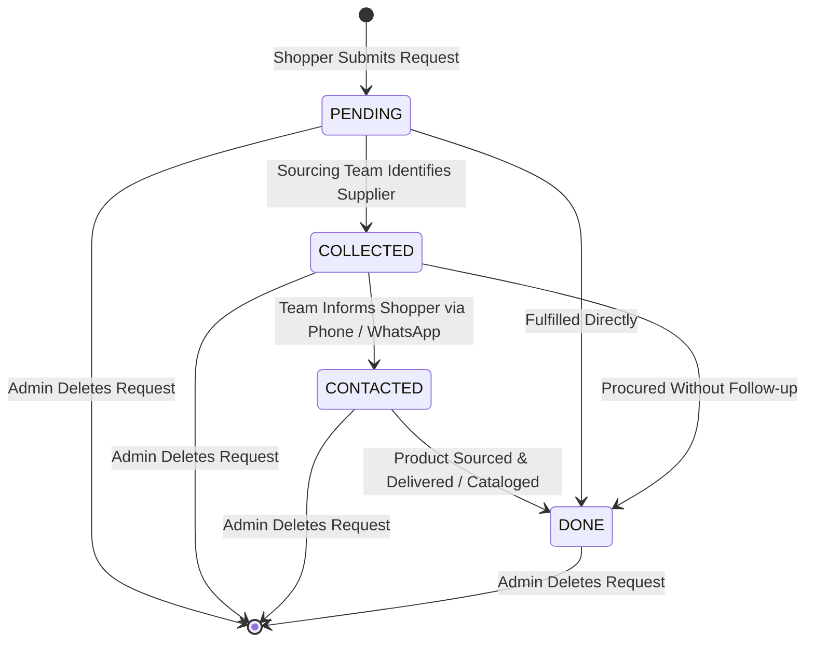

# Product Request Feature Architecture & Invariants

## Purpose
The **Product Request** module (`product-request`) captures customer demand for unlisted, out-of-stock, or specialty products. It provides a rate-limited public endpoint for shoppers (both anonymous guests and authenticated users) to submit procurement inquiries, automatically enriches requests with authenticated profile telemetry, and provides backoffice administrators with paginated search, operational note-taking, and procurement lifecycle status tracking (`PENDING` $\rightarrow$ `COLLECTED` $\rightarrow$ `CONTACTED` $\rightarrow$ `DONE`).

---

## Component Architecture

```mermaid
flowchart TD
    subgraph Clients["Clients & Upstream"]
        GuestShopper["Anonymous Guest Shopper"]
        AuthShopper["Authenticated User"]
        AdminDashboard["Backoffice Procurement / Sourcing Team"]
    end

    subgraph Controllers["Product Request Controllers"]
        PublicCtrl["PublicProductRequestController (/product-requests)<br/>POST / (SlidingWindowRateLimitGuard)"]
        AdminCtrl["AdminProductRequestController (/product-requests)<br/>GET /, PATCH /:id/status, DELETE /:id"]
    end

    subgraph Guards["Security & Tenancy Guards"]
        RateLimitGuard["SlidingWindowRateLimitGuard(auth)"]
        AuthGuard["AuthGuard (JWT)"]
        RolesGuard["RolesGuard('admin')"]
        PermsGuard["PermissionsGuard(PRODUCT_REQUESTS_READ / MANAGE)"]
        TenantGuard["TenantMembershipGuard"]
    end

    subgraph Service["ProductRequestService"]
        CreateLogic["createRequest() (Profile Fallback & Enrichment)"]
        SearchLogic["getAllRequests() (Paginated Multi-column ILIKE)"]
        StatusLogic["updateStatus() (Status & Internal Notes)"]
        DeleteLogic["deleteRequest() (Hard Deletion)"]
    end

    subgraph Infrastructure["Platform Infrastructure"]
        TenantDB["TenantDatabaseService (Multi-tenant DB Context)"]
        PrismaService["PrismaService (PostgreSQL)"]
    end

    subgraph Database["PostgreSQL (Prisma ORM)"]
        PRTable[("ProductRequest")]
        UserTable[("User")]
    end

    GuestShopper -->|POST /product-requests| RateLimitGuard --> PublicCtrl
    AuthShopper -->|POST /product-requests (Bearer Token)| RateLimitGuard --> PublicCtrl
    AdminDashboard -->|Manage Requests| AuthGuard --> RolesGuard --> PermsGuard --> TenantGuard --> AdminCtrl

    PublicCtrl --> CreateLogic
    AdminCtrl --> SearchLogic
    AdminCtrl --> StatusLogic
    AdminCtrl --> DeleteLogic

    Service --> TenantDB
    TenantDB --> PrismaService

    CreateLogic --> PRTable
    CreateLogic -.->|Read fallback phone/name| UserTable
    SearchLogic --> PRTable
    SearchLogic -.->|Join search user| UserTable
    StatusLogic --> PRTable
    DeleteLogic --> PRTable
```

---

## Component Source Map

| Component / File | Symbol / Role | Primary Responsibilities | Key Invariants Enforced |
| :--- | :--- | :--- | :--- |
| [`product-request.module.ts`](file:///home/chillpc/MohammadSheakh/projects/26/e-commerce/e-com-nextjs/ferio-nest-prisma/src/features/product-request/product-request.module.ts) | [`ProductRequestModule`](file:///home/chillpc/MohammadSheakh/projects/26/e-commerce/e-com-nextjs/ferio-nest-prisma/src/features/product-request/product-request.module.ts#L11-L17) | NestJS feature module declaration configuring providers and routing. | Imports `TenancyModule`, `PrismaModule`, and `AuthModule`; exports [`ProductRequestService`](file:///home/chillpc/MohammadSheakh/projects/26/e-commerce/e-com-nextjs/ferio-nest-prisma/src/features/product-request/product-request.service.ts#L18-L180). |
| [`product-request.controller.ts`](file:///home/chillpc/MohammadSheakh/projects/26/e-commerce/e-com-nextjs/ferio-nest-prisma/src/features/product-request/product-request.controller.ts) | [`PublicProductRequestController`](file:///home/chillpc/MohammadSheakh/projects/26/e-commerce/e-com-nextjs/ferio-nest-prisma/src/features/product-request/product-request.controller.ts#L34-L55) | Public endpoint for submitting product sourcing inquiries. | Enforces `SlidingWindowRateLimitGuard` with `GLOBAL_RATE_LIMITS.auth` to mitigate automated request spam. |
| [`product-request.controller.ts`](file:///home/chillpc/MohammadSheakh/projects/26/e-commerce/e-com-nextjs/ferio-nest-prisma/src/features/product-request/product-request.controller.ts) | [`AdminProductRequestController`](file:///home/chillpc/MohammadSheakh/projects/26/e-commerce/e-com-nextjs/ferio-nest-prisma/src/features/product-request/product-request.controller.ts#L57-L104) | Administrative endpoints for viewing, status progression, and purging requests. | Requires `AuthGuard`, `RolesGuard('admin')`, `PermissionsGuard`, and `TenantMembershipGuard`. Enforces `PRODUCT_REQUESTS_READ` and `PRODUCT_REQUESTS_MANAGE`. |
| [`product-request.service.ts`](file:///home/chillpc/MohammadSheakh/projects/26/e-commerce/e-com-nextjs/ferio-nest-prisma/src/features/product-request/product-request.service.ts) | [`ProductRequestService`](file:///home/chillpc/MohammadSheakh/projects/26/e-commerce/e-com-nextjs/ferio-nest-prisma/src/features/product-request/product-request.service.ts#L18-L180) | Business logic for inquiry creation, profile fallback resolution, multi-field search, and status updates. | Enforces multi-tenant database routing via `resolveTenantDatabase`; sets initial status to `PENDING`. |
| [`product-request.dto.ts`](file:///home/chillpc/MohammadSheakh/projects/26/e-commerce/e-com-nextjs/ferio-nest-prisma/src/features/product-request/dto/product-request.dto.ts) | DTO Validation Contracts | Class-validator transfer objects for inquiry creation, status updates, and query parameters. | Enforces minimum product description length (2 chars), max string boundaries, and strict status enums. |
| [`catalog.prisma`](file:///home/chillpc/MohammadSheakh/projects/26/e-commerce/e-com-nextjs/ferio-nest-prisma/prisma/schema/catalog.module/catalog.prisma) | Data Models | Prisma schema definition for `ProductRequest` and `ProductRequestStatus`. | Foreign key to `User` with `onDelete: SetNull`; composite index `@@index([status, createdAt])`. |
| [`product-request.controller.spec.ts`](file:///home/chillpc/MohammadSheakh/projects/26/e-commerce/e-com-nextjs/ferio-nest-prisma/src/features/product-request/tests/product-request.controller.spec.ts) | Controller Auth Spec | Validates guard separation between public and admin controllers. | Asserts admin roles, read/manage permissions, and tenant membership metadata. |

---

## Responsibilities

### Owns
- **Product Procurement Inquiries**: Capturing user requests for products not currently listed in the catalog (`productName`, requester `name`, contact `phone`).
- **Authenticated Profile Fallback**: Automatically populating missing contact phone numbers or requester names from the authenticated `User` record if submitted with a valid user session.
- **Inquiry Lifecycle Progression**: Tracking the operational state of sourcing requests:
  - `PENDING`: Request received from customer.
  - `COLLECTED`: Sourcing team located product with suppliers.
  - `CONTACTED`: Customer informed about availability and pricing.
  - `DONE`: Product procured, cataloged, or customer transaction completed.
- **Admin Search & Pagination**: Filtering inquiries by status and executing case-insensitive search across product descriptions, requester names, phone numbers, and linked user profiles.
- **Internal Sourcing Notes**: Recording internal operational annotations (`notes`) up to 2,000 characters per request.

### Does Not Own
- **Supplier Purchase Orders**: Creating purchase orders or tracking wholesale shipments with vendors is owned by procurement/inventory management.
- **Product Catalog Creation**: Converting an inquiry into an active live catalog listing is owned by `CatalogModule`.
- **Customer Stock Alerts / Notifications**: Back-in-stock notifications for existing products are owned by `CustomerNotificationsModule`.
- **Order Placement**: Placing customer orders once items are sourced is owned by `OrderModule`.

---

## Dependencies

### Consumes
- **[`TenantDatabaseService`](file:///home/chillpc/MohammadSheakh/projects/26/e-commerce/e-com-nextjs/ferio-nest-prisma/src/tenancy/services/tenant-db.service.ts)**: Resolves the ambient multi-tenant database connection.
- **[`PrismaService`](file:///home/chillpc/MohammadSheakh/projects/26/e-commerce/e-com-nextjs/ferio-nest-prisma/libs/database/src/prisma.service.ts)**: Fallback database connection in single-tenant or legacy contexts.
- **`User` Entity**: Reads user name and phone number for profile enrichment.

### Emitters
- **None**: This module currently does **not** emit events, audit logs, or notifications.

---

## Database Ownership

### Direct Writes / Mutates
| Entity | Nature of Mutation | Context / Trigger |
| :--- | :--- | :--- |
| `ProductRequest` | Insert | Created when a shopper submits an inquiry (`POST /product-requests`). Initial status is set to `PENDING`. |
| `ProductRequest` | Update | Sourcing status (`status`) and internal operational notes (`notes`) updated by admin (`PATCH /product-requests/:id/status`). |
| `ProductRequest` | Delete | Permanently deleted by admin (`DELETE /product-requests/:id`). |

### Reads / References
| Entity | Read Purpose |
| :--- | :--- |
| `User` | Read by `userId` to fallback phone number and requester name when missing in submission payload; joined in administrative search. |

---

## Important Invariants

### 1. Public Submission Rate Limiting
- The public submission endpoint `POST /product-requests` is protected by `SlidingWindowRateLimitGuard` using `GLOBAL_RATE_LIMITS.auth` to prevent automated scrapers or bots from flooding the sourcing database.

### 2. Profile Telemetry Fallback
- If `userId` is present in the request session:
  - If `dto.phone` is null or empty and the user has a `phoneNumber` on file, `finalPhone = user.phoneNumber`.
  - If `dto.name` is null or empty and the user has a `name` on file, `finalName = user.name`.
- Direct customer inputs in the payload always take precedence over account defaults.

### 3. Sourcing Status State Machine
Valid status values are constrained by enum `ProductRequestStatus`:
$$\text{PENDING} \rightarrow \text{COLLECTED} \rightarrow \text{CONTACTED} \rightarrow \text{DONE}$$
- Any unmapped status strings passed in admin queries or update payloads are ignored or rejected by validation.

### 4. Cascade Decoupling from Users
- If a registered customer deletes their account or is purged, the foreign key constraint `onDelete: SetNull` ensures the sourcing request remains intact with `userId = null`, preserving historical demand records for merchandising.

---

## Public API & Entry Points

Mounted under base path `/product-requests`:

| Method | Endpoint | Guards & Auth | Description | Inputs / Payload | Response Payload |
| :--- | :--- | :--- | :--- | :--- | :--- |
| `POST` | `/product-requests` | `Public()`, `SlidingWindowRateLimitGuard` | Submits a new product sourcing inquiry. Enriches with user data if session is active. | Body: [`CreateProductRequestDto`](file:///home/chillpc/MohammadSheakh/projects/26/e-commerce/e-com-nextjs/ferio-nest-prisma/src/features/product-request/dto/product-request.dto.ts#L10-L28) | `{ success: true, message: '...', data: ProductRequest }` |
| `GET` | `/product-requests` | `AuthGuard`, `RolesGuard('admin')`, `PermissionsGuard(PRODUCT_REQUESTS_READ)`, `TenantMembershipGuard` | Paginated search across sourcing inquiries. | Query: [`QueryProductRequestDto`](file:///home/chillpc/MohammadSheakh/projects/26/e-commerce/e-com-nextjs/ferio-nest-prisma/src/features/product-request/dto/product-request.dto.ts#L43-L62) | `{ success: true, message: '...', data: { items, total, totalPages, pagination } }` |
| `PATCH` | `/product-requests/:id/status` | `AuthGuard`, `RolesGuard('admin')`, `PermissionsGuard(PRODUCT_REQUESTS_MANAGE)`, `TenantMembershipGuard` | Updates request status and records sourcing notes. | Param: `id`<br/>Body: [`UpdateProductRequestStatusDto`](file:///home/chillpc/MohammadSheakh/projects/26/e-commerce/e-com-nextjs/ferio-nest-prisma/src/features/product-request/dto/product-request.dto.ts#L30-L41) | `{ success: true, message: '...', data: ProductRequest }` |
| `DELETE` | `/product-requests/:id` | `AuthGuard`, `RolesGuard('admin')`, `PermissionsGuard(PRODUCT_REQUESTS_MANAGE)`, `TenantMembershipGuard` | Permanently deletes a sourcing request. | Param: `id` | `{ success: true, message: 'Product request deleted successfully.' }` |

---

## Important Flows

### 1. Public Product Request Submission & Profile Enrichment



### 2. Sourcing & Procurement Lifecycle



---

## Brutal Honest Vulnerabilities & Architectural Debt

### 1. Raw Phone Ingestion Without Normalization
- **Issue**: [`createRequest()`](file:///home/chillpc/MohammadSheakh/projects/26/e-commerce/e-com-nextjs/ferio-nest-prisma/src/features/product-request/product-request.service.ts#L37-L73) saves `phone` as a raw string (`dto.phone?.trim() || null`) without applying `normalizeBangladeshPhone()`.
- **Consequence**: Users can submit phone numbers in varied formats (`017XXXXXXXX`, `+88017XXXXXXXX`, `88017...`, or strings containing hyphens and spaces). This breaks phone search filtering in the backoffice and prevents reliable automated matching against customer records.
- **Remediation**: Apply the platform standard `normalizeBangladeshPhone()` utility before saving phone numbers.

### 2. Heavy Multi-Column `ILIKE` Scans on Joined Tables
- **Issue**: [`getAllRequests()`](file:///home/chillpc/MohammadSheakh/projects/26/e-commerce/e-com-nextjs/ferio-nest-prisma/src/features/product-request/product-request.service.ts#L75-L142) executes:
  ```typescript
  where.OR = [
    { productName: { contains: q, mode: 'insensitive' } },
    { name: { contains: q, mode: 'insensitive' } },
    { phone: { contains: q, mode: 'insensitive' } },
    { user: { name: { contains: q, mode: 'insensitive' } } },
    { user: { email: { contains: q, mode: 'insensitive' } } },
  ];
  ```
- **Consequence**: In PostgreSQL, `contains` with `mode: 'insensitive'` translates to `ILIKE '%...%'`. Because standard B-Tree indexes cannot index leading wildcards, searching across 5 fields on both `ProductRequest` and joined `User` rows forces sequential table scans. Under thousands of product inquiries, backoffice search will experience latency degradation.
- **Remediation**: Implement a PostgreSQL `tsvector` generated column on `ProductRequest` with a GIN index, or use trigram indexes (`pg_trgm`) for fuzzy text searches.

### 3. Missing Audit Logging for Sourcing State Changes
- **Issue**: Neither [`updateStatus()`](file:///home/chillpc/MohammadSheakh/projects/26/e-commerce/e-com-nextjs/ferio-nest-prisma/src/features/product-request/product-request.service.ts#L144-L169) nor [`deleteRequest()`](file:///home/chillpc/MohammadSheakh/projects/26/e-commerce/e-com-nextjs/ferio-nest-prisma/src/features/product-request/product-request.service.ts#L171-L179) records events into `AuditService`.
- **Consequence**: If a procurement staff member maliciously or accidentally changes customer notes, marks requests as `DONE`, or permanently deletes high-value product sourcing inquiries, there is no audit trail identifying who performed the action or what the previous values were.
- **Remediation**: Inject `AuditService` and record `PRODUCT_REQUEST_STATUS_UPDATED` and `PRODUCT_REQUEST_DELETED` events.

### 4. Unbounded Pagination Query Parameter
- **Issue**: In [`QueryProductRequestDto`](file:///home/chillpc/MohammadSheakh/projects/26/e-commerce/e-com-nextjs/ferio-nest-prisma/src/features/product-request/dto/product-request.dto.ts#L43-L62), `limit` is an unconstrained optional number without `@Max(100)` or `@IsInt()` decorators. In the service, it evaluates `Math.max(1, Number(query.limit) || 20)` without an upper ceiling.
- **Consequence**: An administrative client or script can pass `?limit=500000`, causing PostgreSQL to load the entire table into Node.js heap memory, resulting in event loop stalling and potential out-of-memory crashes.
- **Remediation**: Enforce `@Max(100)` in `QueryProductRequestDto` and cap `Math.min(100, Math.max(1, Number(query.limit) || 20))` in the service.

### 5. Absence of Automated Customer Notifications
- **Issue**: When an inquiry moves from `PENDING` to `COLLECTED` or `CONTACTED`, no automated notification (SMS, email, or in-app customer notification) is dispatched.
- **Consequence**: Procurement teams must manually look up contact info and message users outside the system, leading to communication drops and lost conversion opportunities.
- **Remediation**: Integrate `TransactionalMessagingService` and `CustomerNotificationsService` to notify the requesting user automatically when the sourcing status updates.
