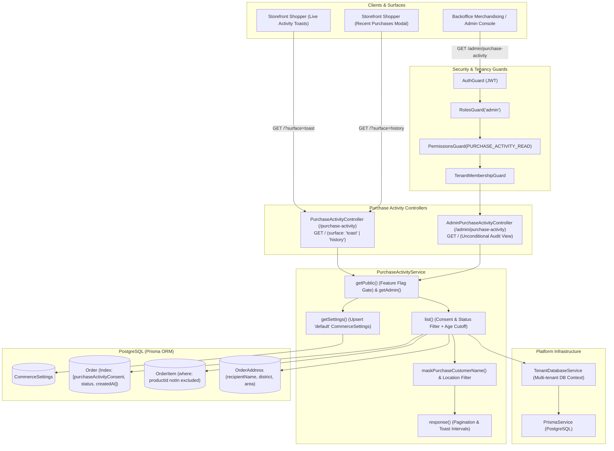
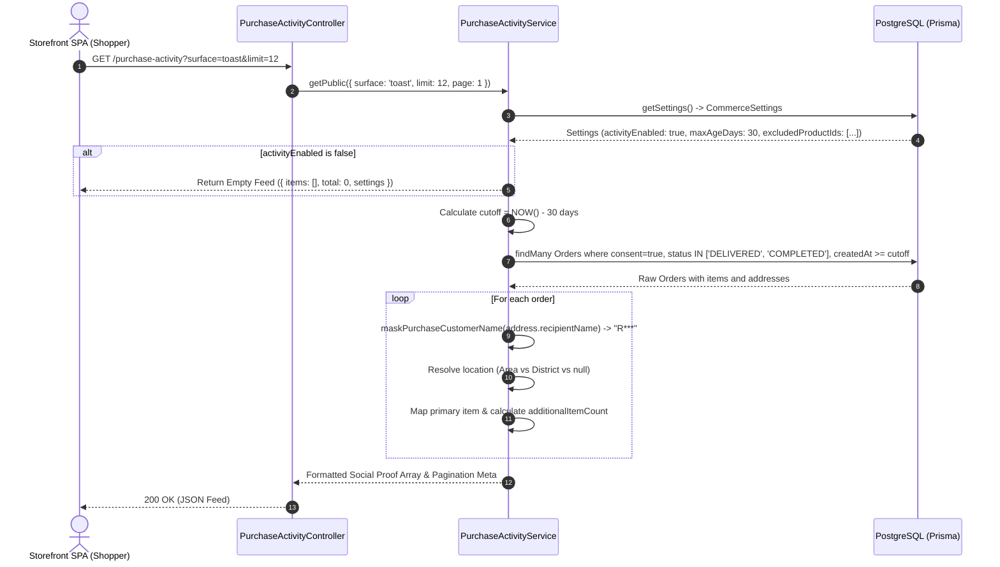

# Purchase Activity Feature Architecture & Invariants

## Purpose
The **Purchase Activity** module (`purchase-activity`) provides privacy-safe, verified social proof to storefront shoppers and backoffice merchandisers. It queries recently fulfilled customer orders, validates explicit user consent collected during checkout, masks personally identifiable information (PII), filters out sensitive or excluded products, and formats lightweight activity feeds for real-time storefront toast notifications and purchase history popups.

---

## Component Architecture



---

## Component Source Map

| Component / File | Symbol / Role | Primary Responsibilities | Key Invariants Enforced |
| :--- | :--- | :--- | :--- |
| [`purchase-activity.module.ts`](file:///home/chillpc/MohammadSheakh/projects/26/e-commerce/e-com-nextjs/ferio-nest-prisma/src/features/purchase-activity/purchase-activity.module.ts) | [`PurchaseActivityModule`](file:///home/chillpc/MohammadSheakh/projects/26/e-commerce/e-com-nextjs/ferio-nest-prisma/src/features/purchase-activity/purchase-activity.module.ts#L11-L16) | NestJS feature module registering public and admin controllers and service provider. | Imports `TenancyModule`, `PrismaModule`, and `AuthModule`. |
| [`purchase-activity.controller.ts`](file:///home/chillpc/MohammadSheakh/projects/26/e-commerce/e-com-nextjs/ferio-nest-prisma/src/features/purchase-activity/controllers/purchase-activity.controller.ts) | [`PurchaseActivityController`](file:///home/chillpc/MohammadSheakh/projects/26/e-commerce/e-com-nextjs/ferio-nest-prisma/src/features/purchase-activity/controllers/purchase-activity.controller.ts#L14-L22) | Public endpoint serving masked social proof feeds for toast notifications or purchase history views. | Validates query surface (`toast` vs `history`); checks tenant feature flags. |
| [`purchase-activity.controller.ts`](file:///home/chillpc/MohammadSheakh/projects/26/e-commerce/e-com-nextjs/ferio-nest-prisma/src/features/purchase-activity/controllers/purchase-activity.controller.ts) | [`AdminPurchaseActivityController`](file:///home/chillpc/MohammadSheakh/projects/26/e-commerce/e-com-nextjs/ferio-nest-prisma/src/features/purchase-activity/controllers/purchase-activity.controller.ts#L24-L35) | Administrative endpoint for auditing purchase activity items. | Gated by `AuthGuard`, `RolesGuard('admin')`, `PermissionsGuard(PURCHASE_ACTIVITY_READ)`, and `TenantMembershipGuard`. |
| [`purchase-activity.service.ts`](file:///home/chillpc/MohammadSheakh/projects/26/e-commerce/e-com-nextjs/ferio-nest-prisma/src/features/purchase-activity/services/purchase-activity.service.ts) | [`PurchaseActivityService`](file:///home/chillpc/MohammadSheakh/projects/26/e-commerce/e-com-nextjs/ferio-nest-prisma/src/features/purchase-activity/services/purchase-activity.service.ts#L12-L158) | Core query orchestrator enforcing consent filtering, age boundaries, product exclusions, and location anonymization. | Filters by `purchaseActivityConsent: true`, `status IN ['DELIVERED', 'COMPLETED']`, and max age days. |
| [`purchase-activity.dto.ts`](file:///home/chillpc/MohammadSheakh/projects/26/e-commerce/e-com-nextjs/ferio-nest-prisma/src/features/purchase-activity/purchase-activity.dto.ts) | [`PurchaseActivityQueryDto`](file:///home/chillpc/MohammadSheakh/projects/26/e-commerce/e-com-nextjs/ferio-nest-prisma/src/features/purchase-activity/purchase-activity.dto.ts#L4-L21) | Query contract for surface selection (`toast`, `history`) and pagination bounds. | Enforces maximum limit of 50 items and positive integer pages. |
| [`purchase-activity.util.ts`](file:///home/chillpc/MohammadSheakh/projects/26/e-commerce/e-com-nextjs/ferio-nest-prisma/src/features/purchase-activity/utils/purchase-activity.util.ts) | [`maskPurchaseCustomerName`](file:///home/chillpc/MohammadSheakh/projects/26/e-commerce/e-com-nextjs/ferio-nest-prisma/src/features/purchase-activity/utils/purchase-activity.util.ts#L1-L4) | Unicode-safe customer name redaction utility. | Retains only the first character + `***`; falls back to `'A customer'` for empty inputs. |
| [`purchase-activity.util.spec.ts`](file:///home/chillpc/MohammadSheakh/projects/26/e-commerce/e-com-nextjs/ferio-nest-prisma/src/features/purchase-activity/tests/purchase-activity.util.spec.ts) | Name Masking Unit Test | Validates unicode normalization (Bengali, English) and empty string fallbacks. | Ensures PII names are never exposed unmasked. |

---

## Responsibilities

### Owns
- **Social Proof Feed Delivery**: Generating lightweight, verified purchase feeds (`productId`, `productName`, `variantName`, `imageUrl`, `additionalItemCount`, `customerName`, `location`, `purchasedAt`) for frontend merchandising widgets.
- **Opt-In Consent Gating**: Enforcing that only orders where `purchaseActivityConsent === true` (explicitly agreed during checkout) are ever surfaced.
- **Order Fulfillment Validation**: Enforcing that only completed or delivered orders (`status IN ['DELIVERED', 'COMPLETED']`) qualify for social proof feeds.
- **PII Name Redaction**: Redacting customer names to the first unicode glyph (`R***`, `শ***`) to protect consumer privacy.
- **Geographic Granularity Gating**: Conditioning location output based on tenant settings (`purchaseActivityShowArea` $\rightarrow$ area; `purchaseActivityShowDistrict` $\rightarrow$ district; otherwise `null`).
- **Product Blacklisting**: Automatically filtering out sensitive products specified in `purchaseActivityExcludedProductIds`.
- **Temporal Freshness Pruning**: Enforcing maximum order age boundaries based on `purchaseActivityMaxAgeDays` (e.g., 30 days).

### Does Not Own
- **Consent Collection**: Checkbox consent collection and timestamping occur in `CheckoutModule` and `OrderModule`.
- **Toast Display / Animation**: Client-side interval loops, fade transitions, and UI audio are owned by the storefront SPA.
- **Analytics Event Ingestion**: Click-through tracking and conversion attribution from toasts are owned by `StorefrontAnalyticsModule`.
- **Order Status Transitions**: Marking orders as `DELIVERED` or `COMPLETED` is owned by `OrderModule` and `ShippingModule`.

---

## Dependencies

### Consumes
- **[`TenantDatabaseService`](file:///home/chillpc/MohammadSheakh/projects/26/e-commerce/e-com-nextjs/ferio-nest-prisma/src/tenancy/services/tenant-db.service.ts)**: Dynamic tenant database connection resolution.
- **[`PrismaService`](file:///home/chillpc/MohammadSheakh/projects/26/e-commerce/e-com-nextjs/ferio-nest-prisma/libs/database/src/prisma.service.ts)**: Single-tenant or legacy database fallback.
- **`CommerceSettings` Entity**: Retrieves feature enablement flags (`purchaseActivityEnabled`, `purchaseHistoryEnabled`), display duration, interval seconds, age limits, and product exclusion lists.
- **`Order` & `OrderItem` & `OrderAddress` Entities**: Queries fulfilled orders and line items.

### Emitters
- **None**: This module is strictly observational; it does not mutate records or emit events.

---

## Database Ownership

### Direct Writes / Mutates
- **`CommerceSettings`**: Upserts `id: 'default'` record with defaults if no configuration row exists. Never alters business data.

### Reads / References
| Entity | Read Purpose |
| :--- | :--- |
| `CommerceSettings` | Reads flags (`purchaseActivityEnabled`, `purchaseHistoryEnabled`, `purchaseActivityShowDistrict`, `purchaseActivityShowArea`, `purchaseActivityDurationMs`, `purchaseActivityIntervalSeconds`, `purchaseActivityMaxAgeDays`, `purchaseActivityExcludedProductIds`). |
| `Order` | Filters by `purchaseActivityConsent: true`, `status IN ['DELIVERED', 'COMPLETED']`, and `createdAt >= cutoff`. Covered by index `@@index([purchaseActivityConsent, status, createdAt])`. |
| `OrderItem` | Retrieves first product details (`productIdSnapshot`, `productName`, `variantName`, `imageUrl`, `quantity`) and aggregates total item count. |
| `OrderAddress` | Reads `recipientName`, `district`, and `area` for masked presentation. |

---

## Important Invariants

### 1. Mandatory Explicit Consent
- Orders where `purchaseActivityConsent === false` **must never be queried or displayed**, regardless of store settings or administrative queries.

### 2. Verified Delivered Status
- Unfulfilled, pending, or cancelled orders (`PENDING_CONFIRMATION`, `CONFIRMED`, `CANCELLED`) are strictly excluded. Only parcels confirmed as delivered or completed (`status IN ['DELIVERED', 'COMPLETED']`) qualify for `verifiedPurchase: true`.

### 3. Unicode-Safe Name Redaction
- Customer names undergo Unicode normalization (`normalize('NFKC')`).
- Only the very first unicode code point is preserved followed by `***` (e.g. `'Rahim'` $\rightarrow$ `'R***'`, `'শাওন'` $\rightarrow$ `'শ***'`).
- If the name field is empty, whitespace-only, or missing, it safely falls back to `'A customer'`.

### 4. Hierarchical Location Privacy
- Location visibility follows strict hierarchical gating:
  - If `purchaseActivityShowArea` is enabled, returns `order.address.area`.
  - Else if `purchaseActivityShowDistrict` is enabled, returns `order.address.district`.
  - Otherwise, returns `null`.

### 5. Exclusion Blacklist Filtering
- Products present in `CommerceSettings.purchaseActivityExcludedProductIds` are omitted from order queries via `productIdSnapshot: { notIn: [...] }`. If an order contains only excluded items, the order is completely omitted from the feed.

### 6. Public Feature Flag Invariant
- On public storefront queries (`GET /purchase-activity`), if the corresponding surface flag (`purchaseActivityEnabled` for `toast` or `purchaseHistoryEnabled` for `history`) is disabled in settings, the endpoint immediately returns an empty list (`items: []`) with metadata, avoiding unnecessary database scanning.

---

## Public API & Entry Points

| Method | Endpoint | Guards & Auth | Description | Inputs / Payload | Response Payload |
| :--- | :--- | :--- | :--- | :--- | :--- |
| `GET` | `/purchase-activity` | None (Public) | Retrieves paginated social proof feed for storefront toast notifications or recent purchase modals. | Query: [`PurchaseActivityQueryDto`](file:///home/chillpc/MohammadSheakh/projects/26/e-commerce/e-com-nextjs/ferio-nest-prisma/src/features/purchase-activity/purchase-activity.dto.ts#L4-L21) (`surface`, `page`, `limit`) | `{ items: [...], page, limit, total, totalPages, settings: { ... } }` |
| `GET` | `/admin/purchase-activity` | `AuthGuard`, `RolesGuard('admin')`, `PermissionsGuard(PURCHASE_ACTIVITY_READ)`, `TenantMembershipGuard` | Retrieves social proof feed for administrative preview regardless of public surface toggle. | Query: [`PurchaseActivityQueryDto`](file:///home/chillpc/MohammadSheakh/projects/26/e-commerce/e-com-nextjs/ferio-nest-prisma/src/features/purchase-activity/purchase-activity.dto.ts#L4-L21) | `{ items: [...], page, limit, total, totalPages, settings: { ... } }` |

### Sample Response Schema
```json
{
  "items": [
    {
      "id": "cly9z1x8e000108l78x12ab34",
      "productId": "cly8v1x2a000108l72v98cd76",
      "productName": "Wireless Noise Cancelling Headphones",
      "variantName": "Midnight Black",
      "imageUrl": "https://assets.ferio.shop/products/headphones-black.webp",
      "additionalItemCount": 2,
      "customerName": "R***",
      "location": "Gulshan",
      "purchasedAt": "2026-09-24T18:45:00.000Z",
      "verifiedPurchase": true
    }
  ],
  "page": 1,
  "limit": 12,
  "total": 48,
  "totalPages": 4,
  "settings": {
    "activityEnabled": true,
    "historyEnabled": true,
    "displayDurationMs": 4000,
    "intervalSeconds": 12
  }
}
```

---

## Important Flows

### 1. Social Proof Query & Redaction Pipeline



---

## Brutal Honest Vulnerabilities & Architectural Debt

### 1. Uncached High-Frequency Storefront Database Queries
- **Issue**: [`list()`](file:///home/chillpc/MohammadSheakh/projects/26/e-commerce/e-com-nextjs/ferio-nest-prisma/src/features/purchase-activity/services/purchase-activity.service.ts#L44-L127) queries PostgreSQL live on every single request:
  ```typescript
  const [orders, total] = await Promise.all([
    db.order.findMany({ where, skip, take, select: { ... } }),
    db.order.count({ where }),
  ]);
  ```
- **Consequence**: Storefront homepages and PDPs routinely trigger this endpoint on page load. During marketing campaigns or viral traffic spikes with thousands of concurrent visitors, firing relational joins across `Order`, `OrderItem`, and `OrderAddress` directly on the primary transactional database will cause connection pool exhaustion and checkout latency degradation.
- **Remediation**: Cache the computed social proof feed in Redis with a 60-second TTL (`purchase_activity:feed:<surface>:<page>`), or serve it via a public CDN with `Cache-Control: public, max-age=60, s-maxage=120`.

### 2. Missing Rate Limiting Guard on Public Feed
- **Issue**: `PurchaseActivityController.get` does not declare a `SlidingWindowRateLimitGuard` or `@RateLimit` decorator.
- **Consequence**: Automated scrapers or client loops can poll `/purchase-activity` hundreds of times per minute per IP, creating an unthrottled denial-of-service vector against the database.
- **Remediation**: Add `@UseGuards(SlidingWindowRateLimitGuard)` with `@RateLimit(GLOBAL_RATE_LIMITS.user)`.

### 3. Abandoned Empty Directory Scaffolding
- **Issue**: The directory tree contains `src/features/purchase-activity/processors/` and `src/features/purchase-activity/queues/` as completely empty directories.
- **Consequence**: Represents dead architectural scaffolding from an incomplete migration to asynchronous BullMQ worker processing. It confuses maintainers about whether purchase activity is queued or synchronous.
- **Remediation**: Either remove the empty folders or implement a background BullMQ queue worker that materializes recent purchases into a Redis Sorted Set (`ZSET`) out-of-band upon order delivery events.

### 4. Quasi-Identifier Linkage in Niche Areas
- **Issue**: While customer names are masked (`R***`), combining this with specific neighborhood locations (`purchaseActivityShowArea: true`), precise purchase timestamps (`purchasedAt`), and specialized or expensive niche products creates a quasi-identifier.
- **Consequence**: In small communities or residential zones, neighbors or acquaintances can easily de-anonymize the buyer (e.g., discovering who in their apartment building ordered a specific expensive medical or luxury device).
- **Remediation**: Coarsen timestamps (e.g., displaying "2 hours ago" or "Yesterday" rather than exact ISO timestamps) and disable area-level granularity for high-sensitivity product categories.

### 5. Stale Settings Upsert on Every Request
- **Issue**: [`getSettings()`](file:///home/chillpc/MohammadSheakh/projects/26/e-commerce/e-com-nextjs/ferio-nest-prisma/src/features/purchase-activity/services/purchase-activity.service.ts#L150-L157) executes a database `upsert` query on `CommerceSettings` on every single request:
  ```typescript
  return db.commerceSettings.upsert({ where: { id: 'default' }, update: {}, create: { ... } });
  ```
- **Consequence**: Unnecessary write locks and extra roundtrips to the database on an endpoint that is strictly a read operation.
- **Remediation**: Use `findUnique` and cache tenant settings in memory or Redis.
