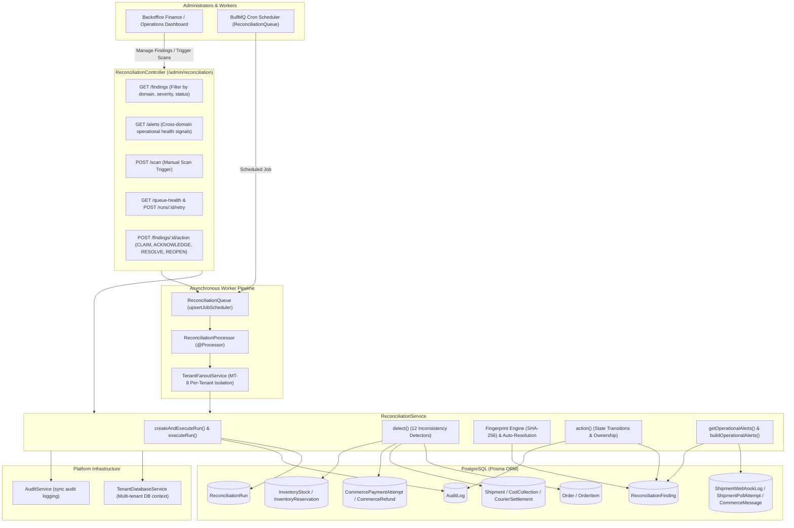
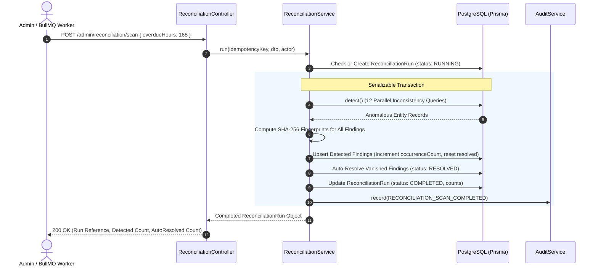
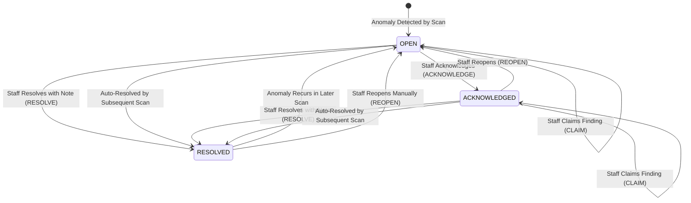

# Reconciliation Feature Architecture & Invariants

## Purpose
The **Reconciliation** module (`reconciliation`) is the automated financial, inventory, and logistics discrepancy detection engine of the platform. It continuously audits cross-domain data invariants between orders, payment gateway transactions, courier delivery confirmations, cash-on-delivery (COD) collections, bank remittances, inventory reservations, and refund ledgers. It generates deduplicated, fingerprinted findings, orchestrates administrative resolution workflows, raises operational alerts, and runs scheduled multi-tenant consistency scans via BullMQ.

---

## Component Architecture



---

## Component Source Map

| Component / File | Symbol / Role | Primary Responsibilities | Key Invariants Enforced |
| :--- | :--- | :--- | :--- |
| [`reconciliation.module.ts`](file:///home/chillpc/MohammadSheakh/projects/26/e-commerce/e-com-nextjs/ferio-nest-prisma/src/features/reconciliation/reconciliation.module.ts) | [`ReconciliationModule`](file:///home/chillpc/MohammadSheakh/projects/26/e-commerce/e-com-nextjs/ferio-nest-prisma/src/features/reconciliation/reconciliation.module.ts#L11-L21) | Module configuration wiring controllers, queue schedulers, processors, and services. | Imports `TenancyModule`, `PrismaModule`, `AuthModule`, `AuditModule`; exports [`ReconciliationService`](file:///home/chillpc/MohammadSheakh/projects/26/e-commerce/e-com-nextjs/ferio-nest-prisma/src/features/reconciliation/services/reconciliation.service.ts#L88-L1159). |
| [`reconciliation.controller.ts`](file:///home/chillpc/MohammadSheakh/projects/26/e-commerce/e-com-nextjs/ferio-nest-prisma/src/features/reconciliation/controllers/reconciliation.controller.ts) | [`ReconciliationController`](file:///home/chillpc/MohammadSheakh/projects/26/e-commerce/e-com-nextjs/ferio-nest-prisma/src/features/reconciliation/controllers/reconciliation.controller.ts#L33-L83) | Administrative endpoints for viewing findings, running scans, monitoring queues, and claiming/resolving issues. | Gated by `AuthGuard`, `RolesGuard('admin')`, `TenantMembershipGuard`, `PermissionsGuard`. Enforces `RECONCILIATION_READ` and `RECONCILIATION_MANAGE`. |
| [`reconciliation.service.ts`](file:///home/chillpc/MohammadSheakh/projects/26/e-commerce/e-com-nextjs/ferio-nest-prisma/src/features/reconciliation/services/reconciliation.service.ts) | [`ReconciliationService`](file:///home/chillpc/MohammadSheakh/projects/26/e-commerce/e-com-nextjs/ferio-nest-prisma/src/features/reconciliation/services/reconciliation.service.ts#L88-L1159) | Core scanning engine, 12 consistency detectors, fingerprint deduplication, auto-resolution, and alert aggregation. | Executes in `Prisma.TransactionIsolationLevel.Serializable`; auto-resolves vanished findings; enforces SHA-256 idempotency locks. |
| [`reconciliation.queue.ts`](file:///home/chillpc/MohammadSheakh/projects/26/e-commerce/e-com-nextjs/ferio-nest-prisma/src/features/reconciliation/queues/reconciliation.queue.ts) | [`ReconciliationQueue`](file:///home/chillpc/MohammadSheakh/projects/26/e-commerce/e-com-nextjs/ferio-nest-prisma/src/features/reconciliation/queues/reconciliation.queue.ts#L21-L145) | Manages BullMQ job scheduling (`RECONCILIATION_SCAN_JOB`), retry enqueuing, and queue telemetry inspection. | Upserts recurring job scheduler `ferio-reconciliation-scan` upon module initialization. |
| [`reconciliation.processor.ts`](file:///home/chillpc/MohammadSheakh/projects/26/e-commerce/e-com-nextjs/ferio-nest-prisma/src/features/reconciliation/processors/reconciliation.processor.ts) | [`ReconciliationProcessor`](file:///home/chillpc/MohammadSheakh/projects/26/e-commerce/e-com-nextjs/ferio-nest-prisma/src/features/reconciliation/processors/reconciliation.processor.ts#L12-L68) | BullMQ worker consuming reconciliation jobs and coordinating multi-tenant fanout. | Wraps execution in `runWithCorrelationId`; leverages `TenantFanoutService.forEachTenant` to isolate per-tenant scan failures. |
| [`reconciliation.dto.ts`](file:///home/chillpc/MohammadSheakh/projects/26/e-commerce/e-com-nextjs/ferio-nest-prisma/src/features/reconciliation/dto/reconciliation.dto.ts) | DTO Validation Contracts | Class-validator schemas for querying findings, triggering scans (`overdueHours` 24–2160), and executing actions. | Enforces valid domain enums, severities, statuses, and action constraints. |
| [`operational-alert.util.ts`](file:///home/chillpc/MohammadSheakh/projects/26/e-commerce/e-com-nextjs/ferio-nest-prisma/src/features/reconciliation/utils/operational-alert.util.ts) | [`buildOperationalAlerts`](file:///home/chillpc/MohammadSheakh/projects/26/e-commerce/e-com-nextjs/ferio-nest-prisma/src/features/reconciliation/utils/operational-alert.util.ts#L21-L33) | Ranks operational health signals by severity (`CRITICAL` > `HIGH` > `MEDIUM`) and age. | Filters out zero-count signals; sorts oldest unresolved alarms first within identical severity tiers. |
| [`reconciliation.prisma`](file:///home/chillpc/MohammadSheakh/projects/26/e-commerce/e-com-nextjs/ferio-nest-prisma/prisma/schema/reconciliation.module/reconciliation.prisma) | Data Models | Prisma schema definitions for `ReconciliationFinding` and `ReconciliationRun`. | Enforces unique `fingerprint`, unique `idempotencyKeyHash`, and multi-column indexes for operational filtering. |

---

## Responsibilities

### Owns
- **Cross-Domain Anomaly Detection**: Executing 12 automated checks across inventory stock, order payments, courier delivery statuses, COD disbursements, and refunds.
- **Finding Fingerprinting & Deduplication**: Computing deterministic SHA-256 fingerprints (`sha256(type:entityType:entityId)`) to avoid duplicate finding records across consecutive scans.
- **Automatic Finding Resolution**: Automatically transitioning active findings (`OPEN`, `ACKNOWLEDGED`) to `RESOLVED` when the anomalous condition is no longer detected in the database.
- **Recurring Finding Reopening**: Automatically transitioning previously `RESOLVED` findings back to `OPEN` if the condition reappears, resetting prior resolution notes.
- **Finding Action Lifecycle**: Managing administrative ownership, acknowledgment, manual resolution, and reopening with structured audit notes.
- **Multi-Tenant Scan Fanout**: Scheduling and executing isolated background scans across all active platform tenants via BullMQ and `TenantFanoutService`.
- **Operational Health Alert Synthesis**: Aggregating 24-hour operational warning signals across critical findings, unknown payments, stalled courier webhooks, poll failures, and blocked SMS outbox messages.

### Does Not Own
- **Automatic Data Repair (Auto-Healing)**: Does not automatically debit customer accounts, alter inventory counts, or trigger payment gateway refunds; it acts strictly as an observational audit and detection probe.
- **Payment Processing**: Gateway communication and webhook handling are owned by `CommercePaymentsModule`.
- **Courier Logistics**: Courier consignment creation and tracking polls are owned by `ShippingModule`.
- **Stock Movements**: Inventory reservation consumption and stock replenishment are owned by `OrderModule` and `InventoryModule`.

---

## Dependencies

### Consumes
- **[`TenantDatabaseService`](file:///home/chillpc/MohammadSheakh/projects/26/e-commerce/e-com-nextjs/ferio-nest-prisma/src/tenancy/services/tenant-db.service.ts)**: Dynamic multi-tenant database connection routing.
- **[`TenantFanoutService`](file:///home/chillpc/MohammadSheakh/projects/26/e-commerce/e-com-nextjs/ferio-nest-prisma/src/tenancy/services/tenant-fanout.service.ts)**: Executes per-tenant job iteration in background workers.
- **[`AuditService`](file:///home/chillpc/MohammadSheakh/projects/26/e-commerce/e-com-nextjs/ferio-nest-prisma/src/features/audit/services/audit.service.ts)**: Records synchronous audit trail entries for scan completions, failures, and administrative actions.
- **`BullMQ` (`@nestjs/bullmq`)**: Job queue infrastructure on `QUEUE_NAMES.RECONCILIATION`.
- **`ConfigService`**: Reads schedule flags (`RECONCILIATION_SCHEDULE_ENABLED`, `RECONCILIATION_SCHEDULE_EVERY_MINUTES`, `RECONCILIATION_OVERDUE_HOURS`).

### Emitters
- **Audit Logs**: Emits `RECONCILIATION_SCAN_COMPLETED`, `RECONCILIATION_SCAN_FAILED`, `RECONCILIATION_FINDING_CLAIM`, `RECONCILIATION_FINDING_ACKNOWLEDGE`, `RECONCILIATION_FINDING_RESOLVE`, and `RECONCILIATION_FINDING_REOPEN`.

---

## Database Ownership

### Direct Writes / Mutates
| Entity | Nature of Mutation | Context / Trigger |
| :--- | :--- | :--- |
| `ReconciliationRun` | Insert, Update | Created on manual, scheduled, or retry trigger; updated with start times, counts (`detected`, `opened`, `autoResolved`), completion status, and error traces. |
| `ReconciliationFinding` | Upsert, Bulk Update | Upserted by fingerprint during scan; updated on admin actions (`CLAIM`, `ACKNOWLEDGE`, `RESOLVE`, `REOPEN`); bulk updated to `RESOLVED` when conditions disappear. |
| `AuditLog` | Insert | Emitted on scan execution outcomes and finding action transitions. |

### Reads / References
| Entity | Detection Purpose |
| :--- | :--- |
| `Shipment` | Checks delivered shipments missing COD collection expectations; checks RTO shipments with positive collections. |
| `CodCollection` | Audits overdue settlements ($> \text{overdueHours}$), collected vs expected amount variances. |
| `CourierSettlement` | Audits bank remittance variances between courier invoices and received funds. |
| `Order` | Checks paid COD orders lacking collection evidence; checks prepaid orders marked `PAID` without succeeded payments. |
| `CommercePaymentAttempt` | Checks succeeded gateway payments where orders were never marked `PAID`; verifies payment amounts match order totals. |
| `InventoryReservation` | Detects orphaned `ACTIVE` reservations attached to terminal orders (`DELIVERED`, `CANCELLED`). |
| `InventoryStock` | Validates stock invariants: negative values on `onHand`, `reserved`, `damaged`, `incoming`, or $\text{reserved} + \text{damaged} > \text{onHand}$. |
| `CommerceRefund` | Detects pending/processing refunds older than the overdue threshold. |
| `ShipmentWebhookLog` | Aggregates unhandled webhook errors and stalled unprocessed callbacks ($> 15$ min). |
| `ShipmentPollAttempt` | Counts failed polling attempts over rolling 24-hour windows. |
| `CommerceMessage` | Counts blocked or failed transactional SMS/email dispatches. |

---

## The 12 Inconsistency Detectors

The [`detect()`](file:///home/chillpc/MohammadSheakh/projects/26/e-commerce/e-com-nextjs/ferio-nest-prisma/src/features/reconciliation/services/reconciliation.service.ts#L750-L1118) method executes 12 specialized consistency checks:

| Code / Type | Domain | Severity | Condition Evaluated |
| :--- | :--- | :--- | :--- |
| `PREPAID_UNVERIFIED_PAID_ORDER` | `PAYMENT` | `CRITICAL` | Order has `paymentMethod = 'PREPAID'` and `paymentStatus = 'PAID'`, but zero `SUCCEEDED` payment attempts exist. |
| `PREPAID_PAYMENT_STATE_MISMATCH` | `PAYMENT` | `CRITICAL` | A `CommercePaymentAttempt` is `SUCCEEDED`, but the associated `Order.paymentStatus !== 'PAID'`. |
| `PREPAID_AMOUNT_MISMATCH` | `PAYMENT` | `CRITICAL` | Succeeded payment attempt amount does not match `Order.total`. |
| `DELIVERED_COD_MISSING_COLLECTION` | `SHIPPING` | `CRITICAL` | A COD `Shipment` is marked `DELIVERED`, but no `CodCollection` tracking record exists. |
| `OVERDUE_COD_COLLECTION` | `SETTLEMENT` | `HIGH` | `CodCollection.status = 'EXPECTED'` and `expectedAt < NOW() - overdueHours`. |
| `RTO_WITH_COLLECTION` | `PAYMENT` | `CRITICAL` | `Shipment` status is `RTO` or `RETURNED`, but `CodCollection.collectedAmount > 0`. |
| `COD_COLLECTION_VARIANCE` | `SETTLEMENT` | `HIGH` | `CodCollection.status = 'VARIANCE'` (courier collected different amount than expected). |
| `COURIER_SETTLEMENT_VARIANCE` | `SETTLEMENT` | `HIGH` | `CourierSettlement.status = 'VARIANCE'` (bank remittance does not match settlement batch). |
| `COD_PAYMENT_STATE_MISMATCH` | `PAYMENT` | `HIGH` / `CRITICAL` | (1) Full COD collected but order remains unpaid; or (2) Order marked `PAID` without settled collection evidence. |
| `TERMINAL_ORDER_ACTIVE_RESERVATION` | `INVENTORY` | `CRITICAL` | `InventoryReservation` is `ACTIVE`, but parent order is in terminal state (`DELIVERED` or `CANCELLED`). |
| `INVALID_STOCK_BALANCE` | `INVENTORY` | `CRITICAL` | Negative stock quantities, or $\text{reserved} + \text{damaged} > \text{onHand}$. |
| `AGED_PENDING_REFUND` | `REFUND` | `HIGH` | Refund in `PENDING`, `PROCESSING`, or `REQUIRES_ACTION` created $> \text{overdueHours}$ ago. |

---

## Important Invariants

### 1. Serializable Isolation on Scan Execution
- Scans run within `Prisma.TransactionIsolationLevel.Serializable` transactions.
- All detection reads, finding upserts, and auto-resolutions happen atomically. If concurrent orders or stock changes interfere, transaction aborts cleanly, records `ReconciliationRun.status = 'FAILED'`, and allows idempotent retry.

### 2. Fingerprint Determinism & Auto-Resolution
- Finding fingerprint:
  $$\text{fingerprint} = \text{SHA256}(\text{type} + \text{":"} + \text{entityType} + \text{":"} + \text{entityId})$$
- **Auto-Resolution**: Any existing finding matching the 12 scanned types whose fingerprint is **not** detected in the current scan and whose `lastSeenAt < startedAt` is automatically marked `RESOLVED` with `resolutionNote: 'Condition no longer detected by reconciliation scan'`.
- **Reopening**: If an entity produces a fingerprint previously marked `RESOLVED`, it is automatically set to `OPEN`, incrementing `occurrenceCount` and wiping resolution metadata.

### 3. Action State Transition Guardrails
- An action on a finding requires `note` (3 to 1,000 characters).
- Cannot `ACKNOWLEDGE` or `RESOLVE` an already `RESOLVED` finding (throws `ConflictException`).
- A `RESOLVED` finding must be explicitly transitioned via `REOPEN` before new acknowledgment notes can be appended.

### 4. Overdue Lookback Windows
- `overdueHours` parameter is strictly bounded between $24$ and $2160$ hours (1 to 90 days), defaulting to $168$ hours (7 days).

---

## Public API & Entry Points

All routes are mounted under `/admin/reconciliation`.

| Method | Endpoint | Guards & Auth | Description | Inputs / Payload | Response Payload |
| :--- | :--- | :--- | :--- | :--- | :--- |
| `GET` | `/findings` | `AuthGuard`, `RolesGuard('admin')`, `PermissionsGuard(RECONCILIATION_READ)`, `TenantMembershipGuard` | Paginated search of inconsistency findings filtered by domain, severity, and status. | Query: [`ReconciliationQueryDto`](file:///home/chillpc/MohammadSheakh/projects/26/e-commerce/e-com-nextjs/ferio-nest-prisma/src/features/reconciliation/dto/reconciliation.dto.ts#L23-L49) | `{ items, total, page, limit, totalPages, summary: { OPEN, ACKNOWLEDGED, RESOLVED } }` |
| `GET` | `/alerts` | `AuthGuard`, `RolesGuard('admin')`, `PermissionsGuard(RECONCILIATION_READ)`, `TenantMembershipGuard` | Operational alert cockpit aggregating 24h health signals across findings, payments, webhooks, and queues. | None | `{ generatedAt, alerts: [...], summary: { total, critical, high, medium } }` |
| `POST` | `/scan` | `AuthGuard`, `RolesGuard('admin')`, `PermissionsGuard(RECONCILIATION_MANAGE)`, `TenantMembershipGuard` | Triggers a synchronous reconciliation scan for the tenant. | Headers: `idempotency-key`<br/>Body: [`RunReconciliationDto`](file:///home/chillpc/MohammadSheakh/projects/26/e-commerce/e-com-nextjs/ferio-nest-prisma/src/features/reconciliation/dto/reconciliation.dto.ts#L50-L58) | Completed `ReconciliationRun` record |
| `GET` | `/queue-health` | `AuthGuard`, `RolesGuard('admin')`, `PermissionsGuard(RECONCILIATION_READ)`, `TenantMembershipGuard` | BullMQ queue depths, scheduled cron metadata, and 24h scan success rate statistics. | None | `{ available, counts, scheduler, operations, recentRuns }` |
| `POST` | `/runs/:id/retry` | `AuthGuard`, `RolesGuard('admin')`, `PermissionsGuard(RECONCILIATION_MANAGE)`, `TenantMembershipGuard` | Enqueues a retry for a failed reconciliation run. | Param: `id` | `{ runId, jobId, status: 'QUEUED' }` |
| `POST` | `/findings/:id/action` | `AuthGuard`, `RolesGuard('admin')`, `PermissionsGuard(RECONCILIATION_MANAGE)`, `TenantMembershipGuard` | Executes operational action (`CLAIM`, `ACKNOWLEDGE`, `RESOLVE`, `REOPEN`) on a finding. | Param: `id`<br/>Body: [`ReconciliationActionDto`](file:///home/chillpc/MohammadSheakh/projects/26/e-commerce/e-com-nextjs/ferio-nest-prisma/src/features/reconciliation/dto/reconciliation.dto.ts#L59-L67) | Updated `ReconciliationFinding` |

---

## Important Flows

### 1. Reconciliation Scan & Auto-Resolution Pipeline



### 2. Finding Lifecycle State Machine



---

## Brutal Honest Vulnerabilities & Architectural Debt

### 1. Full-Table Scans Inside a Serializable Transaction
- **Issue**: [`detect()`](file:///home/chillpc/MohammadSheakh/projects/26/e-commerce/e-com-nextjs/ferio-nest-prisma/src/features/reconciliation/services/reconciliation.service.ts#L750-L865) executes twelve large `findMany` queries spanning core transactional tables (`Shipment`, `CodCollection`, `CourierSettlement`, `Order`, `InventoryReservation`, `InventoryStock`, `CommerceRefund`, and `CommercePaymentAttempt`) inside a single `Prisma.TransactionIsolationLevel.Serializable` block.
- **Consequence**: Under medium to high order volume, serializable isolation acquires heavy predicate locks across multiple tables. Concurrent transactions (such as customer checkouts, courier callbacks, or inventory reservations) frequently trigger PostgreSQL serialization failures (`P2034`), causing scan crashes or degraded checkout throughput.
- **Remediation**:
  - Run the detection probes using `ReadCommitted` isolation on a read-replica database.
  - Apply the resulting finding upserts and auto-resolutions in a separate, lightweight write transaction.

### 2. In-Memory `InventoryStock` Filtering
- **Issue**: Line 819 fetches every `InventoryStock` record into Node.js heap memory:
  ```typescript
  transaction.inventoryStock.findMany({ select: { id: true, onHand: true, reserved: true, damaged: true, incoming: true, ... } })
  ```
  It then filters for invalid balances in JavaScript:
  ```typescript
  stocks.filter(entry => entry.onHand < 0 || entry.reserved < 0 || entry.reserved + entry.damaged > entry.onHand)
  ```
- **Consequence**: On a store catalog with 100,000 SKU/warehouse stock records, loading every stock row into memory balloons process heap usage by hundreds of megabytes on every scan, risking process OOM crashes.
- **Remediation**: Push the validation filter directly into PostgreSQL using raw SQL or Prisma `OR` conditions:
  ```sql
  WHERE "onHand" < 0 OR "reserved" < 0 OR "damaged" < 0 OR ("reserved" + "damaged") > "onHand"
  ```

### 3. Lack of Automated Remediation (Purely Observational)
- **Issue**: The reconciliation service only logs findings into `ReconciliationFinding`. It has no automated remediation actions for trivial, well-understood errors (e.g., releasing an `ACTIVE` reservation on a delivered order, or re-verifying a pending payment against the gateway).
- **Consequence**: Human operators are required to manually investigate and resolve every finding, causing ticket backlogs and operational fatigue.
- **Remediation**: Implement safe, automated self-healing workers for deterministic anomalies (e.g., auto-releasing expired terminal reservations or triggering automated payment status syncs).

### 4. Sequential Multi-Tenant Fanout Bottlenecks
- **Issue**: In [`ReconciliationProcessor`](file:///home/chillpc/MohammadSheakh/projects/26/e-commerce/e-com-nextjs/ferio-nest-prisma/src/features/reconciliation/processors/reconciliation.processor.ts#L55-L65), `this.fanout.forEachTenant` runs scheduled scans across all active tenants sequentially within a single BullMQ job.
- **Consequence**: As tenant count grows to dozens or hundreds, the total scan duration can easily exceed the 60-minute scheduler interval, causing queue job pile-up and delayed detection.
- **Remediation**: Fan out by enqueuing individual BullMQ child jobs per tenant (`run-reconciliation-scan-tenant`) rather than executing a monolithic loop in a single worker job.

### 5. Fingerprint Context Collapsing
- **Issue**: Finding fingerprint calculation is:
  ```typescript
  createHash('sha256').update(`${finding.type}:${finding.entityType}:${finding.entityId}`).digest('hex');
  ```
- **Consequence**: If an order or shipment encounters a new variance or changed discrepancy details over time, the upsert overwrites the `context` JSON payload with the latest scan snapshot, completely erasing historical context from when the issue was first detected.
- **Remediation**: Maintain an audit history table `ReconciliationFindingHistory` to track context evolution over time.
