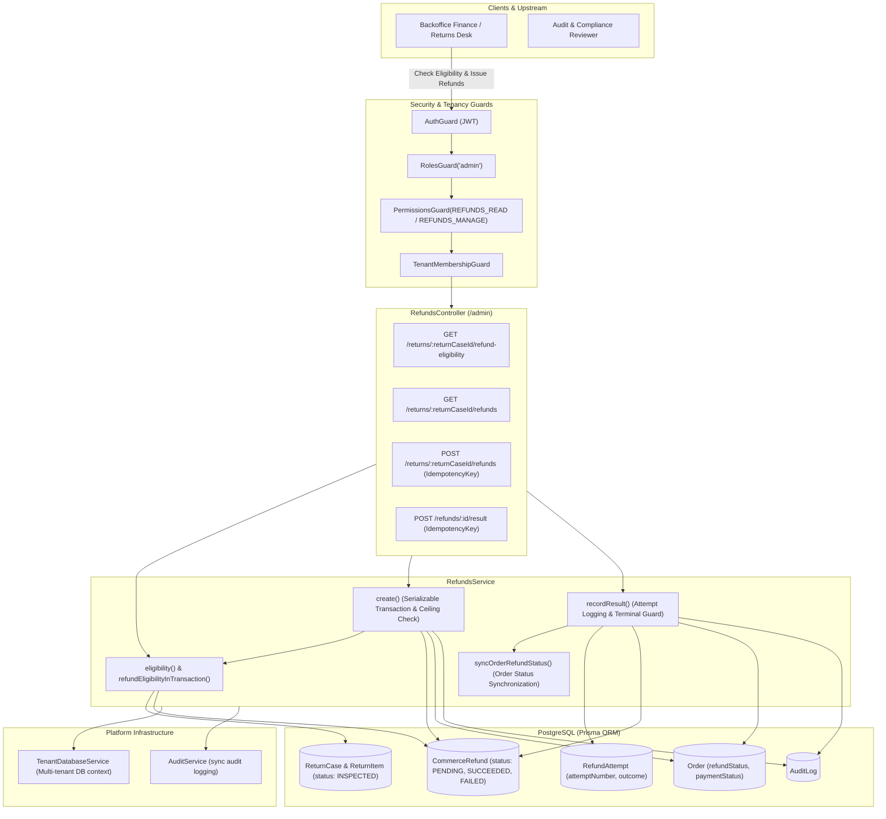
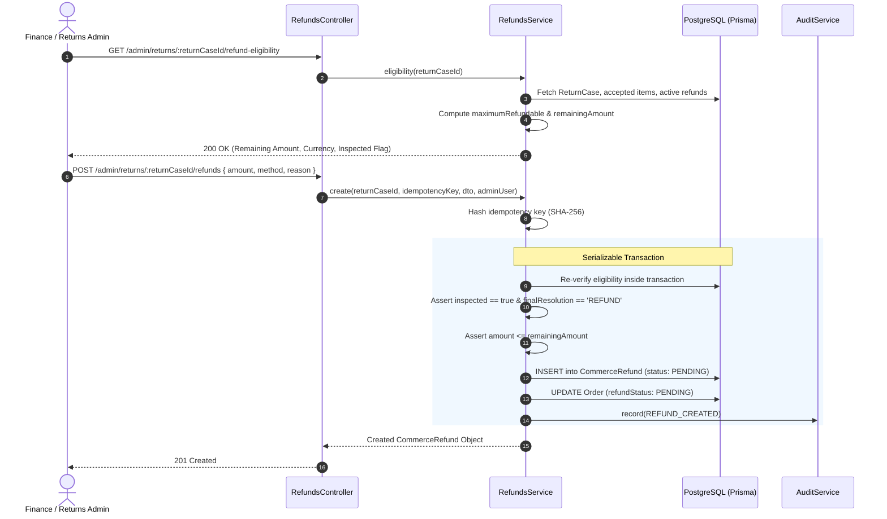
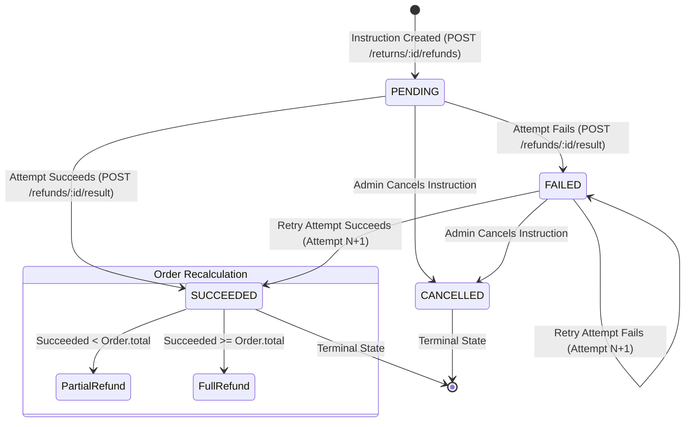

# Refunds Feature Architecture & Invariants

## Purpose
The **Refunds** module (`refunds`) governs the financial reversal and disbursement lifecycle for returned merchandise. It enforces strict mathematical refund eligibility bounds based on physical inspection outcomes, prevents double-refunding across concurrent administrator claims, tracks multi-attempt payment execution results (manual cash, bank wire, bKash, Nagad, Rocket, or original payment gateway reversal), reconciles parent order refund statuses, and records synchronous audit logs for every state transition.

---

## Component Architecture

---

## Component Source Map

| Component / File | Symbol / Role | Primary Responsibilities | Key Invariants Enforced |
| :--- | :--- | :--- | :--- |
| [`refunds.module.ts`](file:///home/chillpc/MohammadSheakh/projects/26/e-commerce/e-com-nextjs/ferio-nest-prisma/src/features/refunds/refunds.module.ts) | [`RefundsModule`](file:///home/chillpc/MohammadSheakh/projects/26/e-commerce/e-com-nextjs/ferio-nest-prisma/src/features/refunds/refunds.module.ts#L9-L14) | Feature module definition configuring controllers, dependencies, and services. | Imports `TenancyModule`, `PrismaModule`, `AuthModule`, and `AuditModule`; exports [`RefundsService`](file:///home/chillpc/MohammadSheakh/projects/26/e-commerce/e-com-nextjs/ferio-nest-prisma/src/features/refunds/services/refunds.service.ts#L38-L381). |
| [`refunds.controller.ts`](file:///home/chillpc/MohammadSheakh/projects/26/e-commerce/e-com-nextjs/ferio-nest-prisma/src/features/refunds/controllers/refunds.controller.ts) | [`RefundsController`](file:///home/chillpc/MohammadSheakh/projects/26/e-commerce/e-com-nextjs/ferio-nest-prisma/src/features/refunds/controllers/refunds.controller.ts#L27-L65) | Administrative HTTP endpoints for calculating eligibility, creating refunds, and recording attempt outcomes. | Enforces `AuthGuard`, `RolesGuard('admin')`, `TenantMembershipGuard`, and granular permissions (`REFUNDS_READ`, `REFUNDS_MANAGE`). |
| [`refunds.service.ts`](file:///home/chillpc/MohammadSheakh/projects/26/e-commerce/e-com-nextjs/ferio-nest-prisma/src/features/refunds/services/refunds.service.ts) | [`RefundsService`](file:///home/chillpc/MohammadSheakh/projects/26/e-commerce/e-com-nextjs/ferio-nest-prisma/src/features/refunds/services/refunds.service.ts#L38-L381) | Core financial orchestrator calculating remaining refundable ceilings, creating bounded instructions, appending attempt logs, and synchronizing order statuses. | Enforces `Serializable` transactions, SHA-256 idempotency locks, inspection prerequisites, and order refund state recalculations. |
| [`refund.dto.ts`](file:///home/chillpc/MohammadSheakh/projects/26/e-commerce/e-com-nextjs/ferio-nest-prisma/src/features/refunds/dto/refund.dto.ts) | DTO Validation Contracts | Class-validator transfer objects for refund creation and execution results. | Enforces refund method enums (`ORIGINAL_PAYMENT`, `BANK_TRANSFER`, `BKASH`, `NAGAD`, `ROCKET`, `CASH`, `OTHER`), execution modes (`MANUAL`, `PROVIDER`), and outcomes (`SUCCEEDED`, `FAILED`). |
| [`refund.prisma`](file:///home/chillpc/MohammadSheakh/projects/26/e-commerce/e-com-nextjs/ferio-nest-prisma/prisma/schema/refund.module/refund.prisma) | Data Models | Prisma schema definitions for `CommerceRefund` and `RefundAttempt`. | Declares unique `reference`, unique `idempotencyKeyHash`, composite unique `@@unique([refundId, attemptNumber])`, and relation to `ReturnCase` and `Order`. |
| [`refunds.service.spec.ts`](file:///home/chillpc/MohammadSheakh/projects/26/e-commerce/e-com-nextjs/ferio-nest-prisma/src/features/refunds/tests/refunds.service.spec.ts) | Service Unit Spec | Validates eligibility calculation, instruction creation, and attempt recording. | Asserts ceiling boundaries, terminal state blocks, and order status transitions. |
| [`refunds.tenant-isolation.spec.ts`](file:///home/chillpc/MohammadSheakh/projects/26/e-commerce/e-com-nextjs/ferio-nest-prisma/src/features/refunds/tests/refunds.tenant-isolation.spec.ts) | Tenant Isolation Spec | Asserts that refund queries across different organizations remain strictly partitioned. | Verifies ambient tenant database routing. |

---

## Responsibilities

### Owns
- **Mathematical Refund Eligibility Ceiling**: Computing the maximum refundable amount for a return case based exclusively on warehouse-accepted item quantities:
  $$\text{maximumRefundable} = \sum \left\lfloor \frac{\text{orderItem.lineTotal} \times \text{acceptedQuantity}}{\text{orderItem.quantity}} \right\rfloor$$
- **Remaining Balance Allocation**: Tracking active and completed refunds against a return case to enforce that new refund instructions do not exceed $\text{remainingAmount} = \max(0, \text{maximumRefundable} - \text{reservedAmount})$.
- **Return Resolution Prerequisites**: Asserting that a return case is in status `INSPECTED` with `finalResolution === 'REFUND'` before any disbursement instruction can be created.
- **Idempotency & Concurrency Locks**: Enforcing SHA-256 idempotency key locks on both refund instruction creation and attempt recording inside `Serializable` database transactions.
- **Multi-Attempt Audit Logging**: Preserving immutable history of failed and successful disbursement attempts (`RefundAttempt`) with external transaction references and error details.
- **Parent Order State Synchronization**: Recalculating the parent `Order.refundStatus` (`NONE`, `PENDING`, `PARTIAL`, `REFUNDED`, `FAILED`) and `Order.paymentStatus` (`PARTIALLY_REFUNDED`, `REFUNDED`) based on aggregate succeeded disbursements.

### Does Not Own
- **Return Logistics & Inspection Decisions**: Physical return intake, warehouse inspection, accepted quantity decisions, and fraud assessments are owned by `ReturnsModule`.
- **Payment Gateway API Execution**: Live external API refund requests to providers like SSLCommerz or bKash are executed via `CommercePaymentsModule`; this service records the resulting financial instruction and audit evidence.
- **Customer Return Claims**: Customer RMA submission and return policy evaluation are owned by `CustomerAccountModule` and `ReturnsModule`.

---

## Dependencies

### Consumes
- **[`TenantDatabaseService`](file:///home/chillpc/MohammadSheakh/projects/26/e-commerce/e-com-nextjs/ferio-nest-prisma/src/tenancy/services/tenant-db.service.ts)**: Dynamic database routing ensuring tenant data isolation.
- **[`AuditService`](file:///home/chillpc/MohammadSheakh/projects/26/e-commerce/e-com-nextjs/ferio-nest-prisma/src/features/audit/services/audit.service.ts)**: Synchronous structured audit logging.
- **`ReturnCase` & `ReturnItem` Entities**: Sourced from `ReturnsModule` to determine inspection readiness and accepted return quantities.
- **`Order` Entity**: Sourced from `OrderModule` to read currency, payment method, total, and synchronize refund status.

### Emitters
- **Audit Logs**: Emits `REFUND_CREATED` and `REFUND_RESULT_RECORDED` events containing full before-and-after snapshots and actor metadata.

---

## Database Ownership

### Direct Writes / Mutates
| Entity | Nature of Mutation | Context / Trigger |
| :--- | :--- | :--- |
| `CommerceRefund` | Insert | Created when an admin issues a refund instruction (`POST /admin/returns/:returnCaseId/refunds`). Initial status is `PENDING`. |
| `CommerceRefund` | Update | Updated when an attempt result is recorded (`POST /admin/refunds/:id/result`). Status set to `SUCCEEDED` or `FAILED`; completion metadata and provider references populated. |
| `RefundAttempt` | Insert | Created with sequential `attemptNumber` and unique `deduplicationHash` on each execution attempt. |
| `Order` | Update | `refundStatus` set to `PENDING` upon refund creation; recalculated to `PARTIAL`, `REFUNDED`, or `FAILED` along with `paymentStatus` upon attempt completion. |
| `AuditLog` | Insert | Synchronously records `REFUND_CREATED` and `REFUND_RESULT_RECORDED`. |

### Reads / References
| Entity | Read Purpose |
| :--- | :--- |
| `ReturnCase` | Validates that status is `INSPECTED` and `finalResolution` is `REFUND`. |
| `ReturnItem` & `OrderItem` | Reads `acceptedQuantity`, `quantity`, and `lineTotal` to compute proportional maximum refundable ceiling. |
| `Order` | Reads `paymentMethod`, `currency`, and `total` to validate payment method constraints and calculate partial/full settlement. |

---

## Important Invariants

### 1. Mathematical Refund Ceiling & Non-Negative Balance
- A refund instruction cannot exceed `remainingAmount`.
- Non-cancelled refunds (`status !== 'CANCELLED'`) permanently reserve their balance against `maximumRefundable`.
- Floor division is used on proportional line totals to prevent sub-minor currency fractions from causing financial inflation:
  $$\text{itemRefundable} = \left\lfloor \frac{\text{lineTotal} \times \text{acceptedQuantity}}{\text{quantity}} \right\rfloor$$

### 2. Inspection State Prerequisite
- A refund **cannot be created** unless the parent `ReturnCase` satisfies:
  - `status === 'INSPECTED'`
  - `finalResolution === 'REFUND'`
- Violating this invariant immediately throws `ConflictException('Refund requires an inspected return with refund resolution')`.

### 3. Payment Method Constraints
- If `method === 'ORIGINAL_PAYMENT'`:
  - The parent order **must not be Cash on Delivery** (`paymentMethod !== 'COD'`).
  - A valid `sourcePaymentReference` must be supplied.
  - Violations throw `BadRequestException('Original-payment refunds require a prepaid payment reference')`.

### 4. Terminal State Immutability
- A refund marked `SUCCEEDED` or `CANCELLED` is terminal.
- Calling `POST /admin/refunds/:id/result` on a terminal refund throws `ConflictException('Refund is already terminal')`.
- A failed refund (`FAILED`) can have subsequent retry attempts appended with incrementing `attemptNumber`.

### 5. Idempotent Re-entrancy
- Every creation and result recording requires an `idempotency-key` header (16 to 200 characters).
- Key is hashed with SHA-256 (`idempotencyKeyHash`, `deduplicationHash`).
- Resubmitting the same key returns the previously committed record without double-crediting or creating redundant attempt rows.

### 6. Order Status Recalculation
Upon attempt recording, `syncOrderRefundStatus()` calculates the sum of all `SUCCEEDED` refunds on the order:
- If any refund is in `PENDING`, `PROCESSING`, or `REQUIRES_ACTION` $\rightarrow$ `order.refundStatus = 'PENDING'`.
- Else if $\text{succeededAmount} \ge \text{order.total}$ $\rightarrow$ `order.refundStatus = 'REFUNDED'`, `order.paymentStatus = 'REFUNDED'`.
- Else if $\text{succeededAmount} > 0$ $\rightarrow$ `order.refundStatus = 'PARTIAL'`, `order.paymentStatus = 'PARTIALLY_REFUNDED'`.
- Else if any failed $\rightarrow$ `order.refundStatus = 'FAILED'`, else `'NONE'`.

---

## Public API & Entry Points

All endpoints are mounted under `/admin` and require `AuthGuard`, `RolesGuard('admin')`, and `TenantMembershipGuard`.

| Method | Endpoint | Permissions Required | Description | Inputs / Payload | Response Payload |
| :--- | :--- | :--- | :--- | :--- | :--- |
| `GET` | `/admin/returns/:returnCaseId/refund-eligibility` | `REFUNDS_READ` | Calculates maximum and remaining refundable balances for an inspected return case. | Param: `returnCaseId` | `{ returnCaseId, orderId, currency, paymentMethod, inspected, finalResolution, maximumRefundable, reservedAmount, remainingAmount }` |
| `GET` | `/admin/returns/:returnCaseId/refunds` | `REFUNDS_READ` | Lists all refund instructions and attempt histories for a return case. | Param: `returnCaseId` | Array of `CommerceRefund` with `attempts`, `order`, and `returnCase` |
| `POST` | `/admin/returns/:returnCaseId/refunds` | `REFUNDS_MANAGE` | Issues a bounded refund instruction against an inspected return. | Param: `returnCaseId` Headers: `idempotency-key` Body: [`CreateRefundDto`](file:///home/chillpc/MohammadSheakh/projects/26/e-commerce/e-com-nextjs/ferio-nest-prisma/src/features/refunds/dto/refund.dto.ts#L25-L43) | Created `CommerceRefund` record (`status: PENDING`) |
| `POST` | `/admin/refunds/:id/result` | `REFUNDS_MANAGE` | Records the outcome of an execution attempt (manual or provider) for a refund instruction. | Param: `id` Headers: `idempotency-key` Body: [`RecordRefundResultDto`](file:///home/chillpc/MohammadSheakh/projects/26/e-commerce/e-com-nextjs/ferio-nest-prisma/src/features/refunds/dto/refund.dto.ts#L45-L70) | Updated `CommerceRefund` record |

---

## Important Flows

### 1. Refund Eligibility & Instruction Issuance Lifecycle

### 2. Refund Attempt State Machine

---

## Brutal Honest Vulnerabilities & Architectural Debt

### 1. Lack of Automated Payment Gateway Integration (Manual Disbursal Dependency)
- **Issue**: While [`RecordRefundResultDto`](file:///home/chillpc/MohammadSheakh/projects/26/e-commerce/e-com-nextjs/ferio-nest-prisma/src/features/refunds/dto/refund.dto.ts#L45-L70) accepts `executionMode: 'PROVIDER'`, the service does not communicate with external gateway APIs (SSLCommerz, bKash, Nagad). It relies exclusively on an administrator manually logging into the gateway web portal, initiating the refund, copying the transaction receipt, and manually posting the result via `POST /admin/refunds/:id/result`.
- **Consequence**: Human operator delays, copy-paste errors in transaction IDs, and manual reconciliation overhead.
- **Remediation**: Wire automated gateway refund handlers directly into `CommercePaymentsModule`, triggering live API refunds and handling callback webhooks.

### 2. Missing Destination Account Verification in DTO
- **Issue**: [`CreateRefundDto`](file:///home/chillpc/MohammadSheakh/projects/26/e-commerce/e-com-nextjs/ferio-nest-prisma/src/features/refunds/dto/refund.dto.ts#L25-L43) validates `amount`, `method`, `reason`, and `sourcePaymentReference`, but **does not capture or validate destination account details** (e.g., bKash wallet number, bank account number, branch routing code).
- **Consequence**: Finance staff must search outside the refund system (e.g., customer support chats or return case notes) to find the customer's payment destination, creating a risk of disbursing funds to wrong accounts.
- **Remediation**: Add structured destination fields (`destinationAccountNumber`, `destinationBankName`, `routingNumber`) validated with account format regexes.

### 3. Delivery Fee Exclusion Discrepancy
- **Issue**: [`eligibility()`](file:///home/chillpc/MohammadSheakh/projects/26/e-commerce/e-com-nextjs/ferio-nest-prisma/src/features/refunds/services/refunds.service.ts#L70-L78) calculates `maximumRefundable` solely based on item line totals:
  $$\text{item.orderItem.lineTotal} \times \text{acceptedQuantity} / \text{quantity}$$
  It excludes delivery fees (`order.deliveryFee`).
- **Consequence**: If an order is returned in full due to a merchant packaging error or broken item on arrival, the store policy may require refunding the shipping fee. However, the system strictly blocks issuing any refund greater than `maximumRefundable`, making it impossible to refund delivery fees through this workflow.
- **Remediation**: Support an optional `includeDeliveryFee` boolean flag on the return case when full returns are approved.

### 4. Dead Directory Scaffolding Debt
- **Issue**: The feature directory contains `processors/`, `queues/`, and `utils/` as completely empty folders.
- **Consequence**: Dead architectural scaffolding from an abandoned BullMQ automated disbursement worker implementation, confusing developers.
- **Remediation**: Clean up empty directories or implement the background BullMQ retry queue.

### 5. Multi-Return Race Condition on Shared Order Total
- **Issue**: Eligibility is calculated per return case (`returnCaseId`), while order status synchronization (`syncOrderRefundStatus`) aggregates across all refunds on the order. If multiple returns exist for the same multi-item order, separate admins could simultaneously initiate refunds. While `Serializable` isolation protects each return case, there is no cross-return lock ensuring the sum of all refunds across all return cases does not exceed the order's original cash collection.
- **Remediation**: Add a constraint in `create()` validating that:
  $$\text{sum}(\text{allOrderRefunds}) + \text{dto.amount} \le \text{order.total}$$
