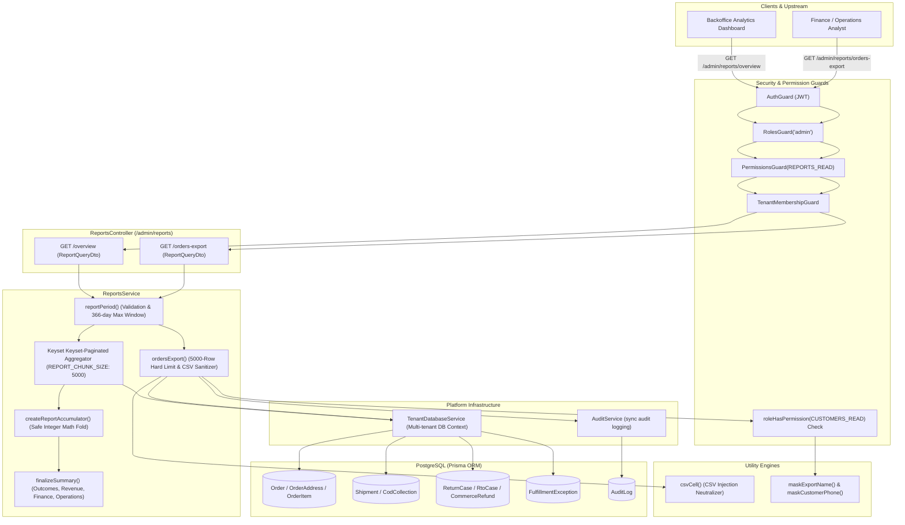
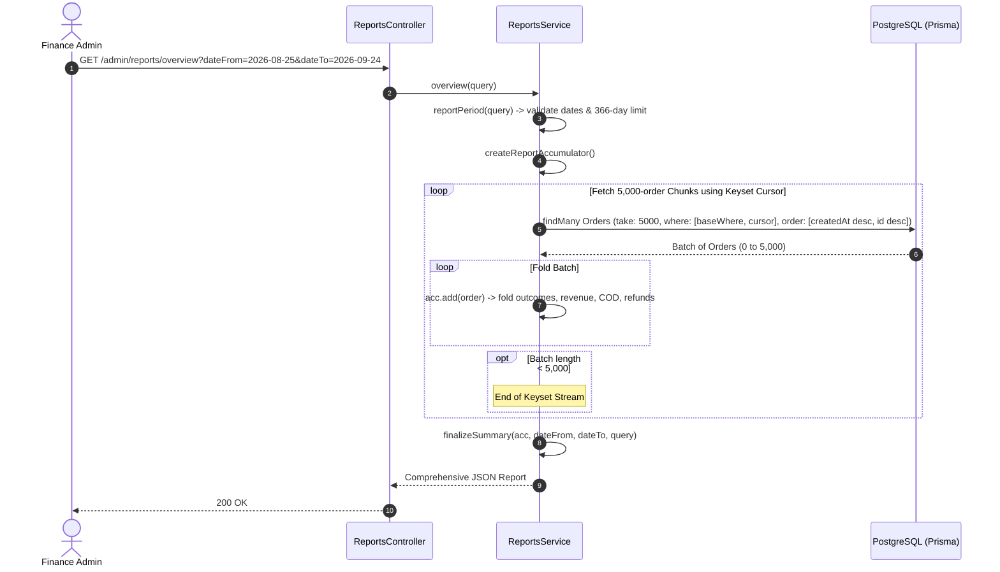
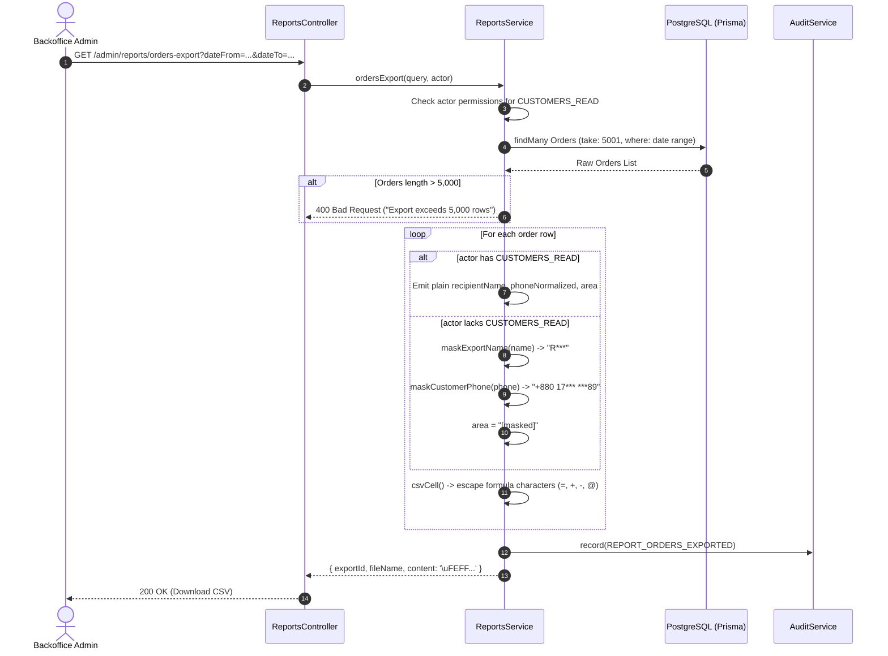

# Reports Feature Architecture & Invariants

## Purpose
The **Reports** module (`reports`) is the operational and financial intelligence engine for store administrators. It provides cohort-based business performance analytics (order volume, gross revenue, net collected revenue, fulfillment exceptions, return rates, return-to-origin costs, and cash-on-delivery settlement tracking) across configurable UTC time ranges (up to 366 days). It also provides a high-security, formula-injection-safe, PII-redacted CSV export pipeline for raw order history with granular permission-based data masking.

---

## Component Architecture



---

## Component Source Map

| Component / File | Symbol / Role | Primary Responsibilities | Key Invariants Enforced |
| :--- | :--- | :--- | :--- |
| [`reports.module.ts`](file:///home/chillpc/MohammadSheakh/projects/26/e-commerce/e-com-nextjs/ferio-nest-prisma/src/features/reports/reports.module.ts) | [`ReportsModule`](file:///home/chillpc/MohammadSheakh/projects/26/e-commerce/e-com-nextjs/ferio-nest-prisma/src/features/reports/reports.module.ts#L9-L14) | Module wiring registering controllers, services, and platform dependencies. | Imports `TenancyModule`, `PrismaModule`, `AuthModule`, `AuditModule`; exports [`ReportsService`](file:///home/chillpc/MohammadSheakh/projects/26/e-commerce/e-com-nextjs/ferio-nest-prisma/src/features/reports/services/reports.service.ts#L259-L590). |
| [`reports.controller.ts`](file:///home/chillpc/MohammadSheakh/projects/26/e-commerce/e-com-nextjs/ferio-nest-prisma/src/features/reports/controllers/reports.controller.ts) | [`ReportsController`](file:///home/chillpc/MohammadSheakh/projects/26/e-commerce/e-com-nextjs/ferio-nest-prisma/src/features/reports/controllers/reports.controller.ts#L23-L35) | Administrative routing for analytical summaries and CSV order data exports. | Enforces `AuthGuard`, `RolesGuard('admin')`, `TenantMembershipGuard`, and `PermissionsGuard(PERMISSIONS.REPORTS_READ)`. |
| [`reports.service.ts`](file:///home/chillpc/MohammadSheakh/projects/26/e-commerce/e-com-nextjs/ferio-nest-prisma/src/features/reports/services/reports.service.ts) | [`ReportsService`](file:///home/chillpc/MohammadSheakh/projects/26/e-commerce/e-com-nextjs/ferio-nest-prisma/src/features/reports/services/reports.service.ts#L259-L590) | Keyset-paginated bounded aggregation, integer-safe currency folding, PII permission checks, and CSV compilation. | Keyset batching (`5,000` chunk size); `Number.isSafeInteger` check; 5,000 export row cap; UTF-8 BOM encoding. |
| [`report-query.dto.ts`](file:///home/chillpc/MohammadSheakh/projects/26/e-commerce/e-com-nextjs/ferio-nest-prisma/src/features/reports/dto/report-query.dto.ts) | [`ReportQueryDto`](file:///home/chillpc/MohammadSheakh/projects/26/e-commerce/e-com-nextjs/ferio-nest-prisma/src/features/reports/dto/report-query.dto.ts#L9-L26) | Query contract for date intervals (`YYYY-MM-DD`), marketing source filters, and courier provider selection. | Validates regex `/^\d{4}-\d{2}-\d{2}$/`, string bounds, and provider enums (`PATHAO`, `STEADFAST`). |
| [`report.util.ts`](file:///home/chillpc/MohammadSheakh/projects/26/e-commerce/e-com-nextjs/ferio-nest-prisma/src/features/reports/utils/report.util.ts) | Security & Math Helpers | Date parsing, 366-day boundary enforcement, CSV cell formula escaping, and unicode name masking. | Neutralizes CSV injection characters (`=`, `+`, `-`, `@`); escapes double-quotes. |
| [`reports.service.spec.ts`](file:///home/chillpc/MohammadSheakh/projects/26/e-commerce/e-com-nextjs/ferio-nest-prisma/src/features/reports/tests/reports.service.spec.ts) | Service Unit Spec | Validates keyset chunking, revenue definitions, PII masking, and row caps. | Asserts that export exceeding 5,000 rows throws `BadRequestException`. |
| [`reports.tenant-isolation.spec.ts`](file:///home/chillpc/MohammadSheakh/projects/26/e-commerce/e-com-nextjs/ferio-nest-prisma/src/features/reports/tests/reports.tenant-isolation.spec.ts) | Multi-Tenant Test | Validates that overview metrics for the same date window remain strictly partitioned by tenant context. | Verifies ambient tenant database routing. |

---

## Responsibilities

### Owns
- **Cohort-Based Order Reporting**: Aggregating business metrics based on the cohort of orders **created** in a UTC date window (`Order.createdAt`), attributing downstream operational outcomes (deliveries, returns, cancellations, refunds) back to that cohort.
- **Keyset-Paginated Bounded Aggregation**: Executing database queries in 5,000-order chunks (`take: 5000`, keyset `createdAt` and `id`) to accumulate metrics in memory without risking Node.js process heap exhaustion.
- **Safe Currency Folding**: Summing money values in minor currency units while asserting `Number.isSafeInteger()` to prevent IEEE 754 precision errors.
- **Formula-Injection-Safe CSV Export**: Sanitizing export cells against Spreadsheet Formula Injection attacks (CWE-1236) by quoting values and prefixing formula characters (`=`, `+`, `-`, `@`) with a single apostrophe (`'`).
- **Granular PII Masking**: Conditionally redacting customer names, phone numbers, and neighborhood areas unless the requesting admin possesses explicit `CUSTOMERS_READ` permissions.
- **Export Row Capping**: Enforcing a strict 5,000-row ceiling on synchronous exports to protect database stability.
- **Export Audit Logging**: Recording `REPORT_ORDERS_EXPORTED` audit events capturing actor ID, row count, date filters, and whether customer details were permitted or masked.

### Does Not Own
- **Real-Time Storefront Analytics**: Pageviews, add-to-cart clicks, and UTM marketing campaign tracking are owned by `StorefrontAnalyticsModule`.
- **Financial Reconciliation Ledgers**: Inconsistency finding detection and bank remittance variance tracking are owned by `ReconciliationModule`.
- **Accounting Books & COGS Management**: Product unit cost tracking, ad spend attribution, and warehouse overhead are owned by accounting systems (indicated by `contribution.status = 'INCOMPLETE'`).

---

## Dependencies

### Consumes
- **[`TenantDatabaseService`](file:///home/chillpc/MohammadSheakh/projects/26/e-commerce/e-com-nextjs/ferio-nest-prisma/src/tenancy/services/tenant-db.service.ts)**: Dynamic database resolution supporting multi-tenant isolation.
- **[`AuditService`](file:///home/chillpc/MohammadSheakh/projects/26/e-commerce/e-com-nextjs/ferio-nest-prisma/src/features/audit/services/audit.service.ts)**: Synchronous structured audit logging.
- **`Order` Entity & Sub-Relations**: Sourced from `OrderModule`, `ShippingModule`, `ReturnsModule`, and `FulfillmentModule`.

### Emitters
- **Audit Logs**: Emits `REPORT_ORDERS_EXPORTED` events.

---

## Database Ownership

### Direct Writes / Mutates
- **`AuditLog`**: Inserts audit trail records upon order export generation.
- The feature is otherwise **read-only**; it never mutates commerce orders, customers, shipments, or stock.

### Reads / References
| Entity | Read Purpose |
| :--- | :--- |
| `Order` | Filters by `createdAt` in `[from, to]`, optional `source`, and `shipment.provider.code`. Reads totals, statuses, and timestamps. |
| `OrderAddress` | Reads `recipientName`, `phoneNormalized`, `district`, and `area` for export generation. |
| `OrderItem` | Reads product name, variant name, SKU, and quantities for export summaries. |
| `Shipment` | Reads `pickedUpAt`, `deliveredAt`, `returnedAt`, `shippingCharge`, and provider metadata. |
| `CodCollection` | Reads `expectedAmount`, `collectedAmount`, `collectionVariance`, and status for COD settlement analytics. |
| `RtoCase` | Reads `totalCost` for calculating aggregate RTO return overhead. |
| `CommerceRefund` | Reads `amount` and `status` to compute succeeded refund totals. |
| `FulfillmentException` | Reads open picking exception counts. |

---

## Important Invariants

### 1. Cohort Attribution Basis
- Every metric in `overview()` is strictly anchored to the cohort of orders whose `createdAt` timestamp falls within the selected UTC interval (`from = dateFrom 00:00:00.000Z`, `to = dateTo 23:59:59.999Z`).
- Later lifecycle events (e.g. an order placed on March 1st that is delivered on March 5th and refunded on March 12th) are attributed back to the March 1st cohort when that period is inspected.

### 2. Date Range Boundaries & 366-Day Cap
- Date inputs must match ISO format `YYYY-MM-DD`.
- Missing `dateTo` defaults to today; missing `dateFrom` defaults to 29 days prior (30-day window).
- If $\text{to} - \text{from} > 366 \text{ days}$, throws `BadRequestException('Report date range cannot exceed 366 days')`.
- If $\text{from} > \text{to}$, throws `BadRequestException('Report date range is invalid')`.

### 3. Keyset-Paginated Bounded Aggregation
- In `overview()`, orders are never loaded in a single unbounded array.
- Scanned in deterministic batches of `5,000` ordered by `[{ createdAt: 'desc' }, { id: 'desc' }]`.
- Successive pages use keyset cursors:
  ```typescript
  { OR: [{ createdAt: { lt: last.createdAt } }, { AND: [{ createdAt: last.createdAt }, { id: { lt: last.id } }] }] }
  ```
- Ensures memory consumption remains constant regardless of whether a merchant has 100 or 500,000 orders.

### 4. Integer-Safe Arithmetic
- Currency aggregation uses `addMoney(current, amount)` asserting `Number.isSafeInteger()`.
- Exceeding JavaScript's safe integer threshold ($9,007,199,254,740,991$) halts execution with `REPORT_MONEY_TOTAL_OUT_OF_RANGE`.

### 5. Formula Injection Neutralization
- Export cells passed to `csvCell()` check for leading execution trigger characters: `= + - @`.
- If matched, the value is prefixed with a single quote (`'`), preventing malicious execution in Excel/Google Sheets.
- Line breaks (`\r\n`) are replaced with single spaces, and quotes are escaped as `""`.
- Prepends UTF-8 Byte Order Mark (`\uFEFF`) to force Excel into UTF-8 decoding mode.

### 6. Dynamic PII Redaction
- If the exporting admin lacks `PERMISSIONS.CUSTOMERS_READ`:
  - `recipient_name` $\rightarrow$ masked using unicode glyph (`maskExportName`, e.g. `R***`).
  - `phone` $\rightarrow$ masked using `maskCustomerPhone` (e.g. `+880 17*** ***89`).
  - `area` $\rightarrow$ replaced with literal string `"[masked]"`.

---

## Public API & Entry Points

All routes are mounted under `/admin/reports` and require `AuthGuard`, `RolesGuard('admin')`, `TenantMembershipGuard`, and `PermissionsGuard(PERMISSIONS.REPORTS_READ)`.

| Method | Endpoint | Permissions Required | Description | Inputs / Payload | Response Payload |
| :--- | :--- | :--- | :--- | :--- | :--- |
| `GET` | `/admin/reports/overview` | `REPORTS_READ` | Keyset-aggregated cohort overview covering outcomes, revenue, finance, and operations. | Query: [`ReportQueryDto`](file:///home/chillpc/MohammadSheakh/projects/26/e-commerce/e-com-nextjs/ferio-nest-prisma/src/features/reports/dto/report-query.dto.ts#L9-L26) (`dateFrom`, `dateTo`, `source`, `provider`) | Bounded summary JSON report (schema below) |
| `GET` | `/admin/reports/orders-export` | `REPORTS_READ` | Generates a UTF-8 BOM CSV export for up to 5,000 orders with role-based PII masking. | Query: [`ReportQueryDto`](file:///home/chillpc/MohammadSheakh/projects/26/e-commerce/e-com-nextjs/ferio-nest-prisma/src/features/reports/dto/report-query.dto.ts#L9-L26) | `{ exportId, fileName, contentType: 'text/csv', content, rowCount, customerFields }` |

### Sample Overview Response Schema
```json
{
  "basis": {
    "dateFrom": "2026-08-25",
    "dateTo": "2026-09-24",
    "timezone": "UTC",
    "dateField": "Order.createdAt",
    "description": "Cohort of orders created during the selected UTC dates; later outcomes are attributed back to that cohort.",
    "filters": { "source": null, "provider": null }
  },
  "outcomes": {
    "placed": 1250,
    "confirmed": 1180,
    "shipped": 1140,
    "delivered": 1080,
    "cancelled": 70,
    "returned": 25,
    "returnCases": 32,
    "rto": 35
  },
  "revenue": {
    "currency": "BDT",
    "grossPlaced": 3125000,
    "grossConfirmed": 2950000,
    "grossDelivered": 2700000,
    "knownCollected": 2650000,
    "netOfRefund": 2635000,
    "definitions": {
      "grossPlaced": "Order total for every order in the cohort.",
      "grossConfirmed": "Order total for cohort orders with a recorded confirmation timestamp.",
      "grossDelivered": "Order total for cohort orders with a delivered order or shipment outcome.",
      "knownCollected": "Order total only where the internal order payment status is PAID.",
      "netOfRefund": "Gross delivered less succeeded refund ledger amounts for delivered cohort orders."
    }
  },
  "finance": {
    "paymentStatus": [{ "value": "PAID", "count": 1060 }, { "value": "UNPAID", "count": 190 }],
    "refundStatus": [{ "value": "NONE", "count": 1220 }, { "value": "REFUNDED", "count": 30 }],
    "refundAffectedOrders": 30,
    "refundAmount": 65000,
    "rtoCost": 7000,
    "codExpectedAmount": 2200000,
    "codSettlementAmount": 2185000,
    "codCollectionVariance": -15000,
    "unresolvedCodCollections": 15,
    "codCollectionVariances": 2,
    "settlementModelAvailable": true
  },
  "operations": {
    "pendingConfirmation": 12,
    "readyForFulfillment": 18,
    "openFulfillmentExceptions": 3,
    "deliveryExceptions": 8,
    "rto": 35
  },
  "contribution": {
    "status": "INCOMPLETE",
    "value": null,
    "label": "Contribution unavailable",
    "missingInputs": [
      "approved product cost source",
      "acquisition cost allocation",
      "packaging cost",
      "courier subsidy allocation",
      "approved return and RTO cost allocation policy",
      "messaging cost allocation"
    ]
  },
  "dimensions": {
    "sources": [{ "value": "DIRECT", "count": 800 }, { "value": "FACEBOOK", "count": 450 }],
    "providers": [{ "value": "PATHAO", "count": 750 }, { "value": "STEADFAST", "count": 390 }]
  }
}
```

---

## Important Flows

### 1. Keyset-Paginated Bounded Aggregation Flow



### 2. CSV Export & PII Redaction Pipeline



---

## Brutal Honest Vulnerabilities & Architectural Debt

### 1. In-Memory String Concatenation for CSV Exports
- **Issue**: [`ordersExport()`](file:///home/chillpc/MohammadSheakh/projects/26/e-commerce/e-com-nextjs/ferio-nest-prisma/src/features/reports/services/reports.service.ts#L330-L491) constructs the entire CSV in Node.js memory:
  ```typescript
  content: `\uFEFF${headers.map(csvCell).join(',')}\r\n${rows.join('\r\n')}`
  ```
  It returns the full string directly inside the JSON response payload (`content: string`).
- **Consequence**: For 5,000 multi-item orders, building a 5MB–10MB string, duplicating it during JSON serialization, and sending it as an unstreamed HTTP body spikes the Node.js V8 heap and stalls the event loop.
- **Remediation**: Stream the CSV directly using an HTTP chunked `ReadableStream` (`res.setHeader('Content-Type', 'text/csv')`), or offload large exports to a background BullMQ job that uploads the CSV to private S3 storage and emails a pre-signed download link.

### 2. Direct OLTP Database Analytical Contention
- **Issue**: Both `overview()` and `ordersExport()` query raw transactional tables (`Order`, `OrderItem`, `Shipment`, `CodCollection`, `CommerceRefund`) with deep nested relation selects on the primary operational PostgreSQL database.
- **Consequence**: When store owners run reports across 6-month or 1-year windows during business hours, heavy sequential scans and keyset iterations compete with live checkout transactions and payment webhooks for buffer cache and connection pool slots.
- **Remediation**: Route analytical reporting queries to a read-replica database, or maintain daily pre-aggregated rollup tables (`DailyOrderMetrics`).

### 3. Hardcoded Courier Provider Enum in DTO
- **Issue**: [`ReportQueryDto.provider`](file:///home/chillpc/MohammadSheakh/projects/26/e-commerce/e-com-nextjs/ferio-nest-prisma/src/features/reports/dto/report-query.dto.ts#L24-L25) is strictly validated as:
  ```typescript
  @IsIn(['PATHAO', 'STEADFAST'])
  provider?: 'PATHAO' | 'STEADFAST';
  ```
- **Consequence**: If the platform integrates additional courier providers (e.g. RedX, eCourier, Paperfly) or in-house delivery fleets, reporting filters cannot query them without modifying and redeploying the backend DTO code.
- **Remediation**: Replace static enum validation with dynamic provider lookup or generic string length constraints.

### 4. Rigid 5,000-Row Export Barrier
- **Issue**: If a query returns 5,001 rows, the export immediately aborts with `BadRequestException('Export exceeds 5,000 rows; narrow the date or report filters.')`.
- **Consequence**: Large merchants cannot download comprehensive quarterly or annual order records without painstakingly executing dozens of fragmented weekly or daily export queries.
- **Remediation**: Implement an asynchronous export queue worker (`ExportProcessor`) supporting streaming ZIP/CSV generation up to 500,000 rows.

### 5. Incomplete Contribution Margin Model
- **Issue**: The `contribution` section in the summary report explicitly returns `status: 'INCOMPLETE'` and `value: null` due to missing COGS, courier subsidies, and advertising cost data.
- **Consequence**: Store owners cannot calculate true net profit or unit economics directly within the platform.
- **Remediation**: Build an accounting module capturing product supplier cost histories and ad-spend ledger allocations.
