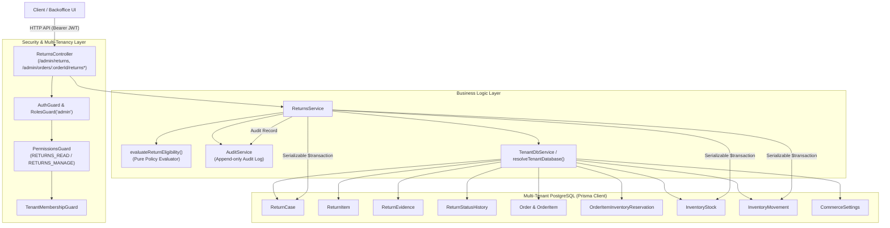
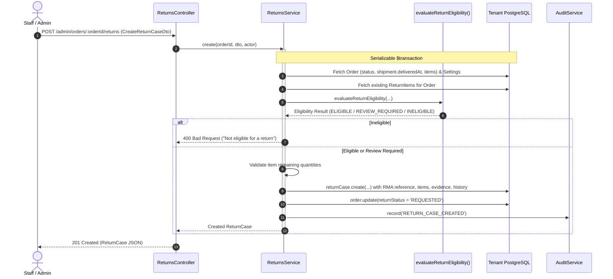
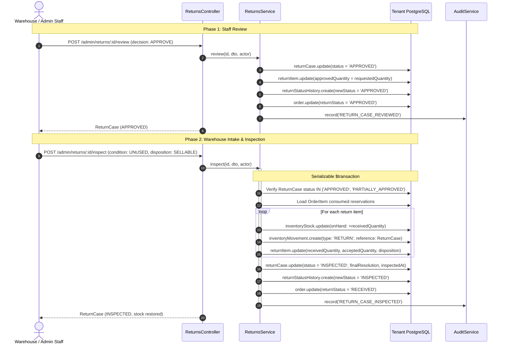
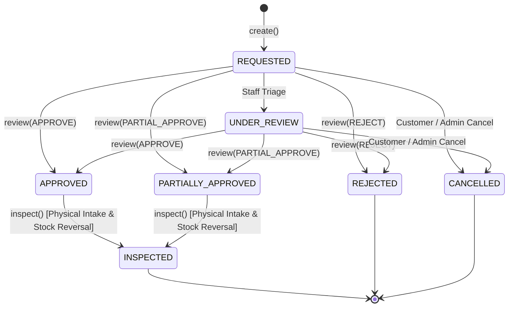

# Returns Feature Architecture & Invariants

## Purpose
The **Returns** feature governs the end-to-end Return Merchandise Authorization (RMA) lifecycle for orders within the multi-tenant commerce engine. It enforces policy-driven return window eligibility, guards against over-returning against original order quantities, manages staff approval and rejection workflows, records physical warehouse inspection results with granular condition grading and disposition rules, atomically restores traceable inventory stock back to warehouse records, and keeps the aggregate return state of parent orders synchronized.

---

## Component Architecture

---

## Component Source Map

| File | Primary Symbol | Role | Key Architectural Invariants & Responsibilities |
| :--- | :--- | :--- | :--- |
| [`returns.module.ts`](file:///home/chillpc/MohammadSheakh/projects/26/e-commerce/e-com-nextjs/ferio-nest-prisma/src/features/returns/returns.module.ts) | `ReturnsModule` | NestJS Feature Module | Bundles `ReturnsController`, `ReturnsService`, imports `TenancyModule`, `PrismaModule`, `AuthModule`, and `AuditModule`. |
| [`returns.controller.ts`](file:///home/chillpc/MohammadSheakh/projects/26/e-commerce/e-com-nextjs/ferio-nest-prisma/src/features/returns/controllers/returns.controller.ts) | `ReturnsController` | Admin REST Controller | Exposes `/admin/returns` and `/admin/orders/:orderId/returns*`. Applies `AuthGuard`, `RolesGuard('admin')`, `PermissionsGuard(RETURNS_READ)`, and `TenantMembershipGuard`. Enforces `RETURNS_MANAGE` on write endpoints. |
| [`returns.service.ts`](file:///home/chillpc/MohammadSheakh/projects/26/e-commerce/e-com-nextjs/ferio-nest-prisma/src/features/returns/services/returns.service.ts) | `ReturnsService` | Core Domain Orchestrator | Resolves tenant DB; coordinates RMA generation; serializable return creation; review decision processing; physical inspection and inventory stock reversal; order status synchronization; audit logging. |
| [`return.util.ts`](file:///home/chillpc/MohammadSheakh/projects/26/e-commerce/e-com-nextjs/ferio-nest-prisma/src/features/returns/utils/return.util.ts) | `evaluateReturnEligibility` | Pure Policy Function | Evaluates delivered status, delivery timestamp presence, configured return window, and cutoff timestamps to output `ELIGIBLE`, `REVIEW_REQUIRED`, or `INELIGIBLE`. |
| [`return.dto.ts`](file:///home/chillpc/MohammadSheakh/projects/26/e-commerce/e-com-nextjs/ferio-nest-prisma/src/features/returns/dto/return.dto.ts) | DTO Classes | Validation & Schema Defs | Validates inputs for case creation (`CreateReturnCaseDto`), review decisions (`ReviewReturnCaseDto`), warehouse inspection (`InspectReturnCaseDto`), and pagination queries (`ReturnCaseQueryDto`). |
| [`returns.service.spec.ts`](file:///home/chillpc/MohammadSheakh/projects/26/e-commerce/e-com-nextjs/ferio-nest-prisma/src/features/returns/tests/returns.service.spec.ts) | Unit Test Suite | Service Specification | Verifies review transitions, partial approval validation, physical inspection inventory movements (`RETURN` vs `DAMAGE`), and constraint checks. |
| [`return.util.spec.ts`](file:///home/chillpc/MohammadSheakh/projects/26/e-commerce/e-com-nextjs/ferio-nest-prisma/src/features/returns/tests/return.util.spec.ts) | Unit Test Suite | Policy Evaluator Tests | Tests edge conditions: undelivered orders, missing delivery timestamp, missing return window setting, open window vs expired window. |
| [`returns.tenant-isolation.spec.ts`](file:///home/chillpc/MohammadSheakh/projects/26/e-commerce/e-com-nextjs/ferio-nest-prisma/src/features/returns/tests/returns.tenant-isolation.spec.ts) | Isolation Test Suite | Tenancy Boundary Tests | Validates that returns are strictly queried and isolated within the caller's tenant database container. |

---

## Responsibilities

### Owns
- **RMA Lifecycle Management**: Generates cryptographically secure, high-entropy unique identifiers (`RMA-YYMMDD-<HEX>`) and tracks return case progression (`REQUESTED`, `UNDER_REVIEW`, `APPROVED`, `PARTIALLY_APPROVED`, `REJECTED`, `CANCELLED`, `INSPECTED`).
- **Policy & Window Evaluation**: Validates order state against store return policy (`defaultReturnWindowDays`), delivery timestamp (`Shipment.deliveredAt`), and current time.
- **Over-Return Guard**: Calculates remaining returnable quantities per line item by subtracting active (non-rejected, non-cancelled) return case units from the original order item quantity.
- **Staff Adjudication**: Handles admin approvals, partial approvals (requiring explicit approved quantities per line item), and rejections with mandatory reasoning.
- **Physical Inspection & Condition Grading**: Records physical receiving, accepted vs received unit counts, item condition (`SEALED`, `UNUSED`, `OPENED`, `USED`, `DAMAGED`, `WRONG_ITEM`, `OTHER`), and inventory disposition (`SELLABLE`, `DAMAGED`, `QUARANTINED`, `LOST`).
- **Inventory Stock Reversal**: Restores inspected items back into inventory (`InventoryStock.onHand` and `InventoryStock.damaged`) mapped against historical consumed reservations, emitting traceable `InventoryMovement` records.
- **Parent Order State Sync**: Updates parent `Order.returnStatus` aggregate enum (`NONE` -> `REQUESTED` -> `APPROVED` / `REJECTED` -> `RECEIVED`).
- **Audit & History Recording**: Creates chronological `ReturnStatusHistory` records and dispatches structured audit events (`RETURN_CASE_CREATED`, `RETURN_CASE_REVIEWED`, `RETURN_CASE_INSPECTED`).

### Does Not Own
- **Financial Disbursement & Refunds**: Does not issue gateway transactions, wallet credits, or cash disbursements. This is strictly orchestrated by [`RefundsModule`](file:///home/chillpc/MohammadSheakh/projects/26/e-commerce/e-com-nextjs/ferio-nest-prisma/src/features/refunds/README.md) and `CommercePaymentsModule`.
- **Reverse Shipping Logistics & Pickups**: Does not generate shipping labels, manifest return couriers, or track reverse courier milestones (handled by reverse logistics / `RtoModule` / `ShippingModule`).
- **Initial Inventory Reservations**: Does not create original checkout reservations or order lines (owned by `CheckoutModule` and `OrderModule`).
- **Customer Storefront Portal**: Currently does not expose public customer self-service endpoints; requests are created and managed via admin/staff operations.

---

## Dependencies

### Consumes
- **`TenancyModule`**: Provides `TenantDbService` and `resolveTenantDatabase()` to guarantee database multi-tenant isolation per organization.
- **`PrismaModule`**: Provides `PrismaService` and PostgreSQL transactional clients.
- **`AuthModule` / `@app/common`**: Provides authentication and RBAC guards (`AuthGuard`, `RolesGuard`, `PermissionsGuard`, `User`, `PERMISSIONS.RETURNS_READ`, `PERMISSIONS.RETURNS_MANAGE`).
- **`AuditModule`**: Provides `AuditService` to log compliance-grade, append-only operational events.

### External Services
- None directly. All state transitions, concurrency locks, and data operations run against the tenant's relational database.

### Emitters
- **Audit Pipeline**: Dispatches audit events (`RETURN_CASE_CREATED`, `RETURN_CASE_REVIEWED`, `RETURN_CASE_INSPECTED`) with before/after state payloads.

---

## Database Ownership

### Direct Writes / Mutates
| Entity | Operation | Trigger / Method |
| :--- | :--- | :--- |
| `ReturnCase` | `INSERT` | `create()`: Creates new RMA case with status `REQUESTED`. |
| `ReturnCase` | `UPDATE` | `review()`: Updates status to `APPROVED`, `PARTIALLY_APPROVED`, or `REJECTED`; records reviewer ID and timestamp. `inspect()`: Updates status to `INSPECTED`, records received/inspected timestamps, inspector ID, final resolution, and inspection note. |
| `ReturnItem` | `INSERT` | `create()`: Inserts requested items with `requestedQuantity`. |
| `ReturnItem` | `UPDATE` | `review()`: Sets `approvedQuantity` on each item. `inspect()`: Sets `receivedQuantity`, `acceptedQuantity`, `condition`, `inventoryDisposition`, and `inspectionNote`. |
| `ReturnEvidence` | `INSERT` | `create()`: Inserts image/document URLs provided by requester. |
| `ReturnStatusHistory` | `INSERT` | Appended on `create()`, `review()`, and `inspect()` to maintain an audit trail of status transitions. |
| `Order` | `UPDATE` | `create()`: Sets `Order.returnStatus = 'REQUESTED'`. `review()`: Calls `syncOrderReturnStatus()`, setting `APPROVED`, `REQUESTED`, or `REJECTED`. `inspect()`: Sets `Order.returnStatus = 'RECEIVED'`. |
| `InventoryStock` | `UPDATE` | `inspect()`: Increments `onHand` (for `SELLABLE`) or both `onHand` and `damaged` (for `DAMAGED`) on the historical reservation inventory record. |
| `InventoryMovement` | `INSERT` | `inspect()`: Creates movement records of type `RETURN` or `DAMAGE` linked to `referenceType: 'ReturnCase'`. |
| `CommerceSettings` | `UPSERT` | `loadEligibility()`: Ensures `id: 'default'` exists if store settings have not been initialized. |

### Reads / References
| Entity | Purpose |
| :--- | :--- |
| `Order` | Validates existence, order status (`DELIVERED` or `COMPLETED`), customer info, and shipment delivery date. |
| `OrderItem` | Validates item ownership, ordered quantity, SKU, and product naming. |
| `OrderItemInventoryReservation` | Reads `status: 'CONSUMED'` reservations to locate original inventory stock records for physical return replenishment. |
| `CommerceSettings` | Reads `defaultReturnWindowDays` to calculate return eligibility deadline. |
| `CommerceRefund` | Referenced in Prisma schema relation (`ReturnCase.refunds`) to track financial disbursements spawned by an RMA. |

---

## Important Invariants

### 1. Eligibility Boundary Rules
- **Delivery Prerequisite**: An order is strictly `INELIGIBLE` unless `Order.status` is either `DELIVERED` or `COMPLETED`. Processing, shipped, confirmed, or cancelled orders cannot have return cases initiated.
- **Missing Data Fallback**: If an order is marked `DELIVERED` but lacks a recorded `Shipment.deliveredAt` timestamp, or the store has no configured `defaultReturnWindowDays`, eligibility returns `REVIEW_REQUIRED`. Staff may still initiate a return case, allowing manual verification.
- **Window Expiration**: If `(current_time > deliveredAt + returnWindowDays * 86,400,000ms)`, the order is marked `INELIGIBLE`.
- **Hard Gate on Creation**: `create()` throws `BadRequestException` if `eligibility.status === 'INELIGIBLE'`. Requests with `REVIEW_REQUIRED` are permitted to proceed to staff review.

### 2. Over-Return Prevention & Item Uniqueness
- **Item Uniqueness**: A single return case cannot include the same `orderItemId` multiple times (`requestedIds.size === dto.items.length`).
- **Remaining Quantity Tracking**:
  $$\text{RemainingQuantity}_i = \text{OrderedQuantity}_i - \sum_{\text{active cases}} \text{RequestedQuantity}_i$$
  Active cases include all returns whose status is NOT in `['REJECTED', 'CANCELLED']`. If `requested.quantity > remainingQuantity`, creation aborts with `ConflictException`.

### 3. Concurrency & Serializable Isolation
- **Creation Isolation**: `create()` executes under `Prisma.TransactionIsolationLevel.Serializable`. This prevents race conditions where two concurrent requests for the same order item could pass remaining quantity checks simultaneously and over-allocate returnable inventory.
- **Inspection Isolation**: `inspect()` also executes under `Prisma.TransactionIsolationLevel.Serializable` to guarantee atomic stock increments and avoid phantom inventory restoration.

### 4. Review Mathematical Invariants
- **Full Approval (`APPROVE`)**: Automatically sets `approvedQuantity = requestedQuantity` for all return items.
- **Rejection (`REJECT`)**: Automatically sets `approvedQuantity = 0` for all return items.
- **Partial Approval (`PARTIAL_APPROVE`)**:
  - Must provide explicit `approvedQuantity` for *every* item in the return case.
  - Invariant: $0 \le \text{approvedQuantity}_i \le \text{requestedQuantity}_i$.
  - Invariant: $0 < \sum \text{approvedQuantity} < \sum \text{requestedQuantity}$. If 0 units or all units are approved, the system throws `BadRequestException` (partial approval must be strictly partial).

### 5. Warehouse Inspection & Physical Intake Invariants
- **Prerequisite State**: Only return cases with status `APPROVED` or `PARTIALLY_APPROVED` can be inspected. Attempting to inspect `REQUESTED` or `REJECTED` cases throws `ConflictException`.
- **Completeness**: Inspection DTO must provide details for *every* return item in the case.
- **Physical Quantity Constraints**:
  - $\text{receivedTotal} > 0$ (cannot inspect without receiving physical units).
  - $\text{receivedQuantity}_i \le \text{approvedQuantity}_i$.
  - $\text{acceptedQuantity}_i \le \text{receivedQuantity}_i$.
- **Decision Consistency**:
  - If `decision === 'ACCEPT'`: Requires $\text{acceptedTotal} = \text{receivedTotal}$.
  - If `decision === 'PARTIAL_ACCEPT'`: Requires $0 < \text{acceptedTotal} < \text{receivedTotal}$.
  - If `decision === 'REJECT'`: Requires $\text{acceptedTotal} = 0$ AND $\text{finalResolution} = \text{'REJECTED'}$.

### 6. Inventory Restoration Mechanics
- **Traceable Reservation FIFO Drainage**: Inspected units are restored by traversing the order item's `CONSUMED` reservations ordered by `createdAt: asc`.
- **Traceability Ceiling**: $\sum \text{receivedQuantity} \le \sum \text{consumedReservations}$. If received units exceed historical consumed records, `ConflictException('Received quantity exceeds traceable delivered inventory')` is thrown.
- **Disposition-Driven Stock Logic**:
  - `SELLABLE`: Increments `InventoryStock.onHand` by received units. Emits `InventoryMovement(type: 'RETURN')`. Available stock ($onHand - reserved - damaged$) increases.
  - `DAMAGED`: Increments `InventoryStock.onHand` AND `InventoryStock.damaged` by received units. Emits `InventoryMovement(type: 'DAMAGE')`. Net available stock change is zero, but physical count is accurately reconciled.
  - `QUARANTINED` / `LOST`: No stock increments or movements are applied. Units remain off-ledger pending external claim resolution.

### 7. Parent Order Status Synchronization
- Parent `Order.returnStatus` is dynamically recalculated via `syncOrderReturnStatus`:
  - `APPROVED`: If *any* active case for the order is `APPROVED` or `PARTIALLY_APPROVED`.
  - `REQUESTED`: If *any* case is `REQUESTED` or `UNDER_REVIEW`.
  - `REJECTED`: If all cases have been rejected.
  - `RECEIVED`: Explicitly set on the parent order when a case transitions to `INSPECTED`.

---

## Public API & Entry Points

All endpoints are mounted on `ReturnsController` under the `/admin` prefix and require a valid Bearer JWT.

| Method | Endpoint | Guards / Decorators | Required Permission | Description |
| :--- | :--- | :--- | :--- | :--- |
| `GET` | `/admin/returns` | `AuthGuard`, `RolesGuard('admin')`, `PermissionsGuard`, `TenantMembershipGuard` | `RETURNS_READ` | Paginated listing of return cases with optional status filter (`page`, `limit`, `status`). |
| `POST` | `/admin/returns/:id/review` | Same as above | `RETURNS_MANAGE` | Adjudicates an RMA (`APPROVE`, `PARTIAL_APPROVE`, `REJECT`) and assigns approved quantities. |
| `POST` | `/admin/returns/:id/inspect` | Same as above | `RETURNS_MANAGE` | Records warehouse intake, physical inspection results, inventory disposition, and restores stock. |
| `GET` | `/admin/orders/:orderId/returns/eligibility` | Same as above | `RETURNS_READ` | Evaluates return eligibility for a given order, returning window end dates and remaining quantities. |
| `GET` | `/admin/orders/:orderId/returns` | Same as above | `RETURNS_READ` | Fetches all return cases and full sub-relations for a specific order. |
| `POST` | `/admin/orders/:orderId/returns` | Same as above | `RETURNS_MANAGE` | Submits a new return case against an order under serializable transaction isolation. |

---

## Important Flows

### 1. Return Case Creation & Eligibility Flow

### 2. Review and Inspection with Inventory Restoration Flow

### 3. Return Case Lifecycle State Machine

---

## Brutal Honest Vulnerabilities & Architectural Debt

### 1. Reverse Inventory Warehouse / Location Asymmetry
- **Severity**: High (Inventory Drift)
- **Mechanism**: In `restoreInspectedInventory()`, returns are replenished by looping through historical `consumed` reservations ordered by `createdAt: asc`. It increments `InventoryStock` at the exact warehouse/bin from which the item originally shipped.
- **The Problem**: In omni-channel or multi-warehouse retail, customer returns physically arrive at a central returns depot, quarantine facility, or local retail counter—rarely the original fulfillment warehouse. Restoring stock to the origin warehouse causes phantom stock at the origin and unrecorded physical stock at the receiving warehouse.
- **Remediation**: Allow `InspectReturnCaseDto` to accept a `receivingWarehouseId` / `targetInventoryId` to explicitly designate where the physical units were received.

### 2. Race Condition in Review Adjudication (Missing Optimistic Lock)
- **Severity**: Medium
- **Mechanism**: Unlike `create()` and `inspect()`, `review()` runs in a standard `$transaction` (Read Committed). It performs `findUnique()`, validates status is `REQUESTED` or `UNDER_REVIEW`, and then applies item updates.
- **The Problem**: If two staff members review the same return case concurrently (e.g., in a high-volume call center), both can read status `REQUESTED` simultaneously. The second write will overwrite the first reviewer's decision, approved quantities, and status history note without any optimistic locking (`updatedAt` check or version token).
- **Remediation**: Use `updateMany({ where: { id, status: { in: ['REQUESTED', 'UNDER_REVIEW'] } }, data: ... })` or an explicit version column to reject concurrent stale reviews.

### 3. Disconnected Financial Workflow with `RefundsModule`
- **Severity**: High (Operational Disconnect & Duplicate Refund Risk)
- **Mechanism**: When an inspection concludes with `finalResolution: 'REFUND'`, `ReturnsService` updates the database record and stops. It does **not** call `RefundsService.createRefund()` or emit a domain event to queue a refund.
- **The Problem**: An admin must manually navigate to the Refunds dashboard, look up the return case, calculate the refund amount, and create the refund out-of-band. This creates a severe window where customers whose returns were accepted wait indefinitely for refunds, or staff erroneously issue multiple manual refunds.
- **Remediation**: Emit a domain event or provide an atomic hook allowing `inspect()` to trigger automated refund drafting in `RefundsModule`.

### 4. Absence of Customer Self-Service Surface
- **Severity**: Medium (Scalability / Operational Bottleneck)
- **Mechanism**: All routes in `ReturnsController` are mounted at `/admin` and require `Roles('admin')` and `RETURNS_MANAGE`.
- **The Problem**: Customers cannot request returns, submit photo evidence, check RMA status, or download return slips from their storefront portal. Customer support agents must manually gather information via chat/email and key it in via the admin panel.
- **Remediation**: Implement customer-facing endpoints under `/customer/orders/:orderId/returns` guarded by customer session authentication.

### 5. Blind Evidence URL Ingestion (SSRF & Tampering Risk)
- **Severity**: Low / Medium
- **Mechanism**: `CreateReturnCaseDto.evidenceUrls` is validated only via `@IsUrl({ require_protocol: true })`.
- **The Problem**: Senders can attach arbitrary external URLs, third-party malicious links, or internal metadata URLs (`http://169.254.169.254/...`). The URLs are not linked to internally managed `Attachment` records, nor is file ownership verified.
- **Remediation**: Bind evidence uploads to the internal `Attachment` service or restrict URL schemes and domains to trusted S3/cloud storage buckets.

### 6. Side-Effecting Database Write in Read/Validation Path
- **Severity**: Low (Architectural Hygiene)
- **Mechanism**: In `loadEligibility()`, `client.commerceSettings.upsert({ where: { id: 'default' }... })` executes a write on every call, including read-only requests to `GET /admin/orders/:orderId/returns/eligibility`.
- **The Problem**: Pure query endpoints should not execute database mutations. If the database user is connected via a read-replica pool, this query will fail with read-only transaction errors.
- **Remediation**: Use `client.commerceSettings.findUnique()` with an in-memory fallback to defaults if no configuration row exists.
