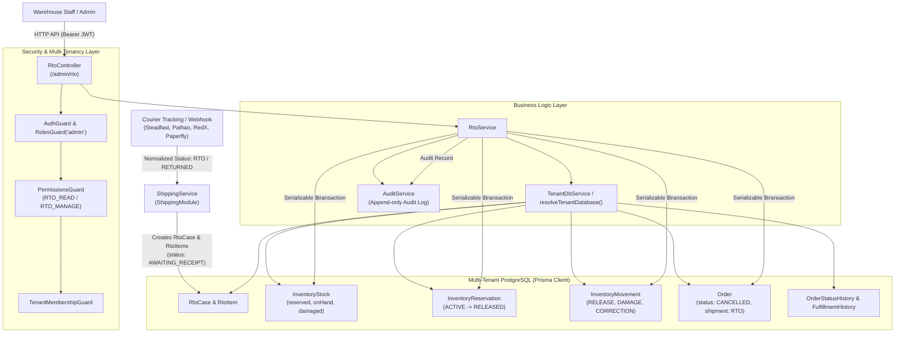
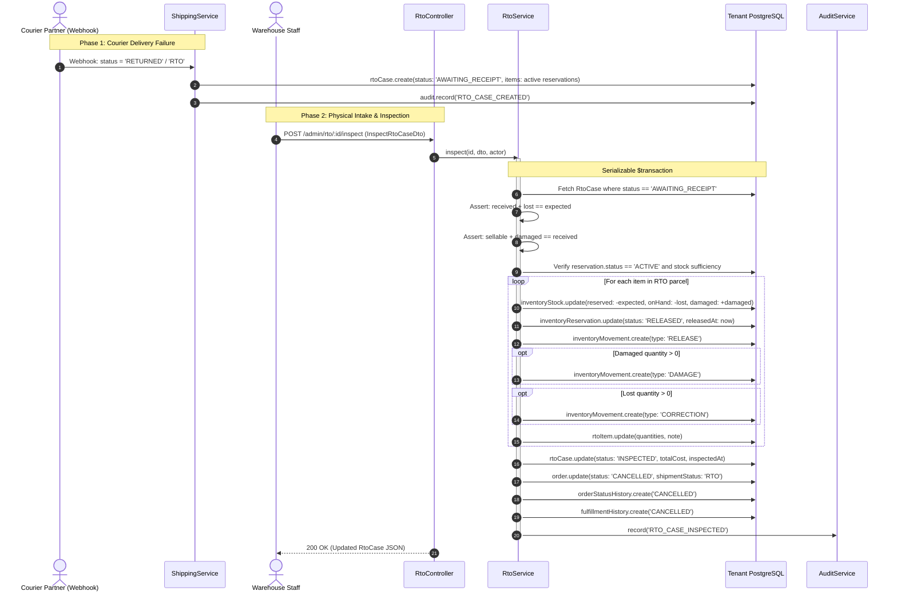
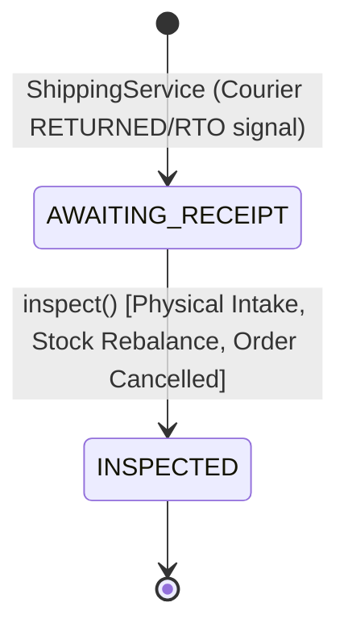

# RTO (Return to Origin) Feature Architecture & Invariants

## Purpose
The **RTO (Return to Origin)** feature governs the physical intake, inventory reconciliation, financial cost attribution, and terminal lifecycle transitions for undelivered, rejected, or courier-returned shipments. 

While the [`ShippingModule`](file:///home/chillpc/MohammadSheakh/projects/26/e-commerce/e-com-nextjs/ferio-nest-prisma/src/features/shipping/README.md) detects carrier return webhook milestones (`RETURNED`, `RTO`) and instantiates initial RTO cases, the **RTO feature** owns the authoritative warehouse receiving and inspection process. It guarantees strict mathematical conservation of physical stock across sellable, damaged, and lost inventory, releases warehouse inventory reservations, accounts for multi-component reverse logistics freight costs, and cleanly cancels parent orders with full auditability.

---

## Component Architecture

---

## Component Source Map

| File | Primary Symbol | Role | Key Architectural Invariants & Responsibilities |
| :--- | :--- | :--- | :--- |
| [`rto.module.ts`](file:///home/chillpc/MohammadSheakh/projects/26/e-commerce/e-com-nextjs/ferio-nest-prisma/src/features/rto/rto.module.ts) | `RtoModule` | NestJS Feature Module | Configures RTO domain dependencies, importing `TenancyModule`, `PrismaModule`, `AuthModule`, and `AuditModule`. Registers `RtoController` and `RtoService`. |
| [`rto.controller.ts`](file:///home/chillpc/MohammadSheakh/projects/26/e-commerce/e-com-nextjs/ferio-nest-prisma/src/features/rto/rto.controller.ts) | `RtoController` | Admin REST Controller | Exposes `/admin/rto` and `/admin/rto/:id/inspect`. Enforces `AuthGuard`, `RolesGuard('admin')`, `TenantMembershipGuard`, and RBAC permissions (`RTO_READ`, `RTO_MANAGE`). |
| [`rto.service.ts`](file:///home/chillpc/MohammadSheakh/projects/26/e-commerce/e-com-nextjs/ferio-nest-prisma/src/features/rto/rto.service.ts) | `RtoService` | Core Domain Orchestrator | Resolves tenant DB; lists pending RTO cases; enforces serializable physical inspection; validates strict stock conservation math; releases reservations; reconciles freight costs; executes order cancellation. |
| [`rto.dto.ts`](file:///home/chillpc/MohammadSheakh/projects/26/e-commerce/e-com-nextjs/ferio-nest-prisma/src/features/rto/dto/rto.dto.ts) | `InspectRtoCaseDto`, `InspectRtoItemDto` | DTO & Validation | Validates RTO inspection payloads: failure reason enum, multi-tier courier costs ($\le 2,000,000,000$), itemized received, sellable, damaged, and lost quantities. |
| [`rto.service.spec.ts`](file:///home/chillpc/MohammadSheakh/projects/26/e-commerce/e-com-nextjs/ferio-nest-prisma/src/features/rto/tests/rto.service.spec.ts) | Unit Test Suite | Service Specification | Verifies stock settlement across sellable, damaged, and lost units; confirms mathematical rejection of non-reconciling quantities; verifies checks on inactive reservations. |
| [`rto.tenant-isolation.spec.ts`](file:///home/chillpc/MohammadSheakh/projects/26/e-commerce/e-com-nextjs/ferio-nest-prisma/src/features/rto/tests/rto.tenant-isolation.spec.ts) | Isolation Test Suite | Tenancy Boundary Tests | Validates that RTO records and mutations are strictly isolated to the caller's tenant database container. |

---

## Responsibilities

### Owns
- **Warehouse Intake & Inspection (`AWAITING_RECEIPT -> INSPECTED`)**: Authoritative receipt and recording of courier-returned parcels at the merchant's warehouse.
- **Strict Conservation of Inventory Math**:
  - Enforces: $\text{receivedQuantity} + \text{lostQuantity} = \text{expectedQuantity}$
  - Enforces: $\text{sellableQuantity} + \text{damagedQuantity} = \text{receivedQuantity}$
- **Reservation Lifecycle Settlement**: Flips related `InventoryReservation` records from `ACTIVE` to `RELEASED` (`status = 'RELEASED', releasedAt = now`).
- **Inventory Stock Rebalancing**:
  - Decrements `reserved` quantity by the full `expectedQuantity`.
  - Decrements `onHand` quantity by any `lostQuantity` (permanently writing off missing units).
  - Increments `damaged` quantity by any `damagedQuantity` (keeping physical custody but excluding from available sellable stock).
  - Implicitly restores `sellableQuantity` to available stock ($\text{available} = \text{onHand} - \text{reserved} - \text{damaged}$).
- **Inventory Movement Audit Trails**: Automatically emits granular `InventoryMovement` entries:
  - `RELEASE`: Records reservation release for the full expected quantity.
  - `DAMAGE`: Records defect delta for units received broken or defective.
  - `CORRECTION`: Records shrinkage delta for units stolen or missing in transit.
- **Reverse Logistics Cost Accounting**: Computes and records `totalCost = outboundCourierCost + returnCourierCost + otherCost` with bounded overflow checks ($\le 2,000,000,000$).
- **Parent Order Terminal Cancellation**: Synchronously cancels the parent `Order` (`status = 'CANCELLED'`, `fulfillmentStatus = 'CANCELLED'`, `shipmentStatus = 'RTO'`) and appends immutable records to `OrderStatusHistory` and `FulfillmentHistory`.
- **Audit Logging**: Emits compliance-grade `RTO_CASE_INSPECTED` audit event.

### Does Not Own
- **RTO Case Instantiation**: `RtoCase` and `RtoItem` rows are initially created by `ShippingService` upon receiving courier tracking webhook events indicating delivery failure (`RETURNED` or `RTO`).
- **Courier Webhook Ingestion & Provider Normalization**: Owned by [`ShippingModule`](file:///home/chillpc/MohammadSheakh/projects/26/e-commerce/e-com-nextjs/ferio-nest-prisma/src/features/shipping/README.md).
- **Customer Return Merchandise Authorizations (RMA)**: Post-delivery customer-initiated returns are owned by [`ReturnsModule`](file:///home/chillpc/MohammadSheakh/projects/26/e-commerce/e-com-nextjs/ferio-nest-prisma/src/features/returns/README.md). RTO strictly deals with courier return before successful delivery.
- **Payment Disbursements & Refunds**: Does not issue refunds for prepaid RTO orders. That responsibility belongs to [`RefundsModule`](file:///home/chillpc/MohammadSheakh/projects/26/e-commerce/e-com-nextjs/ferio-nest-prisma/src/features/refunds/README.md).
- **Courier Cash/Bill Reconciliation**: Financial auditing of courier invoices against COD collections is owned by [`ReconciliationModule`](file:///home/chillpc/MohammadSheakh/projects/26/e-commerce/e-com-nextjs/ferio-nest-prisma/src/features/reconciliation/README.md).

---

## Dependencies

### Consumes
- **`TenancyModule`**: `TenantDbService` and `resolveTenantDatabase()` to isolate database sessions by organization.
- **`PrismaModule`**: Provides `PrismaService` and PrismaClient database operations.
- **`AuthModule` / `@app/common`**: Provides authentication and RBAC guards (`AuthGuard`, `RolesGuard`, `PermissionsGuard`, `User`, `PERMISSIONS.RTO_READ`, `PERMISSIONS.RTO_MANAGE`).
- **`AuditModule`**: Provides `AuditService` to record immutable compliance events.
- **`ShippingModule` (Upstream Creator)**: Populates `RtoCase` and `RtoItem` when courier webhooks fire return events.

### External Services
- None directly. Courier integrations communicate upstream via `ShippingModule`.

### Emitters
- **Audit Log**: Dispatches `RTO_CASE_INSPECTED` to `AuditService`.

---

## Database Ownership

### Direct Writes / Mutates
| Entity | Operation | Trigger / Method |
| :--- | :--- | :--- |
| `RtoCase` | `UPDATE` | `inspect()`: Updates status to `INSPECTED`, reason, reason notes, itemized costs, total cost, `inspectedAt`, and `inspectedByActorId`. |
| `RtoItem` | `UPDATE` | `inspect()`: Sets `receivedQuantity`, `sellableQuantity`, `damagedQuantity`, `lostQuantity`, and item inspection `note`. |
| `InventoryStock` | `UPDATE` | `inspect()`: Atomically decrements `reserved` by `expectedQuantity`, decrements `onHand` by `lostQuantity`, and increments `damaged` by `damagedQuantity`. |
| `InventoryReservation` | `UPDATE` | `inspect()`: Flips status from `ACTIVE` to `RELEASED` with timestamp `releasedAt = now()`. |
| `InventoryMovement` | `INSERT` | `inspect()`: Generates `RELEASE` movement, and conditional `DAMAGE` and `CORRECTION` movements. |
| `Order` | `UPDATE` | `inspect()`: Sets `status = 'CANCELLED'`, `fulfillmentStatus = 'CANCELLED'`, `shipmentStatus = 'RTO'`, `cancellationReason = 'RTO: ...'`, `cancelledAt = now()`. |
| `OrderStatusHistory` | `INSERT` | `inspect()`: Records order cancellation entry sourced from `SYSTEM`. |
| `FulfillmentHistory` | `INSERT` | `inspect()`: Records fulfillment cancellation entry sourced from `SYSTEM`. |

### Reads / References
| Entity | Purpose |
| :--- | :--- |
| `RtoCase` | Reads case state, order linkage, and child items with inventory reservations. |
| `RtoItem` | Reads expected quantities, order item references, and reservation IDs. |
| `InventoryReservation` | Validates that reservation is still `ACTIVE` before allowing settlement. |
| `InventoryStock` | Reads `reserved` and `onHand` quantities to ensure consistency before executing decrements. |
| `Order` | Reads parent order status, currency, and customer details. |
| `Shipment` | Reads linked shipment and courier provider details. |

---

## Important Invariants

### 1. Mathematical Conservation of Physical Inventory
Every RTO parcel inspection must account for 100% of expected items without discrepancy:
1. **Intake Conservation**:
   $$\text{receivedQuantity}_i + \text{lostQuantity}_i = \text{expectedQuantity}_i$$
   Every expected item must be either received into the warehouse or explicitly declared lost.
2. **Quality Grading Conservation**:
   $$\text{sellableQuantity}_i + \text{damagedQuantity}_i = \text{receivedQuantity}_i$$
   Every received unit must be classified as either sellable or damaged.
3. Violation of either formula immediately aborts the transaction with `BadRequestException`.

### 2. Reservation State Integrity
- **Active Requirement**: For every item in the RTO case, `item.reservation.status` must equal `ACTIVE`. If a reservation was cancelled, released, or marked consumed earlier, inspection aborts with `ConflictException('RTO inventory reservation is no longer active')`.
- **Stock Floor Guard**: Before mutating inventory stock, the service verifies:
  $$\text{stock.reserved} \ge \text{item.expectedQuantity} \quad \text{AND} \quad \text{stock.onHand} \ge \text{input.lostQuantity}$$
  If stock levels would drop below zero, `ConflictException('RTO inventory is inconsistent')` is thrown.

### 3. Concurrency & Serializable Isolation
- `inspect()` executes strictly within `Prisma.TransactionIsolationLevel.Serializable`.
- State check: `rtoCase.status === 'AWAITING_RECEIPT'`. If the case was already inspected by another staff member, the transaction throws `ConflictException('RTO case is already inspected')`.

### 4. Inventory Stock & Movement Rebalancing Mechanics
In the core inventory model:
$$\text{availableQuantity} = \text{onHand} - \text{reserved} - \text{damaged}$$

When `inspect()` executes:
| Item Disposition | DB Mutex Actions | Net Effect on Available Stock | Emitted InventoryMovement |
| :--- | :--- | :--- | :--- |
| **Sellable Units** | `reserved` decremented | $+ \text{sellableQuantity}$ (units return to circulation) | `RELEASE` (reservation lifted) |
| **Damaged Units** | `reserved` decremented `damaged` incremented | $\pm 0$ (held in physical custody, unavailable for sale) | `RELEASE` + `DAMAGE` |
| **Lost Units** | `reserved` decremented `onHand` decremented | $\pm 0$ (permanently written off from inventory) | `RELEASE` + `CORRECTION` |

### 5. Multi-Component Freight Cost Bounds
- The RTO process tracks three distinct cost vectors: `outboundCourierCost`, `returnCourierCost`, and `otherCost`.
- Invariant: $\text{totalCost} = \text{outboundCourierCost} + \text{returnCourierCost} + \text{otherCost} \le 2,000,000,000$. Exceeding this integer bound throws `BadRequestException`.

### 6. Parent Order Termination
- If `order.status !== 'CANCELLED'`, the order is atomically transitioned to:
  - `status = 'CANCELLED'`
  - `fulfillmentStatus = 'CANCELLED'`
  - `shipmentStatus = 'RTO'`
  - `cancelledAt = now()`
- Both `OrderStatusHistory` and `FulfillmentHistory` are appended within the same atomic transaction.

---

## Public API & Entry Points

Mounted on `RtoController` at `/admin/rto`:

| Method | Endpoint | Guards / Decorators | Required Permission | Description |
| :--- | :--- | :--- | :--- | :--- |
| `GET` | `/admin/rto` | `AuthGuard`, `RolesGuard('admin')`, `PermissionsGuard`, `TenantMembershipGuard` | `RTO_READ` | Lists up to 100 recent RTO cases with shipment, order, customer, and item details, ordered by `courierReturnedAt: desc`. |
| `POST` | `/admin/rto/:id/inspect` | Same as above | `RTO_MANAGE` | Atomically inspects an RTO parcel, verifies stock quantities, updates inventory stock, settles reservations, records freight costs, and cancels the parent order. |

---

## Important Flows

### 1. End-to-End RTO Lifecycle Flow

### 2. RTO Case State Diagram

---

## Brutal Honest Vulnerabilities & Architectural Debt

### 1. Hardcoded Cap without Pagination (`take: 100`)
- **Severity**: High (Operational Invisibility)
- **Mechanism**: In `RtoService.list()`, the query is hardcoded to `take: 100` ordered by `courierReturnedAt: desc`.
- **The Problem**: There is no query DTO, cursor, or page parameter. When an enterprise tenant has hundreds or thousands of failed deliveries, any RTO case beyond the 100th most recent becomes completely inaccessible via the admin API. Warehouse operators cannot look up older pending parcels awaiting inspection.
- **Remediation**: Introduce a `RtoQueryDto` with keyset/cursor pagination, date range filtering, and status filtering (`AWAITING_RECEIPT` vs `INSPECTED`).

### 2. Prepaid Orders Trapped without Automated Refunds
- **Severity**: High (Financial Discrepancy & Customer Complaint Risk)
- **Mechanism**: When `inspect()` concludes, the parent `Order` is automatically flipped to `status: 'CANCELLED'`. However, `RtoService` does **not** check whether the order was prepaid (via bKash, card, or wallet) or COD.
- **The Problem**: For prepaid orders, customer funds remain captured in the merchant's payment gateway or ledger. The system creates no refund draft, notifies neither `RefundsModule` nor `CustomerNotificationsModule`, and emits no event to initiate disbursement. The customer has paid for merchandise that is returned and restocked, with no automated path to reimbursement.
- **Remediation**: Check `order.paymentStatus === 'PAID'` and either invoke `RefundsService.createRefund()` or emit a domain event (`ORDER_RTO_CANCELLED`) to prompt automatic refund creation.

### 3. Fragile Coupling to `InventoryReservation.status === 'ACTIVE'`
- **Severity**: Critical (Operational Deadlock)
- **Mechanism**: Line 105 of `rto.service.ts` asserts `if (item.reservation.status !== 'ACTIVE') throw new ConflictException(...)`.
- **The Problem**: In many ERP and fulfillment workflows, when an order is handed over to a courier and leaves the warehouse dock, the reservation is transitioned from `ACTIVE` to `CONSUMED`. If an upstream fulfillment update marks the reservation `CONSUMED`, `RtoService.inspect()` will permanently fail with `ConflictException`, leaving the RTO parcel stuck in `AWAITING_RECEIPT` forever without any recovery mechanism.
- **Remediation**: Allow inspection to handle both `ACTIVE` reservations (decrementing `reserved`) and `CONSUMED` reservations (incrementing `onHand` as a return reversal, identical to `ReturnsService`).

### 4. Manual Unverified Freight Cost Entry
- **Severity**: Medium (Financial Leakage)
- **Mechanism**: `outboundCourierCost`, `returnCourierCost`, and `otherCost` are supplied directly via user input in `InspectRtoCaseDto`.
- **The Problem**: Warehouse operators manually enter costs without validation against courier rate cards, contractual SLA agreements, or actual billing records in `ReconciliationModule`. Freight charges can be mistyped, misallocated, or duplicated, skewing profitability reporting.
- **Remediation**: Default costs to the linked `Shipment.shippingCharge` and integrate with `ReconciliationModule` courier rate lookups.

### 5. Lack of Partial Receiving / Parcel Split Intake
- **Severity**: Medium (Operational Rigidity)
- **Mechanism**: `inspect()` requires every item in the RTO case to be inspected simultaneously in a single atomic transaction.
- **The Problem**: In multi-box or split shipments, couriers frequently return parcels in staggered batches over several days. Because there is no `PARTIALLY_INSPECTED` status, warehouse staff must either delay logging received items until all boxes arrive, or falsely declare missing boxes as "lost" to complete the inspection.
- **Remediation**: Add item-level status tracking and a `PARTIALLY_INSPECTED` case state to allow incremental receiving.

### 6. Reverse In-Transit Blindspot
- **Severity**: Low / Medium
- **Mechanism**: The case sits in `AWAITING_RECEIPT` from the moment the courier webhook fires until warehouse staff physically inspects it.
- **The Problem**: There is no reverse AWB tracking, courier transit milestone tracking, or SLA breach alert. If a return package is lost or stolen while in the courier's custody, the system never alerts operations, and active inventory reservations remain locked indefinitely.
- **Remediation**: Track reverse tracking numbers and trigger automated courier claim tickets if an RTO parcel is not received within an SLA window (e.g., 7 days).
