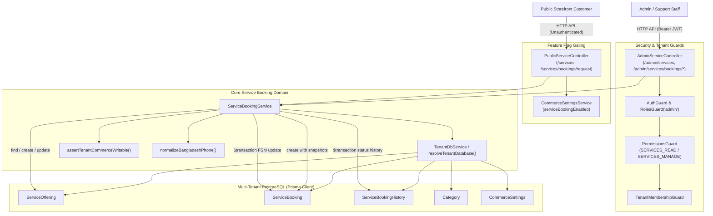
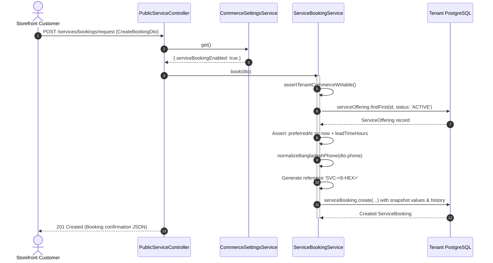
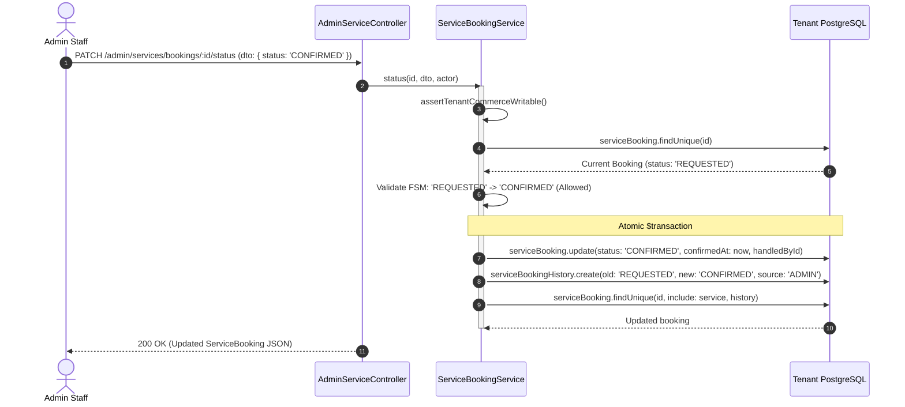

# Service Booking Feature Architecture & Invariants

## Purpose
The **Service Booking** feature provides an appointment scheduling and on-demand professional services subsystem within the multi-tenant commerce engine. It enables merchants to offer bookable services (e.g., equipment repairs, custom fittings, home installations, maintenance consultations) linked to catalog categories, with configurable lead times, duration, and pricing. 

The feature exposes public storefront APIs for catalog discovery and appointment booking with phone normalization, lead-time validation, and immutable data snapshotting. It provides backoffice administrators with service catalog management tools and a strictly guarded finite state machine to manage appointment progression (`REQUESTED` $\rightarrow$ `CONFIRMED` $\rightarrow$ `IN_PROGRESS` $\rightarrow$ `COMPLETED`).

---

## Component Architecture



---

## Component Source Map

| File | Primary Symbol | Role | Key Architectural Invariants & Responsibilities |
| :--- | :--- | :--- | :--- |
| [`service-booking.module.ts`](file:///home/chillpc/MohammadSheakh/projects/26/e-commerce/e-com-nextjs/ferio-nest-prisma/src/features/service-booking/service-booking.module.ts) | `ServiceBookingModule` | NestJS Feature Module | Bundles `PublicServiceController`, `AdminServiceController`, and `ServiceBookingService`. Imports `TenancyModule`, `PrismaModule`, `AuthModule`, and `SettingsModule`. |
| [`service-booking.controller.ts`](file:///home/chillpc/MohammadSheakh/projects/26/e-commerce/e-com-nextjs/ferio-nest-prisma/src/features/service-booking/service-booking.controller.ts) | `PublicServiceController` | Public REST Controller | Exposes `/services` endpoints for storefront catalog browsing and appointment booking. Gates all actions behind `CommerceSettings.serviceBookingEnabled`. |
| [`service-booking.controller.ts`](file:///home/chillpc/MohammadSheakh/projects/26/e-commerce/e-com-nextjs/ferio-nest-prisma/src/features/service-booking/service-booking.controller.ts) | `AdminServiceController` | Admin REST Controller | Exposes `/admin/services` catalog CRUD and appointment status administration. Enforces `AuthGuard`, `RolesGuard('admin')`, `TenantMembershipGuard`, and permissions (`SERVICES_READ`, `SERVICES_MANAGE`). |
| [`service-booking.service.ts`](file:///home/chillpc/MohammadSheakh/projects/26/e-commerce/e-com-nextjs/ferio-nest-prisma/src/features/service-booking/service-booking.service.ts) | `ServiceBookingService` | Core Domain Orchestrator | Implements multi-tenant DB resolution, commerce writable verification, lead time validation, phone normalization, service attribute snapshotting, and appointment FSM transitions. |
| [`service-booking.dto.ts`](file:///home/chillpc/MohammadSheakh/projects/26/e-commerce/e-com-nextjs/ferio-nest-prisma/src/features/service-booking/service-booking.dto.ts) | DTO Classes | Validation Schemas | Defines and validates input schemas: `SaveServiceDto` (catalog definition), `CreateBookingDto` (customer booking request), and `UpdateBookingStatusDto` (status transitions). |
| [`service-booking.service.spec.ts`](file:///home/chillpc/MohammadSheakh/projects/26/e-commerce/e-com-nextjs/ferio-nest-prisma/src/features/service-booking/tests/service-booking.service.spec.ts) | Unit Test Suite | Service Specification | Verifies tenant-local service discovery and single-tenant lifecycle progression (publish $\rightarrow$ book $\rightarrow$ confirm). |

---

## Responsibilities

### Owns
- **Service Offering Catalog CRUD**: Creates, updates, and deletes `ServiceOffering` entities. Handles automated slug generation from service names and sets default lead times (24 hours).
- **Storefront Service Discovery**: Serves active services (`status = 'ACTIVE'`) and detailed service views by unique slug.
- **Appointment Intake & Lead Time Validation**:
  - Enforces minimum scheduling lead time: $\text{preferredAt} \ge \text{now} + \text{leadTimeHours} \times 3,600,000\text{ ms}$.
  - Normalizes customer contact phone numbers into standard E.164 Bangladeshi format (`+8801...`).
  - Generates cryptographically secure unique booking references: `SVC-${randomBytes(4).toString('hex').toUpperCase()}`.
- **Immutable Service Snapshotting**: Captures `serviceNameSnapshot`, `priceSnapshot`, and `durationMinutesSnapshot` at the moment of booking creation to ensure historical record integrity against subsequent catalog price changes.
- **Appointment Finite State Machine (FSM)**:
  - Enforces valid lifecycle transitions: `REQUESTED` $\rightarrow$ `CONFIRMED` $\rightarrow$ `IN_PROGRESS` $\rightarrow$ `COMPLETED`, with terminal `CANCELLED` or `REJECTED` exits.
  - Automatically records lifecycle timestamps (`confirmedAt`, `completedAt`, `cancelledAt`).
- **Booking Audit Trail**: Appends immutable `ServiceBookingHistory` records documenting actor ID, source (`CUSTOMER` vs `ADMIN`), old status, new status, and administrative notes.
- **Tenant Subscription Protection**: Blocks write mutations if the tenant subscription is suspended via `assertTenantCommerceWritable()`.

### Does Not Own
- **Global Feature Toggling**: The master toggle `serviceBookingEnabled` is owned and managed by [`SettingsModule`](file:///home/chillpc/MohammadSheakh/projects/26/e-commerce/e-com-nextjs/ferio-nest-prisma/src/features/settings/README.md) on `CommerceSettings`.
- **Category Hierarchy**: Category taxonomy and category lifecycle are owned by [`CatalogModule`](file:///home/chillpc/MohammadSheakh/projects/26/e-commerce/e-com-nextjs/ferio-nest-prisma/src/features/catalog/README.md).
- **Payment Collection & Deposits**: Does not capture prepaid deposits, execute card authorizations, or generate invoices (appointments are recorded without direct integration with `CommercePaymentsModule`).
- **Staff Calendar & Timeslot Scheduling**: Does not manage staff shift rosters, individual technician assignments, or concurrent slot capacity limits.
- **Customer Account Association**: Storefront bookings do not require an active customer session and do not automatically bind to a `Customer` record.

---

## Dependencies

### Consumes
- **`TenancyModule`**: Provides `TenantDbService`, `resolveTenantDatabase()`, `TenantMembershipGuard`, and `assertTenantCommerceWritable()`.
- **`PrismaModule`**: Provides `PrismaService` and PrismaClient database operations.
- **`AuthModule` / `@app/common`**: Provides authentication and RBAC guards (`AuthGuard`, `RolesGuard`, `PermissionsGuard`, `User`, `PERMISSIONS.SERVICES_READ`, `PERMISSIONS.SERVICES_MANAGE`).
- **`SettingsModule`**: Provides `CommerceSettingsService` to verify `serviceBookingEnabled`.
- **`CheckoutModule` Utility**: Uses `normalizeBangladeshPhone()` from checkout utilities to standardize customer mobile numbers.

### External Services
- None directly. All state transitions, catalog queries, and history records execute against the tenant's relational PostgreSQL database.

### Emitters
- None directly. Note that this module does **not** dispatch events to `AuditService` or an external message queue.

---

## Database Ownership

### Direct Writes / Mutates
| Entity | Operation | Trigger / Method |
| :--- | :--- | :--- |
| `ServiceOffering` | `INSERT` | `save()`: Creates new service offering with status, price, duration, category, and lead time. |
| `ServiceOffering` | `UPDATE` | `save(id)`: Modifies existing service offering details. |
| `ServiceOffering` | `DELETE` | `delete()`: Deletes service offering (subject to DB foreign key constraints). |
| `ServiceBooking` | `INSERT` | `book()`: Creates new appointment in `REQUESTED` status with snapshot values and unique reference. |
| `ServiceBooking` | `UPDATE` | `status()`: Transitions booking status, sets `adminNote`, `handledById`, and lifecycle timestamps (`confirmedAt`, `completedAt`, `cancelledAt`). |
| `ServiceBookingHistory` | `INSERT` | `book()`: Appends initial `REQUESTED` history record (`source: 'CUSTOMER'`).<br>`status()`: Appends transition history record (`source: 'ADMIN'`). |

### Reads / References
| Entity | Purpose |
| :--- | :--- |
| `Category` | Foreign key reference (`categoryId`) on `ServiceOffering`. |
| `CommerceSettings` | Queried via `CommerceSettingsService` to check `serviceBookingEnabled`. |

---

## Important Invariants

### 1. Subscription Writable Protection
- Every mutation endpoint (`save`, `delete`, `book`, `status`) must invoke `assertTenantCommerceWritable()`.
- If the tenant's subscription status is `SUSPENDED`, mutations are immediately blocked with `ForbiddenException('COMMERCE_MUTATION_DISABLED_SUSPENDED')`.

### 2. Feature Flag Gating
- Public endpoints must verify `(await this.settings.get()).serviceBookingEnabled`:
  - `GET /services`: Returns empty array `[]` if disabled.
  - `GET /services/:slug`: Throws `NotFoundException('Service booking is unavailable')` if disabled.
  - `POST /services/bookings/request`: Throws `ServiceUnavailableException('Service booking is temporarily unavailable')` if disabled.

### 3. Lead Time Scheduling Guard
- Bookings require advance scheduling to allow merchants time to prepare staff or tools.
- Mathematical Invariant:
  $$\text{preferredAt} \ge \text{now} + (\text{leadTimeHours} \times 3,600,000\text{ ms})$$
- If violated, the system rejects the booking with `BadRequestException('Book at least ${service.leadTimeHours} hours ahead')`.

### 4. Immutable Service Snapshots
- At booking time, the service's current commercial parameters are frozen:
  - `serviceNameSnapshot = service.name`
  - `priceSnapshot = service.price`
  - `durationMinutesSnapshot = service.durationMinutes`
- Future updates to `ServiceOffering.price` or `ServiceOffering.name` will not distort historical booking invoices or financial records.

### 5. Appointment Finite State Machine (FSM)
- Transition rules are strictly enforced by `ServiceBookingService.status()`:

```
  REQUESTED ----> CONFIRMED ----> IN_PROGRESS ----> COMPLETED
     |               |                |
     +--> CANCELLED  +--> CANCELLED   +--> CANCELLED
     |
     +--> REJECTED
```

- Allowed State Map:
  - `REQUESTED`: May transition to `CONFIRMED`, `CANCELLED`, or `REJECTED`.
  - `CONFIRMED`: May transition to `IN_PROGRESS` or `CANCELLED`.
  - `IN_PROGRESS`: May transition to `COMPLETED` or `CANCELLED`.
  - `COMPLETED`, `CANCELLED`, `REJECTED`: Terminal states. No further transitions permitted.
- Attempting an illegal transition throws `ConflictException('Cannot move booking from ${from} to ${to}')`.

### 6. Lifecycle Timestamp Recording
- In `status()`:
  - If `status === 'CONFIRMED'`: Sets `confirmedAt = now()`.
  - If `status === 'COMPLETED'`: Sets `completedAt = now()`.
  - If `status IN ('CANCELLED', 'REJECTED')`: Sets `cancelledAt = now()`.

---

## Public API & Entry Points

### Storefront / Public API (`PublicServiceController` at `/services`)

| Method | Endpoint | Guards / Auth | Description |
| :--- | :--- | :--- | :--- |
| `GET` | `/services` | None (Public) | Lists all active service offerings (`status = 'ACTIVE'`). Returns `[]` if feature is disabled. |
| `GET` | `/services/:slug` | None (Public) | Retrieves active service offering details by URL slug. |
| `POST` | `/services/bookings/request` | None (Public) | Submits a customer appointment booking request. Validates lead time, normalizes phone, snapshots pricing, and creates `ServiceBooking`. |

### Admin API (`AdminServiceController` at `/admin/services`)

Mounted under `/admin/services` with `AuthGuard`, `RolesGuard('admin')`, `PermissionsGuard`, and `TenantMembershipGuard`:

| Method | Endpoint | Required Permission | Description |
| :--- | :--- | :--- | :--- |
| `GET` | `/admin/services` | `SERVICES_READ` | Lists all service offerings with booking counts and category details. |
| `POST` | `/admin/services` | `SERVICES_MANAGE` | Creates a new service offering. Auto-generates slug if omitted. |
| `PATCH` | `/admin/services/:id` | `SERVICES_MANAGE` | Updates an existing service offering by ID. |
| `DELETE` | `/admin/services/:id` | `SERVICES_MANAGE` | Deletes a service offering by ID. |
| `GET` | `/admin/services/bookings/all` | `SERVICES_READ` | Lists all service bookings with service details and status history. |
| `PATCH` | `/admin/services/bookings/:id/status` | `SERVICES_MANAGE` | Transitions booking status according to the FSM rules within a transaction. |

---

## Important Flows

### 1. Storefront Booking Intake Flow



### 2. Admin Booking Status Progression Flow



---

## Brutal Honest Vulnerabilities & Architectural Debt

### 1. Zero Calendar Slot Capacity / Concurrency Collision Detection
- **Severity**: Critical (Operational Chaos)
- **Mechanism**: `book()` only validates that `preferredAt` is at least `leadTimeHours` in the future. It performs **no verification** of merchant capacity, technician availability, working hours, or existing bookings at that timestamp.
- **The Problem**: 50 different customers can book appointments for the exact same second on the same day. The system accepts all of them unconditionally, creating massive operational failure and angry customers when staff cannot honor overlapping appointments.
- **Remediation**: Implement a slot reservation model with configurable daily operating hours, max concurrent bookings per window, and a slot-locking transaction.

### 2. Unbounded Memory Exhaustion in Admin Booking Listing
- **Severity**: High (DoS / Out-of-Memory)
- **Mechanism**: In `ServiceBookingService.bookings()`, the query is:
  ```typescript
  db.serviceBooking.findMany({
    include: { service: true, history: { orderBy: { createdAt: 'asc' } } },
    orderBy: { createdAt: 'desc' },
  });
  ```
- **The Problem**: There is **no pagination (`take` or `skip`)**. In an active business with thousands of bookings, loading `/admin/services/bookings/all` will serialize the entire table and all historical logs into Node.js heap memory, resulting in memory exhaustion, event-loop blocking, and HTTP gateway timeouts.
- **Remediation**: Introduce standard keyset or page/limit pagination (`page = 1, limit = 50`) and status filtering on the admin endpoint.

### 3. Total Absence of Compliance Audit Logging (`AuditService`)
- **Severity**: Medium (Audit Blindspot)
- **Mechanism**: `ServiceBookingModule` does not import `AuditModule` and `ServiceBookingService` does not inject `AuditService`.
- **The Problem**: While other core admin modules log actions like price changes, item deletions, and state modifications to the tamper-evident audit log, service price updates, service deletions, and booking status transitions are invisible to the security audit subsystem.
- **Remediation**: Inject `AuditService` and record `SERVICE_OFFERING_MUTATED`, `SERVICE_OFFERING_DELETED`, and `SERVICE_BOOKING_STATUS_CHANGED`.

### 4. Unprotected Public Endpoint Vulnerable to Spam and Denial-of-Service
- **Severity**: Medium
- **Mechanism**: `POST /services/bookings/request` is an open, unauthenticated public endpoint.
- **The Problem**: There is no rate limiting, captcha verification (e.g., Turnstile), or IP throttling. A script can spam the database with thousands of bogus booking entries per minute, exhausting DB connections and overwhelming administrative staff.
- **Remediation**: Apply a strict throttling guard (`ThrottlerGuard`, e.g., 5 requests/min per IP) and optional reCAPTCHA/Turnstile verification on storefront booking intake.

### 5. Silent Slug Collisions on Service Creation
- **Severity**: Medium (Unhandled Server Error)
- **Mechanism**: In `save()`, `slug` is generated using a basic sanitizer:
  ```typescript
  slug: dto.slug || this.slug(dto.name)
  ```
- **The Problem**: `slug` has a `@unique` constraint in the database. If an admin creates a service with a name identical or phonetically similar to an existing one (e.g. "AC Repair" and "AC Repair"), `create()` throws a raw Prisma P2002 unique constraint violation, returning an unhandled `500 Internal Server Error` instead of a clear `409 ConflictException`.
- **Remediation**: Check for slug availability or append a randomized suffix when a collision is detected.

### 6. No Customer Account Association or Storefront Self-Service
- **Severity**: Low / Medium
- **Mechanism**: `ServiceBooking` captures `customerName`, `phoneNormalized`, and `email`, but does not link to `Customer.id`.
- **The Problem**: Customers cannot view their booking history in the storefront account portal, cannot track booking progress online, and cannot cancel appointments themselves. Every cancellation or inquiry requires manual customer support intervention.
- **Remediation**: Add an optional `customerId` field to `ServiceBooking`, bind to the active customer JWT if present, and provide a `/customer/services/bookings` endpoint.
