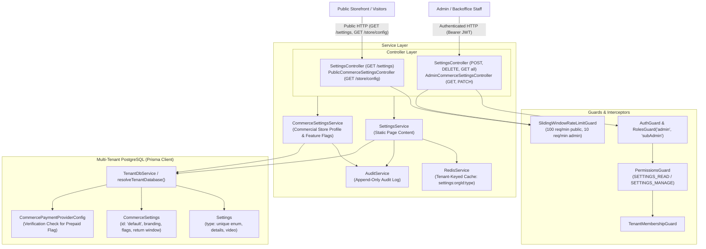
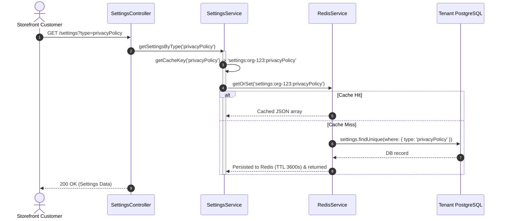
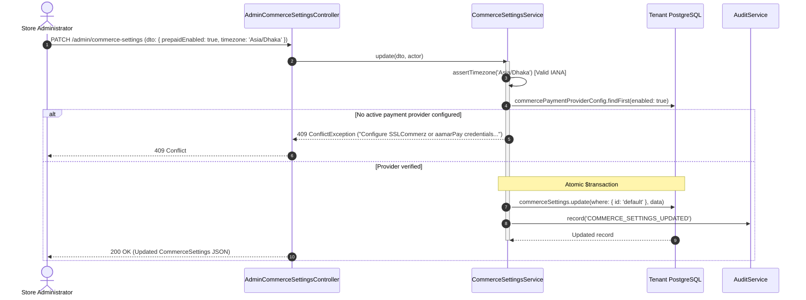

# Settings Feature Architecture & Invariants

## Purpose
The **Settings** feature acts as the central control plane for store configuration, static public content, and global commercial policy in the multi-tenant commerce engine. 

It fulfills two primary responsibilities:
1. **Content Settings (`SettingsService`)**: Manages tenant-specific static informational pages (`aboutUs`, `contactUs`, `privacyPolicy`, `termsAndConditions`, `heroShowcase`) with multi-tenant Redis caching, sliding-window rate limiting, cursor/offset pagination, and audit logging.
2. **Commerce Settings (`CommerceSettingsService`)**: Governs the singleton store profile (`id: 'default'`) containing branding, localization, currency (`BDT`), IANA timezone validation, phone normalization, order reference prefixes, return policy windows, and staged rollout feature flags (`serviceBookingEnabled`, `warrantyClaimsEnabled`, `storefrontAnalyticsEnabled`, `purchaseActivityEnabled`, navigation toggles). It enforces strict operational preconditions, such as forbidding prepaid checkout activation unless verified gateway credentials exist.

---

## Component Architecture



---

## Component Source Map

| File | Primary Symbol | Role | Key Architectural Invariants & Responsibilities |
| :--- | :--- | :--- | :--- |
| [`settings.module.ts`](file:///home/chillpc/MohammadSheakh/projects/26/e-commerce/e-com-nextjs/ferio-nest-prisma/src/features/settings/settings.module.ts) | `SettingsModule` | NestJS Module | Bundles controllers and services; exports `SettingsService` and `CommerceSettingsService` for consumption across commerce feature modules. |
| [`settings.controller.ts`](file:///home/chillpc/MohammadSheakh/projects/26/e-commerce/e-com-nextjs/ferio-nest-prisma/src/features/settings/controllers/settings.controller.ts) | `SettingsController` | REST Controller | Exposes `/settings` for public static page retrieval and admin CRUD. Enforces `SlidingWindowRateLimitGuard`, `AuthGuard`, `RolesGuard`, `PermissionsGuard`, and `TenantMembershipGuard`. |
| [`commerce-settings.controller.ts`](file:///home/chillpc/MohammadSheakh/projects/26/e-commerce/e-com-nextjs/ferio-nest-prisma/src/features/settings/controllers/commerce-settings.controller.ts) | `PublicCommerceSettingsController`<br>`AdminCommerceSettingsController` | REST Controllers | Exposes `/store/config` (unauthenticated, filtered public store info) and `/admin/commerce-settings` (authenticated store configuration and feature flag administration). |
| [`settings.service.ts`](file:///home/chillpc/MohammadSheakh/projects/26/e-commerce/e-com-nextjs/ferio-nest-prisma/src/features/settings/services/settings.service.ts) | `SettingsService` | Domain Service | Handles tenant-isolated static content upsert/deletion, tenant-namespaced Redis caching (`settings:orgId:type`, TTL 1h), filter whitelisting, and cursor/offset pagination. |
| [`commerce-settings.service.ts`](file:///home/chillpc/MohammadSheakh/projects/26/e-commerce/e-com-nextjs/ferio-nest-prisma/src/features/settings/services/commerce-settings.service.ts) | `CommerceSettingsService` | Domain Service | Manages the singleton `CommerceSettings` row (`id: 'default'`); validates IANA timezones; enforces prepaid provider readiness; normalizes phone numbers and emails; dispatches audit events. |
| [`settings.constants.ts`](file:///home/chillpc/MohammadSheakh/projects/26/e-commerce/e-com-nextjs/ferio-nest-prisma/src/features/settings/constants/settings.constants.ts) | `SettingsType`, constants | Enums & Consts | Defines allowed settings types: `aboutUs`, `contactUs`, `privacyPolicy`, `termsAndConditions`, `heroShowcase`. |
| [`settings.cache.constants.ts`](file:///home/chillpc/MohammadSheakh/projects/26/e-commerce/e-com-nextjs/ferio-nest-prisma/src/features/settings/constants/settings.cache.constants.ts) | `SETTINGS_CACHE_CONFIG`, `SETTINGS_RATE_LIMITS` | Configuration | Defines cache key prefixes, TTL (3600s), invalidation patterns, and sliding window rate limits. |
| [`settings.dto.ts`](file:///home/chillpc/MohammadSheakh/projects/26/e-commerce/e-com-nextjs/ferio-nest-prisma/src/features/settings/dto/settings.dto.ts) | DTO Classes | Validation Schemas | Validates static content creation, update, and pagination queries. |
| [`commerce-settings.dto.ts`](file:///home/chillpc/MohammadSheakh/projects/26/e-commerce/e-com-nextjs/ferio-nest-prisma/src/features/settings/dto/commerce-settings.dto.ts) | `UpdateCommerceSettingsDto` | Validation Schema | Validates store branding, support contact, order prefix regex (`^[A-Za-z0-9-]{2,8}$`), return windows, social proof limits, and toggle flags. |
| [`commerce-settings.service.spec.ts`](file:///home/chillpc/MohammadSheakh/projects/26/e-commerce/e-com-nextjs/ferio-nest-prisma/src/features/settings/tests/commerce-settings.service.spec.ts) | Unit Test Suite | Service Specification | Verifies public projection filtering, normalization, audit logging, IANA timezone rejection, and prepaid prerequisite checks. |
| [`settings.service.spec.ts`](file:///home/chillpc/MohammadSheakh/projects/26/e-commerce/e-com-nextjs/ferio-nest-prisma/src/features/settings/tests/settings.service.spec.ts) | Unit Test Suite | Query Boundary Tests | Verifies query filter allowlisting, prevention of unindexed filter forwarding, and safe default sorting. |
| [`staged-feature-flags.spec.ts`](file:///home/chillpc/MohammadSheakh/projects/26/e-commerce/e-com-nextjs/ferio-nest-prisma/src/features/settings/tests/staged-feature-flags.spec.ts) | Integration Test Suite | Feature Flag Tests | Verifies that consumer features (`ServiceBooking`, `Warranty`, `StorefrontAnalytics`) cleanly shut down when toggled off via settings. |

---

## Responsibilities

### Owns
- **Static Content Page Repository**: Authoritative management of institutional store text (`aboutUs`, `contactUs`, `privacyPolicy`, `termsAndConditions`, `heroShowcase`).
- **Multi-Tenant Redis Caching**: Key construction namespaced by organization ID (`settings:${orgId}:${type}`) to prevent cross-tenant cache bleed, with automated cache invalidation upon mutation.
- **Storefront Configuration Control Plane**: Manages the singleton `CommerceSettings` entity (`id: 'default'`) representing store identity, branding (logo, legal name), support contacts, and theme preset.
- **Operational Precondition Enforcement**:
  - Validates IANA timezones using the native V8/Node `Intl.DateTimeFormat` engine.
  - Enforces payment provider presence: Rejects enabling `prepaidEnabled: true` if neither tenant gateway configs (`CommercePaymentProviderConfig`) nor global environment variables (`SSLCOMMERZ_*`, `AAMARPAY_*`) are configured.
- **Master Feature Flag Provider**: Provides canonical feature flags consumed across the platform:
  - `serviceBookingEnabled` (consumed by [`ServiceBookingModule`](file:///home/chillpc/MohammadSheakh/projects/26/e-commerce/e-com-nextjs/ferio-nest-prisma/src/features/service-booking/README.md))
  - `warrantyClaimsEnabled` (consumed by `WarrantyModule`)
  - `storefrontAnalyticsEnabled` (consumed by `StorefrontAnalyticsModule`)
  - `purchaseActivityEnabled` / `purchaseHistoryEnabled` (consumed by `PurchaseActivityModule`)
  - Navigation toggles (`categoryTopNavEnabled`, `categorySideNavEnabled`)
- **Default Policy Windows**: Owns store return window configuration (`defaultReturnWindowDays`), consumed by [`ReturnsModule`](file:///home/chillpc/MohammadSheakh/projects/26/e-commerce/e-com-nextjs/ferio-nest-prisma/src/features/returns/README.md).
- **Public Configuration Sanitization**: Filters and projects public-safe properties for storefront consumption (`getPublic()`), stripping internal settings and sensitive operational flags.
- **Audit Integration**: Records tamper-evident audit records (`SETTINGS_CREATED`, `SETTINGS_UPDATED`, `SETTINGS_DELETED`, `COMMERCE_SETTINGS_UPDATED`).

### Does Not Own
- **Payment Gateway Credential Secret Management**: Does not encrypt or decrypt API keys or SSL secrets (owned by `CommercePaymentsModule`).
- **Feature Execution**: Does not execute service bookings, process warranty claims, or ingest analytics events (owned by respective consumer modules).
- **Tenant Onboarding / Database Provisioning**: Does not provision tenant databases or define organization domains (owned by `TenancyModule`).
- **Customer User Profiles**: Does not manage customer phone numbers, addresses, or identity (owned by `CustomerAccountModule` and `CustomersModule`).

---

## Dependencies

### Consumes
- **`TenancyModule`**: `TenantDbService`, `resolveTenantDatabase()`, `tryGetTenantContext()`, and `TenantMembershipGuard`.
- **`PrismaModule`**: Provides `PrismaService` and PostgreSQL database transactional access.
- **`AuthModule` / `@app/common`**: Provides authentication, roles (`admin`, `subAdmin`), and RBAC permissions (`SETTINGS_READ`, `SETTINGS_MANAGE`).
- **`AuditModule`**: Provides `AuditService` to log compliance-grade audit entries.
- **`RedisModule`**: Provides `RedisService` for caching and cache invalidation.
- **`CheckoutModule` Utility**: Uses `normalizeBangladeshPhone()` to validate and format support phone numbers.

### External Services
- **Redis**: In-memory caching for static settings content (`TTL = 3600s`).

### Emitters
- **Audit Pipeline**: Dispatches `SETTINGS_CREATED`, `SETTINGS_UPDATED`, `SETTINGS_DELETED`, and `COMMERCE_SETTINGS_UPDATED` with previous/new state diffs.

---

## Database Ownership

### Direct Writes / Mutates
| Entity | Operation | Trigger / Method |
| :--- | :--- | :--- |
| `Settings` | `UPSERT` | `createOrUpdateSettings()`: Inserts or updates content by `type`. |
| `Settings` | `DELETE` | `deleteSettingsByType()`: Deletes setting row by `type`. |
| `CommerceSettings` | `UPSERT` / `UPDATE` | `get()`: Ensures singleton row `id = 'default'` exists.<br>`update()`: Mutates store profile, feature flags, return window, and social proof settings. |

### Reads / References
| Entity | Purpose |
| :--- | :--- |
| `CommercePaymentProviderConfig` | Checked in `hasConfiguredPaymentProvider()` to verify if an active payment gateway exists before allowing `prepaidEnabled: true`. |

---

## Important Invariants

### 1. Multi-Tenant Redis Cache Isolation
- Cache keys strictly append the tenant's organization ID:
  $$\text{CacheKey} = \text{settings} : \text{organizationId} : \text{type}$$
- If no tenant context exists (legacy fallback), it defaults to `settings:legacy:${type}`.
- Invalidation patterns guarantee that updates in one organization never evict or overwrite cached settings belonging to another organization.

### 2. Prepaid Checkout Precondition Guard
- Setting `prepaidEnabled: true` is strictly guarded:
  - If inside a tenant context: At least one `CommercePaymentProviderConfig` must have `enabled: true`.
  - If in legacy environment: Environment variables `(SSLCOMMERZ_STORE_ID && SSLCOMMERZ_STORE_PASSWORD)` or `(AAMARPAY_STORE_ID && AAMARPAY_SIGNATURE_KEY)` must be present.
  - If violated: Aborts with `ConflictException('Configure SSLCommerz or aamarPay credentials before enabling prepaid checkout')`. The store cannot advertise online payment when no payment gateway is ready to receive webhooks.

### 3. IANA Timezone Validation
- When updating `timezone`, the system validates the string against the platform's ECMAScript Internationalization API:
  ```typescript
  new Intl.DateTimeFormat('en-US', { timeZone: timezone }).format();
  ```
- If an invalid string (e.g. `'Dhaka/Unknown'`) is provided, it immediately throws `BadRequestException('Timezone must be a valid IANA timezone')`.

### 4. Sliding Window Rate Limiting
- Applied via `SlidingWindowRateLimitGuard`:
  - `GET /settings`: Limited to **100 requests per minute** per IP.
  - `POST /settings`, `DELETE /settings`, and admin listing: Limited to **10 requests per minute** per user.

### 5. Singleton Commerce Settings Pattern
- `CommerceSettings` exists as a singleton identified by `id: 'default'`.
- All read and write operations execute an `upsert` ensuring that uninitialized databases gracefully self-seed default store values (`storeName: 'Ferio'`, `currency: 'BDT'`, `timezone: 'Asia/Dhaka'`, `orderPrefix: 'FER'`).

### 6. Data Normalization & Sanitization
- `storeName`, `legalName`, `address`, `timezone`: Normalized with `NFKC`, trimmed, and consecutive whitespace collapsed.
- `orderPrefix`: Uppercased and validated against `/^[A-Za-z0-9-]{2,8}$/`.
- `supportPhone`: Normalized to Bangladeshi format (`+8801...`).
- `supportEmail`: Converted to lowercase.
- `purchaseActivityExcludedProductIds`: Deduplicated via `Set`.

---

## Public API & Entry Points

### Static Content API (`SettingsController` at `/settings`)

| Method | Endpoint | Guards / Auth | Rate Limit | Required Permission | Description |
| :--- | :--- | :--- | :--- | :--- | :--- |
| `GET` | `/settings` | `@Public()` | 100 / min | None | Fetches static content by `type` query param (cached in Redis for 1 hour). |
| `POST` | `/settings` | `AuthGuard`, `RolesGuard('admin', 'subAdmin')`, `PermissionsGuard`, `TenantMembershipGuard` | 10 / min | `SETTINGS_MANAGE` | Creates or updates static content for a specific `type`. Invalidates Redis cache and logs audit entry. |
| `GET` | `/settings/all` | Same as above | 10 / min | `SETTINGS_READ` | Retrieves all static settings rows for the tenant. |
| `GET` | `/settings/paginate` | Same as above | 10 / min | `SETTINGS_READ` | Offset-based pagination with allowlisted filter and sort validation. |
| `GET` | `/settings/paginate/v2` | Same as above | 10 / min | `SETTINGS_READ` | Cursor-based pagination (`id`-sorted) for infinite-scroll backoffice tables. |
| `DELETE` | `/settings` | Same as above | 10 / min | `SETTINGS_MANAGE` | Deletes content by `type`. Evicts Redis cache and records audit deletion. |

### Store Configuration API (`PublicCommerceSettingsController` & `AdminCommerceSettingsController`)

| Method | Endpoint | Guards / Auth | Required Permission | Description |
| :--- | :--- | :--- | :--- | :--- |
| `GET` | `/store/config` | None (Public) | None | Returns customer-safe store configuration and active feature flags. |
| `GET` | `/admin/commerce-settings` | `AuthGuard`, `RolesGuard('admin')`, `PermissionsGuard`, `TenantMembershipGuard` | `SETTINGS_READ` | Returns full internal commerce settings record including configuration flags. |
| `PATCH` | `/admin/commerce-settings` | Same as above | `SETTINGS_MANAGE` | Updates store profile, feature flags, return policies, and social proof parameters within an audited transaction. |

---

## Important Flows

### 1. Public Content Retrieval with Tenant Cache Flow



### 2. Admin Commerce Settings Update & Precondition Validation



---

## Brutal Honest Vulnerabilities & Architectural Debt

### 1. Upsert-on-Read Side Effect in `CommerceSettingsService.get()`
- **Severity**: Medium (Architectural Hygiene / Read-Replica Failure)
- **Mechanism**: Every invocation of `get()` executes:
  ```typescript
  return db.commerceSettings.upsert({
    where: { id: 'default' },
    update: {},
    create: defaultCommerceSettings,
  });
  ```
- **The Problem**: A read method must never perform a write. Because `getPublic()` is called on every storefront page load, every public query triggers an `UPSERT` against the database. If traffic spikes or if read requests are routed to a PostgreSQL read-replica pool, the query will immediately crash with a read-only transaction violation.
- **Remediation**: Use `findUnique({ where: { id: 'default' } })` and fall back to in-memory defaults if the row does not exist, moving initial creation strictly to tenant provisioning or seed migrations.

### 2. Lack of In-Memory / Distributed Caching for `CommerceSettings`
- **Severity**: High (Database Pressure)
- **Mechanism**: While static page content (`SettingsService`) is cached in Redis with a 1-hour TTL, `CommerceSettingsService.get()` and `getPublic()` query the PostgreSQL database directly on **every single request**.
- **The Problem**: `CommerceSettings` is queried repeatedly by the storefront, `PublicServiceController`, `WarrantyController`, and `StorefrontAnalyticsService`. Under flash sale traffic, thousands of concurrent requests slam the primary database with identical queries for store configuration.
- **Remediation**: Wrap `CommerceSettingsService.get()` in Redis caching or a high-performance in-memory cache (e.g. 60-second TTL with Redis Pub/Sub invalidation upon `PATCH`).

### 3. Open Video Embed / Metadata Object Vulnerability
- **Severity**: Medium (XSS / Injection Vector)
- **Mechanism**: `CreateOrUpdateSettingsDto` accepts `introductionVideo?: Record<string, unknown>` and saves it via `toTenantJsonInput()`.
- **The Problem**: There is no schema validation on the contents of the `introductionVideo` object. Senders can persist malicious script tags, arbitrary URLs, or XSS payloads inside the JSON structure, which a client storefront could unsafely render into the DOM.
- **Remediation**: Replace `Record<string, unknown>` with a strict DTO validating `url` (restricting to YouTube/Vimeo domains), `title`, and `duration`.

### 4. Cache Desynchronization during Multi-Instance Redis Outages
- **Severity**: Low / Medium
- **Mechanism**: Cache invalidation in `SettingsService.createOrUpdateSettings()` occurs **after** the database transaction commits.
- **The Problem**: If Redis is temporarily unreachable or experiences network partition during the `invalidate()` call, the database update succeeds but the stale cache key remains active in Redis for up to 3600 seconds. Visitors will observe outdated legal policies or terms until the TTL expires.
- **Remediation**: Implement a cache versioning scheme or retry queue for failed invalidations.

### 5. Silent Overwriting in Admin Settings CRUD
- **Severity**: Low
- **Mechanism**: `createOrUpdateSettings()` and `CommerceSettingsService.update()` use standard upserts/updates without optimistic locking or version counters.
- **The Problem**: If two administrators modify store configurations or legal policies simultaneously in separate browser tabs, the second save silently overwrites the first without warning.
- **Remediation**: Include an `updatedAt` concurrency check or version token in the payload.
