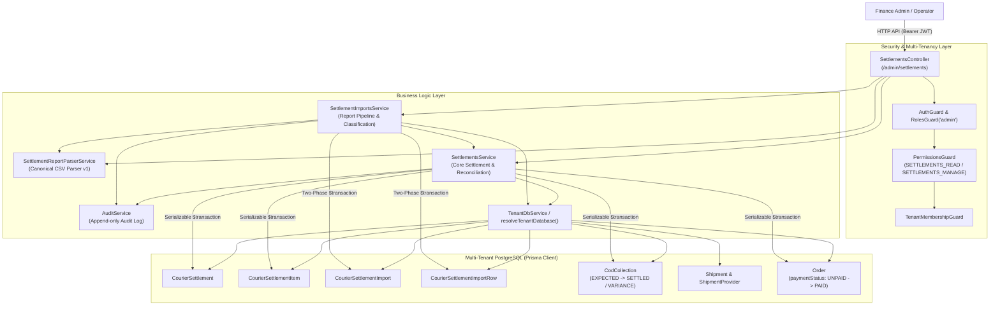
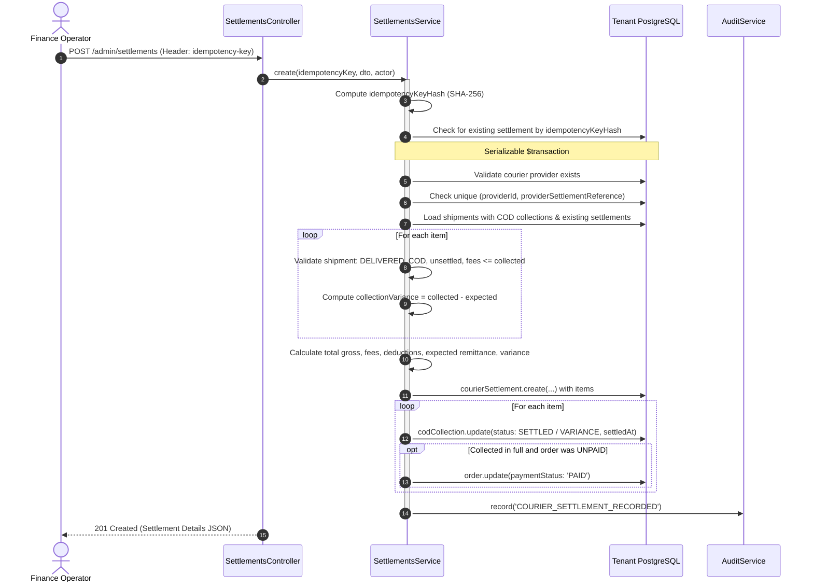
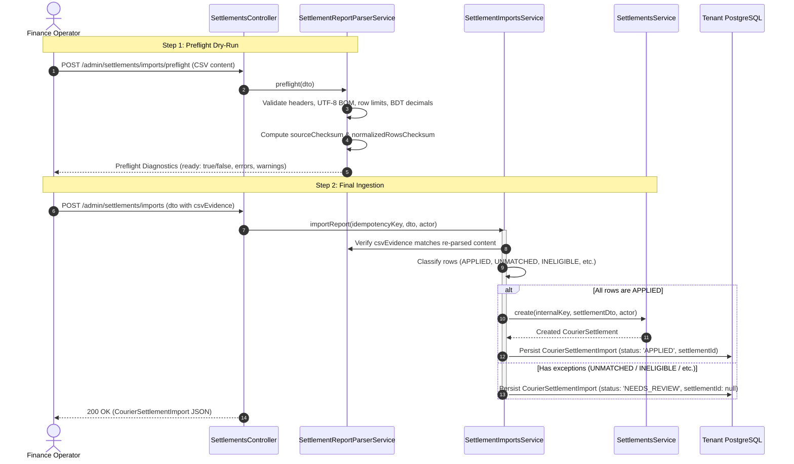
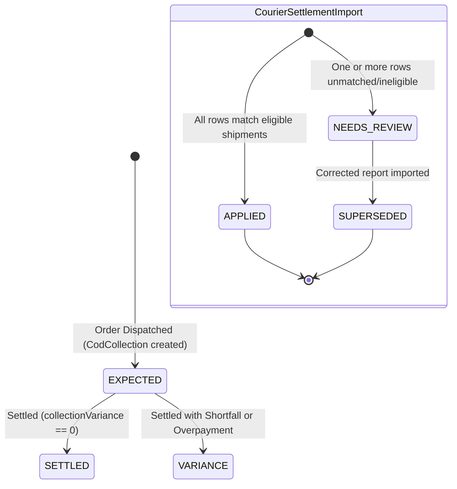

# Settlements Feature Architecture & Invariants

## Purpose
The **Settlements** feature manages the closing of the Cash on Delivery (COD) revenue cycle by reconciling and settling courier remittances against expected delivery collections. 

In Bangladeshi and regional e-commerce, courier partners (e.g., Steadfast, Pathao) collect cash from customers upon delivery and periodically disburse bulk payments to the merchant's bank account, minus courier delivery fees, COD commissions, and return charges. The Settlements feature provides a high-integrity, audited financial engine that:
1. Matches individual delivered COD shipments against courier remittance reports.
2. Identifies and isolates collection shortfalls, fee discrepancies, and bank remittance variances.
3. Automatically marks parent order payments as `PAID` once funds are evidenced to have been collected in full.
4. Provides a two-phase CSV import and preflight pipeline (`canonical-v1`) with tamper-proof cryptographic checksum verification and safe report supersession.

---

## Component Architecture



---

## Component Source Map

| File | Primary Symbol | Role | Key Architectural Invariants & Responsibilities |
| :--- | :--- | :--- | :--- |
| [`settlements.module.ts`](file:///home/chillpc/MohammadSheakh/projects/26/e-commerce/e-com-nextjs/ferio-nest-prisma/src/features/settlements/settlements.module.ts) | `SettlementsModule` | NestJS Feature Module | Bundles `SettlementsController`, `SettlementsService`, `SettlementImportsService`, and `SettlementReportParserService`. Imports `TenancyModule`, `PrismaModule`, `AuthModule`, and `AuditModule`. |
| [`settlements.controller.ts`](file:///home/chillpc/MohammadSheakh/projects/26/e-commerce/e-com-nextjs/ferio-nest-prisma/src/features/settlements/controllers/settlements.controller.ts) | `SettlementsController` | Admin REST Controller | Exposes `/admin/settlements` endpoints. Enforces `AuthGuard`, `RolesGuard('admin')`, `PermissionsGuard`, and `TenantMembershipGuard`. Supports idempotency keys via HTTP headers. |
| [`settlements.service.ts`](file:///home/chillpc/MohammadSheakh/projects/26/e-commerce/e-com-nextjs/ferio-nest-prisma/src/features/settlements/services/settlements.service.ts) | `SettlementsService` | Core Settlement Orchestrator | Executes direct settlement under `Serializable` transaction isolation. Validates shipment eligibility, computes fee and remittance variances, updates `CodCollection`, and conditionally marks orders `PAID`. |
| [`settlement-imports.service.ts`](file:///home/chillpc/MohammadSheakh/projects/26/e-commerce/e-com-nextjs/ferio-nest-prisma/src/features/settlements/services/settlement-imports.service.ts) | `SettlementImportsService` | Batch Ingestion Pipeline | Orchestrates multi-channel report imports (CSV, API, JSON). Verifies cryptographic checksum evidence, classifies rows, manages 15-minute correction locks, and supersedes draft imports. |
| [`settlement-report-parser.service.ts`](file:///home/chillpc/MohammadSheakh/projects/26/e-commerce/e-com-nextjs/ferio-nest-prisma/src/features/settlements/services/settlement-report-parser.service.ts) | `SettlementReportParserService` | Canonical CSV Engine | Implements RFC-4180-compliant CSV parser (`canonical-v1`) with BOM stripping, quote escaping, header normalization, money parsing to integer minor units, and preflight dry-run diagnostics. |
| [`settlement.dto.ts`](file:///home/chillpc/MohammadSheakh/projects/26/e-commerce/e-com-nextjs/ferio-nest-prisma/src/features/settlements/dto/settlement.dto.ts) | DTO Classes | Validation Schemas | Validates input schemas for manual settlements (`CreateCourierSettlementDto`), report imports (`ImportSettlementReportDto`), preflight checks (`PreflightSettlementReportDto`), and checksum evidence. |
| [`settlements.service.spec.ts`](file:///home/chillpc/MohammadSheakh/projects/26/e-commerce/e-com-nextjs/ferio-nest-prisma/src/features/settlements/tests/settlements.service.spec.ts) | Unit Test Suite | Settlement Service Tests | Verifies matched settlements, collection variance isolation, rejection of excessive fees, idempotency replay, and concurrent race resolution. |
| [`settlement-report-parser.service.spec.ts`](file:///home/chillpc/MohammadSheakh/projects/26/e-commerce/e-com-nextjs/ferio-nest-prisma/src/features/settlements/tests/settlement-report-parser.service.spec.ts) | Unit Test Suite | Parser Specification | Tests CSV normalization, template header parity, money decimal precision, duplicate row detection, and row capacity limits. |
| [`settlements.tenant-isolation.spec.ts`](file:///home/chillpc/MohammadSheakh/projects/26/e-commerce/e-com-nextjs/ferio-nest-prisma/src/features/settlements/tests/settlements.tenant-isolation.spec.ts) | Isolation Test Suite | Tenancy Boundary Tests | Validates that settlements are strictly scoped to the tenant's database container. |

---

## Responsibilities

### Owns
- **Settlement Lifecycle & Ingestion**: Manages `CourierSettlement` and `CourierSettlementItem` records representing reconciled courier payouts.
- **Strict Variance Accounting**:
  - Remittance Variance: $\text{variance} = \text{remittedAmount} - \text{expectedRemittance}$
  - Expected Remittance: $\text{expectedRemittance} = \sum (\text{collectedAmount}_i - \text{courierFee}_i - \text{otherDeduction}_i)$
  - Collection Variance: $\text{collectionVariance}_i = \text{collectedAmount}_i - \text{expectedCodAmount}_i$
- **Order Payment Status Synchronization**: Atomically updates `Order.paymentStatus = 'PAID'` if and only if collected amount $\ge$ expected COD amount and order is currently `UNPAID`. Shortfall collections intentionally leave the order unpaid to flag customer/carrier debt.
- **COD Collection Reconciliation**: Updates `CodCollection.status` from `EXPECTED` to `SETTLED` (if collection variance is zero) or `VARIANCE` (if there is a deficit or overpayment).
- **Two-Phase CSV Import Pipeline**:
  - `preflight()`: Evaluates CSV files up to 1 MB / 500 rows, returning structured diagnostics, line-item errors, and SHA-256 content hashes without persisting data.
  - `importReport()`: Ingests verified reports, asserts cryptographic parity against preflight evidence, classifies rows, and automatically transitions to a settled state or a reviewable draft.
- **Report Correction & Supersession**: Provides a safe correction mechanism where a reviewable import (`NEEDS_REVIEW`) can be superseded by a corrected report under a 15-minute lease lock (`correctionClaimHash`).
- **Cryptographic Idempotency**: Guarantees exactly-once execution using SHA-256 hashes of client-supplied `idempotency-key` headers (16–200 characters). Replays return identical results without duplicating ledger transactions.
- **Audit Logging**: Emits structured compliance events (`COURIER_SETTLEMENT_RECORDED`, `COURIER_SETTLEMENT_REPORT_IMPORTED`, `COURIER_SETTLEMENT_REPORT_SUPERSEDED`).

### Does Not Own
- **COD Collection Creation**: Initial `CodCollection` entities are created upstream by [`ShippingModule`](file:///home/chillpc/MohammadSheakh/projects/26/e-commerce/e-com-nextjs/ferio-nest-prisma/src/features/shipping/README.md) when an order is packed and dispatched.
- **Physical Parcel Delivery**: Courier webhook intake and delivery confirmation are owned by `ShippingModule`.
- **Bank Account Integration**: Does not fetch live bank statements or integrate directly with Open Banking APIs. Bank transaction references are recorded manually or via CSV.
- **Payment Gateway Reversals & Refunds**: Does not issue refunds for settled orders (owned by [`RefundsModule`](file:///home/chillpc/MohammadSheakh/projects/26/e-commerce/e-com-nextjs/ferio-nest-prisma/src/features/refunds/README.md)).

---

## Dependencies

### Consumes
- **`TenancyModule`**: Provides `TenantDbService`, `resolveTenantDatabase()`, and `TenantMembershipGuard`.
- **`PrismaModule`**: Provides `PrismaService` and PostgreSQL database transactional access.
- **`AuthModule` / `@app/common`**: Provides authentication, roles (`admin`), and RBAC permissions (`SETTLEMENTS_READ`, `SETTLEMENTS_MANAGE`).
- **`AuditModule`**: Provides `AuditService` to log compliance-grade audit records.

### External Services
- None directly. Uses standard Node.js crypto primitives for SHA-256 hashing and random byte generation.

### Emitters
- **Audit Pipeline**: Dispatches `COURIER_SETTLEMENT_RECORDED`, `COURIER_SETTLEMENT_REPORT_IMPORTED`, and `COURIER_SETTLEMENT_REPORT_SUPERSEDED`.

---

## Database Ownership

### Direct Writes / Mutates
| Entity | Operation | Trigger / Method |
| :--- | :--- | :--- |
| `CourierSettlement` | `INSERT` | `create()`: Creates new settlement batch with status `MATCHED` or `VARIANCE`. |
| `CourierSettlementItem` | `INSERT` | `create()`: Inserts itemized reconciliation rows linking shipments and COD collections. |
| `CodCollection` | `UPDATE` | `create()`: Transitions status to `SETTLED` or `VARIANCE`; records `collectedAmount`, `collectionVariance`, and `settledAt`. |
| `Order` | `UPDATE` | `create()`: Flips `paymentStatus = 'PAID'` if collected amount meets or exceeds expected COD amount. |
| `CourierSettlementImport` | `INSERT` | `importReport()`: Creates import batch in `APPLIED` or `NEEDS_REVIEW` status. |
| `CourierSettlementImport` | `UPDATE` | `importReport()`: Acquires/releases correction claim locks; marks superseded imports as `SUPERSEDED`. |
| `CourierSettlementImportRow` | `INSERT` | `importReport()`: Persists all parsed rows with classified statuses and deduplication keys. |
| `CourierSettlementImportRow` | `UPDATE` | `importReport()`: Clears `deduplicationKey` on superseded rows to allow corrected re-ingestion. |

### Reads / References
| Entity | Purpose |
| :--- | :--- |
| `ShipmentProvider` | Validates courier code (`STEADFAST`, `PATHAO`). |
| `Shipment` | Validates that shipment status is `DELIVERED` and verifies single-settlement constraints. |
| `Order` | Validates that payment method is `COD` and reads existing `paymentStatus`. |
| `CodCollection` | Reads `expectedAmount` and verifies that no existing settlement item claims the collection. |

---

## Important Invariants

### 1. Shipment Eligibility Prerequisites
To be included in a courier settlement, a shipment must satisfy all of the following conditions:
- `shipment.provider.code === dto.provider` (all shipments in a batch must belong to the declared courier).
- `shipment.status === 'DELIVERED'` (undelivered or in-transit shipments cannot be settled).
- `shipment.order.paymentMethod === 'COD'` (prepaid shipments cannot have COD settlements).
- `shipment.codCollection !== null` (must have an expected COD collection record).
- `shipment.settlementItem === null` (cannot be settled more than once).

### 2. Mathematical Consistency & Fee Ceilings
- For every settlement item:
  $$\text{collectedAmount} \ge \text{courierFee} + \text{otherDeduction}$$
  Courier fees and ancillary deductions cannot exceed the gross amount collected from the customer. Violations abort with `BadRequestException('Fees and deductions cannot exceed collected amount')`.
- All monetary sums are validated via `safeSum()` to ensure that intermediate calculations never exceed the integer minor-unit ceiling ($2,000,000,000$ BDT paisa).

### 3. Order Payment Status Invariant
- Parent `Order.paymentStatus` is updated to `PAID` **only** if:
  $$\text{collectedAmount} \ge \text{codCollection.expectedAmount} \quad \text{AND} \quad \text{order.paymentStatus} = \text{'UNPAID'}$$
- **Shortfall Invariant**: If the courier collected less than the order's expected total, the order remains `UNPAID`. This preserves financial visibility so that customer debt or courier disputes can be pursued.

### 4. Concurrency & Serializable Isolation
- `SettlementsService.create()` runs under `Prisma.TransactionIsolationLevel.Serializable`.
- Idempotency is enforced via a unique index on `idempotencyKeyHash`.
- Provider reference uniqueness is enforced via `@@unique([providerId, providerSettlementReference])`.
- Shipment exclusivity is enforced via `@unique shipmentId` on `CourierSettlementItem`.
- Concurrent transaction collisions (Prisma errors `P2002` and `P2034`) are gracefully trapped and mapped to idempotent returns or domain `ConflictException`s.

### 5. Report Import Pipeline & Row Classification
When importing bulk reports, every row is evaluated and assigned one of five immutable statuses:
| Status | Meaning | Action Taken |
| :--- | :--- | :--- |
| `APPLIED` | Perfect match: Delivered, COD, expected collection exists, fees $\le$ collected. | Eligible to automatically trigger settlement creation. |
| `UNMATCHED` | Tracking number does not exist in the tenant's shipments. | Triggers `NEEDS_REVIEW` state; prevents settlement. |
| `INELIGIBLE` | Shipment not delivered, not COD, multiple shipments share tracking, or fees exceed collection. | Triggers `NEEDS_REVIEW` state; prevents settlement. |
| `ALREADY_SETTLED` | Shipment is already linked to an existing `CourierSettlementItem`. | Triggers `NEEDS_REVIEW` state; prevents settlement. |
| `DUPLICATE` | Provider row reference was already ingested in another import. | Triggers `NEEDS_REVIEW` state; prevents settlement. |

### 6. Cryptographic Evidence Verification
- For CSV imports, `verifyParserEvidence()` re-computes the SHA-256 hash of `csvEvidence.content` and verifies that:
  $$\text{recomputedSourceChecksum} = \text{dto.csvEvidence.sourceChecksum}$$
  $$\text{recomputedRowsChecksum} = \text{preflight.normalizedRowsChecksum}$$
- This guarantees that client applications cannot tamper with parsed row data between the preflight preview and final submission.

### 7. Two-Phase Correction Mutex
- Correcting an unresolved import (`NEEDS_REVIEW`) requires acquiring a 15-minute lease:
  ```typescript
  correctionClaimHash = hash(`settlement-correction:${idempotencyKeyHash}`)
  ```
- If another operator is concurrently attempting to correct the same import, the transaction throws `ConflictException('Another correction is already processing for this report')`.

---

## Public API & Entry Points

All endpoints are mounted on `SettlementsController` under `/admin/settlements` and require `admin` role and `SETTLEMENTS_READ` permission (write endpoints require `SETTLEMENTS_MANAGE`).

| Method | Endpoint | Headers | Required Permission | Description |
| :--- | :--- | :--- | :--- | :--- |
| `GET` | `/admin/settlements` | - | `SETTLEMENTS_READ` | Lists up to 100 recent courier settlements ordered by `settledAt: desc`. |
| `GET` | `/admin/settlements/eligible-collections` | - | `SETTLEMENTS_READ` | Lists up to 500 unsettled, delivered COD collections awaiting reconciliation. |
| `GET` | `/admin/settlements/imports` | - | `SETTLEMENTS_READ` | Lists up to 100 settlement report import batches. |
| `GET` | `/admin/settlements/imports/template` | - | `SETTLEMENTS_READ` | Returns the canonical CSV header specification and downloadable template. |
| `POST` | `/admin/settlements/imports/preflight` | - | `SETTLEMENTS_READ` | Dry-run parses a CSV report, returning diagnostics, errors, and SHA-256 checksums without persisting. |
| `POST` | `/admin/settlements/imports` | `idempotency-key` | `SETTLEMENTS_MANAGE` | Ingests a report batch. If all rows are `APPLIED`, automatically generates an underlying `CourierSettlement`. |
| `POST` | `/admin/settlements` | `idempotency-key` | `SETTLEMENTS_MANAGE` | Manually creates an audited, serializable courier settlement batch from shipment IDs. |

---

## Important Flows

### 1. Manual Courier Settlement Flow



### 2. Bulk Settlement Report Import Pipeline



### 3. Settlement Entity State Machine



---

## Brutal Honest Vulnerabilities & Architectural Debt

### 1. Hardcoded Result Caps without Keyset Pagination
- **Severity**: High (Operational Blindspot)
- **Mechanism**: `SettlementsService.list()` is hardcoded to `take: 100`, while `eligibleCollections()` is hardcoded to `take: 500`.
- **The Problem**: In an enterprise e-commerce operation with thousands of daily shipments, unsettled COD collections quickly exceed 500 records. Once the backlog exceeds 500, older eligible collections become completely invisible in the admin UI, preventing finance staff from selecting them for settlement.
- **Remediation**: Implement cursor-based pagination and date-range filtering on `eligibleCollections()` and `list()`.

### 2. Large Raw Payloads in Memory & JSON Columns
- **Severity**: Medium (V8 Heap Pressure)
- **Mechanism**: Both `PreflightSettlementReportDto` and `ImportSettlementReportDto` transmit full CSV text strings up to 1.1 MB directly inside JSON request bodies. Furthermore, `persistImport()` serializes the entire DTO into `CourierSettlementImport.rawPayload` (`Json`), and each row's input into `CourierSettlementImportRow.rawPayload`.
- **The Problem**: Storing redundant JSON strings for 500 rows bloats PostgreSQL table storage and TOAST tables. In addition, parsing 1 MB JSON payloads containing raw multiline CSV strings consumes substantial V8 heap memory and blocks the Node.js event loop during JSON deserialization.
- **Remediation**: Use `multipart/form-data` file streaming instead of raw strings in JSON, and store raw files in object storage (`Attachment` / R2) rather than duplicating raw row payloads in PostgreSQL JSON columns.

### 3. Synchronous Report Import Pipeline Execution
- **Severity**: Medium (Timeout Risk)
- **Mechanism**: `importReport()` processes up to 500 rows, classifies every row against the database, executes checksum validations, and calls `settlements.create()` (which performs serializable database writes on 500 rows) synchronously within a single HTTP request.
- **The Problem**: On large 500-row files, database latency and CPU overhead can push response times past 10–15 seconds, risking HTTP gateway 504 timeouts on cloud load balancers.
- **Remediation**: Offload bulk report processing to an asynchronous BullMQ queue (`settlement-imports-queue`) with WebSocket / polling updates for job completion.

### 4. Hardcoded Courier Provider Codes
- **Severity**: Medium (Extensibility Debt)
- **Mechanism**: `CreateCourierSettlementDto.provider` and `ImportSettlementReportDto.provider` use hardcoded TypeScript string literal unions:
  ```typescript
  @IsIn(['PATHAO', 'STEADFAST'])
  provider: 'PATHAO' | 'STEADFAST';
  ```
- **The Problem**: Onboarding a new courier (e.g. RedX, Paperfly, eCourier, Sundarban) requires modifying multiple DTO files, parser services, and migration constraints across the backend codebase rather than simply adding a row to `ShipmentProvider`.
- **Remediation**: Query `ShipmentProvider` dynamically in validation pipes rather than hardcoding carrier codes in class-validator decorators.

### 5. Inability to Process Negative Net Remittances
- **Severity**: Low / Medium (Accounting Edge Case)
- **Mechanism**: Line 168 of `settlements.service.ts` asserts:
  ```typescript
  if (expectedRemittance < 0) throw new BadRequestException('Fees and deductions cannot exceed collected amount');
  ```
- **The Problem**: In weeks with a very high RTO (Return to Origin) rate, couriers charge return freight fees that exceed the total COD collected on successful deliveries, resulting in a net negative invoice (merchant owes the courier). Because negative remittance throws an exception, finance staff cannot log these negative settlements in the system.
- **Remediation**: Support negative net remittance batches and create an accounts-payable liability entry rather than throwing an exception.
