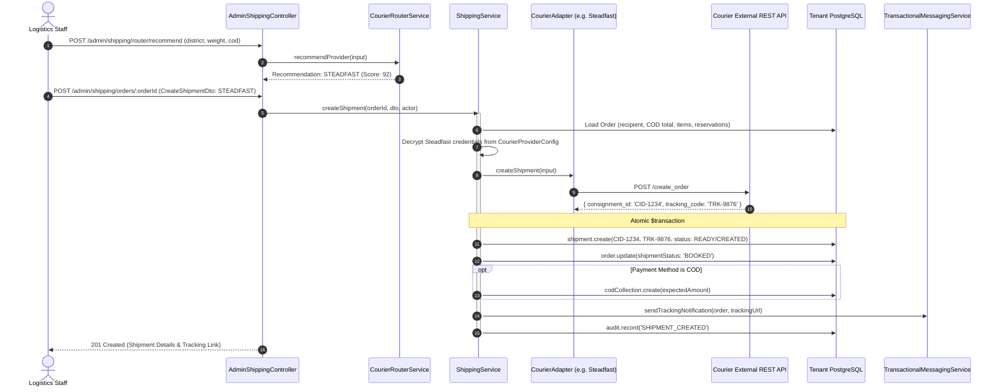
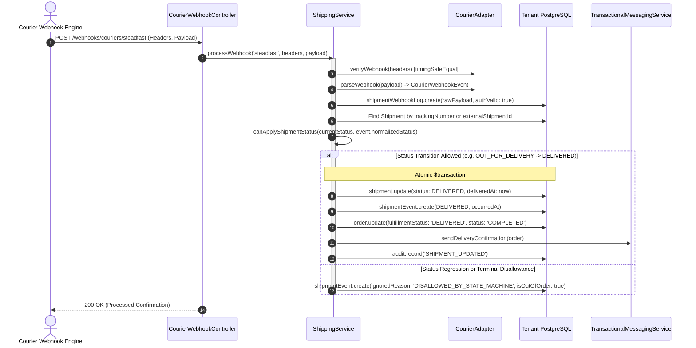

# Shipping Feature Architecture & Invariants

## Purpose
The **Shipping** feature serves as the logistics engine, courier dispatch hub, reverse logistics initiator, and delivery tracking pipeline of the multi-tenant commerce platform. 

It provides production adapters for the six leading courier delivery providers in Bangladesh:
- **Steadfast Courier**
- **Pathao Courier**
- **RedX**
- **eCourier**
- **Paperfly**
- **Carrybee**

The module manages tenant-scoped AES-256-GCM encrypted courier credentials, intelligent delivery routing based on geographic coverage and package weight, dispatch manifest generation, webhook event ingestion with cryptographic verification, resilient background tracking polling with BullMQ queues, delivery confirmation with customer messaging, and automated Return-to-Origin (RTO) case generation upon courier return events.

---

## Component Architecture

```mermaid
flowchart TD
    AdminUser["Admin / Logistics Staff"] -->|"HTTP API (Bearer JWT)"| AdminCtrl["AdminShippingController\n(/admin/shipping/*)"]
    CourierPartners["Courier Webhooks\n(Pathao, Steadfast, RedX, etc.)"] -->|"Public Webhook Post"| WebhookCtrl["CourierWebhookController\n(/webhooks/couriers/:provider)"]

    subgraph SecurityLayer ["Security & Tenancy Guards"]
        AdminCtrl --> AuthG["AuthGuard & RolesGuard('admin')"]
        AuthG --> PermG["PermissionsGuard\n(SHIPPING_READ / SHIPPING_MANAGE / SHIPPING_PROVIDER_MANAGE)"]
        PermG --> TenancyG["TenantMembershipGuard"]
        WebhookCtrl --> WebhookVerifier["adapter.verifyWebhook()\n(timingSafeEqual Signature Check)"]
    end

    subgraph ServiceLayer ["Core Logistics Services"]
        AdminCtrl --> RouterSvc["CourierRouterService\n(Rule-based Scoring Engine)"]
        AdminCtrl --> ShippingSvc["ShippingService\n(Core Dispatch & State Engine)"]
        AdminCtrl --> PollingSvc["ShippingPollingService\n(Active Tracking Poller)"]
        WebhookCtrl --> ShippingSvc
    end

    subgraph QueueProcessing ["Background Queues & Workers (BullMQ)"]
        ShippingSvc --> WebhookQueue["ShippingWebhookQueue\n(courier-callback)"]
        WebhookQueue --> WebhookWorker["ShippingWebhookProcessor\n(TenantFanoutService Execution)"]
        PollingSvc --> PollingQueue["ShippingPollingQueue\n(courier-poll)"]
        PollingQueue --> PollingWorker["ShippingPollingProcessor\n(TenantFanoutService Execution)"]
    end

    subgraph Adapters ["Courier Provider Adapters"]
        ShippingSvc --> Pathao["PathaoAdapter"]
        ShippingSvc --> Steadfast["SteadfastAdapter"]
        ShippingSvc --> Redx["RedxAdapter"]
        ShippingSvc --> Ecourier["EcourierAdapter"]
        ShippingSvc --> Paperfly["PaperflyAdapter"]
        ShippingSvc --> Carrybee["CarrybeeAdapter"]
    end

    subgraph DatabaseLayer ["Multi-Tenant PostgreSQL (Prisma Client)"]
        ShippingSvc --> Shp["Shipment & ShipmentEvent"]
        ShippingSvc --> ShpProv["ShipmentProvider & CourierProviderConfig"]
        ShippingSvc --> ShpLog["ShipmentWebhookLog & ShipmentPollAttempt"]
        ShippingSvc --> Ord["Order (fulfillmentStatus, shipmentStatus)"]
        ShippingSvc --> Cod["CodCollection (SettlementsModule)"]
        ShippingSvc --> Rto["RtoCase (RtoModule)"]
    end

    ShippingSvc --> Msg["TransactionalMessagingService\n(Delivery / Dispatch SMS & Alerts)"]
    ShippingSvc --> Audit["AuditService\n(Append-only Audit Log)"]
```



---

## Component Source Map

| File | Primary Symbol | Role | Key Architectural Invariants & Responsibilities |
| :--- | :--- | :--- | :--- |
| [`shipping.module.ts`](file:///home/chillpc/MohammadSheakh/projects/26/e-commerce/e-com-nextjs/ferio-nest-prisma/src/features/shipping/shipping.module.ts) | `ShippingModule` | NestJS Feature Module | Bundles controllers, providers, 6 courier adapters, BullMQ queues, processors, and router service. Exports `ShippingService` and `CourierRouterService`. |
| [`shipping.controller.ts`](file:///home/chillpc/MohammadSheakh/projects/26/e-commerce/e-com-nextjs/ferio-nest-prisma/src/features/shipping/controllers/shipping.controller.ts) | `AdminShippingController`<br>`CourierWebhookController` | REST Controllers | Exposes backoffice logistics operations (`/admin/shipping/*`) and public webhook ingestion (`/webhooks/couriers/:provider`). Handles special Carrybee response headers (`X-CB-Webhook-Integration-Header`). |
| [`shipping.service.ts`](file:///home/chillpc/MohammadSheakh/projects/26/e-commerce/e-com-nextjs/ferio-nest-prisma/src/features/shipping/services/shipping.service.ts) | `ShippingService` | Core Logistics Orchestrator | Manages shipment creation, courier API dispatch, tenant AES-256 credential resolution, webhook event processing, state machine transitions, RTO case creation, COD collection initialization, and audit logging. |
| [`courier-router.service.ts`](file:///home/chillpc/MohammadSheakh/projects/26/e-commerce/e-com-nextjs/ferio-nest-prisma/src/features/shipping/services/courier-router.service.ts) | `CourierRouterService` | Dynamic Routing Engine | Evaluates destination district (Dhaka vs Outside), upazila coverage, parcel weight, COD amounts, and SLA urgency to score and recommend the optimal courier. |
| [`shipping-polling.service.ts`](file:///home/chillpc/MohammadSheakh/projects/26/e-commerce/e-com-nextjs/ferio-nest-prisma/src/features/shipping/services/shipping-polling.service.ts) | `ShippingPollingService` | Active Tracking Poller | Identifies in-transit shipments needing tracking updates, executes provider poll requests, updates poll attempts, and triggers status processing. |
| [`courier-adapter.interface.ts`](file:///home/chillpc/MohammadSheakh/projects/26/e-commerce/e-com-nextjs/ferio-nest-prisma/src/features/shipping/adapters/courier-adapter.interface.ts) | `CourierAdapter` | Provider Interface | Defines standard contract for all courier adapters: `createShipment()`, `verifyWebhook()`, `parseWebhook()`, and `pollShipment()`. |
| Provider Adapters (`steadfast`, `pathao`, `redx`, `ecourier`, `paperfly`, `carrybee`) | Adapter Classes | Provider Implementations | Implements vendor-specific REST endpoints, authentication headers, webhook payload parsing, and raw-to-canonical status normalization. |
| [`shipping-webhook.queue.ts`](file:///home/chillpc/MohammadSheakh/projects/26/e-commerce/e-com-nextjs/ferio-nest-prisma/src/features/shipping/queues/shipping-webhook.queue.ts) | `ShippingWebhookQueue` | BullMQ Queue Producer | Enqueues webhook retries, schedules periodic sweep jobs (`sweep-courier-callbacks`), and monitors queue health. |
| [`shipping-webhook.processor.ts`](file:///home/chillpc/MohammadSheakh/projects/26/e-commerce/e-com-nextjs/ferio-nest-prisma/src/features/shipping/processors/shipping-webhook.processor.ts) | `ShippingWebhookProcessor` | BullMQ Worker | Processes queued courier callback retries with tenant context re-entry via `TenantFanoutService`. |
| [`shipping-polling.queue.ts`](file:///home/chillpc/MohammadSheakh/projects/26/e-commerce/e-com-nextjs/ferio-nest-prisma/src/features/shipping/queues/shipping-polling.queue.ts) | `ShippingPollingQueue` | BullMQ Queue Producer | Enqueues shipment polling jobs, schedules periodic sweep jobs (`sweep-courier-polls`), and checks polling health. |
| [`shipping-polling.processor.ts`](file:///home/chillpc/MohammadSheakh/projects/26/e-commerce/e-com-nextjs/ferio-nest-prisma/src/features/shipping/processors/shipping-polling.processor.ts) | `ShippingPollingProcessor` | BullMQ Worker | Executes queued tracking poll requests with tenant context re-entry via `TenantFanoutService`. |
| [`shipping.util.ts`](file:///home/chillpc/MohammadSheakh/projects/26/e-commerce/e-com-nextjs/ferio-nest-prisma/src/features/shipping/utils/shipping.util.ts) | Utility Functions | State Machine & Crypto | Implements `canApplyShipmentStatus()` finite state machine, courier raw status normalization dictionaries, and `secureWebhookCredentialEquals()` with `timingSafeEqual()`. |
| [`courier-credentials.util.ts`](file:///home/chillpc/MohammadSheakh/projects/26/e-commerce/e-com-nextjs/ferio-nest-prisma/src/features/shipping/utils/courier-credentials.util.ts) | Credential Security | Encryption & Context | Encrypts/decrypts courier credentials using AES-256-GCM. Binds decrypted tenant credentials to request execution contexts via AsyncLocalStorage (`runWithCourierCredentials`). |
| [`shipping.dto.ts`](file:///home/chillpc/MohammadSheakh/projects/26/e-commerce/e-com-nextjs/ferio-nest-prisma/src/features/shipping/dto/shipping.dto.ts) | DTO Classes | Validation Schemas | Validates shipment creation (`CreateShipmentDto`), provider toggling, and credential updates (`UpdateCourierProviderConfigDto`). |

---

## Responsibilities

### Owns
- **Courier API Integrations**: End-to-end communication with Steadfast, Pathao, RedX, eCourier, Paperfly, and Carrybee for booking, cancellation, tracking, and polling.
- **Tenant-Scoped Encrypted Credential Vault**: Stores encrypted courier API credentials (`CourierProviderConfig.credentialCipher`) using AES-256-GCM, dynamically decrypted per request using AsyncLocalStorage.
- **Courier Recommendation & Routing**: Algorithmic scoring of available couriers based on destination, weight tier, cash collection amount, and SLA urgency via `CourierRouterService`.
- **Shipment Lifecycle & Monotonic State Machine**:
  - Validates all status transitions using `canApplyShipmentStatus()`.
  - Enforces terminal boundaries: Once a shipment reaches `DELIVERED`, `RTO`, `RETURNED`, or `CANCELLED`, subsequent events cannot regress or alter the status.
  - Detects out-of-order events: Logs them in `ShipmentEvent` with `isOutOfOrder = true` without corrupting current shipment state.
- **Webhook Ingestion Pipeline**:
  - Validates incoming webhook signatures using timing-safe comparisons (`secureWebhookCredentialEquals`).
  - Deduplicates events via SHA-256 deduplication keys.
  - Buffers and retries failed callbacks via BullMQ queue (`QUEUE_NAMES.COURIER_CALLBACK`).
- **Active Background Polling Engine**:
  - Automatically identifies in-transit shipments lacking recent tracking updates.
  - Executes active polling via BullMQ (`QUEUE_NAMES.COURIER_POLL`) with exponential backoff on provider errors.
- **Downstream Domain Triggers**:
  - When a COD shipment is created: Instantiates `CodCollection` for [`SettlementsModule`](file:///home/chillpc/MohammadSheakh/projects/26/e-commerce/e-com-nextjs/ferio-nest-prisma/src/features/settlements/README.md).
  - When status becomes `DELIVERED`: Flips `Order.fulfillmentStatus = 'DELIVERED'`, sets `deliveredAt = now()`, marks `Order.status = 'COMPLETED'`, and sends customer delivery SMS.
  - When status becomes `RETURNED` or `RTO`: Instantiates `RtoCase` and `RtoItem` records for [`RtoModule`](file:///home/chillpc/MohammadSheakh/projects/26/e-commerce/e-com-nextjs/ferio-nest-prisma/src/features/rto/README.md), referencing active order item reservations.

### Does Not Own
- **Warehouse Packing & Box Assembly**: Physical warehouse fulfillment and item verification prior to courier dispatch are owned by `FulfillmentModule` / `OrderModule`.
- **Physical RTO Inspection & Inventory Restocking**: Warehouse intake of returned parcels, condition grading, and restocking stock movements are owned by [`RtoModule`](file:///home/chillpc/MohammadSheakh/projects/26/e-commerce/e-com-nextjs/ferio-nest-prisma/src/features/rto/README.md).
- **Courier COD Remittance Reconciliation**: Financial matching of courier bank payments against collected funds is owned by [`SettlementsModule`](file:///home/chillpc/MohammadSheakh/projects/26/e-commerce/e-com-nextjs/ferio-nest-prisma/src/features/settlements/README.md).
- **Post-Delivery Customer Returns (RMA)**: Customer return authorization and policy windows are owned by [`ReturnsModule`](file:///home/chillpc/MohammadSheakh/projects/26/e-commerce/e-com-nextjs/ferio-nest-prisma/src/features/returns/README.md).

---

## Dependencies

### Consumes
- **`TenancyModule`**: `TenantDbService`, `resolveTenantDatabase()`, `TenantFanoutService`, `tryGetTenantContext()`, and `TenantMembershipGuard`.
- **`PrismaModule`**: Provides `PrismaService` and PostgreSQL database transactional access.
- **`AuthModule` / `@app/common`**: Provides authentication, roles (`admin`), and RBAC permissions (`SHIPPING_READ`, `SHIPPING_MANAGE`, `SHIPPING_PROVIDER_MANAGE`).
- **`AuditModule`**: Provides `AuditService` to log compliance-grade audit entries.
- **`TransactionalMessagingModule`**: Provides `TransactionalMessagingService` to dispatch SMS and email notifications upon dispatch and delivery.
- **`BullMQ`**: Ingests background jobs on `QUEUE_NAMES.COURIER_CALLBACK` and `QUEUE_NAMES.COURIER_POLL`.
- **`PlanGateService`**: Verifies enterprise tier access for advanced features like automated courier routing (`courierRouting`).

### External Services
- **Steadfast API**: Order placement (`/create_order`), polling (`/status_by_cid`), webhook tokens.
- **Pathao Courier API**: OAuth token exchange, order creation (`/aladdin/api/v1/orders`), polling, webhook signature headers.
- **RedX API**: Parcel creation, tracking query endpoints.
- **eCourier API**: Order placement and tracking query endpoints.
- **Paperfly API**: Order creation and tracking query endpoints.
- **Carrybee API**: Order creation and webhook handshake headers.

### Emitters
- **Audit Pipeline**: Dispatches `SHIPMENT_CREATED`, `SHIPMENT_UPDATED`, `COURIER_WEBHOOK_PROCESSED`, and `COURIER_PROVIDER_CONFIG_UPDATED`.
- **Transactional Messaging**: Emits dispatch and delivery tracking SMS/email alerts.

---

## Database Ownership

### Direct Writes / Mutates
| Entity | Operation | Trigger / Method |
| :--- | :--- | :--- |
| `Shipment` | `INSERT` | `createShipment()`: Creates shipment record with external ID, tracking number, and URLs. |
| `Shipment` | `UPDATE` | `processWebhook()` / `poll()`: Updates status, `deliveredAt`, `returnedAt`, `lastPolledAt`, and `nextPollAt`. |
| `ShipmentEvent` | `INSERT` | Appended on every webhook receipt or poll update with deduplication key and raw payload. |
| `ShipmentProvider` | `UPDATE` | `updateProvider()`: Activates or deactivates a courier provider. |
| `CourierProviderConfig` | `UPSERT` / `DELETE` | `updateProviderConfig()` / `revokeProviderConfig()`: Stores or removes encrypted courier credentials. |
| `ShipmentWebhookLog` | `INSERT` / `UPDATE` | Logs raw webhook payloads; tracks processing attempts and errors. |
| `ShipmentPollAttempt` | `INSERT` / `UPDATE` | Logs active polling attempts, queue job IDs, raw responses, and poll errors. |
| `CodCollection` | `INSERT` | `createShipment()`: If payment method is `COD`, initializes expected collection row. |
| `RtoCase` & `RtoItem` | `INSERT` | `processWebhook()`: If courier status is `RETURNED` or `RTO`, creates RTO case. |
| `Order` | `UPDATE` | `createShipment()`: Sets `shipmentStatus = 'BOOKED'`.<br>`processWebhook()`: Updates `shipmentStatus`, `fulfillmentStatus = 'DELIVERED'`, and `status = 'COMPLETED'` upon delivery. |

---

## Important Invariants

### 1. Monotonic State Machine (`canApplyShipmentStatus`)
- Status progression must obey valid forward paths:
  $$\text{NOT\_CREATED} \rightarrow \text{READY} \rightarrow \text{CREATED} \rightarrow \text{PICKED\_UP} \rightarrow \text{IN\_TRANSIT} \rightarrow \text{AT\_HUB} \rightarrow \text{OUT\_FOR\_DELIVERY} \rightarrow \text{DELIVERED}$$
- **Terminal State Freeze**: Once a shipment reaches `DELIVERED`, `RETURNED`, `CANCELLED`, or `RTO`, no further status update can be applied. Any subsequent webhook arriving after a terminal state is marked `isOutOfOrder = true` in `ShipmentEvent` and discarded.
- Status regression (e.g. `DELIVERED` back to `IN_TRANSIT`) is strictly forbidden.

### 2. Tenant Credential Encryption & Context Binding
- In multi-tenant environments, courier credentials (API keys, client secrets, webhook tokens) are stored in `CourierProviderConfig.credentialCipher` encrypted via AES-256-GCM.
- When executing courier requests, `tenantCredentials()` decrypts the secrets and binds them to the active thread context via AsyncLocalStorage (`runWithCourierCredentials`).
- If an organization has not configured credentials for a provider, attempting to dispatch with that courier throws `ConflictException('${code} credentials are not configured')`.

### 3. Webhook Authentication & Anti-Timing Attacks
- Webhook endpoints verify signatures, bearer tokens, or basic auth headers according to courier specs.
- Credential comparisons must use `secureWebhookCredentialEquals(provided, expected)`, executing SHA-256 digest hashing followed by `crypto.timingSafeEqual()` to eliminate timing attack vulnerabilities.

### 4. Automated RTO Case Creation
- When a webhook or poll returns a normalized status of `RETURNED` or `RTO`:
  - Scans `shipment.order.items` and extracts active inventory reservations.
  - Checks if an `RtoCase` already exists for `shipment.id`.
  - If not, creates an `RtoCase` with status `AWAITING_RECEIPT`, linking all expected quantities to the order's reservations.

### 5. Automated Order Completion upon Delivery
- When a shipment is confirmed `DELIVERED`:
  - `Shipment.deliveredAt` is recorded.
  - Parent `Order.fulfillmentStatus` is set to `DELIVERED`.
  - Parent `Order.status` is set to `COMPLETED`.
  - Emits delivery confirmation SMS/email to the customer.

### 6. Background Queue Tenancy Fanout
- Background BullMQ workers (`ShippingWebhookProcessor`, `ShippingPollingProcessor`) receive jobs containing an `organizationId`.
- Workers invoke `TenantFanoutService.forOrganization(organizationId, callback)` to re-establish the tenant's database connection and credential context before processing webhooks or poll requests.

---

## Public API & Entry Points

### Admin Logistics API (`AdminShippingController` at `/admin/shipping`)

| Method | Endpoint | Required Permission | Description |
| :--- | :--- | :--- | :--- |
| `GET` | `/admin/shipping/providers` | `SHIPPING_READ` | Lists configured shipment providers and active statuses. |
| `GET` | `/admin/shipping/scorecard` | `SHIPPING_READ` | Returns performance scorecard (delivery rates, RTO rates, transit times) across couriers. |
| `POST` | `/admin/shipping/router/recommend` | `SHIPPING_READ` | Evaluates package destination, weight, and COD to recommend the optimal courier. |
| `GET` | `/admin/shipping/shipments` | `SHIPPING_READ` | Lists recent shipments with tracking numbers, provider, and status details. |
| `GET` | `/admin/shipping/webhooks` | `SHIPPING_READ` | Lists raw incoming courier webhook logs. |
| `GET` | `/admin/shipping/webhooks/queue-health` | `SHIPPING_READ` | Reports queue depth and worker health for the webhook processing queue. |
| `POST` | `/admin/shipping/webhooks/:id/retry` | `SHIPPING_MANAGE` | Enqueues a failed webhook log for worker retry. |
| `GET` | `/admin/shipping/polls` | `SHIPPING_READ` | Lists active polling attempts and results. |
| `GET` | `/admin/shipping/polls/queue-health` | `SHIPPING_READ` | Reports queue depth and worker health for the polling queue. |
| `POST` | `/admin/shipping/shipments/:id/poll` | `SHIPPING_MANAGE` | Manually triggers an active tracking poll for a specific shipment. |
| `PATCH` | `/admin/shipping/providers/:code` | `SHIPPING_PROVIDER_MANAGE` | Toggles a courier provider active/inactive. |
| `PUT` | `/admin/shipping/providers/:code/config` | `SHIPPING_PROVIDER_MANAGE` | Encrypts and stores tenant API credentials for a courier provider. |
| `DELETE` | `/admin/shipping/providers/:code/config` | `SHIPPING_PROVIDER_MANAGE` | Revokes and deletes tenant credentials for a courier provider. |
| `GET` | `/admin/shipping/orders/:orderId` | `SHIPPING_READ` | Retrieves the shipment details and event tracking history for an order. |
| `POST` | `/admin/shipping/orders/:orderId` | `SHIPPING_MANAGE` | Books and dispatches a shipment with the selected courier adapter. |

### Public Webhook Ingestion API (`CourierWebhookController` at `/webhooks/couriers`)

| Method | Endpoint | Auth / Verification | Description |
| :--- | :--- | :--- | :--- |
| `POST` | `/webhooks/couriers/:provider` | Provider Header / Token | Ingests real-time courier tracking webhooks. Validates signature, logs raw payload, updates shipment state machine, and emits domain triggers. |

---

## Important Flows

### 1. Shipment Dispatch and Courier Booking Flow



### 2. Webhook Ingestion, Monotonic State Update, and Terminal Delivery



---

## Brutal Honest Vulnerabilities & Architectural Debt

### 1. Synchronous Outbound API Dispatch within Admin HTTP Request
- **Severity**: High (Gateway Timeout Risk)
- **Mechanism**: In `ShippingService.createShipment()`, the external HTTP call to the courier partner (`adapter.createShipment()`) is executed synchronously on the client thread before saving the shipment.
- **The Problem**: Third-party courier REST APIs in Bangladesh frequently experience latency spikes of 5–15 seconds during peak evening packing hours. If the courier API hangs or times out, the browser request times out with an HTTP 504. Worse, if the courier created the shipment on their end but timed out before returning the response, an orphan consignment exists with the courier that Ferio knows nothing about.
- **Remediation**: Transition shipment booking to a two-phase asynchronous queue (`ShippingDispatchQueue`), immediately returning a `PENDING_DISPATCH` shipment to the admin UI.

### 2. Hardcoded Query Pagination Caps (`take: 50` / `take: 100`)
- **Severity**: High (Operational Blindspot)
- **Mechanism**: `getShipments()` and `getWebhookLogs()` use hardcoded limits without query parameters:
  ```typescript
  return db.shipment.findMany({ take: 50, ... });
  return db.shipmentWebhookLog.findMany({ take: 100, ... });
  ```
- **The Problem**: Busy merchants shipping hundreds of orders daily lose all visibility of shipments dispatched earlier in the week. Logistics managers cannot filter by date range, provider, or tracking status.
- **Remediation**: Implement a standard `ShipmentQueryDto` with cursor-based pagination, date filtering, and status filters.

### 3. Blind Webhook 200 Response on Processing Errors
- **Severity**: Medium (Data Desynchronization)
- **Mechanism**: In `CourierWebhookController.receive()`, errors during webhook execution are caught and a `200 OK` (or `202 Accepted` for Carrybee) is returned to the courier partner.
- **The Problem**: While returning 200 prevents courier servers from flooding the endpoint with rapid retries, if an unhandled internal database error occurs (e.g. transient DB connection pool exhaustion), the courier considers the webhook successfully delivered and will never retry it. If the tracking update is lost and active polling is disabled, the shipment remains stuck in transit forever.
- **Remediation**: Ensure failed webhooks are unconditionally persisted to `ShipmentWebhookLog` with `processed = false`, and rely on the existing `ShippingWebhookQueue` scheduler to sweep and replay them.

### 4. Single Master Credential Encryption Key
- **Severity**: Critical (Platform-Wide Blast Radius)
- **Mechanism**: All tenant courier credentials across all six providers are encrypted using a single static key: `config.get('PLATFORM_DB_CREDENTIAL_KEY')`.
- **The Problem**: If an attacker gains read access to the database and compromises this single environment variable, the API tokens, merchant credentials, and webhook secrets for every tenant on the platform are simultaneously compromised.
- **Remediation**: Introduce per-tenant key derivation (HKDF) combining the platform master secret with the tenant's unique `organizationId`.

### 5. Fragile Third-Party Courier API Schemas
- **Severity**: Medium
- **Mechanism**: Provider adapters parse unstructured or inconsistently typed JSON payloads from courier webhooks (e.g., Steadfast string numbers vs integers, Pathao nested object variations).
- **The Problem**: Courier partners in the region frequently alter webhook payload keys or status strings without notice or semantic API versioning. When this occurs, payloads fail parsing or default to `UNKNOWN` status.
- **Remediation**: Implement contract testing with recorded mock fixtures and add automated alerts when a provider's `UNKNOWN` status rate spikes.
