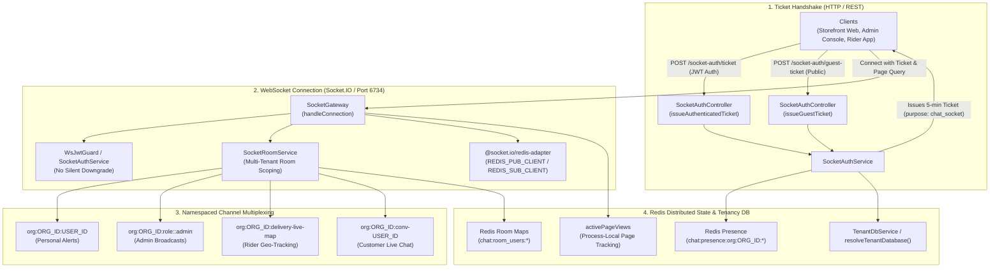
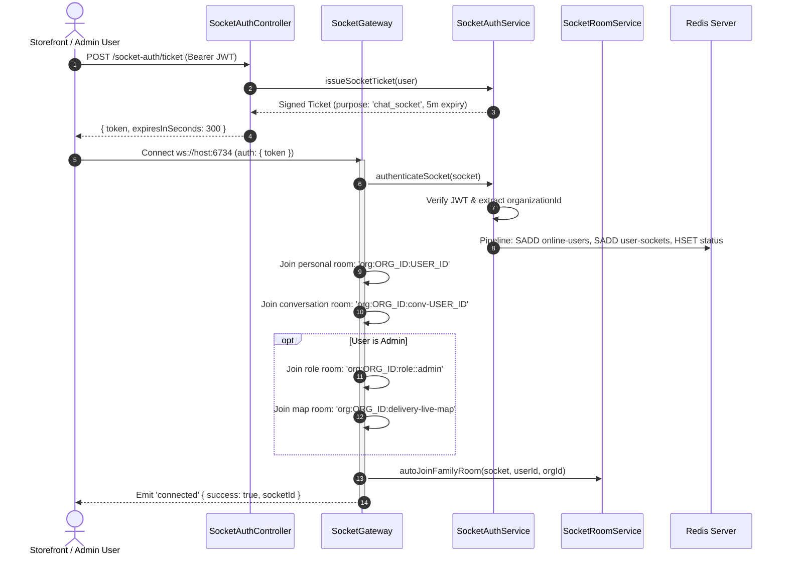
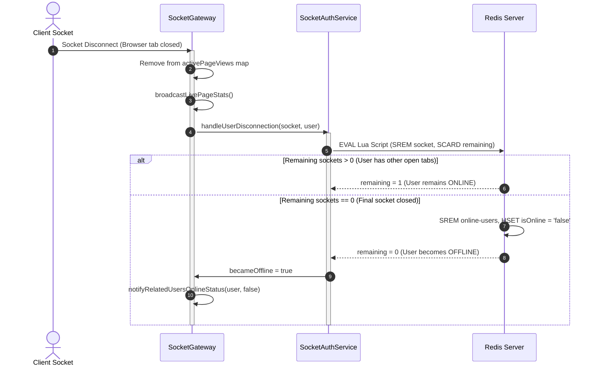

# Socket Gateway Feature Architecture & Invariants

## Purpose
The **Socket Gateway** feature serves as the real-time bi-directional communication infrastructure of the multi-tenant commerce platform. Powered by NestJS WebSockets, Socket.IO, and a distributed Redis Pub/Sub adapter, it provides low-latency messaging, live presence tracking, operational alerts, and telemetry across storefront customers, guest visitors, delivery riders, and backoffice administrators.

It powers key operational capabilities:
1. **Live Customer Chat & Support**: Real-time message exchange, typing indicators, read receipts, and conversation access control.
2. **Strict Multi-Tenant Channel Isolation (MT-8 §11.3)**: Cryptographically namespaced rooms ensuring that identical user IDs, roles, and conversation channels across distinct organizations never cross-contaminate.
3. **Ticket-Based Ephemeral Authentication**: Short-lived (5-minute) signed JWT tickets for authenticated users and UUID-validated guests, eliminating long-lived token exposure in query parameters and WebSocket handshakes.
4. **Real-Time Storefront Telemetry**: Live visitor tracking per page (`page-view`) and instant administrative hydration (`live-page-visitors-stats`).
5. **Delivery Fleet Tracking**: Real-time geospatial coordinates from delivery personnel broadcast to the backoffice dispatch live map (`delivery-live-map`).
6. **Distributed Multi-Device Presence**: Atomic Redis Lua scripts tracking online status across multiple browser tabs and devices per user.

---

## Component Architecture



---

## Component Source Map

| File | Primary Symbol | Role | Key Architectural Invariants & Responsibilities |
| :--- | :--- | :--- | :--- |
| [`socket.module.ts`](file:///home/chillpc/MohammadSheakh/projects/26/e-commerce/e-com-nextjs/ferio-nest-prisma/src/features/socket-gateway/socket.module.ts) | `SocketModule` | Global NestJS Module | Configured as `@Global()`. Bundles and exports `SocketGateway`, `SocketAuthService`, and `SocketRoomService`. Integrates JWT, Redis, Prisma, Firebase, and Tenancy modules. |
| [`socket-auth.controller.ts`](file:///home/chillpc/MohammadSheakh/projects/26/e-commerce/e-com-nextjs/ferio-nest-prisma/src/features/socket-gateway/controllers/socket-auth.controller.ts) | `SocketAuthController` | REST Controller | Mints short-lived (300-second) WebSocket access tickets for authenticated staff/users (`/socket-auth/ticket`) and guest visitors (`/socket-auth/guest-ticket`). |
| [`ws-jwt.guard.ts`](file:///home/chillpc/MohammadSheakh/projects/26/e-commerce/e-com-nextjs/ferio-nest-prisma/src/features/socket-gateway/guards/ws-jwt.guard.ts) | `WsJwtGuard` | WebSocket Auth Guard | Verifies JWT tokens present in handshake `auth.token` or `headers.token`. Rejects unauthenticated connections with `WsException`. |
| [`socket.gateway.ts`](file:///home/chillpc/MohammadSheakh/projects/26/e-commerce/e-com-nextjs/ferio-nest-prisma/src/features/socket-gateway/gateway/socket.gateway.ts) | `SocketGateway` | Central WebSocket Hub | Listens on port 6734 (or `SOCKET_PORT`). Attaches Redis adapter for horizontal scaling. Coordinates connection lifecycles, real-time page-view telemetry, chat routing, rider coordinate streaming, and administrative broadcasts. |
| [`socket-auth.service.ts`](file:///home/chillpc/MohammadSheakh/projects/26/e-commerce/e-com-nextjs/ferio-nest-prisma/src/features/socket-gateway/services/socket-auth.service.ts) | `SocketAuthService` | Auth & Presence Service | Validates tickets, prevents silent auth downgrade, manages multi-tenant presence keys (`socketPresenceKeys()`), tracks online users, and verifies conversation access rights. |
| [`socket-room.service.ts`](file:///home/chillpc/MohammadSheakh/projects/26/e-commerce/e-com-nextjs/ferio-nest-prisma/src/features/socket-gateway/services/socket-room.service.ts) | `SocketRoomService` | Channel & Group Manager | Manages user memberships in conversation rooms, task rooms, family/group rooms, and bounded activity feeds in Redis with tenant scoping. |
| [`socket.gateway.spec.ts`](file:///home/chillpc/MohammadSheakh/projects/26/e-commerce/e-com-nextjs/ferio-nest-prisma/src/features/socket-gateway/tests/socket.gateway.spec.ts) | Unit Test Suite | Gateway Specification | Validates tenant-scoped emissions (`broadcastToRole`, `emitNotificationToUser`), ensuring notifications never cross organization boundaries. |
| [`socket-auth.service.spec.ts`](file:///home/chillpc/MohammadSheakh/projects/26/e-commerce/e-com-nextjs/ferio-nest-prisma/src/features/socket-gateway/tests/socket-auth.service.spec.ts) | Unit Test Suite | Auth Service Tests | Verifies ticket generation, guest ID validation, rejection of invalid tokens, and multi-device presence accounting. |
| [`socket-room.service.spec.ts`](file:///home/chillpc/MohammadSheakh/projects/26/e-commerce/e-com-nextjs/ferio-nest-prisma/src/features/socket-gateway/tests/socket-room.service.spec.ts) | Unit Test Suite | Room Service Tests | Verifies tenant-isolated room joining, room user retrieval, cleanup on disconnection, and activity feed trimming. |

---

## Responsibilities

### Owns
- **WebSocket Gateway Lifecycle**: Manages client connection handshakes, heartbeats, and disconnections on port 6734.
- **Horizontal Clustering via Redis**: Attaches `@socket.io/redis-adapter` (`REDIS_PUB_CLIENT` / `REDIS_SUB_CLIENT`), enabling seamless multi-worker clustering across multiple container replicas.
- **Ephemeral Ticket Handshake**:
  - Issues 5-minute single-purpose tickets (`purpose: 'chat_socket'`).
  - Validates guest identifiers against strict UUID pattern:
    `^gst_[0-9a-f]{8}-[0-9a-f]{4}-[1-5][0-9a-f]{3}-[89ab][0-9a-f]{3}-[0-9a-f]{12}$`
- **Anti-Downgrade Security Policy**: Strictly disconnects clients that present invalid or expired JWT tokens. Tokens are never silently downgraded to anonymous guest sessions.
- **Multi-Tenant Room Scoping (MT-8 §11.3)**:
  - Formats all room channels via `scopedSocketRoom(user, room)`.
  - In tenant contexts, rooms are prefixed: `org:${organizationId}:${room}`.
  - Ensures administrative channels (`role::admin`, `delivery-live-map`, `admin-room`) only receive events originating within the same tenant organization.
- **Atomic Multi-Device Presence Tracking**:
  - Maintains online user sets and socket-to-user maps in Redis.
  - Executes Lua scripts during disconnect: A user is marked offline only when their final active socket disconnects (`SCARD == 0`), preventing false offline transitions when closing one browser tab.
- **Storefront Telemetry & Live Visitor Aggregation**:
  - Processes client `page-view` events.
  - Computes active visitor aggregates across critical checkout funnels (`/`, `/cart`, `/checkout`, `/products`, `/track`, `/delivery/portal`).
  - Broadcasts live stats to connected backoffice administrators.
- **Live Fleet Tracking**: Relays real-time GPS coordinates from delivery personnel (`delivery-location-update`) to the tenant's `delivery-live-map` room.

### Does Not Own
- **Chat Message Persistence**: Message schema, database inserts, and attachments are owned by [`ChattingModule`](file:///home/chillpc/MohammadSheakh/projects/26/e-commerce/e-com-nextjs/ferio-nest-prisma/src/features/chatting/README.md).
- **Mobile Push Notifications (FCM / APNs)**: Offline mobile push notifications are handled by `FirebaseModule`.
- **Primary User Authentication**: Password verification, OAuth flows, and refresh token rotation belong to `AuthenticationModule`.
- **Order Logistics Fulfillment**: Parcel dispatch and courier bookings belong to [`ShippingModule`](file:///home/chillpc/MohammadSheakh/projects/26/e-commerce/e-com-nextjs/ferio-nest-prisma/src/features/shipping/README.md).

---

## Dependencies

### Consumes
- **`TenancyModule`**: `TenantDbService`, `resolveTenantDatabase()`, `TenantFanoutService`, `tryGetTenantContext()`, and `TenantMembershipGuard`.
- **`RedisModule`**: Provides `REDIS_CLIENT` (presence and room state), `REDIS_PUB_CLIENT`, and `REDIS_SUB_CLIENT` (Socket.IO clustering).
- **`PrismaModule`**: Provides `PrismaService` and PostgreSQL database access for user and conversation lookups.
- **`FirebaseModule`**: Injected for mobile push notification dispatch when users are offline.
- **`ChattingModule`**: Handles chat persistence and message authorization via forward reference.

### External Services
- **Redis Server / Cluster**: Acts as the Pub/Sub messaging backplane and distributed state store for real-time presence.

### Emitters
- **Socket.IO Event Stream**: Emits real-time events to connected browser and mobile clients:
  - `connected`, `io-error`
  - `new-message`, `message-received`, `user-typing`
  - `live-page-visitors-stats`
  - `delivery-location-update`
  - `notification::*` (e.g. `notification::order`, `notification::admin`)

---

## Database Ownership

### Direct Writes / Mutates (Redis Key Schema)
| Key Pattern | Data Structure | Purpose |
| :--- | :--- | :--- |
| `chat:presence:org:<orgId>:online-users` | Redis `Set` | Stores unique user IDs currently connected in the organization. |
| `chat:presence:org:<orgId>:user:<userId>:sockets` | Redis `Set` | Stores all active Socket.IO connection IDs for a specific user. |
| `chat:presence:org:<orgId>:socket:<socketId>` | Redis `Hash` | Reverse lookup mapping a socket ID to its user ID, worker PID, and connect time. |
| `chat:presence:org:<orgId>:user:<userId>:status` | Redis `Hash` | Stores user status (`isOnline: 'true'/'false'`, `lastSeen`, `workerId`). |
| `org:<orgId>:chat:user_rooms:<userId>` | Redis `Set` | Stores room IDs that a user has joined. |
| `org:<orgId>:chat:room_users:<roomId>` | Redis `Set` | Stores user IDs currently inside a room. |
| `org:<orgId>:activity:feed:<groupId>` | Redis `List` | Stores bounded activity feed items (capped at 50, 7-day TTL). |

### Reads / References (PostgreSQL via Prisma)
| Entity | Purpose |
| :--- | :--- |
| `User` | Validates target user existence, role (`admin`, `super_admin`), and parent/child family relationships. |
| `DeliveryPersonnel` | Validates rider identity for delivery portal socket connections (`role = 'delivery_man'`). |
| `ConversationParticipents` | Validates whether a socket user is an active participant before allowing them to join a conversation room. |

---

## Important Invariants

### 1. MT-8 §11.3 Multi-Tenant Room Namespacing
- Every room joined or emitted to must be namespaced using:
  ```typescript
  scopedSocketRoom(user, room) === `org:${user.organizationId}:${room}`
  ```
- **Administrative Isolation**: Tenant administrators join `org:<orgId>:role::admin`, `org:<orgId>:admin-room`, and `org:<orgId>:delivery-live-map`. An admin belonging to Organization A will never receive order notifications, customer chat messages, or delivery rider coordinates belonging to Organization B.
- Raw, un-prefixed rooms (`role::admin`) are strictly reserved for legacy single-tenant deployments where `TENANCY_ENABLED = false`.

### 2. No Silent Authentication Downgrade
- When connecting via WebSocket:
  - If a token is provided in `handshake.auth.token` or headers, it is verified with `jwtService.verifyAsync()`.
  - If the token is invalid, expired, or tampered with: **The connection is immediately terminated with `io-error` and `disconnect()`**.
  - A client cannot provide an invalid token and secretly degrade into an unauthenticated guest session claiming a custom ID.

### 3. Ephemeral Single-Purpose Tickets
- Sockets should not authenticate using long-lived HTTP bearer tokens.
- Clients must first exchange their JWT for an ephemeral socket ticket via `/socket-auth/ticket` or `/socket-auth/guest-ticket`.
- Invariant: `ticket.purpose === 'chat_socket'` and `ticket.expiresIn === '5m'` (300 seconds).

### 4. Multi-Device Presence Atomicity
- When a socket disconnects, `removeOnlineUser()` executes an atomic Lua script:
  ```lua
  redis.call('SREM', userSocketsKey, socketId)
  redis.call('DEL', socketUserKey)
  local remaining = redis.call('SCARD', userSocketsKey)
  if remaining == 0 then
    redis.call('SREM', onlineUsersKey, userId)
    redis.call('HSET', userStatusKey, 'isOnline', 'false', 'lastSeen', now)
  end
  return remaining
  ```
- A user is declared offline to other users **only** when `remaining == 0`.

### 5. Memory Map Telemetry Hygiene
- Storefront page views are tracked in `activePageViews: Map<string, VisitorInfo>`.
- Internal dashboard pages (`/dashboard/*`) are excluded from visitor statistics to prevent administrative staff from skewing public storefront traffic metrics.
- On disconnect, the socket is purged from `activePageViews` and an updated telemetry payload is broadcast.

---

## Public API & Entry Points

### HTTP Ticket Endpoints (`SocketAuthController` at `/socket-auth`)

| Method | Endpoint | Auth / Guards | Description |
| :--- | :--- | :--- | :--- |
| `POST` | `/socket-auth/ticket` | `AuthGuard`, `TenantMembershipGuard` | Mints a 5-minute single-use socket ticket for the authenticated user, binding their `organizationId`. |
| `POST` | `/socket-auth/guest-ticket` | `@Public()` | Validates a guest UUID (`gst_<uuid>`) and mints a 5-minute guest socket ticket. |

### WebSocket Gateway (`SocketGateway` on port 6734)

#### Inbound Events (Client $\rightarrow$ Server)
| Event Name | Payload Schema | Description |
| :--- | :--- | :--- |
| `page-view` | `{ page: string, title?: string }` | Records current client URL path for real-time visitor stats. |
| `request-live-page-stats` | None | Admin-only request to receive an immediate live visitor telemetry snapshot. |
| `send-message` | `{ conversationId, content, ... }` | Relays chat message to conversation room (authorized via `canAccessConversation`). |
| `typing-start` | `{ conversationId: string }` | Broadcasts typing indicator to conversation room. |
| `typing-stop` | `{ conversationId: string }` | Broadcasts typing stop indicator to conversation room. |
| `message-read` | `{ messageId, conversationId }` | Emits read receipts to message sender. |
| `delivery-location-update` | `{ lat: number, lng: number, orderId? }` | Streams rider GPS coordinates to `delivery-live-map` room. |

#### Outbound Events (Server $\rightarrow$ Client)
| Event Name | Recipient Scope | Description |
| :--- | :--- | :--- |
| `connected` | Connecting Socket | Confirms successful handshake and authentication. |
| `io-error` | Target Socket | Error notification prior to disconnect. |
| `new-message` | Conversation Room | Delivers live incoming chat message. |
| `user-typing` | Conversation Room | Relays typing indicator status. |
| `live-page-visitors-stats` | Admin Role Rooms | Real-time visitor counts per funnel page. |
| `delivery-location-update` | Admin Role Rooms | Live GPS coordinates of active delivery riders. |
| `notification::*` | Scoped Rooms | Administrative and user system notifications. |

---

## Important Flows

### 1. Authenticated Connection & Tenant Room Handshake Flow



### 2. Disconnection and Multi-Device Presence Cleanup Flow



---

## Brutal Honest Vulnerabilities & Architectural Debt

### 1. Process-Local Telemetry Desynchronization in Multi-Worker Clusters
- **Severity**: High (Telemetry Inaccuracy)
- **Mechanism**: `activePageViews` is stored in an in-memory `Map` inside the Node.js process:
  ```typescript
  private activePageViews = new Map<string, VisitorInfo>();
  ```
- **The Problem**: When running multiple worker replicas behind a load balancer with the Redis adapter, each process only tracks the page views of sockets connected to its own local process. Process A cannot see the visitors connected to Process B. As a result, `live-page-visitors-stats` broadcasts fragmented, incomplete visitor counts depending on which worker handles an admin's connection.
- **Remediation**: Migrate active page view tracking from an in-memory `Map` to Redis Hashes with expiring keys (`HSET` with periodic heartbeats) so all cluster replicas read a shared, unified visitor count.

### 2. Absence of WebSocket Message Rate Limiting
- **Severity**: High (DoS / Flood Vulnerability)
- **Mechanism**: While HTTP endpoints use `SlidingWindowRateLimitGuard`, the WebSocket gateway events (`@SubscribeMessage('page-view')`, `@SubscribeMessage('send-message')`, `@SubscribeMessage('typing-start')`) have **zero rate limiting applied**.
- **The Problem**: A malicious client can connect via a valid guest ticket and spam thousands of `page-view` or `typing-start` events per second, causing Redis command saturation, CPU spikes, and broadcast storms to administrative consoles.
- **Remediation**: Implement a Redis token-bucket WebSocket interceptor or middleware that throttles client messages to a maximum threshold (e.g., 20 messages/sec per socket).

### 3. Tightly Coupled Global Module Architecture
- **Severity**: Medium (Architectural Hygiene)
- **Mechanism**: `SocketModule` is decorated with `@Global()` and imports `ChattingModule` via `forwardRef(() => ChattingModule)`.
- **The Problem**: Circular module dependencies between `SocketModule` and `ChattingModule` make the codebase brittle, slow down NestJS compilation and dependency injection resolution, and make unit testing of isolated components complex.
- **Remediation**: Decouple chatting from the socket transport layer using an asynchronous internal EventEmitter2 or message bus rather than direct forward-referenced service calls.

### 4. Hardcoded Fallback Port Configuration
- **Severity**: Low / Medium (Deployment Operational Friction)
- **Mechanism**: `@WebSocketGateway(Number(process.env.SOCKET_PORT) || 6734, ...)`.
- **The Problem**: Listening on a separate port (`6734`) requires container orchestrators (Docker, Kubernetes) and cloud security groups to expose and load-balance a dedicated secondary TCP port alongside standard HTTPS (443). If firewalls block port 6734, client connections fail.
- **Remediation**: Multiplex Socket.IO over the primary NestJS HTTP server instance (omit the port parameter in `@WebSocketGateway()`) so WebSocket connections upgrade transparently on port 443 over the standard `/socket.io` path.
