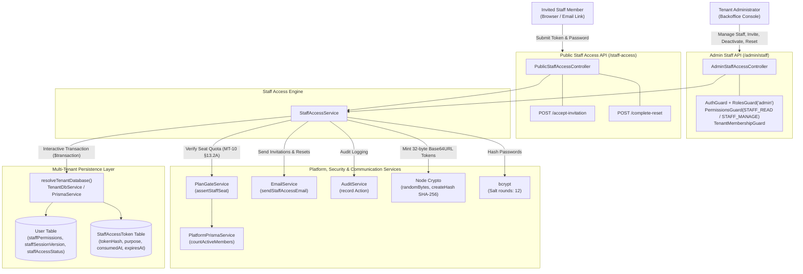
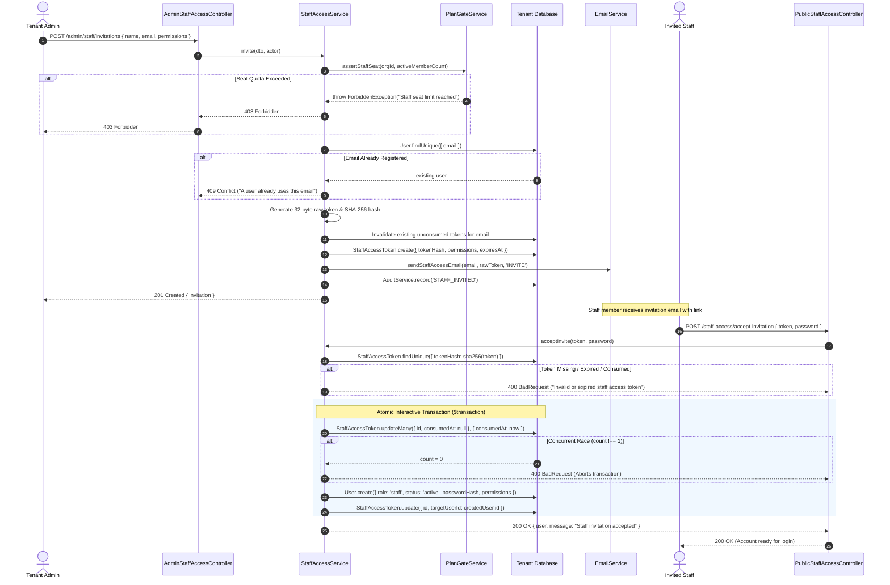
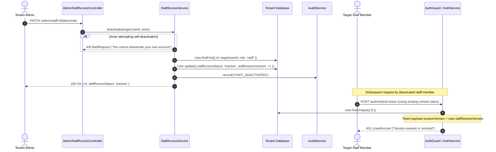
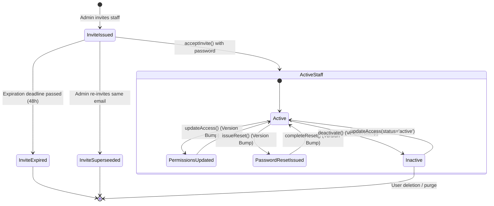

# Staff Access Feature Architecture & Invariants

## Purpose
The **Staff Access** feature manages delegated administrative access and role-based permissions for backoffice team members across the multi-tenant commerce platform. It allows store owners and platform administrators to onboard team members (support agents, warehouse managers, catalog editors, finance clerks) with restricted access privileges without sharing master administrative credentials or granting full administrative control.

Key operational capabilities:
1. **Cryptographic Invitation Lifecycle**: Onboarding via high-entropy one-time tokens, stored exclusively as SHA-256 digests and dispatched through transactional emails.
2. **Strict Multi-Tenant Seat Entitlement (MT-10 §13.2A)**: Server-side quota gating that evaluates active team size against subscription tiers prior to issuing invitations.
3. **Privilege Escalation Prevention**: Hard restrictions barring staff members from acquiring staff management (`staff.*`) permissions.
4. **Immediate Session Invalidation**: Cryptographic revocation via monotonically increasing `staffSessionVersion` across status downgrades, deactivations, permission reconfigurations, and credential resets.
5. **Anti-Lockout Invariants**: Self-deactivation and self-modification safeguards preventing administrators from locking themselves out of the management console.

---

## Component Architecture



---

## Component Source Map

| File | Primary Symbol | Role | Key Architectural Invariants & Responsibilities |
| :--- | :--- | :--- | :--- |
| [`staff-access.module.ts`](file:///home/chillpc/MohammadSheakh/projects/26/e-commerce/e-com-nextjs/ferio-nest-prisma/src/features/staff-access/staff-access.module.ts) | `StaffAccessModule` | NestJS Feature Module | Bundles and exports staff access capabilities. Imports `PrismaModule`, `AuthModule`, `AuditModule`, and `TenancyModule`. Registers public and administrative controllers. |
| [`staff-access.controller.ts`](file:///home/chillpc/MohammadSheakh/projects/26/e-commerce/e-com-nextjs/ferio-nest-prisma/src/features/staff-access/staff-access.controller.ts) | `PublicStaffAccessController` | Public REST Controller | Exposes public invitation acceptance (`/staff-access/accept-invitation`) and credential reset completion (`/staff-access/complete-reset`). |
| [`staff-access.controller.ts`](file:///home/chillpc/MohammadSheakh/projects/26/e-commerce/e-com-nextjs/ferio-nest-prisma/src/features/staff-access/staff-access.controller.ts) | `AdminStaffAccessController` | Admin REST Controller | Protected by `AuthGuard`, `RolesGuard('admin')`, `PermissionsGuard`, and `TenantMembershipGuard`. Manages staff listing (`staff.read`), invitations, deactivations, permission updates, and reset issuance (`staff.manage`). |
| [`staff-access.dto.ts`](file:///home/chillpc/MohammadSheakh/projects/26/e-commerce/e-com-nextjs/ferio-nest-prisma/src/features/staff-access/staff-access.dto.ts) | `InviteStaffDto` | Validation DTO | Enforces required name, valid email, array size limits ($\le 40$), and guarantees all assigned permissions belong to `STAFF_ASSIGNABLE_PERMISSIONS`. |
| [`staff-access.dto.ts`](file:///home/chillpc/MohammadSheakh/projects/26/e-commerce/e-com-nextjs/ferio-nest-prisma/src/features/staff-access/staff-access.dto.ts) | `UpdateStaffAccessDto` | Validation DTO | Validates permission updates and binary status (`active` \| `inactive`). Enforces non-escalation filters. |
| [`staff-access.dto.ts`](file:///home/chillpc/MohammadSheakh/projects/26/e-commerce/e-com-nextjs/ferio-nest-prisma/src/features/staff-access/staff-access.dto.ts) | `CompleteStaffAccessDto` | Validation DTO | Validates token string and minimum password length ($\ge 8$ characters). |
| [`staff-access.service.ts`](file:///home/chillpc/MohammadSheakh/projects/26/e-commerce/e-com-nextjs/ferio-nest-prisma/src/features/staff-access/staff-access.service.ts) | `StaffAccessService` | Domain Core Service | Orchestrates seat gating, token generation, single-use token consumption via atomic database transactions, password hashing, session version revocation, and audit emission. |
| [`staffAccessToken.prisma`](file:///home/chillpc/MohammadSheakh/projects/26/e-commerce/e-com-nextjs/ferio-nest-prisma/prisma/schema/user/staffAccessToken.prisma) | `StaffAccessToken` | Prisma Model | Stores SHA-256 token hashes, assigned permissions snapshot, token purpose (`INVITE` \| `RESET`), expiration timestamp, and consumption timestamp. |
| [`staff-access.service.spec.ts`](file:///home/chillpc/MohammadSheakh/projects/26/e-commerce/e-com-nextjs/ferio-nest-prisma/src/features/staff-access/tests/staff-access.service.spec.ts) | Unit Test Suite | Jest Test Suite | Validates token hashing, atomic consumption under race conditions, self-deactivation prevention, and session version increments. |

---

## Responsibilities

### Owns
- **Staff Token Management**: Generation of 32-byte cryptographically secure random tokens (`base64url`), SHA-256 digest calculation, single-use invalidation, and expiration lifecycle (`STAFF_INVITE_EXPIRY_HOURS`, `STAFF_RESET_EXPIRY_HOURS`).
- **Staff User Provisioning**: Creating new `User` entities with `role: UserRole.staff`, pre-verified email flags (`isEmailVerified: true`), active status, and explicitly granted permissions.
- **Seat Entitlement Enforcement (MT-10 §13.2A)**: Integrating with `PLAN_GATE` (`assertStaffSeat`) and `ORG_MEMBERS_COUNTER` (`countActiveMembers`) to prevent tenant seat quota overages.
- **Session Revocation Invalidation**: Incrementing `User.staffSessionVersion` whenever permissions, status, or credentials change.
- **Anti-Self-Tampering Enforcement**: Preventing administrators from deactivating or altering their own accounts via staff administration routes.

### Does Not Own
- **JWT Verification & Authentication**: Handling login requests, issuing bearer JWTs, and validating session cookies (owned by [`AuthModule`](file:///home/chillpc/MohammadSheakh/projects/26/e-commerce/e-com-nextjs/ferio-nest-prisma/src/features/authentication/auth.module.ts)).
- **Multi-Tenant Context Resolution**: Determining current organization from hostname or HTTP headers (owned by [`TenancyModule`](file:///home/chillpc/MohammadSheakh/projects/26/e-commerce/e-com-nextjs/ferio-nest-prisma/src/tenancy/tenancy.module.ts)).
- **Subscription Plan Definitions**: Defining plan tiers, prices, and feature quotas (owned by [`PlatformModule`](file:///home/chillpc/MohammadSheakh/projects/26/e-commerce/e-com-nextjs/ferio-nest-prisma/src/platform/platform.module.ts)).
- **Audit Persistence Pipeline**: Storing and querying immutable audit logs (owned by [`AuditModule`](file:///home/chillpc/MohammadSheakh/projects/26/e-commerce/e-com-nextjs/ferio-nest-prisma/src/features/audit/audit.module.ts)).
- **Email Delivery Transports**: SMTP socket connections, DKIM signing, and delivery retry logic (owned by [`EmailService`](file:///home/chillpc/MohammadSheakh/projects/26/e-commerce/e-com-nextjs/ferio-nest-prisma/src/features/authentication/email/email.service.ts)).

---

## Dependencies

### Consumes
- [`PrismaService`](file:///home/chillpc/MohammadSheakh/projects/26/e-commerce/e-com-nextjs/ferio-nest-prisma/libs/database/src/prisma.service.ts) & [`TenantDbService`](file:///home/chillpc/MohammadSheakh/projects/26/e-commerce/e-com-nextjs/ferio-nest-prisma/src/tenancy/services/tenant-db.service.ts): Dynamic database resolution targeting dedicated tenant schemas or master shared pools (`MT-7`).
- [`AuditService`](file:///home/chillpc/MohammadSheakh/projects/26/e-commerce/e-com-nextjs/ferio-nest-prisma/src/features/audit/services/audit.service.ts): Records administrative audit trails with actor, previous values, and new values.
- [`EmailService`](file:///home/chillpc/MohammadSheakh/projects/26/e-commerce/e-com-nextjs/ferio-nest-prisma/src/features/authentication/email/email.service.ts): Dispatches onboarding invitations and password reset emails containing raw tokens.
- `PLAN_GATE` ([`PlanGateService`](file:///home/chillpc/MohammadSheakh/projects/26/e-commerce/e-com-nextjs/ferio-nest-prisma/src/platform/services/plan-gate.service.ts)): Throws `ForbiddenException` if tenant member count exceeds subscription tier quota.
- `ORG_MEMBERS_COUNTER`: Calculates the active member count for the tenant organization.
- [`ConfigService`](file:///home/chillpc/MohammadSheakh/projects/26/e-commerce/e-com-nextjs/ferio-nest-prisma/src/tenancy/context/tenant-context.ts): Reads token expiration configuration (`STAFF_INVITE_EXPIRY_HOURS`, `STAFF_RESET_EXPIRY_HOURS`).

### External Services
- `node:crypto`: `randomBytes(32)` for token entropy; `createHash('sha256')` for one-way storage.
- `bcrypt`: Hashes user passwords with salt round 12.

### Emitters
- Audit Events:
  - `STAFF_INVITED`: Emitted when an invitation token is generated.
  - `STAFF_DEACTIVATED`: Emitted when an administrator deactivates a staff member.
  - `STAFF_ACCESS_UPDATED`: Emitted when permissions or active status are modified.
  - `STAFF_RESET_ISSUED`: Emitted when an administrative password reset token is minted.

---

## Database Ownership

### Direct Writes / Mutates

| Table | Operation | Trigger / Context | Fields Modified |
| :--- | :--- | :--- | :--- |
| `StaffAccessToken` | `create` | `invite()`, `issueReset()` | `email`, `name`, `permissions`, `purpose`, `targetUserId`, `issuedByUserId`, `tokenHash`, `expiresAt` |
| `StaffAccessToken` | `updateMany` | Superseeded token invalidation in `issueToken()` | `consumedAt = now()` |
| `StaffAccessToken` | `updateMany` | Atomic token consumption in `acceptInvite()`, `completeReset()` | `consumedAt = now()` (guarded by `id` AND `consumedAt: null`) |
| `StaffAccessToken` | `update` | `acceptInvite()` | `targetUserId` linked to newly created `User.id` |
| `User` | `create` | `acceptInvite()` | Creates staff user with `role: 'staff'`, `staffAccessStatus: 'active'`, `isEmailVerified: true`, `password`, `staffPermissions` |
| `User` | `update` | `deactivate()` | `staffAccessStatus = 'inactive'`, `staffSessionVersion += 1` |
| `User` | `update` | `updateAccess()` | `staffAccessStatus`, `staffPermissions`, `staffSessionVersion += 1` |
| `User` | `update` | `issueReset()` | `staffSessionVersion += 1` |
| `User` | `update` | `completeReset()` | `password = passwordHash`, `failedLoginAttempts = 0`, `lockUntil = null`, `staffSessionVersion += 1` |

### Reads / References

| Table | Query Method | Purpose |
| :--- | :--- | :--- |
| `User` | `findMany` | Lists active backoffice staff (`role in ['admin', 'staff']`, `isDeleted: false`). |
| `User` | `findUnique` | Validates email uniqueness before creating invite. |
| `User` | `findFirst` | Validates target user is an existing staff member (`role: 'staff'`). |
| `StaffAccessToken` | `findMany` | Lists active, unconsumed invitations (`purpose: 'INVITE'`, `consumedAt: null`, `expiresAt > now()`). |
| `StaffAccessToken` | `findUnique` | Finds token by `tokenHash` during acceptance or password reset. |
| `OrganizationMember` | `count` | Counts active members in tenant organization via `ORG_MEMBERS_COUNTER`. |

---

## Important Invariants

1. **Zero Raw Token Persistence**:
   - Plaintext invitation and reset tokens are generated using 32 cryptographically secure random bytes encoded as `base64url` (43 characters, 256 bits of entropy).
   - Only the SHA-256 hex digest (`tokenHash`) is persisted in the database. Raw tokens cannot be retrieved from the database, even with full SQL dump access.
2. **Atomic Single-Use Token Consumption**:
   - Token redemption (`acceptInvite`, `completeReset`) must execute inside an interactive Prisma `$transaction`.
   - The token is consumed via `updateMany` conditioned on `consumedAt: null` and `expiresAt > now()`. If `consumed.count !== 1`, the transaction immediately throws `BadRequestException` and rolls back, completely neutralizing concurrent double-spending attacks.
3. **Privilege Escalation Prevention (`STAFF_ASSIGNABLE_PERMISSIONS`)**:
   - Staff members cannot be granted any permission prefixed with `staff.` (e.g. `staff.read`, `staff.manage`).
   - The DTO layer filters `STAFF_ASSIGNABLE_PERMISSIONS = Object.values(PERMISSIONS).filter(p => !p.startsWith('staff.'))` and enforces `@IsIn()`.
   - Staff members cannot invite other staff or modify team permissions.
4. **Anti-Lockout / Self-Mutation Prohibition**:
   - An administrator cannot deactivate their own account (`userId === actor.userId`).
   - An administrator cannot modify their own permissions or status via the staff management endpoints.
5. **Immediate Session Invalidation via Version Bumping**:
   - Any modification that diminishes a staff member's security profile—deactivation, permission alteration, reset request, or reset completion—atomically increments `User.staffSessionVersion`.
   - The authentication layer rejects any refresh token or session validation where `payload.sessionVersion !== user.staffSessionVersion`.
6. **Token Superseed Invalidation**:
   - When a new invitation or reset token is issued for an email and purpose, any previously issued unconsumed tokens for that email and purpose are instantly marked as consumed (`consumedAt: new Date()`).
7. **SaaS Plan Seat Quotas (MT-10 §13.2A)**:
   - In multi-tenant environments (`tryGetTenantContext()`), `StaffAccessService.invite()` triggers `planGate.assertStaffSeat()` against the organization's subscription tier. If seat limits are reached, invitation issuance is aborted with `ForbiddenException`.

---

## Public API & Entry Points

| Endpoint | Method | Auth / Guards | Permissions | Payload / Parameters | Success Response | Errors |
| :--- | :--- | :--- | :--- | :--- | :--- | :--- |
| `/staff-access/accept-invitation` | `POST` | Public (None) | None | Body: `CompleteStaffAccessDto`<br>• `token`: string<br>• `password`: string ($\ge 8$) | `{ user: StaffUser, message: string }` | `400 BadRequest`<br>`409 Conflict` |
| `/staff-access/complete-reset` | `POST` | Public (None) | None | Body: `CompleteStaffAccessDto`<br>• `token`: string<br>• `password`: string ($\ge 8$) | `{ message: 'Staff access reset completed' }` | `400 BadRequest` |
| `/admin/staff` | `GET` | `AuthGuard`<br>`RolesGuard('admin')`<br>`PermissionsGuard`<br>`TenantMembershipGuard` | `staff.read` | None | `{ staff: User[], pendingInvitations: StaffAccessToken[] }` | `401 Unauthorized`<br>`403 Forbidden` |
| `/admin/staff/invitations` | `POST` | `AuthGuard`<br>`RolesGuard('admin')`<br>`PermissionsGuard`<br>`TenantMembershipGuard` | `staff.manage` | Body: `InviteStaffDto`<br>• `name`: string<br>• `email`: string<br>• `permissions`: string[] | `{ invitation: StaffAccessToken, setupToken?: string }` | `400 BadRequest`<br>`403 Forbidden` (Seat Limit)<br>`409 Conflict` (Email Taken) |
| `/admin/staff/:id/deactivate` | `PATCH` | `AuthGuard`<br>`RolesGuard('admin')`<br>`PermissionsGuard`<br>`TenantMembershipGuard` | `staff.manage` | Param: `id` (User ID) | `User` (updated with `staffAccessStatus: 'inactive'`) | `400 BadRequest` (Self Deactivation)<br>`404 NotFound` |
| `/admin/staff/:id/access` | `PATCH` | `AuthGuard`<br>`RolesGuard('admin')`<br>`PermissionsGuard`<br>`TenantMembershipGuard` | `staff.manage` | Param: `id`<br>Body: `UpdateStaffAccessDto`<br>• `permissions`: string[]<br>• `status`: 'active' \| 'inactive' | `User` (updated permissions & status) | `400 BadRequest` (Self Edit)<br>`404 NotFound` |
| `/admin/staff/:id/reset` | `POST` | `AuthGuard`<br>`RolesGuard('admin')`<br>`PermissionsGuard`<br>`TenantMembershipGuard` | `staff.manage` | Param: `id` (User ID) | `{ reset: StaffAccessToken, setupToken?: string }` | `404 NotFound` |

---

## Important Flows

### 1. Staff Invitation & Acceptance Flow



### 2. Staff Deactivation & Instant Session Revocation



### 3. Staff Account & Token Lifecycle



---

## Brutal Honest Vulnerabilities & Architectural Debt

### 1. TOCTOU Race Condition in Plan Seat Quotas (High Severity)
- **The Gap**: In `StaffAccessService.invite()`, seat quota evaluation occurs before database writes without a distributed lock or database transaction:
  ```typescript
  const currentMemberCount = await this.orgMembers.countActiveMembers(tenantContext.organizationId);
  await this.planGate.assertStaffSeat(tenantContext.organizationId, currentMemberCount);
  // ... latency gap: network calls, user lookup ...
  const issued = await this.issueToken(...);
  ```
- **Attack Vector**: If an administrator (or two admins simultaneously) dispatches 10 parallel HTTP requests to `/admin/staff/invitations`, all 10 requests read the same initial `currentMemberCount`. All 10 invitations succeed, exceeding the tenant's purchased plan seat quota.
- **Remediation**: Wrap seat quota evaluation and invitation issuance in an atomic database lock or acquire a Redis distributed lock (`redlock:org:${organizationId}:seat-allocation`) during invite processing.

### 2. Missing IP Rate Limiting on Public Token Endpoints (Medium Severity)
- **The Gap**: The public endpoints `/staff-access/accept-invitation` and `/staff-access/complete-reset` lack IP-based rate limiting or CAPTCHA verification.
- **Risk**: Although the 32-byte `base64url` token provides 256 bits of entropy (making brute-force guessing mathematically infeasible), an attacker can flood these endpoints with arbitrary tokens and passwords. Because password hashing utilizes `bcrypt` with cost factor 12 (~250ms CPU execution time per attempt), high-volume concurrent submissions will saturate server CPU cores, inducing a Denial of Service (DoS) on backend worker nodes.
- **Remediation**: Enforce NestJS Throttler or Redis token-bucket rate limiting on public token routes (e.g. max 5 attempts per minute per IP address).

### 3. Latent JWT Access Token Window After Deactivation (Medium Severity)
- **The Gap**: When a staff member is deactivated or their permissions are altered, `staffSessionVersion` is incremented. This invalidates refresh token rotation immediately. However, existing stateless JWT access tokens (typically valid for 15 minutes) remain valid until expiration unless standard `AuthGuard` queries the database or a Redis session cache on every authenticated request.
- **Impact**: A terminated employee whose account is marked `inactive` can continue executing authenticated API operations for the remainder of their active JWT lifetime (up to 15 minutes).
- **Remediation**: Maintain an active session revocation blocklist in Redis (keyed by `revoked_staff:${userId}:${sessionVersion}`) checked by `AuthGuard` or publish an instant revocation signal via Redis Pub/Sub to disconnect connected sockets and flush token caches.

### 4. Setup Token Exposure in Development Environment (Low / Operational Risk)
- **The Gap**: Lines 135–137 and 287–289 return the raw plaintext token directly in the HTTP JSON response body when `NODE_ENV === 'development'`:
  ```typescript
  ...(process.env.NODE_ENV === 'development' ? { setupToken: issued.token } : {})
  ```
- **Risk**: If a staging, QA, or misconfigured production environment is launched without setting `NODE_ENV=production`, administrators inspecting network traffic or logs can capture raw invitation and password reset tokens directly from API responses, bypassing email delivery security.
- **Remediation**: Guard setup token exposure behind an explicit opt-in environment flag (`EXPOSE_DEV_SETUP_TOKENS=true`) rather than relying solely on `NODE_ENV`.

### 5. Lack of Foreign Key Constraints on `StaffAccessToken.targetUserId` (Low Severity)
- **The Gap**: In `staffAccessToken.prisma`, `targetUserId` is a loose string (`String?`) without a Prisma `@relation` or foreign key reference to `User(id)`:
  ```prisma
  targetUserId String?
  ```
- **Impact**: If a user is hard-deleted from the database via administrative scripts or customer data purges, old token records retain orphan `targetUserId` values, resulting in data inconsistency and broken historical audit trails.
- **Remediation**: Add `@relation(fields: [targetUserId], references: [id], onDelete: SetNull)` to establish referential integrity.
