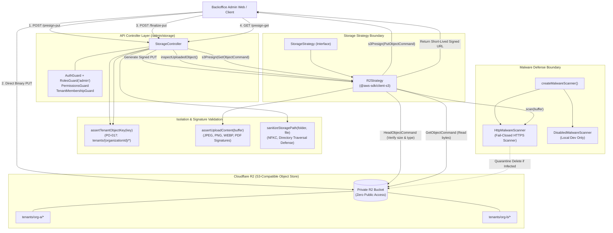
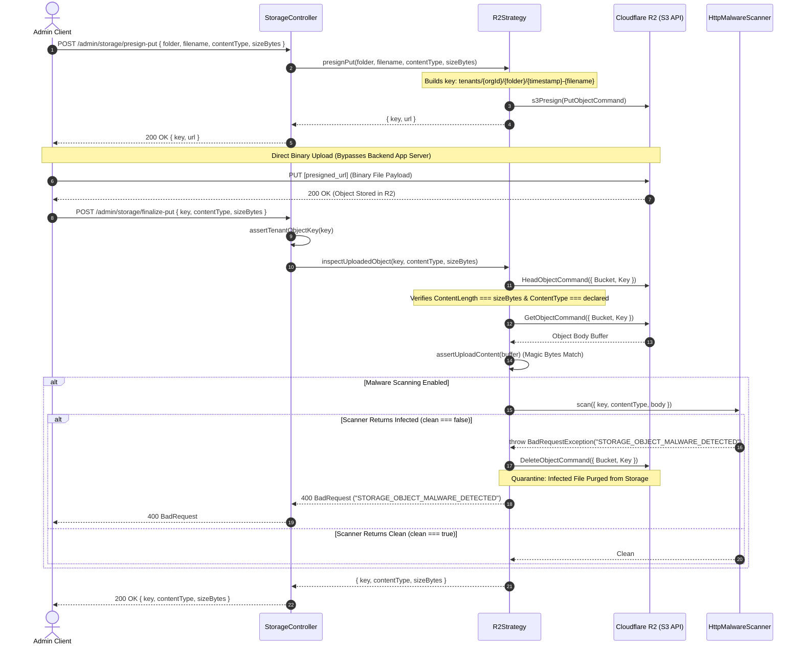
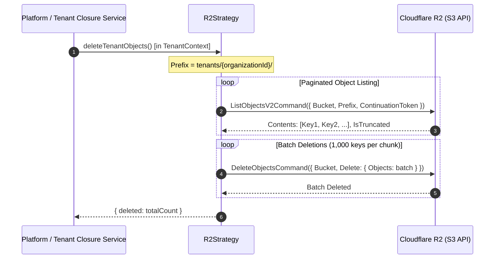
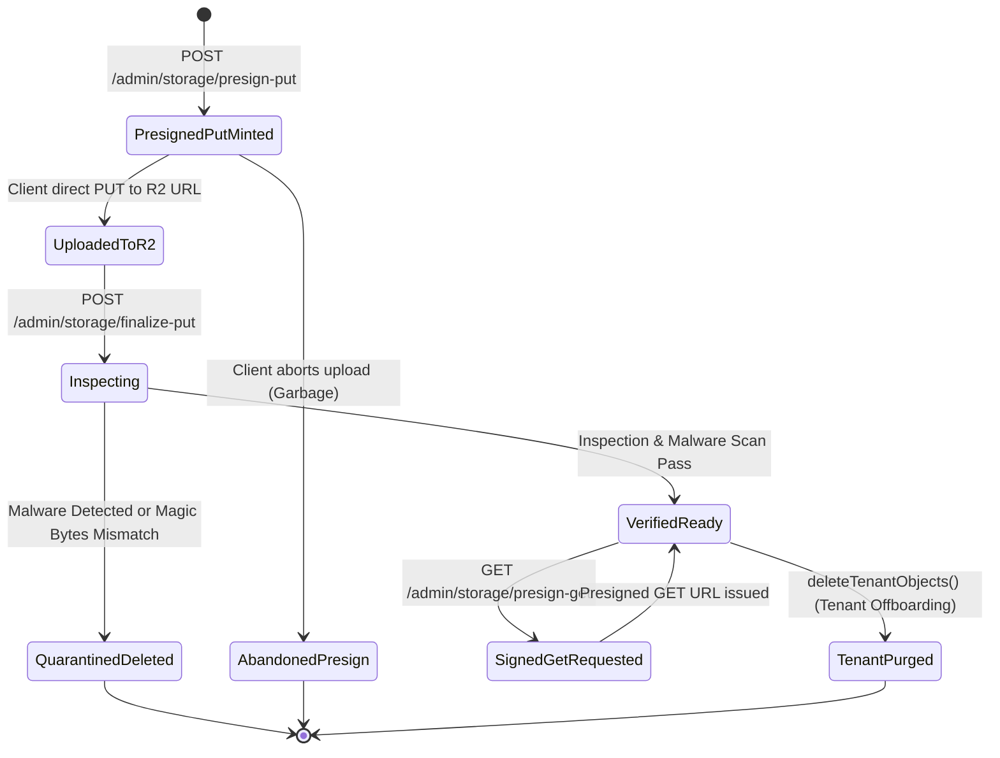

# Storage Feature Architecture & Invariants

## Purpose
The **Storage** feature provides multi-tenant, zero-trust private object storage for the commerce platform. Built upon Cloudflare R2 using the S3-compatible AWS SDK (`@aws-sdk/client-s3`, `@aws-sdk/s3-request-presigner`), it implements **MT-10 Storage Surface (Owner Decision #6)**. 

It manages direct-to-bucket file uploads and presigned access for administrative surfaces (brand logos, catalog product media, settlement reports, and warranty evidence) while enforcing strict tenant namespace isolation, magic-byte MIME validation, and fail-closed malware scanning.

Key capabilities:
1. **Direct-to-Bucket Presigned Uploads**: Offloads multi-megabyte binary traffic from the NestJS application tier directly to Cloudflare R2 edge storage.
2. **Strict Multi-Tenant Isolation (PO-017 / MT-10 §11.4)**: Guarantees that every stored object lives under `tenants/{organizationId}/...`, with ambient server-side validation preventing directory traversal or cross-tenant access.
3. **Private-by-Default Access**: Buckets maintain zero public read access; all reads and downloads require short-lived, cryptographically signed presigned URLs.
4. **Post-Upload Verification & Inspection**: Server-side validation of stored object dimensions, HTTP content types, and file signature magic bytes (`assertUploadContent`).
5. **Fail-Closed Malware Quarantine**: Synchronous scanning of uploaded objects with automatic deletion upon infection detection.
6. **Tenant Offboarding Purge**: Recursive, paginated bulk-deletion of tenant objects during organization deprovisioning (`deleteTenantObjects`).

---

## Component Architecture



---

## Component Source Map

| File | Primary Symbol | Role | Key Architectural Invariants & Responsibilities |
| :--- | :--- | :--- | :--- |
| [`storage.module.ts`](file:///home/chillpc/MohammadSheakh/projects/26/e-commerce/e-com-nextjs/ferio-nest-prisma/src/features/storage/storage.module.ts) | `StorageModule` | NestJS Feature Module | Configures dependencies, registers `StorageController`, instantiates `MALWARE_SCANNER` via `createMalwareScanner`, and exports `'STORAGE_STRATEGY'` (`R2Strategy`). |
| [`storage.controller.ts`](file:///home/chillpc/MohammadSheakh/projects/26/e-commerce/e-com-nextjs/ferio-nest-prisma/src/features/storage/storage.controller.ts) | `StorageController` | Admin REST Controller | Protected by `AuthGuard`, `RolesGuard('admin')`, `PermissionsGuard`, and `TenantMembershipGuard`. Handles `/admin/storage/presign-put`, `/admin/storage/finalize-put`, and `/admin/storage/presign-get`. |
| [`storage.dto.ts`](file:///home/chillpc/MohammadSheakh/projects/26/e-commerce/e-com-nextjs/ferio-nest-prisma/src/features/storage/storage.dto.ts) | `PresignPutDto`<br>`FinalizePutDto` | Validation DTOs | Enforces strict MIME whitelist (`image/jpeg`, `image/png`, `image/webp`, `application/pdf`) and maximum size constraints ($\le 10$ MB). |
| [`storage-validation.util.ts`](file:///home/chillpc/MohammadSheakh/projects/26/e-commerce/e-com-nextjs/ferio-nest-prisma/src/features/storage/storage-validation.util.ts) | `assertUploadContent` | Magic Byte Validator | Inspects binary buffers for magic numbers (`FF D8 FF`, `89 50 4E 47`, `RIFF...WEBP`, `%PDF-`). Throws `BadRequestException` on spoofed MIME headers. |
| [`malware-scanner.ts`](file:///home/chillpc/MohammadSheakh/projects/26/e-commerce/e-com-nextjs/ferio-nest-prisma/src/features/storage/malware-scanner.ts) | `HttpMalwareScanner`<br>`createMalwareScanner` | Security Scanner Client | Manages outbound HTTPS scanning of uploaded file buffers against external malware scanners. Fails closed on scanner timeouts, errors, or infected verdicts. |
| [`r2.strategy.ts`](file:///home/chillpc/MohammadSheakh/projects/26/e-commerce/e-com-nextjs/ferio-nest-prisma/src/features/storage/strategies/r2.strategy.ts) | `R2Strategy`<br>`StorageStrategy` | Provider Implementation | Implements S3-compatible operations on Cloudflare R2 (`PutObject`, `GetObject`, `HeadObject`, `DeleteObject`, `ListObjectsV2`, `DeleteObjects`). Enforces tenant namespacing, presigning, and quarantine deletion. |
| [`object-keys.util.ts`](file:///home/chillpc/MohammadSheakh/projects/26/e-commerce/e-com-nextjs/ferio-nest-prisma/src/tenancy/utils/object-keys.util.ts) | `assertTenantObjectKey`<br>`tenantObjectKey` | Tenancy Key Enforcer | Generates and validates keys against ambient `tenants/{organizationId}/...` prefix. Blocks traversal characters (`..`, `\`). |
| [`malware-scanner.spec.ts`](file:///home/chillpc/MohammadSheakh/projects/26/e-commerce/e-com-nextjs/ferio-nest-prisma/src/features/storage/malware-scanner.spec.ts) | Unit Test Suite | Security Tests | Validates explicit clean response handling, infected payload rejection, production endpoint HTTPS validation, and fail-closed error handling. |
| [`r2.strategy.spec.ts`](file:///home/chillpc/MohammadSheakh/projects/26/e-commerce/e-com-nextjs/ferio-nest-prisma/src/features/storage/strategies/r2.strategy.spec.ts) | Unit Test Suite | Strategy Tests | Validates path traversal sanitization, multipart content checks, post-upload inspection, malware quarantine deletion, and bulk tenant deletion. |
| [`storage.controller.spec.ts`](file:///home/chillpc/MohammadSheakh/projects/26/e-commerce/e-com-nextjs/ferio-nest-prisma/src/features/storage/tests/storage.controller.spec.ts) | Unit Test Suite | Controller Tests | Validates cross-tenant key rejection on GET/PUT operations and size payload propagation. |

---

## Responsibilities

### Owns
- **Presigned Upload & Download URLs**: Generating short-lived cryptographically signed S3 URLs for direct client PUT and GET access.
- **Multi-Tenant Key Namespace Construction**: Assembling tenant object paths (`tenants/{organizationId}/{folder}/{timestamp}-{filename}`) strictly using ambient server context.
- **Path Traversal Sanitization**: Cleansing folders and filenames to prevent directory traversal (`..`, `\`, leading slashes).
- **Post-Upload Object Inspection**: Verifying uploaded objects match declared metadata (`HeadObject`) and binary magic byte signatures before platform usage.
- **Malware Scanning & Quarantine**: Transmitting uploaded buffers to external scanners and immediately purging infected files from storage.
- **Tenant Object Lifecycle Management**: Paginated listing and batch deletion of tenant storage objects during organization offboarding.

### Does Not Own
- **Database File Metadata Association**: Storing relational links between object keys and database models (owned by `catalog`, `product-content`, `settlements`, `returns`).
- **CDN Edge Caching & Transformation**: Managing Cloudflare edge caching, image resizing, or public asset distribution (handled by Cloudflare CDN layers).
- **Authentication & Tenancy Identification**: Resolving tenant IDs and verifying admin credentials (owned by `authentication` and `tenancy`).

---

## Dependencies

### Consumes
- `@aws-sdk/client-s3`: S3 protocol communication (`S3Client`, `PutObjectCommand`, `GetObjectCommand`, `HeadObjectCommand`, `DeleteObjectCommand`, `ListObjectsV2Command`, `DeleteObjectsCommand`).
- `@aws-sdk/s3-request-presigner`: Generates presigned URLs (`getSignedUrl`).
- [`TenancyModule`](file:///home/chillpc/MohammadSheakh/projects/26/e-commerce/e-com-nextjs/ferio-nest-prisma/src/tenancy/tenancy.module.ts): Provides ambient tenant context (`tryGetTenantContext`), key assertion (`assertTenantObjectKey`), and route guard (`TenantMembershipGuard`).
- [`AuthModule`](file:///home/chillpc/MohammadSheakh/projects/26/e-commerce/e-com-nextjs/ferio-nest-prisma/src/features/authentication/auth.module.ts): Provides `AuthGuard` for administrative JWT verification.

### External Services
- **Cloudflare R2**: Cloud-native, zero-egress S3-compatible object store.
- **MinIO**: Local development and testing S3-compatible endpoint (via `R2_ENDPOINT`).
- **Malware Scanner API**: Outbound HTTP service (`MALWARE_SCANNER_URL`) for file payload inspection.

### Emitters
- Outbound HTTP requests to external malware scanning endpoints.
- Outbound AWS S3 protocol API calls to Cloudflare R2 / MinIO.

---

## Database Ownership

The Storage feature **owns zero relational database tables**. Storage persistence is managed entirely within object storage (Cloudflare R2).

### Multi-Tenant Object Store Ownership

| Key Prefix Namespace | Access Mode | Owner / Lifecycle | Description |
| :--- | :--- | :--- | :--- |
| `tenants/{organizationId}/...` | Private (Presigned Only) | Dedicated to Tenant | Contains all tenant-specific uploads (brand assets, product images, settlement CSVs, claim proof). |
| `tenants/{organizationId}/products/*` | Private (Presigned Only) | Catalog / Product Content | Product gallery imagery and specification sheets. |
| `tenants/{organizationId}/evidence/*` | Private (Presigned Only) | Returns / Warranty / Settlements | Claims, dispute attachments, courier settlement reports. |
| `legacy/...` | Private (Presigned Only) | Fallback (Legacy) | Historical non-tenant uploads (when tenancy is explicitly disabled). |

---

## Important Invariants

1. **Mandatory Ambient Tenant Isolation (PO-017 / MT-10 §11.4)**:
   - Every object key MUST start with `tenants/{organizationId}/`.
   - The `organizationId` is derived strictly from ambient server-side request context (`tryGetTenantContext()`). It can **never** be supplied, modified, or overridden by client payload.
   - Any key containing directory traversal characters (`..`, `\`, leading dots) or referencing another tenant's namespace is immediately rejected with `403 Forbidden` (`STORAGE_KEY_FORBIDDEN`).
2. **Zero Public Bucket Access**:
   - The Cloudflare R2 bucket has no public access permissions.
   - Objects can only be retrieved or uploaded using temporary signed URLs signed by server-held credentials (`R2_ACCESS_KEY_ID`, `R2_SECRET_ACCESS_KEY`).
   - Presigned URL expiration defaults to 3,600 seconds (1 hour), configurable via `R2_PRESIGN_EXPIRES_SECONDS`.
3. **Pre- and Post-Upload Two-Phase Verification**:
   - **Phase 1 (Presign)**: Client declares target folder, filename, MIME type, and expected byte size ($\le 10$ MB). Server validates against `ADMIN_UPLOAD_CONTENT_TYPES` and issues a restricted PUT URL.
   - **Phase 2 (Finalize)**: Client invokes `/finalize-put`. The server executes `HeadObject` on R2 to confirm exact size and MIME match, downloads object header bytes, verifies magic numbers (`assertUploadContent`), and dispatches to the malware scanner.
4. **Binary Magic Byte Verification**:
   - MIME types cannot be forged via HTTP headers:
     - `image/jpeg`: Header must begin with `0xFF, 0xD8, 0xFF`.
     - `image/png`: Header must begin with `0x89, 0x50, 0x4E, 0x47, 0x0D, 0x0A, 0x1A, 0x0A`.
     - `image/webp`: Bytes 0–3 must be `RIFF` and bytes 8–11 must be `WEBP`.
     - `application/pdf`: Header must begin with `%PDF-`.
5. **Fail-Closed Malware Quarantine & Purge**:
   - In production (`NODE_ENV === 'production'`), `MALWARE_SCANNER_URL` is mandatory and must use HTTPS.
   - If an uploaded object is flagged as infected (`clean !== true`), `R2Strategy` immediately sends `DeleteObjectCommand` to remove the file from R2, throwing `400 BadRequest` (`STORAGE_OBJECT_MALWARE_DETECTED`).
   - If the scanner is unreachable or errors, it fails closed with `503 ServiceUnavailable` (`MALWARE_SCANNER_UNAVAILABLE`), preventing uninspected files from entering production workflows.
6. **Path & Filename Sanitization**:
   - Folder paths and filenames undergo Unicode `NFKC` normalization.
   - Slashes and backslashes are collapsed; dots and hyphens are stripped of repeating characters. Segments are hard-capped at 120 characters to prevent buffer and filesystem overflow vulnerabilities.
7. **Complete Tenant Deprovisioning Cleanup**:
   - Calling `deleteTenantObjects()` scans only objects matching the ambient tenant prefix `tenants/{organizationId}/`.
   - Deletions are executed in S3 batches of 1,000 using `DeleteObjectsCommand`. Operations fail closed if executed outside tenant context.

---

## Public API & Entry Points

All storage endpoints are mounted under `/admin/storage` and restricted to backoffice administrators:

| Endpoint | Method | Auth / Guards | Permissions | Payload / Parameters | Success Response | Errors |
| :--- | :--- | :--- | :--- | :--- | :--- | :--- |
| `/admin/storage/presign-put` | `POST` | `AuthGuard`<br>`RolesGuard('admin')`<br>`PermissionsGuard`<br>`TenantMembershipGuard` | Admin Role | Body: `PresignPutDto`<br>• `folder`: string ($\le 80$ chars)<br>• `filename`: string ($\le 180$ chars)<br>• `contentType`: MimeType<br>• `sizeBytes`: int ($1 \dots 10\,\text{MB}$) | `{ key: string, url: string }` | `400 BadRequest`<br>`401 Unauthorized`<br>`403 Forbidden` |
| `/admin/storage/finalize-put` | `POST` | `AuthGuard`<br>`RolesGuard('admin')`<br>`PermissionsGuard`<br>`TenantMembershipGuard` | Admin Role | Body: `FinalizePutDto`<br>• `key`: string ($\le 512$ chars)<br>• `contentType`: MimeType<br>• `sizeBytes`: int ($1 \dots 10\,\text{MB}$) | `{ key: string, contentType: string, sizeBytes: number }` | `400 BadRequest` (MIME/Magic Mismatch / Malware)<br>`403 Forbidden` (Cross-Tenant)<br>`503 ServiceUnavailable` (Scanner Outage) |
| `/admin/storage/presign-get` | `GET` | `AuthGuard`<br>`RolesGuard('admin')`<br>`PermissionsGuard`<br>`TenantMembershipGuard` | Admin Role | Body: `{ key: string }` | `{ url: string, key: string }` | `400 BadRequest`<br>`403 Forbidden` (Cross-Tenant) |

---

## Important Flows

### 1. Direct-to-Bucket Upload, Inspection & Quarantine Flow



### 2. Tenant Deprovisioning Storage Purge Flow



### 3. Storage Object Lifecycle



---

## Brutal Honest Vulnerabilities & Architectural Debt

### 1. HTTP GET with Body in `presignGet` (High Operational Risk)
- **The Gap**: In `StorageController` (line 25), the endpoint is declared as a `GET` request while consuming a request body:
  ```typescript
  @Get('presign-get')
  async presignGet(@Body() body: { key: string }) { ... }
  ```
- **Operational Risk**: RFC 7231 and RFC 9110 specify that `GET` requests should not bear a payload. Intermediary reverse proxies, load balancers, Cloudflare WAF, and standard HTTP clients (e.g. certain Axios versions, Postman, browser `fetch`) frequently strip the body of outgoing `GET` requests. In production environments, this results in `body.key` arriving as `undefined`, triggering `TypeError` or 403 errors.
- **Remediation**: Convert the endpoint to `POST /admin/storage/presign-get` or accept the object key as a query parameter (e.g., `GET /admin/storage/presign-get?key=...`) with URL decoding.

### 2. Unfinalized Abandoned Upload Garbage Accumulation (Medium Severity)
- **The Gap**: When a client calls `/admin/storage/presign-put`, an S3 key and presigned URL are generated. If the client performs the PUT directly to R2 but never calls `/finalize-put` (or if an automated script floods `presign-put` and uploads gigabytes of data), the files remain stored indefinitely in the private bucket.
- **Impact**: Uninspected, unvalidated, and potentially infected files accumulate in object storage. While they cannot be easily retrieved without knowing the exact key, they consume storage capacity and contribute to unmonitored infrastructure costs.
- **Remediation**: Configure a Cloudflare R2 bucket lifecycle rule that automatically deletes objects in a designated `/uploads/temp/` prefix if they are not moved or confirmed by a finalization worker within 24 hours.

### 3. Synchronous In-Memory Malware Scanning Exhaustion (Medium Severity)
- **The Gap**: During `inspectUploadedObject()`, if malware scanning is enabled, the entire file is downloaded into server memory:
  ```typescript
  const downloaded = Buffer.from(await object.Body.transformToByteArray());
  await this.malwareScanner.scan({ key, contentType, body: downloaded });
  ```
- **Attack Vector**: `ADMIN_UPLOAD_MAX_BYTES` is set to 10 MB. If multiple backoffice administrators or an automated process concurrently finalize 20–30 high-resolution PDF or image uploads, the Node.js process must allocate hundreds of megabytes of resident heap memory (`Buffer`). Under high concurrency, this triggers aggressive garbage collection pauses or process termination via Out-Of-Memory (OOM).
- **Remediation**: Stream the file directly from S3 to the malware scanner endpoint via `ReadableStream` pipeline without buffering the entire payload into Node.js heap memory.

### 4. Direct Upload Finalization Race Condition (Low Severity)
- **The Gap**: There is no server-side guarantee that the client has completed its binary upload to R2 before calling `/finalize-put`.
- **Impact**: If a client dispatches `/finalize-put` immediately after initiating the PUT request (or before R2 finishes writing all chunks), `HeadObject` may throw 404 or return an incomplete `ContentLength`, resulting in spurious `STORAGE_OBJECT_METADATA_MISMATCH` errors.
- **Remediation**: Implement an exponential backoff retry policy (e.g., 3 retries over 2 seconds) inside `inspectUploadedObject` when `HeadObject` reports size mismatches or transient not-found errors.

### 5. Absence of Fine-Grained Permissions (Low Severity)
- **The Gap**: While `StorageController` is guarded by `RolesGuard('admin')` and `PermissionsGuard`, no endpoints specify `@Permissions(...)` decorators.
- **Impact**: Any administrative user possessing any valid backoffice role (even one intended solely for read-only analytics or customer service) can generate presigned PUT URLs, finalize arbitrary files within the tenant namespace, or request download URLs for sensitive settlement evidence.
- **Remediation**: Decorate endpoints with explicit granular permissions, such as `@Permissions(PERMISSIONS.SETTINGS_MANAGE)` for brand assets and `@Permissions(PERMISSIONS.CATALOG_MANAGE)` for product media.
