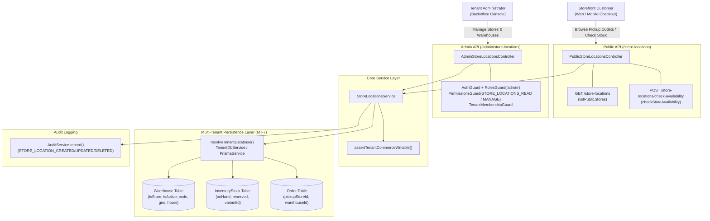
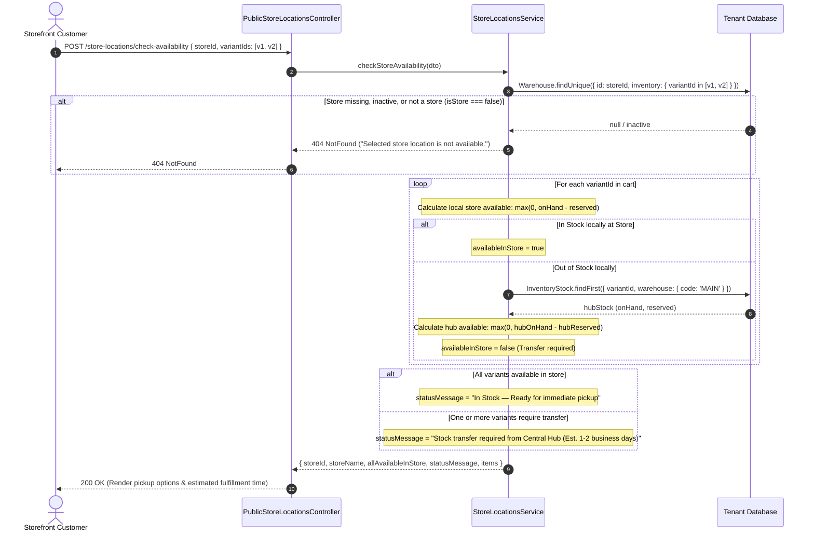
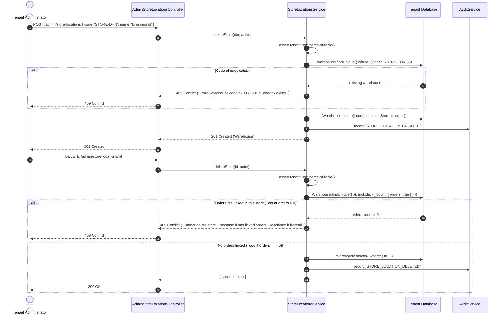

# Store Locations Feature Architecture & Invariants

## Purpose
The **Store Locations** feature manages physical retail outlets, pickup points, and fulfillment warehouses across the multi-tenant commerce platform. It powers omnichannel commerce capabilities, specifically **Click & Collect (Store Pickup)**, local retail inventory visibility, and automated transfer latency estimation between central distribution hubs and retail branches.

Key capabilities:
1. **Public Store Directory & Pickup Selection**: Exposes active, customer-facing store locations with geo-coordinates (`latitude`/`longitude`), operating hours, operating days, and counter pickup instructions.
2. **Real-Time Omnichannel Stock Check**: Evaluates local retail stock (`onHand - reserved`) against cart items and falls back to Central Hub inventory when local stock is depleted.
3. **Administrative Fleet Management**: Full CRUD operations over retail stores and warehouses with search, pagination, and active/inactive toggles.
4. **Order History Deletion Protection**: Enforces referential preservation preventing deletion of stores that have historical or active customer orders.
5. **Multi-Tenant Data Isolation (MT-7)**: Dynamic tenant database resolution ensuring strict multi-tenant boundary enforcement.
6. **Commercial Write Protection**: Enforces subscription write checks (`assertTenantCommerceWritable`) on all administrative store mutations.

---

## Component Architecture



---

## Component Source Map

| File | Primary Symbol | Role | Key Architectural Invariants & Responsibilities |
| :--- | :--- | :--- | :--- |
| [`store-locations.module.ts`](file:///home/chillpc/MohammadSheakh/projects/26/e-commerce/e-com-nextjs/ferio-nest-prisma/src/features/store-locations/store-locations.module.ts) | `StoreLocationsModule` | NestJS Feature Module | Bundles and exports `StoreLocationsService`. Imports `TenancyModule`, `PrismaModule`, `AuthModule`, and `AuditModule`. Registers public and admin controllers. |
| [`store-locations.controller.ts`](file:///home/chillpc/MohammadSheakh/projects/26/e-commerce/e-com-nextjs/ferio-nest-prisma/src/features/store-locations/store-locations.controller.ts) | `PublicStoreLocationsController` | Public REST Controller | Exposes public store listing (`/store-locations`) and real-time inventory availability checks (`/store-locations/check-availability`). |
| [`store-locations.controller.ts`](file:///home/chillpc/MohammadSheakh/projects/26/e-commerce/e-com-nextjs/ferio-nest-prisma/src/features/store-locations/store-locations.controller.ts) | `AdminStoreLocationsController` | Admin REST Controller | Protected by `AuthGuard`, `RolesGuard('admin')`, `PermissionsGuard`, and `TenantMembershipGuard`. Handles administrative store listing, creation, updates, and deletions. |
| [`store-location.dto.ts`](file:///home/chillpc/MohammadSheakh/projects/26/e-commerce/e-com-nextjs/ferio-nest-prisma/src/features/store-locations/dto/store-location.dto.ts) | `CreateStoreLocationDto`<br>`UpdateStoreLocationDto` | Mutation DTOs | Validates store code, name, phone, address, coordinates (`latitude`/`longitude`), operating hours, operating days, and pickup instructions. |
| [`store-location.dto.ts`](file:///home/chillpc/MohammadSheakh/projects/26/e-commerce/e-com-nextjs/ferio-nest-prisma/src/features/store-locations/dto/store-location.dto.ts) | `CheckStoreAvailabilityDto`<br>`StoreQueryDto` | Query DTOs | Validates store selection, array of variant IDs, pagination bounds (`limit <= 100`), and search filters. |
| [`store-locations.service.ts`](file:///home/chillpc/MohammadSheakh/projects/26/e-commerce/e-com-nextjs/ferio-nest-prisma/src/features/store-locations/store-locations.service.ts) | `StoreLocationsService` | Domain Core Service | Orchestrates dynamic tenant database routing, Click & Collect stock availability formulas, Central Hub fallback lookups, referential deletion protection, and audit logging. |
| [`inventory.prisma`](file:///home/chillpc/MohammadSheakh/projects/26/e-commerce/e-com-nextjs/ferio-nest-prisma/prisma/schema/inventory.module/inventory.prisma) | `Warehouse`<br>`InventoryStock` | Prisma Models | `Warehouse` holds store/warehouse metadata, active flags, and geo fields. `InventoryStock` holds on-hand, reserved, and damaged stock levels. |
| [`store-locations.service.spec.ts`](file:///home/chillpc/MohammadSheakh/projects/26/e-commerce/e-com-nextjs/ferio-nest-prisma/src/features/store-locations/tests/store-locations.service.spec.ts) | Unit Test Suite | Jest Test Suite | Validates public store listing, stock calculation logic, transfer status messaging, code collision conflicts, and audit emissions. |
| [`store-locations.tenant-isolation.spec.ts`](file:///home/chillpc/MohammadSheakh/projects/26/e-commerce/e-com-nextjs/ferio-nest-prisma/src/features/store-locations/tests/store-locations.tenant-isolation.spec.ts) | Isolation Test Suite | Jest Test Suite | Verifies that stores are queried strictly from the resolved tenant database context without cross-tenant data leakage. |

---

## Responsibilities

### Owns
- **Retail Store Directory**: Creation, modification, and deletion of physical store records (`isStore = true`) and fulfillment warehouses.
- **Click & Collect Availability Engine**: Calculating real-time variant stock availability at retail locations (`onHand - reserved`).
- **Central Hub Stock Fallback**: Evaluating Central Hub stock (`code = 'MAIN'`) when selected pickup store inventory is insufficient, determining transfer lead times (est. 1–2 business days).
- **Store Deletion Safety Invariants**: Preventing the deletion of stores with historical order references (`orders.length > 0`).
- **Administrative Store Search & Pagination**: Multi-field case-insensitive searching across name, code, district, area, and contact phone numbers.

### Does Not Own
- **Inventory Stock Ledger & Movements**: Creating inventory stock records or processing stock transfers between warehouses (owned by the inventory stock management module).
- **Checkout Draft & Order Placement**: Selecting pickup locations during order checkout and finalizing store orders (owned by `checkout` and `order`).
- **Payment Collection at Store Desk**: Processing POS or in-store cash payments (owned by `commerce-payments`).
- **Courier Integration & Last-Mile Delivery**: Dispatching delivery personnel for home delivery shipments (owned by `shipping` and `delivery-personnel`).

---

## Dependencies

### Consumes
- [`PrismaService`](file:///home/chillpc/MohammadSheakh/projects/26/e-commerce/e-com-nextjs/ferio-nest-prisma/libs/database/src/prisma.service.ts) & [`TenantDbService`](file:///home/chillpc/MohammadSheakh/projects/26/e-commerce/e-com-nextjs/ferio-nest-prisma/src/tenancy/services/tenant-db.service.ts): Dynamic database resolution targeting dedicated tenant schemas or master shared pools (`MT-7`).
- [`AuditService`](file:///home/chillpc/MohammadSheakh/projects/26/e-commerce/e-com-nextjs/ferio-nest-prisma/src/features/audit/services/audit.service.ts): Records administrative audit trails with actor identity and payload metadata.
- [`assertTenantCommerceWritable`](file:///home/chillpc/MohammadSheakh/projects/26/e-commerce/e-com-nextjs/ferio-nest-prisma/src/tenancy/utils/commerce-write-guard.util.ts): Guards against store mutations if the tenant's commercial status is suspended or read-only.
- [`TenantMembershipGuard`](file:///home/chillpc/MohammadSheakh/projects/26/e-commerce/e-com-nextjs/ferio-nest-prisma/src/tenancy/guards/tenant-membership.guard.ts): Validates that the calling administrator belongs to the target tenant organization.

### External Services
- PostgreSQL (via Prisma ORM Client).

### Emitters
- Audit Events:
  - `STORE_LOCATION_CREATED`: Emitted when a new store or warehouse is created.
  - `STORE_LOCATION_UPDATED`: Emitted when store details or active status are updated.
  - `STORE_LOCATION_DELETED`: Emitted when an unlinked store is deleted.

---

## Database Ownership

### Direct Writes / Mutates

| Table | Operation | Trigger / Context | Fields Modified |
| :--- | :--- | :--- | :--- |
| `Warehouse` | `create` | `createStore()` | `code`, `name`, `isStore` (`true`), `isActive`, `phone`, `email`, `district`, `area`, `address`, `latitude`, `longitude`, `operatingHours`, `operatingDays`, `pickupInstructions` |
| `Warehouse` | `update` | `updateStore()` | Any fields passed in `UpdateStoreLocationDto` (`name`, `isActive`, `phone`, `address`, etc.) |
| `Warehouse` | `delete` | `deleteStore()` | Hard delete of `Warehouse` row (guarded by `_count.orders === 0`) |

### Reads / References

| Table | Query Method | Purpose |
| :--- | :--- | :--- |
| `Warehouse` | `findMany` | Fetches active pickup stores (`isStore: true, isActive: true`) for public checkout; lists paginated stores for backoffice admin. |
| `Warehouse` | `findUnique` | Validates store existence during availability checks; checks code uniqueness on store creation; counts linked orders before deletion. |
| `InventoryStock` | `findFirst` | Checks available stock at the central distribution hub (`warehouse: { code: 'MAIN' }`) for items missing from local store stock. |
| `Order` | `count` (via `_count`) | Prevents deletion of warehouses that have associated orders (`_count.orders > 0`). |

---

## Important Invariants

1. **Click & Collect Available Stock Invariant**:
   - Available inventory at a store is strictly computed as:
     $$\text{availableStock} = \max(0, \text{onHand} - \text{reserved})$$
   - Reserved stock (items currently committed to open checkout drafts or pending orders) and damaged stock are strictly excluded from pickup availability.
2. **Central Hub Fallback & Transfer Messaging**:
   - If a variant has 0 available units at the selected pickup store, the engine checks the Central Hub (`warehouse.code = 'MAIN'`).
   - If any item in the cart requires a transfer from the central warehouse, `allAvailableInStore` evaluates to `false`, and the response issues an omnichannel transfer warning:
     `"Stock transfer required from Central Hub (Est. 1-2 business days)"`.
   - If all requested variants are in stock at the local store, the engine returns:
     `"In Stock — Ready for immediate pickup"`.
3. **Referential Preservation on Store Deletion**:
   - A store or warehouse cannot be deleted if historical or open orders are attached to it (`_count.orders > 0`).
   - The deletion attempt throws `ConflictException` (`409 Conflict`), instructing the administrator to deactivate (`isActive = false`) rather than delete.
4. **Unique Warehouse / Store Code**:
   - Store and warehouse codes (`code`, e.g. `STORE-DHN`, `MAIN`, `WH-CTG`) must be unique within the tenant database. Duplicate codes throw `ConflictException` (`409 Conflict`).
5. **Commerce Write Protection**:
   - Mutations (`createStore`, `updateStore`, `deleteStore`) invoke `assertTenantCommerceWritable()`. Any write attempt on a tenant whose billing or commercial status is locked triggers `ForbiddenException`.
6. **Strict Multi-Tenant Database Isolation (MT-7)**:
   - All queries pass through `resolveTenantDatabase(this.tenantDb, this.prisma, 'store-locations-service')`. Stores created in Tenant A are completely inaccessible and invisible to Tenant B.

---

## Public API & Entry Points

| Endpoint | Method | Auth / Guards | Permissions | Payload / Parameters | Success Response | Errors |
| :--- | :--- | :--- | :--- | :--- | :--- | :--- |
| `/store-locations` | `GET` | Public (None) | None | None | `Array<PublicStoreLocation>` | None |
| `/store-locations/check-availability` | `POST` | Public (None) | None | Body: `CheckStoreAvailabilityDto`<br>• `storeId`: string<br>• `variantIds`: string[] | `{ storeId, storeName, allAvailableInStore, statusMessage, items }` | `404 NotFound` (Store inactive or missing) |
| `/admin/store-locations` | `GET` | `AuthGuard`<br>`RolesGuard('admin')`<br>`PermissionsGuard`<br>`TenantMembershipGuard` | `store_locations.read` | Query: `StoreQueryDto`<br>• `page`: number (default: 1)<br>• `limit`: number (default: 20)<br>• `search`: string | `{ items, total, page, limit, totalPages, pagination }` | `401 Unauthorized`<br>`403 Forbidden` |
| `/admin/store-locations` | `POST` | `AuthGuard`<br>`RolesGuard('admin')`<br>`PermissionsGuard`<br>`TenantMembershipGuard` | `store_locations.manage` | Body: `CreateStoreLocationDto`<br>• `code`: string<br>• `name`: string<br>• `isActive?`: boolean<br>• `phone?`, `address?`, `latitude?`, etc. | `Warehouse` | `400 BadRequest`<br>`403 Forbidden`<br>`409 Conflict` (Code Exists) |
| `/admin/store-locations/:id` | `PATCH` | `AuthGuard`<br>`RolesGuard('admin')`<br>`PermissionsGuard`<br>`TenantMembershipGuard` | `store_locations.manage` | Param: `id`<br>Body: `UpdateStoreLocationDto` | `Warehouse` | `400 BadRequest`<br>`404 NotFound` |
| `/admin/store-locations/:id` | `DELETE` | `AuthGuard`<br>`RolesGuard('admin')`<br>`PermissionsGuard`<br>`TenantMembershipGuard` | `store_locations.manage` | Param: `id` | `{ success: true }` | `404 NotFound`<br>`409 Conflict` (Orders linked) |

---

## Important Flows

### 1. Storefront Click & Collect Stock Availability Check



### 2. Store Creation & Referential Deletion Protection



### 3. Store Location Lifecycle

```mermaid
stateDiagram-v2
    [*] --> ActiveStore: Admin creates store (isActive=true)
    
    state ActiveStore {
        [*] --> InStock: Store inventory >= Cart demand
        InStock --> HubTransferRequired: Store inventory depleted; Hub has stock
        HubTransferRequired --> InStock: Stock transfer received from Hub
    }

    ActiveStore --> InactiveStore: Admin updates store (isActive=false)
    InactiveStore --> ActiveStore: Admin re-enables store (isActive=true)

    InactiveStore --> OrdersReferencedLock: Historical customer orders exist
    OrdersReferencedLock --> InactiveStore: Permanent soft-delete state

    InactiveStore --> HardDeleted: Admin deletes store (Zero orders linked)
    HardDeleted --> [*]
```



---

## Brutal Honest Vulnerabilities & Architectural Debt

### 1. Hardcoded 'MAIN' Central Hub Warehouse Code (High Architectural Debt)
- **The Gap**: In `StoreLocationsService.checkStoreAvailability()` (line 90):
  ```typescript
  const hubStock = await db.inventoryStock.findFirst({
    where: { variantId, warehouse: { code: 'MAIN' } },
  });
  ```
- **Architectural Debt**: The warehouse code `'MAIN'` is hardcoded as an unconfigurable literal. If a tenant creates their primary warehouse with code `'CENTRAL'`, `'HUB-01'`, or deletes/renames the initial `'MAIN'` warehouse, central hub fallback stock will silently evaluate to `0`. Consequently, `hubAvailable` is reported as `0`, and transfer lead time recommendations will fail to provide accurate stock guarantees to customers.
- **Remediation**: Add a tenant configuration setting (e.g. `PRIMARY_FULFILLMENT_WAREHOUSE_CODE` in tenant settings) or flag warehouses with an explicit boolean `isPrimaryHub: Boolean @default(false)` in Prisma schema.

### 2. N+1 Database Query Loop on Stock Checks (Medium Severity)
- **The Gap**: In `checkStoreAvailability()`, the central hub stock lookup is performed inside a JavaScript `Promise.all(dto.variantIds.map(async ...))` loop:
  ```typescript
  const items = await Promise.all(
    dto.variantIds.map(async (variantId) => {
      // ...
      const hubStock = await db.inventoryStock.findFirst({
        where: { variantId, warehouse: { code: 'MAIN' } },
      });
      // ...
    })
  );
  ```
- **Performance Impact**: If a customer checks pickup availability for a large cart (e.g., 20 line items), the backend executes 20 separate sequential/concurrent SQL queries against the database for the central warehouse rather than a single batched `findMany({ where: { variantId: { in: dto.variantIds }, warehouse: { code: 'MAIN' } } })`.
- **Remediation**: Batch the central hub inventory query into a single `db.inventoryStock.findMany` before mapping the items.

### 3. Public Inventory Scraping & Competitor Espionage (Medium Severity)
- **The Gap**: The endpoint `/store-locations/check-availability` is completely public and requires no authentication, session token, or rate limiting.
- **Risk**: A competitor or automated bot can enumerate store IDs and product variant IDs, repeatedly calling this endpoint to map exact stock levels across every retail location in real time (`storeAvailable: 8`, `hubAvailable: 15`).
- **Remediation**: Apply NestJS Throttler guards to limit requests per IP address, and obscure exact unit numbers for public responses (e.g. returning `"LOW_STOCK"`, `"IN_STOCK"`, `"OUT_OF_STOCK"` rather than exact integers).

### 4. Prisma Foreign Key Constraint Failure on Deletion (Low / Bug Severity)
- **The Gap**: In `deleteStore()`, the code verifies `existing._count.orders > 0`. However, it does **not** check `existing._count.inventory > 0`:
  ```typescript
  // prisma schema:
  // warehouse Warehouse @relation(fields: [warehouseId], references: [id], onDelete: Restrict)
  ```
- **Impact**: If a store has zero orders but still has `InventoryStock` records linked to it in the database, calling `db.warehouse.delete()` triggers a Prisma `P2003` foreign key restriction violation, producing an unhandled 500 Internal Server Error instead of a clean, user-friendly 409 Conflict.
- **Remediation**: Include `inventory: true` in the `_count` check and reject deletion if `_count.inventory > 0` or delete linked inventory stock within a transaction.

### 5. Absence of Code Normalization on Store Creation (Low Severity)
- **The Gap**: `CreateStoreLocationDto.code` takes raw user input without trimming or casing enforcement:
  ```typescript
  @IsString()
  @MinLength(2)
  code!: string;
  ```
- **Impact**: Administrators can accidentally create entries with trailing spaces or mixed cases (`"STORE-DHN "` or `"Store-Dhn"`), leading to duplicate stores or broken integration with shipping courier hub codes.
- **Remediation**: Normalize codes via `dto.code.trim().toUpperCase()` in `createStore()`.
