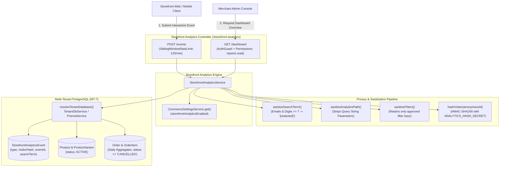
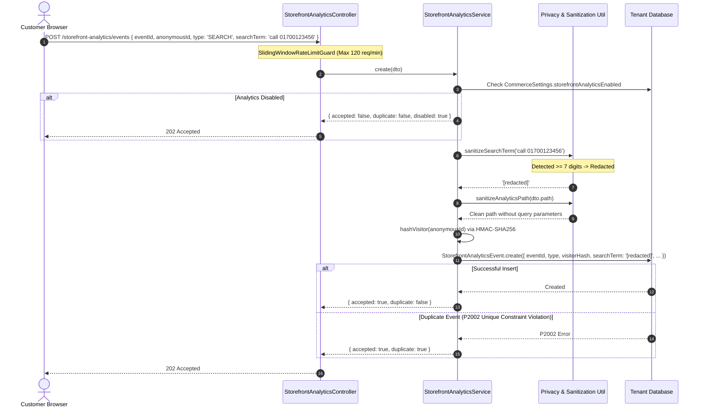
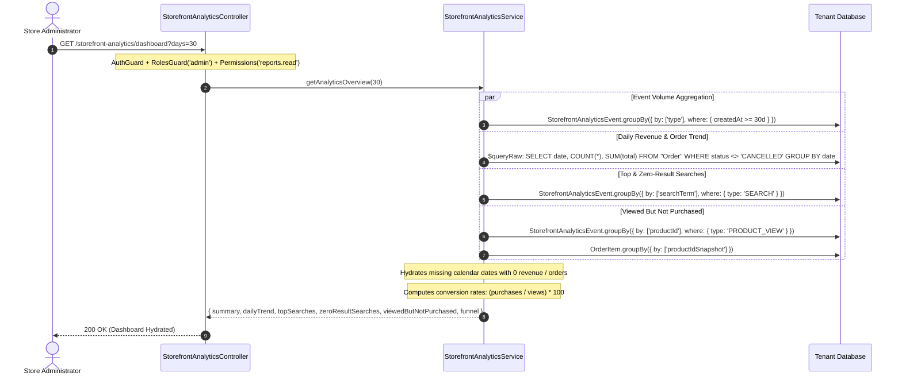
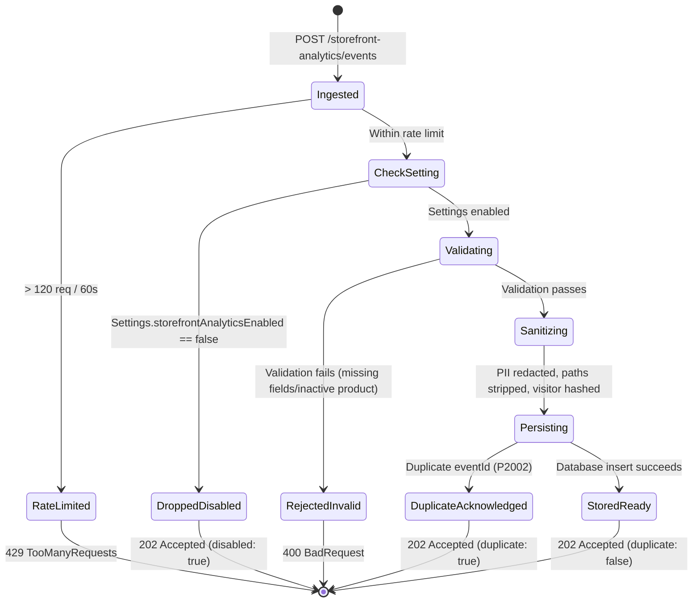

# Storefront Analytics Feature Architecture & Invariants

## Purpose
The **Storefront Analytics** feature provides privacy-first, GDPR/CCPA-compliant shopper behavior tracking and business intelligence for the multi-tenant commerce platform. It powers customer journey telemetry, search query intelligence, zero-result search detection, conversion funnels, and executive merchant dashboards.

Key capabilities:
1. **Privacy-by-Design Telemetry Ingestion**: High-throughput ingestion of frontend customer interactions (`PRODUCT_VIEW`, `SEARCH`, `FILTER`, `ADD_TO_CART`, `CHECKOUT_BEGIN`) with automatic PII redaction and query-string sanitization.
2. **Pseudonymous Visitor Identification**: Cryptographic pseudonymization via HMAC-SHA256 (`visitorHash`) preventing plain identifier or cookie storage.
3. **Idempotent Client Reporting**: UUID-based event deduplication (`eventId`) returning `202 Accepted` on duplicate submissions without database errors.
4. **Search Query Intelligence**: Aggregation of top search terms and detection of zero-result searches to help merchants identify product catalog gaps.
5. **Conversion Funnel & Merchandising Insights**: Multi-stage funnel visualization (`Product View -> Add to Cart -> Checkout Begin -> Purchased`) and identification of high-intent products viewed but not purchased.
6. **Merchant Kill-Switch Integration**: Respects global `storefrontAnalyticsEnabled` toggle in commerce settings.

---

## Component Architecture



---

## Component Source Map

| File | Primary Symbol | Role | Key Architectural Invariants & Responsibilities |
| :--- | :--- | :--- | :--- |
| [`storefront-analytics.module.ts`](file:///home/chillpc/MohammadSheakh/projects/26/e-commerce/e-com-nextjs/ferio-nest-prisma/src/features/storefront-analytics/storefront-analytics.module.ts) | `StorefrontAnalyticsModule` | NestJS Feature Module | Bundles analytics dependencies. Imports `PrismaModule`, `TenancyModule`, `SettingsModule`, and `AuthModule`. Registers `StorefrontAnalyticsController` and `StorefrontAnalyticsService`. |
| [`storefront-analytics.controller.ts`](file:///home/chillpc/MohammadSheakh/projects/26/e-commerce/e-com-nextjs/ferio-nest-prisma/src/features/storefront-analytics/storefront-analytics.controller.ts) | `StorefrontAnalyticsController` | REST Controller | Exposes public event intake endpoint (`POST /events` with `SlidingWindowRateLimitGuard`) and administrative dashboard (`GET /dashboard` with `REPORTS_READ` permission). |
| [`storefront-analytics.dto.ts`](file:///home/chillpc/MohammadSheakh/projects/26/e-commerce/e-com-nextjs/ferio-nest-prisma/src/features/storefront-analytics/storefront-analytics.dto.ts) | `CreateStorefrontAnalyticsEventDto` | Ingestion DTO | Validates UUID event IDs, enum event types, maximum lengths, string path formats (`/^\/[^\s]*$/`), and numerical bounds. |
| [`storefront-analytics.util.ts`](file:///home/chillpc/MohammadSheakh/projects/26/e-commerce/e-com-nextjs/ferio-nest-prisma/src/features/storefront-analytics/utils/storefront-analytics.util.ts) | `sanitizeSearchTerm`<br>`sanitizeFilters`<br>`sanitizeAnalyticsPath` | Privacy Sanitizers | Redacts PII from search terms (emails, phone/card numbers), whitelists safe faceted filter keys, and strips tracking query parameters from stored URLs. |
| [`storefront-analytics.service.ts`](file:///home/chillpc/MohammadSheakh/projects/26/e-commerce/e-com-nextjs/ferio-nest-prisma/src/features/storefront-analytics/storefront-analytics.service.ts) | `StorefrontAnalyticsService` | Domain Core Service | Orchestrates event validation, HMAC hashing, idempotent storage (`P2002` deduplication), top searches, zero-result searches, viewed-not-purchased ratios, and daily order/revenue trend aggregations. |
| [`storefrontAnalytics.prisma`](file:///home/chillpc/MohammadSheakh/projects/26/e-commerce/e-com-nextjs/ferio-nest-prisma/prisma/schema/analytics.module/storefrontAnalytics.prisma) | `StorefrontAnalyticsEvent`<br>`StorefrontAnalyticsEventType` | Prisma Model & Enum | Defines event schema with compound indexes on `[type, createdAt]`, `[productId, type, createdAt]`, `[type, searchResultCount, createdAt]`, and `[visitorHash, createdAt]`. |
| [`storefront-analytics.service.spec.ts`](file:///home/chillpc/MohammadSheakh/projects/26/e-commerce/e-com-nextjs/ferio-nest-prisma/src/features/storefront-analytics/tests/storefront-analytics.service.spec.ts) | Unit Test Suite | Jest Test Suite | Tests structured search evidence storage, zero-result search accuracy, event validation enforcement, and database daily aggregate building. |
| [`storefront-analytics.tenant-isolation.spec.ts`](file:///home/chillpc/MohammadSheakh/projects/26/e-commerce/e-com-nextjs/ferio-nest-prisma/src/features/storefront-analytics/tests/storefront-analytics.tenant-isolation.spec.ts) | Isolation Test Suite | Jest Test Suite | Validates that analytics metrics aggregate strictly from the caller's resolved tenant database. |
| [`storefront-analytics.util.spec.ts`](file:///home/chillpc/MohammadSheakh/projects/26/e-commerce/e-com-nextjs/ferio-nest-prisma/src/features/storefront-analytics/tests/storefront-analytics.util.spec.ts) | Utility Test Suite | Jest Test Suite | Tests Unicode normalization, email/phone redaction, filter dimension whitelisting, and query string dropping. |

---

## Responsibilities

### Owns
- **Telemetry Event Ingestion**: Validating and storing customer engagement events (`PRODUCT_VIEW`, `SEARCH`, `FILTER`, `ADD_TO_CART`, `CHECKOUT_BEGIN`).
- **Privacy & PII Protection**: Stripping personal identifiable information from search inputs and scrubbing query parameters from stored URL paths.
- **Visitor Pseudonymization**: Hashing anonymous client identifiers using HMAC-SHA256 before persisting.
- **Event Deduplication**: Seamlessly trapping duplicate `eventId` UUIDs and returning successful acknowledgments.
- **Search Intelligence & Zero-Result Analytics**: Grouping search queries and isolating searches that yielded 0 catalog results.
- **Conversion Funnel Analytics**: Aggregating conversion drop-offs from product views to finalized orders.
- **Daily Financial & Volume Trends**: Calculating daily order count and revenue trends using bounded database SQL aggregation.

### Does Not Own
- **Customer Identity & Profiles**: Managing customer accounts or linking anonymous sessions to verified identity records (owned by `customers` and `customer-account`).
- **Order Placement & Status Progression**: Creating orders or progressing order lifecycle states (owned by `order`).
- **Catalog Management**: Creating products, categories, or managing inventory quantities (owned by `catalog`).
- **Store Settings Persistence**: Storing commerce configuration flags (owned by `settings`).

---

## Dependencies

### Consumes
- [`PrismaService`](file:///home/chillpc/MohammadSheakh/projects/26/e-commerce/e-com-nextjs/ferio-nest-prisma/libs/database/src/prisma.service.ts) & [`TenantDbService`](file:///home/chillpc/MohammadSheakh/projects/26/e-commerce/e-com-nextjs/ferio-nest-prisma/src/tenancy/services/tenant-db.service.ts): Dynamic database resolution targeting dedicated tenant schemas (`MT-7`).
- [`CommerceSettingsService`](file:///home/chillpc/MohammadSheakh/projects/26/e-commerce/e-com-nextjs/ferio-nest-prisma/src/features/settings/services/commerce-settings.service.ts): Reads `storefrontAnalyticsEnabled` flag.
- [`ConfigService`](file:///home/chillpc/MohammadSheakh/projects/26/e-commerce/e-com-nextjs/ferio-nest-prisma/src/tenancy/context/tenant-context.ts): Reads `ANALYTICS_HASH_SECRET` or `JWT_ACCESS_SECRET` for HMAC generation.
- [`SlidingWindowRateLimitGuard`](file:///home/chillpc/MohammadSheakh/projects/26/e-commerce/e-com-nextjs/ferio-nest-prisma/libs/common/src/guards/sliding-window-rate-limit.guard.ts): Protects public ingestion against request floods.
- [`AuthGuard`](file:///home/chillpc/MohammadSheakh/projects/26/e-commerce/e-com-nextjs/ferio-nest-prisma/libs/common/src/guards/auth.guard.ts), `RolesGuard`, `PermissionsGuard`: Secures administrative dashboard endpoint.

### External Services
- `node:crypto`: `createHmac('sha256')` for one-way visitor hashing.
- PostgreSQL (via Prisma ORM Client).

### Emitters
- None (Intake and aggregation engine; emits no external webhook or message broker events).

---

## Database Ownership

### Direct Writes / Mutates

| Table | Operation | Trigger / Context | Fields Modified |
| :--- | :--- | :--- | :--- |
| `StorefrontAnalyticsEvent` | `create` | `create()` | `eventId`, `type`, `eventVersion` (2), `source` (`CUSTOMER_WEB`), `visitorHash`, `productId`, `variantId`, `searchTerm`, `searchResultCount`, `filters`, `quantity`, `path` |

### Reads / References

| Table | Query Method | Purpose |
| :--- | :--- | :--- |
| `StorefrontAnalyticsEvent` | `groupBy` | Groups events by `type` for funnel metrics, by `searchTerm` for top and zero-result searches, and by `productId` for view counts. |
| `Product` | `findFirst` | Validates that a viewed product exists and has `status = 'ACTIVE'`. |
| `Product` | `findMany` | Hydrates product names, slugs, and prices for viewed-but-not-purchased reporting. |
| `ProductVariant` | `findFirst` | Validates that added-to-cart variant exists, is active, and belongs to an active product. |
| `Order` | `$queryRaw` | Computes daily aggregate order counts and revenue sums (`status <> 'CANCELLED'`). |
| `OrderItem` | `groupBy` | Groups by `productIdSnapshot` to calculate conversion rates against product view counts. |

---

## Important Invariants

1. **Mandatory Privacy & PII Scrubbing**:
   - Search terms are scrubbed via `sanitizeSearchTerm()`:
     - Regex check `/\S+@\S+\.\S+/` identifies email addresses.
     - Digit extraction `normalized.replace(/\D/g, '').length >= 7` detects phone numbers, credit card sequences, and national IDs.
     - Any match immediately replaces the search query with `'[redacted]'`.
     - Raw search terms are truncated to a maximum of 80 characters.
   - Stored URL paths undergo `split('?')[0]`. All query parameters (e.g. `?utm_source=...`, `?token=...`, `?session=...`) are purged.
2. **Pseudonymous Visitor Hashing**:
   - Plain `anonymousId` (UUID) is **never** persisted to the database.
   - It is hashed using HMAC-SHA256 with `ANALYTICS_HASH_SECRET` (fallback `JWT_ACCESS_SECRET`) producing a 64-character hex digest (`visitorHash`).
3. **Idempotent Ingestion via Client-Supplied Event UUID**:
   - Every event must supply a client-generated UUID `eventId` indexed `@unique`.
   - If network retries cause the same event to be delivered multiple times, Prisma catches error code `P2002` (unique constraint violation) and returns `{ accepted: true, duplicate: true }` with HTTP `202 Accepted`.
4. **Context-Specific Event Validation**:
   - `SEARCH`: Must supply a non-empty `searchTerm`.
   - Non-`SEARCH`: `searchResultCount` must be `undefined` (prevents polluting zero-result metrics).
   - `FILTER`: Must supply a non-empty object containing only approved filter keys (`category`, `minPrice`, `maxPrice`, `inStock`, `condition`, `sort`, `attributeKey`, `attributeValue`).
   - `PRODUCT_VIEW`: Requires `productId` corresponding to an active product.
   - `ADD_TO_CART`: Requires `productId`, `variantId`, and `quantity` ($1 \dots 100$) linked to an active variant and product.
5. **Zero-Result Search Definition**:
   - An event qualifies as a zero-result search if and only if `type === 'SEARCH'` AND `searchResultCount === 0`.
6. **Bounded Database Aggregations (OOM Prevention)**:
   - Dashboard date range `days` is strictly bounded between 1 and 365 days (default 30).
   - Daily revenue and order trend generation utilizes a single SQL `$queryRaw` with `GROUP BY TO_CHAR("createdAt", 'YYYY-MM-DD')` rather than loading individual `Order` models into Node.js heap memory.
7. **Strict Multi-Tenant Database Isolation (MT-7)**:
   - All analytics queries and writes pass through `resolveTenantDatabase(this.tenantDb, this.prisma, 'storefront-analytics-service')`. Tenant A can never query or mutate Tenant B's analytics data.

---

## Public API & Entry Points

| Endpoint | Method | Auth / Guards | Permissions | Payload / Parameters | Success Response | Errors |
| :--- | :--- | :--- | :--- | :--- | :--- | :--- |
| `/storefront-analytics/events` | `POST` | `SlidingWindowRateLimitGuard`<br>(120 req / 60s) | None (Public) | Body: `CreateStorefrontAnalyticsEventDto`<br>• `eventId`: UUID<br>• `anonymousId`: UUID<br>• `type`: Enum<br>• `productId?`, `variantId?`<br>• `searchTerm?`, `searchResultCount?`<br>• `filters?`, `quantity?`, `path?` | `202 Accepted`<br>`{ accepted: boolean, duplicate: boolean, disabled?: boolean }` | `400 BadRequest`<br>`429 TooManyRequests` |
| `/storefront-analytics/dashboard` | `GET` | `AuthGuard`<br>`RolesGuard('admin')`<br>`PermissionsGuard` | `reports.read` | Query: `days?`: string (1..365, default: 30) | `{ summary, dailyTrend, topSearches, zeroResultSearches, viewedButNotPurchased, funnel }` | `401 Unauthorized`<br>`403 Forbidden` |

---

## Important Flows

### 1. Storefront Event Ingestion & PII Redaction Flow



### 2. Merchant Dashboard Generation Flow



### 3. Event Ingestion Lifecycle



---

## Brutal Honest Vulnerabilities & Architectural Debt

### 1. Synchronous Database Validation on Public Telemetry Ingestion (High Architectural Debt)
- **The Gap**: In `StorefrontAnalyticsService.validateEvent()` (lines 119–141), public ingestion of `PRODUCT_VIEW` and `ADD_TO_CART` triggers synchronous relational database lookups:
  ```typescript
  const product = await db.product.findFirst({ where: { id: dto.productId, status: 'ACTIVE' } });
  const variant = await db.productVariant.findFirst({ where: { id: dto.variantId, ... } });
  ```
- **Performance Impact**: During peak traffic events (flash sales, marketing blasts, viral social campaigns), thousands of shoppers generate product view and cart events simultaneously. Requiring 1–2 synchronous SQL queries *per event* before inserting into the analytics table creates severe connection pool exhaustion and read latency contention on the primary database.
- **Remediation**: Decouple ingestion from synchronous relational validation. Stream raw validated DTOs directly into Redis Streams or BullMQ (`analytics-events-queue`) and perform asynchronous product hydration and batch insertion in background workers.

### 2. High-Cardinality Database Bloat via Bot Query Flooding (Medium Severity)
- **The Gap**: While `SlidingWindowRateLimitGuard` limits individual IPs to 120 requests/minute, search query strings are inserted directly into `StorefrontAnalyticsEvent.searchTerm`.
- **Attack Vector**: A distributed botnet or crawler using rotating proxies can submit millions of randomized search terms (`a8f9x1`, `b7c2z9`). Over time, this inflates table size to tens of millions of rows, degrading index performance on `[type, createdAt]` and causing `groupBy` aggregations to become sluggish.
- **Remediation**: Enforce a global daily unique search term ceiling or aggregate search term counts in an ephemeral Redis HyperLogLog / sorted set before flushing summarized aggregates to PostgreSQL.

### 3. In-Memory Post-Aggregation on Viewed-But-Not-Purchased Reporting (Medium Severity)
- **The Gap**: In `getViewedButNotPurchased()`, the service executes:
  1. `db.storefrontAnalyticsEvent.groupBy({ by: ['productId'], take: 50 })`
  2. `db.product.findMany({ where: { id: { in: productIds } } })`
  3. `db.orderItem.groupBy({ by: ['productIdSnapshot'] })`
  4. Manual in-memory `.map()`, `.filter()`, and `.sort()` in Node.js (lines 240–263).
- **Impact**: While taking 50 items mitigates unbounded growth, executing three separate database roundtrips and joining the datasets in application memory creates unnecessary garbage collection churn and latency on dashboard load.
- **Remediation**: Replace multiple application-level queries with a single optimized SQL query joining `StorefrontAnalyticsEvent`, `Product`, and `OrderItem` using standard window functions.

### 4. Cryptographic Secret Fallback Smell (Low / Security Smell)
- **The Gap**: In `hashVisitor()` (lines 362–363):
  ```typescript
  const secret = this.config.get<string>('ANALYTICS_HASH_SECRET') ??
                 this.config.getOrThrow<string>('JWT_ACCESS_SECRET');
  ```
- **Security Debt**: Falling back to `JWT_ACCESS_SECRET` when `ANALYTICS_HASH_SECRET` is unset violates cryptographic key separation principles. If the HMAC secret is ever compromised or exposed via analytics exports, it risks compromising authentication tokens.
- **Remediation**: Enforce `ANALYTICS_HASH_SECRET` as a mandatory, independent environment variable without authentication key fallback.

### 5. Absence of Event Partitioning & Data Retention Lifecycle (High Long-Term Debt)
- **The Gap**: `StorefrontAnalyticsEvent` records are inserted indefinitely. There is no automated table partitioning (e.g., PostgreSQL declarative monthly range partitioning) or background pruning worker (`DELETE ... WHERE createdAt < NOW() - INTERVAL '90 days'`).
- **Impact**: In a high-traffic production tenant generating 1,000,000 events/month, the table will grow to tens of gigabytes within a year, drastically slowing down index maintenance, database backups, and dashboard load times.
- **Remediation**: Implement monthly range partitioning on `StorefrontAnalyticsEvent(createdAt)` and establish an automated retention job that purges raw event rows older than 90 days after consolidating them into pre-aggregated daily summary tables.
