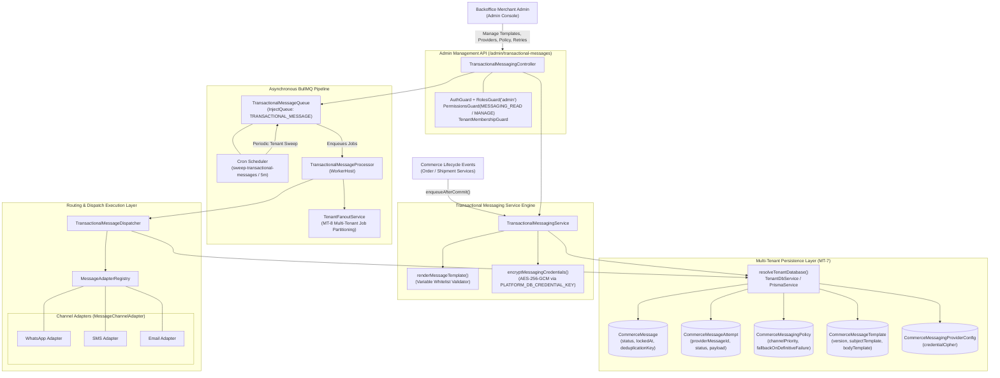
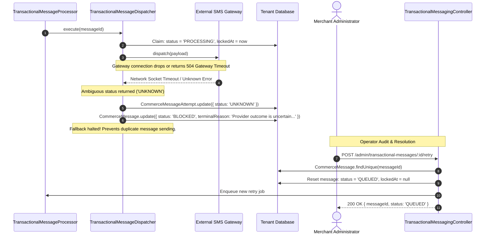
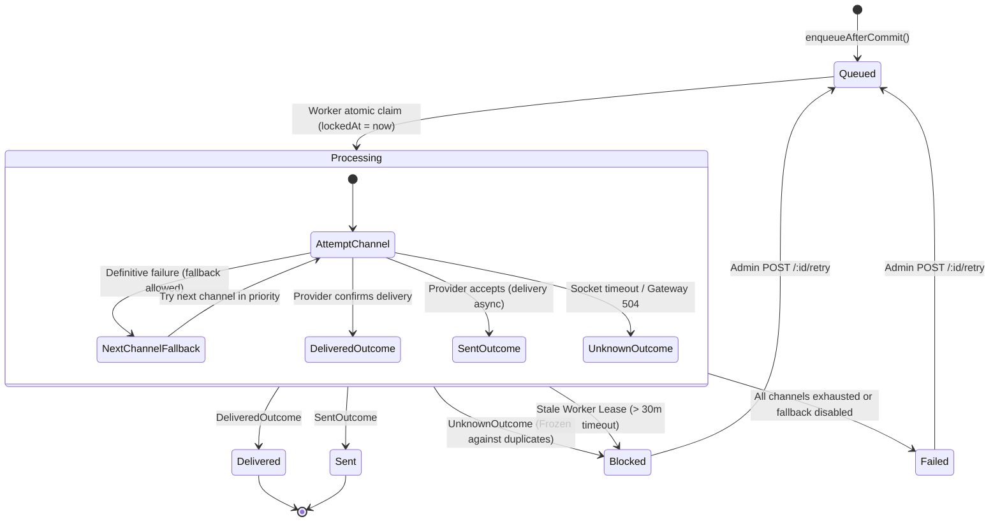

# Transactional Messaging Feature Architecture & Invariants

## Purpose
The **Transactional Messaging** feature provides an enterprise-grade, multi-channel transactional notification engine across **WhatsApp**, **SMS**, and **Email**. Designed for commerce order lifecycle milestones (order placement, confirmation, shipping dispatches, delivery progress, and cancellations), it guarantees reliable customer communication while enforcing strict privacy, cryptographic credential isolation, and anti-duplicate delivery protections.

Key capabilities:
1. **Policy-Driven Cascading Multi-Channel Fallback**: Automatically cascades from high-engagement channels (WhatsApp) to secondary channels (SMS, Email) upon definitive provider rejection.
2. **Anti-Duplicate "Unknown Outcome" Freeze**: Freezes automatic retries and marks messages as `BLOCKED` if an external gateway returns a timeout or ambiguous network status, eliminating accidental duplicate notifications or customer double-charges.
3. **Asynchronous BullMQ Queue & Tenant Fanout (MT-8 §11.2)**: Decouples message emission from external network latency via BullMQ queues, scheduled sweepers, and tenant-scoped worker jobs.
4. **Stale Lease Reclamation**: Detects orphaned messages held by crashed workers (`lockedAt > 30m`) and transitions them to an audited operator-review state (`BLOCKED`).
5. **AES-256-GCM Credential Encryption**: Encrypts all third-party provider API keys, webhook secrets, and credentials at rest using `PLATFORM_DB_CREDENTIAL_KEY`.
6. **Strict Template Sandboxing & PII Masking**: Restricts message rendering to whitelisted placeholder variables and masks customer contact details in backoffice interfaces.

---

## Component Architecture



---

## Component Source Map

| File | Primary Symbol | Role | Key Architectural Invariants & Responsibilities |
| :--- | :--- | :--- | :--- |
| [`transactional-messaging.module.ts`](file:///home/chillpc/MohammadSheakh/projects/26/e-commerce/e-com-nextjs/ferio-nest-prisma/src/features/transactional-messaging/transactional-messaging.module.ts) | `TransactionalMessagingModule` | NestJS Feature Module | Bundles and exports `TransactionalMessagingService`. Registers controller, dispatcher, queue, processor, and adapter registry. |
| [`transactional-messaging.controller.ts`](file:///home/chillpc/MohammadSheakh/projects/26/e-commerce/e-com-nextjs/ferio-nest-prisma/src/features/transactional-messaging/controllers/transactional-messaging.controller.ts) | `TransactionalMessagingController` | Admin REST Controller | Protected by `AuthGuard`, `RolesGuard('admin')`, `PermissionsGuard`, and `TenantMembershipGuard`. Manages policies, provider configurations, templates, queue health, and manual retries. |
| [`transactional-message.dto.ts`](file:///home/chillpc/MohammadSheakh/projects/26/e-commerce/e-com-nextjs/ferio-nest-prisma/src/features/transactional-messaging/dto/transactional-message.dto.ts) | `TransactionalMessageQueryDto`<br>`UpdateMessagingProviderConfigDto`<br>`UpdateMessagingPolicyDto`<br>`UpdateMessageTemplateDto` | Validation DTOs | Validates pagination bounds, provider credential payloads, channel priority arrays, and template strings. |
| [`message-channel-adapter.interface.ts`](file:///home/chillpc/MohammadSheakh/projects/26/e-commerce/e-com-nextjs/ferio-nest-prisma/src/features/transactional-messaging/adapters/message-channel-adapter.interface.ts) | `MessageChannelAdapter`<br>`MessageDispatchInput`<br>`MessageDispatchResult` | Core Abstraction | Defines the standardized protocol for channel providers (`isConfigured`, `dispatch`). Defines strict result statuses: `ACCEPTED`, `DELIVERED`, `FAILED`, `UNKNOWN`. |
| [`message-adapter.registry.ts`](file:///home/chillpc/MohammadSheakh/projects/26/e-commerce/e-com-nextjs/ferio-nest-prisma/src/features/transactional-messaging/adapters/message-adapter.registry.ts) | `MessageAdapterRegistry` | Provider Registry | Tracks active adapters for `WHATSAPP`, `SMS`, `EMAIL`. Checks provider readiness and routes dispatches. |
| [`messaging-credentials.util.ts`](file:///home/chillpc/MohammadSheakh/projects/26/e-commerce/e-com-nextjs/ferio-nest-prisma/src/features/transactional-messaging/utils/messaging-credentials.util.ts) | `encryptMessagingCredentials`<br>`decryptMessagingCredentials` | Cryptographic Security Util | Encrypts and decrypts provider credentials using AES-256-GCM with 12-byte random IVs and 16-byte authentication tags via `PLATFORM_DB_CREDENTIAL_KEY`. |
| [`transactional-message.util.ts`](file:///home/chillpc/MohammadSheakh/projects/26/e-commerce/e-com-nextjs/ferio-nest-prisma/src/features/transactional-messaging/utils/transactional-message.util.ts) | `renderMessageTemplate`<br>`validateMessageTemplate`<br>`buildMessageDeduplicationKey`<br>`maskMessageRecipient` | Template & Sanitization Util | Performs template variable substitution against strict allowed lists; generates deterministic SHA-256 deduplication keys; masks recipient emails and phone numbers. |
| [`transactional-message.queue.ts`](file:///home/chillpc/MohammadSheakh/projects/26/e-commerce/e-com-nextjs/ferio-nest-prisma/src/features/transactional-messaging/queues/transactional-message.queue.ts) | `TransactionalMessageQueue` | BullMQ Queue Manager | Manages message queuing, cron sweeper scheduling (`every: 5m`), multi-tenant queue sweeps via `TenantFanoutService`, and manual retry dispatching. |
| [`transactional-message.processor.ts`](file:///home/chillpc/MohammadSheakh/projects/26/e-commerce/e-com-nextjs/ferio-nest-prisma/src/features/transactional-messaging/processors/transactional-message.processor.ts) | `TransactionalMessageProcessor` | BullMQ Worker Host | Consumes `QUEUE_NAMES.TRANSACTIONAL_MESSAGE`. Propagates correlation IDs and tenant organization context through `TenantFanoutService.forOrganization()`. |
| [`transactional-message-dispatcher.ts`](file:///home/chillpc/MohammadSheakh/projects/26/e-commerce/e-com-nextjs/ferio-nest-prisma/src/features/transactional-messaging/services/transactional-message-dispatcher.ts) | `TransactionalMessageDispatcher` | Dispatch Engine | Executes atomic message claims (`updateMany`), iterates through channel priorities, dispatches to adapters, halts on `UNKNOWN` status, and logs detailed attempts. |
| [`transactional-messaging.service.ts`](file:///home/chillpc/MohammadSheakh/projects/26/e-commerce/e-com-nextjs/ferio-nest-prisma/src/features/transactional-messaging/services/transactional-messaging.service.ts) | `TransactionalMessagingService` | Core Service | Handles message enqueuing (`enqueueAfterCommit`), template CRUD, provider credential updates, policy updates, and stale worker lease reclamation (`blockStaleProcessing`). |
| [`notification.prisma`](file:///home/chillpc/MohammadSheakh/projects/26/e-commerce/e-com-nextjs/ferio-nest-prisma/prisma/schema/notification.module/notification.prisma) | `CommerceMessage`<br>`CommerceMessageAttempt`<br>`CommerceMessageTemplate`<br>`CommerceMessagingPolicy`<br>`CommerceMessagingProviderConfig` | Prisma Models | Stores message state machines, historical dispatch attempts, templates, encrypted credentials, and routing policies. |

---

## Responsibilities

### Owns
- **Message Enqueuing & Deduplication**: Creating deterministic SHA-256 deduplication keys (`eventType:refType:refId:occurrence`) to guarantee at-most-once message creation.
- **Template Rendering & Variable Sandboxing**: Enforcing strict allowed variable whitelists and rendering Mustache-style (`{{ token }}`) templates.
- **Multi-Channel Cascading Fallback**: Iterating through tenant-configured channel priorities (e.g. WhatsApp $\rightarrow$ SMS $\rightarrow$ Email) upon definitive channel rejections.
- **Duplicate Prevention Freeze**: Freezing execution and transitioning messages to `BLOCKED` status whenever a provider returns an ambiguous or uncertain outcome (`UNKNOWN`).
- **Worker Concurrency & Lease Management**: Claiming messages using atomic database updates (`lockedAt`), reclaiming abandoned leases after 30 minutes, and stamping BullMQ jobs with tenant IDs.
- **Credential Encryption**: Encrypting and decrypting third-party provider API keys using AES-256-GCM.
- **PII Masking**: Redacting recipient email addresses and phone numbers in administrative search outputs.

### Does Not Own
- **Upstream Commerce Triggers**: Deciding when an order is placed, confirmed, or cancelled (owned by `order` and `checkout`).
- **Courier Webhook Ingestion & Polling**: Receiving carrier shipment tracking updates (owned by `shipping`).
- **Direct SMTP Transport for Staff Invites**: Delivering authentication or staff setup emails (owned by `authentication/email`).
- **Customer Notification Center**: Managing in-app notifications and customer inbox feeds (owned by `customer-notifications`).

---

## Dependencies

### Consumes
- `@nestjs/bullmq` / `bullmq`: Job queue management and background worker infrastructure (`QUEUE_NAMES.TRANSACTIONAL_MESSAGE`).
- [`PrismaService`](file:///home/chillpc/MohammadSheakh/projects/26/e-commerce/e-com-nextjs/ferio-nest-prisma/libs/database/src/prisma.service.ts) & [`TenantDbService`](file:///home/chillpc/MohammadSheakh/projects/26/e-commerce/e-com-nextjs/ferio-nest-prisma/src/tenancy/services/tenant-db.service.ts): Dynamic database resolution targeting dedicated tenant schemas (`MT-7`).
- [`TenantFanoutService`](file:///home/chillpc/MohammadSheakh/projects/26/e-commerce/e-com-nextjs/ferio-nest-prisma/src/tenancy/services/tenant-fanout.service.ts): Multi-tenant background sweeping and worker context binding (`MT-8 §11.2`).
- [`AuditService`](file:///home/chillpc/MohammadSheakh/projects/26/e-commerce/e-com-nextjs/ferio-nest-prisma/src/features/audit/services/audit.service.ts): Records configuration updates and manual retry queues.
- [`ConfigService`](file:///home/chillpc/MohammadSheakh/projects/26/e-commerce/e-com-nextjs/ferio-nest-prisma/src/tenancy/context/tenant-context.ts): Reads `PLATFORM_DB_CREDENTIAL_KEY` for AES-256-GCM encryption.

### External Services
- Redis (BullMQ queue backend and lock store).
- WhatsApp Business API / Providers (e.g. Infobip, Twilio WhatsApp, Meta Cloud API).
- SMS Gateways (e.g. Twilio, Greenweb, SSL Wireless).
- Transactional Email Gateways (e.g. SendGrid, Postmark, Amazon SES).

### Emitters
- BullMQ Jobs: `dispatch-transactional-message`, `sweep-transactional-messages`.
- Audit Events:
  - `TRANSACTIONAL_MESSAGE_TEMPLATE_UPDATED`
  - `TRANSACTIONAL_MESSAGING_POLICY_UPDATED`
  - `TRANSACTIONAL_MESSAGING_PROVIDER_CONFIG_UPDATED`
  - `TRANSACTIONAL_MESSAGE_RETRY_QUEUED`

---

## Database Ownership

### Direct Writes / Mutates

| Table | Operation | Trigger / Context | Fields Modified |
| :--- | :--- | :--- | :--- |
| `CommerceMessage` | `upsert` | `enqueueAfterCommit()` | `deduplicationKey`, `eventType`, `templateKey`, `templateVersion`, `renderedSubject`, `renderedBody`, `recipient`, `referenceType`, `referenceId`, `payload` |
| `CommerceMessage` | `updateMany` | `execute()` (Worker claim) | `status = 'PROCESSING'`, `lockedAt = now()`, `lastError = null` |
| `CommerceMessage` | `update` | Dispatch success / failure / block | `status` (`SENT`, `DELIVERED`, `BLOCKED`, `FAILED`), `selectedChannel`, `sentAt`, `deliveredAt`, `failedAt`, `completedAt`, `fallbackReason`, `terminalReason`, `lastError` |
| `CommerceMessage` | `updateMany` | `blockStaleProcessing()` | `status = 'BLOCKED'`, `terminalReason = 'Worker lease expired...'`, `lastError = 'WORKER_LEASE_EXPIRED'`, `lockedAt = null` |
| `CommerceMessage` | `update` | `prepareRetry()` | Resets message to `status = 'QUEUED'`, clears locks, errors, channel plan |
| `CommerceMessageAttempt` | `create` | Before each channel dispatch attempt | `messageId`, `attemptNumber`, `channel`, `provider`, `requestPayload` |
| `CommerceMessageAttempt` | `update` | After channel dispatch attempt | `status`, `providerMessageId`, `responsePayload`, `errorCode`, `errorMessage`, `completedAt` |
| `CommerceMessageTemplate` | `upsert` / `update` | Template synchronization & edits | `subjectTemplate`, `bodyTemplate`, `enabled`, `version += 1`, `updatedById` |
| `CommerceMessagingPolicy` | `upsert` / `update` | Policy reconfiguration | `enabled`, `channelPriority`, `fallbackOnDefinitiveFailure`, `version += 1`, `updatedById` |
| `CommerceMessagingProviderConfig` | `upsert` / `update` | Provider credential updates | `provider`, `credentialCipher`, `enabled`, `credentialsRotatedAt` |

### Reads / References

| Table | Query Method | Purpose |
| :--- | :--- | :--- |
| `CommerceMessage` | `findMany` | Paginated administrative message search and status count aggregations; eligible queued message sweeps. |
| `CommerceMessage` | `findUniqueOrThrow` | Retrieves message, channel plan, and prior attempts during dispatch. |
| `CommerceMessagingPolicy` | `findUnique` | Evaluates channel priorities and fallback rules. |
| `CommerceMessagingProviderConfig` | `findMany` | Reads encrypted provider configurations and credentials. |
| `CommerceMessageTemplate` | `findUnique` | Validates template state and version before rendering. |

---

## Important Invariants

1. **At-Most-Once Delivery Guarantee on Uncertain Provider Outcomes**:
   - If a provider adapter returns `status: 'UNKNOWN'` (e.g. gateway socket timeout, 504 Gateway Timeout, connection reset), the dispatcher **immediately stops execution**.
   - It marks the message `BLOCKED` with reason `"Provider outcome is uncertain; automatic fallback stopped to avoid duplicate delivery"`.
   - Automatic channel fallback is prohibited to prevent duplicate messages or double-charging customers.
2. **Atomic Worker Claim & Lockout Invariant**:
   - Workers claim messages using an atomic SQL update:
     ```typescript
     await db.commerceMessage.updateMany({
       where: { id: messageId, status: 'QUEUED', lockedAt: null },
       data: { status: 'PROCESSING', lockedAt: new Date() }
     });
     ```
   - If `claimed.count === 0`, execution skips immediately. Two workers or concurrent sweepers can never execute the same message simultaneously.
3. **Deterministic SHA-256 Deduplication**:
   - Messages are assigned a unique deduplication key:
     $$\text{dedupKey} = \text{SHA-256}(\text{eventType} : \text{referenceType} : \text{referenceId} : \text{occurrenceKey})$$
   - Repeated lifecycle events (e.g., retried order completion hooks) upsert without creating duplicate message records.
4. **Strict Template Variable Sandboxing**:
   - Templates only permit placeholders declared in `definition.allowedVariables`.
   - Any unknown token (e.g., `{{ password }}`) or malformed bracket syntax immediately rejects updates with `BadRequestException`.
5. **AES-256-GCM Credential Protection**:
   - Provider credentials (API tokens, secrets) are encrypted using AES-256-GCM with a 12-byte random IV and 16-byte authentication tag via `PLATFORM_DB_CREDENTIAL_KEY`.
   - Credentials are decrypted strictly in memory at the moment of provider dispatch and are never stored in plaintext logs.
6. **Stale Worker Lease Reclamation**:
   - Periodic sweeper checks for messages stuck in `PROCESSING` where `lockedAt < now() - timeoutMinutes` (default: 30 minutes).
   - Stale messages are transitioned to `BLOCKED` (`lastError: 'WORKER_LEASE_EXPIRED'`) and require manual administrative review and retry.
7. **Multi-Tenant Job Isolation (MT-8 §11.2)**:
   - BullMQ sweep jobs fan out across tenants using `TenantFanoutService.forEachTenant()`.
   - BullMQ job IDs embed the tenant organization ID (`t:${organizationId}:transactional-message-${messageId}`), preventing job collision or deduplication across organizations sharing the same Redis instance.

---

## Public API & Entry Points

All transactional messaging endpoints are restricted to backoffice administrators:

| Endpoint | Method | Auth / Guards | Permissions | Payload / Parameters | Success Response | Errors |
| :--- | :--- | :--- | :--- | :--- | :--- | :--- |
| `/admin/transactional-messages` | `GET` | `AuthGuard`<br>`RolesGuard('admin')`<br>`PermissionsGuard`<br>`TenantMembershipGuard` | `messaging.read` | Query: `TransactionalMessageQueryDto`<br>• `page`, `limit`<br>• `status`, `eventType`, `search` | `{ items: MaskedMessage[], total, counts, policy }` | `401 Unauthorized`<br>`403 Forbidden` |
| `/admin/transactional-messages/policy` | `GET` | `AuthGuard`<br>`RolesGuard('admin')`<br>`PermissionsGuard`<br>`TenantMembershipGuard` | `messaging.read` | None | `CommerceMessagingPolicy & { channels, activationAllowed }` | `401 Unauthorized`<br>`403 Forbidden` |
| `/admin/transactional-messages/policy` | `PATCH` | `AuthGuard`<br>`RolesGuard('admin')`<br>`PermissionsGuard`<br>`TenantMembershipGuard` | `messaging.manage` | Body: `UpdateMessagingPolicyDto`<br>• `enabled?`: boolean<br>• `channelPriority?`: Channel[]<br>• `fallbackOnDefinitiveFailure?`: boolean | `UpdatedPolicy` | `400 BadRequest`<br>`409 Conflict` (No configured adapter) |
| `/admin/transactional-messages/templates` | `GET` | `AuthGuard`<br>`RolesGuard('admin')`<br>`PermissionsGuard`<br>`TenantMembershipGuard` | `messaging.read` | None | `Array<CommerceMessageTemplate & { allowedVariables }>` | `401 Unauthorized`<br>`403 Forbidden` |
| `/admin/transactional-messages/templates/:key` | `PATCH` | `AuthGuard`<br>`RolesGuard('admin')`<br>`PermissionsGuard`<br>`TenantMembershipGuard` | `messaging.manage` | Param: `key`<br>Body: `UpdateMessageTemplateDto`<br>• `enabled?`, `subjectTemplate?`, `bodyTemplate?` | `UpdatedTemplate` | `400 BadRequest` (Invalid placeholder)<br>`404 NotFound` |
| `/admin/transactional-messages/providers` | `GET` | `AuthGuard`<br>`RolesGuard('admin')`<br>`PermissionsGuard`<br>`TenantMembershipGuard` | `messaging.read` | None | `Array<{ channel, provider, enabled, credentialKeys }>` | `401 Unauthorized`<br>`403 Forbidden` |
| `/admin/transactional-messages/providers/:channel` | `PATCH` | `AuthGuard`<br>`RolesGuard('admin')`<br>`PermissionsGuard`<br>`TenantMembershipGuard` | `messaging.manage` | Param: `channel`<br>Body: `UpdateMessagingProviderConfigDto`<br>• `provider`, `credentials`, `enabled?` | `{ channel, provider, enabled, credentialKeys }` | `400 BadRequest`<br>`409 Conflict` (Empty credentials) |
| `/admin/transactional-messages/queue-health` | `GET` | `AuthGuard`<br>`RolesGuard('admin')`<br>`PermissionsGuard`<br>`TenantMembershipGuard` | `messaging.read` | None | `{ available, counts, scheduler, policyEnabled }` | `401 Unauthorized`<br>`403 Forbidden` |
| `/admin/transactional-messages/:id/retry` | `POST` | `AuthGuard`<br>`RolesGuard('admin')`<br>`PermissionsGuard`<br>`TenantMembershipGuard` | `messaging.manage` | Param: `id` (Message ID) | `{ messageId, jobId, status: 'QUEUED' }` | `404 NotFound`<br>`409 Conflict` (Status not failed/blocked) |

---

## Important Flows

### 1. Multi-Channel Cascading Dispatch Flow

```mermaid
sequenceDiagram
    autonumber
    actor Order as Order/Shipping Service
    participant TMS as TransactionalMessagingService
    participant Queue as TransactionalMessageQueue
    participant Worker as TransactionalMessageProcessor
    participant TMD as TransactionalMessageDispatcher
    participant Reg as MessageAdapterRegistry
    participant WA as WhatsApp Adapter
    participant SMS as SMS Adapter
    participant DB as Tenant Database

    Order ->> TMS: enqueueAfterCommit(ORDER_PLACED, recipient, orderData)
    TMS ->> TMS: buildMessageDeduplicationKey(...)
    TMS ->> TMS: renderMessageTemplate(template, payload)
    TMS ->> DB: CommerceMessage.upsert({ deduplicationKey, status: 'QUEUED' })

    Note over Queue, Worker: Asynchronous Queue / Sweeper Trigger
    Queue ->> Worker: Job: dispatch-transactional-message (messageId)
    Worker ->> TMD: execute(messageId)
    TMD ->> DB: CommerceMessage.updateMany({ id, status: 'QUEUED' }, { status: 'PROCESSING', lockedAt: now })

    Note over TMD: Routing Policy: Priority = [WHATSAPP, SMS, EMAIL]
    
    rect rgb(255, 240, 240)
        Note over TMD, WA: Attempt 1: WhatsApp Channel
        TMD ->> DB: CommerceMessageAttempt.create({ attempt: 1, channel: 'WHATSAPP' })
        TMD ->> Reg: dispatch('WHATSAPP', input)
        Reg ->> WA: dispatch(input)
        WA -->> Reg: { status: 'FAILED', errorCode: 'RECIPIENT_NOT_ON_WHATSAPP' }
        Reg -->> TMD: Failed result
        TMD ->> DB: CommerceMessageAttempt.update({ status: 'FAILED' })
        Note over TMD: Definitive failure; Triggering automatic fallback
    end

    rect rgb(240, 255, 240)
        Note over TMD, SMS: Attempt 2: SMS Channel (Fallback)
        TMD ->> DB: CommerceMessageAttempt.create({ attempt: 2, channel: 'SMS' })
        TMD ->> Reg: dispatch('SMS', input)
        Reg ->> SMS: dispatch(input)
        SMS -->> Reg: { status: 'DELIVERED', providerMessageId: 'sms_9981' }
        Reg -->> TMD: Delivered result
        TMD ->> DB: CommerceMessageAttempt.update({ status: 'DELIVERED', providerMessageId })
    end

    TMD ->> DB: CommerceMessage.update({ status: 'DELIVERED', selectedChannel: 'SMS', deliveredAt: now })
    TMD -->> Worker: Completed
```

### 2. Ambiguous Outcome Freeze & Stale Lease Reclamation



### 3. Commerce Message Lifecycle



---

## Brutal Honest Vulnerabilities & Architectural Debt

### 1. Missing Concrete Provider Channel Adapters (Implementation Stub Debt)
- **The Gap**: `MessageAdapterRegistry` defines the adapter contract (`MessageChannelAdapter`), but there are no concrete provider adapters registered in `TransactionalMessagingModule` (e.g. `TwilioSmsAdapter`, `InfobipWhatsAppAdapter`, `SendGridEmailAdapter`).
- **Impact**: Any attempt to dispatch a message in a standard environment immediately fails with:
  `{ status: 'FAILED', errorCode: 'CHANNEL_NOT_CONFIGURED', errorMessage: 'WHATSAPP does not have an approved provider adapter' }`.
- **Remediation**: Implement concrete adapters for certified providers (Twilio, Infobip, SendGrid) and register them within `TransactionalMessagingModule.providers`.

### 2. Worker Thread Blocking on Synchronous Gateway HTTP Calls (High Severity)
- **The Gap**: In `TransactionalMessageDispatcher.execute()`, the adapter dispatch:
  ```typescript
  result = await this.adapters.dispatch(channel, { ... });
  ```
  runs synchronously inside the BullMQ worker processor.
- **Risk**: If a third-party SMS or WhatsApp provider experiences an outage or latency spike (e.g. taking 30–60 seconds before timing out), the BullMQ worker process is completely blocked. When multiple concurrent messages encounter external latency, BullMQ concurrency limits are quickly saturated, causing a backlog of thousands of queued messages across the entire tenant.
- **Remediation**: Enforce a strict HTTP timeout (e.g. 5,000ms max) using `AbortController` within channel adapters, or convert dispatch into an asynchronous request-response webhook pattern.

### 3. Unbounded Response Payload Storage in `CommerceMessageAttempt` (Medium Severity)
- **The Gap**: In `TransactionalMessageDispatcher` (line 119):
  ```typescript
  responsePayload: this.json(result.response)
  ```
- **Risk**: If an external provider returns an unexpected multi-megabyte response (e.g. Cloudflare HTML 502 Bad Gateway page or raw multipart debug payload), it is directly converted into JSON and inserted into PostgreSQL `CommerceMessageAttempt.responsePayload`. Over time, high error volumes will cause severe database bloat and memory pressure during administrative message history queries.
- **Remediation**: Truncate or sanitize third-party response payloads to a maximum of 4 KB before persisting to `CommerceMessageAttempt`.

### 4. Admin Retry Endpoint Lacks Recipient Rate Limiting (Medium Severity)
- **The Gap**: The endpoint `POST /admin/transactional-messages/:id/retry` resets the message and re-queues it immediately without checking frequency caps on the recipient's phone number or email address.
- **Risk**: A backoffice administrator (or a script using an admin session) can repeatedly spam the retry button on a failing message, subjecting a customer to dozens of identical SMS or WhatsApp notifications once provider connectivity is restored.
- **Remediation**: Add a cooldown window (e.g. minimum 60 seconds between retries) and recipient rate limiting in `TransactionalMessageQueue.retry()`.

### 5. Fixed 30-Minute Worker Lease Timeout Delay (Low Severity)
- **The Gap**: In `blockStaleProcessing()`, the default timeout is set to 30 minutes:
  ```typescript
  const timeoutMinutes = boundedInt(process.env.TRANSACTIONAL_MESSAGE_PROCESSING_TIMEOUT_MINUTES, 30, 5, 1440);
  ```
- **Impact**: If a worker node crashes or is restarted during deployment while holding active message claims, affected messages remain stranded in `PROCESSING` status for up to 30 minutes before being detected and moved to `BLOCKED`.
- **Remediation**: Reduce the default processing timeout to 5 minutes, or use BullMQ's built-in job stall detection to automatically emit alert notifications when a worker dies mid-job.
