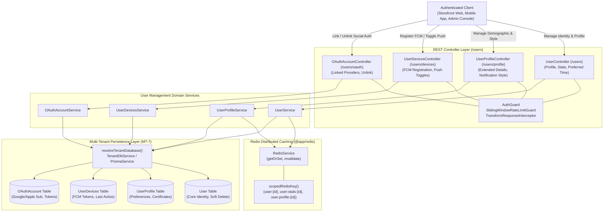
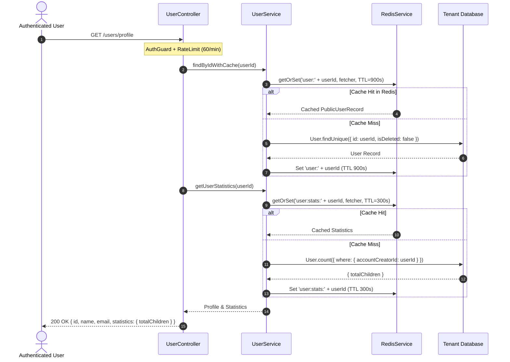
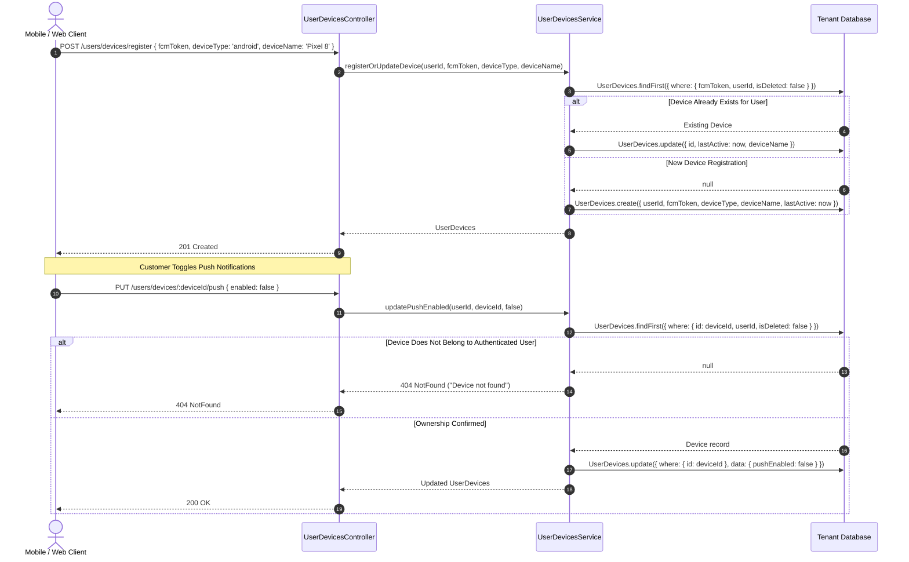
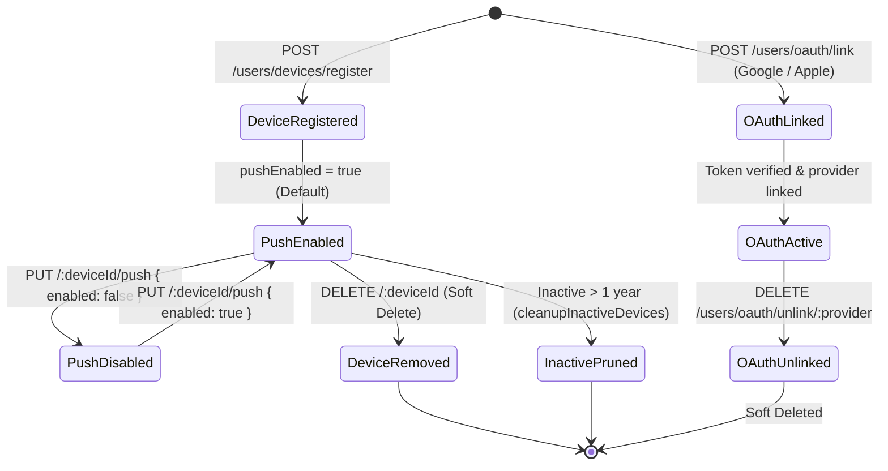

# User Management Feature Architecture & Invariants

## Purpose
The **User Management** feature manages customer and staff identity profiles, personalization preferences, mobile/web push device registrations, and third-party OAuth account linking across the multi-tenant commerce architecture. 

It organizes user account data into four modular sub-domains:
1. **Core User Entity (`User`)**: Fundamental identity properties (`name`, `email`, `role`, `phoneNumber`, `profileImageUrl`, `preferredTime`) with tiered Redis caching and sliding-window rate limiting.
2. **Extended User Profile (`UserProfile`)**: Personalization metadata, demographic attributes (`location`, `dob`, `gender`), notification styles, and verification certificate attachments.
3. **Push Notification Device Registry (`UserDevices`)**: Lifecycle management of Firebase Cloud Messaging (FCM) tokens across mobile and web devices (`deviceType`, `deviceName`, `pushEnabled`, `lastActive`), ownership-isolated settings, and automated inactive device pruning.
4. **OAuth Provider Accounts (`OAuthAccount`)**: Linking and unlinking third-party social identities (Google, Apple `sub` identifiers) to the unified user account.

---

## Component Architecture



---

## Component Source Map

| File | Primary Symbol | Role | Key Architectural Invariants & Responsibilities |
| :--- | :--- | :--- | :--- |
| [`user.module.ts`](file:///home/chillpc/MohammadSheakh/projects/26/e-commerce/e-com-nextjs/ferio-nest-prisma/src/features/user-management/user.module.ts) | `UserModule` | NestJS Feature Module | Bundles and exports `UserService`, `UserProfileService`, `UserDevicesService`, and `OAuthAccountService`. Integrates `RedisModule`, `PrismaModule`, `TenancyModule`, and `AuthModule`. |
| [`user.controller.ts`](file:///home/chillpc/MohammadSheakh/projects/26/e-commerce/e-com-nextjs/ferio-nest-prisma/src/features/user-management/user/user.controller.ts) | `UserController` | REST Controller | Manages core profile endpoints (`/users/profile`, `/users/preferred-time`, `/users/statistics`, `/users/me`). Enforces `SlidingWindowRateLimitGuard`. |
| [`user.service.ts`](file:///home/chillpc/MohammadSheakh/projects/26/e-commerce/e-com-nextjs/ferio-nest-prisma/src/features/user-management/user/user.service.ts) | `UserService` | Core Identity Service | Handles user retrieval by ID/email, nested profile updates, Redis caching (`USER_CACHE_CONFIG.PROFILE: 15m`), and cache invalidation. |
| [`user.constants.ts`](file:///home/chillpc/MohammadSheakh/projects/26/e-commerce/e-com-nextjs/ferio-nest-prisma/src/features/user-management/user/user.constants.ts) | `USER_CACHE_CONFIG`<br>`USER_RATE_LIMITS` | Configuration Constants | Defines cache TTLs (Profile: 900s, Stats: 300s), invalidation patterns, and sliding window rate limits (Profile Access: 60/min, Updates: 10/min). |
| [`userProfile.controller.ts`](file:///home/chillpc/MohammadSheakh/projects/26/e-commerce/e-com-nextjs/ferio-nest-prisma/src/features/user-management/userProfile/userProfile.controller.ts) | `UserProfileController` | REST Controller | Manages extended profile details (`/users/profile/details`, `/support-mode`, `/notification-style`, `/full`). |
| [`userProfile.service.ts`](file:///home/chillpc/MohammadSheakh/projects/26/e-commerce/e-com-nextjs/ferio-nest-prisma/src/features/user-management/userProfile/userProfile.service.ts) | `UserProfileService` | Profile Preferences Service | Manages extended demographic data, support modes, notification styles, and user profile cache invalidation. |
| [`userDevices.controller.ts`](file:///home/chillpc/MohammadSheakh/projects/26/e-commerce/e-com-nextjs/ferio-nest-prisma/src/features/user-management/userDevices/userDevices.controller.ts) | `UserDevicesController` | Device REST Controller | Handles FCM device token registration (`/users/devices/register`), device listing, deletion, and push notification toggles (`/:deviceId/push`). |
| [`userDevices.service.ts`](file:///home/chillpc/MohammadSheakh/projects/26/e-commerce/e-com-nextjs/ferio-nest-prisma/src/features/user-management/userDevices/userDevices.service.ts) | `UserDevicesService` | Push Device Registry | Upserts FCM tokens, updates active timestamps, enforces strict ownership on device mutations, and purges inactive devices (>1 year). |
| [`oauthAccount.controller.ts`](file:///home/chillpc/MohammadSheakh/projects/26/e-commerce/e-com-nextjs/ferio-nest-prisma/src/features/user-management/oauthAccount/oauthAccount.controller.ts) | `OAuthAccountController` | OAuth REST Controller | Manages linked third-party providers (`/users/oauth/accounts`) and unlinking endpoints (`/unlink/:provider`). |
| [`oauthAccount.service.ts`](file:///home/chillpc/MohammadSheakh/projects/26/e-commerce/e-com-nextjs/ferio-nest-prisma/src/features/user-management/oauthAccount/oauthAccount.service.ts) | `OAuthAccountService` | Social Identity Service | Links Google and Apple accounts to user IDs, tracks `lastUsedAt`, enforces provider uniqueness constraints, and performs soft-unlinking. |
| [`userDevices.service.spec.ts`](file:///home/chillpc/MohammadSheakh/projects/26/e-commerce/e-com-nextjs/ferio-nest-prisma/src/features/user-management/userDevices/tests/userDevices.service.spec.ts) | Unit Test Suite | Jest Test Suite | Validates device ownership isolation, preventing users from modifying push settings on foreign devices. |

---

## Responsibilities

### Owns
- **User Profile Management**: Retrieving and updating personal identity records (`name`, `phoneNumber`, `preferredTime`, avatar).
- **Personalization Preferences**: Managing demographic fields (`location`, `dob`, `gender`), `supportMode`, and `notificationStyle`.
- **FCM Push Device Registry**: Upserting device tokens, updating `lastActive` timestamps, filtering active devices for push dispatches, and purging inactive devices older than 1 year.
- **OAuth Provider Linking**: Associating Google and Apple OAuth identities with existing users, preventing duplicate provider attachments.
- **Tenant-Scoped Redis Caching**: Caching user profiles and statistics with tenant prefix isolation (`scopedRedisKey`) and cache invalidation on mutations.

### Does Not Own
- **Credential Verification & JWT Issuance**: Validating passwords, issuing access/refresh tokens, and handling OAuth token exchange handshakes (owned by [`AuthModule`](file:///home/chillpc/MohammadSheakh/projects/26/e-commerce/e-com-nextjs/ferio-nest-prisma/src/features/authentication/auth.module.ts)).
- **Staff Roles & Permission Matrix**: Assigning staff permissions and enforcing SaaS seat quotas (owned by [`StaffAccessModule`](file:///home/chillpc/MohammadSheakh/projects/26/e-commerce/e-com-nextjs/ferio-nest-prisma/src/features/staff-access/staff-access.module.ts)).
- **Push Notification Dispatch**: Delivering push messages via Firebase Admin SDK (owned by [`CustomerNotificationsModule`](file:///home/chillpc/MohammadSheakh/projects/26/e-commerce/e-com-nextjs/ferio-nest-prisma/src/features/customer-notifications/customer-notifications.module.ts)).
- **Customer CRM & Delivery Address Book**: Managing customer shipping addresses and purchase activity (owned by `customers` and `customer-account`).

---

## Dependencies

### Consumes
- [`PrismaService`](file:///home/chillpc/MohammadSheakh/projects/26/e-commerce/e-com-nextjs/ferio-nest-prisma/libs/database/src/prisma.service.ts) & [`TenantDbService`](file:///home/chillpc/MohammadSheakh/projects/26/e-commerce/e-com-nextjs/ferio-nest-prisma/src/tenancy/services/tenant-db.service.ts): Dynamic database resolution targeting dedicated tenant schemas (`MT-7`).
- [`RedisService`](file:///home/chillpc/MohammadSheakh/projects/26/e-commerce/e-com-nextjs/ferio-nest-prisma/libs/redis/src/redis.service.ts): High-performance profile and statistics caching.
- [`AuthGuard`](file:///home/chillpc/MohammadSheakh/projects/26/e-commerce/e-com-nextjs/ferio-nest-prisma/libs/common/src/guards/auth.guard.ts): Extracts and verifies authenticated user payload (`UserPayload`).
- [`SlidingWindowRateLimitGuard`](file:///home/chillpc/MohammadSheakh/projects/26/e-commerce/e-com-nextjs/ferio-nest-prisma/libs/common/src/guards/sliding-window-rate-limit.guard.ts): Protects profile endpoints against abuse.

### External Services
- Redis (via `@app/redis` client).
- PostgreSQL (via Prisma ORM).

### Emitters
- Redis Cache Invalidation: `user:${id}`, `user:stats:${id}`, `user:profile:${id}`.

---

## Database Ownership

### Direct Writes / Mutates

| Table | Operation | Trigger / Context | Fields Modified |
| :--- | :--- | :--- | :--- |
| `User` | `update` | `updateProfile()` | `name`, `phoneNumber`, nested upsert on `ownedProfile` |
| `User` | `update` | `updatePreferredTime()` | `preferredTime` |
| `UserProfile` | `update` | `updateByUserId()` | Any fields in `UserProfileUpdateInput` (`location`, `dob`, `gender`, `supportMode`, etc.) |
| `UserProfile` | `update` | `updateSupportMode()` | `supportMode` |
| `UserProfile` | `update` | `updateNotificationStyle()` | `notificationStyle` |
| `UserDevices` | `create` / `update` | `registerOrUpdateDevice()` | `fcmToken`, `deviceType`, `deviceName`, `lastActive` |
| `UserDevices` | `update` | `removeDevice()`, `removeDeviceByToken()` | `isDeleted = true` |
| `UserDevices` | `update` | `updatePushEnabled()` | `pushEnabled` |
| `UserDevices` | `updateMany` | `cleanupInactiveDevices()` | `isDeleted = true` (where `lastActive < now() - 1 year`) |
| `OAuthAccount` | `create` | `createOrLinkOAuthAccount()`, `linkOAuthAccount()` | `userId`, `authProvider`, `providerId`, `email`, `accessToken`, `refreshToken`, `idToken`, `isVerified`, `lastUsedAt` |
| `OAuthAccount` | `update` | `updateLastUsed()` | `lastUsedAt = now()` |
| `OAuthAccount` | `updateMany` | `unlinkOAuthAccount()` | `isDeleted = true` |

### Reads / References

| Table | Query Method | Purpose |
| :--- | :--- | :--- |
| `User` | `findUnique`, `findFirst` | Fetches user identity (with or without password) by ID or email (`isDeleted: false`). |
| `User` | `count` | Counts child accounts (`accountCreatorId = userId`) for statistics. |
| `UserProfile` | `findFirst` | Fetches user profile preferences; joins `user` in `getProfileWithUser`. |
| `UserDevices` | `findMany`, `findFirst` | Lists user devices; retrieves active devices (`pushEnabled: true, isDeleted: false`) for push dispatches. |
| `OAuthAccount` | `findFirst`, `findMany` | Checks existing OAuth provider links; validates uniqueness before linking. |

---

## Important Invariants

1. **Strict Device Ownership Isolation**:
   - Device mutations (`removeDevice`, `updatePushEnabled`, `removeDeviceByToken`) MUST explicitly filter by `userId`:
     ```typescript
     where: { id: deviceId, userId, isDeleted: false }
     ```
   - An authenticated user cannot toggle push notification preferences or delete a device belonging to another customer.
2. **Global OAuth Account Uniqueness (`@@unique([authProvider, providerId])`)**:
   - An external provider identity (e.g. Google `sub` `1029384756`) can only be linked to a single user account across the tenant database.
   - Attempting to link an already linked OAuth identity throws `ConflictException` (`409 Conflict`).
3. **Single Provider Instance Per User**:
   - A user can only link one account per OAuth provider (e.g., maximum of one Google account and one Apple account). Linking a second Google account throws `ConflictException`.
4. **Tenant-Scoped Redis Cache Isolation**:
   - All Redis keys for user profiles and statistics are constructed using `scopedRedisKey(USER_CACHE_CONFIG.PREFIX, ...)`:
     - Profile: `user:{userId}` (TTL: 900 seconds / 15 minutes)
     - Statistics: `user:stats:{userId}` (TTL: 300 seconds / 5 minutes)
   - Cache keys inherit the tenant's namespace prefix to prevent cross-tenant key contamination in shared Redis environments.
5. **Atomic Cache Invalidation on Mutation**:
   - Any mutation to user identity (`updateProfile`, `updatePreferredTime`) or extended preferences (`updateByUserId`) triggers an immediate cache invalidation across all associated keys (`user:${id}`, `user:stats:${id}`).
6. **Soft-Delete Preservation**:
   - `User`, `UserProfile`, `UserDevices`, and `OAuthAccount` employ soft-deletion (`isDeleted: true`).
   - Every lookup method explicitly filters `{ isDeleted: false }` to prevent accessing deleted identity state.

---

## Public API & Entry Points

All user management endpoints require authentication via `AuthGuard`:

| Endpoint | Method | Rate Limit Preset | Description | Payload / Parameters | Success Response | Errors |
| :--- | :--- | :--- | :--- | :--- | :--- | :--- |
| `/users/profile` | `GET` | `PROFILE_ACCESS`<br>(60/min) | Get current user profile and statistics | None | `PublicUser & { statistics }` | `401 Unauthorized`<br>`404 NotFound` |
| `/users/profile` | `PUT` | `PROFILE_UPDATE`<br>(10/min) | Update user profile and nested profile data | Body: `UpdateProfileDto`<br>• `name?`, `phoneNumber?`, etc. | `PublicUser` | `400 BadRequest`<br>`401 Unauthorized` |
| `/users/preferred-time` | `PUT` | `PROFILE_UPDATE`<br>(10/min) | Update preferred notification/scheduling time | Body: `{ preferredTime: string }` | `PublicUser` | `401 Unauthorized` |
| `/users/statistics` | `GET` | `PROFILE_ACCESS`<br>(60/min) | Get user task statistics | None | `{ totalChildren: number }` | `401 Unauthorized` |
| `/users/me` | `GET` | `PROFILE_ACCESS`<br>(60/min) | Alias for current user profile | None | `PublicUser` | `401 Unauthorized` |
| `/users/profile/details` | `GET` | None | Get extended profile details | None | `UserProfile` | `401 Unauthorized`<br>`404 NotFound` |
| `/users/profile/details` | `PUT` | None | Update extended profile details | Body: `UpdateUserProfileDto`<br>• `location?`, `dob?`, `gender?` | `UserProfile` | `401 Unauthorized`<br>`404 NotFound` |
| `/users/profile/support-mode` | `PUT` | None | Update support mode preference | Body: `{ supportMode: string }` | `UserProfile` | `401 Unauthorized` |
| `/users/profile/notification-style` | `PUT` | None | Update notification style preference | Body: `{ notificationStyle: string }` | `UserProfile` | `401 Unauthorized` |
| `/users/profile/full` | `GET` | None | Get profile with joined user details | None | `UserProfile & { user: UserSummary }` | `401 Unauthorized`<br>`404 NotFound` |
| `/users/devices/register` | `POST` | None | Register or update FCM device token | Body: `RegisterDeviceDto`<br>• `fcmToken`, `deviceType`, `deviceName?` | `UserDevices` | `400 BadRequest`<br>`401 Unauthorized` |
| `/users/devices` | `GET` | None | List all registered devices for user | None | `UserDevices[]` | `401 Unauthorized` |
| `/users/devices/:deviceId` | `DELETE` | None | Soft-delete a registered device | Param: `deviceId` | `UserDevices` | `401 Unauthorized`<br>`404 NotFound` |
| `/users/devices/:deviceId/push` | `PUT` | None | Enable/disable push notifications on device | Param: `deviceId`<br>Body: `{ enabled: boolean }` | `UserDevices` | `401 Unauthorized`<br>`404 NotFound` |
| `/users/devices/remove-by-token` | `POST` | None | Remove device using FCM token string | Body: `{ fcmToken: string }` | `{ message: string }` | `401 Unauthorized` |
| `/users/oauth/accounts` | `GET` | None | Summary of linked OAuth providers | None | `{ google: boolean, apple: boolean }` | `401 Unauthorized` |
| `/users/oauth/accounts/list` | `GET` | None | Full list of linked OAuth account records | None | `OAuthAccount[]` | `401 Unauthorized` |
| `/users/oauth/unlink/:provider` | `DELETE` | None | Unlink OAuth provider from user account | Param: `provider` (`google` \| `apple`) | `{ message: string }` | `401 Unauthorized`<br>`404 NotFound` |

---

## Important Flows

### 1. User Profile Retrieval with Redis Pattern Caching



### 2. Device Registration & Ownership-Protected Push Toggle



### 3. User Device & OAuth Account Lifecycle



---

## Brutal Honest Vulnerabilities & Architectural Debt

### 1. Plaintext OAuth Tokens Stored in Database (High Security Vulnerability)
- **The Gap**: In `OAuthAccountService.createOrLinkOAuthAccount()`, third-party tokens are written directly to PostgreSQL:
  ```typescript
  return db.oAuthAccount.create({
    data: { userId, authProvider, providerId, email, accessToken, refreshToken, idToken, ... }
  });
  ```
- **Attack Vector**: `accessToken`, `refreshToken`, and `idToken` are stored in plaintext strings without column-level encryption. If the PostgreSQL database or a backup snapshot is leaked, attackers gain access to long-lived OAuth refresh tokens for customer Google and Apple accounts.
- **Remediation**: Encrypt `refreshToken` and `accessToken` at rest using `encryptMessagingCredentials` (AES-256-GCM) with `PLATFORM_DB_CREDENTIAL_KEY` before storing in the database.

### 2. Accidental Account Lockout on OAuth Unlink (High Severity)
- **The Gap**: In `OAuthAccountService.unlinkOAuthAccount()` (lines 144–159), there is no verification that the user has an alternative login method:
  ```typescript
  await this.oauthAccountService.unlinkOAuthAccount(user.userId, authProvider);
  ```
- **Impact**: If a customer registered exclusively via Google OAuth and never created a local password (`user.password === null`), unlinking their Google account leaves them with no password, no 2FA, and no linked provider. Upon logging out, they are permanently locked out of their account and purchase history.
- **Remediation**: Before unlinking, query the `User` model; if `user.password === null` and no other active OAuth account exists, reject the request with `BadRequestException("Cannot unlink the only login method. Set a password first.")`.

### 3. Cache Inconsistency Between `UserService` and `UserProfileService` (Medium Severity)
- **The Gap**: `UserService.updateProfile()` updates both `User` and `ownedProfile` in a nested transaction and invalidates `user:${id}`. However, `UserProfileService.findByUserIdWithCache()` uses a completely separate cache key: `user:profile:${id}`:
  ```typescript
  // UserProfileService:
  scopedRedisKey(USER_CACHE_CONFIG.PREFIX, 'profile', userId);
  ```
- **Impact**: Updating user details through `/users/profile` leaves the `/users/profile/details` endpoint serving stale cached profile data for up to 15 minutes because `UserService` does not invalidate `user:profile:${userId}`.
- **Remediation**: Unify profile caching under a single canonical cache key or include `user:profile:${id}` in `USER_CACHE_CONFIG.INVALIDATION_PATTERNS.PROFILE_UPDATED`.

### 4. Legacy Task App Artifacts Polluting Commerce Models (Low / Architectural Debt)
- **The Gap**: Fields such as `preferredTime` in `User`, and statistics logic counting `accountCreatorId` in `getUserStatistics`:
  ```typescript
  const totalChildren = await db.user.count({ where: { accountCreatorId: userId } });
  ```
- **Architectural Debt**: These methods and schema fields are legacy code inherited from an earlier family task management application. They serve no functional purpose in an e-commerce platform, bloating API surfaces, OpenAPI documentation, and Redis cache memory.
- **Remediation**: Deprecate `/users/preferred-time` and replace `/users/statistics` with commerce-specific metrics (e.g. `totalOrders`, `activeReturns`, `walletBalance`).

### 5. Stale Device Token Leaks on Phone Resale (Low Severity)
- **The Gap**: In `UserDevicesService.registerOrUpdateDevice()`:
  ```typescript
  const existingDevice = await db.userDevices.findFirst({
    where: { fcmToken, userId, isDeleted: false },
  });
  ```
- **Impact**: If a device is sold or transferred without factory reset, the same `fcmToken` could exist under the previous owner's `userId`. If the old registration is not marked deleted, push notifications directed to the previous user may continue to deliver to the physical device.
- **Remediation**: When registering an `fcmToken`, update any existing records with the same token belonging to *other* user IDs to `isDeleted = true`.
