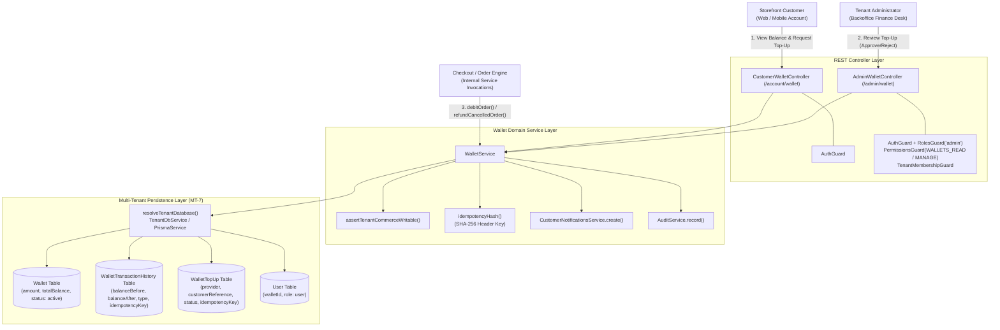
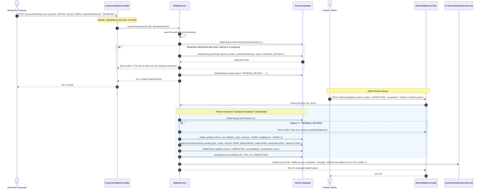
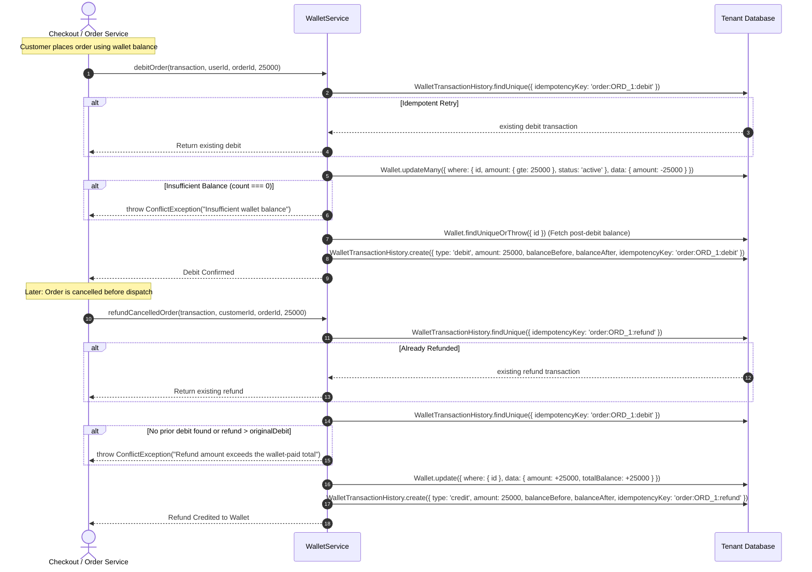
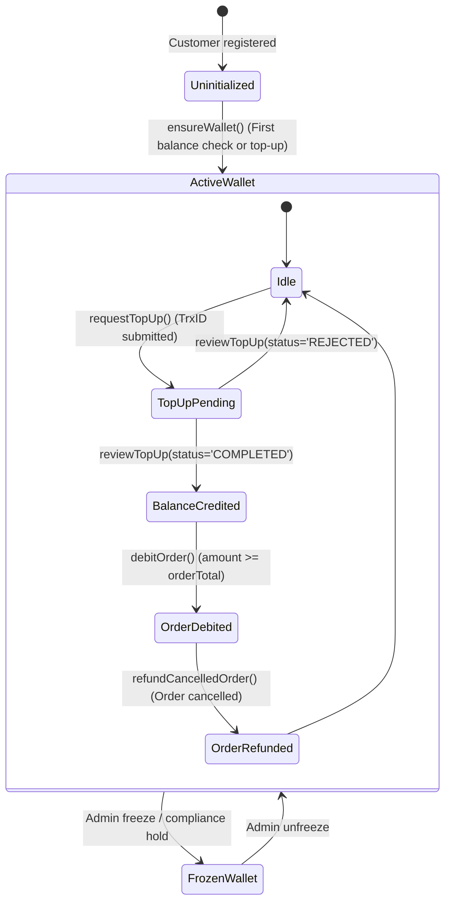

# Wallet Feature Architecture & Invariants

## Purpose
The **Wallet** feature provides a stored-value closed-loop digital wallet and financial ledger subsystem for customers across the multi-tenant commerce platform. It enables customer account funding via manual Mobile Financial Services (bKash, Nagad, Rocket) and Bank Transfers, instantaneous checkout balance debits, and automated order cancellation refunds.

Key capabilities:
1. **Immutable Double-Entry Financial Ledger**: Guarantees auditability by recording `balanceBefore` and `balanceAfter` on every balance mutation (`WalletTransactionHistory`).
2. **Integer Currency Precision**: Represents all balances in lowest integer currency units (poisha/cents, e.g. 100 poisha = 1 BDT), eliminating IEEE 754 floating-point rounding errors.
3. **Atomic Concurrency Controls & Overdraft Defense**: Uses atomic conditional updates (`amount: { gte: debit }`) to guarantee that wallets can never enter a negative balance under high concurrency.
4. **Strict Idempotency Across Lifecycle Operations**: SHA-256 hashed idempotency keys for top-up submissions, order debits (`order:${orderId}:debit`), and order refunds (`order:${orderId}:refund`).
5. **Fail-Closed Order Cancellation Refunds**: Restricts refund credits strictly to prior wallet debits recorded for the same order, blocking synthetic credit generation.
6. **Serializable Administrative Review**: Top-up approval executes under Prisma `Serializable` isolation level, triggering automated customer push/in-app notifications upon completion.

---

## Component Architecture



---

## Component Source Map

| File | Primary Symbol | Role | Key Architectural Invariants & Responsibilities |
| :--- | :--- | :--- | :--- |
| [`wallet.module.ts`](file:///home/chillpc/MohammadSheakh/projects/26/e-commerce/e-com-nextjs/ferio-nest-prisma/src/features/wallet/wallet.module.ts) | `WalletModule` | NestJS Feature Module | Bundles and exports `WalletService`. Imports `TenancyModule`, `PrismaModule`, `AuthModule`, `AuditModule`, and `CustomerNotificationsModule`. Registers customer and admin controllers. |
| [`wallet.controller.ts`](file:///home/chillpc/MohammadSheakh/projects/26/e-commerce/e-com-nextjs/ferio-nest-prisma/src/features/wallet/wallet.controller.ts) | `CustomerWalletController` | Customer REST Controller | Exposes `/account/wallet` for summary and paginated ledger history; `/account/wallet/top-ups` for submitting manual top-up requests with idempotency headers. |
| [`wallet.controller.ts`](file:///home/chillpc/MohammadSheakh/projects/26/e-commerce/e-com-nextjs/ferio-nest-prisma/src/features/wallet/wallet.controller.ts) | `AdminWalletController` | Admin REST Controller | Protected by `AuthGuard`, `RolesGuard('admin')`, `PermissionsGuard`, and `TenantMembershipGuard`. Handles `/admin/wallet/top-ups` review queue. |
| [`wallet.dto.ts`](file:///home/chillpc/MohammadSheakh/projects/26/e-commerce/e-com-nextjs/ferio-nest-prisma/src/features/wallet/dto/wallet.dto.ts) | `CreateWalletTopUpDto`<br>`ReviewWalletTopUpDto`<br>`WalletTopUpQueryDto` | Validation DTOs | Enforces integer amount bounds ($10.00 \dots 100,000.00$ BDT in poisha: $1,000 \dots 10,000,000$), allowed MFS providers (`BKASH`, `NAGAD`, `ROCKET`, `BANK_TRANSFER`), and review notes. |
| [`wallet.service.ts`](file:///home/chillpc/MohammadSheakh/projects/26/e-commerce/e-com-nextjs/ferio-nest-prisma/src/features/wallet/wallet.service.ts) | `WalletService` | Domain Core Service | Orchestrates wallet provisioning, top-up requests, `Serializable` review transactions, atomic conditional balance debits, immutable ledger auditing, and bounded cancellation refunds. |
| [`wallet.prisma`](file:///home/chillpc/MohammadSheakh/projects/26/e-commerce/e-com-nextjs/ferio-nest-prisma/prisma/schema/wallet.module/wallet.prisma) | `Wallet`<br>`TWalletStatus` | Prisma Model & Enum | Stores wallet balance (`amount`), historical total credited (`totalBalance`), currency (`bdt`), and status (`active`, `frozen`, `suspended`). |
| [`walletTopUp.prisma`](file:///home/chillpc/MohammadSheakh/projects/26/e-commerce/e-com-nextjs/ferio-nest-prisma/prisma/schema/wallet.module/walletTopUp.prisma) | `WalletTopUp`<br>`WalletTopUpStatus` | Prisma Model & Enum | Tracks top-up lifecycle states (`PENDING_REVIEW`, `COMPLETED`, `REJECTED`, `CANCELLED`), external customer reference, and SHA-256 idempotency key. |
| [`walletTransactionHistory.prisma`](file:///home/chillpc/MohammadSheakh/projects/26/e-commerce/e-com-nextjs/ferio-nest-prisma/prisma/schema/wallet.module/walletTransactionHistory.prisma) | `WalletTransactionHistory`<br>`TTransactionFor` | Prisma Model & Enum | Immutable financial ledger recording every debit and credit with `balanceBefore` and `balanceAfter`. Polymorphic references to orders and top-ups. |
| [`wallet.service.spec.ts`](file:///home/chillpc/MohammadSheakh/projects/26/e-commerce/e-com-nextjs/ferio-nest-prisma/src/features/wallet/tests/wallet.service.spec.ts) | Unit Test Suite | Jest Test Suite | Tests idempotent debit retries, insufficient balance rejections, atomic compare-and-swap balance decrements, and top-up approval notifications. |
| [`wallet.tenant-isolation.spec.ts`](file:///home/chillpc/MohammadSheakh/projects/26/e-commerce/e-com-nextjs/ferio-nest-prisma/src/features/wallet/tests/wallet.tenant-isolation.spec.ts) | Isolation Test Suite | Jest Test Suite | Validates multi-tenant isolation, ensuring identical customer IDs across tenants resolve strictly to their own tenant's wallet and ledger records. |

---

## Responsibilities

### Owns
- **Customer Wallet Provisioning**: On-demand initialization of customer wallets (`amount: 0, status: 'active'`) linked to verified customer accounts (`role: 'user'`).
- **Manual Top-Up Request Intake**: Ingesting customer payment references, validating minimum/maximum limits, and blocking duplicate active references.
- **Top-Up Review & Credit Execution**: Administrative approval/rejection under `Serializable` transaction isolation, atomically incrementing balances and notifying customers.
- **Order Checkout Debits**: Atomically checking and deducting wallet balances during checkout (`amount: { gte: amount }`) and creating immutable debit ledger entries.
- **Order Cancellation Refunds**: Credit back order funds to customer wallets strictly bounded by the recorded debit amount (`amount <= originalDebit.amount`).
- **Ledger Invariants & History**: Writing audit-compliant ledger entries with guaranteed mathematical continuity:
  $$\text{balanceAfter} = \text{balanceBefore} \pm \text{amount}$$

### Does Not Own
- **Automated Payment Gateway Webhooks**: Direct API integrations with bKash/Nagad merchant webhooks (owned by `commerce-payments`).
- **Checkout Cart & Tax Calculations**: Order totals, discount vouchers, and line item sums (owned by `checkout`).
- **Order State Progression**: Managing order delivery, cancellation, or fulfillment transitions (owned by `order`).
- **Customer Identity Verification**: Managing customer passwords, JWTs, or 2FA (owned by `authentication`).

---

## Dependencies

### Consumes
- [`PrismaService`](file:///home/chillpc/MohammadSheakh/projects/26/e-commerce/e-com-nextjs/ferio-nest-prisma/libs/database/src/prisma.service.ts) & [`TenantDbService`](file:///home/chillpc/MohammadSheakh/projects/26/e-commerce/e-com-nextjs/ferio-nest-prisma/src/tenancy/services/tenant-db.service.ts): Dynamic database resolution targeting dedicated tenant schemas (`MT-7`).
- [`CustomerNotificationsService`](file:///home/chillpc/MohammadSheakh/projects/26/e-commerce/e-com-nextjs/ferio-nest-prisma/src/features/customer-notifications/customer-notifications.service.ts): Dispatches in-app and push notifications when a top-up is approved or rejected.
- [`AuditService`](file:///home/chillpc/MohammadSheakh/projects/26/e-commerce/e-com-nextjs/ferio-nest-prisma/src/features/audit/services/audit.service.ts): Records administrative top-up review actions.
- [`assertTenantCommerceWritable`](file:///home/chillpc/MohammadSheakh/projects/26/e-commerce/e-com-nextjs/ferio-nest-prisma/src/tenancy/utils/commerce-write-guard.util.ts): Blocks wallet top-up requests if the tenant subscription is suspended or read-only.
- [`TenantMembershipGuard`](file:///home/chillpc/MohammadSheakh/projects/26/e-commerce/e-com-nextjs/ferio-nest-prisma/src/tenancy/guards/tenant-membership.guard.ts): Verifies administrative membership within the target tenant organization.

### External Services
- `node:crypto`: `createHash('sha256')` for idempotency key hashing.
- PostgreSQL (via Prisma ORM Client).

### Emitters
- Customer In-App Notification: `CustomerNotificationsService.create({ type: 'wallet', deduplicationKey: ... })`.
- Audit Events:
  - `WALLET_TOP_UP_COMPLETED`: Emitted when an admin approves a top-up.
  - `WALLET_TOP_UP_REJECTED`: Emitted when an admin rejects a top-up.

---

## Database Ownership

### Direct Writes / Mutates

| Table | Operation | Trigger / Context | Fields Modified |
| :--- | :--- | :--- | :--- |
| `Wallet` | `create` | `ensureWallet()` (First customer access) | `amount = 0`, `totalBalance = 0`, `currency = 'bdt'`, `status = 'active'`, `isDeleted = false` |
| `Wallet` | `update` | `reviewTopUp()` (Approval) | `amount += topUp.amount`, `totalBalance += topUp.amount` |
| `Wallet` | `updateMany` | `debitOrder()` | `amount -= debitAmount` (conditioned on `amount >= debitAmount`) |
| `Wallet` | `update` | `refundCancelledOrder()` | `amount += refundAmount`, `totalBalance += refundAmount` |
| `User` | `update` | `ensureWallet()` | `walletId = createdWallet.id` |
| `WalletTopUp` | `create` | `requestTopUp()` | `userId`, `walletId`, `provider`, `amount`, `customerReference`, `customerNote`, `idempotencyKey` |
| `WalletTopUp` | `update` | `reviewTopUp()` | `status` (`COMPLETED` \| `REJECTED`), `reviewNote`, `reviewedById`, `reviewedAt`, `completedAt` |
| `WalletTransactionHistory` | `create` | Top-Up Credit / Order Debit / Order Refund | `userId`, `walletId`, `topUpId`, `orderId`, `idempotencyKey`, `type`, `amount`, `currency`, `balanceBefore`, `balanceAfter`, `description`, `status`, `referenceFor` |

### Reads / References

| Table | Query Method | Purpose |
| :--- | :--- | :--- |
| `User` | `findUnique` | Validates customer account eligibility (`role === 'user'`, `isDeleted === false`). |
| `Wallet` | `findUnique` | Retrieves wallet metadata and active balance. |
| `WalletTopUp` | `findUnique` | Validates top-up status before review; checks idempotency on creation. |
| `WalletTopUp` | `findFirst` | Blocks duplicate submissions with the same `customerReference` and `provider`. |
| `WalletTransactionHistory` | `findUnique` | Checks idempotency keys (`order:${orderId}:debit`, `order:${orderId}:refund`) to prevent double-spending or over-refunding. |

---

## Important Invariants

1. **Integer Precision & Lowest Currency Units**:
   - All monetary amounts in the wallet subsystem (`Wallet.amount`, `Wallet.totalBalance`, `WalletTopUp.amount`, `WalletTransactionHistory.amount`) are strictly stored as integers in lowest currency units (poisha).
   - $1.00\text{ BDT} = 100\text{ poisha}$. Floating-point types are prohibited to prevent cumulative financial rounding errors.
2. **Atomic Compare-and-Swap Debit (Overdraft Prohibition)**:
   - In `debitOrder()`, balance deduction executes via conditional update:
     ```typescript
     const changed = await transaction.wallet.updateMany({
       where: { id: wallet.id, amount: { gte: amount }, status: 'active' },
       data: { amount: { decrement: amount } }
     });
     if (!changed.count) throw new ConflictException('Insufficient wallet balance');
     ```
   - If concurrent requests attempt to spend the same balance, exactly one update succeeds; the second receives `count === 0` and is rejected with `409 Conflict`. Wallets can **never** enter negative balance.
3. **Exact Mathematical Ledger Continuity**:
   - Every `WalletTransactionHistory` record requires:
     $$\text{balanceAfter} = \text{balanceBefore} + \text{amount}\quad (\text{for 'credit'})$$
     $$\text{balanceAfter} = \text{balanceBefore} - \text{amount}\quad (\text{for 'debit'})$$
   - In `reviewTopUp()`, `balanceBefore` is calculated directly from the post-update database return (`updatedWallet.amount - topUp.amount`), guaranteeing continuity even under high-frequency top-up credits.
4. **Strict Idempotency Across Financial Operations**:
   - Top-up creation: Validates SHA-256 hash of client-supplied `idempotency-key` header ($\ge 16$ characters).
   - Order payment: Guarded by unique constraint on `idempotencyKey = 'order:${orderId}:debit'`.
   - Order refund: Guarded by unique constraint on `idempotencyKey = 'order:${orderId}:refund'`.
5. **Fail-Closed Order Cancellation Refund Guarantee**:
   - Refunding an order checks the original debit entry `idempotencyKey: 'order:${orderId}:debit'`.
   - If no prior debit exists, or if the requested refund exceeds the original wallet payment (`amount > originalDebit.amount`), the operation throws `ConflictException` and aborts.
6. **Customer Account Role Exclusivity**:
   - Only accounts with `role: 'user'` are permitted to own a wallet (`ensureWallet`).
   - Staff, riders, and administrative users cannot create wallets, preventing mixing backoffice accounts with stored customer balances.
7. **Multi-Tenant Partitioning (MT-7)**:
   - All database queries pass through `resolveTenantDatabase(this.tenantDb, this.prisma, 'wallet-service')`. Identical user IDs across separate tenants maintain completely segregated wallets and balances.

---

## Public API & Entry Points

| Endpoint | Method | Auth / Guards | Permissions | Payload / Parameters | Success Response | Errors |
| :--- | :--- | :--- | :--- | :--- | :--- | :--- |
| `/account/wallet` | `GET` | `AuthGuard` | None (Customer) | Query: `page?`, `limit?` | `{ wallet, transactions, topUps, pagination }` | `401 Unauthorized`<br>`404 NotFound` |
| `/account/wallet/top-ups` | `POST` | `AuthGuard` | None (Customer) | Header: `idempotency-key` ($\ge 16$ chars)<br>Body: `CreateWalletTopUpDto`<br>• `provider`: BKASH \| NAGAD \| etc.<br>• `amount`: int ($1,000 \dots 10,000,000$ poisha)<br>• `customerReference`: string<br>• `customerNote?`: string | `WalletTopUp` (status: `PENDING_REVIEW`) | `400 BadRequest`<br>`401 Unauthorized`<br>`409 Conflict` (Duplicate TrxID) |
| `/admin/wallet/top-ups` | `GET` | `AuthGuard`<br>`RolesGuard('admin')`<br>`PermissionsGuard`<br>`TenantMembershipGuard` | `wallets.read` | Query: `WalletTopUpQueryDto`<br>• `page?`, `limit?`, `status?`, `search?` | `{ items: WalletTopUp[], total, totalPages, pagination }` | `401 Unauthorized`<br>`403 Forbidden` |
| `/admin/wallet/top-ups/:id` | `PATCH` | `AuthGuard`<br>`RolesGuard('admin')`<br>`PermissionsGuard`<br>`TenantMembershipGuard` | `wallets.manage` | Param: `id`<br>Body: `ReviewWalletTopUpDto`<br>• `status`: 'COMPLETED' \| 'REJECTED'<br>• `reviewNote`: string ($\ge 3$ chars) | `WalletTopUp` (updated status) | `400 BadRequest`<br>`404 NotFound`<br>`409 Conflict` (Already reviewed) |

---

## Important Flows

### 1. Manual Top-Up Request & Admin Approval Flow



### 2. Order Checkout Debit & Cancellation Refund Flow



### 3. Wallet State & Transaction History Progression



---

## Brutal Honest Vulnerabilities & Architectural Debt

### 1. Manual Top-Up Vulnerable to Human Verification Error (High Operational Risk)
- **The Gap**: Top-up approval (`reviewTopUp`) relies entirely on manual human verification by administrative staff without automated MFS statement API cross-referencing.
- **Risk**: A malicious or bribed staff member can approve fabricated transaction references (or a customer can submit photoshopped SMS screenshots). Once approved, synthetic currency is instantly created in the wallet and spent on high-value physical goods before the finance department discovers the discrepancy during monthly bank reconciliation.
- **Remediation**: Integrate automated statement verification webhooks with bKash and Nagad B2B merchant APIs to automatically validate transaction IDs and amounts before wallet balances are credited.

### 2. Missing Administrative Balance Clawback / Correction Endpoint (Medium Severity)
- **The Gap**: If an administrator mistakenly approves an erroneous top-up (e.g. entering 50,000 BDT instead of 5,000 BDT), there is no administrative debit endpoint (`adminClawback` / `adjustBalance`) to retract the funds.
- **Impact**: The operator must execute direct, un-audited database SQL queries to correct the customer's balance, violating immutable ledger invariants.
- **Remediation**: Introduce an audited administrative adjustment mechanism (`referenceFor: 'AdminAdjustment'`) that records a ledger entry explaining the debit or credit correction with required supervisor dual-authorization.

### 3. Missing Account-Level Wallet Freezing Endpoint (Medium Severity)
- **The Gap**: While `Wallet.status` supports `frozen` and `suspended` in the Prisma schema, `AdminWalletController` provides no API endpoints to toggle a wallet's status.
- **Impact**: If fraud or suspicious activity is detected on a customer account, administrators cannot programmatically freeze the wallet to prevent ongoing order purchases.
- **Remediation**: Add `PATCH /admin/wallet/:walletId/status` with `TWalletStatus` validation guarded by `wallets.manage`.

### 4. Client-Mandated Idempotency Key Formatting Burden (Low Severity)
- **The Gap**: `requestTopUp` requires an HTTP header `idempotency-key` between 16 and 200 characters:
  ```typescript
  if (!value || value.length < 16 || value.length > 200) {
    throw new BadRequestException('A valid idempotency key is required');
  }
  ```
- **Operational Friction**: If a mobile app or frontend developer fails to generate a high-entropy UUID string and passes a simple string like `"12345"`, the API returns a 400 error.
- **Remediation**: If `idempotency-key` is omitted, auto-generate a fallback deterministic hash based on `userId + provider + customerReference + amount`.

### 5. Absence of Wallet Expiration or Inactivity Policy (Low Severity)
- **The Gap**: Balances remain stored indefinitely with no inactivity fee, expiration timeline, or unclaimed property escheatment process.
- **Impact**: Abandoned wallets with small balances (e.g. 15 BDT remaining from a refund) sit in the database indefinitely, cluttering financial balance sheets.
- **Remediation**: Define an explicit terms of service policy for inactive wallet balances older than 24 months.
