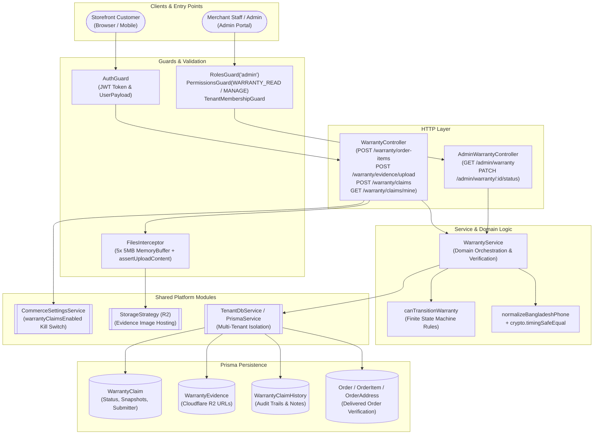
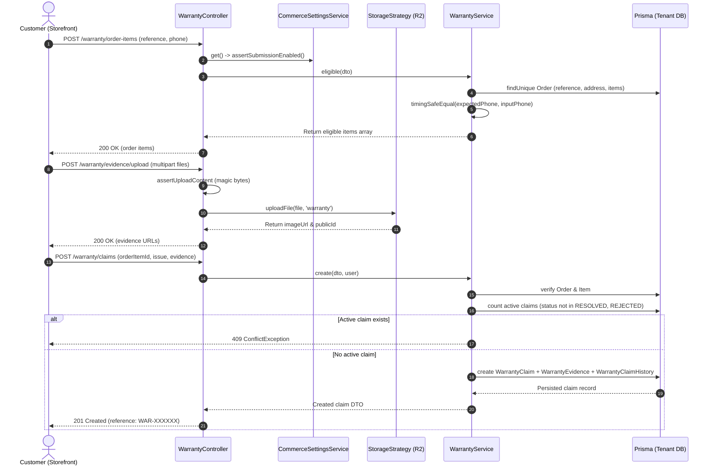
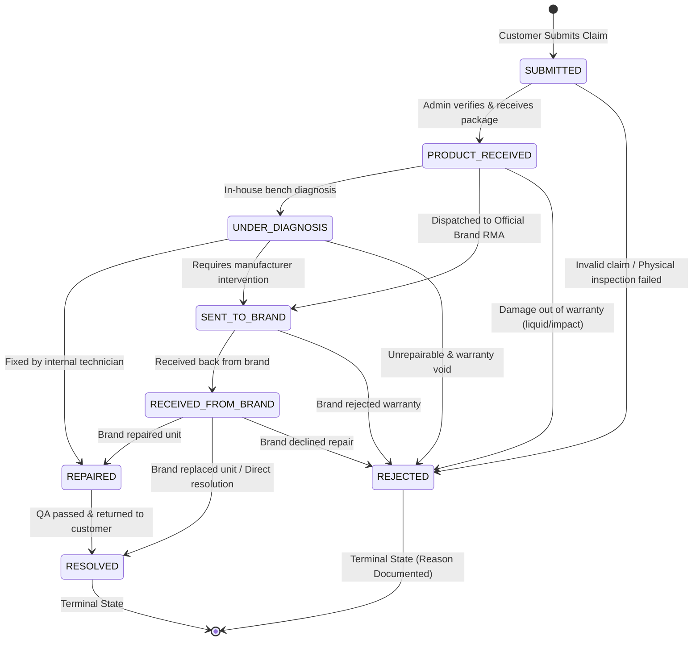

# Warranty Feature Architecture & Invariants

## Purpose
The **Warranty** feature governs the post-purchase product guarantee lifecycle. It provides secure, timing-attack-resistant order verification, photographic evidence ingestion, customer claim registration, and an auditable finite state machine (FSM) that tracks claims through item reception, internal diagnostics, external brand repair centers (RMA), resolution, or documented rejection.

---

## Component Architecture



---

### Component Source Map

| Component | Layer / Role | Relative Source Path | Invariants & Primary Responsibilities |
| :--- | :--- | :--- | :--- |
| `WarrantyModule` | NestJS Module | [`./warranty.module.ts`](file:///home/chillpc/MohammadSheakh/projects/26/e-commerce/e-com-nextjs/ferio-nest-prisma/src/features/warranty/warranty.module.ts) | Wires controllers, `WarrantyService`, `SettingsModule`, `StorageModule`, and database providers. |
| `WarrantyController` | HTTP Controller (Public/Customer) | [`./warranty.controller.ts`](file:///home/chillpc/MohammadSheakh/projects/26/e-commerce/e-com-nextjs/ferio-nest-prisma/src/features/warranty/warranty.controller.ts#L40-L102) | Handles order item verification, multipart image evidence upload, claim creation, and customer history retrieval. Enforces global kill switch. |
| `AdminWarrantyController` | HTTP Controller (Admin) | [`./warranty.controller.ts`](file:///home/chillpc/MohammadSheakh/projects/26/e-commerce/e-com-nextjs/ferio-nest-prisma/src/features/warranty/warranty.controller.ts#L104-L125) | Admin warranty queue filtering, search, and claim state transitions with RBAC (`WARRANTY_READ`, `WARRANTY_MANAGE`). |
| `WarrantyService` | Domain Service | [`./warranty.service.ts`](file:///home/chillpc/MohammadSheakh/projects/26/e-commerce/e-com-nextjs/ferio-nest-prisma/src/features/warranty/warranty.service.ts) | Implements order verification, constant-time phone validation, snapshotting, deduplication, pagination, and state transition transactions. |
| `canTransitionWarranty` | Pure Domain Function | [`./utils/warranty.util.ts`](file:///home/chillpc/MohammadSheakh/projects/26/e-commerce/e-com-nextjs/ferio-nest-prisma/src/features/warranty/utils/warranty.util.ts) | Pure FSM transition table mapping valid status advancements and blocking terminal transitions. |
| DTO Definitions | Validation Schemas | [`./warranty.dto.ts`](file:///home/chillpc/MohammadSheakh/projects/26/e-commerce/e-com-nextjs/ferio-nest-prisma/src/features/warranty/warranty.dto.ts) | Enforces length constraints, array sizes (1-5 images), phone formats, and pagination boundaries. |
| `assertUploadContent` | Security Validator | [`../storage/storage-validation.util.ts`](file:///home/chillpc/MohammadSheakh/projects/26/e-commerce/e-com-nextjs/ferio-nest-prisma/src/features/storage/storage-validation.util.ts) | Magic byte inspection ensuring uploaded files are genuine JPEG, PNG, or WebP images before R2 upload. |

---

## Responsibilities

### Owns
- **Order Eligibility Verification**: Validates order references against delivery status (`DELIVERED`, `COMPLETED`) using constant-time string comparison (`timingSafeEqual`) on normalized recipient phone numbers.
- **Claim Deduplication**: Guarantees that only one active claim exists for any `orderItemId` at any given time (where `status notIn ['RESOLVED', 'REJECTED']`).
- **Photographic Evidence Ingestion**: Validates MIME types, checks magic bytes, and uploads up to 5 defect evidence images to Cloudflare R2 under the `warranty/` namespace.
- **Historical Snapshotting**: Freezes immutable copies of `orderReferenceSnapshot`, `productNameSnapshot`, `variantNameSnapshot`, and `skuSnapshot` at submission time to protect against downstream catalog modifications.
- **Warranty State Machine (FSM)**: Enforces legal progression between `SUBMITTED`, `PRODUCT_RECEIVED`, `UNDER_DIAGNOSIS`, `SENT_TO_BRAND`, `RECEIVED_FROM_BRAND`, `REPAIRED`, `RESOLVED`, and `REJECTED`.
- **Mandatory Rejection Documentation**: Strictly requires non-empty `rejectionReason` when transitioning a claim to `REJECTED`.
- **Audit Logging**: Emits an atomic `WarrantyClaimHistory` entry for every status shift, documenting actor ID, timestamp, origin (`CUSTOMER` or `ADMIN`), and operational notes.

### Does Not Own
- **Warranty Duration Expiration**: Does not compute product warranty windows (e.g., 6 months vs. 2 years) against delivery dates.
- **Physical Courier / Pickup Logistics**: Does not manage reverse delivery tracking or courier pickup dispatch (managed by shipping / logistics).
- **Financial Compensation / Refunds**: Does not issue wallet credits, monetary refunds, or replacement order carts for non-repairable claims (delegated to `refunds` / `wallet` features).
- **Outbound Notifications**: Does not dispatch automated SMS, email, or WhatsApp alerts upon state changes (e.g. notifying customer when product is received or repaired).
- **Identity & Authentication**: Relies on `AuthGuard` for customer identity and `RolesGuard`/`PermissionsGuard` for staff permissions.

---

## Dependencies

- **Core / Platform**:
  - `PrismaService`: ORM persistence layer.
  - `TenantDbService` (`resolveTenantDatabase`): Multi-tenant database context isolation.
  - `crypto` (`timingSafeEqual`, `randomBytes`): Side-channel resistant string comparison and reference generation.
- **Internal Modules**:
  - `SettingsModule` / `CommerceSettingsService`: Validates `warrantyClaimsEnabled` kill switch before accepting requests.
  - `StorageModule` / `StorageStrategy`: Offloads image binary streams to Cloudflare R2.
  - `AuthModule`: Provides user authentication and role-based guards.
  - `normalizeBangladeshPhone`: Standardizes phone formats for cryptographic verification.

---

## Database Ownership

### Writes / Mutates
| Model | Operation | Description |
| :--- | :--- | :--- |
| `WarrantyClaim` | `create`, `update` | Created upon customer claim submission with `reference: WAR-XXXXXX`. Updated on admin status transition with timestamps (`resolvedAt`, `rejectedAt`), handler ID, notes, and rejection reason. |
| `WarrantyEvidence` | `create` | Persisted nested during claim creation, linking Cloudflare R2 image URLs and public IDs to the claim. |
| `WarrantyClaimHistory` | `create` | Created at submission (`newStatus: SUBMITTED, source: CUSTOMER`) and appended during every status update within a database transaction. |

### Reads / References
| Model | Query Context |
| :--- | :--- |
| `Order` | Checked by unique `reference` during order verification. Status must be `DELIVERED` or `COMPLETED`. |
| `OrderAddress` | Queried to extract `phoneNormalized` for constant-time comparison against customer-provided phone. |
| `OrderItem` | Verified to ensure `orderItemId` belongs to the verified order, extracting item names and SKUs for snapshots. |
| `User` | Referenced via `submittedById` (customer submitter) and `handledById` (admin reviewer). |

---

## Important Invariants

1. **Global Kill Switch**: If `CommerceSettingsService.get().warrantyClaimsEnabled` is false, all customer intake endpoints (`/warranty/order-items`, `/warranty/evidence/upload`, `/warranty/claims`) reject immediately with `503 Service Unavailable`.
2. **Timing-Safe Order Ownership Verification**: Recipient phone numbers are verified via `timingSafeEqual(Buffer.from(expected), Buffer.from(phone))` with identical buffer lengths to eliminate timing attacks against customer phone numbers.
3. **Delivery Requirement**: Warranty claims can **only** be filed for orders in `DELIVERED` or `COMPLETED` state. Any other status (`PENDING`, `PROCESSING`, `SHIPPED`, `CANCELLED`) throws a `409 ConflictException`.
4. **Active Claim Exclusivity**: An order item cannot have more than one active claim at the same time. If a claim exists with status not in `['RESOLVED', 'REJECTED']`, new claim submissions throw `409 ConflictException`.
5. **Strict File Upload Constraints**:
   - Max 5 files per request.
   - Max 5MB per file.
   - MIME type filter restricted to `image/jpeg`, `image/png`, `image/webp`.
   - Payload inspection via `assertUploadContent` verifying file signature magic bytes.
6. **Immutable Claim Snapshots**: To prevent historical drift when catalog items or variants are renamed or deleted, claims permanently record:
   - `orderReferenceSnapshot`
   - `productNameSnapshot`
   - `variantNameSnapshot`
   - `skuSnapshot`
7. **Finite State Machine (FSM) Transition Rules**:
   - `SUBMITTED` $\rightarrow$ `['PRODUCT_RECEIVED', 'REJECTED']`
   - `PRODUCT_RECEIVED` $\rightarrow$ `['UNDER_DIAGNOSIS', 'SENT_TO_BRAND', 'REJECTED']`
   - `UNDER_DIAGNOSIS` $\rightarrow$ `['REPAIRED', 'SENT_TO_BRAND', 'REJECTED']`
   - `SENT_TO_BRAND` $\rightarrow$ `['RECEIVED_FROM_BRAND', 'REJECTED']`
   - `RECEIVED_FROM_BRAND` $\rightarrow$ `['REPAIRED', 'RESOLVED', 'REJECTED']`
   - `REPAIRED` $\rightarrow$ `['RESOLVED']`
   - `RESOLVED` and `REJECTED` are **terminal** ($[]$). No transitions out of terminal states are permitted.
8. **Mandatory Rejection Documentation**: Any transition to `REJECTED` strictly requires a non-empty `rejectionReason` string. Omitting it throws `400 BadRequestException`.
9. **Atomic Transition & Audit History**: Status modifications and audit log creations are wrapped in an atomic `db.$transaction`.

---

## Public API & Entry Points

### Customer Endpoints (`WarrantyController`)
*Base Path: `/warranty` | Guard: `AuthGuard`*

| Method | Endpoint | Description | Constraints & Preconditions |
| :--- | :--- | :--- | :--- |
| `POST` | `/order-items` | Verify order reference & phone; list eligible items. | Requires `warrantyClaimsEnabled`. Order must be `DELIVERED`/`COMPLETED`. |
| `POST` | `/evidence/upload` | Upload 1 to 5 defect photo evidence files. | Max 5MB each, JPEG/PNG/WebP, validated magic bytes. |
| `POST` | `/claims` | Submit a new warranty claim for an order item. | Requires verified order, valid item ID, 1-5 evidence URLs, 20-3000 chars description. |
| `GET` | `/claims/mine` | List all warranty claims submitted by the logged-in user. | Filtered by `submittedById === user.userId`. Ordered by `createdAt desc`. |

### Admin Endpoints (`AdminWarrantyController`)
*Base Path: `/admin/warranty` | Guards: `AuthGuard`, `RolesGuard('admin')`, `PermissionsGuard`, `TenantMembershipGuard`*

| Method | Endpoint | Permission | Description |
| :--- | :--- | :--- | :--- |
| `GET` | `/admin/warranty` | `WARRANTY_READ` | Paginated search across claim references, snapshot fields, customer names, emails, and phone numbers. |
| `PATCH` | `/admin/warranty/:id/status` | `WARRANTY_MANAGE` | Transition claim status, record notes, and enforce FSM rules & rejection reasons. |

---

## Important Flows

### 1. Customer Claim Verification & Submission


### 2. Admin Triage & State Machine Lifecycle


---

## Brutal Honest Vulnerabilities & Architectural Debt

### 1. Broken Object-Level Authorization (BOLA) in Order Verification
- **Vulnerability**: While `verifiedOrder` validates that the order exists, has status `DELIVERED`, and matches the recipient's phone number via `timingSafeEqual`, **it does NOT check that `order.customerId === user.userId`**.
- **Impact**: Any registered user who obtains a delivered order's reference code and recipient phone number (e.g. from a discarded delivery invoice, packing slip, or shared office delivery) can file warranty claims on items they did not purchase under their own user account.
- **Fix**: Verify ownership before permitting claim creation:
  ```typescript
  if (order.customerId && order.customerId !== user.userId) {
    throw new ForbiddenException('You do not own this order');
  }
  ```

### 2. Unlinked / Orphaned Evidence Uploads in Cloudflare R2 (Storage Exhaustion)
- **Vulnerability**: The endpoint `POST /warranty/evidence/upload` uploads files directly to Cloudflare R2 before a claim is even created.
- **Impact**: If a user uploads 5 high-resolution images (up to 25MB) and abandons the browser before submitting `POST /warranty/claims`, the uploaded files remain in R2 indefinitely. There is no automated lifecycle expiration, garbage collection worker, or temporary upload staging. An adversary can script automated uploads to bloat R2 storage and bandwidth costs without creating any database records.
- **Fix**: Implement pre-signed temporary upload URLs or enforce an R2 object lifecycle rule that purges unlinked files after 24 hours unless marked persistent by claim creation.

### 3. In-Memory Heap Saturation via Multer `memoryStorage()` (DoS Vulnerability)
- **Vulnerability**: Multer is configured with `storage: memoryStorage()` allowing up to 5 files $\times$ 5MB = 25MB of raw binary buffers per request in the Node.js V8 process heap.
- **Impact**: Multiple concurrent upload requests can quickly consume several gigabytes of RAM, triggering Node.js garbage collection thrashing, event-loop blocking, and out-of-memory (OOM) crashes.
- **Fix**: Stream incoming files directly to R2 using multipart streaming or switch to temporary disk storage (`diskStorage()`) with immediate cleanup.

### 4. Absence of Warranty Duration & Expiration Window Verification
- **Vulnerability**: `verifiedOrder` checks whether the order is `DELIVERED` or `COMPLETED`, but **never checks the elapsed time** since delivery against the product's catalog warranty window (e.g. 7 days replacement, 6 months service warranty, 1 year manufacturer warranty).
- **Impact**: Customers can file claims for products purchased 5 years ago as long as the order status remains `DELIVERED`. The backend blindly accepts the claim into the admin queue, wasting administrative labor on triaging expired claims.
- **Fix**: Compare `order.createdAt` (or delivery timestamp) + product warranty period against `new Date()`.

### 5. Lack of Physical Serial Number / IMEI Enforcement
- **Vulnerability**: The claim binds to an `orderItemId`, but does not record or enforce physical unit identifiers (Serial Number, IMEI, or MAC address).
- **Impact**: In electronics retail, a customer can purchase one legitimate unit, purchase a broken second-hand or gray-market duplicate with identical SKU, and submit a warranty claim submitting photos of the duplicate unit. Without serial validation, merchants risk repairing unauthorized equipment.
- **Fix**: Require `serialNumber` / `imei` in `CreateWarrantyClaimDto` and cross-reference against warehouse dispatch records.

### 6. Silent State Transitions (No Customer Notification Dispatch)
- **Vulnerability**: When an admin updates a claim status (e.g. `SENT_TO_BRAND`, `REPAIRED`, `RESOLVED`, `REJECTED`), the change is persisted to `WarrantyClaimHistory`, but **no external notification event is emitted** to `transactional-messaging` or notification queues.
- **Impact**: Customers receive zero proactive alerts regarding diagnostic progress, RMA status, or rejection explanations unless they actively log into the storefront and inspect `/warranty/claims/mine`.
- **Fix**: Emit `warranty.status_updated` events to dispatch transactional SMS/email/WhatsApp notifications upon status transitions.
